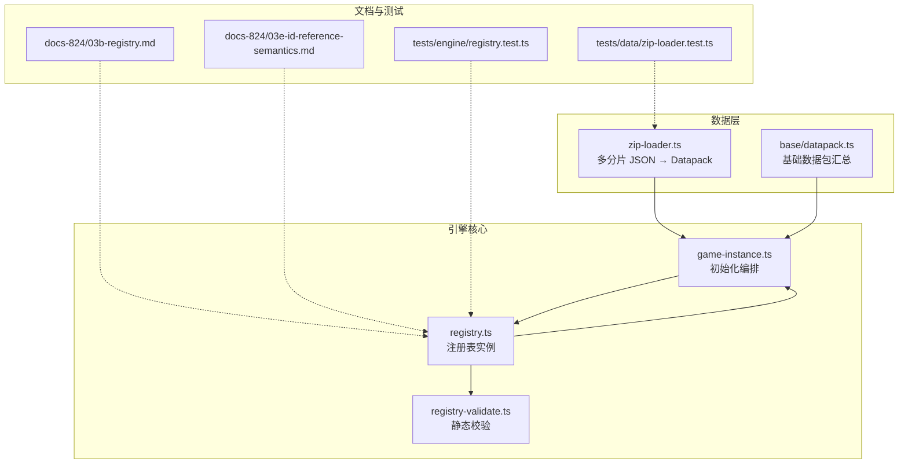
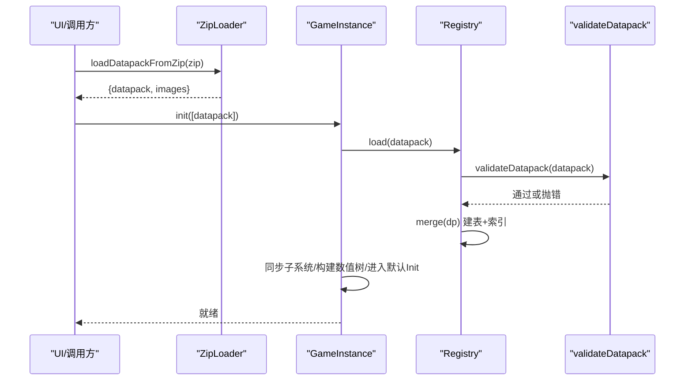
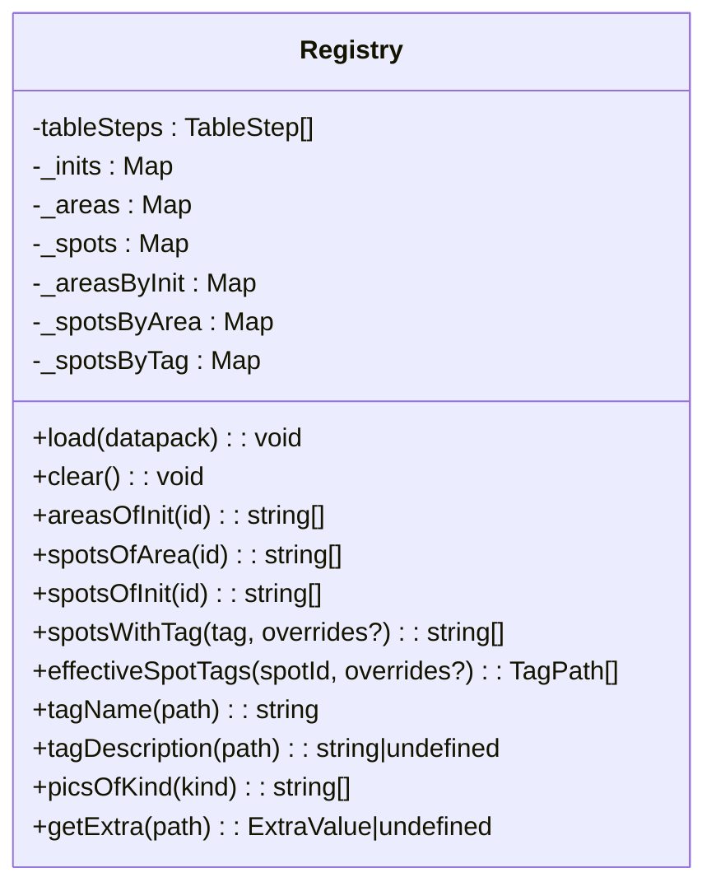
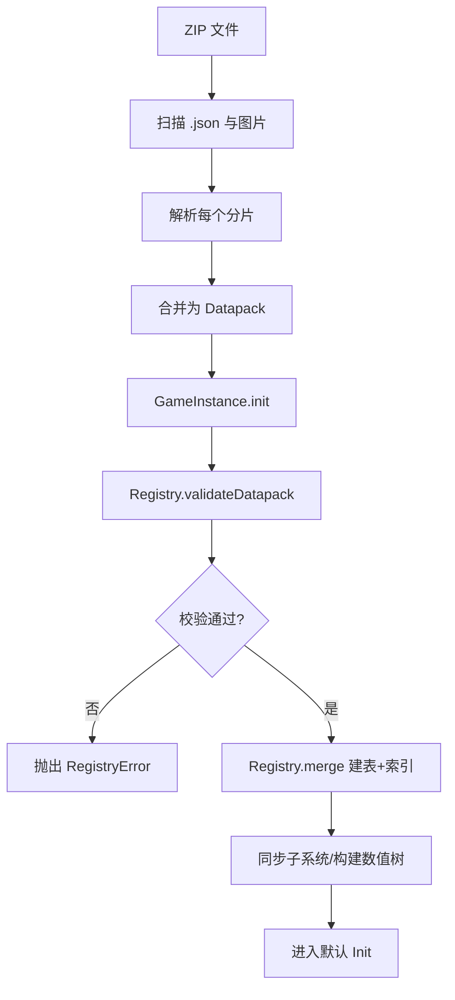
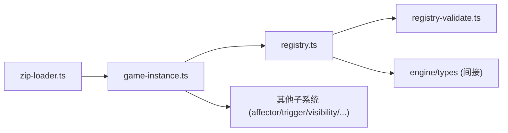

# 注册表系统

<cite>
**本文引用的文件**
- [registry.ts](file://src/engine/registry/registry.ts)
- [registry-validate.ts](file://src/engine/registry/registry-validate.ts)
- [game-instance.ts](file://src/engine/game-instance.ts)
- [zip-loader.ts](file://src/data/zip-loader.ts)
- [datapack.ts](file://src/data/base/datapack.ts)
- [03b-registry.md](file://docs-824/03b-registry.md)
- [03e-id-reference-semantics.md](file://docs-824/03e-id-reference-semantics.md)
- [registry.test.ts](file://tests/engine/registry.test.ts)
- [zip-loader.test.ts](file://tests/data/zip-loader.test.ts)
</cite>

## 目录
1. [简介](#简介)
2. [项目结构](#项目结构)
3. [核心组件](#核心组件)
4. [架构总览](#架构总览)
5. [详细组件分析](#详细组件分析)
6. [依赖关系分析](#依赖关系分析)
7. [性能考量](#性能考量)
8. [故障排查指南](#故障排查指南)
9. [结论](#结论)
10. [附录：使用示例与扩展指南](#附录使用示例与扩展指南)

## 简介
本技术文档围绕 ACProgram 的注册表系统（Registry）展开，系统性说明其设计模式、数据结构、数据加载流程、引用完整性检查机制、查询接口与性能优化策略，并提供注册新实体类型、数据验证、调试与扩展的实践指南。注册表是引擎的“编译态数据容器”，负责将数据包（Datapack）中的声明式内容解析、校验并合并为可被运行时子系统高效访问的结构化索引。

## 项目结构
注册表相关代码主要位于 engine/registry 目录，配合 data 层的压缩包加载器与基础数据包，以及 docs-824 的设计文档和 tests 的行为用例，共同构成完整的数据装配链路。

图表来源
- [zip-loader.ts:1-256](file://src/data/zip-loader.ts#L1-L256)
- [datapack.ts:1-160](file://src/data/base/datapack.ts#L1-L160)
- [game-instance.ts:176-229](file://src/engine/game-instance.ts#L176-L229)
- [registry.ts:59-545](file://src/engine/registry/registry.ts#L59-L545)
- [registry-validate.ts:1-184](file://src/engine/registry/registry-validate.ts#L1-L184)

章节来源
- [zip-loader.ts:1-256](file://src/data/zip-loader.ts#L1-L256)
- [datapack.ts:1-160](file://src/data/base/datapack.ts#L1-L160)
- [game-instance.ts:176-229](file://src/engine/game-instance.ts#L176-L229)
- [registry.ts:59-545](file://src/engine/registry/registry.ts#L59-L545)
- [registry-validate.ts:1-184](file://src/engine/registry/registry-validate.ts#L1-L184)

## 核心组件
- 注册表 Registry：维护多张实体表（Map）、关系索引（Init→Area→Spot、Tag→Spot 前缀索引等），提供只读视图与查询方法；通过 tableSteps 统一 merge/clear，新增表只需在清单中登记。
- 校验器 validateDatapack：纯函数，负责 ID 唯一性、跨表引用完整性、Extra 合法性等，失败抛出 RegistryError。
- 游戏实例 GameInstance：编排 init(datapacks) 流程，依次加载数据包、同步子系统、构建数值树、进入默认 Init。
- 压缩包加载器 ZipLoader：从 ZIP 中扫描 .json 分片，合并为单一 Datapack，并提取图片资产。
- 基础数据包 baseDatapack：聚合引擎内置的 Inits/Areas/Spots/Stories/Items/Enhancements/Characters/GachaPools/ColorGroups/ThemeDesigns/Pics/CharaProfiles/Extras 等。

章节来源
- [registry.ts:59-545](file://src/engine/registry/registry.ts#L59-L545)
- [registry-validate.ts:1-184](file://src/engine/registry/registry-validate.ts#L1-L184)
- [game-instance.ts:176-229](file://src/engine/game-instance.ts#L176-L229)
- [zip-loader.ts:1-256](file://src/data/zip-loader.ts#L1-L256)
- [datapack.ts:1-160](file://src/data/base/datapack.ts#L1-L160)

## 架构总览
注册表系统采用“编译期装配 + 运行期只读”的架构：数据以声明式 JSON 分片形式存在，加载阶段合并为 Datapack，随后由 Registry 进行强校验与索引构建，最终暴露给各子系统只读访问。

图表来源
- [zip-loader.ts:209-242](file://src/data/zip-loader.ts#L209-L242)
- [game-instance.ts:176-229](file://src/engine/game-instance.ts#L176-L229)
- [registry.ts:528-543](file://src/engine/registry/registry.ts#L528-L543)
- [registry-validate.ts:18-184](file://src/engine/registry/registry-validate.ts#L18-L184)

## 详细组件分析

### 注册表 Registry：设计模式与数据结构
- 设计模式
  - 表步骤清单（TableStep）：将每张表的 merge/clear 逻辑集中管理，新增表仅需登记一步，避免散落的分支逻辑。
  - 不可变视图：对外暴露 ReadonlyMap，防止外部修改内部状态。
  - 关系索引：Init→Area→Spot、Spot Tag 前缀索引、按 Kind 的图片索引等，提升查询效率。
- 数据结构
  - 主存储：inits、areas、spots、enhancements、stories、activeStories、passiveStories、items、dropTables、funcletDefs、characters、characterVariants、cultivateCurves、gachaPools、colorGroups、colorEquipments、themeDesigns、chatMessages、resourceDisplays、tagDefs、pics、charaProfiles、extras。
  - 关系索引：_areasByInit、_spotsByArea、_spotsByTag、_picsByKind。
  - 持久化归属配置：characterPersistConfig，决定角色状态块归属（global/init）。
- 关键行为
  - load(datapack)：先校验再合并。
  - clear()：清空所有表与索引。
  - merge(dp)：遍历 tableSteps 执行合并。
  - 查询接口：areasOfInit、spotsOfArea、spotsOfInit、spotsWithTag、effectiveSpotTags、tagName/tagDescription、picsOfKind、getExtra。

图表来源
- [registry.ts:59-545](file://src/engine/registry/registry.ts#L59-L545)

章节来源
- [registry.ts:59-545](file://src/engine/registry/registry.ts#L59-L545)

### 数据加载流程：从 ZIP 到注册表
- 分片合并：ZipLoader 递归扫描 ZIP 内所有 .json，解析为 DatapackFragment，合并 name/version/extras 及列表字段，生成单一 Datapack。
- 图片资产：同时提取图片路径并转为 data URL，供 ImageStore 登记后由 PicDef 引用。
- 注册与校验：GameInstance.init 循环调用 registry.load(dp)，内部先 validateDatapack 再 merge。
- 后续装配：完成注册后，同步值系统、触发器、可见性、数值树、角色系统等，进入默认 Init。

图表来源
- [zip-loader.ts:209-242](file://src/data/zip-loader.ts#L209-L242)
- [game-instance.ts:176-229](file://src/engine/game-instance.ts#L176-L229)
- [registry-validate.ts:18-184](file://src/engine/registry/registry-validate.ts#L18-L184)
- [registry.ts:528-543](file://src/engine/registry/registry.ts#L528-L543)

章节来源
- [zip-loader.ts:1-256](file://src/data/zip-loader.ts#L1-L256)
- [game-instance.ts:176-229](file://src/engine/game-instance.ts#L176-L229)
- [registry-validate.ts:1-184](file://src/engine/registry/registry-validate.ts#L1-L184)
- [registry.ts:528-543](file://src/engine/registry/registry.ts#L528-L543)

### 引用完整性检查机制
- 加载期校验（validateDatapack）
  - ID 唯一性：对 inits、areas、spots、enhancements、stories、active/passive stories、items、dropTables、funcletDefs、characters、resourceDisplays、tags、pics、charaProfiles 等逐一查重。
  - 引用完整性：area.initId 必须存在于 inits；spot.areaId 必须存在于 areas；init.defaultAreas 与 area.defaultSpots 必须存在；StoryEntry.storyId 必须指向 stories。
  - Extra 合法性：各 Def.extra 与 datapack.extras 需符合 ExtraCompound 规则。
- 跨包校验（validateCharacterRefs）
  - 卡池成员/featured 必须对应已定义的 CharacterVariantDef。
  - Variant.curve 必须对应 CultivateCurveDef。
  - ColorEquipment/ThemeDesign 的 colorGroupId 引用必须存在。
- 运行时语义
  - 真引用 vs 意义引用：详见 docs-824/03e，部分引用仅用于身份匹配（如 tags、owner、entityKey），悬空不会报错但无行为；真引用悬空通常会在加载期拦截或运行时软失败。

章节来源
- [registry-validate.ts:18-184](file://src/engine/registry/registry-validate.ts#L18-L184)
- [registry.ts:382-408](file://src/engine/registry/registry.ts#L382-L408)
- [03e-id-reference-semantics.md:1-133](file://docs-824/03e-id-reference-semantics.md#L1-L133)

### 查询接口与性能优化策略
- 查询接口
  - 世界结构：areasOfInit、spotsOfArea、spotsOfInit。
  - 标签查询：spotsWithTag（支持运行时 tag 增撤覆盖）、effectiveSpotTags。
  - 资源与展示：resourceDisplays、tagDefs、tagName、tagDescription。
  - 图片：picsOfKind（按 typeName 段快速枚举）。
  - 常量：getExtra（读取全局 extras 树）。
- 性能优化
  - 预建索引：Init→Area→Spot 链、Spot Tag 前缀索引、Pic by Kind 集合，O(1)/O(k) 查询。
  - 表步骤清单：merge/clear 复用同一清单，降低维护成本与出错概率。
  - 只读视图：对外暴露 ReadonlyMap，避免拷贝与误写。
  - 懒求值：数值系统 buildAll 按需构建 Gain 树，减少启动开销。
  - 事件驱动失效：可见性与统计增量更新，避免每帧全量重算。

章节来源
- [registry.ts:418-526](file://src/engine/registry/registry.ts#L418-L526)
- [game-instance.ts:194-199](file://src/engine/game-instance.ts#L194-L199)

### 错误处理与调试
- 错误类型
  - RegistryError：注册表校验失败（重复 ID、非法引用、非法 Extra 等）。
  - ZipLoadError：ZIP 加载失败（JSON 解析错误、顶层数组、未识别字段等）。
- 调试建议
  - 查看 DevLog：GameInstance 记录加载成功信息与数量统计。
  - 单元测试：registry.test.ts 覆盖基本加载、去重、引用校验、索引构建、extras 合并等场景。
  - 压缩包测试：zip-loader.test.ts 覆盖分片合并、图片提取、错误提示等。

章节来源
- [registry-validate.ts:11-16](file://src/engine/registry/registry-validate.ts#L11-L16)
- [zip-loader.ts:76-85](file://src/data/zip-loader.ts#L76-L85)
- [registry.test.ts:41-268](file://tests/engine/registry.test.ts#L41-L268)
- [zip-loader.test.ts:52-170](file://tests/data/zip-loader.test.ts#L52-L170)

## 依赖关系分析
- 模块耦合
  - GameInstance 组合 Registry、AffectorEngine、TriggerSystem、VisibilityEngine 等子系统，承担装配职责。
  - Registry 依赖 types 定义与 extra 工具，不直接依赖运行时状态。
  - ZipLoader 独立于引擎，仅产出 Datapack 与图片资产。
- 外部依赖
  - JSZip：ZIP 解压与遍历。
  - 类型系统：Datapack、各类 Def、ExtraCompound 等。
- 潜在循环依赖
  - Registry 与 GameInstance 通过构造期装配解耦，无直接循环导入。

图表来源
- [game-instance.ts:176-229](file://src/engine/game-instance.ts#L176-L229)
- [registry.ts:59-545](file://src/engine/registry/registry.ts#L59-L545)
- [zip-loader.ts:1-256](file://src/data/zip-loader.ts#L1-L256)

章节来源
- [game-instance.ts:176-229](file://src/engine/game-instance.ts#L176-L229)
- [registry.ts:59-545](file://src/engine/registry/registry.ts#L59-L545)
- [zip-loader.ts:1-256](file://src/data/zip-loader.ts#L1-L256)

## 性能考量
- 启动阶段
  - 批量合并与一次性索引构建，避免多次重建。
  - 数值系统按需构建，减少冷启动开销。
- 运行阶段
  - 事件驱动的可见性与统计更新，避免每帧全量计算。
  - 标签查询利用前缀索引与运行时覆盖表，保证 O(k) 复杂度。
- 内存与对象
  - 使用 Map/Set 提高查找效率。
  - 只读视图减少拷贝与意外修改。

[本节为通用指导，不直接分析具体文件]

## 故障排查指南
- 常见问题
  - 重复 ID：检查数据包中同表是否存在重复 id。
  - 未知引用：确保 area.initId、spot.areaId、init.defaultAreas、area.defaultSpots、storyEntry.storyId 均有效。
  - Extra 格式错误：确认 Def.extra 与 datapack.extras 符合 ExtraCompound 规则。
  - ZIP 加载失败：确认 JSON 分片顶层为对象且包含至少一个 Datapack 列表字段；避免顶层数组。
- 定位手段
  - 查看异常堆栈与消息（RegistryError/ZipLoadError）。
  - 使用单元测试断言辅助定位（参考 registry.test.ts、zip-loader.test.ts）。
  - 检查 DevLog 输出，确认加载条目数量与阶段。

章节来源
- [registry-validate.ts:18-184](file://src/engine/registry/registry-validate.ts#L18-L184)
- [zip-loader.ts:109-160](file://src/data/zip-loader.ts#L109-L160)
- [registry.test.ts:41-268](file://tests/engine/registry.test.ts#L41-L268)
- [zip-loader.test.ts:52-170](file://tests/data/zip-loader.test.ts#L52-L170)

## 结论
注册表系统通过“表步骤清单 + 关系索引 + 严格校验”的组合，实现了高内聚、低耦合的数据装配与查询能力。其在启动期完成强校验与索引构建，运行期提供稳定高效的只读接口，支撑剧情、区域、物品、角色、抽卡、色彩等多类系统的稳定运行。结合压缩包加载器与基础数据包，形成了可扩展、可验证、可维护的数据管线。

[本节为总结，不直接分析具体文件]

## 附录：使用示例与扩展指南

### 如何注册新类型的实体
- 步骤概览
  - 在 Datapack 中添加新表字段（例如 newEntities: NewEntityDef[]）。
  - 在 Registry 构造函数中新增 TableStep，实现 merge/clear 逻辑，并在私有字段中维护 Map/Set。
  - 如需关系索引，补充相应索引构建逻辑（如 _newByParent、_newByTag）。
  - 暴露只读 getter 与查询方法（如 newEntitiesOfParent(parentId)）。
  - 在 validateDatapack 中增加 ID 唯一性与引用完整性校验。
  - 在 GameInstance.init 中如有需要，同步相关子系统。
- 参考路径
  - 表步骤清单与合并逻辑：[registry.ts:114-319](file://src/engine/registry/registry.ts#L114-L319)
  - 关系索引构建示例（Spot Tag 前缀索引）：[registry.ts:135-147](file://src/engine/registry/registry.ts#L135-L147)
  - 查询接口示例（spotsWithTag/effectiveSpotTags）：[registry.ts:476-517](file://src/engine/registry/registry.ts#L476-L517)
  - 校验入口（validateDatapack）：[registry-validate.ts:18-184](file://src/engine/registry/registry-validate.ts#L18-L184)

章节来源
- [registry.ts:114-319](file://src/engine/registry/registry.ts#L114-L319)
- [registry.ts:476-517](file://src/engine/registry/registry.ts#L476-L517)
- [registry-validate.ts:18-184](file://src/engine/registry/registry-validate.ts#L18-L184)

### 数据验证与测试要点
- 验证点
  - 合法数据包应能正常加载并通过校验。
  - 重复 ID 应被拒绝。
  - 断裂引用（如 area→unknown init）应被拒绝。
  - 层级标签索引应正确命中父级与前缀。
  - extras 扁平键展开与深合并应正确。
- 参考用例
  - 基础加载、去重、引用校验、索引构建、extras 合并与覆盖：[registry.test.ts:41-268](file://tests/engine/registry.test.ts#L41-L268)
  - ZIP 分片合并、图片提取、错误提示：[zip-loader.test.ts:52-170](file://tests/data/zip-loader.test.ts#L52-L170)

章节来源
- [registry.test.ts:41-268](file://tests/engine/registry.test.ts#L41-L268)
- [zip-loader.test.ts:52-170](file://tests/data/zip-loader.test.ts#L52-L170)

### 调试工具与诊断
- 日志与统计
  - GameInstance 记录加载成功信息（数据包数量、init/spot/item 计数）。
- 单元测试
  - 通过断言快速验证加载、校验、索引等行为。
- 可视化
  - 使用 docs-824 文档理解注册表结构与引用语义，辅助定位问题。

章节来源
- [game-instance.ts:224-228](file://src/engine/game-instance.ts#L224-L228)
- [03b-registry.md:1-47](file://docs-824/03b-registry.md#L1-L47)
- [03e-id-reference-semantics.md:1-133](file://docs-824/03e-id-reference-semantics.md#L1-L133)