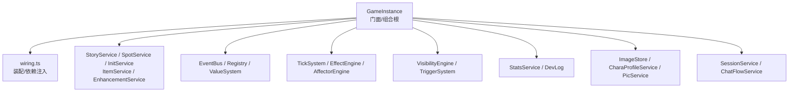
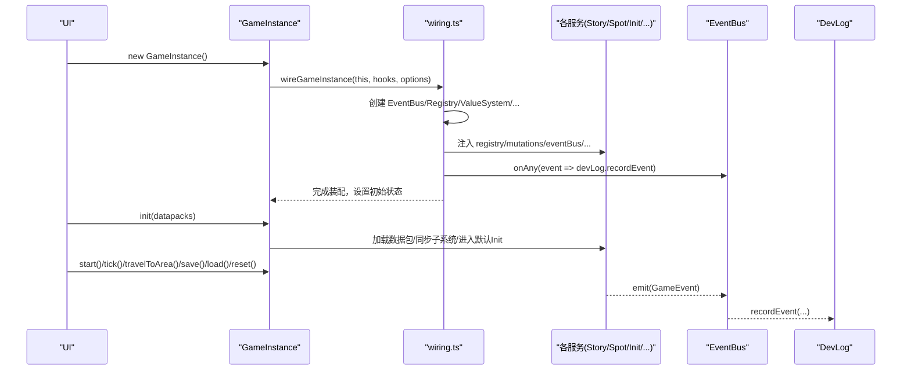
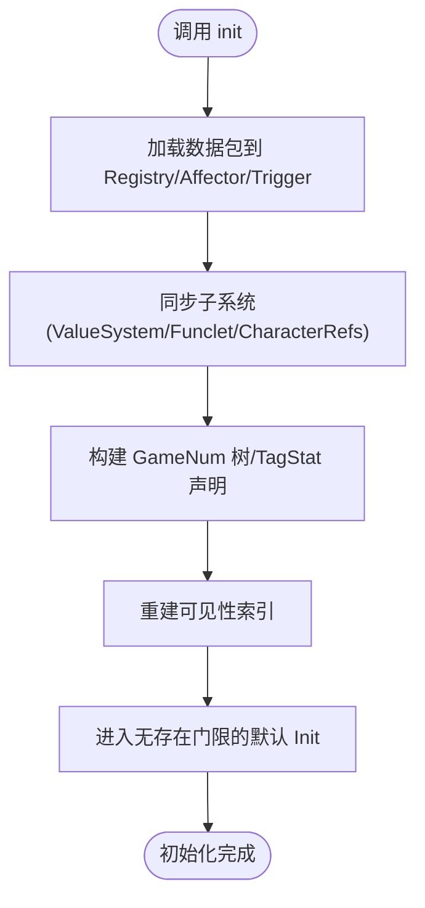
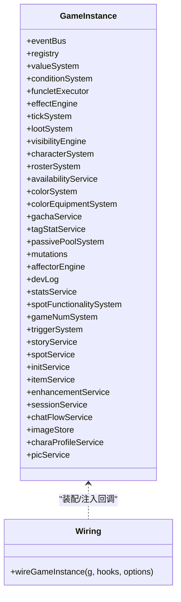
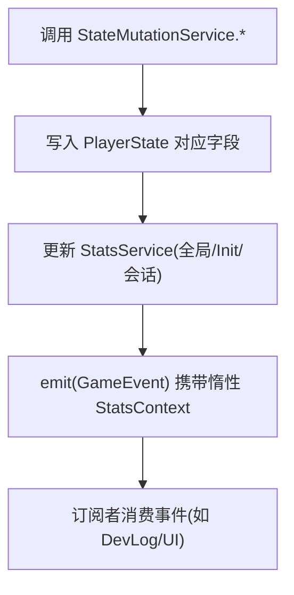
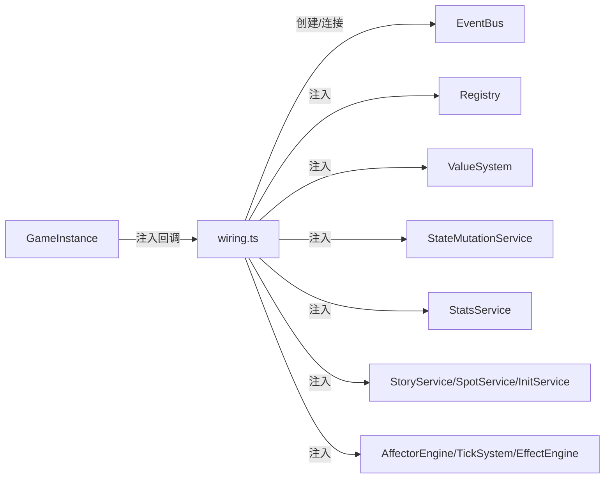

# 游戏实例管理

<cite>
**本文引用的文件**
- [game-instance.ts](file://src/engine/game-instance.ts)
- [wiring.ts](file://src/engine/game/wiring.ts)
- [state.ts](file://src/engine/types/state.ts)
- [state-factory.ts](file://src/engine/game/state-factory.ts)
- [state-mutation-service.ts](file://src/engine/system/state-mutation-service.ts)
- [dev-log.ts](file://src/engine/core/dev-log.ts)
- [stats.ts](file://src/engine/stats/stats.ts)
- [errors.ts](file://src/ui/components/errors.ts)
</cite>

## 目录
1. [简介](#简介)
2. [项目结构](#项目结构)
3. [核心组件](#核心组件)
4. [架构总览](#架构总览)
5. [详细组件分析](#详细组件分析)
6. [依赖关系分析](#依赖关系分析)
7. [性能考量](#性能考量)
8. [故障排查指南](#故障排查指南)
9. [结论](#结论)
10. [附录：使用示例与最佳实践](#附录使用示例与最佳实践)

## 简介
本技术文档围绕 ACProgram 的 GameInstance 类展开，系统性阐述其设计模式（门面模式）、子系统装配机制（依赖注入）、生命周期管理（初始化、运行时状态、销毁/重置）、PlayerState 的状态管理与不可变性保证，以及错误处理、调试工具与性能监控的最佳实践。目标是帮助读者在不深入源码细节的情况下，也能正确创建、配置和使用 GameInstance，并理解引擎内部如何以统一 API 暴露复杂子系统能力。

## 项目结构
GameInstance 位于 engine 层，作为组合根与门面，集中装配各子系统并通过只读别名暴露 Story、Spot、Init、Item、Enhancement、CharaProfile、Pics 等服务接口。子系统装配逻辑被抽离到 wiring.ts，使构造器保持简洁。PlayerState 定义在 types/state.ts，默认状态构建在 state-factory.ts，所有状态变更通过 StateMutationService 统一入口进行，确保事件与统计同步。

图表来源
- [game-instance.ts:74-145](file://src/engine/game-instance.ts#L74-L145)
- [wiring.ts:61-287](file://src/engine/game/wiring.ts#L61-L287)

章节来源
- [game-instance.ts:74-145](file://src/engine/game-instance.ts#L74-L145)
- [wiring.ts:61-287](file://src/engine/game/wiring.ts#L61-L287)

## 核心组件
- GameInstance：组合根与门面，持有全部子系统引用，提供 init/tick/travelToArea/save/load/reset/getView 等统一 API；通过只读 getter 暴露服务门面。
- wiring.ts：负责创建并连接所有子系统，注入回调钩子（getState/setState/refreshVisibility），完成初始状态设置与事件订阅。
- PlayerState：运行时状态的类型定义，包含资源、区域、剧情、角色、主题、额外数据等；配合 InitSnapshot 实现世界线快照。
- StateMutationService：唯一的状态写入入口，封装资源、物品、角色、强化、主题、Extra 等变更，并在变更后发出事件与更新统计。
- StatsService：三层统计（global/init/session）与 DSL 查询，支持惰性上下文构建以降低开销。
- DevLog：运行时日志记录，支持 verbose 模式与导出，用于排障与性能观察。
- errors.ts：面向 UI 的错误码到中文文案映射，便于错误提示。

章节来源
- [game-instance.ts:74-145](file://src/engine/game-instance.ts#L74-L145)
- [wiring.ts:61-287](file://src/engine/game/wiring.ts#L61-L287)
- [state.ts:35-140](file://src/engine/types/state.ts#L35-L140)
- [state-mutation-service.ts:31-101](file://src/engine/system/state-mutation-service.ts#L31-L101)
- [stats.ts:80-119](file://src/engine/stats/stats.ts#L80-L119)
- [dev-log.ts:33-68](file://src/engine/core/dev-log.ts#L33-L68)
- [errors.ts:1-44](file://src/ui/components/errors.ts#L1-L44)

## 架构总览
GameInstance 采用门面模式，将复杂的子系统能力收敛为稳定的 API。UI 层仅依赖 GameInstance，不直接感知子系统内部。wiring.ts 作为组合根，按顺序创建子系统并建立依赖关系，同时注入回调以解耦 GameInstance 与子系统之间的循环依赖。

图表来源
- [wiring.ts:61-287](file://src/engine/game/wiring.ts#L61-L287)
- [game-instance.ts:176-245](file://src/engine/game-instance.ts#L176-L245)
- [dev-log.ts:70-168](file://src/engine/core/dev-log.ts#L70-L168)

## 详细组件分析

### GameInstance 门面与生命周期
- 门面暴露：story/spots/inits/items/enhancements/charaProfiles/pics 等只读别名，屏蔽子系统内部差异。
- 初始化流程：init 中加载数据包、注册数值系统、校验角色引用、重建可见性、进入默认 Init。
- 运行期：start/stop 控制 SessionService；tick 推进 TickSystem、应用 Affector、检查对话空间阻断、记录统计与日志。
- 移动与剧情：travelToArea 执行可达性检查，必要时重新检查学生对话空间阻断。
- 存档与恢复：save/load 通过 SaveCodec 序列化/恢复状态、故事游标、聊天游标、统计等。
- 重置与重载：reset 清空并重建状态；reload 整体替换数据包后重新 init。

图表来源
- [game-instance.ts:176-229](file://src/engine/game-instance.ts#L176-L229)

章节来源
- [game-instance.ts:176-245](file://src/engine/game-instance.ts#L176-L245)
- [game-instance.ts:247-300](file://src/engine/game-instance.ts#L247-L300)
- [game-instance.ts:336-390](file://src/engine/game-instance.ts#L336-L390)

### 子系统装配（wiring.ts 依赖注入）
- 创建基础组件：EventBus、Registry、ValueSystem、ConditionSystem、FuncletExecutor、StatsService、StateMutationService。
- 组装领域服务：CharacterSystem、RosterSystem、AvailabilityService、ColorSystem、ColorEquipmentSystem、GachaService、PassivePoolSystem、AffectorEngine、TickSystem、TriggerSystem、LootSystem、VisibilityEngine、TagStatService、StoryService、SpotService、InitService、ItemService、EnhancementService、ChatFlowService、CharaProfileService、PicService。
- 注入回调：通过 hooks.getState/setState/refreshVisibility 将 GameInstance 的私有状态访问与可见性刷新能力注入到各服务。
- 事件与联动：RuntimeEffectReactor 监听演出事件并分派到 ColorSystem/StoryService/ChatFlowService；ColorUnlockReactor 响应角色差分/flag 变化自动解锁色彩与装备。
- 初始状态：创建默认 PlayerState 并同步至 mutations/stats/affector/trigger。

图表来源
- [wiring.ts:61-287](file://src/engine/game/wiring.ts#L61-L287)
- [game-instance.ts:74-145](file://src/engine/game-instance.ts#L74-L145)

章节来源
- [wiring.ts:61-287](file://src/engine/game/wiring.ts#L61-L287)

### PlayerState 状态管理与不可变性
- 状态类型：PlayerState 集中描述运行时所有可变数据，包括资源、区域、剧情、角色、主题、Extra、冷却、阻断态等。
- 默认状态：createDefaultState 提供纯净初始值，避免未定义字段导致的分支判断。
- 不可变性策略：
  - 对外暴露只读视图：GameInstance.getView 返回 GameView，不包含对 PlayerState 的可变引用。
  - 写路径统一：所有状态变更必须通过 StateMutationService，确保事件与统计同步，避免“旁路修改”导致的不一致。
  - 懒求值与快照：StatsContext 惰性构建，减少高频事件下的拷贝成本；可见性增量更新，不在每帧全量重算。
- 世界线快照：InitSnapshot 保存 per-Init 局部数据，支持软重启与恢复。

图表来源
- [state-mutation-service.ts:31-101](file://src/engine/system/state-mutation-service.ts#L31-L101)
- [state.ts:35-140](file://src/engine/types/state.ts#L35-L140)
- [state-factory.ts:9-30](file://src/engine/game/state-factory.ts#L9-L30)

章节来源
- [state.ts:35-140](file://src/engine/types/state.ts#L35-L140)
- [state-factory.ts:9-30](file://src/engine/game/state-factory.ts#L9-L30)
- [state-mutation-service.ts:31-101](file://src/engine/system/state-mutation-service.ts#L31-L101)

### 错误处理策略
- 领域错误：TravelError、EnhancementPurchaseError 等枚举错误码由 UI 层映射为中文文案，便于用户反馈。
- 运行时异常：StateMutationService 在未知差分或非法参数时抛出错误，确保问题尽早暴露。
- 开发日志：DevLog 记录关键事件与 tick 产出汇总，verbose 模式下输出更细粒度信息，支持导出 JSON 供排障。

章节来源
- [errors.ts:1-44](file://src/ui/components/errors.ts#L1-L44)
- [state-mutation-service.ts:155-161](file://src/engine/system/state-mutation-service.ts#L155-L161)
- [dev-log.ts:33-68](file://src/engine/core/dev-log.ts#L33-L68)

### 调试工具与性能监控
- DevLog：
  - 支持 level/source/frame/details 等多维度记录。
  - recordTick 在非 verbose 模式下节流记录，避免刷屏。
  - export 可导出带时间戳与元数据的日志，便于离线分析。
- StatsService：
  - 提供 evaluate DSL 查询统计值，支持 global/init/currentRun 三种作用域。
  - getContext 惰性构建 StatsContext，降低高频事件开销。
- 可见性与数值系统：
  - 可见性增量更新，不在每帧全量重算。
  - GameNumSystem 构建 primitiveGain 树，跨帧缓存未受影响节点。

章节来源
- [dev-log.ts:70-168](file://src/engine/core/dev-log.ts#L70-L168)
- [stats.ts:80-119](file://src/engine/stats/stats.ts#L80-L119)
- [game-instance.ts:194-199](file://src/engine/game-instance.ts#L194-L199)
- [game-instance.ts:247-261](file://src/engine/game-instance.ts#L247-L261)

## 依赖关系分析
- 耦合与内聚：
  - GameInstance 高内聚地聚合子系统，低耦合地通过只读别名暴露能力。
  - wiring.ts 集中装配，避免 GameInstance 构造器膨胀，提升可维护性。
- 外部依赖：
  - EventBus 作为事件总线，解耦子系统间通信。
  - Registry 提供只读的数据包定义访问。
  - ImageStore/CharaProfileService/PicService 支撑 UI 资源与头像显示。
- 潜在循环依赖：
  - 通过 hooks.getState/setState/refreshVisibility 注入回调，避免 Service 直接反向引用 GameInstance。

图表来源
- [wiring.ts:61-287](file://src/engine/game/wiring.ts#L61-L287)
- [game-instance.ts:74-145](file://src/engine/game-instance.ts#L74-L145)

章节来源
- [wiring.ts:61-287](file://src/engine/game/wiring.ts#L61-L287)
- [game-instance.ts:74-145](file://src/engine/game-instance.ts#L74-L145)

## 性能考量
- 事件驱动精确失效：Tick 过程中 mutation 写路径经事件定向 markDirty，未受影响的 gain 子树跨帧保持缓存。
- 惰性统计上下文：StatsContext 仅在消费方访问时构建，避免每事件深拷贝开销。
- 可见性增量更新：VisibilityEngine 基于事件增量更新，不在每帧全量重算。
- 日志节流：DevLog 在非 verbose 模式下整 30 帧记录一次 tick 汇总，减少 I/O 与渲染压力。
- 数值系统优化：GameNumSystem 构建 primitiveGain 树，按需计算并缓存。

章节来源
- [game-instance.ts:247-261](file://src/engine/game-instance.ts#L247-L261)
- [state-mutation-service.ts:87-101](file://src/engine/system/state-mutation-service.ts#L87-L101)
- [dev-log.ts:158-168](file://src/engine/core/dev-log.ts#L158-L168)
- [stats.ts:91-103](file://src/engine/stats/stats.ts#L91-L103)

## 故障排查指南
- 常见问题定位：
  - 资源不足/条件未满足：查看 UI 错误文案映射（errors.ts）。
  - 未知差分/非法参数：关注 StateMutationService 抛出的错误。
  - 剧情/区域移动失败：结合 TravelError 与 StoryService 的约束检查。
- 调试步骤：
  - 开启 DevLog verbose 模式，获取详细生产与资源变动记录。
  - 使用 StatsService.evaluate 查询当前统计值，验证业务逻辑。
  - 导出 DevLog JSON，结合 frame 与 source 字段定位问题帧与模块。
- 恢复与回滚：
  - 使用 save/load 进行存档/恢复，注意 reload 后旧存档语义可能失效。
  - reset 可快速回到默认状态，便于复现问题。

章节来源
- [errors.ts:1-44](file://src/ui/components/errors.ts#L1-L44)
- [state-mutation-service.ts:155-161](file://src/engine/system/state-mutation-service.ts#L155-L161)
- [dev-log.ts:178-191](file://src/engine/core/dev-log.ts#L178-L191)
- [game-instance.ts:336-390](file://src/engine/game-instance.ts#L336-L390)

## 结论
GameInstance 通过门面模式与依赖注入，将复杂的引擎子系统整合为稳定、易用的 API。PlayerState 的状态管理遵循不可变与单一写入口原则，确保事件与统计的一致性。wiring.ts 作为组合根，清晰组织子系统装配与回调注入。配合 DevLog 与 StatsService，提供了完善的调试与性能监控能力。遵循本文档的最佳实践，可以高效地创建、配置和使用 GameInstance，并保障系统的稳定性与可维护性。

## 附录：使用示例与最佳实践

### 创建与配置 GameInstance
- 创建实例：new GameInstance({ devLog?: DevLogOptions })
- 加载数据包：init(datapacks)
- 启动循环：start()
- 推进一帧：tick()
- 移动区域：travelToArea(areaId, allowDuringStory?, checkAdjacency?)
- 读取视图：getView()
- 存档/恢复：save()/load(saveData)
- 重置：reset()

章节来源
- [game-instance.ts:118-124](file://src/engine/game-instance.ts#L118-L124)
- [game-instance.ts:176-245](file://src/engine/game-instance.ts#L176-L245)
- [game-instance.ts:280-300](file://src/engine/game-instance.ts#L280-L300)
- [game-instance.ts:336-390](file://src/engine/game-instance.ts#L336-L390)

### 状态管理与不可变性最佳实践
- 始终通过 StateMutationService 修改状态，避免绕过写入口。
- 使用 GameInstance.getView() 获取只读视图，不要直接持有 PlayerState 引用。
- 利用 Extra 三层合并视图读写动态数据，保持数据包常量表只读。

章节来源
- [state-mutation-service.ts:31-101](file://src/engine/system/state-mutation-service.ts#L31-L101)
- [game-instance.ts:155-172](file://src/engine/game-instance.ts#L155-L172)

### 错误处理与调试建议
- 使用 errors.ts 中的错误码映射展示用户友好提示。
- 开启 DevLog verbose 模式，结合 frame/source/details 定位问题。
- 使用 StatsService.evaluate 查询统计值，验证业务逻辑是否符合预期。

章节来源
- [errors.ts:1-44](file://src/ui/components/errors.ts#L1-L44)
- [dev-log.ts:33-68](file://src/engine/core/dev-log.ts#L33-L68)
- [stats.ts:105-119](file://src/engine/stats/stats.ts#L105-L119)