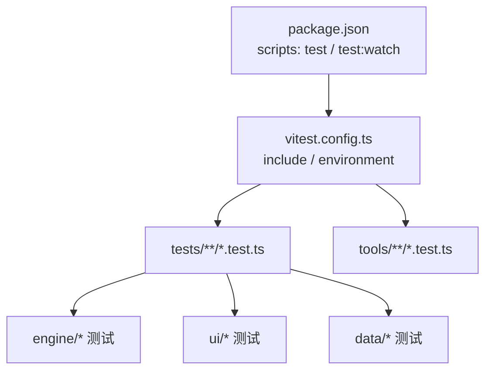
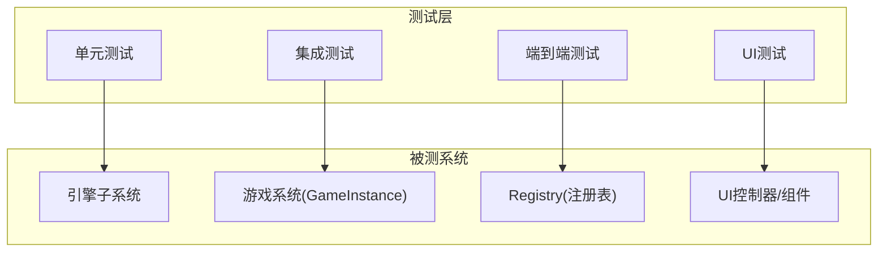
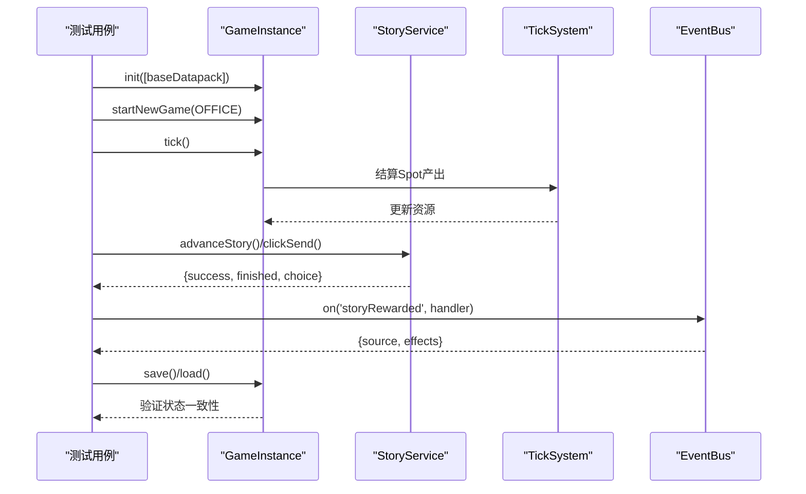
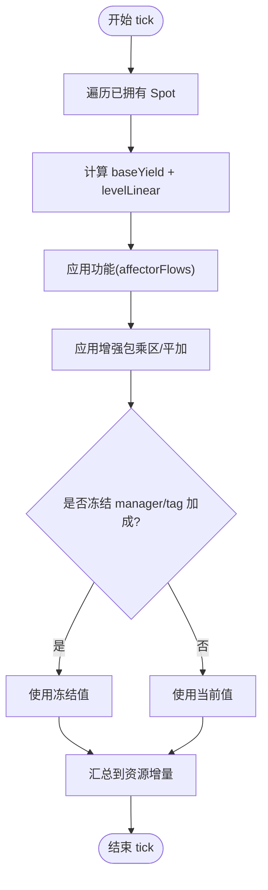
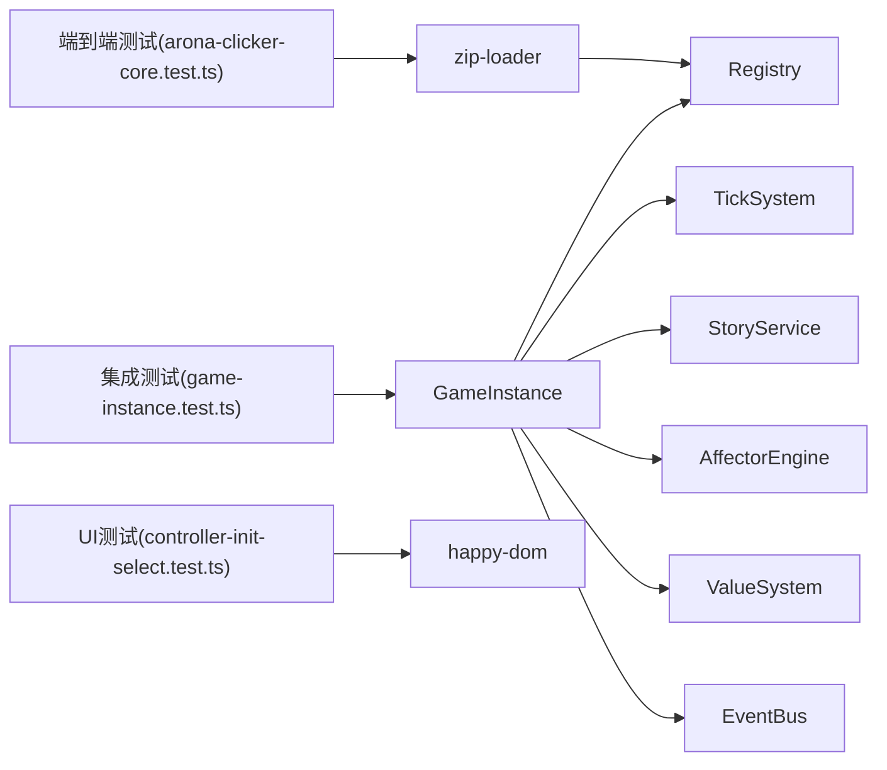

# 测试指南

<cite>
**本文引用的文件**
- [vitest.config.ts](file://vitest.config.ts)
- [package.json](file://package.json)
- [tsconfig.json](file://tsconfig.json)
- [tests/engine/game-instance.test.ts](file://tests/engine/game-instance.test.ts)
- [tests/data/arona-clicker-core.test.ts](file://tests/data/arona-clicker-core.test.ts)
- [tests/engine/story-test-fixtures.ts](file://tests/engine/story-test-fixtures.ts)
- [tests/ui/components/tooltip.test.ts](file://tests/ui/components/tooltip.test.ts)
- [tests/engine/game-num.test.ts](file://tests/engine/game-num.test.ts)
- [tests/engine/character-system.test.ts](file://tests/engine/character-system.test.ts)
- [tests/ui/controller-init-select.test.ts](file://tests/ui/controller-init-select.test.ts)
</cite>

## 目录
1. [简介](#简介)
2. [项目结构](#项目结构)
3. [核心组件](#核心组件)
4. [架构总览](#架构总览)
5. [详细组件分析](#详细组件分析)
6. [依赖关系分析](#依赖关系分析)
7. [性能考量](#性能考量)
8. [故障排查指南](#故障排查指南)
9. [结论](#结论)
10. [附录](#附录)

## 简介
本指南面向ACProgram项目的测试实践，覆盖Vitest配置与使用、测试用例组织、模拟数据准备、单元测试策略（引擎、游戏系统、UI组件）、集成测试（端到端、数据流、性能基准）、测试覆盖率与质量标准，以及持续集成与自动化测试的最佳实践。文档基于仓库现有测试代码与配置进行归纳总结，帮助读者快速上手并建立稳定的质量保障体系。

## 项目结构
- 测试入口与脚本：通过npm脚本统一执行测试，支持运行与监听模式。
- 测试框架：使用Vitest，默认环境为Node；UI相关测试可通过文件级指令切换至happy-dom。
- 测试目录：
  - tests/engine：引擎与游戏系统单元测试与集成测试
  - tests/ui：UI控制器与组件测试
  - tests/data：数据包加载与校验的端到端测试
- 共享夹具：tests/engine/story-test-fixtures.ts提供故事分支/跳转等场景的测试数据与工具函数

图表来源
- [package.json:6-13](file://package.json#L6-L13)
- [vitest.config.ts:3-7](file://vitest.config.ts#L3-L7)

章节来源
- [package.json:6-13](file://package.json#L6-L13)
- [vitest.config.ts:3-7](file://vitest.config.ts#L3-L7)
- [tsconfig.json:1-18](file://tsconfig.json#L1-L18)

## 核心组件
- 测试运行器：Vitest
  - 包含规则：tests/**/*.test.ts 与 tools/**/*.test.ts
  - 默认环境：node
- UI测试环境：在需要DOM环境的测试文件中以文件级指令切换到 happy-dom
- 测试脚本：
  - npm run test：一次性运行所有测试
  - npm run test:watch：监听模式

章节来源
- [vitest.config.ts:3-7](file://vitest.config.ts#L3-L7)
- [package.json:6-13](file://package.json#L6-L13)
- [tests/ui/controller-init-select.test.ts:1-2](file://tests/ui/controller-init-select.test.ts#L1-L2)

## 架构总览
ACProgram的测试分层如下：
- 单元测试：针对数值系统、角色系统、触发器、效果系统等独立模块
- 集成测试：围绕GameInstance，验证初始化、Tick结算、剧情推进、保存/加载、世界线切换等完整流程
- 端到端测试：读取打包后的datapack zip，合并JSON分片并通过Registry校验数据结构完整性
- UI测试：基于happy-dom对UI控制器和组件交互进行测试

[此图为概念性架构图，不直接映射具体源码文件]

## 详细组件分析

### Vitest 设置与环境
- 基础配置：
  - include：匹配 tests 与 tools 下的 .test.ts
  - environment：默认 node
- UI测试环境切换：
  - 在需要DOM的测试文件顶部添加 @vitest-environment happy-dom 指令
- TypeScript支持：
  - tsconfig 启用 DOM 类型，便于编写UI测试

章节来源
- [vitest.config.ts:3-7](file://vitest.config.ts#L3-L7)
- [tests/ui/controller-init-select.test.ts:1-2](file://tests/ui/controller-init-select.test.ts#L1-L2)
- [tsconfig.json:1-18](file://tsconfig.json#L1-L18)

### 测试用例组织与命名约定
- 按领域划分目录：
  - engine：引擎与游戏系统
  - ui：UI控制器与组件
  - data：数据包加载与校验
- 文件名以 .test.ts 结尾，便于Vitest自动收集
- 共享夹具放在非测试文件中（如 story-test-fixtures.ts），避免被重复收集

章节来源
- [vitest.config.ts:3-7](file://vitest.config.ts#L3-L7)
- [tests/engine/story-test-fixtures.ts:1-4](file://tests/engine/story-test-fixtures.ts#L1-L4)

### 模拟数据准备与夹具设计
- 数据包夹具：
  - 使用真实打包产物 arona-clicker-core.zip，验证zip-loader与Registry的整合能力
- 故事分支夹具：
  - 定义多段StoryDef与EntryDef，构造分歧、插入、循环、点击门控等复杂场景
- 精简状态构造：
  - 为系统测试构造最小化PlayerState，隔离变量影响

章节来源
- [tests/data/arona-clicker-core.test.ts:17-33](file://tests/data/arona-clicker-core.test.ts#L17-L33)
- [tests/engine/story-test-fixtures.ts:38-248](file://tests/engine/story-test-fixtures.ts#L38-L248)
- [tests/engine/character-system.test.ts:48-62](file://tests/engine/character-system.test.ts#L48-L62)

### 单元测试策略
- 数值系统（GameNum）：
  - 验证资源树构建、懒求值、缓存失效、标签区聚合、算子扩展、溯源分解
  - 关注点：primitiveGain每tick惰性计算、资源变化事件导致缓存失效、增强包乘区生效与撤销
- 角色系统（CharacterSystem）：
  - 原型元数据查询、按学校/稀有度过滤、解锁语义（roster单一真相来源）、旧协议冻结
- 其他子系统：
  - 触发器、效果、可见性、统计、主题树等均有对应单测覆盖

章节来源
- [tests/engine/game-num.test.ts:21-210](file://tests/engine/game-num.test.ts#L21-L210)
- [tests/engine/game-num.test.ts:212-347](file://tests/engine/game-num.test.ts#L212-L347)
- [tests/engine/character-system.test.ts:70-166](file://tests/engine/character-system.test.ts#L70-L166)

### 集成测试策略（GameInstance）
- 初始化与默认世界线进入
- Tick结算：Spot产出、功能加成、管理器冻结、增强包乘区
- 剧情系统：主动/被动剧情推进、选项页、clickWork多击、奖励发放、事件总线storyRewarded
- 世界线与区域：解锁/购买Init、跨世界线状态隔离、相邻区域移动、锁定区域拒绝
- 保存/加载：全局资源跨Init保留、快照恢复、计时器无关性
- 物品与掉落：发放消耗品、使用消耗品、掉落表入包、挂载增强包

图表来源
- [tests/engine/game-instance.test.ts:24-177](file://tests/engine/game-instance.test.ts#L24-L177)
- [tests/engine/game-instance.test.ts:179-280](file://tests/engine/game-instance.test.ts#L179-L280)
- [tests/engine/game-instance.test.ts:296-347](file://tests/engine/game-instance.test.ts#L296-L347)
- [tests/engine/game-instance.test.ts:357-507](file://tests/engine/game-instance.test.ts#L357-L507)
- [tests/engine/game-instance.test.ts:520-598](file://tests/engine/game-instance.test.ts#L520-L598)
- [tests/engine/game-instance.test.ts:600-684](file://tests/engine/game-instance.test.ts#L600-L684)
- [tests/engine/game-instance.test.ts:686-789](file://tests/engine/game-instance.test.ts#L686-L789)

章节来源
- [tests/engine/game-instance.test.ts:24-789](file://tests/engine/game-instance.test.ts#L24-L789)

### 端到端测试策略（数据包加载与校验）
- 读取打包后的 datapack zip
- 合并JSON分片，断言条目数量与extras键合并
- 通过Registry加载并校验id唯一性、引用完整性、索引正确性
- 验证不同世界线的init/area/spot引用与索引

章节来源
- [tests/data/arona-clicker-core.test.ts:17-106](file://tests/data/arona-clicker-core.test.ts#L17-L106)

### UI组件与控制器测试策略
- 使用happy-dom模拟DOM环境
- 测试UI控制器行为：
  - Init选择页购买后局部刷新、行文本与详情CTA更新
  - 会话面板重置：清空对话空间、聊天流与选中差分
  - 引擎层startNewGame产生的干净per-Init状态
- 组件渲染与文案：
  - 统计DSL转义、条件描述、升级消费展示使用正式文体而非原始id

章节来源
- [tests/ui/controller-init-select.test.ts:13-95](file://tests/ui/controller-init-select.test.ts#L13-L95)
- [tests/ui/components/tooltip.test.ts:20-102](file://tests/ui/components/tooltip.test.ts#L20-L102)

### 复杂逻辑流程图（示例：Tick产出计算）

[此图为概念性流程图，用于说明集成测试中涉及的产出计算路径]

## 依赖关系分析
- 测试对引擎与数据包的依赖：
  - GameInstance 作为集成测试的核心入口，依赖 Registry、TickSystem、StoryService、AffectorEngine、ValueSystem、EventBus 等
  - 数据包通过 baseDatapack 或打包zip提供内容
- UI测试依赖：
  - UIController与组件渲染依赖DOM环境（happy-dom）
- 测试间复用：
  - story-test-fixtures.ts 提供可复用的故事夹具与工具函数

图表来源
- [tests/engine/game-instance.test.ts:24-177](file://tests/engine/game-instance.test.ts#L24-L177)
- [tests/data/arona-clicker-core.test.ts:17-33](file://tests/data/arona-clicker-core.test.ts#L17-L33)
- [tests/ui/controller-init-select.test.ts:1-2](file://tests/ui/controller-init-select.test.ts#L1-L2)

章节来源
- [tests/engine/game-instance.test.ts:24-177](file://tests/engine/game-instance.test.ts#L24-L177)
- [tests/data/arona-clicker-core.test.ts:17-33](file://tests/data/arona-clicker-core.test.ts#L17-L33)
- [tests/ui/controller-init-select.test.ts:1-2](file://tests/ui/controller-init-select.test.ts#L1-L2)

## 性能考量
- 懒求值与缓存：
  - GameNum 的 primitiveGain 每tick惰性计算，减少无关节点评估
  - 资源变化事件会触发生产缓存失效，确保结果正确
- 批量结算：
  - Tick内对所有已拥有Spot进行结算，避免多次全量扫描
- 建议：
  - 在集成测试中尽量复用已有数据包，减少构造成本
  - 对热点路径（如资源增益计算）增加回归用例，防止性能退化

章节来源
- [tests/engine/game-num.test.ts:84-118](file://tests/engine/game-num.test.ts#L84-L118)
- [tests/engine/game-num.test.ts:144-209](file://tests/engine/game-num.test.ts#L144-L209)

## 故障排查指南
- 常见错误与定位：
  - 缺少打包产物：arona-clicker-core.zip不存在时，端到端测试会抛出明确错误信息，需先执行打包脚本
  - 资源不足：购买强化或升级Spot时，若资源不足将返回特定错误码（如 InsufficientResource）
  - 重复购买：强化包重复购买会返回 AlreadyOwned
  - 区域移动限制：不相邻或跨世界线移动会返回 NotAdjacent/NotInThisIt
  - 锁定区域：存在existence门槛的区域会被拒绝访问
- 调试建议：
  - 使用EventBus监听关键事件（如storyRewarded）确认数据流
  - 通过save/load验证状态持久化是否正确
  - 在UI测试中检查DOM节点是否存在与属性是否符合预期

章节来源
- [tests/data/arona-clicker-core.test.ts:20-25](file://tests/data/arona-clicker-core.test.ts#L20-L25)
- [tests/engine/game-instance.test.ts:619-635](file://tests/engine/game-instance.test.ts#L619-L635)
- [tests/engine/game-instance.test.ts:520-598](file://tests/engine/game-instance.test.ts#L520-L598)
- [tests/engine/game-instance.test.ts:233-257](file://tests/engine/game-instance.test.ts#L233-L257)

## 结论
本项目已形成较为完善的测试体系：
- 单元测试覆盖核心算法与系统行为
- 集成测试围绕GameInstance验证完整业务流程
- 端到端测试保证数据包结构与引用完整性
- UI测试确保交互与渲染符合预期
结合Vitest的灵活配置与happy-dom环境切换，能够在Node与浏览器环境中稳定运行。建议在后续迭代中继续完善覆盖率目标与CI自动化，确保质量持续提升。

## 附录

### 运行测试命令
- 一次性运行：npm run test
- 监听模式：npm run test:watch

章节来源
- [package.json:6-13](file://package.json#L6-L13)

### 覆盖率要求与质量标准（建议）
- 覆盖率基线：
  - 语句覆盖率 ≥ 80%
  - 分支覆盖率 ≥ 70%
  - 函数覆盖率 ≥ 80%
  - 行覆盖率 ≥ 80%
- 质量标准：
  - 新增/修改逻辑必须配套单测或集成测试
  - 涉及状态变更的流程需有保存/加载回归用例
  - UI交互需有DOM环境下的行为断言
- 报告输出：
  - 在CI中生成HTML覆盖率报告，便于审查

[本节为通用建议，不直接引用具体源码文件]

### 持续集成与自动化测试（建议）
- CI流水线：
  - 安装依赖 → 运行测试 → 生成覆盖率报告
- 并行执行：
  - 利用Vitest并行能力加速测试
- 失败重试：
  - 对不稳定用例配置重试策略
- 门禁规则：
  - 覆盖率低于阈值则阻断合并

[本节为通用建议，不直接引用具体源码文件]