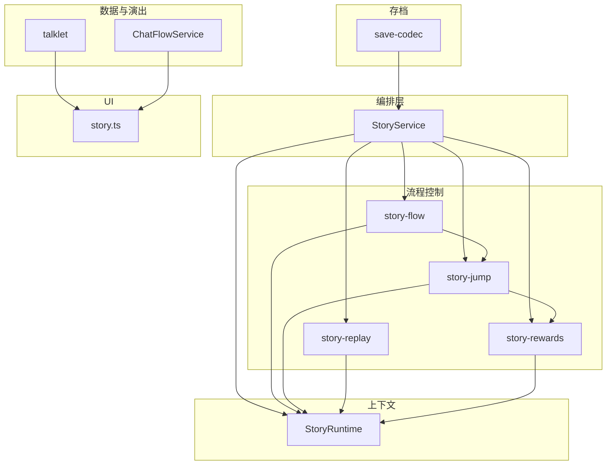
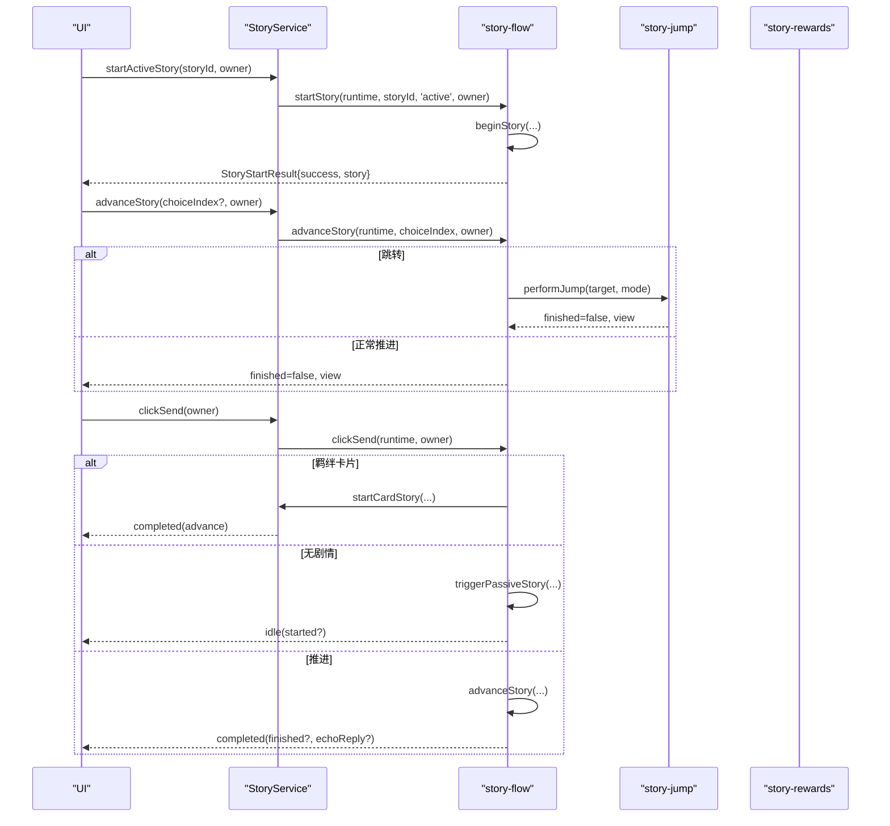
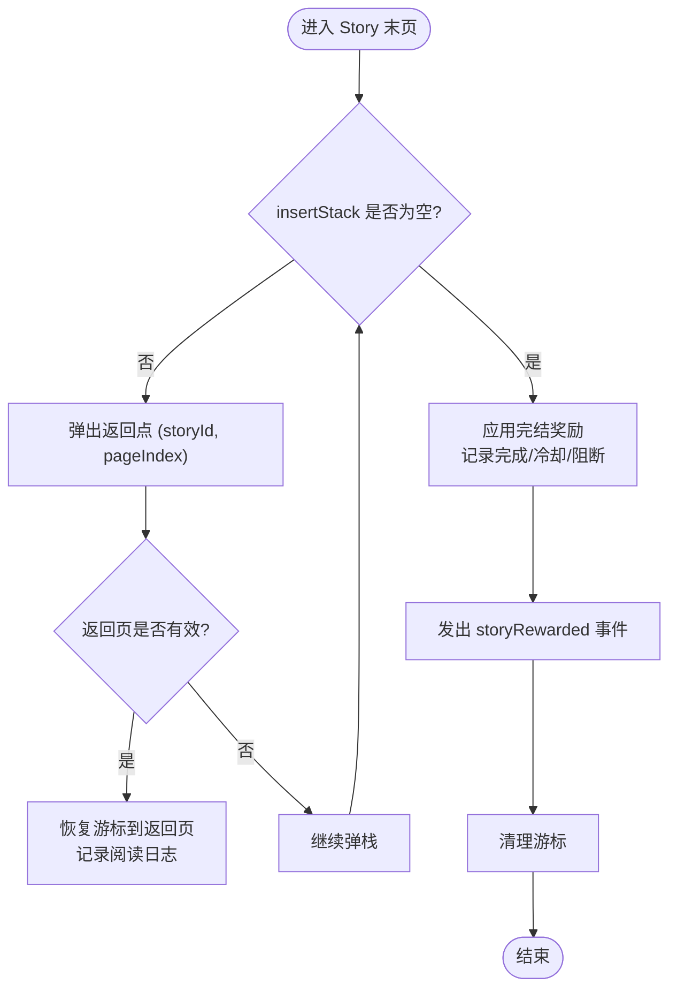
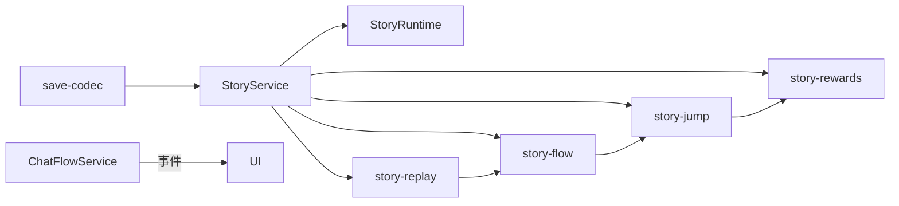

# 剧情系统

<cite>
**本文引用的文件**
- [story-service.ts](file://src/engine/game/story-service.ts)
- [story-cursor-state.ts](file://src/engine/game/story-cursor-state.ts)
- [story-flow.ts](file://src/engine/game/story-flow.ts)
- [story-jump.ts](file://src/engine/game/story-jump.ts)
- [story-replay.ts](file://src/engine/game/story-replay.ts)
- [story-rewards.ts](file://src/engine/game/story-rewards.ts)
- [story-context.ts](file://src/engine/game/story-context.ts)
- [talklet.ts](file://src/engine/def-factory/talklet.ts)
- [chat-flow-service.ts](file://src/engine/game/chat-flow-service.ts)
- [save-codec.ts](file://src/engine/game/save-codec.ts)
- [story.ts](file://src/ui/components/story.ts)
</cite>

## 目录
1. [简介](#简介)
2. [项目结构](#项目结构)
3. [核心组件](#核心组件)
4. [架构总览](#架构总览)
5. [详细组件分析](#详细组件分析)
6. [依赖关系分析](#依赖关系分析)
7. [性能考量](#性能考量)
8. [故障排查指南](#故障排查指南)
9. [结论](#结论)
10. [附录：API 参考](#附录api-参考)

## 简介
本技术文档围绕 ACProgram 的“剧情系统”展开，聚焦以下目标：
- StoryService 剧情服务的设计与职责边界：游标持有、移动规则、对外 API 委托。
- 剧情流程控制：启动、推进、跳转、重放、完结奖励与冷却。
- 分支剧情实现：分歧点准入守卫（branchGuards）与重阅读模式。
- 演出效果管理：Talklet 对话渲染、选项处理、聊天流事件桥接。
- StoryCursorState 游标状态机制：全局游标与聊天沙盒游标的并行处理。
- 存档机制：游标快照、读档兼容、多沙盒恢复。
- 性能优化策略与常见问题解决方案。

## 项目结构
剧情系统位于 engine/game 目录下，采用“编排层 + 子模块”拆分：
- 编排层：StoryService（对外门面、游标访问、移动规则）。
- 流程控制：story-flow（启动/推进/发送）、story-jump（跳转链/收尾）、story-replay（重读/守卫）、story-rewards（完结奖励/冷却/对话阻断）。
- 运行时上下文：story-context（跨模块只读视图，避免循环依赖）。
- 数据定义：talklet（Talklet 构建器）。
- 演出桥接：chat-flow-service（将效果转为 UI 事件）。
- 存档：save-codec（序列化/反序列化，含游标与聊天沙盒）。
- UI 渲染：story.ts（对话气泡、旁白、羁绊卡片、覆盖文本等）。



图表来源
- [story-service.ts:52-84](file://src/engine/game/story-service.ts#L52-L84)
- [story-flow.ts:26-104](file://src/engine/game/story-flow.ts#L26-L104)
- [story-jump.ts:17-42](file://src/engine/game/story-jump.ts#L17-L42)
- [story-replay.ts:32-43](file://src/engine/game/story-replay.ts#L32-L43)
- [story-rewards.ts:14-32](file://src/engine/game/story-rewards.ts#L14-L32)
- [story-context.ts:28-49](file://src/engine/game/story-context.ts#L28-L49)
- [talklet.ts:10-139](file://src/engine/def-factory/talklet.ts#L10-L139)
- [chat-flow-service.ts:15-37](file://src/engine/game/chat-flow-service.ts#L15-L37)
- [save-codec.ts:61-79](file://src/engine/game/save-codec.ts#L61-L79)

章节来源
- [story-service.ts:1-271](file://src/engine/game/story-service.ts#L1-L271)
- [story-flow.ts:1-410](file://src/engine/game/story-flow.ts#L1-L410)
- [story-jump.ts:1-109](file://src/engine/game/story-jump.ts#L1-L109)
- [story-replay.ts:1-44](file://src/engine/game/story-replay.ts#L1-L44)
- [story-rewards.ts:1-62](file://src/engine/game/story-rewards.ts#L1-L62)
- [story-context.ts:1-50](file://src/engine/game/story-context.ts#L1-L50)
- [talklet.ts:1-139](file://src/engine/def-factory/talklet.ts#L1-L139)
- [chat-flow-service.ts:1-38](file://src/engine/game/chat-flow-service.ts#L1-L38)
- [save-codec.ts:1-172](file://src/engine/game/save-codec.ts#L1-L172)
- [story.ts:1-313](file://src/ui/components/story.ts#L1-L313)

## 核心组件
- StoryService：剧情服务编排层，负责游标持有与访问（全局/聊天沙盒）、移动规则、对外 API 委托；通过 StoryRuntime 注入协作能力。
- StoryCursorState：单一剧情游标状态（纯数据），字段与存档结构一一对应，支持 save/restore。
- story-flow：剧情启动/推进/发送主流程，包含 beginStory、startStory、triggerPassiveStory、advanceStory、clickSend、getSendState、getCurrentStoryView、trackFlagsAndApply、applyStoryTravel。
- story-jump：goto/insert 跳转链与完结收尾，含 MAX_JUMP_DEPTH 深度保护。
- story-replay：重阅读入口与分歧点准入守卫检查。
- story-rewards：完结奖励评估（conditional/simple）、被动闲聊冷却记录、对话空间阻断。
- talklet：Talklet 定义链式 Builder，提供 line/narrate/click/kizunaCard/jump 等构造方法。
- chat-flow-service：将 showChatText/clearAll/clearId 等效果转译为 UI 事件。
- save-codec：存档序列化/反序列化，包含游标与聊天沙盒恢复。
- UI story.ts：对话气泡、旁白、羁绊卡片、覆盖文本渲染与错误文案映射。

章节来源
- [story-service.ts:52-271](file://src/engine/game/story-service.ts#L52-L271)
- [story-cursor-state.ts:1-96](file://src/engine/game/story-cursor-state.ts#L1-L96)
- [story-flow.ts:26-410](file://src/engine/game/story-flow.ts#L26-L410)
- [story-jump.ts:13-109](file://src/engine/game/story-jump.ts#L13-L109)
- [story-replay.ts:11-44](file://src/engine/game/story-replay.ts#L11-L44)
- [story-rewards.ts:9-62](file://src/engine/game/story-rewards.ts#L9-L62)
- [talklet.ts:10-139](file://src/engine/def-factory/talklet.ts#L10-L139)
- [chat-flow-service.ts:15-37](file://src/engine/game/chat-flow-service.ts#L15-L37)
- [save-codec.ts:22-172](file://src/engine/game/save-codec.ts#L22-L172)
- [story.ts:5-313](file://src/ui/components/story.ts#L5-L313)

## 架构总览
StoryService 作为门面，维护全局游标与若干聊天沙盒游标（按 owner 分区），所有剧情操作都落在某个游标实例上。子模块通过 StoryRuntime 共享只读视图，避免循环依赖。

```mermaid
classDiagram
class StoryService {
-globalCursor : StoryCursorState
-chatCursors : Map<string, StoryCursorState>
-flagsSetThisStory : Set<string>
-lastRewarded : RewardsSettlement
+startActiveStory(storyId, owner)
+startCardStory(storyId, owner)
+startStory(storyId, expectedType, owner, opts)
+triggerPassiveStory(initId, owner)
+replayStory(storyId, owner)
+advanceStory(choiceIndex, owner)
+getSendState(owner)
+clickSend(owner)
+getCurrentStoryView(owner)
-cursorFor(owner)
-entryById(id)
-storyOf(entry)
-currentPage(cur)
-guardPrereqsMet(guard)
}
class StoryCursorState {
+currentStoryEntryId : string|null
+currentStoryDefId : string|null
+currentStoryPageIndex : number
+currentStoryChoiceIndex : number
+talkletClickWork : {total : number;done : number}|null
+insertStack : {storyId : string;pageIndex : number}[]
+visitedStoryIds : string[]
+jumpDepth : number
+isReplay : boolean
+choiceTextConfirmed : boolean
+save() : StoryCursor
+restore(cursor)
+clear()
}
class StoryRuntime {
<<interface>>
+registry
+conditionSystem
+effectEngine
+mutations
+eventBus
+passivePools
+travelToArea(areaId, allowDuringStory, checkAdjacency)
+getState()
+cursorFor(owner)
+entryById(id)
+storyOf(entry)
+currentPage(cur)
+hasCompletedStory(id)
+getView(owner)
+guardPrereqsMet(guard)
+flagsSetThisStory : Set<string>
+lastRewarded : {value : RewardsSettlement}
}
StoryService --> StoryCursorState : "持有全局+沙盒游标"
StoryService --> StoryRuntime : "注入运行时视图"
```

图表来源
- [story-service.ts:52-84](file://src/engine/game/story-service.ts#L52-L84)
- [story-cursor-state.ts:28-96](file://src/engine/game/story-cursor-state.ts#L28-L96)
- [story-context.ts:28-49](file://src/engine/game/story-context.ts#L28-L49)

章节来源
- [story-service.ts:52-271](file://src/engine/game/story-service.ts#L52-L271)
- [story-cursor-state.ts:28-96](file://src/engine/game/story-cursor-state.ts#L28-L96)
- [story-context.ts:28-49](file://src/engine/game/story-context.ts#L28-L49)

## 详细组件分析

### StoryService 剧情服务
- 职责：
  - 游标持有与访问：全局游标用于 active 主线/一般闲聊；聊天沙盒游标按 owner 分区，互不打断。
  - 移动规则：isBlockingMovement、clearPassiveIfPlaying。
  - 对外 API：startActiveStory、startCardStory、startStory、triggerPassiveStory、replayStory、advanceStory、getSendState、clickSend、getCurrentStoryView。
- 关键设计：
  - cursorFor(owner) 惰性创建聊天沙盒游标，key = variant:<owner>。
  - flagsSetThisStory 记录本次剧情设置 flag，完成时随 storyRewarded 通知 UI。
  - lastRewarded 包装引用，供 resolveStoryEnd 读取并清空。

章节来源
- [story-service.ts:31-104](file://src/engine/game/story-service.ts#L31-L104)
- [story-service.ts:106-176](file://src/engine/game/story-service.ts#L106-L176)
- [story-service.ts:178-253](file://src/engine/game/story-service.ts#L178-L253)

### StoryCursorState 游标状态
- 字段说明：
  - currentStoryEntryId：当前 Entry.id（对外故事 id，跳转链中不变）。
  - currentStoryDefId：当前实际播放的 Story.id（跳转链中可变）。
  - currentStoryPageIndex / currentStoryChoiceIndex：页与选项索引。
  - talkletClickWork：点击工作进度（多击任务）。
  - insertStack：insert 跳转返回点栈。
  - visitedStoryIds：本 Entry 链已访问过的 Story.id（去重）。
  - jumpDepth：累计跳转深度（上限 MAX_JUMP_DEPTH）。
  - isReplay：重阅读模式标志。
  - choiceTextConfirmed：选项页文本确认状态。
- 行为：
  - empty/clear：判断与重置。
  - save/restore：与存档结构一致，兼容旧档缺失字段。

章节来源
- [story-cursor-state.ts:11-96](file://src/engine/game/story-cursor-state.ts#L11-L96)

### 剧情流程控制（启动/推进/发送）
- 启动 startStory：
  - 校验类型、条件、已完成态；active 可打断 passive；force 模式允许系统级重放。
  - beginStory 初始化游标、记录首条阅读日志、发出 storyTriggered 事件。
- 推进 advanceStory：
  - 校验选择项与条件；执行页/选项效果；记录阅读日志；处理 goto/insert；正常推进或完结。
  - 重阅读模式：在跳转前检查 branchGuards，不满足则拒绝且不产生副作用。
- 发送 clickSend：
  - 无剧情时尝试触发被动闲聊；有羁绊卡片时启动目标 ActiveStoryEntry；否则推进并回显回复。
  - 多击任务：按 total/done 推进，完成后继续推进。
- 视图 getCurrentStoryView：
  - 返回当前 Talklet 及可用选项索引列表。



图表来源
- [story-service.ts:178-228](file://src/engine/game/story-service.ts#L178-L228)
- [story-flow.ts:54-104](file://src/engine/game/story-flow.ts#L54-L104)
- [story-flow.ts:133-221](file://src/engine/game/story-flow.ts#L133-L221)
- [story-flow.ts:285-352](file://src/engine/game/story-flow.ts#L285-L352)
- [story-jump.ts:17-42](file://src/engine/game/story-jump.ts#L17-L42)

章节来源
- [story-flow.ts:26-104](file://src/engine/game/story-flow.ts#L26-L104)
- [story-flow.ts:133-221](file://src/engine/game/story-flow.ts#L133-L221)
- [story-flow.ts:285-352](file://src/engine/game/story-flow.ts#L285-L352)
- [story-jump.ts:17-42](file://src/engine/game/story-jump.ts#L17-L42)

### 跳转链与完结收尾
- performJump：
  - 深度限制（MAX_JUMP_DEPTH=32），防止误写循环跳转/超深嵌套。
  - goto：直接切换至目标 Story 首页；insert：压入返回点栈后跳转。
  - 记录 visitedStoryIds 与首页阅读日志。
- resolveStoryEnd：
  - 若 insertStack 非空，弹栈返回原 Story 下一页；若末页则继续弹栈或完结。
  - 链完结：应用 completionReward（conditional/simple），写入 storyLog，被动闲聊记录冷却与对话阻断，发出 storyRewarded 事件（含 effects 与 flags）。



图表来源
- [story-jump.ts:17-42](file://src/engine/game/story-jump.ts#L17-L42)
- [story-jump.ts:48-109](file://src/engine/game/story-jump.ts#L48-L109)
- [story-rewards.ts:14-32](file://src/engine/game/story-rewards.ts#L14-L32)
- [story-rewards.ts:38-62](file://src/engine/game/story-rewards.ts#L38-L62)

章节来源
- [story-jump.ts:13-109](file://src/engine/game/story-jump.ts#L13-L109)
- [story-rewards.ts:9-62](file://src/engine/game/story-rewards.ts#L9-L62)

### 重阅读与分歧点准入守卫
- replayStory：
  - 仅检查 entry.replayable 与无进行中剧情；不受 triggerCondition/availableInits/AlreadyCompleted 限制。
  - 进入重阅读模式（isReplay=true），推进到受 branchGuards 保护的分歧跳转时，若玩家缺少指定前置阅读记录，则拒绝（BranchGuardDenied）。
- guardPrereqsMet：
  - prerequisites 中每个条目要求特定 storyId 的特定 talkletIndex 已读；talkletIndex=-1 表示整条 Story 全部已读。

章节来源
- [story-replay.ts:11-44](file://src/engine/game/story-replay.ts#L11-L44)

### 演出效果管理与聊天流桥接
- trackFlagsAndApply：
  - 记录 setFlag（flagsSetThisStory），跳过 travelToArea（单独处理）。
  - 调用 effectEngine.applyEffects 执行其余效果。
- applyStoryTravel：
  - 执行 travelToArea effect（不受玩家移动限制，checkAdjacency=false），成功且 notice=true 时发出 storyAreaTraveled 事件。
- ChatFlowService：
  - clearAll/clearAllTexts/showText/clearId：将效果转译为 UI 事件（chatFlowCleared/chatTextClearedAll/chatTextShown/chatTextCleared）。

章节来源
- [story-flow.ts:386-410](file://src/engine/game/story-flow.ts#L386-L410)
- [chat-flow-service.ts:15-37](file://src/engine/game/chat-flow-service.ts#L15-L37)

### Talklet 对话系统与 UI 渲染
- TalkletBuilder：
  - 提供 line/narrate/click/kizunaCard/jump/choice/choiceJump/effects/reply/mute/side/noAvatar/image 等链式构造方法。
- UI 渲染（story.ts）：
  - 对话气泡（左侧 NPC/右侧玩家）、旁白（center/left/right）、羁绊卡片（yuzu-kizuna 风格）、覆盖文本（title/badge/note/kizuna）。
  - 头像优先级：talklet 图片 > 角色 ColorGroup 抽象头像 > 首字母占位；图片加载失败回退占位。
  - 错误文案映射：AlreadyActive/AlreadyCompleted/BranchGuardDenied 等。

章节来源
- [talklet.ts:10-139](file://src/engine/def-factory/talklet.ts#L10-L139)
- [story.ts:5-313](file://src/ui/components/story.ts#L5-L313)

### 存档机制
- SaveData 包含：
  - playerState、visibility、pendingStoryId/PageIndex/ChoiceIndex/TalkletClicks/DefId/InsertStack/VisitedStoryIds/IsReplay、chatCursors、stats。
- buildSaveData：
  - 从 StoryService 导出全局游标与聊天沙盒游标快照。
- restoreFromSave：
  - 恢复 PlayerState、Visibility、Stats、Init Triggers、Story 游标（兼容旧档缺失字段）、聊天沙盒游标、Session 时间戳，并重同步各子系统。

章节来源
- [save-codec.ts:22-79](file://src/engine/game/save-codec.ts#L22-L79)
- [save-codec.ts:125-172](file://src/engine/game/save-codec.ts#L125-L172)
- [story-service.ts:122-150](file://src/engine/game/story-service.ts#L122-L150)

## 依赖关系分析
- StoryService 依赖：
  - Registry、ConditionSystem、EffectEngine、StateMutationService、EventBus、PassivePoolSystem。
  - 通过 StoryRuntime 向子模块暴露只读视图，避免循环依赖。
- 子模块耦合：
  - story-flow 依赖 story-jump、story-replay、story-rewards 的局部功能。
  - story-jump 依赖 story-rewards 的完结奖励与冷却逻辑。
  - story-replay 依赖 story-flow 的 beginStory。
- 外部集成：
  - ChatFlowService 通过 EventBus 与 UI 解耦。
  - save-codec 与 StoryService 交互进行存档/读档。



图表来源
- [story-service.ts:52-84](file://src/engine/game/story-service.ts#L52-L84)
- [story-flow.ts:26-104](file://src/engine/game/story-flow.ts#L26-L104)
- [story-jump.ts:17-42](file://src/engine/game/story-jump.ts#L17-L42)
- [story-replay.ts:32-43](file://src/engine/game/story-replay.ts#L32-L43)
- [story-rewards.ts:14-32](file://src/engine/game/story-rewards.ts#L14-L32)
- [chat-flow-service.ts:15-37](file://src/engine/game/chat-flow-service.ts#L15-L37)
- [save-codec.ts:61-79](file://src/engine/game/save-codec.ts#L61-L79)

章节来源
- [story-service.ts:52-271](file://src/engine/game/story-service.ts#L52-L271)
- [story-flow.ts:26-410](file://src/engine/game/story-flow.ts#L26-L410)
- [story-jump.ts:17-109](file://src/engine/game/story-jump.ts#L17-L109)
- [story-replay.ts:32-44](file://src/engine/game/story-replay.ts#L32-L44)
- [story-rewards.ts:14-62](file://src/engine/game/story-rewards.ts#L14-L62)
- [chat-flow-service.ts:15-37](file://src/engine/game/chat-flow-service.ts#L15-L37)
- [save-codec.ts:61-172](file://src/engine/game/save-codec.ts#L61-L172)

## 性能考量
- 跳转深度保护：MAX_JUMP_DEPTH=32，防止内容作者误写导致无限跳转或过深嵌套。
- 游标惰性创建：聊天沙盒游标按 owner 惰性创建，减少内存占用。
- 效果批量处理：trackFlagsAndApply 过滤 travelToArea，单独处理以减少重复逻辑。
- 阅读日志增量记录：beginStory/advanceStory/performJump/resolveStoryEnd 均按需记录，避免全量扫描。
- 被动闲聊池剪枝：抽选时基于 cooldowns/blocks 剪枝，减少无效抽取。

[本节为通用性能讨论，无需具体文件分析]

## 故障排查指南
- 常见错误码与含义（UI 映射）：
  - AlreadyActive：已有剧情流程进行中。
  - AlreadyCompleted：该剧情已经完成。
  - BranchGuardDenied：分歧点准入条件未满足。
  - ChoiceConditionNotMet：当前选择条件未满足。
  - ChoiceRequired：请先选择一个回应。
  - ClickRequired：请先完成本页点击再继续。
  - ConditionNotMet：剧情条件未满足。
  - InvalidChoice：选择无效。
  - JumpLimitExceeded：跳转链过深，演出已终止。
  - NoActiveStory：当前没有进行中的剧情。
  - NoAvailableStory：当前没有可触发的被动剧情。
  - NotFound：找不到剧情数据。
  - NotReplayable：该剧情不可重阅读。
  - WrongStoryType：剧情类型不匹配。
- 排查步骤：
  - 检查当前游标是否为空（NoActiveStory）。
  - 检查 Entry 是否存在与类型匹配（NotFound/WrongStoryType）。
  - 检查条件组与 availableInits（ConditionNotMet/ChoiceConditionNotMet）。
  - 检查分支守卫 prerequisites（BranchGuardDenied）。
  - 检查点击工作进度（ClickRequired）。
  - 检查跳转深度（JumpLimitExceeded）。
  - 检查已完成态与 repeatable（AlreadyCompleted）。

章节来源
- [story.ts:5-20](file://src/ui/components/story.ts#L5-L20)
- [story-flow.ts:54-104](file://src/engine/game/story-flow.ts#L54-L104)
- [story-flow.ts:133-221](file://src/engine/game/story-flow.ts#L133-L221)
- [story-jump.ts:17-42](file://src/engine/game/story-jump.ts#L17-L42)
- [story-replay.ts:32-44](file://src/engine/game/story-replay.ts#L32-L44)

## 结论
ACProgram 的剧情系统以 StoryService 为核心，通过 StoryRuntime 将流程控制、跳转链、重阅读、奖励结算等子模块解耦，配合 StoryCursorState 的全局/聊天沙盒双游标机制，实现了并行互不打断的对话空间。Talklet 构建器与 UI 渲染管线提供了灵活的对话表达与交互体验。存档机制确保游标与聊天历史的可恢复性。整体设计兼顾可扩展性、可维护性与性能。

[本节为总结，无需具体文件分析]

## 附录：API 参考
- StoryService 公开方法
  - startActiveStory(storyId, owner?): StoryStartResult
  - startCardStory(storyId, owner?): StoryStartResult
  - startStory(storyId, expectedType, owner?, opts?): StoryStartResult
  - triggerPassiveStory(initId?, owner?): StoryStartResult
  - replayStory(storyId, owner?): StoryStartResult
  - advanceStory(choiceIndex?, owner?): StoryAdvanceResult
  - getSendState(owner?): SendState
  - clickSend(owner?): SendResult
  - getCurrentStoryView(owner?): StoryView | null
- 参数与返回值说明
  - storyId：StoryEntry.id（对外故事 id）。
  - owner：聊天沙盒 owner（VariantId），省略/null 使用全局游标。
  - expectedType：'active' | 'passive'。
  - opts：{ force?: boolean; skipConditions?: boolean }。
  - choiceIndex：选项索引（当页面存在 choices 时必需）。
  - initId：当前世界线（默认 state.activeInit）。
- 错误码
  - 见“故障排查指南”中的错误码与含义。

章节来源
- [story-service.ts:178-228](file://src/engine/game/story-service.ts#L178-L228)
- [story-flow.ts:54-104](file://src/engine/game/story-flow.ts#L54-L104)
- [story-flow.ts:133-221](file://src/engine/game/story-flow.ts#L133-L221)
- [story-flow.ts:285-352](file://src/engine/game/story-flow.ts#L285-L352)
- [story.ts:5-20](file://src/ui/components/story.ts#L5-L20)