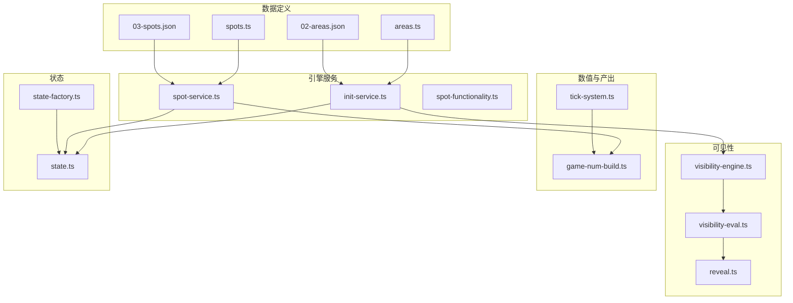
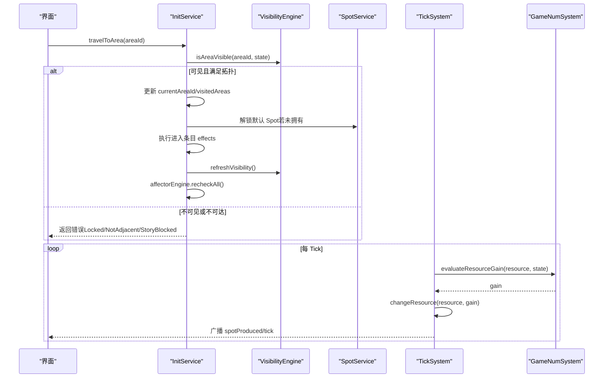
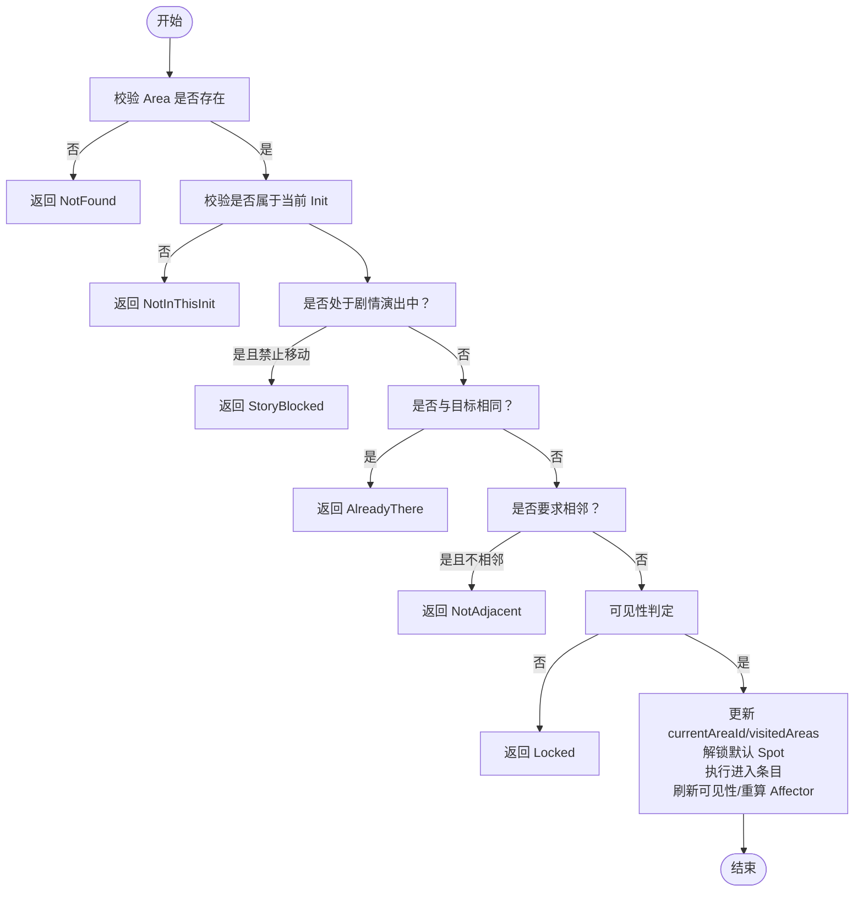
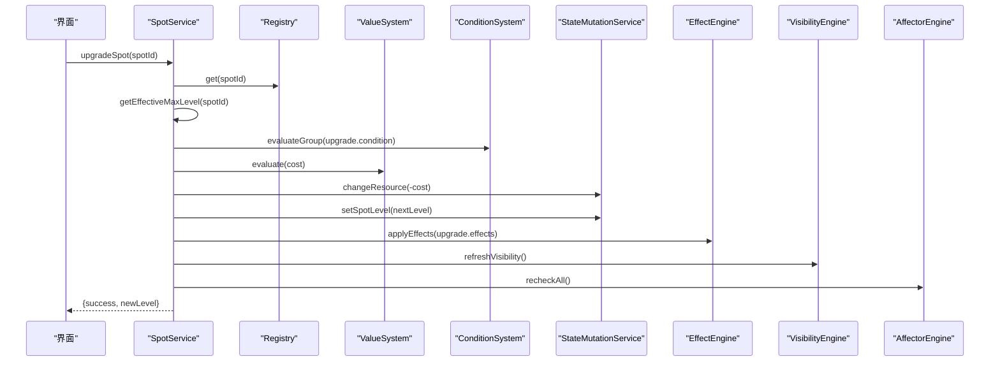
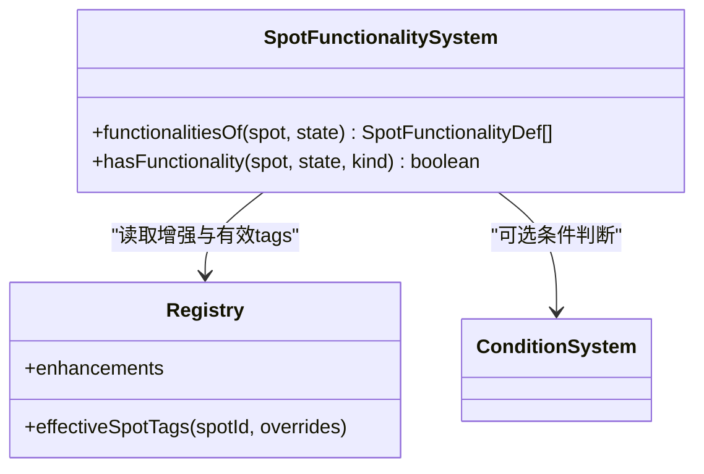
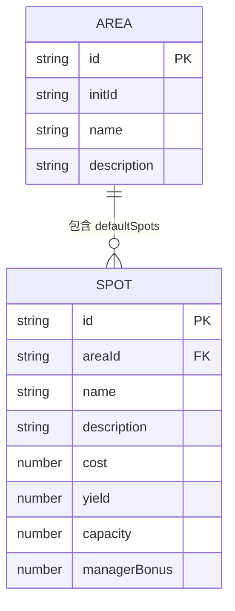
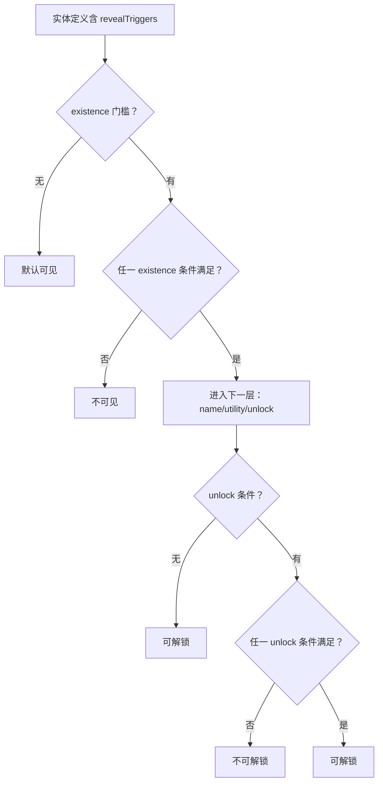
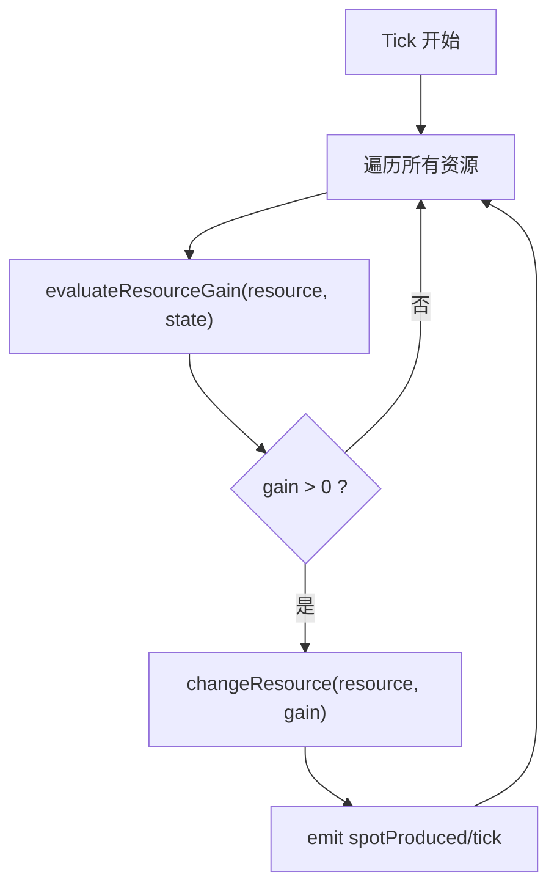
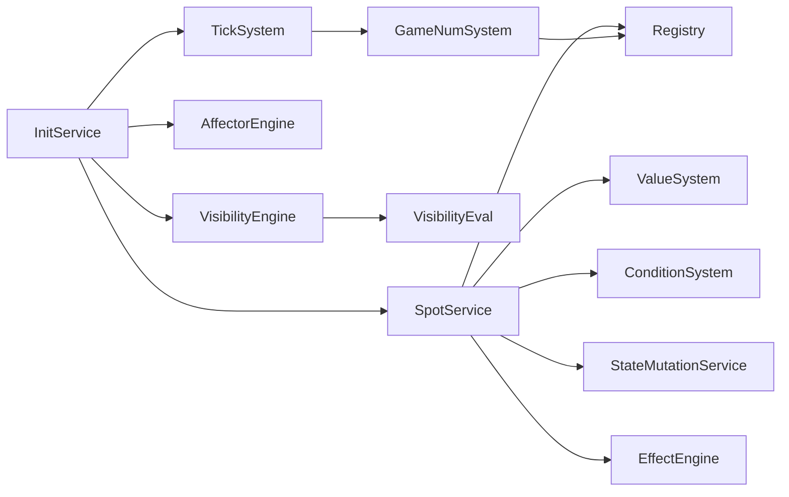

# 区域系统

<cite>
**本文引用的文件**
- [spot-service.ts](file://src/engine/game/spot-service.ts)
- [spot-functionality.ts](file://src/engine/system/spot-functionality.ts)
- [areas.ts](file://src/data/base/areas.ts)
- [spots.ts](file://src/data/base/spots.ts)
- [02-areas.json](file://datapack/AronaClickerCore/02-areas.json)
- [03-spots.json](file://datapack/AronaClickerCore/03-spots.json)
- [state-factory.ts](file://src/engine/game/state-factory.ts)
- [tick-system.ts](file://src/engine/system/tick-system.ts)
- [visibility-eval.ts](file://src/engine/visibility/visibility-eval.ts)
- [visibility-engine.ts](file://src/engine/visibility/visibility-engine.ts)
- [reveal.ts](file://src/engine/visibility/reveal.ts)
- [init-service.ts](file://src/engine/game/init-service.ts)
- [state.ts](file://src/engine/types/state.ts)
- [game-num-build.ts](file://src/engine/expression/game-num-build.ts)
</cite>

## 目录
1. [简介](#简介)
2. [项目结构](#项目结构)
3. [核心组件](#核心组件)
4. [架构总览](#架构总览)
5. [详细组件分析](#详细组件分析)
6. [依赖关系分析](#依赖关系分析)
7. [性能考虑](#性能考虑)
8. [故障排查指南](#故障排查指南)
9. [结论](#结论)
10. [附录：API 参考](#附录api-参考)

## 简介
本技术文档围绕 ACProgram 的区域系统，聚焦 SpotService 区域服务与区域功能系统，系统性阐述区域移动逻辑、设施管理、产出计算、可见性与解锁机制、以及完整 API。文档同时覆盖数据定义（Area/Spot）、拓扑连接规则、运行时状态与快照、以及扩展与优化建议，帮助开发者快速理解并安全扩展区域系统。

## 项目结构
区域系统由“数据定义 + 引擎服务 + 可见性/表达式/事件”等子系统协作完成：
- 数据定义层：Area/Spot 的声明式 DSL 与 Datapack JSON，描述区域拓扑、默认设施、主题、揭示条件等。
- 引擎服务层：InitService（世界线与区域移动）、SpotService（设施购买/升级/标签/产出查询）、SpotFunctionalitySystem（内源/外源功能聚合）。
- 可见性层：VisibilityEngine/VisibilityEval/Reveal，统一处理存在性、名称、条件、效用、解锁等多级信息揭示。
- 数值与产出：GameNumSystem 构建资源产出图，TickSystem 驱动统一 Tick 结算。
- 状态与快照：PlayerState/InitSnapshot 承载运行时状态；StateFactory 提供默认状态构造。

图表来源
- [areas.ts:8-106](file://src/data/base/areas.ts#L8-L106)
- [spots.ts:9-295](file://src/data/base/spots.ts#L9-L295)
- [02-areas.json:1-19](file://datapack/AronaClickerCore/02-areas.json#L1-L19)
- [03-spots.json:1-54](file://datapack/AronaClickerCore/03-spots.json#L1-L54)
- [init-service.ts:94-244](file://src/engine/game/init-service.ts#L94-L244)
- [spot-service.ts:46-255](file://src/engine/game/spot-service.ts#L46-L255)
- [spot-functionality.ts:21-55](file://src/engine/system/spot-functionality.ts#L21-L55)
- [visibility-engine.ts:88-122](file://src/engine/visibility/visibility-engine.ts#L88-L122)
- [visibility-eval.ts:29-40](file://src/engine/visibility/visibility-eval.ts#L29-L40)
- [reveal.ts:1-69](file://src/engine/visibility/reveal.ts#L1-L69)
- [game-num-build.ts:176-232](file://src/engine/expression/game-num-build.ts#L176-L232)
- [tick-system.ts:44-61](file://src/engine/system/tick-system.ts#L44-L61)
- [state.ts:35-140](file://src/engine/types/state.ts#L35-L140)
- [state-factory.ts:9-30](file://src/engine/game/state-factory.ts#L9-L30)

章节来源
- [areas.ts:8-106](file://src/data/base/areas.ts#L8-L106)
- [spots.ts:9-295](file://src/data/base/spots.ts#L9-L295)
- [init-service.ts:94-244](file://src/engine/game/init-service.ts#L94-L244)
- [spot-service.ts:46-255](file://src/engine/game/spot-service.ts#L46-L255)
- [spot-functionality.ts:21-55](file://src/engine/system/spot-functionality.ts#L21-L55)
- [visibility-engine.ts:88-122](file://src/engine/visibility/visibility-engine.ts#L88-L122)
- [visibility-eval.ts:29-40](file://src/engine/visibility/visibility-eval.ts#L29-L40)
- [reveal.ts:1-69](file://src/engine/visibility/reveal.ts#L1-L69)
- [game-num-build.ts:176-232](file://src/engine/expression/game-num-build.ts#L176-L232)
- [tick-system.ts:44-61](file://src/engine/system/tick-system.ts#L44-L61)
- [state.ts:35-140](file://src/engine/types/state.ts#L35-L140)
- [state-factory.ts:9-30](file://src/engine/game/state-factory.ts#L9-L30)

## 核心组件
- InitService：负责世界线生命周期、区域可达性移动、进入条目执行、触发器挂载、软/硬重启、可见性刷新。
- SpotService：负责 Spot 购买/升级/等级上限/Tag 操作、产出查询、可见性刷新与 Affector 重算。
- SpotFunctionalitySystem：聚合 Spot 自身功能与 Enhancement 注入的外源功能，按 Tag 匹配与作用范围生效。
- VisibilityEngine/VisibilityEval/Reveal：统一评估实体存在性、名称、条件、效用、解锁，维护可见性快照。
- GameNumSystem/TickSystem：构建资源产出 DAG，统一 Tick 结算所有资源增益，广播事件。
- StateFactory/PlayerState：提供默认状态与运行时状态模型，包含区域访问、Spot 等级/管理者、全局/局部资源等。

章节来源
- [init-service.ts:94-244](file://src/engine/game/init-service.ts#L94-L244)
- [spot-service.ts:46-255](file://src/engine/game/spot-service.ts#L46-L255)
- [spot-functionality.ts:21-55](file://src/engine/system/spot-functionality.ts#L21-L55)
- [visibility-engine.ts:88-122](file://src/engine/visibility/visibility-engine.ts#L88-L122)
- [visibility-eval.ts:29-40](file://src/engine/visibility/visibility-eval.ts#L29-L40)
- [reveal.ts:1-69](file://src/engine/visibility/reveal.ts#L1-L69)
- [game-num-build.ts:176-232](file://src/engine/expression/game-num-build.ts#L176-L232)
- [tick-system.ts:44-61](file://src/engine/system/tick-system.ts#L44-L61)
- [state.ts:35-140](file://src/engine/types/state.ts#L35-L140)
- [state-factory.ts:9-30](file://src/engine/game/state-factory.ts#L9-L30)

## 架构总览
区域系统的核心交互如下：
- 玩家通过 UI 调用 GameInstance 门面方法，内部委托至 InitService/SpotService。
- InitService 校验区域移动门槛（存在性、同世界线、剧情锁定、相邻拓扑、可见性），更新 currentAreaId、visitedAreas，解锁默认 Spot，执行进入条目，刷新可见性与 Affector。
- SpotService 处理设施购买/升级/标签，扣费、设置等级、应用效果、刷新可见性与 Affector。
- TickSystem 每秒对所有资源求值 primitiveGain，写入 PlayerState 并广播事件。
- VisibilityEngine 基于 revealTriggers 与 conditionSystem 计算可见性快照，供 UI 与业务门限使用。

图表来源
- [init-service.ts:187-244](file://src/engine/game/init-service.ts#L187-L244)
- [visibility-engine.ts:105-111](file://src/engine/visibility/visibility-engine.ts#L105-L111)
- [spot-service.ts:182-210](file://src/engine/game/spot-service.ts#L182-L210)
- [tick-system.ts:44-61](file://src/engine/system/tick-system.ts#L44-L61)
- [game-num-build.ts:176-232](file://src/engine/expression/game-num-build.ts#L176-L232)

## 详细组件分析

### 区域移动与拓扑（InitService.travelToArea）
- 移动门槛链：存在性 → 同 Init → 非演出锁定 → 相邻拓扑 → 可见性。
- 成功移动后：记录 visitedAreas、解锁默认 Spot、执行进入条目、刷新可见性、重算 Affector。
- 支持 Story 强制移动（allowDuringStory=true）与跳过拓扑检查（checkAdjacency=false）。

图表来源
- [init-service.ts:187-244](file://src/engine/game/init-service.ts#L187-L244)

章节来源
- [init-service.ts:187-244](file://src/engine/game/init-service.ts#L187-L244)

### 设施管理与升级（SpotService）
- 升级流程：查找 SpotDef → 检查等级上限 → 评估升级条件 → 计算花费（优先 levelUpgrades.cost，否则通用公式）→ 扣费 → 设置等级 → 应用升级效果 → 刷新可见性与 Affector。
- 解锁流程：检查可见性 → 检查等级上限 → 计算基础花费 → 扣费 → 设置 level=1 → 刷新可见性。
- 产出查询：getSpotYield 返回 base/managerBonus/tagMultiplier/total（当前 managerBonus 冻结为恒 1.0，tagMultiplier 恒 1）。
- 标签操作：addSpotTag/removeSpotTag 即时生效，触发可见性刷新与 Affector 重算。

图表来源
- [spot-service.ts:53-131](file://src/engine/game/spot-service.ts#L53-L131)
- [spot-service.ts:164-177](file://src/engine/game/spot-service.ts#L164-L177)
- [spot-service.ts:182-210](file://src/engine/game/spot-service.ts#L182-L210)
- [spot-service.ts:212-241](file://src/engine/game/spot-service.ts#L212-L241)

章节来源
- [spot-service.ts:53-131](file://src/engine/game/spot-service.ts#L53-L131)
- [spot-service.ts:146-177](file://src/engine/game/spot-service.ts#L146-L177)
- [spot-service.ts:182-210](file://src/engine/game/spot-service.ts#L182-L210)
- [spot-service.ts:212-241](file://src/engine/game/spot-service.ts#L212-L241)

### 区域功能系统（SpotFunctionalitySystem）
- 功能来源：内源（SpotDef.functionalities）+ 外源（已解锁 Enhancement 的 addsFunctionalities，按 zoneModifiers 命中 tag 作用）。
- 生效判定：外源功能需匹配 Spot 的有效 tags（声明 + 运行时增撤），空 tag 列表表示全局作用。
- 用途：持续型功能（linearYield）类比 Affector，按当前 Spot 等级生效；交互型功能由 UI 提供入口。

图表来源
- [spot-functionality.ts:21-55](file://src/engine/system/spot-functionality.ts#L21-L55)

章节来源
- [spot-functionality.ts:21-55](file://src/engine/system/spot-functionality.ts#L21-L55)

### 区域与设施定义及关联
- Area 定义：包含 id、initId、name、description、defaultSpots、adjacent、theme、reveal 等。
- Spot 定义：包含 id、areaId、name、description、cost/yield/capacity、managerBonus、tags、linearYield/gacha/restartInit/hardResetInit、levelUpTo/genericUpgrade、revealResource 等。
- 关联关系：Spot.areaId 指向所属 Area；Area.defaultSpots 指定进入时解锁的设施；Area.adjacent 定义拓扑连接。

图表来源
- [areas.ts:8-106](file://src/data/base/areas.ts#L8-L106)
- [spots.ts:9-295](file://src/data/base/spots.ts#L9-L295)
- [02-areas.json:1-19](file://datapack/AronaClickerCore/02-areas.json#L1-L19)
- [03-spots.json:1-54](file://datapack/AronaClickerCore/03-spots.json#L1-L54)

章节来源
- [areas.ts:8-106](file://src/data/base/areas.ts#L8-L106)
- [spots.ts:9-295](file://src/data/base/spots.ts#L9-L295)
- [02-areas.json:1-19](file://datapack/AronaClickerCore/02-areas.json#L1-L19)
- [03-spots.json:1-54](file://datapack/AronaClickerCore/03-spots.json#L1-L54)

### 可见性与解锁机制
- 揭示层级：existence（出现）、name（名称）、condition（解锁条件）、utility（效用）、unlock（实际解锁）。
- 可见性评估：VisibilityEval.evaluateEntity 结合 revealTriggers 与 conditionSystem 判定；VisibilityEngine 维护快照并提供 isAreaVisible/isSpotVisible 等查询。
- 区域解锁：travelToArea 前必须 isAreaVisible(state) 为真；Spot 解锁需 visible 且资源足够且等级上限允许。

图表来源
- [reveal.ts:1-69](file://src/engine/visibility/reveal.ts#L1-L69)
- [visibility-eval.ts:29-40](file://src/engine/visibility/visibility-eval.ts#L29-L40)
- [visibility-engine.ts:105-111](file://src/engine/visibility/visibility-engine.ts#L105-L111)
- [init-service.ts:220-223](file://src/engine/game/init-service.ts#L220-L223)
- [spot-service.ts:182-210](file://src/engine/game/spot-service.ts#L182-L210)

章节来源
- [reveal.ts:1-69](file://src/engine/visibility/reveal.ts#L1-L69)
- [visibility-eval.ts:29-40](file://src/engine/visibility/visibility-eval.ts#L29-L40)
- [visibility-engine.ts:105-111](file://src/engine/visibility/visibility-engine.ts#L105-L111)
- [init-service.ts:220-223](file://src/engine/game/init-service.ts#L220-L223)
- [spot-service.ts:182-210](file://src/engine/game/spot-service.ts#L182-L210)

### 产出计算与 Tick 结算
- GameNumSystem 构建资源产出图：spotBase（baseYield + levelLinear）× zone(mul) + spotExtra（flat/flows，受 owned 门控）。
- TickSystem 每秒对每个 Resource 求值 primitiveGain，直接写入资源并广播事件；不再逐 Spot 截断容量。
- SpotFunctionalitySystem 的 linearYield 作为持续型功能参与产出计算。

图表来源
- [game-num-build.ts:176-232](file://src/engine/expression/game-num-build.ts#L176-L232)
- [tick-system.ts:44-61](file://src/engine/system/tick-system.ts#L44-L61)
- [spot-functionality.ts:21-55](file://src/engine/system/spot-functionality.ts#L21-L55)

章节来源
- [game-num-build.ts:176-232](file://src/engine/expression/game-num-build.ts#L176-L232)
- [tick-system.ts:44-61](file://src/engine/system/tick-system.ts#L44-L61)
- [spot-functionality.ts:21-55](file://src/engine/system/spot-functionality.ts#L21-L55)

## 依赖关系分析
- InitService 依赖 VisibilityEngine、StoryService、AffectorEngine、TriggerSystem、StatsService、EventBus、DevLog。
- SpotService 依赖 Registry、ValueSystem、ConditionSystem、StateMutationService、EffectEngine、CharacterSystem、AffectorEngine、EventBus、DevLog。
- VisibilityEngine 依赖 VisibilityEval、VisibilityIndex，维护 dirty 集合与快照。
- GameNumSystem 依赖 Registry、ValueSystem、ConditionSystem，构建资源产出 DAG。
- TickSystem 依赖 GameNumSystem、StateMutationService、EventBus。

图表来源
- [init-service.ts:33-62](file://src/engine/game/init-service.ts#L33-L62)
- [spot-service.ts:28-44](file://src/engine/game/spot-service.ts#L28-L44)
- [visibility-engine.ts:88-122](file://src/engine/visibility/visibility-engine.ts#L88-L122)
- [tick-system.ts:19-37](file://src/engine/system/tick-system.ts#L19-L37)
- [game-num-build.ts:176-232](file://src/engine/expression/game-num-build.ts#L176-L232)

章节来源
- [init-service.ts:33-62](file://src/engine/game/init-service.ts#L33-L62)
- [spot-service.ts:28-44](file://src/engine/game/spot-service.ts#L28-L44)
- [visibility-engine.ts:88-122](file://src/engine/visibility/visibility-engine.ts#L88-L122)
- [tick-system.ts:19-37](file://src/engine/system/tick-system.ts#L19-L37)
- [game-num-build.ts:176-232](file://src/engine/expression/game-num-build.ts#L176-L232)

## 性能考虑
- 可见性增量更新：VisibilityEngine 通过事件订阅仅标记脏项，避免全量重算；区域切换/设施变更时按需刷新。
- 产出缓存失效：GameNumSystem 在资源变化、Spot 等级变化时使相关节点失效，确保正确性与性能平衡。
- 统一 Tick 结算：TickSystem 按资源维度聚合 primitiveGain，减少逐 Spot 循环与容量截断开销。
- Manager 加成冻结：当前 managerBonus 恒 1.0，降低复杂乘区计算成本。
- 建议：
  - 尽量将条件与效果收敛到 LevelUpgrades/Enhancement，减少运行时分支。
  - 合理使用 Tag 与 zoneModifiers，控制外源功能的作用范围，避免全局放大。
  - 对高频 UI 查询（如可见性、产出）利用只读视图快照，避免重复求值。

[本节为通用指导，不直接分析具体文件]

## 故障排查指南
- 区域移动失败：
  - NotFound：目标 Area 不存在。
  - NotInThisInit：目标 Area 不属于当前世界线。
  - StoryBlocked：剧情演出进行中禁止移动。
  - AlreadyThere：已在目标区域。
  - NotAdjacent：不相邻（除非 checkAdjacency=false）。
  - Locked：不可见（存在性或解锁条件未满足）。
- 设施升级失败：
  - NotFound：Spot 不存在。
  - NotOwned：未拥有（level=0）。
  - MaxLevel：已达等级上限（含 Affector 解除限制）。
  - ConditionNotMet：升级条件不满足。
  - InsufficientResource：资源不足。
- 可见性问题：
  - 检查 revealTriggers 的 existence/name/condition/utility/unlock 配置。
  - 确认 conditionSystem 求值环境与状态一致性。
  - 使用 visibilityEngine.isAreaVisible/isSpotVisible 进行调试。

章节来源
- [init-service.ts:187-244](file://src/engine/game/init-service.ts#L187-L244)
- [spot-service.ts:53-131](file://src/engine/game/spot-service.ts#L53-L131)
- [spot-service.ts:182-210](file://src/engine/game/spot-service.ts#L182-L210)
- [visibility-engine.ts:105-111](file://src/engine/visibility/visibility-engine.ts#L105-L111)
- [reveal.ts:1-69](file://src/engine/visibility/reveal.ts#L1-L69)

## 结论
区域系统以“数据定义 + 服务编排 + 可见性/数值引擎”为核心，实现了清晰的区域拓扑、设施管理与产出计算。通过 revealTriggers 的多级揭示与 VisibilityEngine 的增量更新，系统在可扩展性与性能之间取得良好平衡。开发者可基于 SpotFunctionalitySystem 与 Enhancement 注入机制，灵活扩展区域能力；借助 InitService/SpotService 的 API，安全地实现区域切换、设施操作与数据查询。

[本节为总结，不直接分析具体文件]

## 附录：API 参考
- 区域移动
  - travelToArea(areaId, allowDuringStory?, checkAdjacency?): TravelResult
  - 说明：在当前世界线内移动到相邻区域，校验存在性/剧情锁定/相邻拓扑/可见性。
- 世界线操作
  - enterInit(initId): void
  - purchaseInit(initId): InitPurchaseResult
  - startNewGame(initId): boolean
  - restartInit(): void
  - resumeInit(initId): boolean
  - hardRestartInit(): void
  - hardResetInit(initId): void
- 设施操作
  - unlockSpot(spotId): SpotUnlockResult
  - upgradeSpot(spotId): SpotUpgradeResult
  - assignManager(spotId, character): boolean
  - getManagerBonus(spotId): number
  - getSpotYield(spotId): { base, managerBonus, tagMultiplier, total }
  - addSpotTag(spotId, tag): boolean
  - removeSpotTag(spotId, tag): boolean
- 可见性查询
  - isAreaVisible(areaId, state): boolean
  - isSpotVisible(spotId, state): boolean
- 状态与快照
  - createDefaultState(): PlayerState
  - PlayerState.currentAreaId?: AreaId
  - PlayerState.visitedAreas?: AreaId[]
  - PlayerState.spotLevels: Record<SpotId, number>
  - PlayerState.spotManagers: Record<SpotId, Character>
  - PlayerState.resources/globalResources: Record<string, number>

章节来源
- [init-service.ts:94-244](file://src/engine/game/init-service.ts#L94-L244)
- [init-service.ts:246-392](file://src/engine/game/init-service.ts#L246-L392)
- [spot-service.ts:53-241](file://src/engine/game/spot-service.ts#L53-L241)
- [visibility-engine.ts:105-111](file://src/engine/visibility/visibility-engine.ts#L105-L111)
- [state-factory.ts:9-30](file://src/engine/game/state-factory.ts#L9-L30)
- [state.ts:35-140](file://src/engine/types/state.ts#L35-L140)