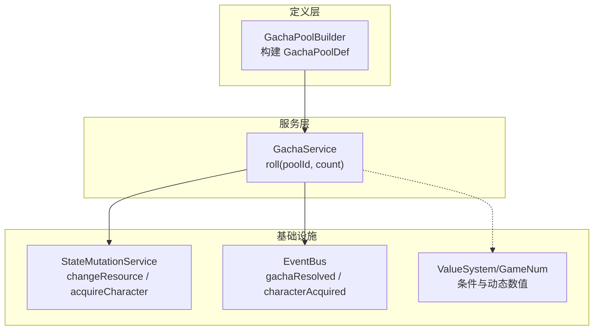
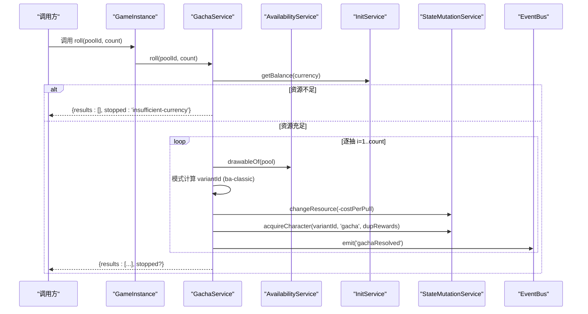
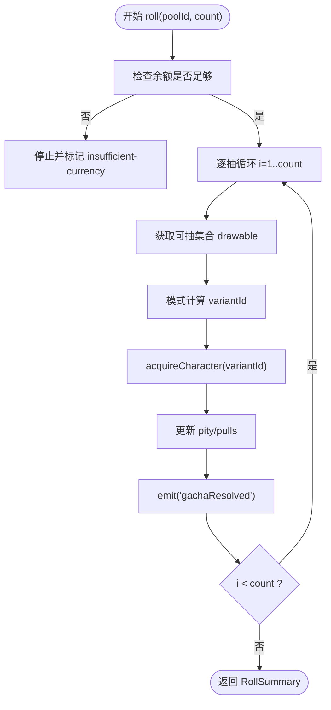
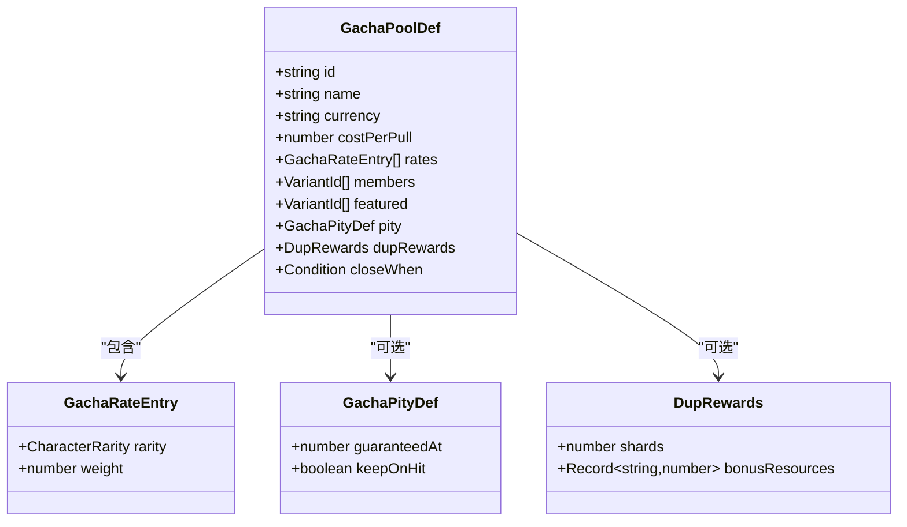
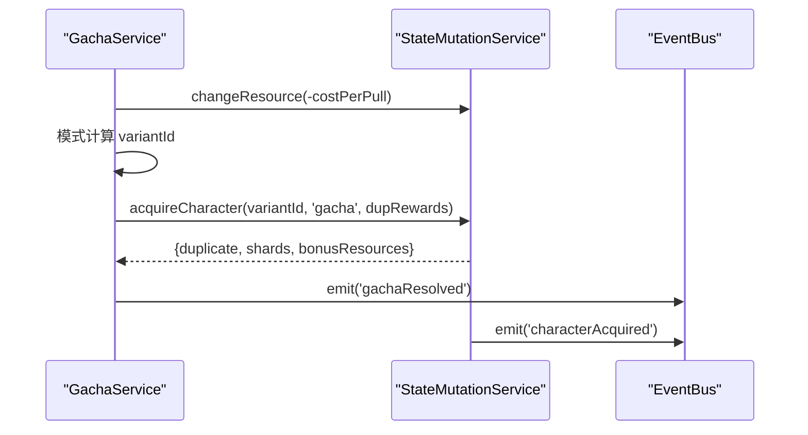
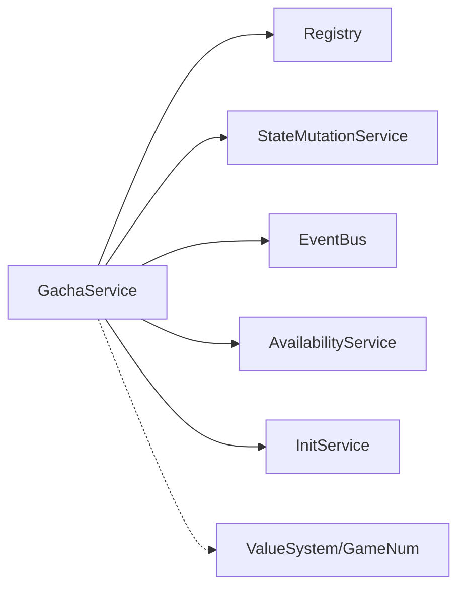

# 抽卡系统

<cite>
**本文引用的文件**
- [gacha-service.ts](file://src/engine/system/gacha-service.ts)
- [gacha-pool.ts](file://src/engine/def-factory/gacha-pool.ts)
- [character.ts](file://src/engine/types/character.ts)
- [state-mutation-service.ts](file://src/engine/system/state-mutation-service.ts)
- [wiring.ts](file://src/engine/game/wiring.ts)
- [event-bus.ts](file://src/engine/core/event-bus.ts)
- [game-num-eval.ts](file://src/engine/expression/game-num-eval.ts)
- [04c-gacha.md](file://docs-824/04c-gacha.md)
- [gacha-service.test.ts](file://tests/engine/gacha-service.test.ts)
</cite>

## 目录
1. [简介](#简介)
2. [项目结构](#项目结构)
3. [核心组件](#核心组件)
4. [架构总览](#架构总览)
5. [详细组件分析](#详细组件分析)
6. [依赖关系分析](#依赖关系分析)
7. [性能考量](#性能考量)
8. [故障排查指南](#故障排查指南)
9. [结论](#结论)
10. [附录：API 与使用示例](#附录api-与使用示例)

## 简介
本技术文档面向 ACProgram 的抽卡系统，聚焦 GachaService 的核心算法、GachaPool 卡池设计、完整抽取流程、与数值表达式系统的集成方式、API 接口说明，以及平衡性设计与调试工具使用。目标是帮助开发者快速理解并安全扩展抽卡机制，同时确保概率、保底、重复转化和资源结算的正确性与可观测性。

## 项目结构
抽卡系统由“定义层（数据配置）—服务层（运行时逻辑）—基础设施（状态变更、事件总线、数值系统）”三层组成：
- 定义层：通过 GachaPoolBuilder 构建 GachaPoolDef，声明货币、单价、概率表、UP、保底、重复奖励、成员集合与关闭条件等。
- 服务层：GachaService 负责模式调度、资源扣费、pity 计数、结果判定与奖励发放，并通过 EventBus 发出 gachaResolved 事件。
- 基础设施：StateMutationService 统一写入玩家状态（资源、角色、碎片、统计），EventBus 解耦事件传播；GameNum/ValueSystem 提供动态数值与条件判断能力，用于关闭条件与后续扩展。

图表来源
- [gacha-pool.ts:16-79](file://src/engine/def-factory/gacha-pool.ts#L16-L79)
- [gacha-service.ts:83-172](file://src/engine/system/gacha-service.ts#L83-L172)
- [state-mutation-service.ts:110-197](file://src/engine/system/state-mutation-service.ts#L110-L197)
- [event-bus.ts:9-83](file://src/engine/core/event-bus.ts#L9-L83)
- [game-num-eval.ts:172-200](file://src/engine/expression/game-num-eval.ts#L172-L200)

章节来源
- [gacha-pool.ts:16-79](file://src/engine/def-factory/gacha-pool.ts#L16-L79)
- [gacha-service.ts:83-172](file://src/engine/system/gacha-service.ts#L83-L172)
- [state-mutation-service.ts:110-197](file://src/engine/system/state-mutation-service.ts#L110-L197)
- [event-bus.ts:9-83](file://src/engine/core/event-bus.ts#L9-L83)
- [game-num-eval.ts:172-200](file://src/engine/expression/game-num-eval.ts#L172-L200)

## 核心组件
- GachaService：注册抽取模式（当前为 ba-classic），实现 roll(poolId, count) 主循环，处理资源检查、逐抽结算、pity 推进、重复转化、事件广播。
- GachaPoolBuilder/GachaPoolDef：声明式构造卡池配置，包括货币、单价、概率表、UP、保底、重复奖励、成员集合与关闭条件。
- StateMutationService：统一的 PlayerState 写入入口，负责资源增减、角色获得/重复转化、统计更新与事件派发。
- EventBus：事件分发器，支持类型化订阅与通配监听，用于 gachaResolved、characterAcquired 等事件。
- ValueSystem/GameNum：数值表达式与区聚合求值，支撑条件判断与动态数值调整（如 closeWhen）。

章节来源
- [gacha-service.ts:20-187](file://src/engine/system/gacha-service.ts#L20-L187)
- [gacha-pool.ts:16-79](file://src/engine/def-factory/gacha-pool.ts#L16-L79)
- [state-mutation-service.ts:110-197](file://src/engine/system/state-mutation-service.ts#L110-L197)
- [event-bus.ts:9-83](file://src/engine/core/event-bus.ts#L9-L83)
- [game-num-eval.ts:117-180](file://src/engine/expression/game-num-eval.ts#L117-L180)

## 架构总览
抽卡系统在 GameInstance 装配阶段被注入到全局上下文，并与可用性服务、初始化服务、事件总线、状态变更服务联动。

图表来源
- [wiring.ts:122-129](file://src/engine/game/wiring.ts#L122-L129)
- [gacha-service.ts:117-172](file://src/engine/system/gacha-service.ts#L117-L172)
- [state-mutation-service.ts:110-197](file://src/engine/system/state-mutation-service.ts#L110-L197)
- [event-bus.ts:47-75](file://src/engine/core/event-bus.ts#L47-L75)

## 详细组件分析

### GachaService 核心算法（ba-classic 模式）
- 概率计算：按 rates 权重累加得到 totalWeight，随机 roll 决定稀有度；在稀有度内若存在 featured 且命中 UP 概率阈值，则优先从 featured 中随机选择，否则在该稀有度内随机；若无该稀有度成员则回退全池随机。
- 保底机制：当 pity + 1 >= guaranteedAt 时强制返回 featured[0]；非天井命中最高稀有度时根据 keepOnHit 决定是否归零或累加；天井命中后 pity 归零。
- 随机数生成：默认 Math.random，可通过 setRng 注入确定性 RNG（测试用）。
- 资源与计数：每抽先检查余额，不足则中止并标记 stopped='insufficient-currency'；成功则扣费、acquireCharacter、更新 pity/pulls 并持久化。
- 事件：至少一次有效结果或中止时发出 gachaResolved。

图表来源
- [gacha-service.ts:56-81](file://src/engine/system/gacha-service.ts#L56-L81)
- [gacha-service.ts:117-172](file://src/engine/system/gacha-service.ts#L117-L172)

章节来源
- [gacha-service.ts:56-81](file://src/engine/system/gacha-service.ts#L56-L81)
- [gacha-service.ts:117-172](file://src/engine/system/gacha-service.ts#L117-L172)
- [gacha-service.ts:174-185](file://src/engine/system/gacha-service.ts#L174-L185)

### GachaPool 卡池设计与权重计算
- 配置项：id、name、mode、currency、costPerPull、rates、featured、pity、dupRewards、members、closeWhen。
- 权重计算：rates.weight 为相对权重，totalWeight = Σ weight；稀有度命中后再在稀有度内选择，UP 以固定比例偏向。
- 可及性：drawable = availabilityService.drawableOf(pool)，池关闭后成员并入世界 Pool。
- 关闭条件：closeWhen 为 Condition/ConditionGroup，由条件系统评估决定是否开放。

图表来源
- [character.ts:342-438](file://src/engine/types/character.ts#L342-L438)
- [gacha-pool.ts:16-79](file://src/engine/def-factory/gacha-pool.ts#L16-L79)

章节来源
- [character.ts:342-438](file://src/engine/types/character.ts#L342-L438)
- [gacha-pool.ts:16-79](file://src/engine/def-factory/gacha-pool.ts#L16-L79)

### 完整抽取流程（资源消耗、结果判定、奖励发放）
- 资源消耗：每次抽取前检查余额，不足则中止；成功后通过 StateMutationService.changeResource 扣费。
- 结果判定：模式函数计算 variantId，校验存在性；随后 acquireCharacter 处理首次获得或重复转化。
- 奖励发放：重复获得时返还碎片与附加资源；首次获得创建 RosterEntry 并累计原型统计。
- 计数与事件：更新 pity/pulls，持久化至 PlayerState.gachaState；发出 gachaResolved 与 characterAcquired。

图表来源
- [gacha-service.ts:117-172](file://src/engine/system/gacha-service.ts#L117-L172)
- [state-mutation-service.ts:155-197](file://src/engine/system/state-mutation-service.ts#L155-L197)
- [event-bus.ts:47-75](file://src/engine/core/event-bus.ts#L47-L75)

章节来源
- [gacha-service.ts:117-172](file://src/engine/system/gacha-service.ts#L117-L172)
- [state-mutation-service.ts:155-197](file://src/engine/system/state-mutation-service.ts#L155-L197)

### 与数值表达式系统的集成
- 卡池关闭条件：closeWhen 为 Condition/ConditionGroup，由条件系统结合 ValueSystem/GameNum 进行求值，支持 tag、zone、affectorFlows 等动态源。
- 动态概率调整：未来可扩展通过 zone/mul/flat 区对 rates.weight 进行乘区修正，或在模式函数中读取 GameNum 节点值作为权重因子。
- 条件求值：evaluateGameNum 提供懒求值与缓存，aggregateZone 统一聚合 tag/entity 效果，保证数值一致性与性能。

章节来源
- [game-num-eval.ts:117-200](file://src/engine/expression/game-num-eval.ts#L117-L200)
- [character.ts:428-438](file://src/engine/types/character.ts#L428-L438)

### API 接口文档
- 主要方法
  - roll(poolId: string, count: number): RollSummary
    - 参数：poolId 为已注册卡池 ID；count 为抽取次数。
    - 返回：{ results: PullResult[], stopped?: 'insufficient-currency' }
    - 行为：逐抽扣费、模式计算、重复转化、pity 推进、事件广播；中途资源不足则中止并返回已完成部分。
  - getPool(poolId: string): GachaPoolDef | undefined
    - 查询卡池配置。
  - countersOf(poolId: string): { pity: number; pulls: number }
    - 查询卡池计数状态。
  - setRng(rng: () => number): void
    - 注入确定性 RNG（测试用）。
- 数据结构
  - PullResult: { variantId, duplicate, shards, bonusResources }
  - RollSummary: { results, stopped? }
  - GachaPoolDef: 见“GachaPool 卡池设计与权重计算”
- 事件
  - gachaResolved: 至少一次结果或中止时触发，携带 poolId 与 count。
  - characterAcquired: 角色获得/重复转化时触发，携带 variantId、via、duplicate、shards、bonusResources。

章节来源
- [gacha-service.ts:20-34](file://src/engine/system/gacha-service.ts#L20-L34)
- [gacha-service.ts:105-172](file://src/engine/system/gacha-service.ts#L105-L172)
- [character.ts:342-438](file://src/engine/types/character.ts#L342-L438)
- [event-bus.ts:9-83](file://src/engine/core/event-bus.ts#L9-L83)

## 依赖关系分析
- GachaService 依赖：
  - Registry：读取 GachaPoolDef 与 CharacterVariantDef。
  - StateMutationService：资源扣减、角色获得、碎片与统计更新。
  - EventBus：事件广播。
  - AvailabilityService（通过 wiring 注入）：计算 drawable 集合（限定 ∪ 世界 Pool）。
  - InitService（通过 wiring 注入）：读取资源余额。
- 外部耦合点：
  - 数值表达式系统：用于 closeWhen 条件与未来动态概率调整。
  - 事件总线：与 ColorUnlockReactor、StoryService 等子系统解耦联动。

图表来源
- [wiring.ts:122-129](file://src/engine/game/wiring.ts#L122-L129)
- [gacha-service.ts:83-129](file://src/engine/system/gacha-service.ts#L83-L129)

章节来源
- [wiring.ts:122-129](file://src/engine/game/wiring.ts#L122-L129)
- [gacha-service.ts:83-129](file://src/engine/system/gacha-service.ts#L83-L129)

## 性能考量
- 逐抽结算：roll 采用逐抽扣费与结算，避免一次性分配大量对象；仅在必要时持久化计数。
- 事件惰性统计：StateMutationService 对 stats 上下文采用惰性深拷贝，减少高频事件开销。
- 随机数：默认 Math.random；测试场景可使用确定性 RNG 提升可复现性。
- 可优化点：
  - 批量抽取时可考虑合并事件批次（需权衡实时性）。
  - 对 rates 预计算累积权重表以降低循环开销（当前权重规模较小，收益有限）。

## 故障排查指南
- 常见错误
  - 未知卡池：roll 时未找到 poolId → 检查 registry.gachaPools 是否正确加载。
  - 未注册抽取模式：pool.mode 未在 modes 注册 → 确认 GachaMode 枚举与注册表。
  - 配置不完整：rates 或 members 为空 → 检查 GachaPoolBuilder 构建过程。
  - 引用未知差分：variantId 不存在 → 校验 members 与 featured 列表。
- 调试建议
  - 使用 setRng 注入确定性 RNG，配合测试用例定位随机性问题。
  - 监听 gachaResolved 与 characterAcquired 事件，观察结果与状态变化。
  - 通过 countersOf 检查 pity/pulls 推进是否符合预期。
  - 使用 closeWhen 条件断点验证卡池关闭逻辑。

章节来源
- [gacha-service.ts:117-172](file://src/engine/system/gacha-service.ts#L117-L172)
- [gacha-service.test.ts:96-210](file://tests/engine/gacha-service.test.ts#L96-L210)

## 结论
ACProgram 抽卡系统以 GachaService 为核心，结合 GachaPool 配置与 StateMutationService 的状态管理，实现了清晰、可扩展的概率模型与保底机制。通过 EventBus 的事件驱动与 ValueSystem/GameNum 的动态数值能力，系统具备良好的平衡性与可观测性。建议在扩展新抽取模式时遵循现有接口契约，并在测试中覆盖边界条件与资源不足场景。

## 附录：API 与使用示例
- 基本用法
  - 初始化后通过 GameInstance.gachaService.roll(poolId, count) 发起抽取。
  - 使用 getPool 查询卡池配置；countersOf 查询 pity/pulls。
  - 使用 setRng 注入确定性 RNG 进行可复现实验。
- 事件监听
  - 订阅 gachaResolved 获取单次抽取结果摘要。
  - 订阅 characterAcquired 处理角色获得与重复转化。
- 参考文档
  - 抽取流程与数据模型参见 docs-824/04c-gacha.md。
  - 单元测试覆盖 G-01 ~ G-10 场景，可作为行为规范参考。

章节来源
- [04c-gacha.md:5-33](file://docs-824/04c-gacha.md#L5-L33)
- [gacha-service.test.ts:78-210](file://tests/engine/gacha-service.test.ts#L78-L210)