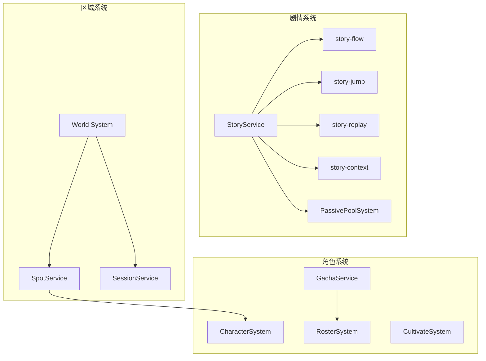
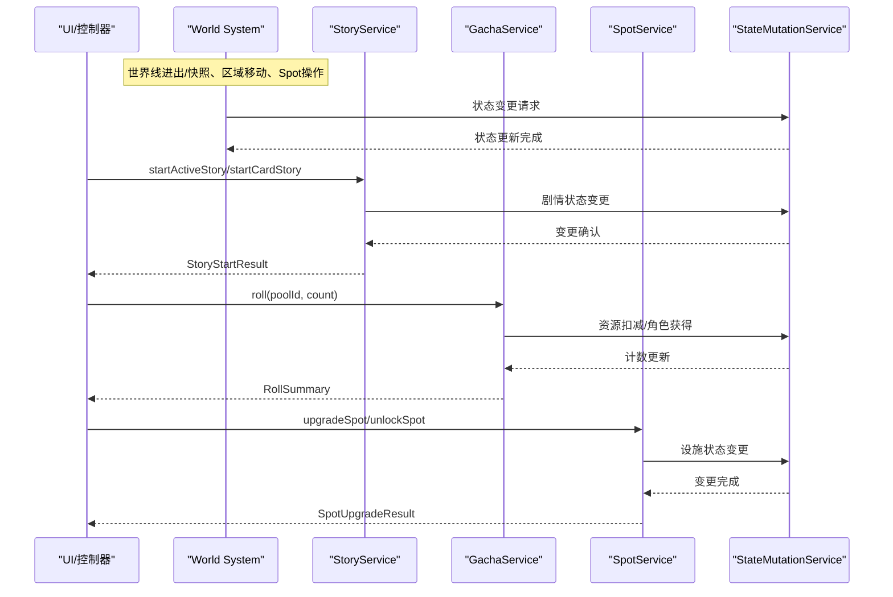
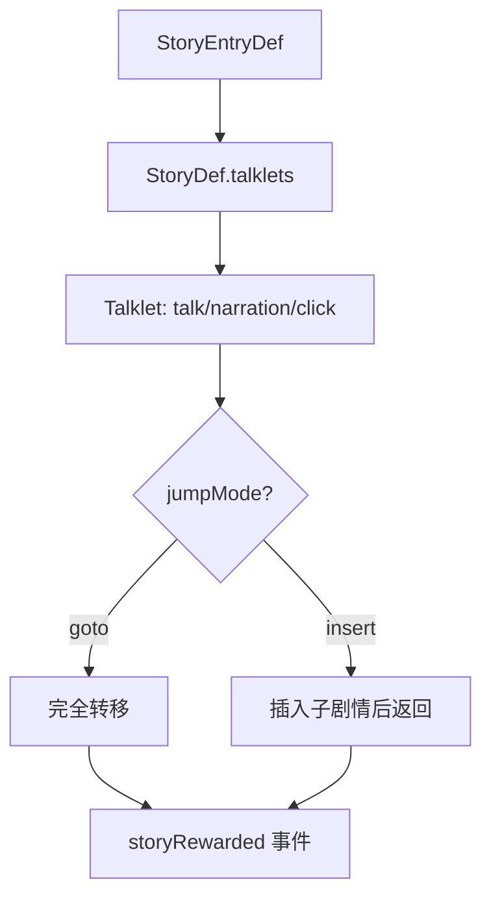
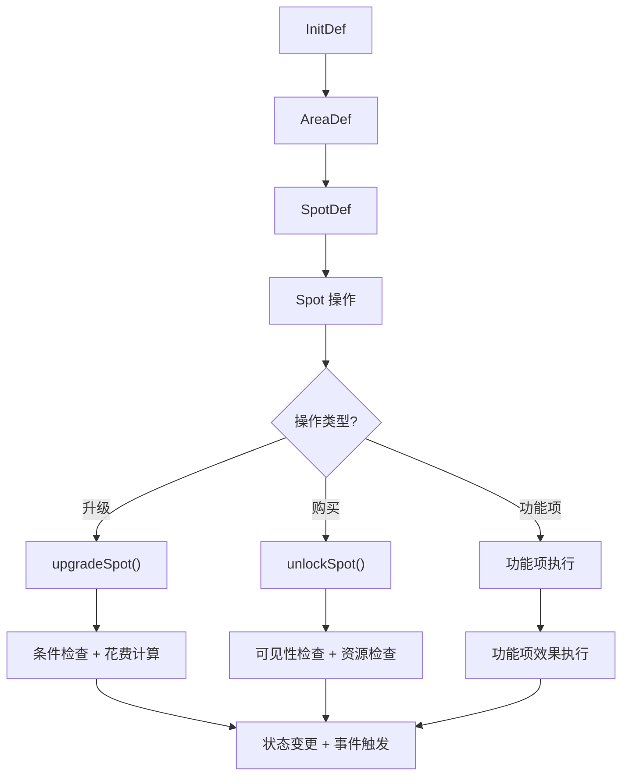
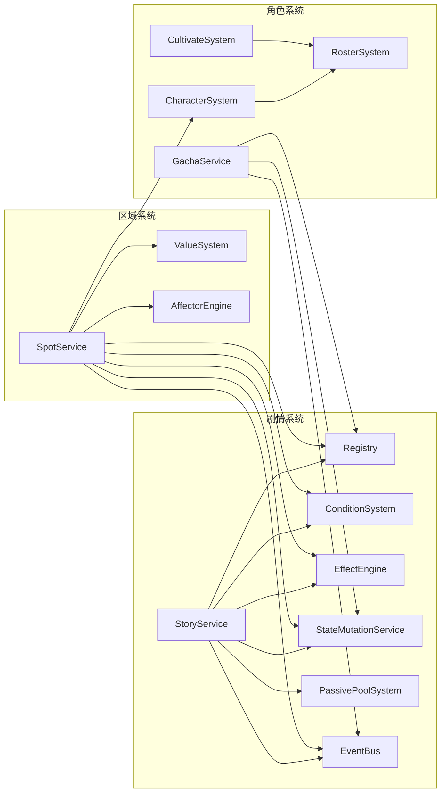

# 游戏系统

<cite>
**本文引用的文件**
- [story-service.ts](file://src/engine/game/story-service.ts)
- [story-flow.ts](file://src/engine/game/story-flow.ts)
- [story-jump.ts](file://src/engine/game/story-jump.ts)
- [story-replay.ts](file://src/engine/game/story-replay.ts)
- [story-context.ts](file://src/engine/game/story-context.ts)
- [character-system.ts](file://src/engine/system/character-system.ts)
- [roster-system.ts](file://src/engine/system/roster-system.ts)
- [cultivate-system.ts](file://src/engine/system/cultivate-system.ts)
- [gacha-service.ts](file://src/engine/system/gacha-service.ts)
- [spot-service.ts](file://src/engine/game/spot-service.ts)
- [passive-pool-system.ts](file://src/engine/system/passive-pool-system.ts)
- [world.md](file://docs-828/02-modules/world.md)
- [story.md](file://docs-828/02-modules/story.md)
- [character.md](file://docs-828/02-modules/character.md)
</cite>

## 更新摘要
**变更内容**
- 更新了剧情系统、角色系统、抽卡系统和区域系统的职责边界描述
- 添加了详细的模块职责说明和修改入口点
- 增强了各系统的架构设计和依赖关系分析
- 完善了API接口文档和故障排查指南

## 目录
1. [简介](#简介)
2. [项目结构](#项目结构)
3. [核心组件](#核心组件)
4. [架构总览](#架构总览)
5. [详细组件分析](#详细组件分析)
6. [依赖关系分析](#依赖关系分析)
7. [性能考量](#性能考量)
8. [故障排查指南](#故障排查指南)
9. [结论](#结论)
10. [附录：API 接口文档](#附录api-接口文档)

## 简介
本技术文档面向 ACProgram 游戏系统的四大子系统：剧情服务 StoryService、角色系统 CharacterSystem、抽卡系统 GachaService、区域系统 SpotService。基于 docs-828/02-modules 的模块文档，文档聚焦以下目标：
- **剧情系统**：剧情演出、聊天流管理、被动闲聊抽取，职责边界清晰，通过 StoryEntry 与 StoryDef 两实体分离实现
- **角色系统**：角色收集、差分管理、培养机制、通讯录查询，原型与差分两层实体设计
- **抽卡系统**：抽取模式注册、概率算法、保底机制，支持 ba-classic 等结算模式
- **区域系统**：世界结构门面、Spot 操作、会话循环、存档编解码，三层世界结构设计

## 项目结构
围绕四个核心系统，代码按"引擎层 + 系统层 + 类型/注册表"组织，遵循 docs-828/02-modules 的职责划分：

### 剧情系统（Story System）
位于 `src/engine/game/`，采用两实体分离设计：
- **StoryEntryDef**：触发条件、奖励、可用性定义
- **StoryDef**：talklets 演出内容
- **关键文件**：story-service（门面）、story-flow（主流程）、story-jump（跳转链）、story-replay（重读守卫）、story-context（运行时上下文）

### 角色系统（Character System）
位于 `src/engine/system/`，原型与差分两层实体：
- **CharacterDef**：全集概念，用于收集/分组
- **CharacterVariantDef**：具体差分实体，带 name/rarity 副本
- **关键文件**：character-system（原型查询）、roster-system（通讯录视图）、gacha-service（抽取结算）、cultivate-system（培养计算）

### 区域系统（World System）
位于 `src/engine/game/`，三层世界结构设计：
- **InitDef** → **AreaDef** → **SpotDef**
- **关键文件**：spot-service（设施操作）、session-service（会话循环）、save-codec（存档编解码）



**图表来源**
- [story-service.ts:52-84](file://src/engine/game/story-service.ts#L52-L84)
- [character-system.ts:18-87](file://src/engine/system/character-system.ts#L18-L87)
- [gacha-service.ts:83-98](file://src/engine/system/gacha-service.ts#L83-L98)
- [spot-service.ts:46-51](file://src/engine/game/spot-service.ts#L46-L51)

**章节来源**
- [story.md:1-47](file://docs-828/02-modules/story.md#L1-L47)
- [character.md:1-34](file://docs-828/02-modules/character.md#L1-L34)
- [world.md:1-65](file://docs-828/02-modules/world.md#L1-L65)

## 核心组件
基于模块文档的职责边界定义：

### 剧情服务 StoryService
- **职责**：剧情启动/推进/选择/跳转链/重读守卫/完结奖励、聊天流演出事件、被动闲聊抽选
- **不管**：好感与未读计数、色彩演出层推送
- **关键特性**：游标持有与访问、聊天沙盒隔离、StoryRuntime 注入解耦

### 角色系统 CharacterSystem  
- **职责**：角色收集/差分/碎片、卡池抽取结算、经验曲线与突破、通讯录只读查询
- **不管**：色彩系统、剧情与聊天
- **关键特性**：原型与差分分离、招募入口统一、重复转换机制

### 抽卡系统 GachaService
- **职责**：抽取模式注册表 + ba-classic 结算
- **关键特性**：稀有度权重 roll、featured UP 偏向、天井保底、资源扣减与计数写入

### 区域系统 SpotService
- **职责**：Spot 升级/购买/标签增减、功能项面板、可见性刷新
- **关键特性**：幂等判定、spotTagChanged 链式事件、有效等级上限计算

**章节来源**
- [story.md:5-31](file://docs-828/02-modules/story.md#L5-L31)
- [character.md:5-19](file://docs-828/02-modules/character.md#L5-L19)
- [world.md:5-51](file://docs-828/02-modules/world.md#L5-L51)

## 架构总览
基于模块文档的世界结构三层设计和门槛链模式：



**图表来源**
- [world.md:52-56](file://docs-828/02-modules/world.md#L52-L56)
- [story-service.ts:180-228](file://src/engine/game/story-service.ts#L180-L228)
- [gacha-service.ts:117-172](file://src/engine/system/gacha-service.ts#L117-L172)
- [spot-service.ts:54-131](file://src/engine/game/spot-service.ts#L54-L131)

## 详细组件分析

### 剧情服务 StoryService
**更新** 基于 docs-828/02-modules/story.md 的职责边界定义

#### 职责边界
- **管**：剧情启动/推进/选择/跳转链/重读守卫/完结奖励、聊天流演出事件、被动闲聊抽选
- **不管**：好感与未读计数、色彩演出层推送

#### 关键文件职责
| 文件 | 职责 |
| --- | --- |
| `story-service.ts` | 门面：游标持有 + 流程编排；startStory（force 抢占被动闲聊）/ 沙盒游标 |
| `story-flow.ts` | 主流程：start / advance / clickSend / 被动闲聊触发 |
| `story-jump.ts` | 跳转链：goto / insert / 返回栈；发 storyRewarded |
| `story-replay.ts` | 重读 / 分歧守卫（BranchGuard 按 id 查阅读记录） |
| `story-rewards.ts` | 完结奖励结算（simple / conditional 两种策略） |

#### 核心概念
- **两实体分离**：StoryEntryDef（触发条件/奖励/可用性）与 StoryDef（talklets 演出内容）
- **Talklet 三类**：talk（对话气泡）/ narration（旁白）/ click（纯交互页）
- **阅读记录双轨**：storyLog（跨 run 累计）与 storyReadLogs（per-Init 快照）
- **聊天沙盒**：每个角色差分一个对话空间，storyCompleted 按沙盒 owner 匹配



**图表来源**
- [story.md:32-38](file://docs-828/02-modules/story.md#L32-L38)

**章节来源**
- [story.md:5-47](file://docs-828/02-modules/story.md#L5-L47)
- [story-service.ts:52-271](file://src/engine/game/story-service.ts#L52-L271)

### 角色系统 CharacterSystem
**更新** 基于 docs-828/02-modules/character.md 的职责边界定义

#### 职责边界
- **管**：角色收集/差分/碎片、卡池抽取结算、经验曲线与突破、通讯录只读查询
- **不管**：色彩系统、剧情与聊天

#### 关键文件职责
| 文件 | 职责 |
| --- | --- |
| `character-system.ts` | Character 系统容器：注册表视图 + 归属层解析 |
| `character-availability.ts` | 可抽取集合（drawableOf：世界 Pool 合并、排除已满收藏） |
| `roster-system.ts` | 通讯录/图鉴只读查询：contactGroups / codex / getVariant |
| `gacha-service.ts` | 抽取模式注册表 + ba-classic 结算；发 gachaResolved / characterAcquired |
| `cultivate-system.ts` | 培养纯计算：resolveCurve / applyExp / checkBreakthrough |

#### 核心概念
- **原型与差分**：CharacterDef 是「全集」概念；CharacterVariantDef 是具体差分（独立实体）
- **招募入口**：在 Spot 的 gacha 功能项（Spot 可声明 gachaPools 专有卡池）
- **重复转换**：重复差分转碎片（图鉴兑换用）；新差分发 characterAcquired → 色彩解锁联动
- **结算细节**：抽卡、培养、通讯录分别有独立的算法文档

```mermaid
classDiagram
class CharacterSystem {
+load(characters)
+get(id) CharacterData?
+getUnlocked(state) CharacterData[]
+countSchoolMembers(school, state) number
}
class RosterSystem {
+contactGroups(state) ContactGroup[]
+codex(state) ContactEntry[]
+shardsOf(state, variantId) number
}
class GachaService {
+roll(poolId, count) RollSummary
+countersOf(poolId) {pity, pulls}
}
class CultivateSystem {
+applyExp(curve, entry, amount) ExpApplyResult
+checkBreakthrough(curve, state, variant, entry) StarCheckResult
}
CharacterSystem --> RosterSystem : "解锁判定依赖 roster"
GachaService --> RosterSystem : "角色获得处理"
CultivateSystem --> RosterSystem : "培养状态查询"
```

**图表来源**
- [character.md:20-25](file://docs-828/02-modules/character.md#L20-L25)

**章节来源**
- [character.md:1-34](file://docs-828/02-modules/character.md#L1-L34)
- [character-system.ts:18-87](file://src/engine/system/character-system.ts#L18-L87)
- [gacha-service.ts:83-187](file://src/engine/system/gacha-service.ts#L83-L187)

### 区域系统 SpotService
**更新** 基于 docs-828/02-modules/world.md 的职责边界定义

#### 职责边界
- **管**：世界线进出/快照、区域移动、Spot 升级/购买/功能项、物品/强化操作、会话循环、存档与重置
- **不管**：剧情演出、数值结算（GameNum）

#### 关键文件职责
| 文件 | 职责 |
| --- | --- |
| `spot-service.ts` | Spot 升级/购买/标签增减（幂等判定 + spotTagChanged 链）/ 功能项面板 |
| `session-service.ts` | 1 tick/秒循环、running/runId、Session 上下文 |
| `save-codec.ts` | 存档序列化/反序列化（normalizePlayerState 兜底、version 校验） |
| `init-service.ts` | Init 进入/退出/快照保存恢复、travelToArea 可达性、purchaseInit |

#### 核心概念
- **世界结构三层**：InitDef（世界线）→ AreaDef（区域，相邻移动）→ SpotDef（设施）
- **门槛链**：业务操作 = 门面只读判定（canXxx / reveal 阶段）+ mutations 写入
- **重置路径**：三条重置路径 + 彻底重置



**图表来源**
- [world.md:52-56](file://docs-828/02-modules/world.md#L52-L56)

**章节来源**
- [world.md:1-65](file://docs-828/02-modules/world.md#L1-L65)
- [spot-service.ts:54-255](file://src/engine/game/spot-service.ts#L54-L255)

### 被动闲聊池系统 PassivePoolSystem
**更新** 基于 story.md 中关于被动闲聊的描述

#### 职责边界
- **管**：被动闲聊池：子池递归解析（PassivePoolChild 真引用取完整内容）/ 差分并入常驻池 / gate 条件（发 poolGateChanged）/ owner 空间壁垒（字符串相等比较）

#### 核心功能
- **树状池抽取**：从根池递归下降，gate 不通过的分支整枝剪除
- **权重计算**：路径上各池权重连乘 × entry 自身权重，加权随机选取
- **壁垒与阻断**：owner 归属约束、blocks 锁定整体不可抽
- **冷却机制**：池级与 entry 级冷却帧检查
- **事件驱动**：条件依赖索引，事件命中标脏，惰性求值并缓存 gate 结果

**章节来源**
- [story.md:26-31](file://docs-828/02-modules/story.md#L26-L31)
- [passive-pool-system.ts:76-165](file://src/engine/system/passive-pool-system.ts#L76-L165)

## 依赖关系分析
基于模块文档的依赖关系重新梳理：

### 剧情系统依赖
- **StoryService** → Registry、ConditionSystem、EffectEngine、StateMutationService、PassivePoolSystem、EventBus、travelToArea
- **PassivePoolSystem** → 条件系统、事件总线、状态读取

### 角色系统依赖  
- **CharacterSystem** → Registry（角色数据）、RosterSystem（解锁判定）
- **GachaService** → Registry、StateMutationService、EventBus、getState、getBalance、getDrawable
- **CultivateSystem** → 纯计算模块，无外部依赖

### 区域系统依赖
- **SpotService** → Registry、ValueSystem、ConditionSystem、StateMutationService、EffectEngine、CharacterSystem、AffectorEngine、EventBus
- **World System** → 所有子系统协调者



**图表来源**
- [story-service.ts:36-48](file://src/engine/game/story-service.ts#L36-L48)
- [gacha-service.ts:87-98](file://src/engine/system/gacha-service.ts#L87-L98)
- [spot-service.ts:28-44](file://src/engine/game/spot-service.ts#L28-L44)

**章节来源**
- [story-service.ts:36-84](file://src/engine/game/story-service.ts#L36-L84)
- [gacha-service.ts:83-98](file://src/engine/system/gacha-service.ts#L83-L98)
- [spot-service.ts:28-51](file://src/engine/game/spot-service.ts#L28-L51)

## 性能考量
基于模块设计的性能优化策略：

### 剧情系统优化
- **游标隔离**：聊天沙盒按 owner 分区，避免全局锁竞争
- **增量更新**：read logs 增量记录减少全量扫描
- **事件驱动**：poolGateChanged 事件驱动 gate 重算，避免轮询

### 角色系统优化
- **单一真相来源**：roster 作为唯一持有状态，避免多源不一致
- **纯计算分离**：CultivateSystem 只做计算，状态变更经 StateMutationService
- **懒加载**：variantProto 解析器延迟加载，减少初始化开销

### 区域系统优化
- **幂等操作**：Spot 操作支持幂等判定，避免重复执行
- **可见性缓存**：VisibilitySnapshot 缓存减少重复计算
- **批量事件**：spotTagChanged 链式事件批量处理

**章节来源**
- [story.md:32-42](file://docs-828/02-modules/story.md#L32-L42)
- [character.md:20-29](file://docs-828/02-modules/character.md#L20-L29)
- [world.md:52-60](file://docs-828/02-modules/world.md#L52-L60)

## 故障排查指南
基于模块文档的错误处理机制：

### 剧情系统错误
- **AlreadyActive**：已有进行中剧情，需等待结束或强制打断
- **ConditionNotMet**：availableInits 或 triggerCondition 未满足
- **AlreadyCompleted**：单次剧情已完成且不可重复
- **ClickRequired**：需要完成 clickWork 才能离开当前页
- **BranchGuardDenied**：重阅读模式下前置阅读不足

### 角色系统错误
- **未知卡池/未注册模式/配置不完整**：检查 pool 定义与 rates/members
- **insufficient-currency**：余额不足导致中途停止
- **无可抽成员**：drawable 为空或被关闭

### 区域系统错误
- **NotOwned/MaxLevel/ConditionNotMet/InsufficientResource**：升级失败常见原因
- **NotVisible/AlreadyOwned**：解锁失败常见原因

### 调试工具
- **DevLog**：Spot 操作日志记录，包含 source、level、details、frame
- **事件监听**：gachaResolved、storyRewarded、poolGateChanged 等事件输出
- **测试入口**：各模块对应的 test 文件提供用例参考

**章节来源**
- [story-flow.ts:54-131](file://src/engine/game/story-flow.ts#L54-L131)
- [gacha-service.ts:117-172](file://src/engine/system/gacha-service.ts#L117-L172)
- [spot-service.ts:54-210](file://src/engine/game/spot-service.ts#L54-L210)

## 结论
ACProgram 的四大系统在 docs-828/02-modules 明确的职责边界下实现了良好的模块化设计：

- **剧情系统**通过两实体分离和聊天沙盒实现了灵活的演出控制
- **角色系统**通过原型/差分设计和纯计算分离保证了可扩展性
- **抽卡系统**通过模式注册表和统一的结算接口支持多种玩法
- **区域系统**通过三层世界结构和门槛链模式提供了清晰的业务逻辑

建议在后续扩展中继续遵循"职责边界清晰"、"纯计算与状态变更分离"、"事件驱动惰性求值"的设计原则，保持系统的可维护性和性能表现。

## 附录：API 接口文档

### StoryService 接口
**更新** 基于 story.md 的 API 规范

#### 核心方法
- **startActiveStory(storyId, owner?)**: StoryStartResult
  - 参数：storyId 字符串，owner 可选字符串（聊天沙盒标识）
  - 返回：成功返回 StoryStartResult，失败返回错误码
  
- **startCardStory(storyId, owner?)**: StoryStartResult
  - 语义：清空当前游标，跳过入口条件但仍尊重单次完成态
  
- **startStory(storyId, expectedType, owner?, opts?)**: StoryStartResult
  - 参数：expectedType 为 active/passive；opts.force/skipConditions 控制强制与条件跳过
  
- **triggerPassiveStory(initId?, owner?)**: StoryStartResult
  - 通过 PassivePoolSystem 抽取被动闲聊并启动

- **advanceStory(choiceIndex?, owner?)**: StoryAdvanceResult
  - 推进剧情，处理选项校验、点击工作、跳转与完结

- **getSendState(owner?)**: SendState
  - 返回底部按钮状态（idle/choice/kizuna/advance），含 clickWork 进度

- **clickSend(owner?)**: SendResult
  - 点击回复按钮：推进剧情或触发被动闲聊，返回 completed/working/idle

**章节来源**
- [story-service.ts:180-228](file://src/engine/game/story-service.ts#L180-L228)
- [story.md:10-24](file://docs-828/02-modules/story.md#L10-L24)

### CharacterSystem 接口
**更新** 基于 character.md 的职责定义

#### 核心方法
- **load(characters)**: void
- **get(id)**: CharacterData | undefined
- **getAll()**: CharacterData[]
- **getBySchool(school)**: CharacterData[]
- **getByRarity(rarity)**: CharacterData[]
- **getUnlocked(state)**: CharacterData[]
- **exists(id)**: boolean
- **clear()**: void
- **countSchoolMembers(school, state)**: number

**章节来源**
- [character-system.ts:18-87](file://src/engine/system/character-system.ts#L18-L87)
- [character.md:10-19](file://docs-828/02-modules/character.md#L10-L19)

### GachaService 接口
**更新** 基于 character.md 的抽取机制描述

#### 核心方法
- **setRng(rng)**: void
- **getPool(poolId)**: GachaPoolDef | undefined
- **countersOf(poolId)**: { pity: number; pulls: number }
- **roll(poolId, count)**: RollSummary
  - 返回：results 数组（含 variantId/duplicate/shards/bonusResources），stopped 可能为 insufficient-currency

**章节来源**
- [gacha-service.ts:83-187](file://src/engine/system/gacha-service.ts#L83-L187)
- [character.md:17-18](file://docs-828/02-modules/character.md#L17-L18)

### SpotService 接口
**更新** 基于 world.md 的区域操作规范

#### 核心方法
- **upgradeSpot(spotId)**: SpotUpgradeResult
  - 返回：success/newLevel 或 error（NotFound/NotOwned/MaxLevel/ConditionNotMet/InsufficientResource）
  
- **assignManager(spotId, character)**: boolean
- **getManagerBonus(spotId)**: number（固定 1.0）
- **getSpotYield(spotId)**: { base; managerBonus; tagMultiplier; total }
- **getEffectiveMaxLevel(spotId)**: number | undefined
- **unlockSpot(spotId)**: SpotUnlockResult
  - 返回：success 或 error（NotFound/AlreadyOwned/NotVisible/MaxLevel/InsufficientResource）
- **addSpotTag(spotId, tag)**: boolean
- **removeSpotTag(spotId, tag)**: boolean

**章节来源**
- [spot-service.ts:54-255](file://src/engine/game/spot-service.ts#L54-L255)
- [world.md:29-35](file://docs-828/02-modules/world.md#L29-L35)

### World System 接口
**更新** 基于 world.md 的世界结构描述

#### 核心概念
- **世界结构三层**：InitDef（世界线）→ AreaDef（区域，相邻移动）→ SpotDef（设施）
- **门槛链模式**：业务操作 = 门面只读判定（canXxx / reveal 阶段）+ mutations 写入
- **重置路径**：三条重置路径 + 彻底重置

**章节来源**
- [world.md:52-56](file://docs-828/02-modules/world.md#L52-L56)
- [world.md:58-60](file://docs-828/02-modules/world.md#L58-L60)