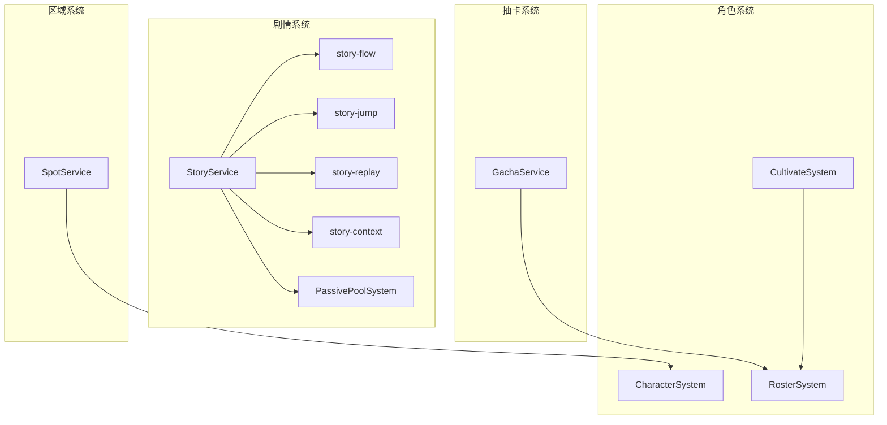
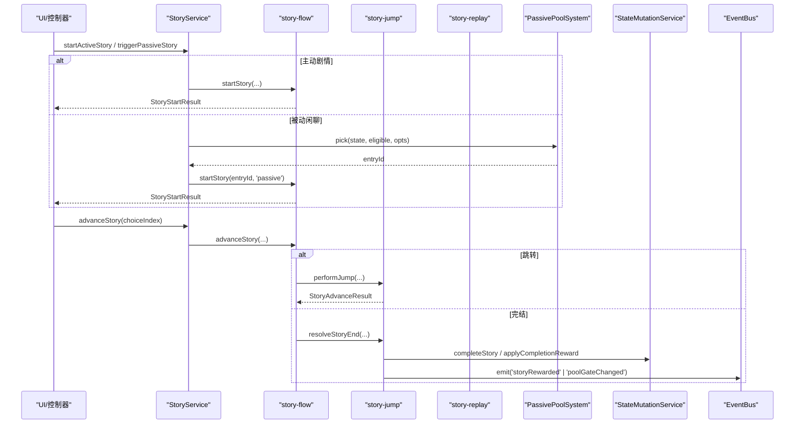
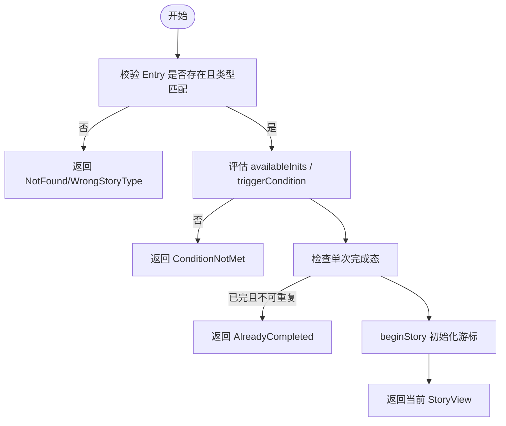
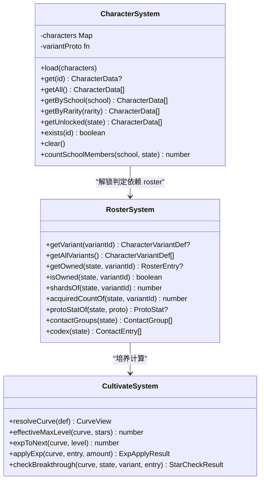
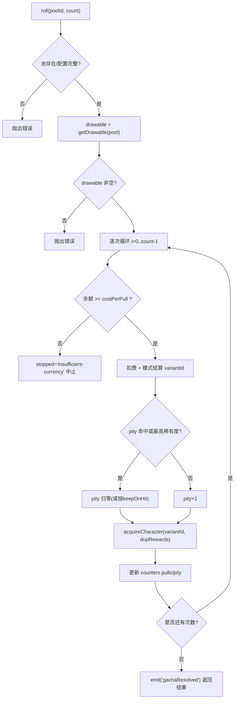
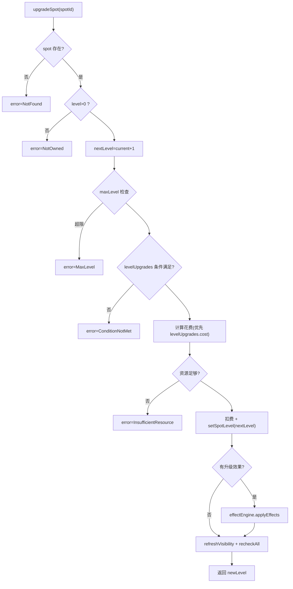
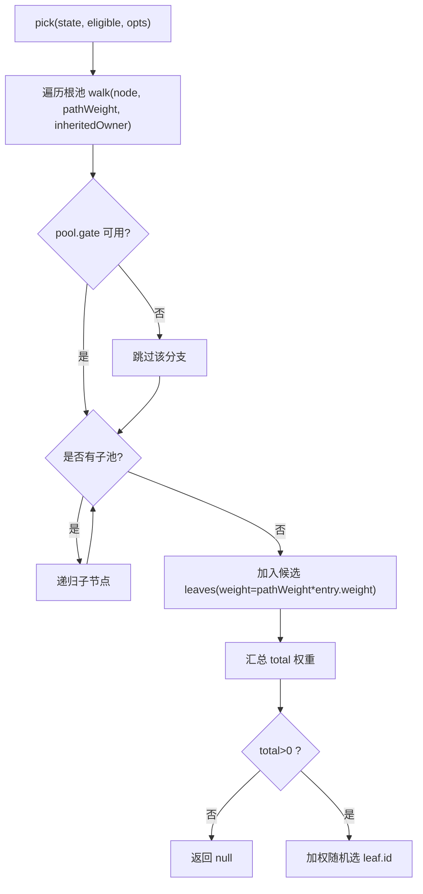
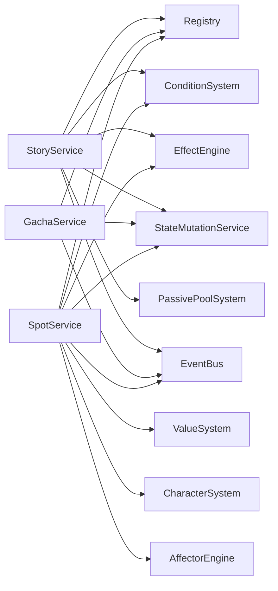

# 游戏系统

<cite>
**本文引用的文件**
- [story-service.ts](file://src/engine/game/story-service.ts)
- [story-flow.ts](file://src/engine/game/story-flow.ts)
- [story-jump.ts](file://src/engine/game/story-jump.ts)
- [story-replay.ts](file://src/engine/game/story-replay.ts)
- [story-context.ts](file://src/engine/game/story-context.ts)
- [character-system.ts](file://src/engine/system/character-system.ts)
- [roster-system.ts](file://src/engine/system/roster-system.ts)
- [cultivate-system.ts](file://src/engine/system/cultivate-system.ts)
- [gacha-service.ts](file://src/engine/system/gacha-service.ts)
- [spot-service.ts](file://src/engine/game/spot-service.ts)
- [passive-pool-system.ts](file://src/engine/system/passive-pool-system.ts)
</cite>

## 目录
1. [简介](#简介)
2. [项目结构](#项目结构)
3. [核心组件](#核心组件)
4. [架构总览](#架构总览)
5. [详细组件分析](#详细组件分析)
6. [依赖关系分析](#依赖关系分析)
7. [性能考量](#性能考量)
8. [故障排查指南](#故障排查指南)
9. [结论](#结论)
10. [附录：API 接口文档](#附录api-接口文档)

## 简介
本技术文档面向 ACProgram 游戏系统的四大子系统：剧情服务 StoryService、角色系统 CharacterSystem、抽卡系统 GachaService、区域系统 SpotService。文档聚焦以下目标：
- 剧情流程控制、分支剧情实现与演出效果管理
- 角色获取、培养机制与属性计算
- 抽卡概率算法、保底机制与随机数生成
- 区域移动逻辑、设施管理与产出计算
- 各系统 API 方法签名、参数与返回值说明
- 系统集成、数据持久化与性能优化最佳实践

## 项目结构
围绕四个核心系统，代码按“引擎层 + 系统层 + 类型/注册表”组织：
- 剧情系统位于 engine/game，拆分为 story-service（门面）、story-flow（启动/推进/发送）、story-jump（跳转链）、story-replay（重读/守卫）、story-context（运行时上下文）
- 角色系统位于 engine/system，包含 character-system（原型查询）、roster-system（通讯录只读视图）、cultivate-system（纯计算）
- 抽卡系统位于 engine/system，gacha-service 负责抽取模式注册与结算
- 区域系统位于 engine/game，spot-service 负责购买/升级/标签/可见性与产出计算
- 被动闲聊池系统 passive-pool-system 为剧情系统提供树状池抽取能力

图表来源
- [story-service.ts:52-84](file://src/engine/game/story-service.ts#L52-L84)
- [story-flow.ts:26-104](file://src/engine/game/story-flow.ts#L26-L104)
- [story-jump.ts:17-42](file://src/engine/game/story-jump.ts#L17-L42)
- [story-replay.ts:32-43](file://src/engine/game/story-replay.ts#L32-L43)
- [passive-pool-system.ts:20-35](file://src/engine/system/passive-pool-system.ts#L20-L35)
- [character-system.ts:18-32](file://src/engine/system/character-system.ts#L18-L32)
- [roster-system.ts:38-57](file://src/engine/system/roster-system.ts#L38-L57)
- [gacha-service.ts:83-98](file://src/engine/system/gacha-service.ts#L83-L98)
- [spot-service.ts:46-51](file://src/engine/game/spot-service.ts#L46-L51)

章节来源
- [story-service.ts:1-271](file://src/engine/game/story-service.ts#L1-L271)
- [story-flow.ts:1-410](file://src/engine/game/story-flow.ts#L1-L410)
- [story-jump.ts:1-109](file://src/engine/game/story-jump.ts#L1-L109)
- [story-replay.ts:1-44](file://src/engine/game/story-replay.ts#L1-L44)
- [passive-pool-system.ts:1-193](file://src/engine/system/passive-pool-system.ts#L1-L193)
- [character-system.ts:1-87](file://src/engine/system/character-system.ts#L1-L87)
- [roster-system.ts:1-105](file://src/engine/system/roster-system.ts#L1-L105)
- [gacha-service.ts:1-187](file://src/engine/system/gacha-service.ts#L1-L187)
- [spot-service.ts:1-255](file://src/engine/game/spot-service.ts#L1-L255)

## 核心组件
- StoryService：剧情游标持有与访问、对外 API 委托；通过 StoryRuntime 将条件系统、效果引擎、状态变更、事件总线等注入到子模块，解耦循环依赖
- CharacterSystem：加载并查询角色原型数据，基于 roster 判定解锁
- RosterSystem：玩家持有的差分实例与碎片的只读视图，提供通讯录/图鉴分组
- CultivateSystem：经验曲线解析、升级推演、突破校验的纯计算模块
- GachaService：抽取模式注册与 ba-classic 结算，含保底、UP 权重、资源扣减与计数写入
- SpotService：Spot 购买/升级/标签/可见性刷新/产出计算，结合 Affector 与 ValueSystem

章节来源
- [story-service.ts:52-84](file://src/engine/game/story-service.ts#L52-L84)
- [character-system.ts:18-87](file://src/engine/system/character-system.ts#L18-L87)
- [roster-system.ts:38-105](file://src/engine/system/roster-system.ts#L38-L105)
- [cultivate-system.ts:15-107](file://src/engine/system/cultivate-system.ts#L15-L107)
- [gacha-service.ts:83-187](file://src/engine/system/gacha-service.ts#L83-L187)
- [spot-service.ts:46-255](file://src/engine/game/spot-service.ts#L46-L255)

## 架构总览
剧情系统以 StoryService 为门面，内部由 story-flow/jump/replay/context 协作完成启动、推进、跳转、重读与奖励结算；被动闲聊通过 PassivePoolSystem 进行树状池抽取与 gate 剪枝。角色系统以 CharacterSystem 提供原型查询，RosterSystem 提供持有视图，CultivateSystem 提供纯计算。抽卡系统以 GachaService 为核心，统一模式与保底结算。区域系统以 SpotService 为中心，结合 ValueSystem、ConditionSystem、EffectEngine、AffectorEngine 完成升级、标签与产出。

图表来源
- [story-service.ts:180-228](file://src/engine/game/story-service.ts#L180-L228)
- [story-flow.ts:54-131](file://src/engine/game/story-flow.ts#L54-L131)
- [story-jump.ts:17-109](file://src/engine/game/story-jump.ts#L17-L109)
- [passive-pool-system.ts:76-165](file://src/engine/system/passive-pool-system.ts#L76-L165)

## 详细组件分析

### 剧情服务 StoryService
职责与要点：
- 维护全局与聊天沙盒两类游标，支持并行互不打断的对话空间
- 提供 startActiveStory/startCardStory/startStory/triggerPassiveStory/replayStory/advanceStory/getSendState/clickSend/getCurrentStoryView 等 API
- 通过 StoryRuntime 将 registry、conditionSystem、effectEngine、mutations、eventBus、passivePools、travelToArea 等注入到子模块，避免循环依赖
- 处理剧情中的 travelToArea 移动、flag 追踪、完成奖励与冷却/阻断

关键流程：
- 启动：校验类型、条件、重复态，beginStory 初始化游标
- 推进：选项校验、点击工作防护、效果应用、跳转或下一页
- 跳转：goto/insert 栈管理、深度限制、阅读日志记录
- 完结：发放奖励、记录完成、被动冷却与对话空间阻断、发出 storyRewarded 事件

图表来源
- [story-flow.ts:54-104](file://src/engine/game/story-flow.ts#L54-L104)
- [story-service.ts:180-203](file://src/engine/game/story-service.ts#L180-L203)

章节来源
- [story-service.ts:52-271](file://src/engine/game/story-service.ts#L52-L271)
- [story-flow.ts:26-410](file://src/engine/game/story-flow.ts#L26-L410)
- [story-jump.ts:17-109](file://src/engine/game/story-jump.ts#L17-L109)
- [story-replay.ts:12-43](file://src/engine/game/story-replay.ts#L12-L43)
- [story-context.ts:24-49](file://src/engine/game/story-context.ts#L24-L49)

### 角色系统 CharacterSystem
职责与要点：
- 加载 CharacterData 并提供按学校/稀有度筛选、存在性检查
- 解锁判定以 roster 为准：拥有任一差分即视为解锁该原型
- 提供 countSchoolMembers 统计同校已解锁数量

与 RosterSystem/CultivateSystem 的关系：
- CharacterSystem 仅负责原型元数据查询
- RosterSystem 提供持有实例与碎片视图
- CultivateSystem 提供经验/星级纯计算，写操作由 StateMutationService 执行

图表来源
- [character-system.ts:18-87](file://src/engine/system/character-system.ts#L18-L87)
- [roster-system.ts:38-105](file://src/engine/system/roster-system.ts#L38-L105)
- [cultivate-system.ts:15-107](file://src/engine/system/cultivate-system.ts#L15-L107)

章节来源
- [character-system.ts:1-87](file://src/engine/system/character-system.ts#L1-L87)
- [roster-system.ts:1-105](file://src/engine/system/roster-system.ts#L1-L105)
- [cultivate-system.ts:1-107](file://src/engine/system/cultivate-system.ts#L1-L107)

### 抽卡系统 GachaService
职责与要点：
- 抽取模式注册表：目前内置 ba-classic 模式
- 概率算法：稀有度权重 roll → 稀有度内选择（UP featured 半权重偏向）→ 保底必出 UP
- 保底机制：pity 计数器在命中保底或最高稀有度时按 keepOnHit 配置归零或累加
- 随机数：默认 Math.random，可注入确定性 RNG 用于测试
- 资源与计数：货币扣除、获得/转化、gachaState 计数写入均经 StateMutationService

图表来源
- [gacha-service.ts:56-81](file://src/engine/system/gacha-service.ts#L56-L81)
- [gacha-service.ts:117-172](file://src/engine/system/gacha-service.ts#L117-L172)

章节来源
- [gacha-service.ts:1-187](file://src/engine/system/gacha-service.ts#L1-L187)

### 区域系统 SpotService
职责与要点：
- 升级 Spot：等级上限检查、条件评估、花费计算（优先 levelUpgrades 定义，否则通用公式）、扣费、设置等级、执行升级效果、刷新可见性与 affector 重算
- 分配 Manager：冻结 manager 加成倍率为 1.0
- 产出计算：base × enhancement，managerBonus 冻结为 0
- 有效等级上限：优先级为 Affector remove/set 覆盖 > Spot 自身 maxLevel
- 手动解锁：可见性检查、上限检查、资源检查、扣费、设置 level=1
- 标签管理：运行时增删 Tag，触发可见性刷新与 affector 重算

图表来源
- [spot-service.ts:54-131](file://src/engine/game/spot-service.ts#L54-L131)

章节来源
- [spot-service.ts:1-255](file://src/engine/game/spot-service.ts#L1-L255)

### 被动闲聊池系统 PassivePoolSystem
职责与要点：
- 树状池抽取：从根池递归下降，gate 不通过的分支整枝剪除
- 权重计算：路径上各池权重连乘 × entry 自身权重，加权随机选取
- 壁垒与阻断：owner 归属约束、blocks 锁定整体不可抽
- 冷却：池级与 entry 级冷却帧检查
- 事件驱动：条件依赖索引，事件命中标脏，惰性求值并缓存 gate 结果

图表来源
- [passive-pool-system.ts:76-165](file://src/engine/system/passive-pool-system.ts#L76-L165)

章节来源
- [passive-pool-system.ts:1-193](file://src/engine/system/passive-pool-system.ts#L1-L193)

## 依赖关系分析
- StoryService 依赖：Registry、ConditionSystem、EffectEngine、StateMutationService、PassivePoolSystem、EventBus、travelToArea
- GachaService 依赖：Registry、StateMutationService、EventBus、getState、getBalance、getDrawable
- SpotService 依赖：Registry、ValueSystem、ConditionSystem、StateMutationService、EffectEngine、CharacterSystem、AffectorEngine、EventBus、DevLog、getState、getVisibility、refreshVisibility、getResourceAmount
- CharacterSystem/RosterSystem/CultivateSystem 之间松耦合：前者提供原型查询，后者提供持有视图与纯计算

图表来源
- [story-service.ts:36-48](file://src/engine/game/story-service.ts#L36-L48)
- [gacha-service.ts:87-98](file://src/engine/system/gacha-service.ts#L87-L98)
- [spot-service.ts:28-44](file://src/engine/game/spot-service.ts#L28-L44)

章节来源
- [story-service.ts:36-84](file://src/engine/game/story-service.ts#L36-L84)
- [gacha-service.ts:83-98](file://src/engine/system/gacha-service.ts#L83-L98)
- [spot-service.ts:28-51](file://src/engine/game/spot-service.ts#L28-L51)

## 性能考量
- 剧情推进与跳转：使用 insertStack 与 jumpDepth 限制防止深嵌套与循环跳转；read logs 增量记录减少全量扫描
- 被动池抽取：条件依赖索引 + 惰性求值 + gate 缓存，事件驱动标脏，避免每次全量重算
- 抽卡结算：逐次扣费与计数写入，批量完成后统一 emit 事件，降低 UI 刷新频率
- 区域升级：先检查条件与上限再扣费，失败快速返回；升级后仅刷新必要可见性与 affector 重算
- 角色解锁：基于 roster 单一真相来源，避免多源 flag 不一致导致的额外计算

[本节为通用性能建议，不直接分析具体文件]

## 故障排查指南
- 剧情相关
  - AlreadyActive：已有进行中剧情，需等待结束或强制打断（force 模式）
  - ConditionNotMet：availableInits 或 triggerCondition 未满足
  - AlreadyCompleted：单次剧情已完成且不可重复
  - ClickRequired：需要完成 clickWork 才能离开当前页
  - BranchGuardDenied：重阅读模式下前置阅读不足
- 抽卡相关
  - 未知卡池/未注册模式/配置不完整：检查 pool 定义与 rates/members
  - insufficient-currency：余额不足导致中途停止
  - 无可抽成员：drawable 为空或被关闭
- 区域相关
  - NotOwned/MaxLevel/ConditionNotMet/InsufficientResource：升级失败常见原因
  - NotVisible/AlreadyOwned：解锁失败常见原因
- 事件调试
  - 关注 gachaResolved、storyRewarded、poolGateChanged 等事件输出

章节来源
- [story-flow.ts:54-131](file://src/engine/game/story-flow.ts#L54-L131)
- [story-flow.ts:133-221](file://src/engine/game/story-flow.ts#L133-L221)
- [gacha-service.ts:117-172](file://src/engine/system/gacha-service.ts#L117-L172)
- [spot-service.ts:54-210](file://src/engine/game/spot-service.ts#L54-L210)

## 结论
ACProgram 的四大系统在职责边界清晰、依赖解耦的基础上实现了可扩展的剧情演出、稳定的角色与抽卡机制、以及灵活的区域设施管理。通过 StoryRuntime 与事件驱动的条件系统，系统在复杂交互场景下保持了良好的可维护性与性能表现。建议在后续扩展中继续遵循“纯计算与状态变更分离”“事件驱动惰性求值”“单一真相来源”的设计原则。

[本节为总结性内容，不直接分析具体文件]

## 附录：API 接口文档

### StoryService 接口
- startActiveStory(storyId, owner?): StoryStartResult
  - 参数：storyId 字符串，owner 可选字符串（聊天沙盒标识）
  - 返回：成功返回 StoryStartResult，失败返回错误码（如 AlreadyActive/NotFound/WrongStoryType/ConditionNotMet/AlreadyCompleted）
- startCardStory(storyId, owner?): StoryStartResult
  - 语义：清空当前游标，跳过入口条件但仍尊重单次完成态
- startStory(storyId, expectedType, owner?, opts?): StoryStartResult
  - 参数：expectedType 为 active/passive；opts.force/skipConditions 控制强制与条件跳过
- triggerPassiveStory(initId?, owner?): StoryStartResult
  - 通过 PassivePoolSystem 抽取被动闲聊并启动
- replayStory(storyId, owner?): StoryStartResult
  - 重读入口，仅检查 replayable 与无进行中剧情
- advanceStory(choiceIndex?, owner?): StoryAdvanceResult
  - 推进剧情，处理选项校验、点击工作、跳转与完结
- getSendState(owner?): SendState
  - 返回底部按钮状态（idle/choice/kizuna/advance），含 clickWork 进度
- clickSend(owner?): SendResult
  - 点击回复按钮：推进剧情或触发被动闲聊，返回 completed/working/idle
- getCurrentStoryView(owner?): StoryView | null
  - 返回当前播放页面与可用选项索引

章节来源
- [story-service.ts:180-228](file://src/engine/game/story-service.ts#L180-L228)
- [story-flow.ts:26-410](file://src/engine/game/story-flow.ts#L26-L410)

### CharacterSystem 接口
- load(characters): void
- get(id): CharacterData | undefined
- getAll(): CharacterData[]
- getBySchool(school): CharacterData[]
- getByRarity(rarity): CharacterData[]
- getUnlocked(state): CharacterData[]
- exists(id): boolean
- clear(): void
- countSchoolMembers(school, state): number

章节来源
- [character-system.ts:18-87](file://src/engine/system/character-system.ts#L18-L87)

### RosterSystem 接口
- getVariant(variantId): CharacterVariantDef | undefined
- getAllVariants(): CharacterVariantDef[]
- getOwned(state, variantId): RosterEntry | undefined
- isOwned(state, variantId): boolean
- shardsOf(state, variantId): number
- acquiredCountOf(state, variantId): number
- protoStatOf(state, proto): ProtoStat | undefined
- contactGroups(state): ContactGroup[]
- codex(state): ContactEntry[]

章节来源
- [roster-system.ts:38-105](file://src/engine/system/roster-system.ts#L38-L105)

### CultivateSystem 接口
- resolveCurve(def): CurveView
- effectiveMaxLevel(curve, stars): number
- expToNext(curve, level): number
- applyExp(curve, entry, amount): ExpApplyResult
- checkBreakthrough(curve, state, variant, entry): StarCheckResult

章节来源
- [cultivate-system.ts:15-107](file://src/engine/system/cultivate-system.ts#L15-L107)

### GachaService 接口
- setRng(rng): void
- getPool(poolId): GachaPoolDef | undefined
- countersOf(poolId): { pity: number; pulls: number }
- roll(poolId, count): RollSummary
  - 返回：results 数组（含 variantId/duplicate/shards/bonusResources），stopped 可能为 insufficient-currency

章节来源
- [gacha-service.ts:83-187](file://src/engine/system/gacha-service.ts#L83-L187)

### SpotService 接口
- upgradeSpot(spotId): SpotUpgradeResult
  - 返回：success/newLevel 或 error（NotFound/NotOwned/MaxLevel/ConditionNotMet/InsufficientResource）
- assignManager(spotId, character): boolean
- getManagerBonus(spotId): number（固定 1.0）
- getSpotYield(spotId): { base; managerBonus; tagMultiplier; total }
- getEffectiveMaxLevel(spotId): number | undefined
- unlockSpot(spotId): SpotUnlockResult
  - 返回：success 或 error（NotFound/AlreadyOwned/NotVisible/MaxLevel/InsufficientResource）
- addSpotTag(spotId, tag): boolean
- removeSpotTag(spotId, tag): boolean

章节来源
- [spot-service.ts:54-255](file://src/engine/game/spot-service.ts#L54-L255)