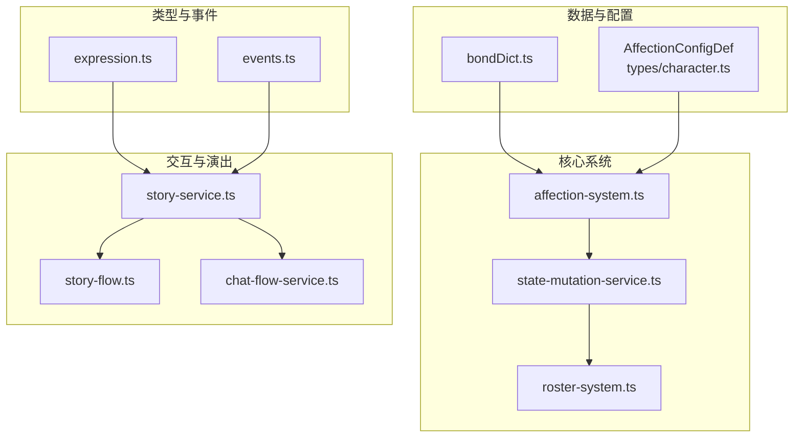
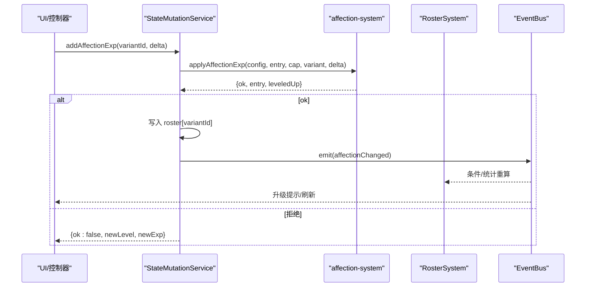
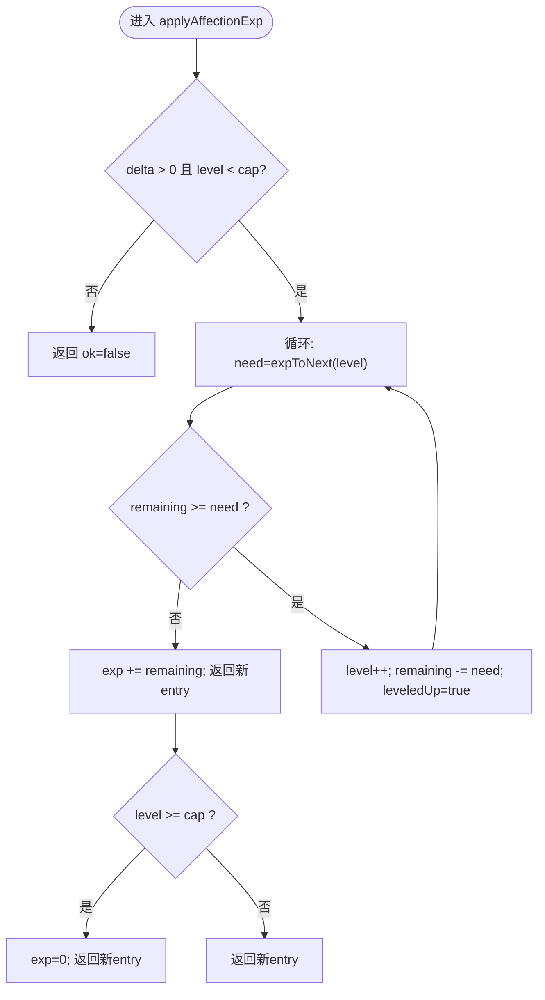
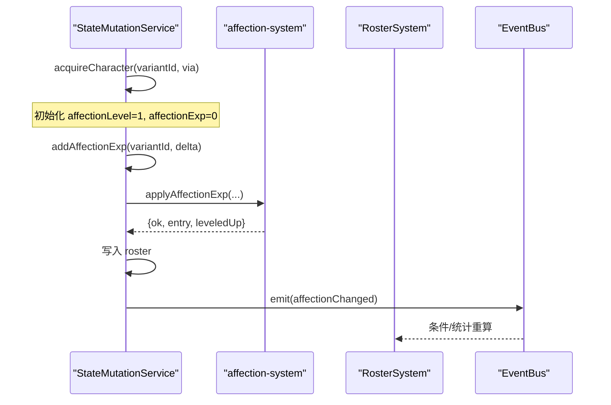
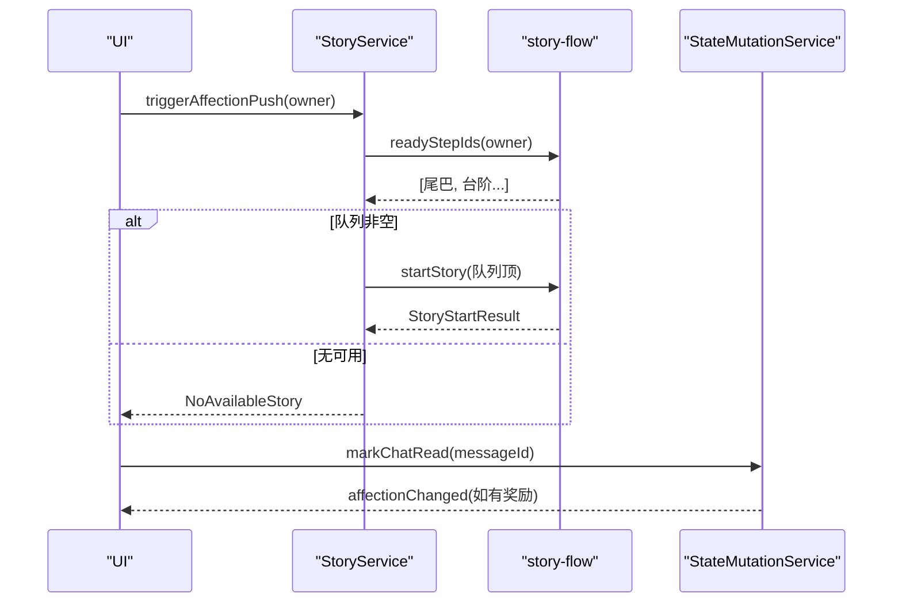
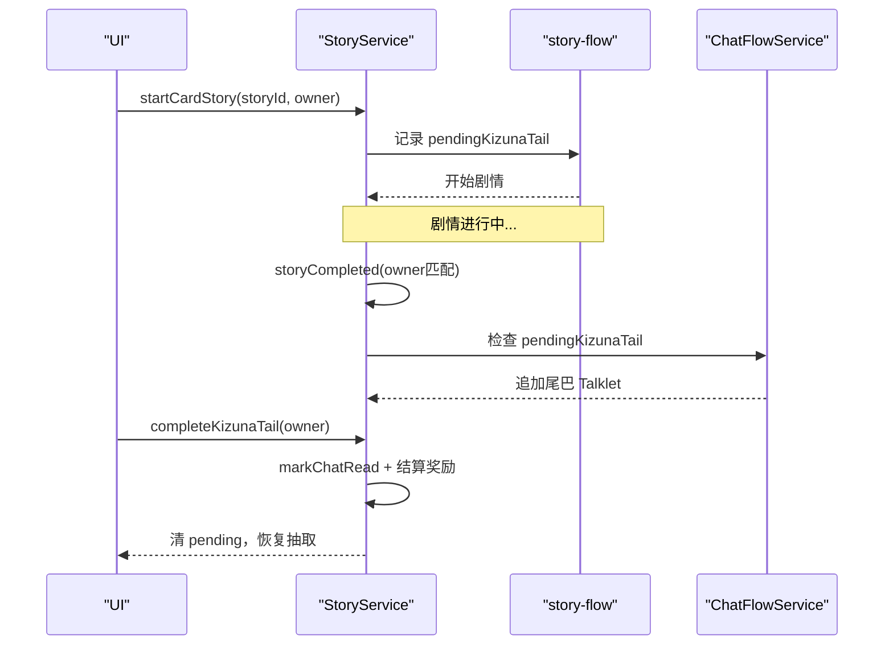
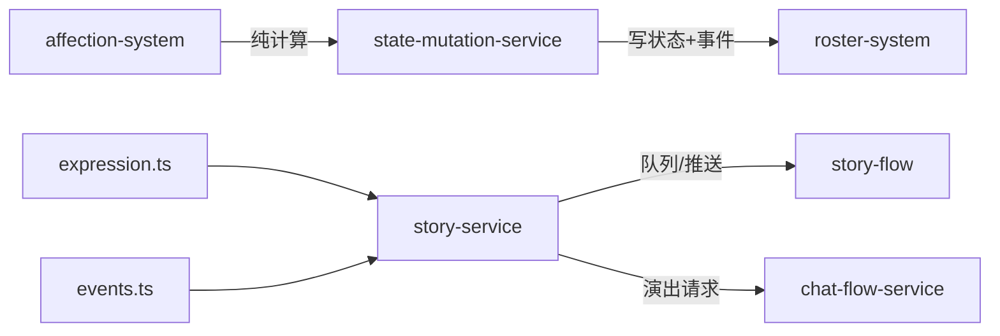

# 羁绊系统

<cite>
**本文引用的文件**
- [bondDict.ts](file://bondDict.ts)
- [affection-system.ts](file://src/engine/system/affection-system.ts)
- [state-mutation-service.ts](file://src/engine/system/state-mutation-service.ts)
- [roster-system.ts](file://src/engine/system/roster-system.ts)
- [character.ts](file://src/engine/types/character.ts)
- [expression.ts](file://src/engine/types/expression.ts)
- [events.ts](file://src/engine/types/events.ts)
- [story-service.ts](file://src/engine/game/story-service.ts)
- [story-flow.ts](file://src/engine/game/story-flow.ts)
- [chat-flow-service.ts](file://src/engine/game/chat-flow-service.ts)
- [planning.md](file://docs-828/06-adr/planning.md)
- [affection-system.test.ts](file://tests/engine/affection-system.test.ts)
</cite>

## 目录
1. [简介](#简介)
2. [项目结构](#项目结构)
3. [核心组件](#核心组件)
4. [架构总览](#架构总览)
5. [详细组件分析](#详细组件分析)
6. [依赖关系分析](#依赖关系分析)
7. [性能考量](#性能考量)
8. [故障排查指南](#故障排查指南)
9. [结论](#结论)
10. [附录](#附录)

## 简介
本系统实现“蔚蓝档案式”的羁绊回环：聊天读消息 → 奖励好感小值 → 好感等级解锁更多聊天与羁绊剧情 → 剧情完成后在对话空间追加尾巴段落，并结算未读计数。系统分为三层：
- 数值层：好感阶梯、星级锁、升级推演（纯计算）
- 交互层：聊天消息门槛、已读结算、就绪队列推送
- 演出层：羁绊卡片触发剧情、尾巴段落回放、未读提示

该设计将“写状态”与“纯计算”解耦，通过事件驱动 UI 与条件系统联动，保证可测试性与可扩展性。

## 项目结构
- 数据定义与默认表
  - 引擎内置默认阶梯来源于仓库根目录的参考数据，运行时以常量数组提供；数据包可通过 affectionConfig 覆盖。
- 系统与类型
  - 好感纯计算模块、统一状态写入入口、通讯录只读查询、表达式与事件类型、剧情服务编排、聊天流演出服务。
- 文档与测试
  - 规划文档明确三节需求与边界；测试覆盖数值、轴 A/B、尾巴等场景。

图表来源
- [affection-system.ts:20-39](file://src/engine/system/affection-system.ts#L20-L39)
- [state-mutation-service.ts:222-243](file://src/engine/system/state-mutation-service.ts#L222-L243)
- [story-service.ts:208-230](file://src/engine/game/story-service.ts#L208-L230)
- [story-flow.ts:163-177](file://src/engine/game/story-flow.ts#L163-L177)
- [chat-flow-service.ts:14-37](file://src/engine/game/chat-flow-service.ts#L14-L37)
- [character.ts:447-476](file://src/engine/types/character.ts#L447-L476)
- [expression.ts:70-78](file://src/engine/types/expression.ts#L70-L78)
- [events.ts:54-56](file://src/engine/types/events.ts#L54-L56)

章节来源
- [planning.md:1-12](file://docs-828/06-adr/planning.md#L1-L12)

## 核心组件
- 好感纯计算（affection-system.ts）
  - 提供默认阶梯、配置解析、星级锁上限、跨级升级推演。
- 状态写入（state-mutation-service.ts）
  - 统一变更 PlayerState，包含 acquireCharacter 初始化、addAffectionExp 写入口、事件发射。
- 通讯录只读（roster-system.ts）
  - 暴露 affectionLevelOf / affectionExpOf / affectionLevelCapOf 等只读接口。
- 表达式与事件（expression.ts, events.ts）
  - 新增 affectionLevel 条件与 addAffectionExp 效果；登记 affectionChanged 事件。
- 剧情服务（story-service.ts, story-flow.ts）
  - 就绪队列、台阶推送、尾巴优先、未读计数 readyStepCount。
- 聊天流演出（chat-flow-service.ts）
  - 清理/显示演出文本，供 UI 订阅操作聊天流。

章节来源
- [affection-system.ts:1-111](file://src/engine/system/affection-system.ts#L1-L111)
- [state-mutation-service.ts:156-243](file://src/engine/system/state-mutation-service.ts#L156-L243)
- [roster-system.ts:40-69](file://src/engine/system/roster-system.ts#L40-L69)
- [expression.ts:70-78](file://src/engine/types/expression.ts#L70-L78)
- [events.ts:54-56](file://src/engine/types/events.ts#L54-L56)
- [story-service.ts:208-230](file://src/engine/game/story-service.ts#L208-L230)
- [story-flow.ts:163-177](file://src/engine/game/story-flow.ts#L163-L177)
- [chat-flow-service.ts:14-37](file://src/engine/game/chat-flow-service.ts#L14-L37)

## 架构总览
好感系统采用“计算与服务分离 + 事件驱动”的架构：
- 计算层：不直接修改状态，返回新 entry 与是否升级标记。
- 服务层：校验参数、应用计算结果、持久化到 PlayerState、发射事件。
- 交互层：基于事件与条件系统，驱动 UI 与剧情流程。

图表来源
- [state-mutation-service.ts:222-243](file://src/engine/system/state-mutation-service.ts#L222-L243)
- [affection-system.ts:89-110](file://src/engine/system/affection-system.ts#L89-L110)
- [events.ts:54-56](file://src/engine/types/events.ts#L54-L56)

## 详细组件分析

### 数值层：好感阶梯与星级锁
- 默认阶梯
  - 使用引擎内置常量数组，长度即 maxLevel；超出部分按 expBeyond 固定需求。
  - 参考数据 bondDict.ts 提供原版羁绊表，引擎内置曲线与其一致。
- 配置解析
  - 若数据包未提供 affectionConfig，则回退到引擎默认；空数组视为未声明。
- 星级锁
  - 有效上限 cap = min(星级锁(stars), maxLevel)。
  - per-variant 覆盖表优先于全局默认表；超表取表尾值。
- 升级推演
  - 支持一次跨多级；达 cap 后小值截断（不保留溢出），解锁上限后重新积累。
  - 未拥有或 delta <= 0 拒绝。

图表来源
- [affection-system.ts:66-110](file://src/engine/system/affection-system.ts#L66-L110)

章节来源
- [affection-system.ts:20-81](file://src/engine/system/affection-system.ts#L20-L81)
- [bondDict.ts:1-103](file://bondDict.ts#L1-L103)
- [character.ts:447-476](file://src/engine/types/character.ts#L447-L476)
- [planning.md:46-86](file://docs-828/06-adr/planning.md#L46-L86)

### 写入口：状态变更与事件
- acquireCharacter
  - 首次获得创建 RosterEntry，初始化 affectionLevel=1, affectionExp=0。
- addAffectionExp
  - 解析配置与 cap，调用纯函数推演，写入 roster 并发出 affectionChanged。
- 事件链
  - affectionChanged 携带 delta、newLevel、newExp、leveledUp，供条件系统、Trigger、UI 消费。

图表来源
- [state-mutation-service.ts:156-243](file://src/engine/system/state-mutation-service.ts#L156-L243)
- [events.ts:54-56](file://src/engine/types/events.ts#L54-L56)

章节来源
- [state-mutation-service.ts:156-243](file://src/engine/system/state-mutation-service.ts#L156-L243)
- [events.ts:54-56](file://src/engine/types/events.ts#L54-L56)

### 交互层：聊天消息与就绪队列
- 轴A：可用消息与未读计数
  - 可用消息由条件系统评估（含 affectionRequired）。
  - 未读计数 = 可用消息数量；markChatRead 幂等，单次消息仅首次结算奖励，可反复消息每次读取都重新结算。
- 轴B：就绪队列推送
  - 就绪队列包含“尾巴条目”和“好感台阶”，优先级：尾巴绝对优先，其后按需求值升序。
  - 推送时机：进入对话空间自动推送；clickSend idle 必中。
  - 未读计数 = readyStepIds(owner).length。

图表来源
- [story-service.ts:208-230](file://src/engine/game/story-service.ts#L208-L230)
- [story-flow.ts:163-177](file://src/engine/game/story-flow.ts#L163-L177)
- [state-mutation-service.ts:209-243](file://src/engine/system/state-mutation-service.ts#L209-L243)

章节来源
- [planning.md:145-163](file://docs-828/06-adr/planning.md#L145-L163)
- [story-service.ts:208-230](file://src/engine/game/story-service.ts#L208-L230)
- [story-flow.ts:163-177](file://src/engine/game/story-flow.ts#L163-L177)

### 演出层：羁绊卡片与尾巴
- 羁绊卡片
  - 点击卡片启动关联剧情（startCardStory），记录 pendingKizunaTail（运行时状态，不持久）。
- 尾巴段落
  - 剧情完结后，若 owner 匹配且存在 kizunaTail，则在对话空间追加展示 Talklet 序列。
  - 尾巴展示期间抑制抽取新的被动闲聊，避免打断回环。
- 收尾
  - 尾巴播放完毕执行 markChatRead 并结算 affectionExpReward，清除 pendingKizunaTail。

图表来源
- [story-service.ts:187-222](file://src/engine/game/story-service.ts#L187-L222)
- [chat-flow-service.ts:14-37](file://src/engine/game/chat-flow-service.ts#L14-L37)
- [planning.md:282-327](file://docs-828/06-adr/planning.md#L282-L327)

章节来源
- [planning.md:282-327](file://docs-828/06-adr/planning.md#L282-L327)
- [story-service.ts:187-222](file://src/engine/game/story-service.ts#L187-L222)
- [chat-flow-service.ts:14-37](file://src/engine/game/chat-flow-service.ts#L14-L37)

### 表达式与事件集成
- 条件目标
  - 新增 affectionLevel（key=VariantId，缺失→0），用于聊天消息门槛与剧情条件。
- 效果操作
  - 新增 addAffectionExp（target=VariantId，value=增量），经 effect-ops 分发至 mutations.addAffectionExp。
- 事件目录
  - affectionChanged 登记为 GameEvent，订阅方包括 condition-deps、trigger-system、ui-controller-events。

章节来源
- [expression.ts:70-78](file://src/engine/types/expression.ts#L70-L78)
- [expression.ts:115-124](file://src/engine/types/expression.ts#L115-L124)
- [events.ts:54-56](file://src/engine/types/events.ts#L54-L56)
- [events.ts:123-169](file://src/engine/types/events.ts#L123-L169)

## 依赖关系分析
- 耦合与内聚
  - affection-system 高内聚（纯计算），低耦合（仅依赖 types）。
  - state-mutation-service 作为写入口，聚合各子系统能力，保持单一职责。
  - story-service 编排剧情与队列，依赖 condition-system、effect-engine、passive-pools。
- 外部依赖
  - 事件总线 EventBus 贯穿全链路，确保 UI 与系统解耦。
  - Registry 提供角色差分、曲线、配置等只读视图。
- 循环依赖
  - 通过接口注入（如 characterCatalog reader）避免循环引用。

图表来源
- [affection-system.ts:1-111](file://src/engine/system/affection-system.ts#L1-L111)
- [state-mutation-service.ts:1-603](file://src/engine/system/state-mutation-service.ts#L1-L603)
- [story-service.ts:1-298](file://src/engine/game/story-service.ts#L1-L298)
- [story-flow.ts:152-177](file://src/engine/game/story-flow.ts#L152-L177)
- [chat-flow-service.ts:1-38](file://src/engine/game/chat-flow-service.ts#L1-L38)
- [expression.ts:1-270](file://src/engine/types/expression.ts#L1-L270)
- [events.ts:1-170](file://src/engine/types/events.ts#L1-L170)

章节来源
- [state-mutation-service.ts:1-603](file://src/engine/system/state-mutation-service.ts#L1-L603)
- [story-service.ts:1-298](file://src/engine/game/story-service.ts#L1-L298)

## 性能考量
- 惰性统计上下文
  - 事件 payload 中的 stats 仅在消费方访问时深拷贝，降低每帧事件开销。
- 纯函数推演
  - applyAffectionExp 不修改传入对象，减少副作用与内存分配。
- 队列排序
  - 就绪队列按需求值升序排序，复杂度 O(n log n)，n 为可用条目数，通常较小。
- 事件订阅
  - EVENT_CATALOG 强制穷尽订阅方，便于审计与优化热点路径。

## 故障排查指南
- 常见问题
  - 未拥有角色：addAffectionExp 返回 ok=false，需先 acquireCharacter。
  - delta 非法：<=0 被拒绝，检查来源逻辑。
  - 星级锁限制：当前等级达到 cap 后小值截断，突破星级后可继续积累。
  - 聊天消息不可见：检查 affectionRequired 条件是否满足。
  - 尾巴未播放：确认 owner 匹配、pendingKizunaTail 存在、storyCompleted 触发。
- 调试建议
  - 监听 affectionChanged 事件，核对 newLevel/newExp 变化。
  - 打印 readyStepIds(owner) 查看就绪队列内容。
  - 检查 chatRead 状态，确认 markChatRead 幂等生效。

章节来源
- [state-mutation-service.ts:222-243](file://src/engine/system/state-mutation-service.ts#L222-L243)
- [story-service.ts:208-230](file://src/engine/game/story-service.ts#L208-L230)
- [planning.md:88-92](file://docs-828/06-adr/planning.md#L88-L92)

## 结论
羁绊系统通过清晰的层次划分与事件驱动机制，实现了从数值到交互再到演出的完整闭环。纯计算与服务分离保证了可测试性与扩展性；就绪队列与尾巴机制提升了叙事连贯性。未来可在冷却字段、更多自定义阶梯等方面持续演进。

## 附录
- 默认阶梯与参考表
  - 引擎内置 DEFAULT_AFFECTION_EXP_CURVE 与 bondDict.ts 保持一致，maxLevel=100，defaultLevelCapByStar=[20,20,20,20,20,100]。
- 测试覆盖
  - 数值边界、星级锁、save/load 往返、轴 A/B、尾巴行为均在 affection-system.test.ts 中验证。

章节来源
- [affection-system.ts:20-39](file://src/engine/system/affection-system.ts#L20-L39)
- [bondDict.ts:1-103](file://bondDict.ts#L1-L103)
- [affection-system.test.ts:1-419](file://tests/engine/affection-system.test.ts#L1-L419)