# 角色系统

<cite>
**本文引用的文件**
- [src/engine/system/character-system.ts](file://src/engine/system/character-system.ts)
- [src/engine/system/roster-system.ts](file://src/engine/system/roster-system.ts)
- [src/engine/system/character-availability.ts](file://src/engine/system/character-availability.ts)
- [src/engine/core/chara-profile.ts](file://src/engine/core/chara-profile.ts)
- [src/engine/system/chara-profile-service.ts](file://src/engine/system/chara-profile-service.ts)
- [src/engine/system/cultivate-system.ts](file://src/engine/system/cultivate-system.ts)
- [src/engine/system/state-mutation-service.ts](file://src/engine/system/state-mutation-service.ts)
- [src/engine/system/color-equipment-system.ts](file://src/engine/system/color-equipment-system.ts)
- [src/engine/system/affection-system.ts](file://src/engine/system/affection-system.ts)
- [src/engine/expression/condition-system.ts](file://src/engine/expression/condition-system.ts)
- [src/engine/types/character.ts](file://src/engine/types/character.ts)
- [src/engine/types/chara-profile.ts](file://src/engine/types/chara-profile.ts)
- [src/engine/game/wiring.ts](file://src/engine/game/wiring.ts)
</cite>

## 更新摘要
**所做更改**
- 新增好感度系统完整文档，包括 RosterSystem 的好感查询方法和 StateMutationService 的好感操作
- 扩展条件系统以支持好感等级比较（affectionLevel target）
- 更新 RosterEntry 数据结构以包含 affectionLevel 和 affectionExp 字段
- 添加好感度配置系统和星级锁机制说明
- 更新相关 API 接口文档以包含好感度操作方法

## 目录
1. [简介](#简介)
2. [项目结构](#项目结构)
3. [核心组件](#核心组件)
4. [架构总览](#架构总览)
5. [详细组件分析](#详细组件分析)
6. [依赖关系分析](#依赖关系分析)
7. [性能考量](#性能考量)
8. [故障排查指南](#故障排查指南)
9. [结论](#结论)
10. [附录：API 参考](#附录api-参考)

## 简介
本技术文档面向 ACProgram 的角色系统，围绕以下目标展开：
- CharacterSystem 角色原型与解锁判定
- RosterSystem 角色阵容（通讯录/图鉴）管理，**新增好感度查询功能**
- 角色可用性判断（卡池关闭条件、世界 Pool、动态变化）
- CharaProfile 角色档案（头像-人名解析、优先级、持久化）
- **ColorEquipmentSystem 色彩装备系统**：三层颜色架构（Color + ColorGroup + ColorEquipment）
- **AffectionSystem 好感度系统**：**新增** - 完整的羁绊等级管理和经验计算
- 完整 API 接口说明（角色获取、培养、状态变更、装备管理、**好感度操作**）
- 数据持久化、性能优化与扩展开发指南

## 项目结构
角色系统由"数据定义 + 运行时系统 + 服务门面"三层组成：
- 数据定义：types 层描述角色变体、培养曲线、抽卡池、**色彩装备、好感度配置**等；data/base 提供基础示例数据。
- 运行时系统：system 层实现角色查询、阵容、可用性、培养计算、**色彩装备管理、好感度计算**、状态变更；core 层提供纯函数解析（如头像-人名）。
- 服务门面：对外暴露统一入口（如 StateMutationService），保证状态写入的幂等性与事件通知。

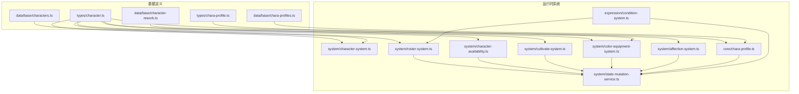

**图表来源**
- [src/engine/types/character.ts:79-137](file://src/engine/types/character.ts#L79-L137)
- [src/engine/types/chara-profile.ts:32-43](file://src/engine/types/chara-profile.ts#L32-L43)
- [src/engine/system/character-system.ts:18-86](file://src/engine/system/character-system.ts#L18-L86)
- [src/engine/system/roster-system.ts:38-104](file://src/engine/system/roster-system.ts#L38-L104)
- [src/engine/system/character-availability.ts:18-77](file://src/engine/system/character-availability.ts#L18-L77)
- [src/engine/system/cultivate-system.ts:15-107](file://src/engine/system/cultivate-system.ts#L15-L107)
- [src/engine/system/color-equipment-system.ts:28-126](file://src/engine/system/color-equipment-system.ts#L28-L126)
- [src/engine/system/affection-system.ts:1-110](file://src/engine/system/affection-system.ts#L1-L110)
- [src/engine/core/chara-profile.ts:24-46](file://src/engine/core/chara-profile.ts#L24-L46)
- [src/engine/system/state-mutation-service.ts:148-197](file://src/engine/system/state-mutation-service.ts#L148-L197)

## 核心组件
- CharacterSystem：加载并查询角色原型数据，基于 roster 判定已解锁原型集合。
- RosterSystem：通讯录与图鉴视图、碎片统计、按学校分组排序，**新增好感度查询方法**。
- CharacterAvailabilityService：卡池可及性、世界 Pool 刷新、开放池成员合并。
- CultivateSystem：经验升级、突破校验、曲线解析（纯计算）。
- **ColorEquipmentSystem**：色彩装备系统，管理 ColorGroup 和 ColorEquipment 的解锁、收集和效果聚合。
- **AffectionSystem**：**新增** - 好感度纯计算模块，处理羁绊等级提升和经验分配。
- CharaProfileService / resolveCharaProfile：头像-人名解析管线与玩家覆写持久化。
- StateMutationService：统一状态写入入口（获得角色、培养、资源变更、**装备管理、好感度操作**、事件发射）。
- **ConditionSystem**：**扩展** - 条件求值系统，新增 affectionLevel 条件支持。

**章节来源**
- [src/engine/system/character-system.ts:18-86](file://src/engine/system/character-system.ts#L18-L86)
- [src/engine/system/roster-system.ts:38-104](file://src/engine/system/roster-system.ts#L38-L104)
- [src/engine/system/character-availability.ts:18-77](file://src/engine/system/character-availability.ts#L18-L77)
- [src/engine/system/cultivate-system.ts:15-107](file://src/engine/system/cultivate-system.ts#L15-L107)
- [src/engine/system/color-equipment-system.ts:28-126](file://src/engine/system/color-equipment-system.ts#L28-L126)
- [src/engine/system/affection-system.ts:1-110](file://src/engine/system/affection-system.ts#L1-L110)
- [src/engine/system/chara-profile-service.ts:18-62](file://src/engine/system/chara-profile-service.ts#L18-L62)
- [src/engine/core/chara-profile.ts:24-46](file://src/engine/core/chara-profile.ts#L24-L46)
- [src/engine/system/state-mutation-service.ts:148-197](file://src/engine/system/state-mutation-service.ts#L148-L197)

## 架构总览
角色系统以"只读查询 + 统一写入"为设计原则：
- 查询侧：CharacterSystem/RosterSystem/AvailabilityService/**ColorEquipmentSystem/AffectionSystem**/CharaProfileService 均不直接修改 PlayerState。
- 写入侧：所有变更通过 StateMutationService 完成，确保事件通知、统计同步与幂等性。
- 数据源：types 定义契约，data/base 提供基础数据；运行时通过 Registry 注入变体、曲线、**色彩装备、好感度配置**等定义。

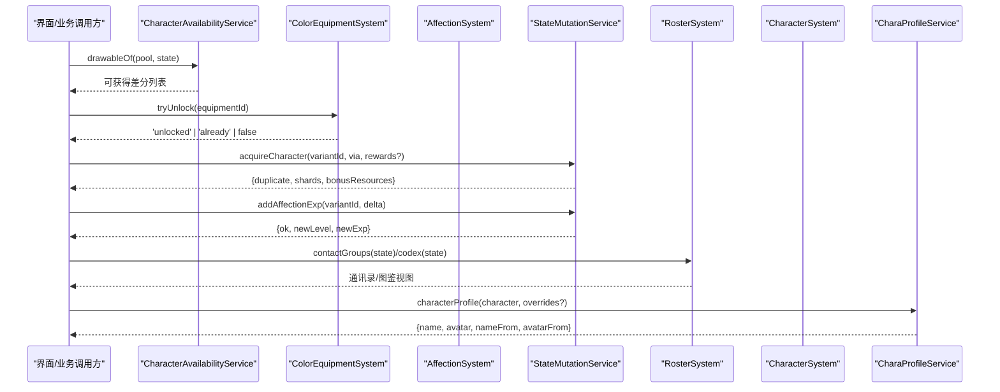

**图表来源**
- [src/engine/system/character-availability.ts:40-56](file://src/engine/system/character-availability.ts#L40-L56)
- [src/engine/system/color-equipment-system.ts:97-109](file://src/engine/system/color-equipment-system.ts#L97-L109)
- [src/engine/system/state-mutation-service.ts:148-197](file://src/engine/system/state-mutation-service.ts#L148-L197)
- [src/engine/system/state-mutation-service.ts:222-243](file://src/engine/system/state-mutation-service.ts#L222-L243)
- [src/engine/system/roster-system.ts:78-103](file://src/engine/system/roster-system.ts#L78-L103)
- [src/engine/system/chara-profile-service.ts:26-45](file://src/engine/system/chara-profile-service.ts#L26-L45)

## 详细组件分析

### CharacterSystem：角色原型与解锁判定
- 职责：加载 CharacterData，按学校/稀有度筛选；基于 roster 判定已解锁原型（任一差分即视为解锁）。
- 关键点：
  - getUnlocked：遍历 state.roster 中的 variantId，通过 variantProto 解析到原型 id，去重后匹配 CharacterData。
  - countSchoolMembers：按学校统计已解锁数量。
- 复杂度：getUnlocked 为 O(V+P)，V 为拥有差分数，P 为原型总数。

**图表来源**
- [src/engine/system/character-system.ts:58-70](file://src/engine/system/character-system.ts#L58-L70)

**章节来源**
- [src/engine/system/character-system.ts:18-86](file://src/engine/system/character-system.ts#L18-L86)

### RosterSystem：角色阵容（通讯录/图鉴）与好感度查询
- 职责：查询玩家持有的差分实例与碎片余额；提供通讯录分组与图鉴视图；**新增好感度查询能力**。
- 通讯录分组：按学校聚合，组内稀有度降序（SuperRare > Rare > Common）。
- 图鉴视图：全部差分 + 持有标记（未获得为占位）。
- **好感度查询**：
  - affectionLevelOf：获取角色当前好感等级（未拥有 → 0；已拥有缺字段 ??= 1）
  - affectionExpOf：获取当前级内积累的好感小值（未拥有 → 0）
  - affectionLevelCapOf：计算好感等级有效上限（考虑星级锁）
- 关键方法：
  - contactGroups(state)：生成通讯录分组。
  - codex(state)：生成图鉴条目。
  - shardsOf/acquiredCountOf/protoStatOf：碎片与累计统计。

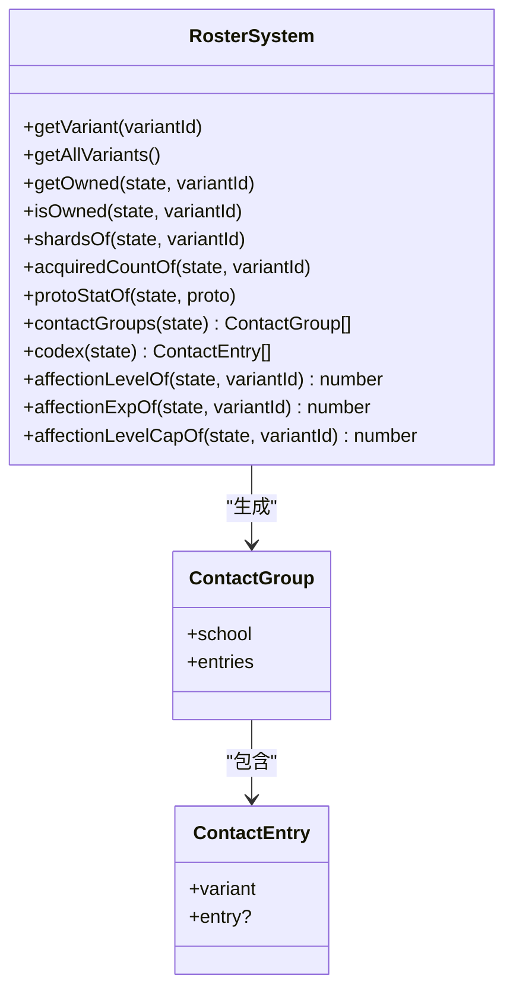

**图表来源**
- [src/engine/system/roster-system.ts:20-30](file://src/engine/system/roster-system.ts#L20-L30)
- [src/engine/system/roster-system.ts:38-104](file://src/engine/system/roster-system.ts#L38-L104)

**章节来源**
- [src/engine/system/roster-system.ts:1-130](file://src/engine/system/roster-system.ts#L1-L130)

### CharacterAvailabilityService：角色可用性判断
- 职责：判断卡池是否关闭、合并世界 Pool、计算可抽取集合。
- 规则：
  - isPoolClosed：若声明 closeWhen 且条件满足则关闭。
  - drawableOf：池关闭返回空；否则 = 池成员 ∪ 世界 Pool。
  - availableVariantIds：全部开放池的可获得差分（限定 ∪ 常驻）。
  - refreshWorldPool：将已关闭池的成员并入世界 Pool（幂等）。

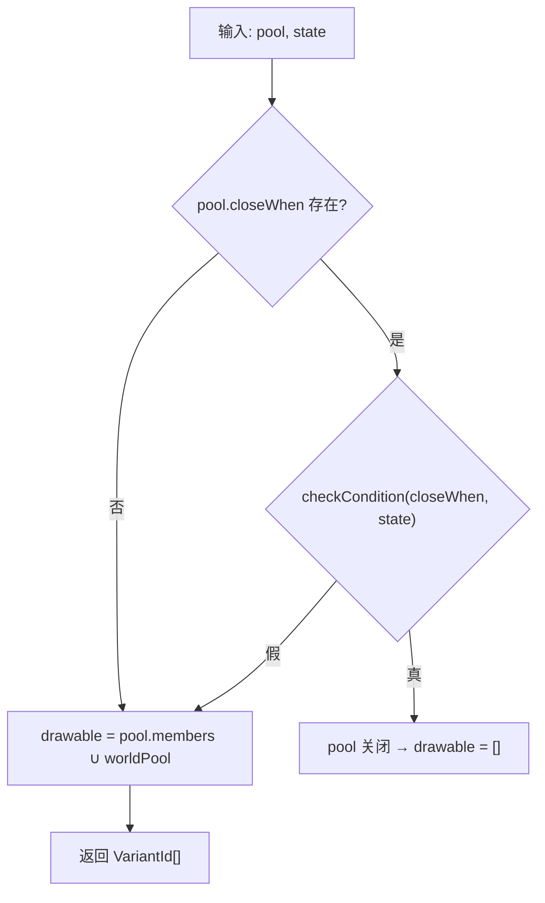

**图表来源**
- [src/engine/system/character-availability.ts:26-45](file://src/engine/system/character-availability.ts#L26-L45)

**章节来源**
- [src/engine/system/character-availability.ts:1-78](file://src/engine/system/character-availability.ts#L1-L78)

### ColorEquipmentSystem：色彩装备系统
- 职责：管理 ColorEquipment（收集品）和 ColorGroup（头像模板）的解锁、收集和效果聚合。
- **三层颜色架构**：
  - **Color**：颜色原子（主题 token 表 + unlock）
  - **ColorGroup**：头像构成模板（compositionType + slots + theme-tree 预设）
  - **ColorEquipment**：装备收集品（捆绑 ColorGroup + effects + unlock 条件）
- 关键特性：
  - 单装备槽：每个角色只有一个 `equippedEquipment` 槽位
  - 条件解锁：支持 unlock 条件的自动解锁机制
  - 级联解锁：收集装备时自动解锁其引用的 ColorGroup
  - 效果聚合：按当前装备聚合数值效果

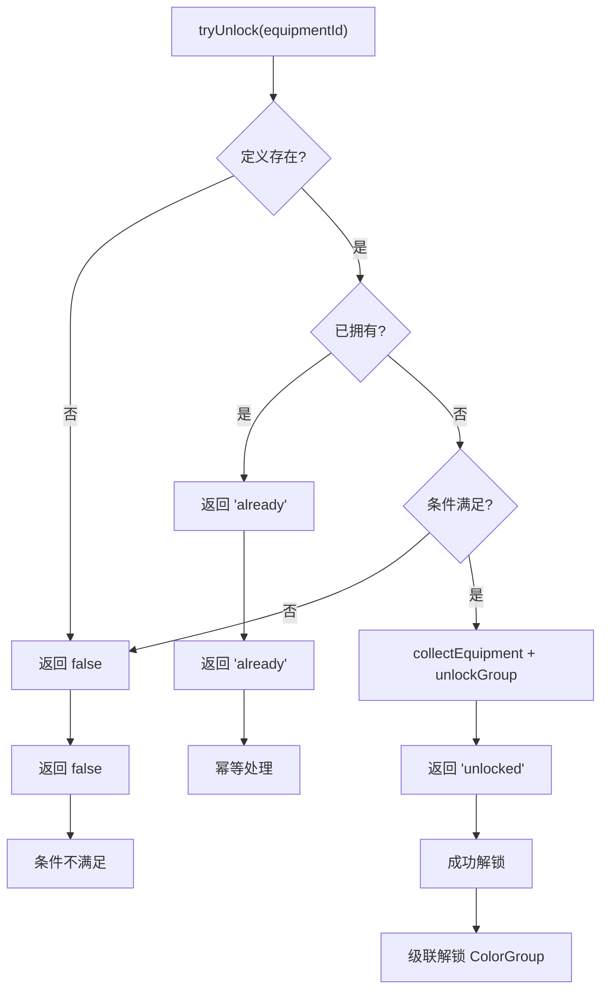

**图表来源**
- [src/engine/system/color-equipment-system.ts:97-109](file://src/engine/system/color-equipment-system.ts#L97-L109)

**章节来源**
- [src/engine/system/color-equipment-system.ts:1-126](file://src/engine/system/color-equipment-system.ts#L1-L126)

### AffectionSystem：好感度系统（新增）
**新增** 完整的好感度系统，实现了角色羁绊等级的管理和计算。

- 职责：纯计算模块，负责好感度阶梯解析、星级锁计算、经验应用推演。
- **核心特性**：
  - 默认羁绊表：采用蔚蓝档案原版羁绊表（100级，从1→2需15点经验）
  - 星级锁机制：根据角色星级限制最大好感等级
  - 跨级升级：支持一次性跨越多个等级
  - 溢出截断：达到等级上限后小值清零，等待星级突破解锁新上限
- **关键方法**：
  - DEFAULT_AFFECTION_EXP_CURVE：内置100级羁绊经验表
  - DEFAULT_AFFECTION_CONFIG：默认配置（maxLevel=100，defaultLevelCapByStar=[20,20,20,20,20,100]）
  - affectionLevelCapOf：计算当前星级下的好感等级上限
  - applyAffectionExp：应用好感经验，返回升级结果

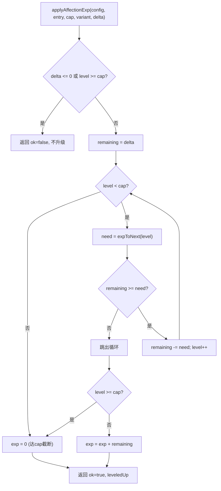

**图表来源**
- [src/engine/system/affection-system.ts:93-110](file://src/engine/system/affection-system.ts#L93-L110)

**章节来源**
- [src/engine/system/affection-system.ts:1-110](file://src/engine/system/affection-system.ts#L1-L110)

### CultivateSystem：培养曲线与升级/突破
- 职责：纯计算模块，负责曲线解析、升级推演、突破校验。
- 关键点：
  - resolveCurve：缺省使用全局默认曲线（maxLevel=10，线性经验表，不可突破）。
  - applyExp：跨级逐级扣减，达有效上限后截断溢出。
  - checkBreakthrough：仅看该变体自己的碎片余额（差分隔离）。

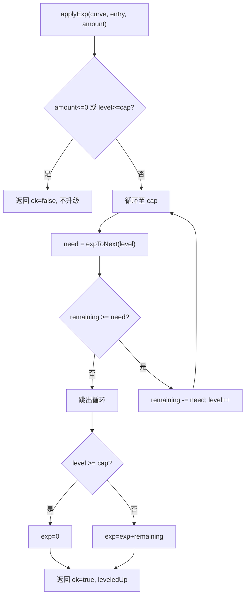

**图表来源**
- [src/engine/system/cultivate-system.ts:35-85](file://src/engine/system/cultivate-system.ts#L35-L85)

**章节来源**
- [src/engine/system/cultivate-system.ts:1-107](file://src/engine/system/cultivate-system.ts#L1-L107)

### CharaProfile：头像-人名解析与服务
- 解析管线（低→高优先级）：兜底(CharacterData.displayName/无头像) → chara 表 activeName/activeAvatar(declared) → 玩家覆写(player) → 调用点覆盖(override)。
- 服务：
  - characterProfile：返回最终展示名与头像 URL（可直接用于前端渲染）。
  - setCharaProfile/clearCharaProfile：持久化玩家覆写。
  - charaNames/charaAvatars：提供 name/avatar 表供面板选择。

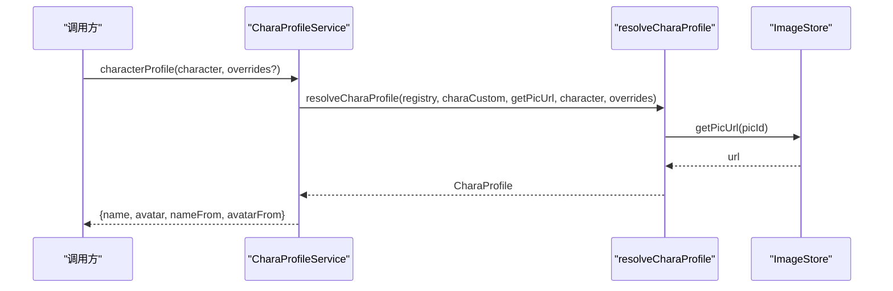

**图表来源**
- [src/engine/system/chara-profile-service.ts:26-45](file://src/engine/system/chara-profile-service.ts#L26-L45)
- [src/engine/core/chara-profile.ts:24-46](file://src/engine/core/chara-profile.ts#L24-L46)

**章节来源**
- [src/engine/core/chara-profile.ts:1-115](file://src/engine/core/chara-profile.ts#L1-L115)
- [src/engine/system/chara-profile-service.ts:1-62](file://src/engine/system/chara-profile-service.ts#L1-L62)

### StateMutationService：统一状态写入入口
**更新** 增强了装备管理和好感度操作功能。

- 职责：集中 PlayerState 的变更操作，包括获得角色、资源增减、Spot 等级/经理、聊天已读、**装备管理、好感度操作**等。
- **角色获得流程**：
  - 首次获得：创建 RosterEntry（level=1/exp=0/stars=0/**equippedEquipment: null**，**affectionLevel: 1, affectionExp: 0**），acquiredCount=1。
  - 重复获得：返还该变体碎片 + 附加资源，acquiredCount+1。
  - 更新原型层聚合统计（acquiredTotal）。
  - 发射 characterAcquired 事件。
- **装备管理流程**：
  - collectEquipment：收集装备到库存（幂等）
  - equipEquipment：装备到角色（单槽，验证所有权）
  - unequipEquipment：卸下装备
  - unlockGroup：解锁 ColorGroup（级联）
- **好感度操作流程**：
  - addAffectionExp：增加好感经验，支持跨级升级，发射 affectionChanged 事件

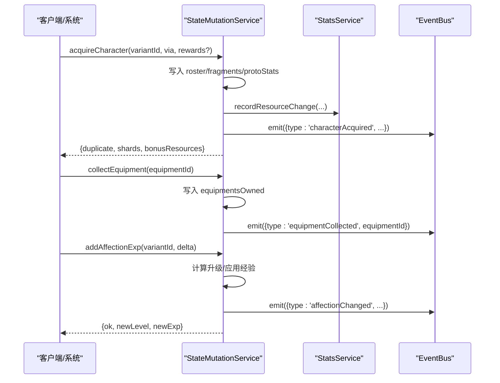

**图表来源**
- [src/engine/system/state-mutation-service.ts:148-197](file://src/engine/system/state-mutation-service.ts#L148-L197)
- [src/engine/system/state-mutation-service.ts:222-243](file://src/engine/system/state-mutation-service.ts#L222-L243)
- [src/engine/system/state-mutation-service.ts:278-307](file://src/engine/system/state-mutation-service.ts#L278-L307)

**章节来源**
- [src/engine/system/state-mutation-service.ts:1-603](file://src/engine/system/state-mutation-service.ts#L1-L603)

### ConditionSystem：条件求值系统（扩展）
**更新** 新增了 affectionLevel 条件支持，允许基于角色好感等级进行条件判断。

- 职责：条件表达式求值，支持多种条件类型和资源检查。
- **新增 affectionLevel 条件**：
  - target: 'affectionLevel'
  - key: VariantId（角色差分ID）
  - comparator: 标准比较运算符（==, !=, >=, <=, >, <）
  - value: 目标好感等级
  - actual: 角色当前好感等级（未拥有或缺失 → 0）
- **引擎接线**：在 GameInstance 初始化时通过 wiring.ts 注入 RosterSystem 的好感度读取器

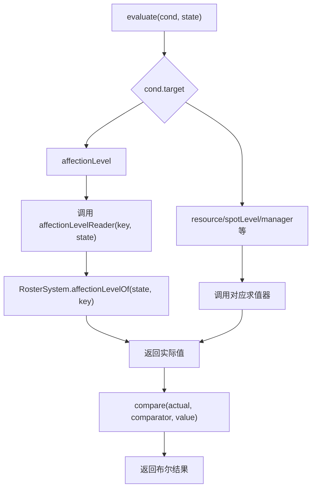

**图表来源**
- [src/engine/expression/condition-system.ts:43-44](file://src/engine/expression/condition-system.ts#L43-L44)
- [src/engine/game/wiring.ts:102-104](file://src/engine/game/wiring.ts#L102-L104)

**章节来源**
- [src/engine/expression/condition-system.ts:1-145](file://src/engine/expression/condition-system.ts#L1-L145)
- [src/engine/game/wiring.ts:89-129](file://src/engine/game/wiring.ts#L89-L129)

## 依赖关系分析
- CharacterSystem 依赖 Registry 提供的 variantProto 解析器，以从 variantId 映射到原型 Character。
- RosterSystem 依赖 Registry.characterVariants 获取全部差分定义，**新增依赖 affection-system 进行好感度计算**。
- CharacterAvailabilityService 依赖 Registry.gachaPools 与 StateMutationService.mergeIntoWorldPool。
- **ColorEquipmentSystem**：依赖 Registry.colorEquipments/colorGroups 与 StateMutationService 进行装备管理。
- **AffectionSystem**：被 RosterSystem 和 StateMutationService 依赖，提供纯计算能力。
- CultivateSystem 被 StateMutationService 在培养相关操作中调用（经验/突破）。
- CharaProfileService 依赖 ImageStore 解析 PicId 为 URL。
- **ConditionSystem**：**扩展** - 新增 affectionLevel 求值器，依赖 RosterSystem 注入。

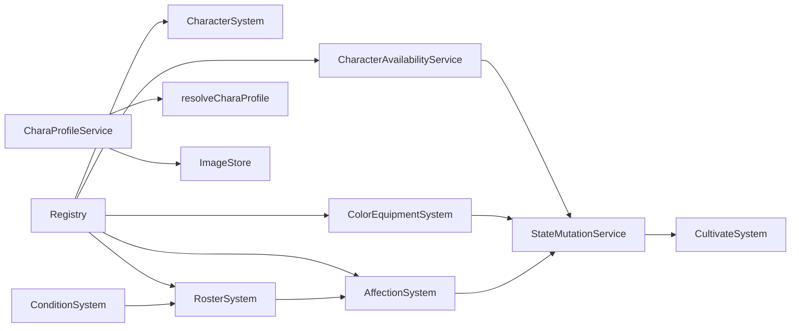

**图表来源**
- [src/engine/system/character-system.ts:20-25](file://src/engine/system/character-system.ts#L20-L25)
- [src/engine/system/roster-system.ts:38-48](file://src/engine/system/roster-system.ts#L38-L48)
- [src/engine/system/character-availability.ts:18-24](file://src/engine/system/character-availability.ts#L18-L24)
- [src/engine/system/color-equipment-system.ts:28-34](file://src/engine/system/color-equipment-system.ts#L28-L34)
- [src/engine/system/state-mutation-service.ts:77-80](file://src/engine/system/state-mutation-service.ts#L77-L80)
- [src/engine/system/chara-profile-service.ts:18-24](file://src/engine/system/chara-profile-service.ts#L18-L24)

**章节来源**
- [src/engine/system/character-system.ts:18-86](file://src/engine/system/character-system.ts#L18-L86)
- [src/engine/system/roster-system.ts:38-104](file://src/engine/system/roster-system.ts#L38-L104)
- [src/engine/system/character-availability.ts:18-77](file://src/engine/system/character-availability.ts#L18-L77)
- [src/engine/system/color-equipment-system.ts:28-126](file://src/engine/system/color-equipment-system.ts#L28-L126)
- [src/engine/system/state-mutation-service.ts:77-80](file://src/engine/system/state-mutation-service.ts#L77-L80)
- [src/engine/system/chara-profile-service.ts:18-62](file://src/engine/system/chara-profile-service.ts#L18-L62)

## 性能考量
- 查询优化：
  - CharacterSystem.getUnlocked 使用 Set 缓存已拥有原型，避免重复计算。
  - RosterSystem.contactGroups 先按学校聚合再排序，减少多次遍历。
  - **ColorEquipmentSystem.ownedEquipments**：使用 map/filter 链式操作高效查询已拥有装备。
  - **RosterSystem.affectionLevelOf**：O(1) 查找 RosterEntry，无额外计算开销。
- 事件与统计：
  - StateMutationService 对 stats 上下文采用惰性求值，仅在消费方访问时构建，降低高频 Tick 开销。
- 世界 Pool 合并：
  - CharacterAvailabilityService.refreshWorldPool 使用 Set 去重后再批量合并，避免重复写入。
- 培养计算：
  - CultivateSystem.applyExp 采用 while 循环逐级升级，时间复杂度 O(升级次数)，适合小步长升级场景。
- **好感度计算优化**：
  - **AffectionSystem.applyAffectionExp**：while 循环逐级升级，但通常升级次数有限（最多100级）。
  - **星级锁计算**：affectionLevelCapOf 使用数组索引访问，O(1) 复杂度。
- **装备解锁优化**：
  - **ColorEquipmentSystem.recheckUnlocks**：仅扫描带 unlock 条件的装备，避免全量检查。

## 故障排查指南
- 未知差分错误：acquireCharacter 中若传入未注册的 variantId 会抛出错误，需检查注册表与数据包配置。
- 池关闭导致无法抽取：确认 GachaPoolDef.closeWhen 条件是否满足；必要时调用 refreshWorldPool 合并常驻。
- 头像/名称未显示：检查 CharaProfile 解析管线优先级，确认 chara 表 names/avatars 与玩家覆写是否正确设置。
- 培养无效：检查曲线是否存在、星级是否已达上限、碎片是否足够；查看 checkBreakthrough 返回原因。
- **装备相关问题**：
  - 装备无法解锁：检查 ColorEquipmentDef.unlock 条件是否满足
  - 装备无法装备：确认角色已拥有该装备且槽位为空
  - 效果不生效：检查装备是否正确装备到角色
- **好感度相关问题**：**新增**
  - 好感度无法增加：确认角色已拥有且 delta > 0
  - 等级不升级：检查是否已达到星级锁上限
  - 条件判断失败：确认 affectionLevel 条件中的 key 是否为正确的 VariantId
  - 数据丢失：检查存档是否正确序列化 affectionLevel 和 affectionExp 字段

**章节来源**
- [src/engine/system/state-mutation-service.ts:148-197](file://src/engine/system/state-mutation-service.ts#L148-L197)
- [src/engine/system/character-availability.ts:26-77](file://src/engine/system/character-availability.ts#L26-L77)
- [src/engine/core/chara-profile.ts:51-115](file://src/engine/core/chara-profile.ts#L51-L115)
- [src/engine/system/cultivate-system.ts:93-107](file://src/engine/system/cultivate-system.ts#L93-L107)
- [src/engine/system/color-equipment-system.ts:97-124](file://src/engine/system/color-equipment-system.ts#L97-L124)
- [src/engine/system/affection-system.ts:93-110](file://src/engine/system/affection-system.ts#L93-L110)

## 结论
角色系统通过清晰的职责划分与统一的写入入口，实现了：
- 稳定的原型查询与解锁判定
- 灵活的阵容管理与图鉴展示
- 可配置的卡池可及性与世界 Pool 机制
- 可扩展的培养曲线与突破体系
- **全新的三层颜色架构**：**Color（颜色原子）+ ColorGroup（头像模板）+ ColorEquipment（装备收集品）**
- **完整的好感度系统**：**AffectionSystem 提供羁绊等级管理，支持星级锁、跨级升级、溢出截断**
- 可溯源的头像-人名解析与持久化
- **扩展的条件系统**：**新增 affectionLevel 条件，支持基于好感度的逻辑判断**
结合事件驱动与惰性统计，系统在可扩展性与性能之间取得平衡，便于后续扩展新角色、新卡池与新主题。

## 附录：API 参考

### CharacterSystem
- load(characters): 加载角色原型数据
- get(id): 获取单个原型
- getAll(): 获取全部原型
- getBySchool(school): 按学校筛选
- getByRarity(rarity): 按稀有度筛选
- getUnlocked(state): 获取已解锁原型（基于 roster）
- exists(id): 检查原型是否存在
- clear(): 清空数据
- countSchoolMembers(school, state): 统计同校已解锁数量

**章节来源**
- [src/engine/system/character-system.ts:27-85](file://src/engine/system/character-system.ts#L27-L85)

### RosterSystem（增强版）
**更新** 新增好感度查询方法

- getVariant(variantId): 获取差分定义
- getAllVariants(): 获取全部差分
- getOwned(state, variantId): 获取持有实例
- isOwned(state, variantId): 是否持有
- shardsOf(state, variantId): 碎片余额
- acquiredCountOf(state, variantId): 累计获得次数
- protoStatOf(state, proto): 原型聚合统计
- contactGroups(state): 通讯录分组
- codex(state): 图鉴视图
- **affectionLevelOf(state, variantId)**：**新增** - 获取角色好感等级
- **affectionExpOf(state, variantId)**：**新增** - 获取当前级内好感小值
- **affectionLevelCapOf(state, variantId)**：**新增** - 计算好感等级上限

**章节来源**
- [src/engine/system/roster-system.ts:41-129](file://src/engine/system/roster-system.ts#L41-L129)

### CharacterAvailabilityService
- isPoolClosed(pool, state): 池是否关闭
- worldPool(state): 世界 Pool
- drawableOf(pool, state): 当前可抽取集合
- availableVariantIds(state): 全部可获得差分
- refreshWorldPool(): 刷新世界 Pool

**章节来源**
- [src/engine/system/character-availability.ts:26-77](file://src/engine/system/character-availability.ts#L26-L77)

### ColorEquipmentSystem
- getDef(equipmentId): 获取装备定义
- getAll(): 获取全部装备定义
- isOwned(state, equipmentId): 检查是否拥有装备
- ownedEquipments(state): 获取已拥有装备列表
- groupOf(equipmentId): 获取装备引用的 ColorGroup
- avatarColorsForGroup(groupId): 获取 ColorGroup 的颜色数组
- avatarColors(equipmentId): 获取装备的颜色数组
- effectsOf(state, variantId): 获取变体当前装备的效果
- tryUnlock(equipmentId): 尝试解锁装备（条件检查 + 收集）
- recheckUnlocks(): 重新检查所有装备的解锁条件

**章节来源**
- [src/engine/system/color-equipment-system.ts:38-124](file://src/engine/system/color-equipment-system.ts#L38-L124)

### AffectionSystem（新增）
**新增** 好感度系统 API

- DEFAULT_AFFECTION_EXP_CURVE: 内置100级羁绊经验表
- DEFAULT_AFFECTION_CONFIG: 默认好感度配置
- affectionExpToNext(config, level): 计算下一级所需经验
- affectionLevelCapOf(config, variant, stars): 计算星级锁下的等级上限
- applyAffectionExp(config, entry, cap, variant, delta): 应用好感经验，返回升级结果

**章节来源**
- [src/engine/system/affection-system.ts:20-110](file://src/engine/system/affection-system.ts#L20-L110)

### CultivateSystem
- resolveCurve(def): 解析曲线
- effectiveMaxLevel(curve, stars): 有效等级上限
- expToNext(curve, level): 下一级所需经验
- applyExp(curve, entry, amount): 经验应用（返回结果）
- checkBreakthrough(curve, state, variant, entry): 突破校验

**章节来源**
- [src/engine/system/cultivate-system.ts:35-107](file://src/engine/system/cultivate-system.ts#L35-L107)

### CharaProfileService
- characterProfile(character, overrides?): 获取头像-人名对
- setCharaProfile(character, override): 设置玩家覆写
- clearCharaProfile(character): 清除玩家覆写
- charaNames(character): 名称表
- charaAvatars(character): 头像表

**章节来源**
- [src/engine/system/chara-profile-service.ts:26-62](file://src/engine/system/chara-profile-service.ts#L26-L62)

### StateMutationService（增强版）
**更新** 增强了装备管理和好感度操作功能

- acquireCharacter(variantId, via, rewards?): 获得角色（首次/重复）
- collectEquipment(equipmentId): 收集装备到库存
- equipEquipment(variantId, equipmentId): 装备到角色
- unequipEquipment(variantId): 卸下装备
- unlockGroup(groupId): 解锁 ColorGroup
- activateTheme(groupId): 激活主题
- unlockEntityDesign(entityKey, designId): 解锁实体配色设计
- setEntityThemeSlot(entityKey, slot): 设置实体主题槽
- addExp(variantId, amount): 添加经验
- breakthroughStar(variantId, starCost): 星级突破
- **addAffectionExp(variantId, delta)**：**新增** - 增加好感经验
- 其他：changeResource/setResource、setSpotLevel/addSpotLevel、setManager、markChatRead 等

**章节来源**
- [src/engine/system/state-mutation-service.ts:148-603](file://src/engine/system/state-mutation-service.ts#L148-L603)

### ConditionSystem（扩展版）
**更新** 新增 affectionLevel 条件支持

- evaluate(cond, state): 求值单条条件
- evaluateExpr(expr, state): 求值条件表达式（支持AND/OR组合）
- evaluateGroup(group, state): 求值条件组
- setAffectionLevelReader(reader): 注入好感度读取器
- 其他：setTagIndex、setStatReader、setStoryRunChecker 等

**章节来源**
- [src/engine/expression/condition-system.ts:1-145](file://src/engine/expression/condition-system.ts#L1-L145)

### 数据模型（更新版）
**更新** 反映了新的三层颜色架构和好感度系统

- **CharacterVariantDef**：使用 `colorGroupId?: ColorGroupId` 替代 `colorSlots`，**新增 `affectionLevelCapByStar?: number[]`**
- **RosterEntry**：使用 `equippedEquipment: EquipmentId | null` 替代 `equippedColors`，**新增 `affectionLevel?: number` 和 `affectionExp?: number`**
- **ColorGroupDef**：色彩组定义（id/name/compositionType/slots/theme）
- **ColorEquipmentDef**：色彩装备定义（id/name/colorGroupId/effects/theme/unlock/category）
- **CompositionType**：构成方式类型（solid/gradient/duotone/pie/radial）
- **ColorGroupSlot**：色位定义（role/color）
- **EquipmentId**：装备 ID 类型
- **ColorGroupId**：颜色组 ID 类型
- **AffectionConfigDef**：**新增** - 好感度配置（expCurve/expBeyond/maxLevel/defaultLevelCapByStar）
- CultivateCurveDef：培养曲线（id/maxLevel/expTable/starMax/starCost/levelCapPerStar/levelBonusPerLevel）
- GachaPoolDef：卡池（id/name/description/mode/currency/costPerPull/rates/featured/pity/dupRewards/members/closeWhen）
- ProtoStat：原型聚合统计（acquiredTotal/cultTotal）

**章节来源**
- [src/engine/types/character.ts:79-137](file://src/engine/types/character.ts#L79-L137)
- [src/engine/types/character.ts:268-346](file://src/engine/types/character.ts#L268-L346)
- [src/engine/types/character.ts:516-554](file://src/engine/types/character.ts#L516-L554)
- [src/engine/types/character.ts:384-438](file://src/engine/types/character.ts#L384-L438)
- [src/engine/types/character.ts:503-526](file://src/engine/types/character.ts#L503-L526)