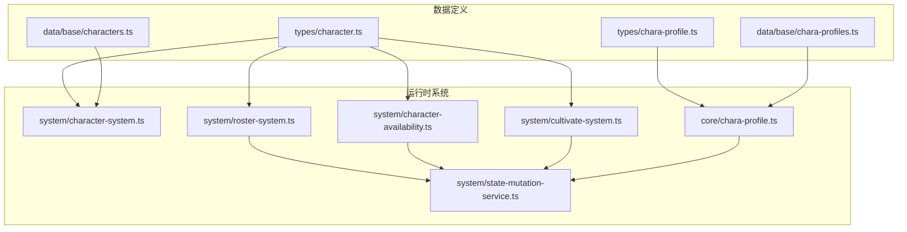
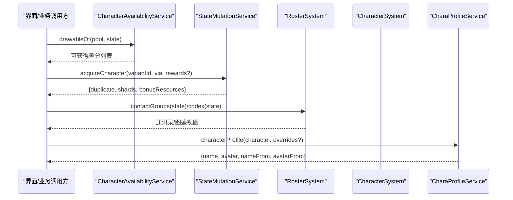
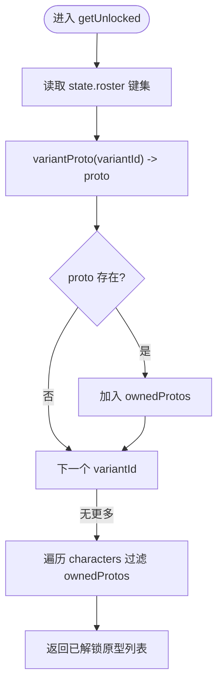
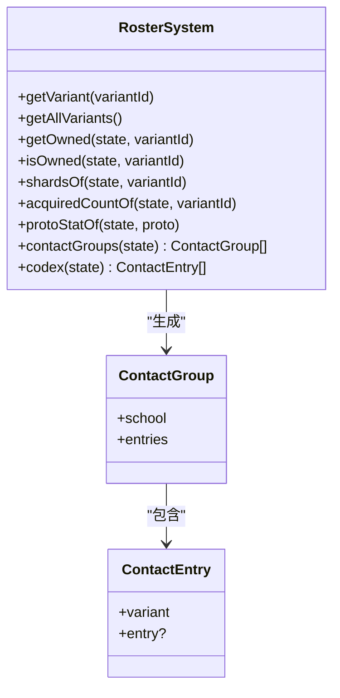
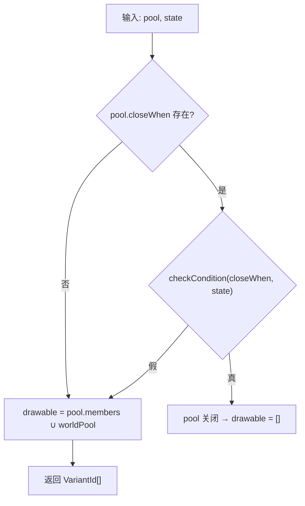
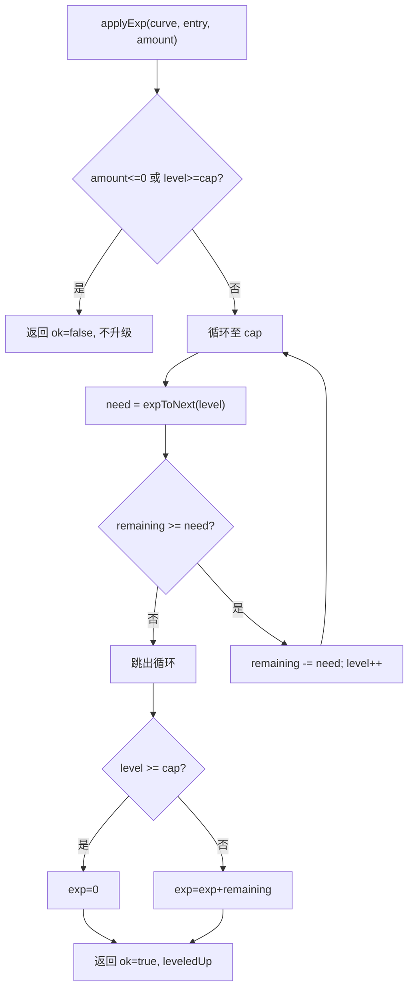
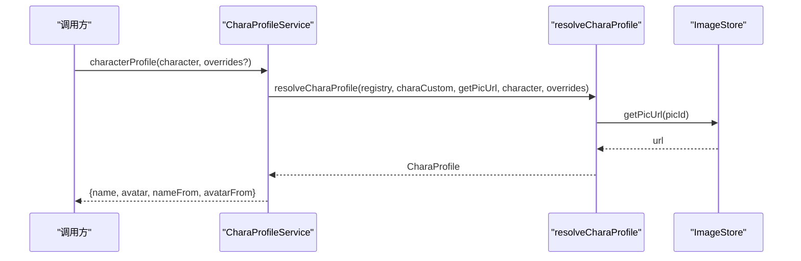
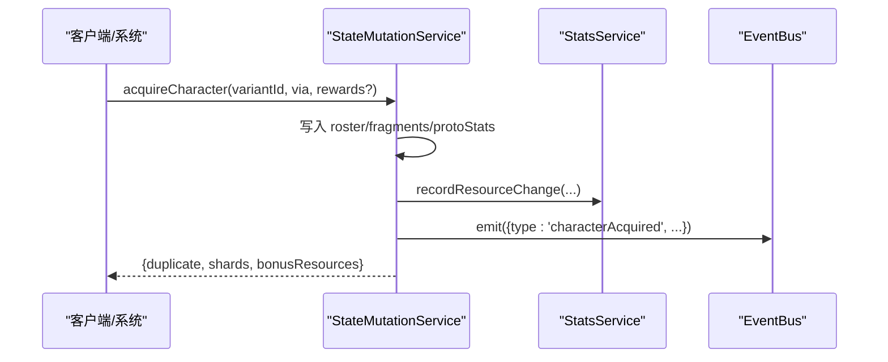
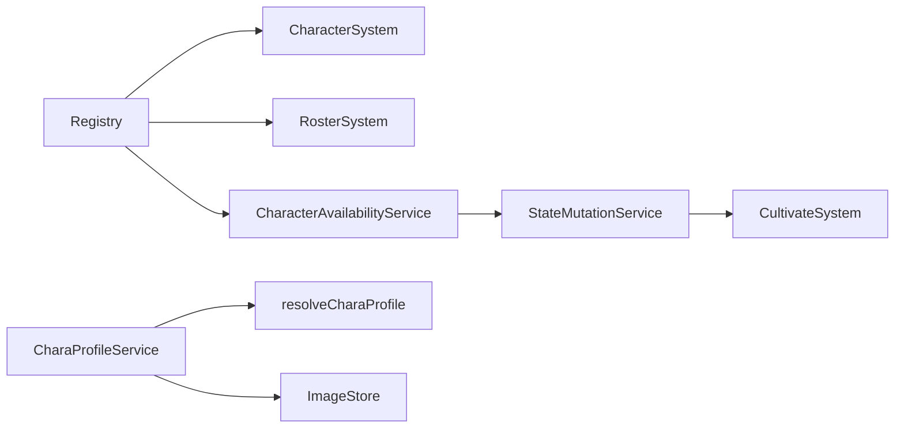

# 角色系统

<cite>
**本文引用的文件**
- [src/engine/system/character-system.ts](file://src/engine/system/character-system.ts)
- [src/engine/system/roster-system.ts](file://src/engine/system/roster-system.ts)
- [src/engine/system/character-availability.ts](file://src/engine/system/character-availability.ts)
- [src/engine/core/chara-profile.ts](file://src/engine/core/chara-profile.ts)
- [src/engine/system/chara-profile-service.ts](file://src/engine/system/chara-profile-service.ts)
- [src/engine/system/cultivate-system.ts](file://src/engine/system/cultivate-system.ts)
- [src/engine/system/state-mutation-service.ts](file://src/engine/system/state-mutation-service.ts)
- [src/data/base/characters.ts](file://src/data/base/characters.ts)
- [src/data/base/chara-profiles.ts](file://src/data/base/chara-profiles.ts)
- [src/engine/types/character.ts](file://src/engine/types/character.ts)
- [src/engine/types/chara-profile.ts](file://src/engine/types/chara-profile.ts)
- [docs-824/04g-roster.md](file://docs-824/04g-roster.md)
</cite>

## 目录
1. [简介](#简介)
2. [项目结构](#项目结构)
3. [核心组件](#核心组件)
4. [架构总览](#架构总览)
5. [详细组件分析](#详细组件分析)
6. [依赖关系分析](#依赖关系分析)
7. [性能考量](#性能考量)
8. [故障排查指南](#故障排查指南)
9. [结论](#结论)
10. [附录：API 参考](#附录api-参考)

## 简介
本技术文档面向 ACProgram 的角色系统，围绕以下目标展开：
- CharacterSystem 角色原型与解锁判定
- RosterSystem 角色阵容（通讯录/图鉴）管理
- 角色可用性判断（卡池关闭条件、世界 Pool、动态变化）
- CharaProfile 角色档案（头像-人名解析、优先级、持久化）
- 完整 API 接口说明（角色获取、培养、状态变更）
- 数据持久化、性能优化与扩展开发指南

## 项目结构
角色系统由“数据定义 + 运行时系统 + 服务门面”三层组成：
- 数据定义：types 层描述角色变体、培养曲线、抽卡池、色彩装备等；data/base 提供基础示例数据。
- 运行时系统：system 层实现角色查询、阵容、可用性、培养计算、状态变更；core 层提供纯函数解析（如头像-人名）。
- 服务门面：对外暴露统一入口（如 StateMutationService），保证状态写入的幂等性与事件通知。

图表来源
- [src/engine/types/character.ts:79-137](file://src/engine/types/character.ts#L79-L137)
- [src/engine/types/chara-profile.ts:32-43](file://src/engine/types/chara-profile.ts#L32-L43)
- [src/engine/system/character-system.ts:18-86](file://src/engine/system/character-system.ts#L18-L86)
- [src/engine/system/roster-system.ts:38-104](file://src/engine/system/roster-system.ts#L38-L104)
- [src/engine/system/character-availability.ts:18-77](file://src/engine/system/character-availability.ts#L18-L77)
- [src/engine/system/cultivate-system.ts:15-107](file://src/engine/system/cultivate-system.ts#L15-L107)
- [src/engine/core/chara-profile.ts:24-46](file://src/engine/core/chara-profile.ts#L24-L46)
- [src/engine/system/state-mutation-service.ts:148-197](file://src/engine/system/state-mutation-service.ts#L148-L197)

章节来源
- [src/engine/system/character-system.ts:1-87](file://src/engine/system/character-system.ts#L1-L87)
- [src/engine/system/roster-system.ts:1-105](file://src/engine/system/roster-system.ts#L1-L105)
- [src/engine/system/character-availability.ts:1-78](file://src/engine/system/character-availability.ts#L1-L78)
- [src/engine/core/chara-profile.ts:1-115](file://src/engine/core/chara-profile.ts#L1-L115)
- [src/engine/system/chara-profile-service.ts:1-62](file://src/engine/system/chara-profile-service.ts#L1-L62)
- [src/engine/system/cultivate-system.ts:1-107](file://src/engine/system/cultivate-system.ts#L1-L107)
- [src/engine/system/state-mutation-service.ts:1-200](file://src/engine/system/state-mutation-service.ts#L1-L200)
- [src/data/base/characters.ts:1-88](file://src/data/base/characters.ts#L1-L88)
- [src/data/base/chara-profiles.ts:1-17](file://src/data/base/chara-profiles.ts#L1-L17)
- [src/engine/types/character.ts:1-535](file://src/engine/types/character.ts#L1-L535)
- [src/engine/types/chara-profile.ts:1-72](file://src/engine/types/chara-profile.ts#L1-L72)
- [docs-824/04g-roster.md:1-25](file://docs-824/04g-roster.md#L1-L25)

## 核心组件
- CharacterSystem：加载并查询角色原型数据，基于 roster 判定已解锁原型集合。
- RosterSystem：通讯录与图鉴视图、碎片统计、按学校分组排序。
- CharacterAvailabilityService：卡池可及性、世界 Pool 刷新、开放池成员合并。
- CultivateSystem：经验升级、突破校验、曲线解析（纯计算）。
- CharaProfileService / resolveCharaProfile：头像-人名解析管线与玩家覆写持久化。
- StateMutationService：统一状态写入入口（获得角色、培养、资源变更、事件发射）。

章节来源
- [src/engine/system/character-system.ts:18-86](file://src/engine/system/character-system.ts#L18-L86)
- [src/engine/system/roster-system.ts:38-104](file://src/engine/system/roster-system.ts#L38-L104)
- [src/engine/system/character-availability.ts:18-77](file://src/engine/system/character-availability.ts#L18-L77)
- [src/engine/system/cultivate-system.ts:15-107](file://src/engine/system/cultivate-system.ts#L15-L107)
- [src/engine/system/chara-profile-service.ts:18-62](file://src/engine/system/chara-profile-service.ts#L18-L62)
- [src/engine/core/chara-profile.ts:24-46](file://src/engine/core/chara-profile.ts#L24-L46)
- [src/engine/system/state-mutation-service.ts:148-197](file://src/engine/system/state-mutation-service.ts#L148-L197)

## 架构总览
角色系统以“只读查询 + 统一写入”为设计原则：
- 查询侧：CharacterSystem/RosterSystem/AvailabilityService/CharaProfileService 均不直接修改 PlayerState。
- 写入侧：所有变更通过 StateMutationService 完成，确保事件通知、统计同步与幂等性。
- 数据源：types 定义契约，data/base 提供基础数据；运行时通过 Registry 注入变体、曲线、色彩等定义。

图表来源
- [src/engine/system/character-availability.ts:40-56](file://src/engine/system/character-availability.ts#L40-L56)
- [src/engine/system/state-mutation-service.ts:148-197](file://src/engine/system/state-mutation-service.ts#L148-L197)
- [src/engine/system/roster-system.ts:78-103](file://src/engine/system/roster-system.ts#L78-L103)
- [src/engine/system/chara-profile-service.ts:26-45](file://src/engine/system/chara-profile-service.ts#L26-L45)

## 详细组件分析

### CharacterSystem：角色原型与解锁判定
- 职责：加载 CharacterData，按学校/稀有度筛选；基于 roster 判定已解锁原型（任一差分即视为解锁）。
- 关键点：
  - getUnlocked：遍历 state.roster 中的 variantId，通过 variantProto 解析到原型 id，去重后匹配 CharacterData。
  - countSchoolMembers：按学校统计已解锁数量。
- 复杂度：getUnlocked 为 O(V+P)，V 为拥有差分数，P 为原型总数。

图表来源
- [src/engine/system/character-system.ts:58-70](file://src/engine/system/character-system.ts#L58-L70)

章节来源
- [src/engine/system/character-system.ts:18-86](file://src/engine/system/character-system.ts#L18-L86)

### RosterSystem：角色阵容（通讯录/图鉴）
- 职责：查询玩家持有的差分实例与碎片余额；提供通讯录分组与图鉴视图。
- 通讯录分组：按学校聚合，组内稀有度降序（SuperRare > Rare > Common）。
- 图鉴视图：全部差分 + 持有标记（未获得为占位）。
- 关键方法：
  - contactGroups(state)：生成通讯录分组。
  - codex(state)：生成图鉴条目。
  - shardsOf/acquiredCountOf/protoStatOf：碎片与累计统计。

图表来源
- [src/engine/system/roster-system.ts:20-30](file://src/engine/system/roster-system.ts#L20-L30)
- [src/engine/system/roster-system.ts:38-104](file://src/engine/system/roster-system.ts#L38-L104)

章节来源
- [src/engine/system/roster-system.ts:1-105](file://src/engine/system/roster-system.ts#L1-L105)
- [docs-824/04g-roster.md:1-25](file://docs-824/04g-roster.md#L1-L25)

### CharacterAvailabilityService：角色可用性判断
- 职责：判断卡池是否关闭、合并世界 Pool、计算可抽取集合。
- 规则：
  - isPoolClosed：若声明 closeWhen 且条件满足则关闭。
  - drawableOf：池关闭返回空；否则 = 池成员 ∪ 世界 Pool。
  - availableVariantIds：全部开放池的可获得差分（限定 ∪ 常驻）。
  - refreshWorldPool：将已关闭池的成员并入世界 Pool（幂等）。

图表来源
- [src/engine/system/character-availability.ts:26-45](file://src/engine/system/character-availability.ts#L26-L45)

章节来源
- [src/engine/system/character-availability.ts:1-78](file://src/engine/system/character-availability.ts#L1-L78)

### CultivateSystem：培养曲线与升级/突破
- 职责：纯计算模块，负责曲线解析、升级推演、突破校验。
- 关键点：
  - resolveCurve：缺省使用全局默认曲线（maxLevel=10，线性经验表，不可突破）。
  - applyExp：跨级逐级扣减，达有效上限后截断溢出。
  - checkBreakthrough：仅看该变体自己的碎片余额（差分隔离）。

图表来源
- [src/engine/system/cultivate-system.ts:35-85](file://src/engine/system/cultivate-system.ts#L35-L85)

章节来源
- [src/engine/system/cultivate-system.ts:1-107](file://src/engine/system/cultivate-system.ts#L1-L107)

### CharaProfile：头像-人名解析与服务
- 解析管线（低→高优先级）：兜底(CharacterData.displayName/无头像) → chara 表 activeName/activeAvatar(declared) → 玩家覆写(player) → 调用点覆盖(override)。
- 服务：
  - characterProfile：返回最终展示名与头像 URL（可直接用于前端渲染）。
  - setCharaProfile/clearCharaProfile：持久化玩家覆写。
  - charaNames/charaAvatars：提供 name/avatar 表供面板选择。

图表来源
- [src/engine/system/chara-profile-service.ts:26-45](file://src/engine/system/chara-profile-service.ts#L26-L45)
- [src/engine/core/chara-profile.ts:24-46](file://src/engine/core/chara-profile.ts#L24-L46)

章节来源
- [src/engine/core/chara-profile.ts:1-115](file://src/engine/core/chara-profile.ts#L1-L115)
- [src/engine/system/chara-profile-service.ts:1-62](file://src/engine/system/chara-profile-service.ts#L1-L62)
- [src/data/base/chara-profiles.ts:1-17](file://src/data/base/chara-profiles.ts#L1-L17)

### StateMutationService：统一状态写入入口
- 职责：集中 PlayerState 的变更操作，包括获得角色、资源增减、Spot 等级/经理、聊天已读等。
- 角色获得流程：
  - 首次获得：创建 RosterEntry（level=1/exp=0/stars=0），acquiredCount=1。
  - 重复获得：返还该变体碎片 + 附加资源，acquiredCount+1。
  - 更新原型层聚合统计（acquiredTotal）。
  - 发射 characterAcquired 事件。

图表来源
- [src/engine/system/state-mutation-service.ts:148-197](file://src/engine/system/state-mutation-service.ts#L148-L197)

章节来源
- [src/engine/system/state-mutation-service.ts:1-200](file://src/engine/system/state-mutation-service.ts#L1-L200)

## 依赖关系分析
- CharacterSystem 依赖 Registry 提供的 variantProto 解析器，以从 variantId 映射到原型 Character。
- RosterSystem 依赖 Registry.characterVariants 获取全部差分定义。
- CharacterAvailabilityService 依赖 Registry.gachaPools 与 StateMutationService.mergeIntoWorldPool。
- CultivateSystem 被 StateMutationService 在培养相关操作中调用（经验/突破）。
- CharaProfileService 依赖 ImageStore 解析 PicId 为 URL。

图表来源
- [src/engine/system/character-system.ts:20-25](file://src/engine/system/character-system.ts#L20-L25)
- [src/engine/system/roster-system.ts:38-48](file://src/engine/system/roster-system.ts#L38-L48)
- [src/engine/system/character-availability.ts:18-24](file://src/engine/system/character-availability.ts#L18-L24)
- [src/engine/system/state-mutation-service.ts:77-80](file://src/engine/system/state-mutation-service.ts#L77-L80)
- [src/engine/system/chara-profile-service.ts:18-24](file://src/engine/system/chara-profile-service.ts#L18-L24)

章节来源
- [src/engine/system/character-system.ts:18-86](file://src/engine/system/character-system.ts#L18-L86)
- [src/engine/system/roster-system.ts:38-104](file://src/engine/system/roster-system.ts#L38-L104)
- [src/engine/system/character-availability.ts:18-77](file://src/engine/system/character-availability.ts#L18-L77)
- [src/engine/system/state-mutation-service.ts:77-80](file://src/engine/system/state-mutation-service.ts#L77-L80)
- [src/engine/system/chara-profile-service.ts:18-62](file://src/engine/system/chara-profile-service.ts#L18-L62)

## 性能考量
- 查询优化：
  - CharacterSystem.getUnlocked 使用 Set 缓存已拥有原型，避免重复计算。
  - RosterSystem.contactGroups 先按学校聚合再排序，减少多次遍历。
- 事件与统计：
  - StateMutationService 对 stats 上下文采用惰性求值，仅在消费方访问时构建，降低高频 Tick 开销。
- 世界 Pool 合并：
  - CharacterAvailabilityService.refreshWorldPool 使用 Set 去重后再批量合并，避免重复写入。
- 培养计算：
  - CultivateSystem.applyExp 采用 while 循环逐级升级，时间复杂度 O(升级次数)，适合小步长升级场景。

[本节为通用性能建议，不直接分析具体文件]

## 故障排查指南
- 未知差分错误：acquireCharacter 中若传入未注册的 variantId 会抛出错误，需检查注册表与数据包配置。
- 池关闭导致无法抽取：确认 GachaPoolDef.closeWhen 条件是否满足；必要时调用 refreshWorldPool 合并常驻。
- 头像/名称未显示：检查 CharaProfile 解析管线优先级，确认 chara 表 names/avatars 与玩家覆写是否正确设置。
- 培养无效：检查曲线是否存在、星级是否已达上限、碎片是否足够；查看 checkBreakthrough 返回原因。

章节来源
- [src/engine/system/state-mutation-service.ts:148-197](file://src/engine/system/state-mutation-service.ts#L148-L197)
- [src/engine/system/character-availability.ts:26-77](file://src/engine/system/character-availability.ts#L26-L77)
- [src/engine/core/chara-profile.ts:51-115](file://src/engine/core/chara-profile.ts#L51-L115)
- [src/engine/system/cultivate-system.ts:93-107](file://src/engine/system/cultivate-system.ts#L93-L107)

## 结论
角色系统通过清晰的职责划分与统一的写入入口，实现了：
- 稳定的原型查询与解锁判定
- 灵活的阵容管理与图鉴展示
- 可配置的卡池可及性与世界 Pool 机制
- 可扩展的培养曲线与突破体系
- 可溯源的头像-人名解析与持久化
结合事件驱动与惰性统计，系统在可扩展性与性能之间取得平衡，便于后续扩展新角色、新卡池与新主题。

[本节为总结性内容，不直接分析具体文件]

## 附录：API 参考

### CharacterSystem
- load(characters): 加载角色原型数据
- get(id): 获取单个原型
- getAll(): 获取全部原型
- getBySchool(school): 按学校筛选
- getByRarity(rarity): 按稀有度筛选
- getUnlocked(state): 获取已解锁原型（基于 roster）
- exists(id): 检查原型是否存在
- clear(): 清空数据
- countSchoolMembers(school, state): 统计同校已解锁数量

章节来源
- [src/engine/system/character-system.ts:27-85](file://src/engine/system/character-system.ts#L27-L85)

### RosterSystem
- getVariant(variantId): 获取差分定义
- getAllVariants(): 获取全部差分
- getOwned(state, variantId): 获取持有实例
- isOwned(state, variantId): 是否持有
- shardsOf(state, variantId): 碎片余额
- acquiredCountOf(state, variantId): 累计获得次数
- protoStatOf(state, proto): 原型聚合统计
- contactGroups(state): 通讯录分组
- codex(state): 图鉴视图

章节来源
- [src/engine/system/roster-system.ts:41-103](file://src/engine/system/roster-system.ts#L41-L103)

### CharacterAvailabilityService
- isPoolClosed(pool, state): 池是否关闭
- worldPool(state): 世界 Pool
- drawableOf(pool, state): 当前可抽取集合
- availableVariantIds(state): 全部可获得差分
- refreshWorldPool(): 刷新世界 Pool

章节来源
- [src/engine/system/character-availability.ts:26-77](file://src/engine/system/character-availability.ts#L26-L77)

### CultivateSystem
- resolveCurve(def): 解析曲线
- effectiveMaxLevel(curve, stars): 有效等级上限
- expToNext(curve, level): 下一级所需经验
- applyExp(curve, entry, amount): 经验应用（返回结果）
- checkBreakthrough(curve, state, variant, entry): 突破校验

章节来源
- [src/engine/system/cultivate-system.ts:35-107](file://src/engine/system/cultivate-system.ts#L35-L107)

### CharaProfileService
- characterProfile(character, overrides?): 获取头像-人名对
- setCharaProfile(character, override): 设置玩家覆写
- clearCharaProfile(character): 清除玩家覆写
- charaNames(character): 名称表
- charaAvatars(character): 头像表

章节来源
- [src/engine/system/chara-profile-service.ts:26-62](file://src/engine/system/chara-profile-service.ts#L26-L62)

### StateMutationService（角色相关）
- acquireCharacter(variantId, via, rewards?): 获得角色（首次/重复）
- 其他：changeResource/setResource、setSpotLevel/addSpotLevel、setManager、markChatRead 等

章节来源
- [src/engine/system/state-mutation-service.ts:148-197](file://src/engine/system/state-mutation-service.ts#L148-L197)

### 数据模型（节选）
- CharacterVariantDef：差分定义（id/proto/name/displayName/school/rarity/description/avatar/colorGroupId/isDefault/curve/theme/extra）
- CultivateCurveDef：培养曲线（id/maxLevel/expTable/starMax/starCost/levelCapPerStar/levelBonusPerLevel）
- GachaPoolDef：卡池（id/name/description/mode/currency/costPerPull/rates/featured/pity/dupRewards/members/closeWhen）
- RosterEntry：运行时持有实例（variantId/acquiredVia/level/exp/stars/equippedEquipment/acquiredCount）
- ProtoStat：原型聚合统计（acquiredTotal/cultTotal）

章节来源
- [src/engine/types/character.ts:39-137](file://src/engine/types/character.ts#L39-L137)
- [src/engine/types/character.ts:384-438](file://src/engine/types/character.ts#L384-L438)
- [src/engine/types/character.ts:503-526](file://src/engine/types/character.ts#L503-L526)