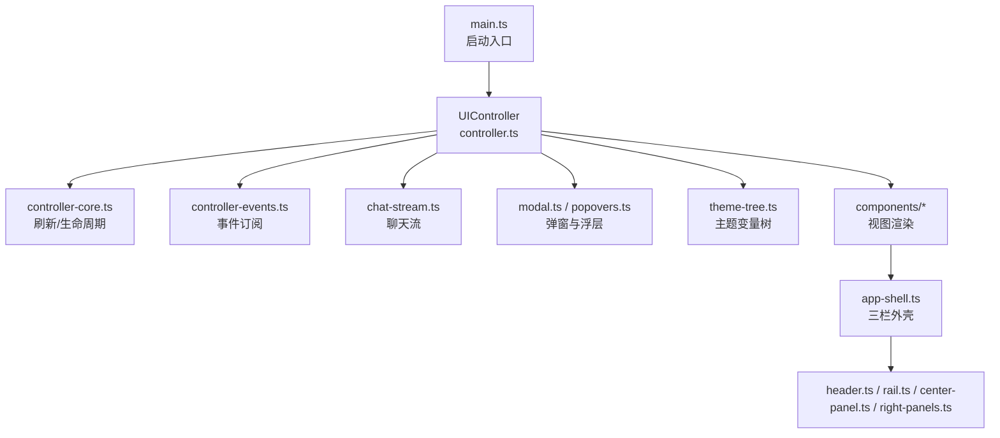
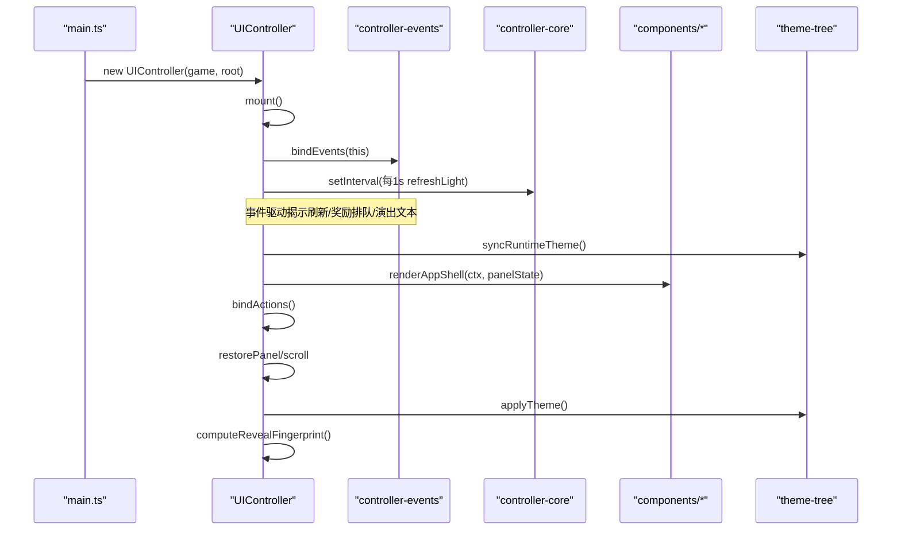
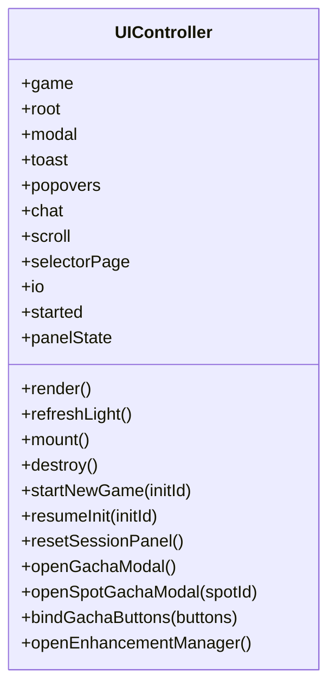
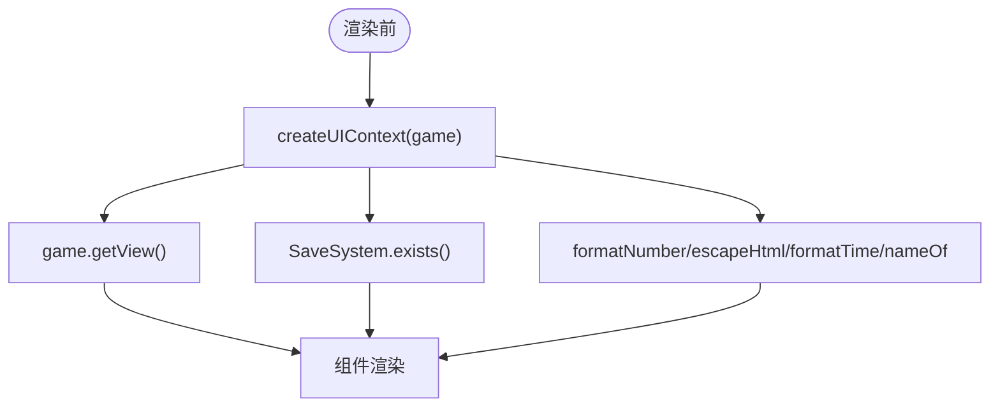
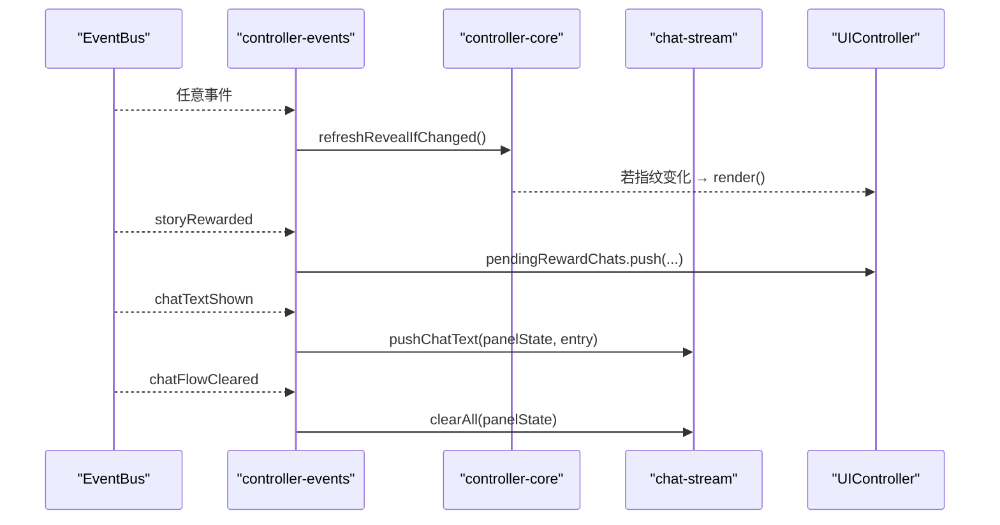
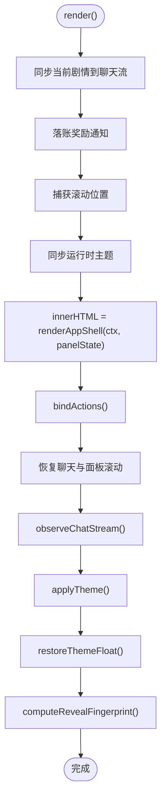
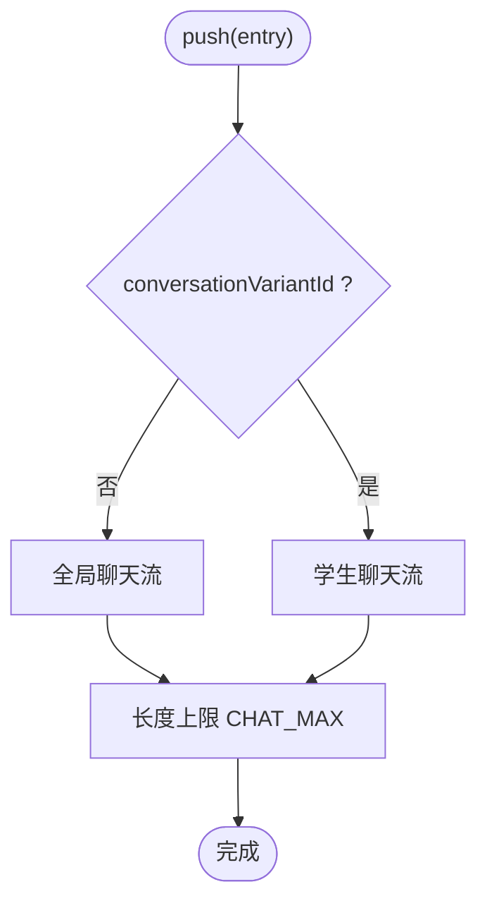
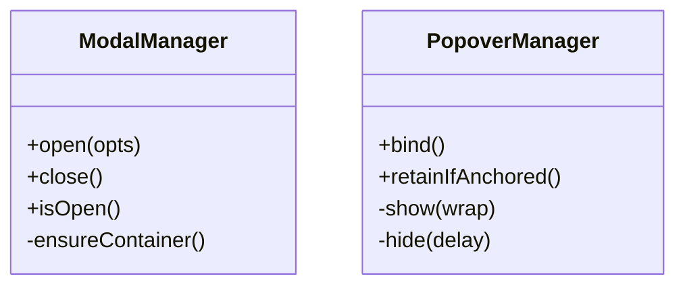
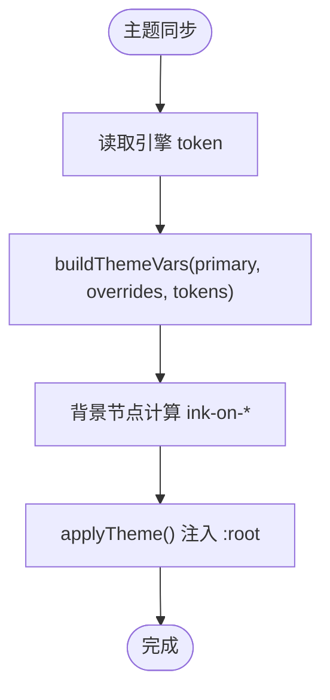
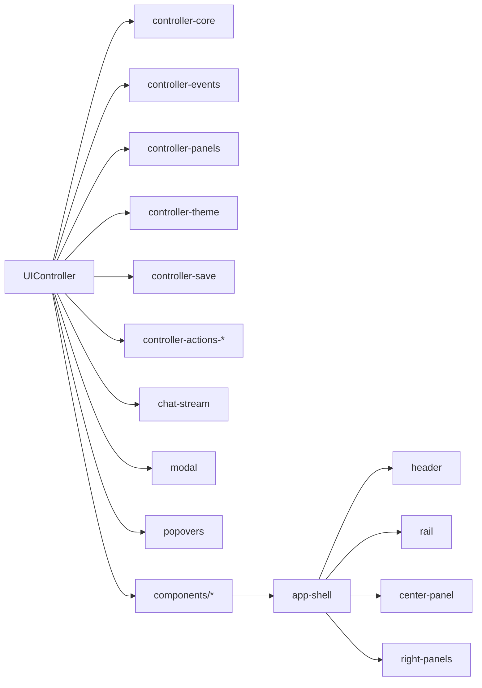

# UI架构设计

<cite>
**本文引用的文件**
- [src/ui/main.ts](file://src/ui/main.ts)
- [src/ui/controller.ts](file://src/ui/controller.ts)
- [src/ui/context.ts](file://src/ui/context.ts)
- [src/ui/controller-core.ts](file://src/ui/controller-core.ts)
- [src/ui/controller-events.ts](file://src/ui/controller-events.ts)
- [src/ui/chat-stream.ts](file://src/ui/chat-stream.ts)
- [src/ui/modal.ts](file://src/ui/modal.ts)
- [src/ui/popovers.ts](file://src/ui/popovers.ts)
- [src/ui/theme-tree.ts](file://src/ui/theme-tree.ts)
- [src/ui/components/app-shell.ts](file://src/ui/components/app-shell.ts)
- [src/ui/components/header.ts](file://src/ui/components/header.ts)
- [src/ui/components/rail.ts](file://src/ui/components/rail.ts)
- [src/ui/components/center-panel.ts](file://src/ui/components/center-panel.ts)
- [src/ui/components/right-panels.ts](file://src/ui/components/right-panels.ts)
</cite>

## 目录
1. [简介](#简介)
2. [项目结构](#项目结构)
3. [核心组件](#核心组件)
4. [架构总览](#架构总览)
5. [详细组件分析](#详细组件分析)
6. [依赖关系分析](#依赖关系分析)
7. [性能考量](#性能考量)
8. [故障排查指南](#故障排查指南)
9. [结论](#结论)
10. [附录：扩展指南](#附录扩展指南)

## 简介
本技术文档围绕 ACProgram 的 UI 架构，系统性阐述以下要点：
- UIController 门面模式的设计理念与实现：如何协调引擎、事件总线、聊天流、弹窗、主题等子系统。
- Context 上下文管理机制：全局状态共享、只读门面、依赖注入与生命周期。
- UI 渲染流程：全量渲染与轻量刷新的触发条件、DOM 操作优化与内存管理策略。
- 组件树构建过程：从 app-shell 到各面板的拼装、滚动位置恢复与事件绑定。
- 架构扩展指南：如何新增 UI 模块与功能特性，保持低耦合与高内聚。

## 项目结构
UI 层采用“控制器门面 + 领域子模块 + 视图渲染”的分层组织：
- 入口与装配：main.ts 初始化游戏实例并挂载 UIController。
- 控制器门面：controller.ts 作为统一入口，协调事件、渲染、主题、选择页、导入导出等。
- 刷新与生命周期：controller-core.ts 提供揭示指纹、轻量刷新、会话重置与历史持久化。
- 事件订阅：controller-events.ts 将引擎 EventBus 事件映射为 UI 行为（揭示刷新、奖励排队、演出文本）。
- 聊天流：chat-stream.ts 维护多沙盒聊天、剧情同步与演出覆盖文本。
- 通用 UI 能力：modal.ts（弹窗）、popovers.ts（悬浮详情）、theme-tree.ts（主题变量树）。
- 视图渲染：components/* 负责按 PanelState 生成 HTML 片段，app-shell.ts 组合三栏布局。

**图表来源**
- [src/ui/main.ts:22-29](file://src/ui/main.ts#L22-L29)
- [src/ui/controller.ts:139-225](file://src/ui/controller.ts#L139-L225)
- [src/ui/components/app-shell.ts:32-50](file://src/ui/components/app-shell.ts#L32-L50)

**章节来源**
- [src/ui/main.ts:22-29](file://src/ui/main.ts#L22-L29)
- [src/ui/controller.ts:139-225](file://src/ui/controller.ts#L139-L225)
- [src/ui/components/app-shell.ts:32-50](file://src/ui/components/app-shell.ts#L32-L50)

## 核心组件
- UIController（门面）：集中持有 GameInstance、root、ModalManager、ToastService、PopoverManager、ChatStream、ScrollManager、SelectorPage、ImportExportService；提供 mount/render/destroy 及领域方法（如 startNewGame、openGachaModal 等），并在 render 中编排主题同步、DOM 重建、滚动恢复与事件绑定。
- Context（UIContext/UIFacingGame）：向组件层暴露只读的游戏状态与查询系统，屏蔽写操作，确保“读在组件、写在控制器”的架构纪律。
- 刷新策略（controller-core）：通过揭示指纹与节流避免频繁重渲染；轻量刷新仅更新资源数字节点，保障聊天滚动与交互稳定。
- 事件驱动（controller-events）：订阅引擎事件，驱动揭示刷新、奖励通知排队、演出文本显示/清理等。
- 聊天流（chat-stream）：维护自增 ID、当前剧情指纹去重、多沙盒路由（一般聊天/学生对话空间）、演出覆盖文本。
- 弹窗与浮层（modal/popovers）：body 级挂载，跨 #app 重建存活；事件委托 + 防抖提升体验与性能。
- 主题变量树（theme-tree）：基于引擎 token 与语义节点生成 CSS 变量，支持背景明暗判定与实体作用域注入。

**章节来源**
- [src/ui/controller.ts:61-137](file://src/ui/controller.ts#L61-L137)
- [src/ui/context.ts:25-88](file://src/ui/context.ts#L25-L88)
- [src/ui/controller-core.ts:23-96](file://src/ui/controller-core.ts#L23-L96)
- [src/ui/controller-events.ts:12-88](file://src/ui/controller-events.ts#L12-L88)
- [src/ui/chat-stream.ts:15-145](file://src/ui/chat-stream.ts#L15-L145)
- [src/ui/modal.ts:56-101](file://src/ui/modal.ts#L56-L101)
- [src/ui/popovers.ts:19-131](file://src/ui/popovers.ts#L19-L131)
- [src/ui/theme-tree.ts:117-160](file://src/ui/theme-tree.ts#L117-L160)

## 架构总览
UI 层以 UIController 为门面，向上承接 main.ts 启动，向下协调引擎与视图渲染。渲染路径遵循“先同步运行时主题 → 生成 DOM → 绑定事件 → 恢复滚动 → 应用主题 → 同步揭示指纹”的顺序，确保 UI 一致性与性能。

**图表来源**
- [src/ui/main.ts:22-29](file://src/ui/main.ts#L22-L29)
- [src/ui/controller.ts:139-225](file://src/ui/controller.ts#L139-L225)
- [src/ui/controller-events.ts:12-88](file://src/ui/controller-events.ts#L12-L88)
- [src/ui/controller-core.ts:66-96](file://src/ui/controller-core.ts#L66-L96)
- [src/ui/theme-tree.ts:117-160](file://src/ui/theme-tree.ts#L117-L160)

## 详细组件分析

### UIController 门面模式
- 职责边界：聚合引擎、事件、聊天流、弹窗、主题、选择页、导入导出等子系统；对外暴露简洁 API（render、refreshLight、startNewGame 等）。
- 协调机制：mount 时绑定事件与定时刷新；render 中按序执行主题同步、DOM 重建、事件绑定、滚动恢复与主题应用；destroy 清理定时器。
- 状态管理：panelState 保存三栏 Tab、聊天条目、对话空间、学生聊天沙盒、故事导航路径；started 标记会话是否开始；pendingRestart 控制 Init 选择模式。

**图表来源**
- [src/ui/controller.ts:61-394](file://src/ui/controller.ts#L61-L394)

**章节来源**
- [src/ui/controller.ts:61-394](file://src/ui/controller.ts#L61-L394)

### Context 上下文管理
- UIFacingGame：对组件层暴露只读状态与查询系统（state、registry、valueSystem、conditionSystem、gameNumSystem、affectorEngine、characterSystem、rosterSystem、availabilityService、colorSystem、colorEquipmentSystem、gachaService、spotFunctionalitySystem、statsService、charaProfiles、pics、story、spot、getStoryView、getDevLogs）。
- UIContext：封装 view、saveExists、格式化函数与 nameOf，供组件渲染使用。
- 生命周期：createUIContext 在每次渲染前创建，保证读取最新视图；写操作一律由 controller 经 GameInstance 发起，维持架构纪律。

**图表来源**
- [src/ui/context.ts:25-88](file://src/ui/context.ts#L25-L88)

**章节来源**
- [src/ui/context.ts:25-88](file://src/ui/context.ts#L25-L88)

### 事件处理机制
- 订阅入口：bindEvents 在 mount 时调用一次，将引擎 EventBus 事件映射为 UI 响应。
- 揭示刷新：除 tick/spotProduced 外的事件均触发 reveal 指纹评估，变化则全量渲染。
- 奖励排队：storyRewarded/poolGateChanged/storyAreaTraveled 事件将奖励信息入队，在 render 中统一落账，保证聊天顺序正确。
- 演出文本：chatFlowCleared/chatTextClearedAll/storyTriggered/storyCompleted/chatTextShown/chatTextCleared 事件驱动聊天流与演出覆盖文本的清理与显示。

**图表来源**
- [src/ui/controller-events.ts:12-88](file://src/ui/controller-events.ts#L12-L88)
- [src/ui/controller-core.ts:50-60](file://src/ui/controller-core.ts#L50-L60)
- [src/ui/chat-stream.ts:53-76](file://src/ui/chat-stream.ts#L53-L76)

**章节来源**
- [src/ui/controller-events.ts:12-88](file://src/ui/controller-events.ts#L12-L88)
- [src/ui/controller-core.ts:50-60](file://src/ui/controller-core.ts#L50-L60)
- [src/ui/chat-stream.ts:53-76](file://src/ui/chat-stream.ts#L53-L76)

### 渲染流程与 DOM 优化
- 全量渲染（render）：
  - 保留锚点弹层（popovers.retainIfAnchored）。
  - 同步当前剧情至聊天流（chat.syncCurrentStory）。
  - 落账奖励通知（pendingRewardChats）。
  - 捕获滚动位置（scroll.capturePanel/captureChat）。
  - 同步运行时主题（syncRuntimeTheme）。
  - 重建 #app（innerHTML = renderAppShell）。
  - 绑定事件（bindActions）、恢复滚动（restoreChat/restorePanel）。
  - 观察聊天流尺寸（observeChatStream）。
  - 应用主题（applyTheme）、恢复主题浮窗（restoreThemeFloat）。
  - 同步揭示指纹（computeRevealFingerprint）。
- 轻量刷新（refreshLight）：
  - 每 Tick 仅更新资源数字节点与 Spot 产出，不重建 DOM。
  - 兜底：若有待落账奖励，直接触发全量渲染。
- 组件树构建：
  - app-shell 组合 header、left/center/right 面板。
  - center-panel 根据 conversationVariantId 切换对话空间或聊天/日志。
  - rail 与 right-panels 分别渲染区域/故事/通讯录与设施/学生/强化/其他。

**图表来源**
- [src/ui/controller.ts:189-225](file://src/ui/controller.ts#L189-L225)
- [src/ui/controller-core.ts:66-96](file://src/ui/controller-core.ts#L66-L96)
- [src/ui/components/app-shell.ts:32-50](file://src/ui/components/app-shell.ts#L32-L50)

**章节来源**
- [src/ui/controller.ts:189-225](file://src/ui/controller.ts#L189-L225)
- [src/ui/controller-core.ts:66-96](file://src/ui/controller-core.ts#L66-L96)
- [src/ui/components/app-shell.ts:32-50](file://src/ui/components/app-shell.ts#L32-L50)

### 聊天流与多沙盒管理
- 活跃流路由：conversationVariantId 为空时使用全局聊天流；非空时路由到对应学生的独立流。
- 剧情同步：以 storyId:pageIndex 指纹去重，避免重复入流；click 页不入流。
- 演出覆盖文本：pushChatText/clearChatText 支持同 id 覆盖更新与删除。
- 历史持久化：withHistories/restoreHistories 限制条数（MAX_CHAT_HISTORY），读档后恢复。

**图表来源**
- [src/ui/chat-stream.ts:25-43](file://src/ui/chat-stream.ts#L25-L43)
- [src/ui/chat-stream.ts:53-76](file://src/ui/chat-stream.ts#L53-L76)
- [src/ui/chat-stream.ts:127-143](file://src/ui/chat-stream.ts#L127-L143)

**章节来源**
- [src/ui/chat-stream.ts:25-43](file://src/ui/chat-stream.ts#L25-L43)
- [src/ui/chat-stream.ts:53-76](file://src/ui/chat-stream.ts#L53-L76)
- [src/ui/chat-stream.ts:127-143](file://src/ui/chat-stream.ts#L127-L143)

### 弹窗与悬浮详情
- ModalManager：body 级挂载，遮罩+面板+标题+内容+底部操作区；支持 Esc/遮罩点击关闭；重复 open 替换内容。
- PopoverManager：事件委托 + 防抖（SHOW_DELAY/HIDE_DELAY）；跨 #app 重建保留；retainIfAnchored 判断锚点是否仍连接以决定是否关闭浮层。

**图表来源**
- [src/ui/modal.ts:56-101](file://src/ui/modal.ts#L56-L101)
- [src/ui/popovers.ts:19-131](file://src/ui/popovers.ts#L19-L131)

**章节来源**
- [src/ui/modal.ts:56-101](file://src/ui/modal.ts#L56-L101)
- [src/ui/popovers.ts:19-131](file://src/ui/popovers.ts#L19-L131)

### 主题系统与变量树
- 主题变量树：buildThemeVars 将语义节点与引擎 token 合并，生成 CSS 变量；背景节点自动计算 ink-on-* 文本色。
- 运行时主题：syncRuntimeTheme 将 player/area/student 层状态同步到当前状态，确保渲染前主题一致。
- 主题浮窗：header 中主题调色板与层级优先级段，支持拖拽排序与区域配色选择。

**图表来源**
- [src/ui/theme-tree.ts:117-160](file://src/ui/theme-tree.ts#L117-L160)
- [src/ui/controller.ts:235-245](file://src/ui/controller.ts#L235-L245)
- [src/ui/components/header.ts:53-101](file://src/ui/components/header.ts#L53-L101)

**章节来源**
- [src/ui/theme-tree.ts:117-160](file://src/ui/theme-tree.ts#L117-L160)
- [src/ui/controller.ts:235-245](file://src/ui/controller.ts#L235-L245)
- [src/ui/components/header.ts:53-101](file://src/ui/components/header.ts#L53-L101)

## 依赖关系分析
- UIController 依赖：GameInstance、SaveSystem、ChatStream、ScrollManager、SelectorPage、ImportExportService、ModalManager、ToastService、PopoverManager、controller-core/events/panels/theme/save/actions。
- 组件依赖：app-shell 组合 header/rail/center-panel/right-panels；center-panel 依赖 story/contacts；rail 依赖 tooltip/tabs；right-panels 依赖 production/enhancements/contacts。
- 外部依赖：engine/system/color-system、engine/game/story-service、engine/expression/value-system 等只读接口通过 Context 暴露。

**图表来源**
- [src/ui/controller.ts:110-137](file://src/ui/controller.ts#L110-L137)
- [src/ui/components/app-shell.ts:32-50](file://src/ui/components/app-shell.ts#L32-L50)

**章节来源**
- [src/ui/controller.ts:110-137](file://src/ui/controller.ts#L110-L137)
- [src/ui/components/app-shell.ts:32-50](file://src/ui/components/app-shell.ts#L32-L50)

## 性能考量
- 轻量刷新优先：每 Tick 仅更新资源数字与 Spot 产出，避免重建 #app，保障聊天滚动与交互稳定性。
- 揭示指纹与节流：高频事件下 200ms 节流，仅在指纹变化时全量渲染，减少不必要的 DOM 重建。
- 滚动位置捕获与恢复：全量渲染前后捕获与恢复滚动位置，避免列表跳变。
- 事件委托与防抖：悬浮详情使用事件委托与 SHOW/HIDE 延迟，降低频繁计算与重绘。
- 聊天流上限与截断：CHAT_MAX 与 MAX_CHAT_HISTORY 限制内存占用，读档时仅恢复最近 N 条。
- 主题变量一次性计算：buildThemeVars 生成静态 CSS 变量，避免运行时多次解析。

[本节为通用性能指导，无需特定文件引用]

## 故障排查指南
- 揭示未刷新：检查 EventBus 事件是否被拦截（tick/spotProduced 不参与揭示评估），确认 lastRevealCheck 节流与指纹计算逻辑。
- 聊天流异常：确认 conversationVariantId 路由是否正确；检查剧情指纹去重逻辑与 click 页不入流规则。
- 弹窗/浮层残留：在全量渲染前调用 retainIfAnchored 判断锚点是否仍连接；必要时手动关闭浮层。
- 主题不一致：确保 syncRuntimeTheme 在 render 早期调用；检查 buildThemeVars 的 overrides 与 tokens 传入是否正确。
- 滚动位置丢失：确认 capturePanel/captureChat 与 restorePanel/restoreChat 成对调用；观察 observeChatStream 是否生效。

**章节来源**
- [src/ui/controller-core.ts:50-60](file://src/ui/controller-core.ts#L50-L60)
- [src/ui/chat-stream.ts:53-76](file://src/ui/chat-stream.ts#L53-L76)
- [src/ui/popovers.ts:34-40](file://src/ui/popovers.ts#L34-L40)
- [src/ui/controller.ts:189-225](file://src/ui/controller.ts#L189-L225)

## 结论
ACProgram 的 UI 架构以 UIController 为门面，结合 Context 只读门面、事件驱动与轻量刷新策略，实现了高内聚、低耦合、可扩展的界面系统。通过聊天流多沙盒、弹窗/浮层 body 级挂载、主题变量树与滚动位置恢复，保障了用户体验与性能。未来扩展可遵循“控制器协调 + 领域子模块 + 视图渲染”的分层原则，保持清晰的职责边界与稳定的渲染流程。

[本节为总结性内容，无需特定文件引用]

## 附录：扩展指南
- 新增 UI 模块：
  - 在 components/* 中新增视图渲染函数，返回 HTML 片段。
  - 在 app-shell 或对应面板中集成新视图，传入必要的 UIContext 与 PanelState。
  - 如需交互，在 controller-actions-* 中新增事件绑定，并通过 UIController 暴露方法。
- 新增功能特性：
  - 通过 EventBus 发布事件，在 controller-events 中订阅并映射为 UI 行为。
  - 若涉及状态变更，经由 GameInstance 的写入口进行，组件层仅做只读访问。
  - 若需主题支持，在 theme-tree 中添加语义节点或覆盖 token，确保 ink-on-* 正确计算。
- 最佳实践：
  - 保持 render 与 refreshLight 的职责分离，避免在轻量刷新中重建 DOM。
  - 使用 PanelState 管理 UI 状态，避免散落的全局变量。
  - 通过 ChatStream 统一管理聊天与演出文本，确保多沙盒隔离与历史持久化。

[本节为通用扩展指导，无需特定文件引用]