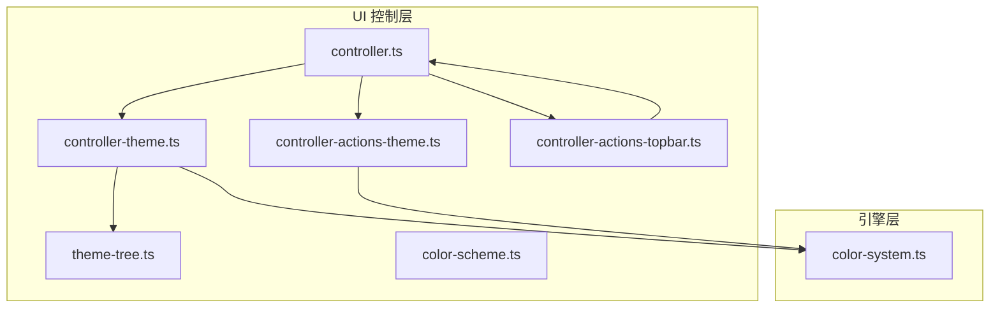
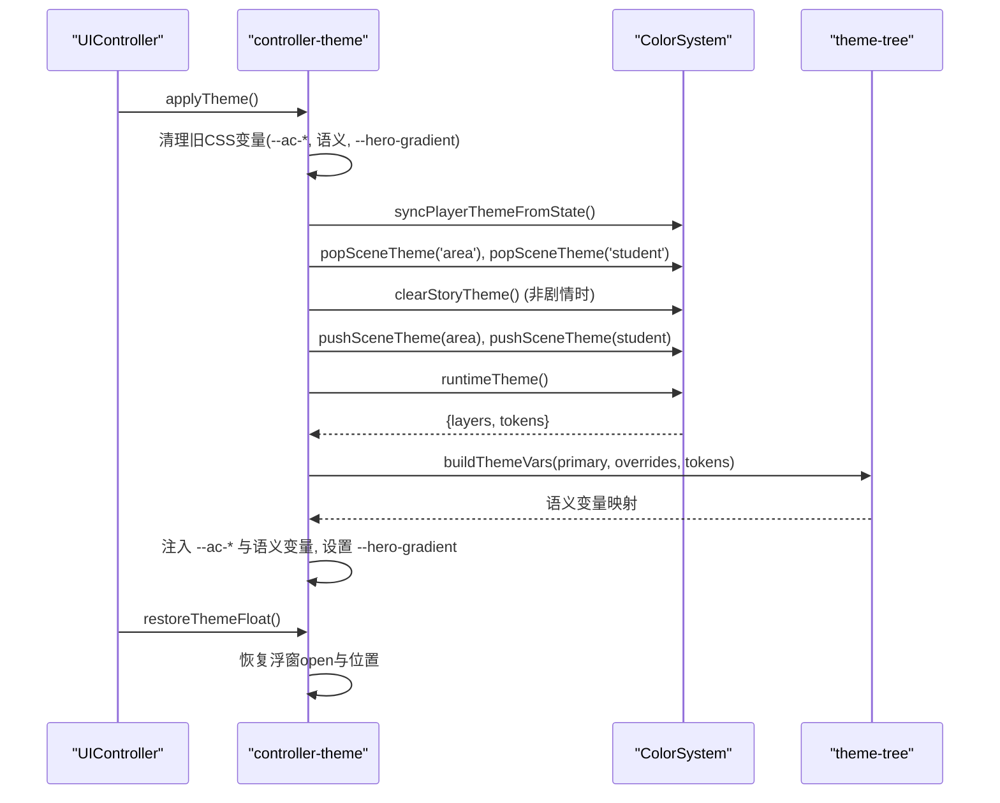
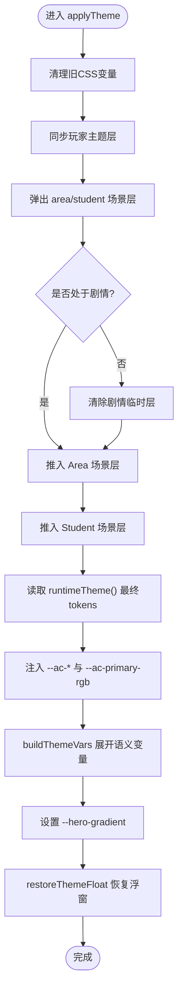
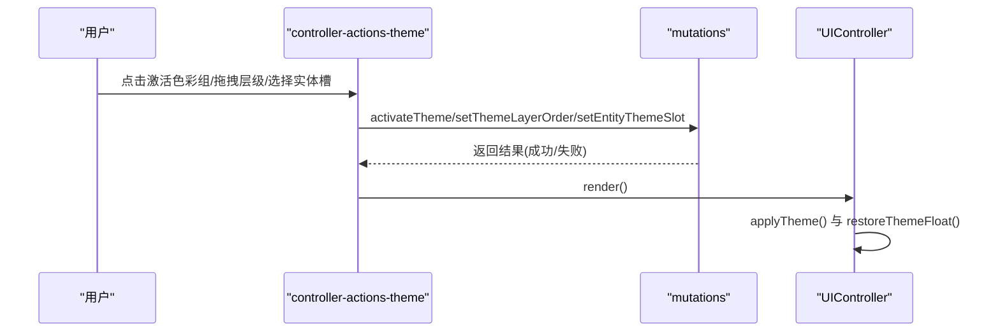
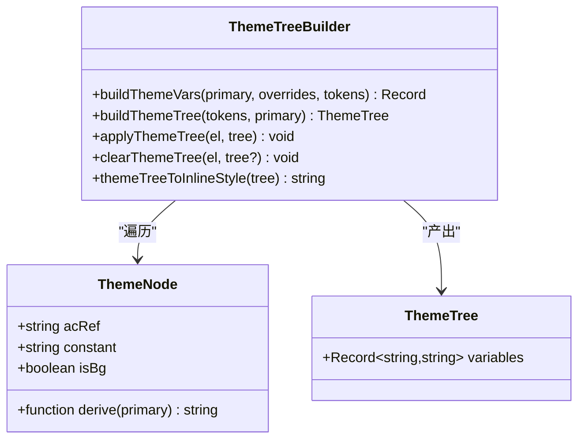
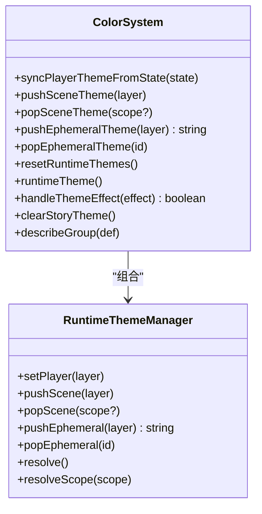
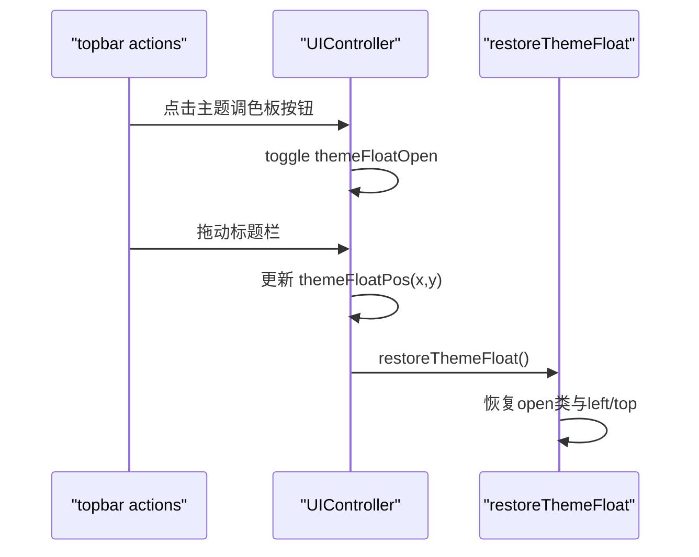
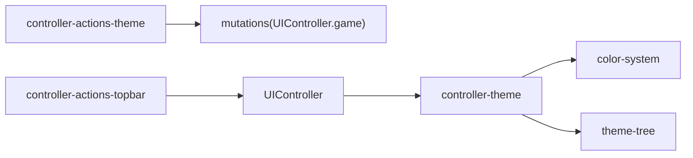

# 主题控制器

<cite>
**本文引用的文件**
- [controller-theme.ts](file://src/ui/controller-theme.ts)
- [controller-actions-theme.ts](file://src/ui/controller-actions-theme.ts)
- [theme-tree.ts](file://src/ui/theme-tree.ts)
- [color-scheme.ts](file://src/ui/color-scheme.ts)
- [controller.ts](file://src/ui/controller.ts)
- [color-system.ts](file://src/engine/system/color-system.ts)
- [controller-actions-topbar.ts](file://src/ui/controller-actions-topbar.ts)
- [theme-runtime.test.ts](file://tests/engine/theme-runtime.test.ts)
</cite>

## 目录
1. [简介](#简介)
2. [项目结构](#项目结构)
3. [核心组件](#核心组件)
4. [架构总览](#架构总览)
5. [详细组件分析](#详细组件分析)
6. [依赖关系分析](#依赖关系分析)
7. [性能考量](#性能考量)
8. [故障排除指南](#故障排除指南)
9. [结论](#结论)

## 简介
本技术文档聚焦 ACProgram 的“主题控制器”，系统性阐述其运行时职责与实现机制，包括：
- 运行时主题注入：将引擎层合并后的主题 token 注入为 CSS 变量，并展开 UI 语义层变量。
- 场景层管理：维护玩家全局层、当前 Area 场景层、当前学生对话场景层以及剧情临时演出层的优先级与生命周期。
- CSS 变量同步机制：清理旧注入、重建场景栈、生成 --ac-* 强制层与语义层变量、计算背景明暗以决定文本色。
- 主题浮窗管理：跨 #app 全量重建保持浮窗状态（打开/关闭）与位置，并在 DOM 重建后恢复。
- 与其他 UI 组件集成：事件监听、状态更新、渲染触发与性能优化策略。
- 调试方法与故障排除：定位主题不生效、层级覆盖异常、浮窗丢失等常见问题。

## 项目结构
主题相关代码分布在 UI 控制层与引擎色彩系统之间，关键文件如下：
- UI 控制层
  - controller-theme.ts：主题运行时注入、场景层同步、主题浮窗恢复。
  - controller-actions-theme.ts：主题交互事件绑定（激活色彩组、拖拽调整层级顺序、实体主题槽选择）。
  - theme-tree.ts：界面色彩树与变量构建（--ac-* 优先、自动衍生、背景明暗判定、英雄渐变）。
  - color-scheme.ts：统一颜色管理框架与强调卡调色板（与主题系统解耦）。
  - controller.ts：UI 控制器门面，编排 render 流程并委托主题注入与浮窗恢复。
  - controller-actions-topbar.ts：主题浮窗开关与拖动定位。
- 引擎层
  - color-system.ts：ColorSystem 封装 RuntimeThemeManager，提供 push/pop 场景层、临时演出层、同步玩家主题、解析 token 等能力。
- 测试
  - theme-runtime.test.ts：验证多色彩组/场景/临时演出的叠加与 setTheme effect 处理。

图表来源
- [controller.ts:189-245](file://src/ui/controller.ts#L189-L245)
- [controller-theme.ts:16-128](file://src/ui/controller-theme.ts#L16-L128)
- [controller-actions-theme.ts:11-84](file://src/ui/controller-actions-theme.ts#L11-L84)
- [theme-tree.ts:101-160](file://src/ui/theme-tree.ts#L101-L160)
- [color-system.ts:207-311](file://src/engine/system/color-system.ts#L207-L311)
- [controller-actions-topbar.ts:23-66](file://src/ui/controller-actions-topbar.ts#L23-L66)

章节来源
- [controller.ts:189-245](file://src/ui/controller.ts#L189-L245)
- [controller-theme.ts:16-128](file://src/ui/controller-theme.ts#L16-L128)
- [controller-actions-theme.ts:11-84](file://src/ui/controller-actions-theme.ts#L11-L84)
- [theme-tree.ts:101-160](file://src/ui/theme-tree.ts#L101-L160)
- [color-system.ts:207-311](file://src/engine/system/color-system.ts#L207-L311)
- [controller-actions-topbar.ts:23-66](file://src/ui/controller-actions-topbar.ts#L23-L66)

## 核心组件
- 主题运行时注入器（applyTheme / syncRuntimeTheme / restoreThemeFloat）
  - 负责清理旧 CSS 变量、重建场景层、合并 token、注入 --ac-* 与语义层变量、计算 hero 渐变。
- 主题交互绑定器（bindThemeActions）
  - 处理激活色彩组、拖拽调整层级顺序、实体主题槽选择，触发状态变更与重渲染。
- 色彩树与变量构建（buildThemeVars / buildThemeTree / heroGradient）
  - 定义语义节点、acRef 映射、自动衍生、背景明暗判定、可复用 ThemeTree 快照。
- 色彩系统（ColorSystem）
  - 封装 RuntimeThemeManager，提供 player/scene/ephemeral 三层管理与解析；处理 setTheme effect。
- 主题浮窗管理（restoreThemeFloat + topbar 拖动）
  - 在 #app 重建后恢复浮窗开闭状态与位置，支持拖动保存坐标。

章节来源
- [controller-theme.ts:16-128](file://src/ui/controller-theme.ts#L16-L128)
- [controller-actions-theme.ts:11-84](file://src/ui/controller-actions-theme.ts#L11-L84)
- [theme-tree.ts:101-160](file://src/ui/theme-tree.ts#L101-L160)
- [color-system.ts:207-311](file://src/engine/system/color-system.ts#L207-L311)
- [controller-actions-topbar.ts:23-66](file://src/ui/controller-actions-topbar.ts#L23-L66)

## 架构总览
主题控制器位于 UI 控制层与引擎色彩系统之间，承担“运行时主题注入”的职责。整体流程如下：
- 用户操作或状态变化触发 UIController.render()。
- render 中调用 applyTheme()，内部执行：
  - 清理已注入的 --ac-*、语义变量与 hero 渐变。
  - 同步运行时主题层：pop area/student 层 → 同步玩家基色 → 清除剧情临时层（如不在剧情中）→ 重新推入 area/student 场景层。
  - 读取 ColorSystem.runtimeTheme() 得到最终 tokens。
  - 注入 --ac-* 强制层与 --ac-primary-rgb。
  - 通过 buildThemeVars 展开语义层变量，并设置 --hero-gradient。
- 主题浮窗在每次 render 后由 restoreThemeFloat() 恢复开闭与位置。

图表来源
- [controller-theme.ts:95-128](file://src/ui/controller-theme.ts#L95-L128)
- [color-system.ts:231-276](file://src/engine/system/color-system.ts#L231-L276)
- [theme-tree.ts:117-160](file://src/ui/theme-tree.ts#L117-L160)
- [controller.ts:222-245](file://src/ui/controller.ts#L222-L245)

## 详细组件分析

### 主题运行时注入（applyTheme / syncRuntimeTheme / restoreThemeFloat）
- 清理阶段
  - 移除所有 --ac-*、--ink-on-*、--muted-on-* 以及 THEME_NODES 键名对应的变量和 --hero-gradient，确保无残留覆盖。
- 场景层同步
  - 弹出 area/student 场景层，避免上一帧残留影响。
  - 从 PlayerState 同步玩家全局层（activeGroupId），保证读档/切换主题后基色正确。
  - 若当前不在剧情中，清除剧情临时演出层，防止临时主题污染后续渲染。
  - 根据当前 Area 与学生对话 Variant 重新推入场景层：
    - Area：优先使用实体主题槽覆盖（设计/自定义/装备），否则采用声明默认 theme。
    - Student：优先使用实体主题槽覆盖；若无覆盖，则优先使用装备或 variant.colorGroupId，再叠加 variant.theme.tokens。
- 变量注入
  - 读取 ColorSystem.runtimeTheme() 的最终 tokens，写入 --ac-* 强制层与 --ac-primary-rgb。
  - 通过 buildThemeVars 展开语义层变量，传入真实 tokens 使背景明暗判定更准确。
  - 设置 --hero-gradient，跟随 primary 光晕。
- 浮窗恢复
  - 在 #app 重建后，依据 ctrl.themeFloatOpen 与 ctrl.themeFloatPos 恢复浮窗 open 类与 left/top 坐标。

图表来源
- [controller-theme.ts:95-128](file://src/ui/controller-theme.ts#L95-L128)
- [color-system.ts:231-276](file://src/engine/system/color-system.ts#L231-L276)
- [theme-tree.ts:117-160](file://src/ui/theme-tree.ts#L117-L160)

章节来源
- [controller-theme.ts:16-128](file://src/ui/controller-theme.ts#L16-L128)
- [color-system.ts:231-276](file://src/engine/system/color-system.ts#L231-L276)
- [theme-tree.ts:117-160](file://src/ui/theme-tree.ts#L117-L160)

### 主题交互事件绑定（activate-color / 层级顺序 / 实体主题槽）
- 激活色彩组
  - 点击 data-activate-group 按钮，调用 mutations.activateTheme(groupId)，失败提示未解锁，成功提示并触发 render。
- 层级顺序拖拽
  - HTML5 DnD 在 data-theme-layer-order-rows 内移动行，drop 时计算新顺序（展示序顶部=最高优先级，引擎序反转），调用 mutations.setThemeLayerOrder 并 render。
- 实体主题槽选择
  - 点击 data-entity-theme-select 按钮，解析 JSON payload {entityKey, slot}，调用 mutations.setEntityThemeSlot 并 render。

图表来源
- [controller-actions-theme.ts:11-84](file://src/ui/controller-actions-theme.ts#L11-L84)
- [controller.ts:222-245](file://src/ui/controller.ts#L222-L245)

章节来源
- [controller-actions-theme.ts:11-84](file://src/ui/controller-actions-theme.ts#L11-L84)
- [controller.ts:222-245](file://src/ui/controller.ts#L222-L245)

### 色彩树与变量构建（theme-tree）
- 语义节点定义
  - ink、ink-strong、muted、line、panel、panel-light、canvas、cyan、primary-rgb、player-bubble、npc-bubble、lime、orange。
  - 每个节点可配置 acRef（对齐 --ac-*）、derive（自动衍生）、constant（固定值）、isBg（背景节点，派生 --ink-on-* 与 --muted-on-*）。
- 变量构建逻辑
  - overrides 最高优先级直接覆盖。
  - 有 acRef 时生成 var(--ac-<ref>, fallback)；fallback 为 constant 或 derive。
  - 无 acRef 且无 constant 时使用 derive。
  - 背景节点基于实际解析色（优先引擎真实 token）计算感知亮度，确定白/黑文本色。
- 辅助工具
  - buildThemeTree：将 tokens 转换为完整 ThemeTree（含 --ac-* 与 --hero-gradient）。
  - applyThemeTree/clearThemeTree：作用域化应用与清理。
  - themeTreeToInlineStyle：生成内联 style 字符串。
  - themeTreeFromGroup/themeTreeFromThemeDef：快速映射 ColorGroup/ThemeDef 到 ThemeTree。

图表来源
- [theme-tree.ts:75-160](file://src/ui/theme-tree.ts#L75-L160)
- [theme-tree.ts:196-251](file://src/ui/theme-tree.ts#L196-L251)

章节来源
- [theme-tree.ts:75-160](file://src/ui/theme-tree.ts#L75-L160)
- [theme-tree.ts:196-251](file://src/ui/theme-tree.ts#L196-L251)

### 色彩系统（ColorSystem）与运行时主题管理
- 运行时主题管理器
  - 支持 player（全局）、scene（area/student）、ephemeral（临时演出）三层叠加，按 scope 管理。
  - 提供 pushSceneTheme/popSceneTheme/pushEphemeralTheme/popEphemeralTheme/resetRuntimeThemes/runtimeTheme/scopeThemeTokens 等方法。
- 玩家主题同步
  - syncPlayerThemeFromState：从 PlayerState.activeGroupId 设置 player 层，并设置层级顺序。
- 场景层合并
  - Area：优先实体主题槽覆盖，否则使用声明 theme。
  - Student：优先实体主题槽覆盖；否则使用装备或 variant.colorGroupId，叠加 variant.theme.tokens。
- 临时演出层
  - handleThemeEffect：scope=area/student 改写实体主题槽；否则推入临时演出层（story-ephemeral），离开剧情时 clearStoryTheme。
- 主题解析
  - resolveTheme：从 ColorGroupDef 解析 tokens，包含对比度防呆（text/bg 不足阈值翻转）。
  - describeGroup：用于图鉴展示 token 来源（defined/derived）。

图表来源
- [color-system.ts:207-311](file://src/engine/system/color-system.ts#L207-L311)
- [color-system.ts:539-557](file://src/engine/system/color-system.ts#L539-L557)

章节来源
- [color-system.ts:207-311](file://src/engine/system/color-system.ts#L207-L311)
- [color-system.ts:539-557](file://src/engine/system/color-system.ts#L539-L557)

### 主题浮窗管理（状态保持、位置恢复、DOM重建后同步）
- 状态保持
  - UIController 持有 themeFloatOpen 与 themeFloatPos，跨 render 持久化浮窗开闭与坐标。
- 位置恢复
  - restoreThemeFloat：在 #app 重建后查找 [data-theme-float]，根据 themeFloatOpen 添加/移除 open 类，并按 themeFloatPos 设置 left/top 与 right:auto。
- 拖动定位
  - controller-actions-topbar：标题栏 pointerdown/pointermove/pointerup 实现拖动，限制在窗口范围内，实时更新 themeFloatPos。

图表来源
- [controller-actions-topbar.ts:23-66](file://src/ui/controller-actions-topbar.ts#L23-L66)
- [controller-theme.ts:16-29](file://src/ui/controller-theme.ts#L16-L29)
- [controller.ts:95-98](file://src/ui/controller.ts#L95-L98)

章节来源
- [controller-actions-topbar.ts:23-66](file://src/ui/controller-actions-topbar.ts#L23-L66)
- [controller-theme.ts:16-29](file://src/ui/controller-theme.ts#L16-L29)
- [controller.ts:95-98](file://src/ui/controller.ts#L95-L98)

### 主题控制与其他 UI 组件的集成
- 事件监听
  - 主题切换按钮、层级拖拽、实体主题槽选择均通过 data-* 属性绑定事件，调用 mutations 更新状态并触发 render。
- 状态更新
  - 所有主题相关状态变更走 mutations（activateTheme、setThemeLayerOrder、setEntityThemeSlot），确保单一数据源与一致性。
- 性能优化策略
  - 轻量刷新：每 Tick 仅更新资源数字节点，不重建 #app DOM（refreshLight）。
  - 揭示指纹去重：仅在揭示条件变化时重建 UI，避免频繁重绘。
  - 主题变量一次性注入：applyTheme 清理后批量注入，减少多次样式操作。
  - 背景明暗判定使用确定性 JS 计算，避免依赖浏览器 color-contrast() 的不稳定行为。

章节来源
- [controller-actions-theme.ts:11-84](file://src/ui/controller-actions-theme.ts#L11-L84)
- [controller.ts:155-167](file://src/ui/controller.ts#L155-L167)
- [theme-tree.ts:144-157](file://src/ui/theme-tree.ts#L144-L157)

## 依赖关系分析
- 耦合与内聚
  - controller-theme 高内聚于运行时注入逻辑，低耦合于 UI 其他模块，通过 UIController 门面协调。
  - color-system 作为引擎层主题核心，对外暴露清晰接口，屏蔽 RuntimeThemeManager 复杂度。
  - theme-tree 纯函数式构建变量，易于测试与复用。
- 直接依赖
  - controller-theme → color-system、theme-tree。
  - controller-actions-theme → mutations（通过 UIController.game.mutations）。
  - controller-actions-topbar → UIController 状态读写。
- 间接依赖
  - 主题效果（setTheme）经 effect-engine 转发至 colorSystem.handleThemeEffect，可能改写实体主题槽或推入临时演出层。
- 外部依赖
  - 浏览器 CSS 变量 API（style.setProperty/removeProperty）。
  - HTML5 DnD API（dragstart/dragover/drop）。
  - Pointer Events API（pointerdown/move/up）。

图表来源
- [controller-theme.ts:8-10](file://src/ui/controller-theme.ts#L8-L10)
- [controller-actions-theme.ts:7-8](file://src/ui/controller-actions-theme.ts#L7-L8)
- [controller-actions-topbar.ts:23-66](file://src/ui/controller-actions-topbar.ts#L23-L66)
- [controller.ts:53-58](file://src/ui/controller.ts#L53-L58)

章节来源
- [controller-theme.ts:8-10](file://src/ui/controller-theme.ts#L8-L10)
- [controller-actions-theme.ts:7-8](file://src/ui/controller-actions-theme.ts#L7-L8)
- [controller-actions-topbar.ts:23-66](file://src/ui/controller-actions-topbar.ts#L23-L66)
- [controller.ts:53-58](file://src/ui/controller.ts#L53-L58)

## 性能考量
- 样式操作批量化：applyTheme 先清理再批量注入，减少多次 reflow。
- 场景层最小化变更：仅在必要时 pop/push 场景层，避免重复计算。
- 背景明暗判定静态化：使用确定性 JS 计算 --ink-on-*，避免运行时 CSS 函数开销。
- 轻量刷新：refreshLight 仅更新必要节点，降低 DOM 压力。
- 揭示指纹去重：避免高频事件导致的重复重建。

[本节提供通用指导，无需特定文件引用]

## 故障排除指南
- 主题不生效
  - 检查 applyTheme 是否正确调用（render 流程中）。
  - 确认 ColorSystem.syncPlayerThemeFromState 已在状态变更后调用。
  - 查看 runtimeTheme().layers 是否为空；为空则回退到 :root fallback。
- 层级覆盖异常
  - 确认层级顺序 state.themeLayerOrder 是否正确（DEFAULT_LAYER_ORDER 反转）。
  - 检查 pushSceneTheme/popSceneTheme 成对调用，避免残留层。
- 浮窗丢失或位置错误
  - 确认 restoreThemeFloat 在 render 后被调用。
  - 检查 themeFloatOpen 与 themeFloatPos 是否正确更新。
  - 拖动事件中边界限制是否正确（window.innerWidth/Height）。
- 背景文字色不正确
  - 检查 theme-tree 的 isBg 节点与 tokens 传入是否正确。
  - 确认 buildThemeVars 使用了真实 tokens 进行明暗判定。
- 调试方法
  - 使用 tests/engine/theme-runtime.test.ts 中的用例思路，构造场景验证多层叠加。
  - 在控制台输出 runtimeTheme().tokens 与 layers，观察合并结果。
  - 使用 describeGroup 查看 token 来源（defined/derived）。

章节来源
- [controller-theme.ts:95-128](file://src/ui/controller-theme.ts#L95-L128)
- [color-system.ts:231-276](file://src/engine/system/color-system.ts#L231-L276)
- [theme-tree.ts:117-160](file://src/ui/theme-tree.ts#L117-L160)
- [theme-runtime.test.ts:16-244](file://tests/engine/theme-runtime.test.ts#L16-L244)

## 结论
主题控制器通过清晰的职责划分与分层架构，实现了运行时主题注入、场景层管理与 CSS 变量同步的完整生命周期。其与 UI 组件的集成方式简洁高效，事件驱动与状态集中管理确保了可维护性与性能。通过浮窗状态保持与位置恢复机制，提升了用户体验。结合测试与调试方法，可有效定位与解决主题相关问题。

[本节总结性内容，无需特定文件引用]