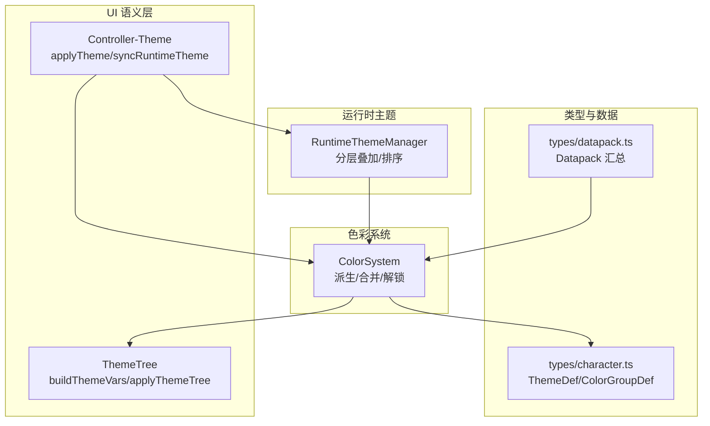
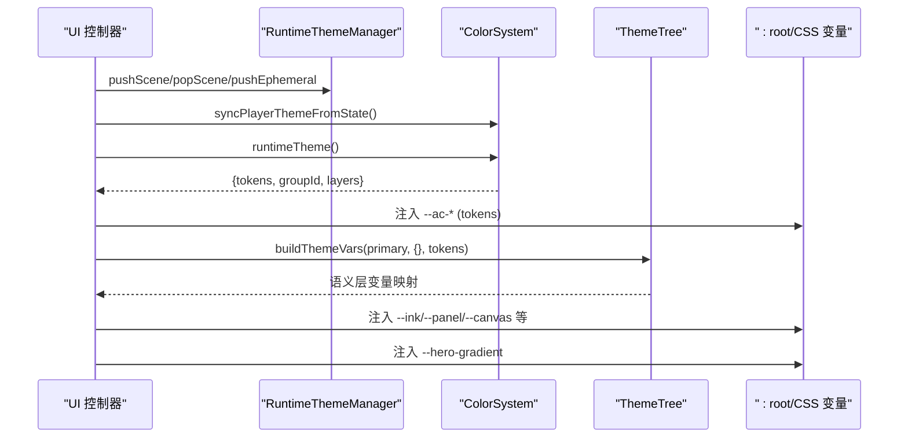
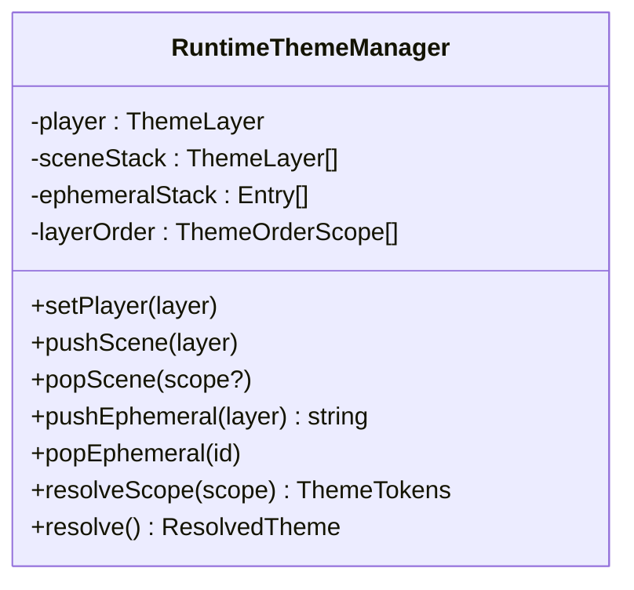
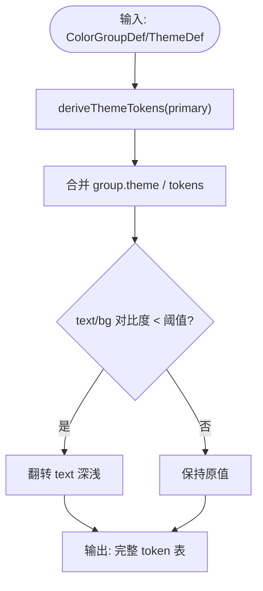
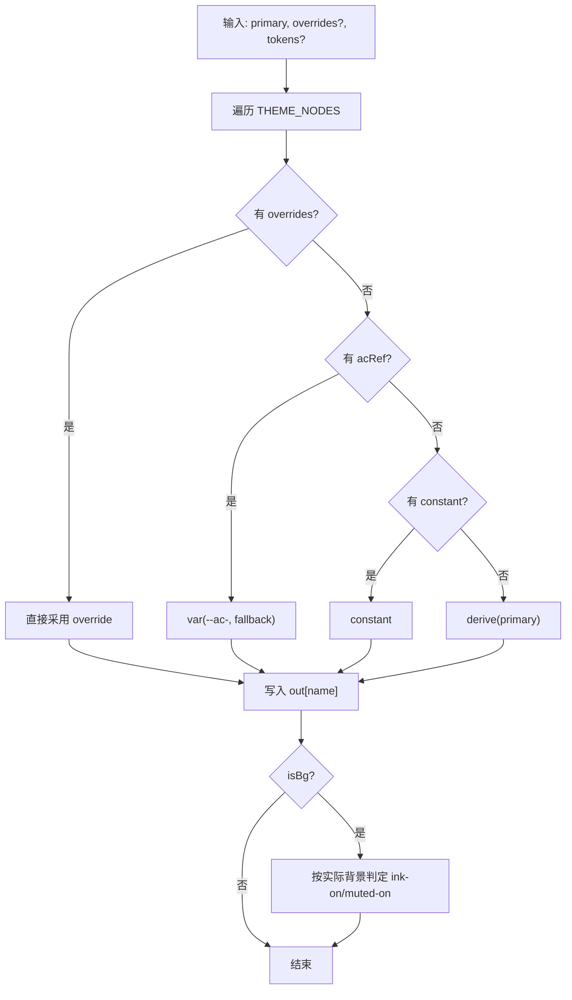
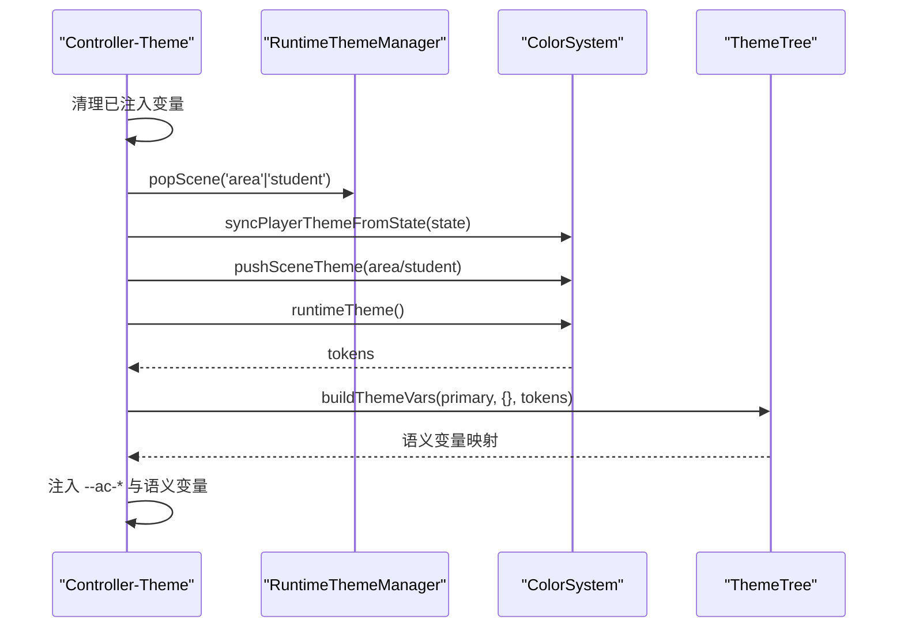
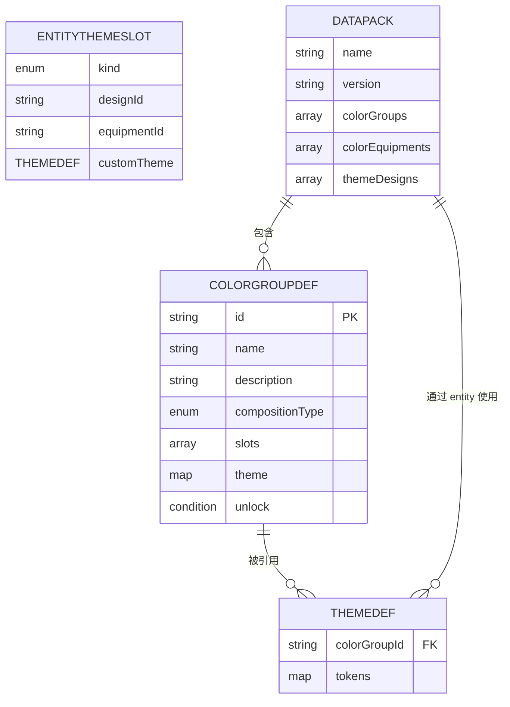
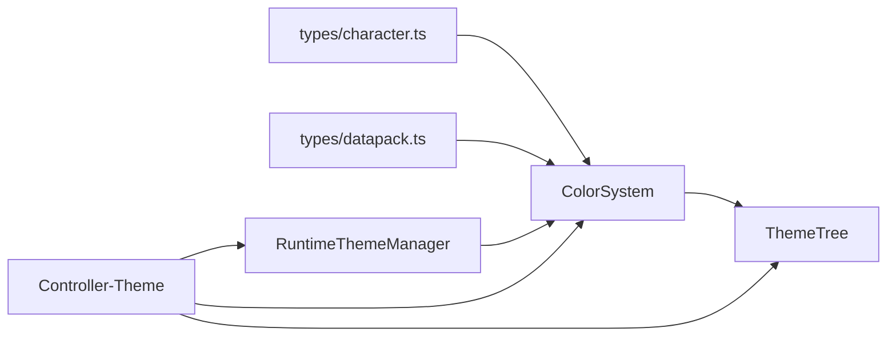

# 主题树系统

<cite>
**本文引用的文件**
- [src/ui/theme-tree.ts](file://src/ui/theme-tree.ts)
- [src/engine/system/color-system.ts](file://src/engine/system/color-system.ts)
- [src/engine/core/theme-runtime.ts](file://src/engine/core/theme-runtime.ts)
- [src/ui/controller-theme.ts](file://src/ui/controller-theme.ts)
- [src/engine/types/character.ts](file://src/engine/types/character.ts)
- [src/engine/types/datapack.ts](file://src/engine/types/datapack.ts)
- [tests/ui/theme-tree.test.ts](file://tests/ui/theme-tree.test.ts)
- [tests/engine/theme-tree.test.ts](file://tests/engine/theme-tree.test.ts)
- [tests/engine/theme-runtime.test.ts](file://tests/engine/theme-runtime.test.ts)
</cite>

## 目录
1. [简介](#简介)
2. [项目结构](#项目结构)
3. [核心组件](#核心组件)
4. [架构总览](#架构总览)
5. [详细组件分析](#详细组件分析)
6. [依赖关系分析](#依赖关系分析)
7. [性能与优化](#性能与优化)
8. [故障排查指南](#故障排查指南)
9. [结论](#结论)
10. [附录：扩展与调试](#附录：扩展与调试)

## 简介
本技术文档围绕 ACProgram 的主题树系统，系统性说明 ThemeTree 的架构设计、主题节点层次结构、条件应用机制与优先级计算规则；详述主题配置的数据结构（节点定义、继承关系与覆盖规则）；文档化主题树的构建过程（静态分析、依赖解析与渲染优化）；解释主题变量的命名规范与作用域管理（全局变量、局部变量与动态变量）；并提供主题树扩展指南与调试工具使用说明。

## 项目结构
主题树系统由“运行时主题分层”“色彩派生与 token 合并”“UI 语义层映射”三部分组成，分别位于以下模块：
- 运行时主题分层：engine/core/theme-runtime.ts
- 色彩系统与 token 派生：engine/system/color-system.ts
- UI 语义层与主题树：ui/theme-tree.ts
- UI 控制器注入：ui/controller-theme.ts
- 类型定义：engine/types/character.ts、engine/types/datapack.ts
- 测试用例：tests/ui/theme-tree.test.ts、tests/engine/theme-tree.test.ts、tests/engine/theme-runtime.test.ts

**图表来源**
- [src/engine/core/theme-runtime.ts:56-199](file://src/engine/core/theme-runtime.ts#L56-L199)
- [src/engine/system/color-system.ts:125-203](file://src/engine/system/color-system.ts#L125-L203)
- [src/ui/theme-tree.ts:117-216](file://src/ui/theme-tree.ts#L117-L216)
- [src/ui/controller-theme.ts:37-127](file://src/ui/controller-theme.ts#L37-L127)
- [src/engine/types/character.ts:157-295](file://src/engine/types/character.ts#L157-L295)
- [src/engine/types/datapack.ts:46-134](file://src/engine/types/datapack.ts#L46-L134)

**章节来源**
- [src/engine/core/theme-runtime.ts:56-199](file://src/engine/core/theme-runtime.ts#L56-L199)
- [src/engine/system/color-system.ts:125-203](file://src/engine/system/color-system.ts#L125-L203)
- [src/ui/theme-tree.ts:117-216](file://src/ui/theme-tree.ts#L117-L216)
- [src/ui/controller-theme.ts:37-127](file://src/ui/controller-theme.ts#L37-L127)
- [src/engine/types/character.ts:157-295](file://src/engine/types/character.ts#L157-L295)
- [src/engine/types/datapack.ts:46-134](file://src/engine/types/datapack.ts#L46-L134)

## 核心组件
- RuntimeThemeManager：负责玩家层、场景层（area/student）、临时演出层（ephemeral）的分层管理与合并顺序，支持自定义 player/area/student 相对优先级。
- ColorSystem：负责从 ColorGroupDef 派生整包 token、处理 ThemeDef 的覆盖、实体主题槽（design/equipment/custom/default）解析、以及解锁逻辑。
- ThemeTree（UI 语义层）：将引擎 token（--ac-*）与 UI 语义节点（ink/panel/canvas/bubble 等）展开为 CSS 变量映射，并基于背景明暗自动推导 --ink-on-* 文本色。
- Controller-Theme：在每次渲染前同步运行时场景层，并将最终 tokens 注入 :root，同时展开语义层变量。

**章节来源**
- [src/engine/core/theme-runtime.ts:56-199](file://src/engine/core/theme-runtime.ts#L56-L199)
- [src/engine/system/color-system.ts:207-328](file://src/engine/system/color-system.ts#L207-L328)
- [src/ui/theme-tree.ts:117-216](file://src/ui/theme-tree.ts#L117-L216)
- [src/ui/controller-theme.ts:37-127](file://src/ui/controller-theme.ts#L37-L127)

## 架构总览
主题树系统的整体流程如下：
- 数据源：ColorGroupDef/ThemeDef/EntityThemeSlot 提供主题声明与覆盖。
- 运行时分层：RuntimeThemeManager 按优先级合并各层 token。
- 色彩派生：ColorSystem 根据 primary 派生完整 token 表，并进行对比度校正。
- UI 注入：Controller-Theme 将 --ac-* 注入根节点，再由 ThemeTree 展开语义层变量到 :root。
- 作用域隔离：ThemeTree 还提供 buildThemeTree/applyThemeTree 用于容器级作用域化渲染。

**图表来源**
- [src/ui/controller-theme.ts:37-127](file://src/ui/controller-theme.ts#L37-L127)
- [src/engine/core/theme-runtime.ts:162-199](file://src/engine/core/theme-runtime.ts#L162-L199)
- [src/engine/system/color-system.ts:231-276](file://src/engine/system/color-system.ts#L231-L276)
- [src/ui/theme-tree.ts:117-216](file://src/ui/theme-tree.ts#L117-L216)

## 详细组件分析

### 运行时主题分层（RuntimeThemeManager）
- 三层模型：player（常驻基色）、scene（area/student 栈式切换）、ephemeral（临时演出，最高优先级）。
- 优先级：player/area/student 相对顺序可配置；ephemeral 不参与排序，始终最高。
- 合并策略：以最低非空层为基底，逐层覆盖；groupId 作为整包 token 来源，tokens 作为局部覆盖。
- 作用域查询：resolveScope 返回某 scope 当前生效层 token 表（忽略 ephemeral）。

**图表来源**
- [src/engine/core/theme-runtime.ts:56-199](file://src/engine/core/theme-runtime.ts#L56-L199)

**章节来源**
- [src/engine/core/theme-runtime.ts:56-199](file://src/engine/core/theme-runtime.ts#L56-L199)
- [tests/engine/theme-runtime.test.ts:16-31](file://tests/engine/theme-runtime.test.ts#L16-L31)

### 色彩系统与 Token 派生（ColorSystem）
- 派生规则：primary 缺省取主色位色值；其余 token 按 HSL 深浅确定性派生；当 text/bg 对比度不足时自动翻转。
- 主题贡献：themeContributionFromThemeDef 将 ThemeDef（colorGroupId + tokens）解析为 token 贡献。
- 实体主题槽：entityThemeOverride 解析 default/equipment/design/custom 四种来源。
- 解锁：tryUnlockDesign/tryUnlockGroup/recheckUnlocks 实现条件解锁与自动授予。

**图表来源**
- [src/engine/system/color-system.ts:125-177](file://src/engine/system/color-system.ts#L125-L177)

**章节来源**
- [src/engine/system/color-system.ts:125-203](file://src/engine/system/color-system.ts#L125-L203)
- [src/engine/system/color-system.ts:313-381](file://src/engine/system/color-system.ts#L313-L381)
- [src/engine/system/color-system.ts:452-518](file://src/engine/system/color-system.ts#L452-L518)

### UI 语义层与主题树（ThemeTree）
- 语义节点：ink/panel/canvas/player-bubble/npc-bubble 等，每个节点可声明 acRef（对齐引擎 --ac-*）、derive（自动衍生）、constant（固定色）、isBg（背景节点生成 --ink-on-*）。
- 构建函数：buildThemeVars(primary, overrides?, tokens?) 展开为一维 CSS 变量映射；buildThemeTree(tokens) 透传 --ac-* 并附加 --hero-gradient。
- 作用域化：applyThemeTree/clearThemeTree 将主题树应用到任意容器元素，实现局部覆盖。

**图表来源**
- [src/ui/theme-tree.ts:117-159](file://src/ui/theme-tree.ts#L117-L159)

**章节来源**
- [src/ui/theme-tree.ts:117-216](file://src/ui/theme-tree.ts#L117-L216)
- [tests/ui/theme-tree.test.ts:20-183](file://tests/ui/theme-tree.test.ts#L20-L183)

### 主题注入与渲染（Controller-Theme）
- 同步运行时场景层：syncRuntimeTheme 清理 area/student 场景栈，按当前 Area/对话学生重新推入，并在无剧情时清除故事临时层。
- 激活主题：applyTheme 先清理已注入变量，再注入 --ac-* 与语义层变量，最后设置 --hero-gradient。

**图表来源**
- [src/ui/controller-theme.ts:37-127](file://src/ui/controller-theme.ts#L37-L127)
- [src/engine/core/theme-runtime.ts:162-199](file://src/engine/core/theme-runtime.ts#L162-L199)
- [src/ui/theme-tree.ts:117-216](file://src/ui/theme-tree.ts#L117-L216)

**章节来源**
- [src/ui/controller-theme.ts:37-127](file://src/ui/controller-theme.ts#L37-L127)

### 主题配置数据结构
- ColorGroupDef：定义重点色彩组（slots）、头像构成方式（compositionType）、theme-tree 预设覆盖（theme），以及解锁条件（unlock）。
- ThemeDef：引用 colorGroupId 打底，并以 tokens 进行局部覆盖。
- EntityThemeSlot：default/equipment/design/custom 四种主题槽来源。
- Datapack：汇总 colorGroups、colorEquipments、themeDesigns 等主题相关数据。

**图表来源**
- [src/engine/types/character.ts:157-295](file://src/engine/types/character.ts#L157-L295)
- [src/engine/types/datapack.ts:46-134](file://src/engine/types/datapack.ts#L46-L134)

**章节来源**
- [src/engine/types/character.ts:157-295](file://src/engine/types/character.ts#L157-L295)
- [src/engine/types/datapack.ts:46-134](file://src/engine/types/datapack.ts#L46-L134)

## 依赖关系分析
- ColorSystem 依赖 RuntimeThemeManager 完成运行时层合并；依赖 Registry 获取 ColorGroupDef。
- Controller-Theme 依赖 ColorSystem 与 RuntimeThemeManager 同步场景层，并调用 ThemeTree 展开语义变量。
- ThemeTree 依赖 ColorSystem 的 resolveTheme 与 themeContributionFromThemeDef 快速映射。
- 类型层（character.ts/datapack.ts）为上述模块提供统一契约。

**图表来源**
- [src/engine/system/color-system.ts:207-328](file://src/engine/system/color-system.ts#L207-L328)
- [src/ui/controller-theme.ts:37-127](file://src/ui/controller-theme.ts#L37-L127)
- [src/ui/theme-tree.ts:240-251](file://src/ui/theme-tree.ts#L240-L251)

**章节来源**
- [src/engine/system/color-system.ts:207-328](file://src/engine/system/color-system.ts#L207-L328)
- [src/ui/controller-theme.ts:37-127](file://src/ui/controller-theme.ts#L37-L127)
- [src/ui/theme-tree.ts:240-251](file://src/ui/theme-tree.ts#L240-L251)

## 性能与优化
- 运行时合并：RuntimeThemeManager.resolve 仅对非空层求整包 token，并按配置顺序逐层覆盖，避免冗余计算。
- 背景明暗判定：ThemeTree 使用感知亮度近似（WCAG Y）在 JS 侧确定 --ink-on-*，减少浏览器运行时对比度计算的不稳定性。
- 作用域化渲染：applyThemeTree/clearThemeTree 允许将主题树落到容器元素，避免全局重绘，提升局部更新效率。
- 对比度自适应：ColorSystem 在 text/bg 对比度不足时自动翻转，降低作者调参成本并保证可读性。

[本节为通用性能讨论，不直接分析具体文件]

## 故障排查指南
- 主题未生效：检查是否已正确 pushSceneTheme/popSceneTheme，确认当前场景层存在且未被错误弹出。
- 颜色不正确：确认 ColorGroupDef 的 slots.primary 是否存在；若 theme 中覆盖了部分 token，需确保覆盖键名与语义一致。
- 文字不可读：检查 isBg 节点对应的 --ink-on-* 是否正确生成；必要时传入真实 tokens 使背景明暗判定更准确。
- 临时演出层残留：退出剧情后应调用 clearStoryTheme，避免临时层影响后续场景。
- 解锁失败：检查 ThemeDesignDef/ColorGroupDef 的 unlock 条件是否满足；可通过 recheckUnlocks 触发扫描。

**章节来源**
- [src/engine/system/color-system.ts:287-311](file://src/engine/system/color-system.ts#L287-L311)
- [src/engine/system/color-system.ts:452-518](file://src/engine/system/color-system.ts#L452-L518)
- [src/ui/controller-theme.ts:37-127](file://src/ui/controller-theme.ts#L37-L127)

## 结论
主题树系统通过“运行时分层 + 色彩派生 + UI 语义层”的三段式架构，实现了灵活、可扩展且稳定的主题体系。其优势在于：
- 分层清晰：player/area/student/ephemeral 职责明确，优先级可控。
- 派生稳定：HSL 确定性派生与对比度自适应保障视觉一致性。
- 作用域友好：ThemeTree 支持容器级作用域化，便于预览与局部覆盖。
- 扩展性强：ThemeDef/ColorGroupDef/EntityThemeSlot 提供丰富的组合能力。

[本节为总结性内容，不直接分析具体文件]

## 附录：扩展与调试

### 主题树扩展指南
- 新增语义节点：在 THEME_NODES 中添加新节点，指定 acRef/derive/constant/isBg，并在 buildThemeVars 中自然参与展开。
- 自定义主题来源：通过 ThemeDef 的 colorGroupId + tokens 组合，或 EntityThemeSlot 的 custom/equipment/design 来源注入。
- 场景层扩展：在 Controller-Theme 的 syncRuntimeTheme 中按业务需要 push/pop 场景层。

**章节来源**
- [src/ui/theme-tree.ts:101-115](file://src/ui/theme-tree.ts#L101-L115)
- [src/ui/controller-theme.ts:37-89](file://src/ui/controller-theme.ts#L37-L89)

### 调试工具与测试
- 单元测试覆盖：
  - 主题树语义节点与背景明暗判定：tests/ui/theme-tree.test.ts
  - 主题贡献与快速映射：tests/engine/theme-tree.test.ts
  - 运行时分层叠加：tests/engine/theme-runtime.test.ts
- 常用断言要点：
  - var(--ac-*) 链生成与 fallback 行为
  - 背景节点 --ink-on-* 与 --muted-on-* 的明暗翻转
  - 临时演出层最高优先级与生命周期管理

**章节来源**
- [tests/ui/theme-tree.test.ts:20-183](file://tests/ui/theme-tree.test.ts#L20-L183)
- [tests/engine/theme-tree.test.ts:13-62](file://tests/engine/theme-tree.test.ts#L13-L62)
- [tests/engine/theme-runtime.test.ts:16-31](file://tests/engine/theme-runtime.test.ts#L16-L31)