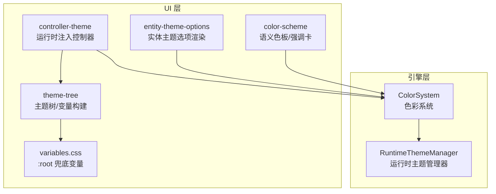
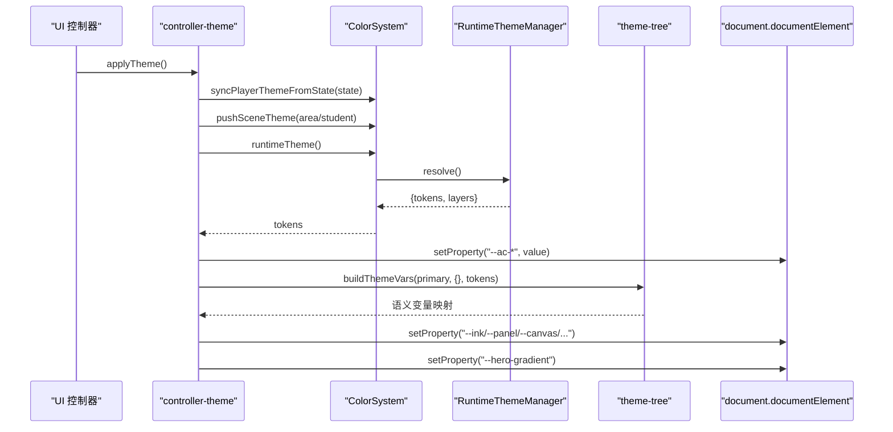
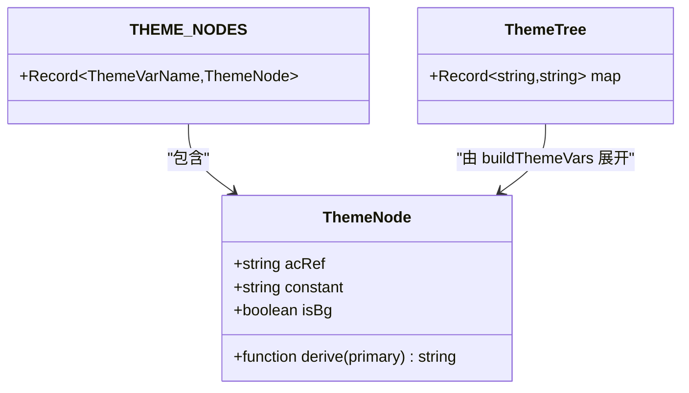
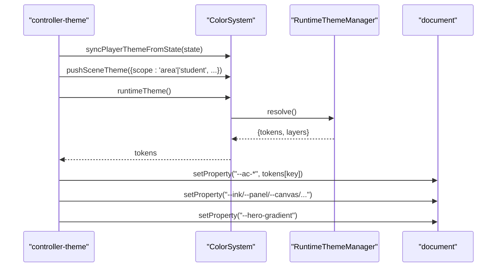
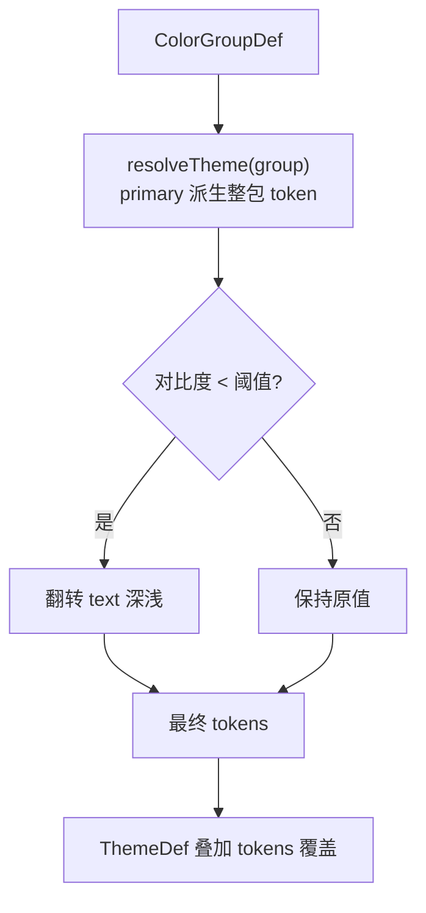
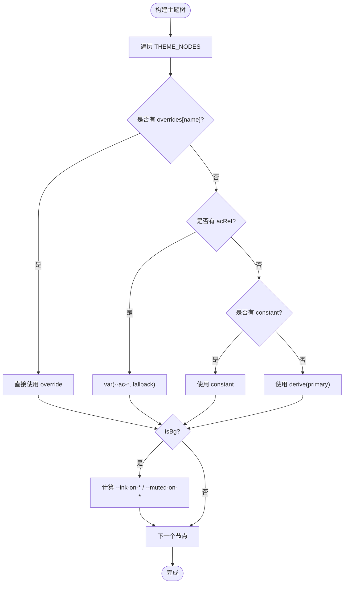
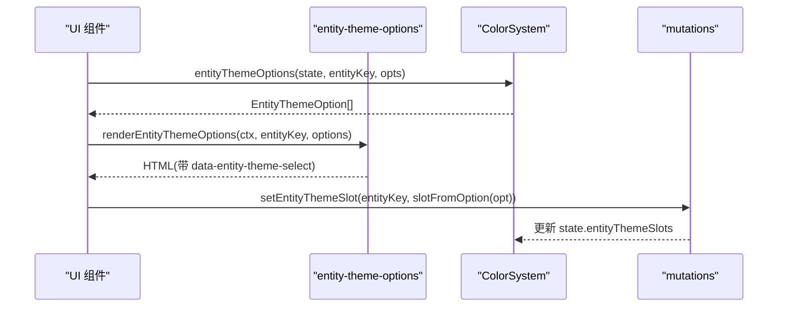
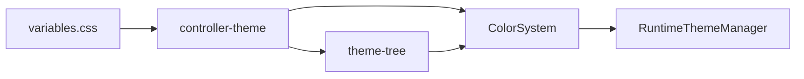

# 主题系统

<cite>
**本文引用的文件**
- [src/engine/system/color-system.ts](file://src/engine/system/color-system.ts)
- [src/engine/core/theme-runtime.ts](file://src/engine/core/theme-runtime.ts)
- [src/ui/theme-tree.ts](file://src/ui/theme-tree.ts)
- [src/ui/controller-theme.ts](file://src/ui/controller-theme.ts)
- [src/ui/color-scheme.ts](file://src/ui/color-scheme.ts)
- [src/ui/components/entity-theme-options.ts](file://src/ui/components/entity-theme-options.ts)
- [src/ui/css/variables.css](file://src/ui/css/variables.css)
- [src/ui/css/entity-theme.css](file://src/ui/css/entity-theme.css)
- [src/ui/css/theme-panel.css](file://src/ui/css/theme-panel.css)
- [tests/engine/theme-tree.test.ts](file://tests/engine/theme-tree.test.ts)
- [tests/ui/theme-tree.test.ts](file://tests/ui/theme-tree.test.ts)
- [tests/engine/entity-theme.test.ts](file://tests/engine/entity-theme.test.ts)
</cite>

## 目录
1. [简介](#简介)
2. [项目结构](#项目结构)
3. [核心组件](#核心组件)
4. [架构总览](#架构总览)
5. [详细组件分析](#详细组件分析)
6. [依赖关系分析](#依赖关系分析)
7. [性能考量](#性能考量)
8. [故障排查指南](#故障排查指南)
9. [结论](#结论)
10. [附录](#附录)

## 简介
本技术文档围绕 ACProgram 的主题系统，系统性阐述其设计原理与实现细节，包括：
- CSS 变量系统与运行时主题切换机制
- ColorScheme 颜色方案管理（预设、动态配色、继承）
- ThemeTree 主题树的组织与优先级规则
- EntityThemeOptions 实体主题选项（角色、区域等实体的个性化设置）
- 主题定制指南与开发工具使用建议

目标是让读者在不深入源码的情况下也能理解并扩展主题能力。

## 项目结构
主题系统横跨引擎层与 UI 层，职责清晰分层：
- 引擎层：负责色彩组解析、主题派生、运行时多层叠加与状态同步
- UI 层：负责将运行时主题映射为 CSS 变量、渲染主题面板与实体主题选择器



图表来源
- [src/engine/system/color-system.ts:207-279](file://src/engine/system/color-system.ts#L207-L279)
- [src/engine/core/theme-runtime.ts:56-199](file://src/engine/core/theme-runtime.ts#L56-L199)
- [src/ui/theme-tree.ts:117-216](file://src/ui/theme-tree.ts#L117-L216)
- [src/ui/controller-theme.ts:95-127](file://src/ui/controller-theme.ts#L95-L127)
- [src/ui/css/variables.css:11-39](file://src/ui/css/variables.css#L11-L39)
- [src/ui/components/entity-theme-options.ts:20-41](file://src/ui/components/entity-theme-options.ts#L20-L41)
- [src/ui/color-scheme.ts:33-103](file://src/ui/color-scheme.ts#L33-L103)

章节来源
- [src/engine/system/color-system.ts:207-279](file://src/engine/system/color-system.ts#L207-L279)
- [src/engine/core/theme-runtime.ts:56-199](file://src/engine/core/theme-runtime.ts#L56-L199)
- [src/ui/theme-tree.ts:117-216](file://src/ui/theme-tree.ts#L117-L216)
- [src/ui/controller-theme.ts:95-127](file://src/ui/controller-theme.ts#L95-L127)
- [src/ui/css/variables.css:11-39](file://src/ui/css/variables.css#L11-L39)
- [src/ui/components/entity-theme-options.ts:20-41](file://src/ui/components/entity-theme-options.ts#L20-L41)
- [src/ui/color-scheme.ts:33-103](file://src/ui/color-scheme.ts#L33-L103)

## 核心组件
- ColorSystem：统一主题解析入口，封装色彩组解析、运行时主题叠加、实体主题槽与解锁流程
- RuntimeThemeManager：实现 L1 临时演出 > L2 场景（area/student）> L3 玩家（player）的分层合并，支持自定义优先级
- theme-tree：将运行时 token 展开为 CSS 变量映射，提供背景明暗判定、可阅读文本色、hero 渐变等
- controller-theme：在渲染周期中清理旧变量、同步场景层、注入 --ac-* 与语义变量
- color-scheme：硬编码的语义色注册表与强调卡调色板生成
- entity-theme-options：将 Engine 的 EntityThemeOption 渲染为可交互的主题选择按钮

章节来源
- [src/engine/system/color-system.ts:207-559](file://src/engine/system/color-system.ts#L207-L559)
- [src/engine/core/theme-runtime.ts:56-199](file://src/engine/core/theme-runtime.ts#L56-L199)
- [src/ui/theme-tree.ts:117-216](file://src/ui/theme-tree.ts#L117-L216)
- [src/ui/controller-theme.ts:95-127](file://src/ui/controller-theme.ts#L95-L127)
- [src/ui/color-scheme.ts:33-103](file://src/ui/color-scheme.ts#L33-L103)
- [src/ui/components/entity-theme-options.ts:20-41](file://src/ui/components/entity-theme-options.ts#L20-L41)

## 架构总览
主题系统采用“数据→框架→渲染”三层协作：
- 数据层：ColorGroupDef/ThemeDef/ThemeDesignDef 定义主题来源
- 框架层：RuntimeThemeManager 按优先级合并各层 token；ColorSystem 提供解析门面
- 渲染层：controller-theme 注入 --ac-* 与语义变量；theme-tree 生成背景感知文本色与 hero 渐变



图表来源
- [src/ui/controller-theme.ts:95-127](file://src/ui/controller-theme.ts#L95-L127)
- [src/engine/system/color-system.ts:231-279](file://src/engine/system/color-system.ts#L231-L279)
- [src/engine/core/theme-runtime.ts:162-199](file://src/engine/core/theme-runtime.ts#L162-L199)
- [src/ui/theme-tree.ts:117-160](file://src/ui/theme-tree.ts#L117-L160)

## 详细组件分析

### ColorScheme 颜色方案管理
- 语义色注册表：集中维护 primary/accent/npc/player/danger/success/warning/muted/purple 等固定语义色，避免数据包通过 extra 注入任意颜色值
- 强调卡调色板：基于单一 accent 色确定性派生卡片整组视觉 token（--card-*），不引用任何主题变量，保证强调卡视觉自洽且不受全局主题影响
- 卡片主题钩子：根据语义角色输出内联 style 属性串，未强调时返回空串以走全局默认

```mermaid
flowchart TD
Start(["输入 scheme"]) --> Resolve["resolveColorScheme(scheme)"]
Resolve --> IsPrimary{"是否主色?"}
IsPrimary --> |是| ReturnEmpty["返回 ''无强调"]
IsPrimary --> |否| Palette["accentPalette(accent) 派生 --card-*"]
Palette --> ReturnStyle["返回 style=\"--card-*\" 字符串"]
```

图表来源
- [src/ui/color-scheme.ts:33-103](file://src/ui/color-scheme.ts#L33-L103)

章节来源
- [src/ui/color-scheme.ts:33-103](file://src/ui/color-scheme.ts#L33-L103)

### ThemeTree 主题树与 CSS 变量系统
- 节点模型：每个节点可声明 acRef（对齐引擎强制层 --ac-*）、derive（自动衍生）、constant（固定语义色）、isBg（背景节点，额外生成 --ink-on-* 与 --muted-on-*）
- 变量构建：buildThemeVars 将主题树展开为一维 CSS 变量映射，优先级为 overrides > acRef > constant/derive；传入真实 tokens 使背景明暗判定更准确
- 背景明暗判定：使用 WCAG 相对亮度近似计算，确保中等饱和彩色气泡也能正确反色；对背景节点生成可读文本色与弱化字色
- 快速映射：buildThemeTree 透传 --ac-* 并附加 --hero-gradient；applyThemeTree/clearThemeTree 支持作用域化应用与清理；themeTreeToInlineStyle 可直接填充样式



图表来源
- [src/ui/theme-tree.ts:85-115](file://src/ui/theme-tree.ts#L85-L115)
- [src/ui/theme-tree.ts:117-216](file://src/ui/theme-tree.ts#L117-L216)

章节来源
- [src/ui/theme-tree.ts:117-216](file://src/ui/theme-tree.ts#L117-L216)
- [tests/ui/theme-tree.test.ts:20-183](file://tests/ui/theme-tree.test.ts#L20-L183)

### 运行时主题切换机制
- 层级模型：L1 临时演出（ephemeral）> L2 场景（area/student）> L3 玩家（player）；玩家可自定义 player/area/student 的相对顺序
- 场景同步：controller-theme 在进入/离开 Area 或对话学生时 push/pop 场景层，并清理剧情临时演出层
- 变量注入：先注入 --ac-*（引擎强制层），再注入语义变量（--ink/--panel/--canvas 等），最后注入 --hero-gradient
- 回退策略：无任何层时移除覆盖，回退到 :root 兜底变量



图表来源
- [src/ui/controller-theme.ts:37-127](file://src/ui/controller-theme.ts#L37-L127)
- [src/engine/core/theme-runtime.ts:162-199](file://src/engine/core/theme-runtime.ts#L162-L199)

章节来源
- [src/ui/controller-theme.ts:37-127](file://src/ui/controller-theme.ts#L37-L127)
- [src/engine/core/theme-runtime.ts:56-199](file://src/engine/core/theme-runtime.ts#L56-L199)

### ColorScheme 颜色方案的预设、动态配色与继承
- 预设主题：ColorGroupDef 定义 slots（含 role='primary'）与可选 theme 覆盖；resolveTheme 从 primary 派生整包 token，并在对比度不足时自动翻转深浅
- 动态配色：ThemeLayer.tokens 可在 groupId 基底上局部覆盖；setTheme effect 支持 area/student 范围写入实体主题槽或推入临时演出层
- 继承关系：ThemeDef = 引用 ColorGroup 打底 + tokens 局部覆盖；themeContributionFromThemeDef 提供统一解析路径



图表来源
- [src/engine/system/color-system.ts:125-177](file://src/engine/system/color-system.ts#L125-L177)
- [src/engine/system/color-system.ts:191-203](file://src/engine/system/color-system.ts#L191-L203)

章节来源
- [src/engine/system/color-system.ts:125-177](file://src/engine/system/color-system.ts#L125-L177)
- [src/engine/system/color-system.ts:191-203](file://src/engine/system/color-system.ts#L191-L203)
- [tests/engine/theme-tree.test.ts:13-62](file://tests/engine/theme-tree.test.ts#L13-L62)

### ThemeTree 主题树的组织结构、条件应用与优先级
- 组织结构：THEME_NODES 定义语义节点及其行为；buildThemeVars 展开为 CSS 变量映射；buildThemeTree 附加 --ac-* 与 --hero-gradient
- 条件应用：通过 RuntimeThemeManager 的场景栈与临时演出层控制何时生效；controller-theme 在渲染周期同步场景层
- 优先级规则：overrides > acRef > constant/derive；运行时层优先级 ephemeral > scene > player（可配置）



图表来源
- [src/ui/theme-tree.ts:117-160](file://src/ui/theme-tree.ts#L117-L160)
- [src/engine/core/theme-runtime.ts:162-199](file://src/engine/core/theme-runtime.ts#L162-L199)

章节来源
- [src/ui/theme-tree.ts:117-160](file://src/ui/theme-tree.ts#L117-L160)
- [src/engine/core/theme-runtime.ts:162-199](file://src/engine/core/theme-runtime.ts#L162-L199)

### EntityThemeOptions 实体主题选项的实现
- 选项来源：default（声明默认）、equipment（当前装备主题）、design（已解锁设计）、custom（玩家自定义）
- 渲染逻辑：renderEntityThemeOptions 将选项渲染为单选按钮，携带 data-entity-theme-select 载荷供控制器处理
- 状态同步：slotFromOption 将 UI 选项转换为实体主题槽；ColorSystem.entityThemeOptions 聚合可用选项并标记 active/owned



图表来源
- [src/ui/components/entity-theme-options.ts:20-41](file://src/ui/components/entity-theme-options.ts#L20-L41)
- [src/engine/system/color-system.ts:387-446](file://src/engine/system/color-system.ts#L387-L446)

章节来源
- [src/ui/components/entity-theme-options.ts:20-41](file://src/ui/components/entity-theme-options.ts#L20-L41)
- [src/engine/system/color-system.ts:387-446](file://src/engine/system/color-system.ts#L387-L446)
- [tests/engine/entity-theme.test.ts:123-139](file://tests/engine/entity-theme.test.ts#L123-L139)

### 主题定制指南与开发工具使用
- 新增/修改主题：优先通过 ColorGroupDef 定义 primary 与 theme 覆盖；如需局部覆盖，使用 ThemeDef.tokens
- 运行时切换：通过 ColorSystem.pushSceneTheme/pushEphemeralTheme 压入场景或临时演出层；controller-theme 会在渲染周期注入变量
- 预览与调试：使用 theme-tree 的快速映射函数（buildThemeTree/themeTreeFromGroup/themeTreeFromThemeDef）生成完整变量映射；测试用例覆盖主要分支
- 强调卡定制：使用 color-scheme.cardAccent 注入 --card-* 以实现独立于主题的强调卡视觉

章节来源
- [src/engine/system/color-system.ts:191-203](file://src/engine/system/color-system.ts#L191-L203)
- [src/ui/theme-tree.ts:206-251](file://src/ui/theme-tree.ts#L206-L251)
- [tests/ui/theme-tree.test.ts:201-272](file://tests/ui/theme-tree.test.ts#L201-L272)
- [src/ui/color-scheme.ts:99-103](file://src/ui/color-scheme.ts#L99-L103)

## 依赖关系分析
- ColorSystem 依赖 RuntimeThemeManager 进行分层合并，并通过 registry 查询 ColorGroupDef/ThemeDesignDef
- controller-theme 依赖 ColorSystem 获取运行时主题，并依赖 theme-tree 构建语义变量
- theme-tree 依赖 color-system 的工具函数（hexToHsl、resolveTheme、themeContributionFromThemeDef）
- UI 样式依赖 variables.css 的 :root 兜底变量，运行时由 controller-theme 覆盖



图表来源
- [src/engine/system/color-system.ts:207-279](file://src/engine/system/color-system.ts#L207-L279)
- [src/engine/core/theme-runtime.ts:56-199](file://src/engine/core/theme-runtime.ts#L56-L199)
- [src/ui/controller-theme.ts:95-127](file://src/ui/controller-theme.ts#L95-L127)
- [src/ui/theme-tree.ts:117-216](file://src/ui/theme-tree.ts#L117-L216)
- [src/ui/css/variables.css:11-39](file://src/ui/css/variables.css#L11-L39)

章节来源
- [src/engine/system/color-system.ts:207-279](file://src/engine/system/color-system.ts#L207-L279)
- [src/engine/core/theme-runtime.ts:56-199](file://src/engine/core/theme-runtime.ts#L56-L199)
- [src/ui/controller-theme.ts:95-127](file://src/ui/controller-theme.ts#L95-L127)
- [src/ui/theme-tree.ts:117-216](file://src/ui/theme-tree.ts#L117-L216)
- [src/ui/css/variables.css:11-39](file://src/ui/css/variables.css#L11-L39)

## 性能考量
- 变量注入批量操作：controller-theme 在单次渲染中清理并批量设置 CSS 变量，减少重排
- 背景明暗判定静态化：theme-tree 使用 JS 计算 --ink-on-* 并落为静态色值，避免浏览器运行时对比度计算的不稳定
- 主题合并高效：RuntimeThemeManager 按 scope 去重后按配置顺序合并，避免重复解析
- 强调卡自洽：color-scheme 的 --card-* 不引用主题变量，降低主题变化时的级联更新成本

[本节为通用指导，无需特定文件来源]

## 故障排查指南
- 主题未生效：检查 controller-theme.applyTheme 是否被调用；确认 ColorSystem.syncPlayerThemeFromState 与 pushSceneTheme 是否正确执行
- 文字不可读：确认背景节点是否标记 isBg；检查 buildThemeVars 传入的真实 tokens 是否正确；验证 --ink-on-* 是否被覆盖
- 强调卡异常：确认 cardAccent 返回值是否为空串（主色时无强调）；检查 --card-* 是否被其他样式覆盖
- 实体主题选项无效：检查 slotFromOption 转换是否正确；确认 mutations.setEntityThemeSlot 是否成功更新 state

章节来源
- [src/ui/controller-theme.ts:95-127](file://src/ui/controller-theme.ts#L95-L127)
- [src/ui/theme-tree.ts:117-160](file://src/ui/theme-tree.ts#L117-L160)
- [src/ui/color-scheme.ts:99-103](file://src/ui/color-scheme.ts#L99-L103)
- [src/ui/components/entity-theme-options.ts:20-41](file://src/ui/components/entity-theme-options.ts#L20-L41)

## 结论
ACProgram 的主题系统通过清晰的职责分层与严格的优先级规则，实现了灵活且稳定的主题能力：
- 引擎层负责主题解析与运行时叠加，UI 层负责变量注入与渲染
- 主题树与颜色方案解耦，既支持预设主题，也支持动态覆盖与继承
- 实体主题选项为用户提供了个性化的主题定制能力
- 完善的测试与工具函数降低了开发与维护成本

[本节为总结性内容，无需特定文件来源]

## 附录
- 主题浮窗与层级分组：theme-panel.css 定义了主题设置浮窗与层级排序的样式
- 实体主题样式：entity-theme.css 定义了实体主题来源选择的交互样式

章节来源
- [src/ui/css/theme-panel.css:7-181](file://src/ui/css/theme-panel.css#L7-L181)
- [src/ui/css/entity-theme.css:7-45](file://src/ui/css/entity-theme.css#L7-L45)