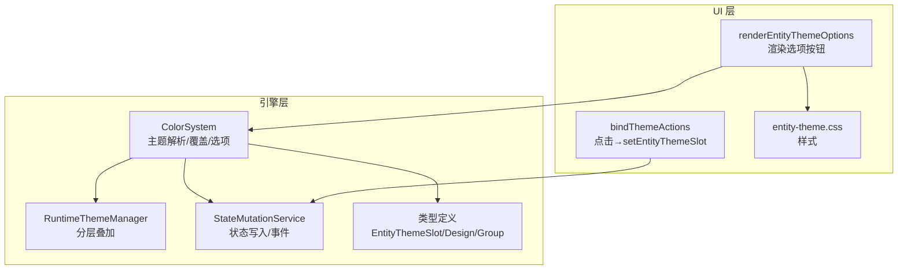
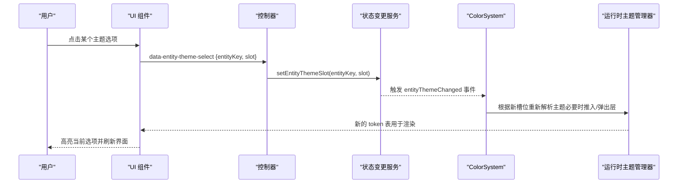
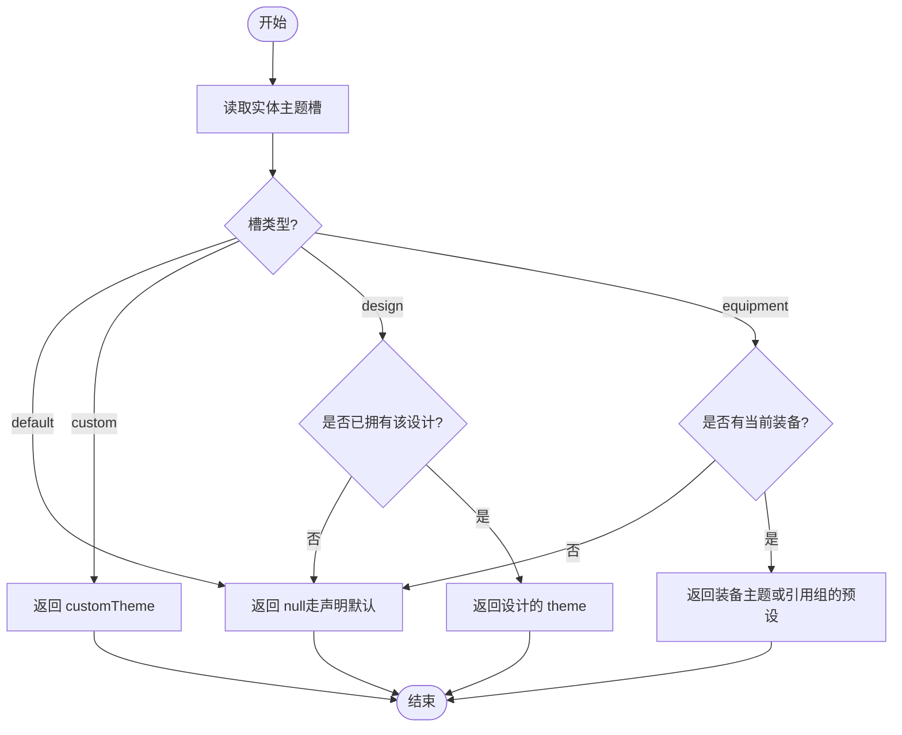
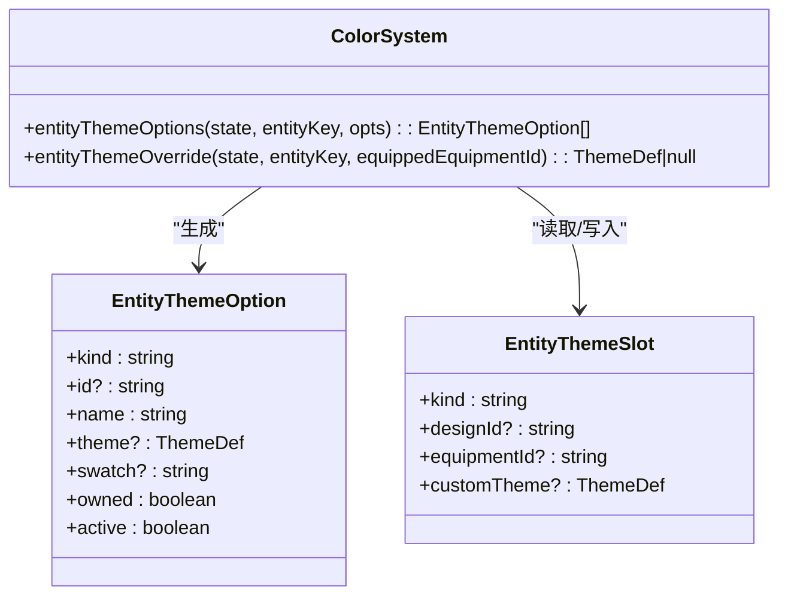
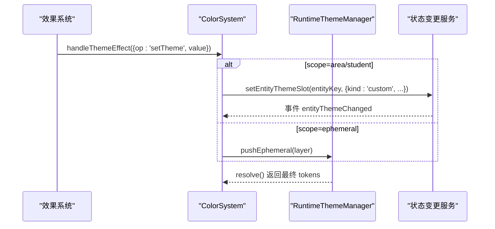
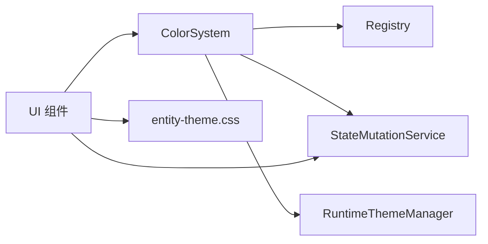

# 实体主题选项

<cite>
**本文引用的文件**
- [color-system.ts](file://src/engine/system/color-system.ts)
- [theme-runtime.ts](file://src/engine/core/theme-runtime.ts)
- [character.ts](file://src/engine/types/character.ts)
- [state.ts](file://src/engine/types/state.ts)
- [entity-theme-options.ts](file://src/ui/components/entity-theme-options.ts)
- [controller-actions-theme.ts](file://src/ui/controller-actions-theme.ts)
- [entity-theme.css](file://src/ui/css/entity-theme.css)
- [entity-theme.test.ts](file://tests/engine/entity-theme.test.ts)
</cite>

## 目录
1. [简介](#简介)
2. [项目结构](#项目结构)
3. [核心组件](#核心组件)
4. [架构总览](#架构总览)
5. [详细组件分析](#详细组件分析)
6. [依赖关系分析](#依赖关系分析)
7. [性能考虑](#性能考虑)
8. [故障排查指南](#故障排查指南)
9. [结论](#结论)
10. [附录](#附录)

## 简介
本技术文档围绕 ACProgram 的“实体主题选项系统”展开，聚焦于角色、区域等实体的个性化主题设置机制。内容涵盖：
- EntityThemeOptions 的设计理念与数据结构
- 默认主题、自定义主题、装备主题的优先级规则
- 实体主题与游戏状态的绑定（实时同步、持久化、冲突解决）
- 扩展接口（为新实体类型添加主题支持）
- 最佳实践与常见问题解决方案

## 项目结构
实体主题选项系统横跨引擎层与 UI 层：
- 引擎层负责主题解析、运行时叠加、状态变更与解锁逻辑
- UI 层负责渲染选项、用户交互与状态落库
- 类型定义集中描述实体主题槽、配色设计、色彩组等核心数据模型

图表来源
- [color-system.ts:207-446](file://src/engine/system/color-system.ts#L207-L446)
- [theme-runtime.ts:56-199](file://src/engine/core/theme-runtime.ts#L56-L199)
- [character.ts:171-215](file://src/engine/types/character.ts#L171-L215)
- [entity-theme-options.ts:20-41](file://src/ui/components/entity-theme-options.ts#LL20-L41)
- [controller-actions-theme.ts:70-83](file://src/ui/controller-actions-theme.ts#L70-L83)

章节来源
- [color-system.ts:207-446](file://src/engine/system/color-system.ts#L207-L446)
- [theme-runtime.ts:56-199](file://src/engine/core/theme-runtime.ts#L56-L199)
- [character.ts:171-215](file://src/engine/types/character.ts#L171-L215)
- [entity-theme-options.ts:20-41](file://src/ui/components/entity-theme-options.ts#L20-L41)
- [controller-actions-theme.ts:70-83](file://src/ui/controller-actions-theme.ts#L70-L83)

## 核心组件
- ColorSystem：主题解析、实体主题覆盖计算、可用主题选项生成、设计解锁、临时演出层管理
- RuntimeThemeManager：运行时主题分层叠加（玩家/场景/临时演出），可配置优先级顺序
- StateMutationService：主题槽写入、设计解锁入库存、事件广播
- 类型定义：EntityThemeSlot、ThemeDesignDef、ColorGroupDef 等
- UI 组件：renderEntityThemeOptions 渲染选项；bindThemeActions 处理选择并写入状态

章节来源
- [color-system.ts:90-446](file://src/engine/system/color-system.ts#L90-L446)
- [theme-runtime.ts:23-199](file://src/engine/core/theme-runtime.ts#L23-L199)
- [state-mutation-service.ts:294-319](file://src/engine/system/state-mutation-service.ts#L294-L319)
- [character.ts:171-338](file://src/engine/types/character.ts#L171-L338)
- [entity-theme-options.ts:1-41](file://src/ui/components/entity-theme-options.ts#L1-L41)
- [controller-actions-theme.ts:10-83](file://src/ui/controller-actions-theme.ts#L10-L83)

## 架构总览
实体主题系统通过“主题槽 + 运行时层”实现解耦：
- 主题槽（EntityThemeSlot）记录某实体（area:<id>/variant:<id>）的主题来源（默认/装备/设计/自定义）
- 运行时层（player/area/student/ephemeral）按优先级合并 token，最终决定显示主题
- UI 提供选项列表，用户选择后写入主题槽，引擎层即时生效并可持久化

图表来源
- [entity-theme-options.ts:20-41](file://src/ui/components/entity-theme-options.ts#L20-L41)
- [controller-actions-theme.ts:70-83](file://src/ui/controller-actions-theme.ts#L70-L83)
- [state-mutation-service.ts:305-319](file://src/engine/system/state-mutation-service.ts#L305-L319)
- [color-system.ts:364-446](file://src/engine/system/color-system.ts#L364-L446)
- [theme-runtime.ts:162-199](file://src/engine/core/theme-runtime.ts#L162-L199)

## 详细组件分析

### 实体主题槽与优先级规则
- 主题槽种类：default/equipment/design/custom
- 优先级（由低到高）：
  - default：无覆盖，回退到声明默认（Area/Variant/色组）
  - equipment：跟随当前已装备的装备主题（若未装备则无效）
  - design：已解锁的设计主题
  - custom：剧情/Trigger/玩家写入的自定义主题
- 解析函数 entityThemeOverride 返回覆盖的 ThemeDef | null，null 表示走声明默认

图表来源
- [color-system.ts:364-381](file://src/engine/system/color-system.ts#L364-L381)
- [character.ts:171-186](file://src/engine/types/character.ts#L171-L186)

章节来源
- [color-system.ts:364-446](file://src/engine/system/color-system.ts#L364-L446)
- [character.ts:171-215](file://src/engine/types/character.ts#L171-L215)

### 主题选项生成与 UI 渲染
- entityThemeOptions 生成可供 UI 展示的选项列表，包含：
  - 声明默认（若有）
  - 当前装备主题（若有）
  - 目标为该实体的设计（含未解锁项，owned=false）
  - 当前自定义主题（若存在）
- renderEntityThemeOptions 将选项渲染为带缩略色的按钮，未解锁项禁用并显示锁图标
- slotFromOption 将选项转换为可写入的状态槽（null 表示回退默认）

图表来源
- [color-system.ts:90-99](file://src/engine/system/color-system.ts#L90-L99)
- [color-system.ts:387-446](file://src/engine/system/color-system.ts#L387-L446)
- [character.ts:171-186](file://src/engine/types/character.ts#L171-L186)

章节来源
- [color-system.ts:387-446](file://src/engine/system/color-system.ts#L387-L446)
- [entity-theme-options.ts:7-41](file://src/ui/components/entity-theme-options.ts#L7-L41)
- [entity-theme.css:6-45](file://src/ui/css/entity-theme.css#L6-L45)

### 运行时主题叠加与实时同步
- RuntimeThemeManager 维护三层（player/area/student）与临时演出层（ephemeral）
- 玩家可自定义 player/area/student 的相对优先级（setLayerOrder）
- 临时演出层始终最高优先级，适合剧情/特效等短期覆盖
- ColorSystem 在 handleThemeEffect 中根据 scope 决定写入主题槽或推入临时层
- 读档/激活主题后调用 syncPlayerThemeFromState 同步玩家全局主题层

图表来源
- [color-system.ts:287-311](file://src/engine/system/color-system.ts#L287-L311)
- [theme-runtime.ts:113-130](file://src/engine/core/theme-runtime.ts#L113-L130)
- [theme-runtime.ts:162-199](file://src/engine/core/theme-runtime.ts#L162-L199)

章节来源
- [color-system.ts:231-311](file://src/engine/system/color-system.ts#L231-L311)
- [theme-runtime.ts:56-199](file://src/engine/core/theme-runtime.ts#L56-L199)

### 状态持久化与冲突解决
- 主题槽与设计拥有状态保存在 PlayerState 的 entityThemeSlots / entityThemeDesignsOwned
- 存档/读档流程会序列化/反序列化这些字段，确保跨会话保留
- 冲突解决策略：
  - 同一实体仅一个主题槽生效，后续写入覆盖前值
  - 设计解锁幂等：重复解锁返回 already
  - 装备主题需“已装备”才有效，否则视为无覆盖
  - 自定义主题优先于设计与装备，但可通过 UI 切换回其他来源

章节来源
- [state.ts:108-116](file://src/engine/types/state.ts#L108-L116)
- [state-mutation-service.ts:294-319](file://src/engine/system/state-mutation-service.ts#L294-L319)
- [entity-theme.test.ts:93-121](file://tests/engine/entity-theme.test.ts#L93-L121)

### 扩展接口：为新实体类型添加主题支持
- 实体键格式：entityKeyOf(kind, id)，目前支持 area 与 variant
- 为新实体类型添加主题支持步骤：
  1. 在类型定义中扩展 kind 或新增实体键生成函数
  2. 在 ColorSystem.entityThemeOptions 中纳入该实体的声明默认/设计/装备来源
  3. 在 UI 组件中传入正确的 entityKey，渲染对应选项
  4. 在 effect 系统中支持对该实体的 setTheme 操作（如需）
  5. 测试覆盖：使用 tests/engine/entity-theme.test.ts 的模式验证优先级与解锁行为

章节来源
- [color-system.ts:57-60](file://src/engine/system/color-system.ts#L57-L60)
- [color-system.ts:387-446](file://src/engine/system/color-system.ts#L387-L446)
- [entity-theme-options.ts:20-41](file://src/ui/components/entity-theme-options.ts#L20-L41)
- [entity-theme.test.ts:20-91](file://tests/engine/entity-theme.test.ts#L20-L91)

## 依赖关系分析
- ColorSystem 依赖：
  - Registry：获取 ColorGroupDef、ThemeDesignDef、ColorEquipmentDef
  - StateMutationService：写入主题槽、解锁设计、广播事件
  - RuntimeThemeManager：运行时主题叠加与查询
- UI 依赖：
  - ColorSystem：生成选项、解析覆盖
  - StateMutationService：写入主题槽
  - CSS：渲染样式

图表来源
- [color-system.ts:207-227](file://src/engine/system/color-system.ts#L207-L227)
- [entity-theme-options.ts:1-41](file://src/ui/components/entity-theme-options.ts#L1-L41)
- [controller-actions-theme.ts:70-83](file://src/ui/controller-actions-theme.ts#L70-L83)

章节来源
- [color-system.ts:207-227](file://src/engine/system/color-system.ts#L207-L227)
- [entity-theme-options.ts:1-41](file://src/ui/components/entity-theme-options.ts#L1-L41)
- [controller-actions-theme.ts:70-83](file://src/ui/controller-actions-theme.ts#L70-L83)

## 性能考虑
- 主题解析为纯函数（deriveThemeTokens、resolveTheme），输入确定输出确定，便于缓存与复用
- 运行时层合并仅在状态变化时触发，避免每帧重算
- 选项生成按需进行，UI 仅渲染当前实体相关选项
- 对比度自动翻转基于 HSL 明度阈值，计算开销小且确定性高

[本节为通用性能讨论，不直接分析具体文件]

## 故障排查指南
- 问题：选择主题后无变化
  - 检查是否正确传入 entityKey（area:<id>/variant:<id>）
  - 确认所选设计已解锁（owned=true）
  - 查看控制台 toast 提示（如“无效的主题选择”）
- 问题：设计无法解锁
  - 检查 unlock 条件是否满足（flag 等）
  - 确认 tryUnlockDesign 返回值（false/already/unlocked）
- 问题：装备主题未生效
  - 确认实体当前已装备对应 ColorEquipmentDef
  - 若装备未声明专属主题，将回退为其引用组的预设

章节来源
- [controller-actions-theme.ts:70-83](file://src/ui/controller-actions-theme.ts#L70-L83)
- [entity-theme.test.ts:93-121](file://tests/engine/entity-theme.test.ts#L93-L121)
- [color-system.ts:364-381](file://src/engine/system/color-system.ts#L364-L381)

## 结论
实体主题选项系统通过“主题槽 + 运行时层”实现了灵活、可扩展的个性化主题机制。其设计清晰分离了声明默认、装备、设计与自定义来源，并通过严格的优先级规则与状态持久化保证了一致性与可恢复性。UI 层提供了直观的选项渲染与交互，配合引擎层的解析与叠加，实现了实时同步与冲突解决。扩展新实体类型只需遵循现有模式即可无缝集成。

[本节为总结性内容，不直接分析具体文件]

## 附录
- 最佳实践
  - 为每个实体明确声明默认主题，避免歧义
  - 使用设计（design）作为可解锁的命名主题，便于收集与展示
  - 谨慎使用自定义主题（custom），仅在剧情/Trigger 需要时写入
  - 通过 setLayerOrder 调整 player/area/student 的相对优先级，满足不同玩法需求
- 常见问题
  - 未解锁设计显示为禁用态，需先满足解锁条件
  - 装备主题需“已装备”才有效，否则视为无覆盖
  - 自定义主题优先于设计与装备，但可通过 UI 切换回其他来源

[本节为通用指导，不直接分析具体文件]