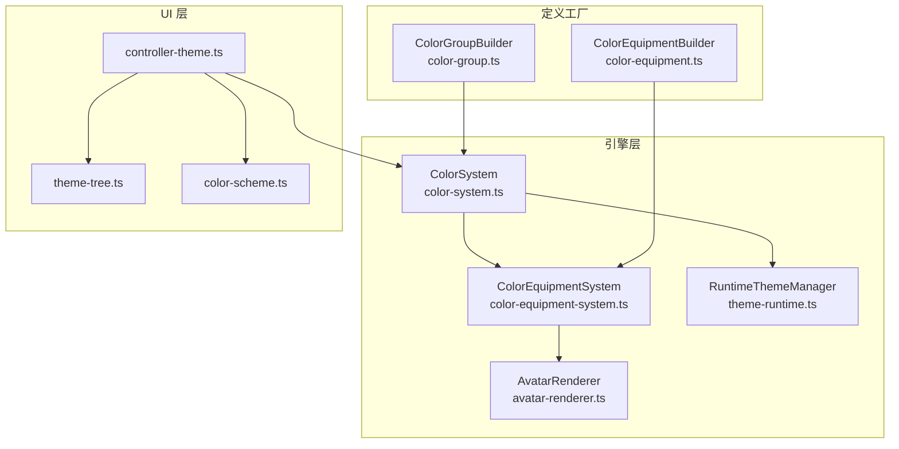
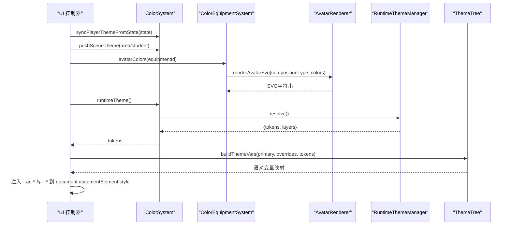
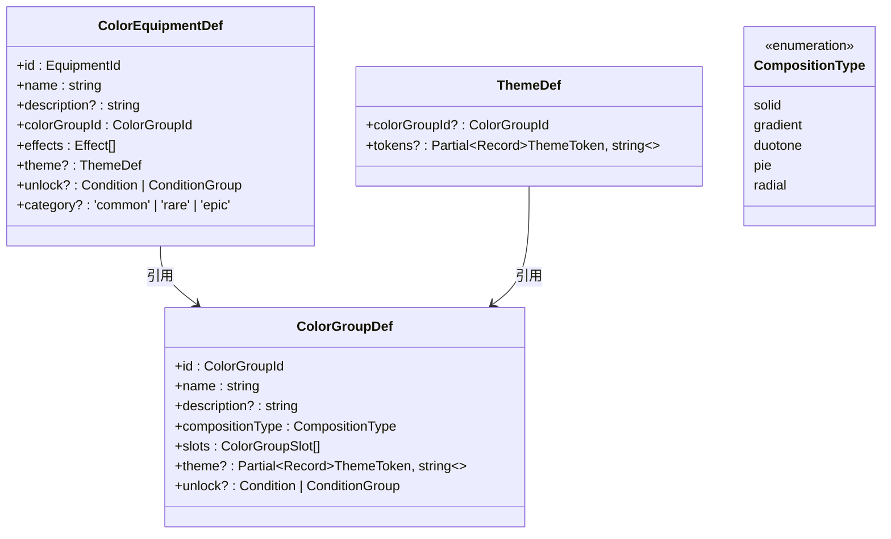
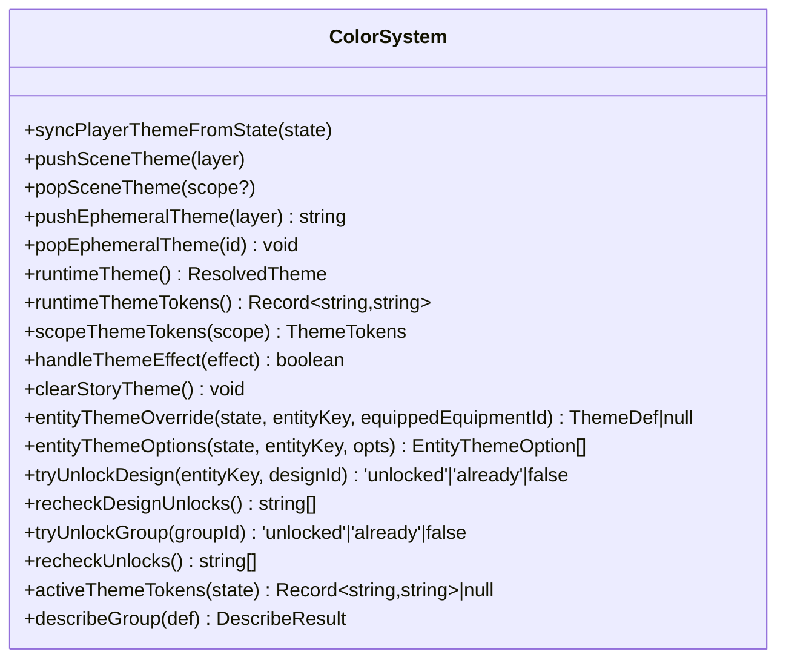
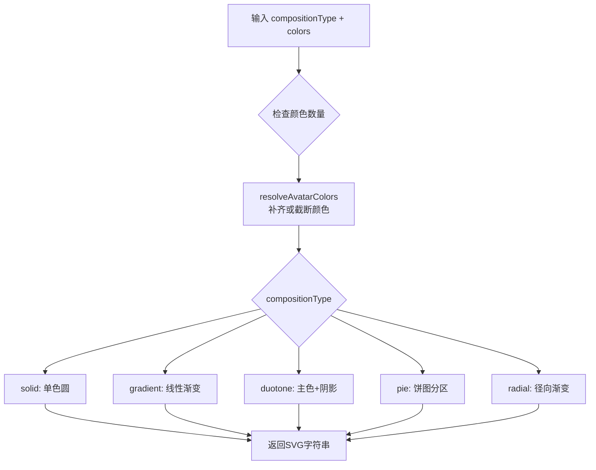
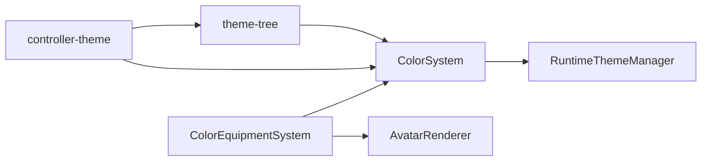

# 颜色方案系统

<cite>
**本文引用的文件**
- [src/engine/system/color-system.ts](file://src/engine/system/color-system.ts)
- [src/engine/system/color-equipment-system.ts](file://src/engine/system/color-equipment-system.ts)
- [src/engine/def-factory/color-group.ts](file://src/engine/def-factory/color-group.ts)
- [src/engine/def-factory/color-equipment.ts](file://src/engine/def-factory/color-equipment.ts)
- [src/engine/types/character.ts](file://src/engine/types/character.ts)
- [src/engine/core/theme-runtime.ts](file://src/engine/core/theme-runtime.ts)
- [src/ui/controller-theme.ts](file://src/ui/controller-theme.ts)
- [src/ui/theme-tree.ts](file://src/ui/theme-tree.ts)
- [src/ui/color-scheme.ts](file://src/ui/color-scheme.ts)
- [src/engine/system/avatar-renderer.ts](file://src/engine/system/avatar-renderer.ts)
- [tests/engine/color-system.test.ts](file://tests/engine/color-system.test.ts)
- [tests/engine/color-equipment-system.test.ts](file://tests/engine/color-equipment-system.test.ts)
</cite>

## 更新摘要
**所做更改**
- 完全重构了颜色系统架构，实现了Color/ColorGroup/ColorEquipment三层体系
- 新增了基于装备的配色系统，替代了直接的颜色操作
- 引入了模板化系统支持多种构成类型（solid、gradient、duotone、pie、radial）
- 更新了头像渲染系统以支持新的抽象图案式头像
- 增强了主题继承关系和优先级规则
- 改进了运行时切换逻辑和性能优化策略

## 目录
1. [简介](#简介)
2. [项目结构](#项目结构)
3. [核心组件](#核心组件)
4. [架构总览](#架构总览)
5. [详细组件分析](#详细组件分析)
6. [依赖关系分析](#依赖关系分析)
7. [性能考量](#性能考量)
8. [故障排查指南](#故障排查指南)
9. [结论](#结论)
10. [附录：定制与开发工具](#附录定制与开发工具)

## 简介
本技术文档围绕 ACProgram 的全新颜色方案系统，系统性阐述 Color/ColorGroup/ColorEquipment 三层架构的设计原理、主题层次与优先级、运行时切换流程、以及可定制性与开发工具。内容覆盖：
- 三层架构设计：Color（颜色原子）、ColorGroup（头像模板+主题预设）、ColorEquipment（收集品+效用）
- 模板化头像系统：支持多种构成类型的抽象圆形头像渲染
- 运行时分层叠加机制（玩家全局层、区域/学生场景层、临时演出层）
- 颜色变量注入与 UI 语义映射
- 对比度保护与自动深浅底判定
- 解锁编排与级联解锁
- 如何创建新配色方案与扩展现有主题

## 项目结构
颜色方案系统由"引擎层"和"UI 层"共同组成，采用全新的三层架构：
- 引擎层负责主题解析、运行时分层、实体主题槽、解锁编排等
- UI 层负责将运行时主题映射为 CSS 变量并注入页面，同时提供强调卡色板等纯前端能力
- 新增头像渲染系统，支持多种抽象图案式头像

**图表来源**
- [src/engine/system/color-system.ts:207-276](file://src/engine/system/color-system.ts#L207-L276)
- [src/engine/system/color-equipment-system.ts:28-89](file://src/engine/system/color-equipment-system.ts#L28-L89)
- [src/engine/system/avatar-renderer.ts:55-94](file://src/engine/system/avatar-renderer.ts#L55-L94)
- [src/engine/def-factory/color-group.ts:19-84](file://src/engine/def-factory/color-group.ts#L19-L84)
- [src/engine/def-factory/color-equipment.ts:15-71](file://src/engine/def-factory/color-equipment.ts#L15-L71)

**章节来源**
- [src/engine/system/color-system.ts:207-276](file://src/engine/system/color-system.ts#L207-L276)
- [src/engine/system/color-equipment-system.ts:28-89](file://src/engine/system/color-equipment-system.ts#L28-L89)
- [src/engine/system/avatar-renderer.ts:55-94](file://src/engine/system/avatar-renderer.ts#L55-L94)
- [src/engine/def-factory/color-group.ts:19-84](file://src/engine/def-factory/color-group.ts#L19-L84)
- [src/engine/def-factory/color-equipment.ts:15-71](file://src/engine/def-factory/color-equipment.ts#L15-L71)

## 核心组件
- **三层架构系统**
  - ColorGroupDef：色彩组定义，包含compositionType、slots、theme预设
  - ColorEquipmentDef：色彩装备定义，捆绑ColorGroup和effects
  - ThemeDef：声明式主题，引用ColorGroup打底+局部覆盖
- **色彩系统与主题解析**
  - 从 ColorGroupDef 解析 token 表，支持显式覆盖与 HSL 派生，自动对比度保护
  - 通过 RuntimeThemeManager 维护三层主题栈并合并最终 tokens
- **运行时主题管理器**
  - 维护 player/area/student 三层与 ephemeral 临时层，支持自定义优先级
  - 提供 push/pop/resolve/resolveScope 等接口
- **头像渲染系统**
  - 支持多种构成类型：solid（单色）、gradient（渐变）、duotone（双色阶调）、pie（饼图）、radial（径向）
  - 根据compositionType生成相应的SVG头像
- **UI 控制器与主题树**
  - 同步场景层、清理旧变量、注入 --ac-* 引擎强制层与语义层变量
  - 构建背景明暗感知文本色与横幅渐变
- **强调卡色板**
  - 基于单一 accent 色生成自洽的卡片样式 token 串，不引用主题变量

**章节来源**
- [src/engine/types/character.ts:225-346](file://src/engine/types/character.ts#L225-L346)
- [src/engine/system/color-system.ts:125-177](file://src/engine/system/color-system.ts#L125-L177)
- [src/engine/core/theme-runtime.ts:56-199](file://src/engine/core/theme-runtime.ts#L56-L199)
- [src/engine/system/avatar-renderer.ts:55-94](file://src/engine/system/avatar-renderer.ts#L55-L94)
- [src/ui/controller-theme.ts:95-127](file://src/ui/controller-theme.ts#L95-L127)
- [src/ui/theme-tree.ts:117-160](file://src/ui/theme-tree.ts#L117-L160)
- [src/ui/color-scheme.ts:64-103](file://src/ui/color-scheme.ts#L64-L103)

## 架构总览
颜色方案系统的运行流程如下：
- 数据层：ColorGroupDef/ThemeDef/ThemeDesignDef/ColorEquipmentDef 定义主题来源
- 解析层：ColorSystem.resolveTheme 与 themeContributionFromThemeDef 统一解析路径
- 运行时层：RuntimeThemeManager 维护多层主题栈并按优先级合并
- 渲染层：UI controller 将合并后的 tokens 注入 CSS 变量，并通过 theme-tree 展开语义变量
- 头像层：AvatarRenderer 根据 ColorGroup 的 compositionType 生成抽象圆形头像

**图表来源**
- [src/ui/controller-theme.ts:37-127](file://src/ui/controller-theme.ts#L37-L127)
- [src/engine/system/color-system.ts:231-276](file://src/engine/system/color-system.ts#L231-L276)
- [src/engine/system/color-equipment-system.ts:74-79](file://src/engine/system/color-equipment-system.ts#L74-L79)
- [src/engine/system/avatar-renderer.ts:55-94](file://src/engine/system/avatar-renderer.ts#L55-L94)
- [src/engine/core/theme-runtime.ts:162-199](file://src/engine/core/theme-runtime.ts#L162-L199)
- [src/ui/theme-tree.ts:117-160](file://src/ui/theme-tree.ts#L117-L160)

## 详细组件分析

### 三层架构系统（Color/ColorGroup/ColorEquipment）
职责与关键点：
- **ColorGroupDef**：唯一色彩实体，包含compositionType（头像构成方式）、slots（色位表）、theme（主题预设）
- **ColorEquipmentDef**：核心收集品，捆绑ColorGroup（头像视觉+主题预设）+ effects（数值效用）
- **ThemeDef**：声明式主题，引用ColorGroup打底+可选局部token覆盖
- **CompositionType**：支持solid（单色）、gradient（渐变）、duotone（双色阶调）、pie（饼图）、radial（径向）

**图表来源**
- [src/engine/types/character.ts:225-346](file://src/engine/types/character.ts#L225-L346)

**章节来源**
- [src/engine/types/character.ts:225-346](file://src/engine/types/character.ts#L225-L346)

### 色彩系统（ColorSystem）
职责与关键点：
- 主题解析：deriveThemeTokens 根据 primary 确定性派生全套 token；resolveTheme 支持显式覆盖与对比度保护
- 运行时门面：封装 RuntimeThemeManager，提供 push/pop 场景层、临时演出层、读取当前合并结果
- 实体主题槽：entityThemeOverride 解析 Area/Variant 的主题覆盖来源（默认/装备/设计/自定义）
- 解锁编排：tryUnlockGroup/recheckUnlocks 与 tryUnlockDesign/recheckDesignUnlocks 条件驱动解锁
- 快速映射：themeFromGroup/themeFromThemeDef 供 UI 预览或局部作用域使用

**图表来源**
- [src/engine/system/color-system.ts:207-558](file://src/engine/system/color-system.ts#L207-L558)

**章节来源**
- [src/engine/system/color-system.ts:125-177](file://src/engine/system/color-system.ts#L125-L177)
- [src/engine/system/color-system.ts:231-311](file://src/engine/system/color-system.ts#L231-L311)
- [src/engine/system/color-system.ts:364-446](file://src/engine/system/color-system.ts#L364-L446)
- [src/engine/system/color-system.ts:448-558](file://src/engine/system/color-system.ts#L448-L558)

### 色彩装备系统（ColorEquipmentSystem）
职责与关键点：
- 收集品：ColorEquipmentDef 捆绑 colorGroupId 与 effects
- 库存与解析：ownedEquipments、groupOf、avatarColors
- 解锁编排：tryUnlock 条件校验 → collectEquipment → 级联解锁其引用的 ColorGroup
- 效果聚合：effectsOf 按变体当前装备聚合 Effect 声明
- 头像解析：avatarColorsForGroup 获取 ColorGroup 各 slot 的实际 hex

**章节来源**
- [src/engine/system/color-equipment-system.ts:28-126](file://src/engine/system/color-equipment-system.ts#L28-L126)

### 头像渲染系统（AvatarRenderer）
职责与关键点：
- 多构成类型支持：solid（单色圆）、gradient（线性渐变）、duotone（主色+阴影）、pie（饼图分区）、radial（径向渐变）
- 颜色数量管理：avatarColorCount 确定每种构成类型需要的颜色数
- 颜色补齐：resolveAvatarColors 确保颜色数量满足要求，不足时用占位灰补齐
- SVG生成：renderAvatarSvg 根据compositionType生成相应的SVG字符串

**图表来源**
- [src/engine/system/avatar-renderer.ts:15-94](file://src/engine/system/avatar-renderer.ts#L15-L94)

**章节来源**
- [src/engine/system/avatar-renderer.ts:15-94](file://src/engine/system/avatar-renderer.ts#L15-L94)

### 定义工厂（ColorGroupBuilder / ColorEquipmentBuilder）
职责与关键点：
- **ColorGroupBuilder**：链式构建ColorGroupDef，支持设置compositionType、slots、theme预设、解锁条件
- **ColorEquipmentBuilder**：链式构建ColorEquipmentDef，支持设置colorGroupId、effects、解锁条件、稀有度分类
- 验证机制：build()方法确保必需字段已设置

**章节来源**
- [src/engine/def-factory/color-group.ts:19-84](file://src/engine/def-factory/color-group.ts#L19-L84)
- [src/engine/def-factory/color-equipment.ts:15-71](file://src/engine/def-factory/color-equipment.ts#L15-L71)

### 主题层次与优先级规则
- 层次结构
  - L1 临时演出层（ephemeral）：Talklet/Trigger 推入，帧级或剧情级生命周期，最高优先级
  - L2 场景特色层（area/student）：进入场景压入，离开弹出；同 scope 重推覆盖
  - L3 玩家全局层（player）：state.activeGroupId 常驻基色
- 优先级
  - 默认顺序：player < area < student；可通过 setLayerOrder 自定义
  - 临时演出层不参与排序，始终最高
- 合并策略
  - 以最低层非空层为基底整包 token，后续层逐 key 覆盖
  - groupId 溯源取最底层 groupId（用于主题溯源与预览）

**章节来源**
- [src/engine/core/theme-runtime.ts:23-199](file://src/engine/core/theme-runtime.ts#L23-L199)
- [tests/engine/theme-runtime.test.ts:122-178](file://tests/engine/theme-runtime.test.ts#L122-L178)

### 颜色变量注入与语义映射
- 引擎强制层：--ac-* 直接来自运行时合并后的 tokens
- 语义层：theme-tree 将引擎 token 映射为界面语义变量（ink/panel/canvas/气泡等），并计算背景上文本色（--ink-on-*）
- 背景明暗判定：基于 WCAG 相对亮度近似，确保深底白字、浅底黑字
- 横幅渐变：heroGradient 随主题 primary 动态生成

**章节来源**
- [src/ui/controller-theme.ts:95-127](file://src/ui/controller-theme.ts#L95-L127)
- [src/ui/theme-tree.ts:117-160](file://src/ui/theme-tree.ts#L117-L160)

### 对比度保护与自动深浅底
- 浅色判定阈值：LIGHTNESS_THRESHOLD 决定整套主题走浅底还是深底
- 对比度保护：当 text/bg 对比度不足阈值时，自动翻转 text 深浅以满足可读性
- 测试覆盖：CT-04 验证对比度防呆逻辑

**章节来源**
- [src/engine/system/color-system.ts:101-117](file://src/engine/system/color-system.ts#L101-L117)
- [src/engine/system/color-system.ts:161-177](file://src/engine/system/color-system.ts#L161-L177)
- [tests/engine/color-system.test.ts:113-118](file://tests/engine/color-system.test.ts#L113-L118)

### 运行时切换逻辑（场景栈管理与临时演出）
- 场景栈管理：进入 Area/打开学生对话分别压入 area/student 层；关闭时弹出回退
- 临时演出：setTheme effect 在剧情期间推入 ephemeral 层，剧情结束清除
- 优先级自定义：setLayerOrder 调整 player/area/student 相对顺序

**章节来源**
- [src/engine/core/theme-runtime.ts:93-130](file://src/engine/core/theme-runtime.ts#L93-L130)
- [src/engine/system/color-system.ts:287-311](file://src/engine/system/color-system.ts#L287-L311)
- [tests/engine/theme-runtime.test.ts:62-89](file://tests/engine/theme-runtime.test.ts#L62-L89)

### 解锁编排与级联解锁
- 色彩组解锁：tryUnlockGroup 条件校验 → unlockGroup → 事件触发
- 设计解锁：tryUnlockDesign 条件校验 → unlockEntityDesign → 自动设为该实体当前生效主题
- 装备解锁：tryUnlock 收集装备 → 级联解锁其引用的 ColorGroup
- 级联机制：收集装备后自动解锁其引用的ColorGroup，实现"收集即获得配色"的体验

**章节来源**
- [src/engine/system/color-system.ts:448-518](file://src/engine/system/color-system.ts#L448-L518)
- [src/engine/system/color-equipment-system.ts:91-126](file://src/engine/system/color-equipment-system.ts#L91-L126)
- [tests/engine/color-system.test.ts:145-185](file://tests/engine/color-system.test.ts#L145-L185)

## 依赖关系分析
- ColorSystem 依赖 RuntimeThemeManager 进行运行时分层合并
- ColorEquipmentSystem 与 ColorSystem 协作完成装备收集与级联解锁
- AvatarRenderer 被 ColorEquipmentSystem 调用，用于生成头像SVG
- UI controller-theme 依赖 ColorSystem 获取运行时主题，并依赖 theme-tree 展开语义变量
- theme-tree 依赖 color-system 的解析函数（hexToHsl、resolveTheme、themeContributionFromThemeDef）

**图表来源**
- [src/engine/system/color-system.ts:207-276](file://src/engine/system/color-system.ts#L207-L276)
- [src/engine/system/color-equipment-system.ts:28-89](file://src/engine/system/color-equipment-system.ts#L28-L89)
- [src/engine/system/avatar-renderer.ts:55-94](file://src/engine/system/avatar-renderer.ts#L55-L94)
- [src/ui/controller-theme.ts:37-127](file://src/ui/controller-theme.ts#L37-L127)
- [src/ui/theme-tree.ts:1-12](file://src/ui/theme-tree.ts#L1-L12)

**章节来源**
- [src/engine/system/color-system.ts:207-276](file://src/engine/system/color-system.ts#L207-L276)
- [src/engine/system/color-equipment-system.ts:28-89](file://src/engine/system/color-equipment-system.ts#L28-L89)
- [src/engine/system/avatar-renderer.ts:55-94](file://src/engine/system/avatar-renderer.ts#L55-L94)
- [src/ui/controller-theme.ts:37-127](file://src/ui/controller-theme.ts#L37-L127)
- [src/ui/theme-tree.ts:1-12](file://src/ui/theme-tree.ts#L1-L12)

## 性能考量
- 解析缓存：RuntimeThemeManager 的 resolve 每次合并成本与层数线性相关；建议减少不必要的 push/pop
- 变量注入：applyTheme 会清理并重建所有 --ac-* 与语义变量；应在必要时机调用（如场景切换、主题激活）
- 对比度计算：contrastRatio 与 bgLightness 为轻量计算，但频繁调用仍需注意批量处理
- 强调卡色板：accentPalette 仅在当前 card 渲染时计算，避免全局开销
- 头像渲染：AvatarRenderer 为纯函数，无状态缓存，适合按需调用
- 颜色数量检查：avatarColorCount 为O(1)复杂度，不会成为性能瓶颈

## 故障排查指南
常见问题与定位方法：
- 主题未生效
  - 检查是否已同步 player 层与场景层：syncPlayerThemeFromState 与 pushSceneTheme 是否调用
  - 确认 activeGroupId 已拥有且有效：activeThemeTokens 返回 null 表示无效或未拥有
- 临时演出层残留
  - 剧情结束后应调用 clearStoryTheme 移除 story-ephemeral 层
- 对比度异常
  - 检查 resolveTheme 的对比度保护是否翻转了 text；必要时调整 theme 中的 bg/text
- 层级覆盖不符合预期
  - 检查 setLayerOrder 是否正确；确认同 scope 场景是否重复压入
- 装备解锁未级联
  - 检查 ColorEquipment.tryUnlock 是否成功；确认 groupOf 返回有效 ColorGroup
- 头像显示异常
  - 检查 ColorGroup 的 compositionType 是否与 slots 数量匹配
  - 确认 avatarColors 返回的颜色数组长度满足构成类型要求
- 装备效果未生效
  - 检查 effectsOf 是否正确聚合当前装备的效果声明

**章节来源**
- [src/engine/system/color-system.ts:231-311](file://src/engine/system/color-system.ts#L231-L311)
- [src/engine/core/theme-runtime.ts:93-130](file://src/engine/core/theme-runtime.ts#L93-L130)
- [tests/engine/theme-runtime.test.ts:62-89](file://tests/engine/theme-runtime.test.ts#L62-L89)
- [tests/engine/color-system.test.ts:113-118](file://tests/engine/color-system.test.ts#L113-L118)

## 结论
ACProgram 的全新颜色方案系统通过"Color/ColorGroup/ColorEquipment 三层架构 + 模板化头像 + 运行时分层"实现了灵活、可控且可定制的配色体系。其核心优势包括：
- 三层架构分离：ColorGroup专注头像模板，ColorEquipment捆绑视觉与效用，ThemeDef提供主题覆盖
- 模板化头像系统：支持多种构成类型的抽象圆形头像，增强视觉表现力
- 确定性派生与对比度保护，确保可读性与一致性
- 分层叠加与优先级自定义，满足多场景与演出需求
- 实体主题槽与装备系统，支持区域/学生差异化配色
- UI 语义映射与强调卡色板，兼顾主题一致性与局部自洽
- 级联解锁机制：收集装备即获得对应配色，提升游戏体验

## 附录：定制与开发工具
- 创建新的颜色方案
  - 使用 ColorGroupBuilder 定义 slots（含 primary）、compositionType、theme 覆盖与 unlock 条件
  - 通过 ColorSystem.resolveTheme 获取最终 token 表，用于预览或调试
- 创建色彩装备
  - 使用 ColorEquipmentBuilder 绑定 colorGroupId 与 effects，支持解锁条件和稀有度分类
  - 装备收集后将级联解锁其引用的 ColorGroup
- 扩展现有主题
  - 使用 ThemeDef 的 colorGroupId + tokens 局部覆盖，复用组基底并微调个别 token
- 使用开发工具
  - describeGroup：拆解每个 token 的来源（defined/derived），辅助作者理解派生结果
  - themeTreeFromGroup/themeTreeFromThemeDef：快速生成完整 ThemeTree 快照，便于预览
- 运行时切换
  - 通过 ColorSystem.pushSceneTheme/popSceneTheme 管理场景层
  - 通过 handleThemeEffect 处理 setTheme effect，区分实体主题槽与临时演出层
- 头像定制
  - 选择合适的 compositionType：solid（简单）、gradient（现代）、duotone（立体）、pie（多彩）、radial（柔和）
  - 确保 slots 数量与构成类型匹配，避免渲染异常
- 强调卡定制
  - 使用 cardAccent 与 accentPalette 生成强调卡样式，确保零主题变量依赖

**章节来源**
- [src/engine/def-factory/color-group.ts:19-84](file://src/engine/def-factory/color-group.ts#L19-L84)
- [src/engine/def-factory/color-equipment.ts:15-71](file://src/engine/def-factory/color-equipment.ts#L15-L71)
- [src/engine/system/color-system.ts:531-558](file://src/engine/system/color-system.ts#L531-L558)
- [src/engine/system/avatar-renderer.ts:55-94](file://src/engine/system/avatar-renderer.ts#L55-L94)
- [src/ui/theme-tree.ts:238-251](file://src/ui/theme-tree.ts#L238-L251)
- [src/ui/color-scheme.ts:64-103](file://src/ui/color-scheme.ts#L64-L103)