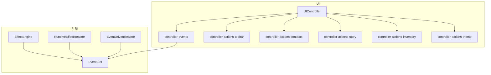
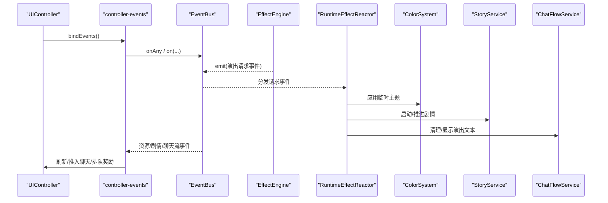
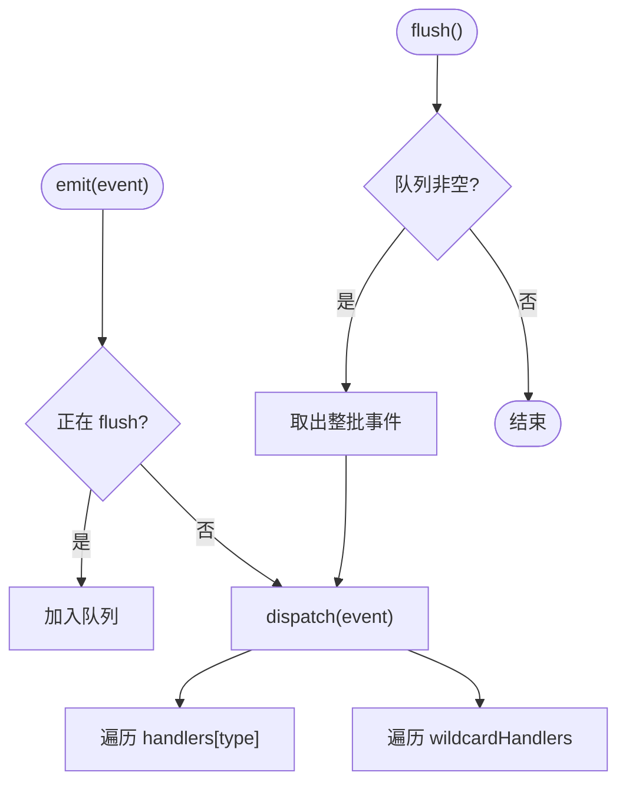
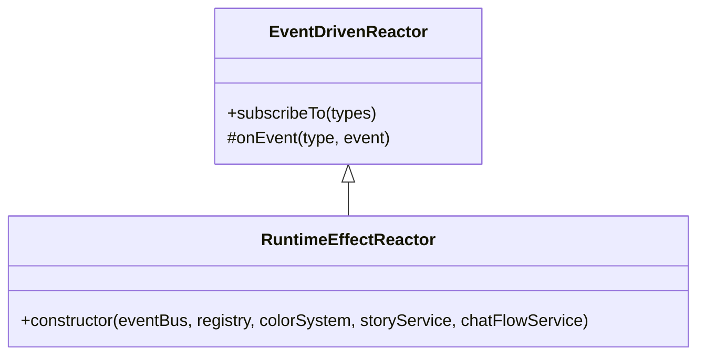
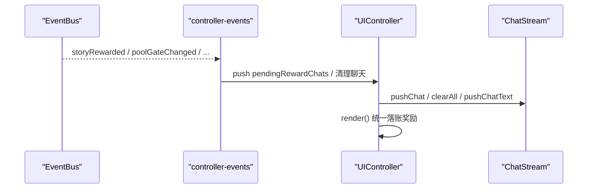
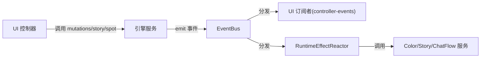
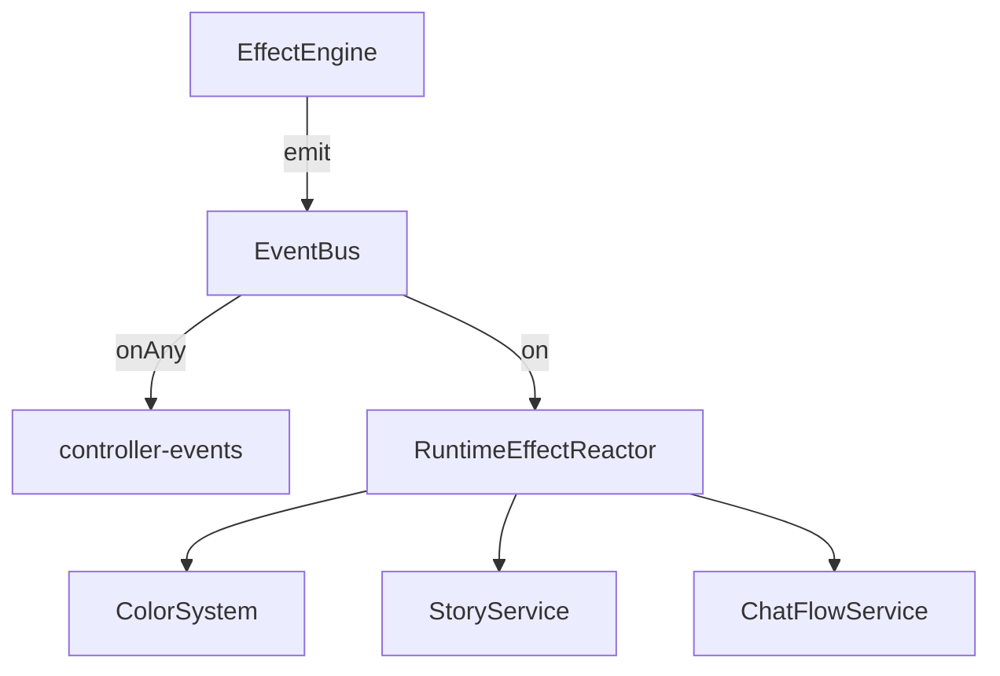

# 事件处理

<cite>
**本文引用的文件**
- [src/engine/core/event-bus.ts](file://src/engine/core/event-bus.ts)
- [src/engine/types/events.ts](file://src/engine/types/events.ts)
- [src/ui/controller-events.ts](file://src/ui/controller-events.ts)
- [src/ui/controller.ts](file://src/ui/controller.ts)
- [src/ui/controller-actions-topbar.ts](file://src/ui/controller-actions-topbar.ts)
- [src/ui/controller-actions-contacts.ts](file://src/ui/controller-actions-contacts.ts)
- [src/ui/controller-actions-story.ts](file://src/ui/controller-actions-story.ts)
- [src/ui/controller-actions-inventory.ts](file://src/ui/controller-actions-inventory.ts)
- [src/ui/controller-actions-theme.ts](file://src/ui/controller-actions-theme.ts)
- [src/engine/effect/event-driven-reactor.ts](file://src/engine/effect/event-driven-reactor.ts)
- [src/engine/effect/runtime-effect-reactor.ts](file://src/engine/effect/runtime-effect-reactor.ts)
- [src/engine/effect/effect-engine.ts](file://src/engine/effect/effect-engine.ts)
- [tests/engine/event-bus.test.ts](file://tests/engine/event-bus.test.ts)
- [tests/engine/event-driven-reactor.test.ts](file://tests/engine/event-driven-reactor.test.ts)
</cite>

## 目录
1. [简介](#简介)
2. [项目结构](#项目结构)
3. [核心组件](#核心组件)
4. [架构总览](#架构总览)
5. [详细组件分析](#详细组件分析)
6. [依赖关系分析](#依赖关系分析)
7. [性能考量](#性能考量)
8. [故障排查指南](#故障排查指南)
9. [结论](#结论)
10. [附录](#附录)

## 简介
本技术文档围绕 ACProgram 的事件驱动架构展开，系统性说明事件总线、事件类型定义与传播机制；梳理各控制器模块的职责分工（顶部栏、通讯录、剧情等）；文档化事件绑定/解绑、委托模式、内存管理与性能优化；并解释事件与游戏引擎的双向数据绑定与状态同步方式。文末提供调试技巧与常见问题解决方案。

## 项目结构
ACProgram 将“事件基础设施”与“UI 控制器”分层组织：
- 引擎层：EventBus 提供统一事件通道；EventDrivenReactor 提供分桶订阅的响应器基类；RuntimeEffectReactor 消费运行时效果请求事件；EffectEngine 负责效果分发与请求事件发射。
- UI 层：UIController 作为门面，集中 mount/render/destroy；controller-events 负责订阅引擎事件并驱动 UI 刷新；controller-actions-* 按域拆分用户交互事件绑定。

图表来源
- [src/engine/core/event-bus.ts:9-83](file://src/engine/core/event-bus.ts#L9-L83)
- [src/engine/effect/event-driven-reactor.ts:15-33](file://src/engine/effect/event-driven-reactor.ts#L15-L33)
- [src/engine/effect/runtime-effect-reactor.ts:21-31](file://src/engine/effect/runtime-effect-reactor.ts#L21-L31)
- [src/engine/effect/effect-engine.ts:16-22](file://src/engine/effect/effect-engine.ts#L16-L22)
- [src/ui/controller.ts:139-172](file://src/ui/controller.ts#L139-L172)
- [src/ui/controller-events.ts:12-88](file://src/ui/controller-events.ts#L12-L88)

章节来源
- [src/engine/core/event-bus.ts:9-83](file://src/engine/core/event-bus.ts#L9-L83)
- [src/ui/controller.ts:139-172](file://src/ui/controller.ts#L139-L172)

## 核心组件
- EventBus：线程安全式队列化的事件总线，支持 on/off/onAny/emit/flush/clear，保证在 flush 期间入队的事件延迟到下一批派发，避免嵌套触发导致的栈溢出或重复渲染。
- GameEvent 类型与目录：集中定义所有事件类型及 emit/subscribe 登记，新增事件需同步更新目录以编译期穷尽校验。
- EventDrivenReactor：引擎级响应器基类，强制按事件类型分桶订阅，子类实现 onEvent 进行命中判断与动作执行。
- RuntimeEffectReactor：消费 EffectEngine 转发的演出类请求事件，转发至 ColorSystem/StoryService/ChatFlowService，消除效果层对领域服务的反向引用。
- UIController：UI 组合根，mount 时绑定事件与定时器，render 时重建 DOM 并恢复滚动/主题/浮窗等状态。

章节来源
- [src/engine/core/event-bus.ts:9-83](file://src/engine/core/event-bus.ts#L9-L83)
- [src/engine/types/events.ts:13-166](file://src/engine/types/events.ts#L13-L166)
- [src/engine/effect/event-driven-reactor.ts:15-33](file://src/engine/effect/event-driven-reactor.ts#L15-L33)
- [src/engine/effect/runtime-effect-reactor.ts:21-31](file://src/engine/effect/runtime-effect-reactor.ts#L21-L31)
- [src/ui/controller.ts:139-225](file://src/ui/controller.ts#L139-L225)

## 架构总览
事件驱动架构的核心思想是“声明式依赖 + 分桶事件订阅 + 命中动作”。引擎侧通过 EventBus 广播状态变更与业务事件；UI 侧通过 controller-events 订阅关键事件，驱动揭示刷新、聊天流演出、奖励通知等；效果系统通过 EffectEngine 将演出类操作转为请求事件，由 RuntimeEffectReactor 路由到对应服务。

图表来源
- [src/ui/controller-events.ts:12-88](file://src/ui/controller-events.ts#L12-L88)
- [src/engine/effect/effect-engine.ts:16-22](file://src/engine/effect/effect-engine.ts#L16-L22)
- [src/engine/effect/runtime-effect-reactor.ts:21-31](file://src/engine/effect/runtime-effect-reactor.ts#L21-L31)

## 详细组件分析

### 事件总线与事件类型
- 事件总线能力
  - on/off：按事件类型注册/注销处理器，on 返回取消函数便于生命周期管理。
  - onAny：通配处理器，适合全局日志或通用刷新逻辑。
  - emit/flush：在 flush 期间新 emit 的事件会进入队列，待当前批次完成后批量派发，避免递归触发。
  - clear：清空所有处理器与队列。
- 事件类型与目录
  - GameEvent 联合类型覆盖资源、区域、剧情、角色、主题、聊天流等全量事件。
  - EVENT_CATALOG 强制登记每个事件的 emit 与 subscribe 模块，新增事件必须同步更新，否则编译报错。

图表来源
- [src/engine/core/event-bus.ts:46-83](file://src/engine/core/event-bus.ts#L46-L83)

章节来源
- [src/engine/core/event-bus.ts:9-83](file://src/engine/core/event-bus.ts#L9-L83)
- [src/engine/types/events.ts:13-166](file://src/engine/types/events.ts#L13-L166)
- [tests/engine/event-bus.test.ts:8-90](file://tests/engine/event-bus.test.ts#L8-L90)

### 事件驱动反应器（引擎侧）
- EventDrivenReactor：强制按类型分桶订阅，避免 onAny 的全量扫描成本；子类只需实现 onEvent 完成匹配与动作。
- RuntimeEffectReactor：订阅 themeEffectRequested/storyEffectRequested/chatFlowEffectRequested，分别委派给 ColorSystem/StoryService/ChatFlowService，形成单向依赖。

图表来源
- [src/engine/effect/event-driven-reactor.ts:15-33](file://src/engine/effect/event-driven-reactor.ts#L15-L33)
- [src/engine/effect/runtime-effect-reactor.ts:21-31](file://src/engine/effect/runtime-effect-reactor.ts#L21-L31)

章节来源
- [src/engine/effect/event-driven-reactor.ts:15-33](file://src/engine/effect/event-driven-reactor.ts#L15-L33)
- [src/engine/effect/runtime-effect-reactor.ts:21-31](file://src/engine/effect/runtime-effect-reactor.ts#L21-L31)
- [tests/engine/event-driven-reactor.test.ts:38-114](file://tests/engine/event-driven-reactor.test.ts#L38-L114)

### UI 控制器与事件绑定
- UIController.mount：调用 bindEvents 订阅引擎事件；设置每秒轻量刷新定时器；挂载快捷键。
- controller-events.bindEvents：集中订阅引擎事件，驱动以下行为：
  - 揭示刷新：onAny 过滤 tick/spotProduced 后调用 refreshRevealIfChanged。
  - 剧情奖励：storyRewarded 生成摘要并入 pendingRewardChats，render 时统一落账。
  - 池解锁：poolGateChanged 推送解锁通知。
  - 移动提示：storyAreaTraveled 推送“移动到 XX”。
  - 聊天流演出：chatFlowCleared/chatTextClearedAll/chatTextShown/chatTextCleared 等事件驱动聊天流清理与演出文本显示。
  - 剧情开始/结束：storyTriggered/storyCompleted 清理演出文本。

图表来源
- [src/ui/controller-events.ts:12-88](file://src/ui/controller-events.ts#L12-L88)
- [src/ui/controller.ts:190-225](file://src/ui/controller.ts#L190-L225)

章节来源
- [src/ui/controller.ts:139-225](file://src/ui/controller.ts#L139-L225)
- [src/ui/controller-events.ts:12-88](file://src/ui/controller-events.ts#L12-L88)

### 控制器模块职责分工
- 顶部栏（controller-actions-topbar）
  - 手动 tick、图鉴、导入数据包、主题浮窗拖拽、帮助弹窗、彻底重置、日志导出/清空、增强条件诊断、Tab 切换。
- 通讯录（controller-actions-contacts）
  - 选择角色变体、对话空间进出、标记已读、装备/卸下装备、招募入口、角色成长（加经验/突破）。
- 剧情（controller-actions-story）
  - 启动/重读剧情、层级导航、档案页、被动闲聊、发送按钮（带回显与过渡页吸收）、选择项推进、羁绊卡片启动。
- 背包/区域/强化（controller-actions-inventory）
  - 使用物品、前往区域（含移动提示）、购买强化、打开强化管理器、升级/解锁设施、软重启/硬重启世界线。
- 主题（controller-actions-theme）
  - 激活色彩组、拖拽调整主题层级顺序、实体主题槽选择。

章节来源
- [src/ui/controller-actions-topbar.ts:12-121](file://src/ui/controller-actions-topbar.ts#L12-L121)
- [src/ui/controller-actions-contacts.ts:10-78](file://src/ui/controller-actions-contacts.ts#L10-L78)
- [src/ui/controller-actions-story.ts:22-132](file://src/ui/controller-actions-story.ts#L22-L132)
- [src/ui/controller-actions-inventory.ts:11-125](file://src/ui/controller-actions-inventory.ts#L11-L125)
- [src/ui/controller-actions-theme.ts:11-84](file://src/ui/controller-actions-theme.ts#L11-L84)

### 事件与游戏引擎集成（双向数据绑定与状态同步）
- 引擎 → UI：通过 EventBus 广播资源变化、剧情事件、聊天流演出事件等；UI 在 bindEvents 中订阅并驱动刷新与聊天流。
- UI → 引擎：用户交互通过 controller-actions-* 调用 game.mutations/game.story/game.spot 等方法改变状态；这些方法内部会发出相应事件（如 resourceChanged、areaEntered、storyTriggered 等），再由引擎子系统联动条件/触发器/数值系统。
- 效果系统：EffectEngine 将演出类 op 转为请求事件，RuntimeEffectReactor 消费并调用领域服务，不直接持有服务引用，保持单向依赖。

图表来源
- [src/engine/effect/effect-engine.ts:16-22](file://src/engine/effect/effect-engine.ts#L16-L22)
- [src/engine/effect/runtime-effect-reactor.ts:21-31](file://src/engine/effect/runtime-effect-reactor.ts#L21-L31)
- [src/ui/controller-events.ts:12-88](file://src/ui/controller-events.ts#L12-L88)

章节来源
- [src/engine/effect/effect-engine.ts:16-22](file://src/engine/effect/effect-engine.ts#L16-L22)
- [src/engine/effect/runtime-effect-reactor.ts:21-31](file://src/engine/effect/runtime-effect-reactor.ts#L21-L31)
- [src/ui/controller-events.ts:12-88](file://src/ui/controller-events.ts#L12-L88)

## 依赖关系分析
- 耦合与内聚
  - EventBus 低耦合高内聚，仅暴露 on/off/onAny/emit/flush/clear。
  - EventDrivenReactor 抽象出分桶订阅模式，提升内聚性。
  - RuntimeEffectReactor 将效果层与服务层解耦，依赖方向收敛。
- 外部依赖
  - UI 依赖 GameInstance 提供的 game.eventBus、mutations、story、spot 等。
  - 引擎子系统通过 EventBus 通信，避免直接相互引用。
- 循环依赖
  - 通过事件总线与反应器模式，避免了效果层对领域服务的反向引用，降低循环依赖风险。

图表来源
- [src/engine/effect/effect-engine.ts:16-22](file://src/engine/effect/effect-engine.ts#L16-L22)
- [src/engine/effect/runtime-effect-reactor.ts:21-31](file://src/engine/effect/runtime-effect-reactor.ts#L21-L31)
- [src/ui/controller-events.ts:12-88](file://src/ui/controller-events.ts#L12-L88)

章节来源
- [src/engine/effect/effect-engine.ts:16-22](file://src/engine/effect/effect-engine.ts#L16-L22)
- [src/engine/effect/runtime-effect-reactor.ts:21-31](file://src/engine/effect/runtime-effect-reactor.ts#L21-L31)
- [src/ui/controller-events.ts:12-88](file://src/ui/controller-events.ts#L12-L88)

## 性能考量
- 事件批处理：EventBus.flush 将嵌套 emit 的事件入队并在批次结束后统一派发，避免重复渲染与栈溢出。
- 揭示刷新节流：UIController 维护 lastRevealCheck 与指纹去重，避免 tick 高频事件导致频繁 DOM 重建。
- 轻量刷新：refreshLight 仅更新数字节点，不重建 #app，减少布局抖动。
- 分桶订阅：EventDrivenReactor 强制按类型订阅，避免 onAny 的全量扫描开销。
- 事件目录审计：EVENT_CATALOG 强制登记 emit/subscribe，便于定位热点路径与潜在瓶颈。

[本节为通用指导，无需具体文件引用]

## 故障排查指南
- 事件未触发
  - 检查是否在 mount 阶段调用了 bindEvents；确认 on 的类型与事件名一致；必要时使用 onAny 记录所有事件以定位问题。
- 内存泄漏
  - 确保使用 on 返回的取消函数在组件销毁时调用 off；或在 destroy 中调用 bus.clear。
- 重复渲染
  - 检查是否在同一帧多次 emit 同一事件；利用 flush 批处理；确认揭示刷新是否被节流。
- 聊天流异常
  - 关注 chatFlowCleared/chatTextClearedAll/chatTextShown/chatTextCleared 事件是否正确订阅；确认 render 时 pendingRewardChats 已落账。
- 效果未生效
  - 确认 EffectEngine 的 runtimeEmit 映射是否存在；RuntimeEffectReactor 是否订阅了对应事件；目标服务是否被正确注入。

章节来源
- [src/engine/core/event-bus.ts:9-83](file://src/engine/core/event-bus.ts#L9-L83)
- [src/ui/controller.ts:169-172](file://src/ui/controller.ts#L169-L172)
- [src/ui/controller-events.ts:12-88](file://src/ui/controller-events.ts#L12-L88)
- [src/engine/effect/effect-engine.ts:16-22](file://src/engine/effect/effect-engine.ts#L16-L22)
- [src/engine/effect/runtime-effect-reactor.ts:21-31](file://src/engine/effect/runtime-effect-reactor.ts#L21-L31)

## 结论
ACProgram 的事件处理系统以 EventBus 为核心，结合 EventDrivenReactor 的分桶订阅模式与 RuntimeEffectReactor 的请求转发机制，实现了引擎与 UI 的松耦合通信。UI 控制器通过 controller-events 集中订阅引擎事件，驱动揭示刷新、聊天流演出与奖励通知；各 controller-actions-* 按域处理用户交互，调用引擎服务并产生事件，形成闭环。通过事件目录审计、批处理与节流策略，系统在可维护性与性能之间取得良好平衡。

[本节为总结，无需具体文件引用]

## 附录
- 常用事件速查（部分）
  - resourceChanged：资源增减，驱动条件/数值/触发器。
  - areaEntered：进入区域，驱动条件/统计/触发器。
  - storyTriggered/storyCompleted：剧情开始/完成，驱动条件失效、触发器与 UI 清理。
  - storyRewarded：完结奖励结算，UI 渲染奖励摘要。
  - poolGateChanged：闲聊池 gate 翻转，UI 通知解锁。
  - chatFlowCleared/chatTextClearedAll/chatTextShown/chatTextCleared：聊天流演出控制。
  - themeChanged/entityThemeChanged：主题切换与实体主题槽变化。
  - characterAcquired/cultivated/gachaResolved：角色获取、培养与抽卡结果。

章节来源
- [src/engine/types/events.ts:13-166](file://src/engine/types/events.ts#L13-L166)