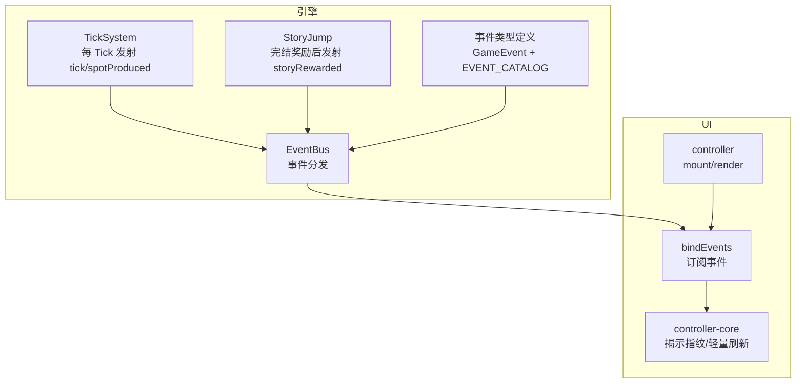
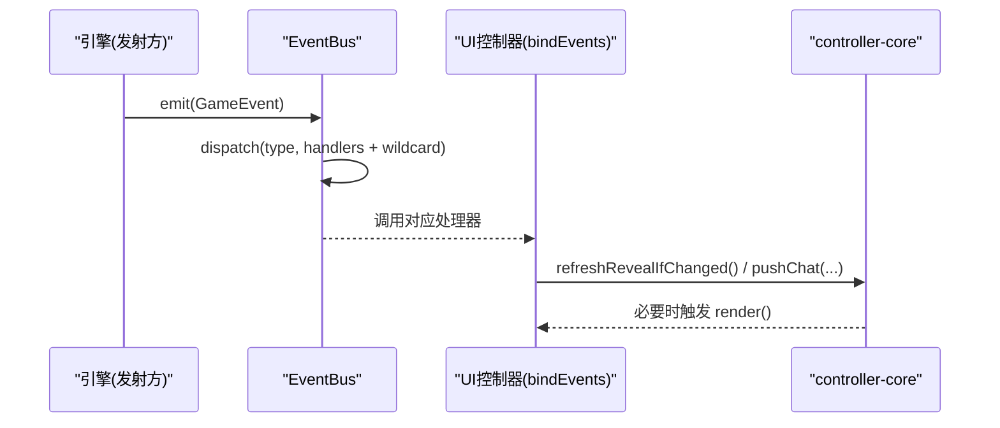
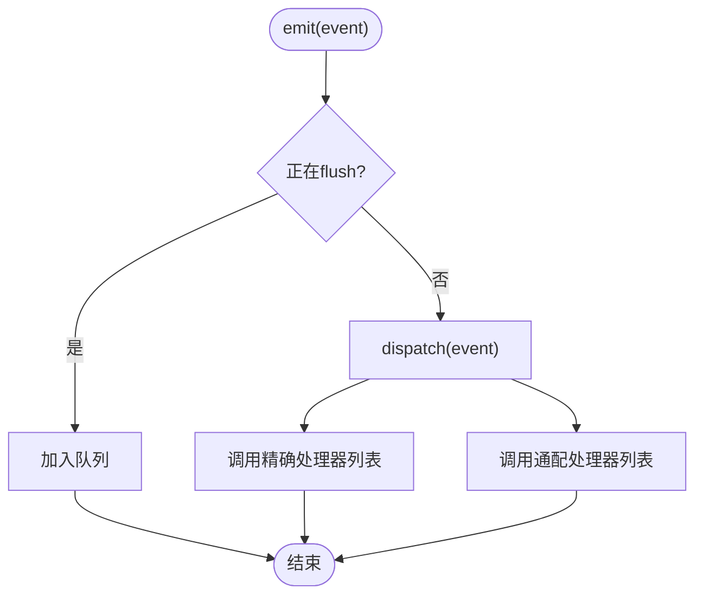
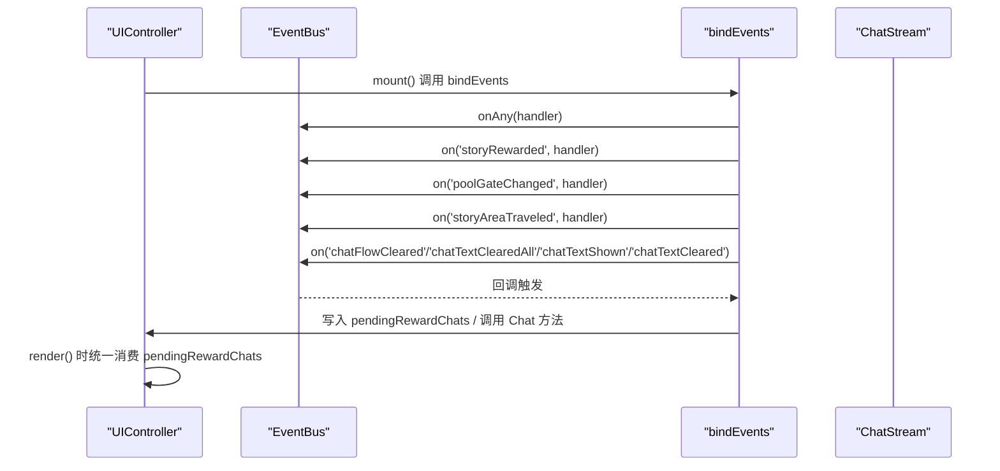
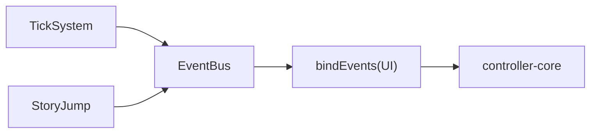

# 事件总线集成

<cite>
**本文引用的文件**
- [src/engine/core/event-bus.ts](file://src/engine/core/event-bus.ts)
- [src/ui/controller-events.ts](file://src/ui/controller-events.ts)
- [src/ui/controller.ts](file://src/ui/controller.ts)
- [src/ui/controller-core.ts](file://src/ui/controller-core.ts)
- [src/engine/types/events.ts](file://src/engine/types/events.ts)
- [src/engine/system/tick-system.ts](file://src/engine/system/tick-system.ts)
- [src/engine/game/story-jump.ts](file://src/engine/game/story-jump.ts)
- [tests/engine/event-bus.test.ts](file://tests/engine/event-bus.test.ts)
</cite>

## 目录
1. [简介](#简介)
2. [项目结构](#项目结构)
3. [核心组件](#核心组件)
4. [架构总览](#架构总览)
5. [详细组件分析](#详细组件分析)
6. [依赖关系分析](#依赖关系分析)
7. [性能考量](#性能考量)
8. [故障排查指南](#故障排查指南)
9. [结论](#结论)
10. [附录](#附录)

## 简介
本文档面向 ACProgram 的事件总线集成机制，重点说明 UI 控制器如何与游戏引擎的 EventBus 进行集成：包括事件订阅、监听器注册、事件传播流程；详解 bindEvents 的实现原理（onAny 通用监听与 on 精确匹配）；文档化关键引擎事件的触发时机与处理逻辑（如 storyRewarded、poolGateChanged、storyAreaTraveled 等）；并总结高频事件的性能优化策略（tick、spotProduced 过滤）、内存管理与调试技巧。

## 项目结构
事件系统由“引擎侧 EventBus + 类型契约 + 发射方/订阅方”构成，UI 层通过 controller-events 集中订阅引擎事件，驱动界面刷新与聊天流演出。

图表来源
- [src/engine/core/event-bus.ts:9-83](file://src/engine/core/event-bus.ts#L9-L83)
- [src/engine/system/tick-system.ts:44-60](file://src/engine/system/tick-system.ts#L44-L60)
- [src/engine/game/story-jump.ts:80-106](file://src/engine/game/story-jump.ts#L80-L106)
- [src/engine/types/events.ts:13-97](file://src/engine/types/events.ts#L13-L97)
- [src/ui/controller-events.ts:12-88](file://src/ui/controller-events.ts#L12-L88)
- [src/ui/controller.ts:139-167](file://src/ui/controller.ts#L139-L167)

章节来源
- [src/engine/core/event-bus.ts:9-83](file://src/engine/core/event-bus.ts#L9-L83)
- [src/ui/controller-events.ts:12-88](file://src/ui/controller-events.ts#L12-L88)
- [src/ui/controller.ts:139-167](file://src/ui/controller.ts#L139-L167)

## 核心组件
- EventBus：提供 on/off/onAny/emit/flush/clear 等能力，支持按事件类型精确分发与通配监听，具备队列与 flush 机制以应对嵌套 emit。
- UI 控制器（controller）：在 mount 时调用 bindEvents 完成事件订阅，并在 render 中统一落账奖励通知。
- 事件类型与目录（events.ts）：定义 GameEvent 联合类型与 EVENT_CATALOG，明确每个事件的用途、发射方与订阅方。
- 发射方：
  - TickSystem：每 Tick 发射 tick 与 spotProduced。
  - StoryJump：剧情完结奖励结算后发射 storyRewarded。
- UI 订阅层（controller-events）：集中订阅各类事件，驱动揭示刷新、聊天流演出与奖励通知。

章节来源
- [src/engine/core/event-bus.ts:9-83](file://src/engine/core/event-bus.ts#L9-L83)
- [src/engine/types/events.ts:13-166](file://src/engine/types/events.ts#L13-L166)
- [src/engine/system/tick-system.ts:44-60](file://src/engine/system/tick-system.ts#L44-L60)
- [src/engine/game/story-jump.ts:80-106](file://src/engine/game/story-jump.ts#L80-L106)
- [src/ui/controller-events.ts:12-88](file://src/ui/controller-events.ts#L12-L88)

## 架构总览
下图展示从引擎事件到 UI 响应的完整链路：引擎模块发射事件 → EventBus 分发 → UI 订阅处理器执行 → 触发揭示刷新或聊天流更新 → 渲染或轻量刷新。

图表来源
- [src/engine/core/event-bus.ts:46-75](file://src/engine/core/event-bus.ts#L46-L75)
- [src/ui/controller-events.ts:12-88](file://src/ui/controller-events.ts#L12-L88)
- [src/ui/controller-core.ts:46-60](file://src/ui/controller-core.ts#L46-L60)

## 详细组件分析

### EventBus 实现与事件传播
- 精确订阅：on(eventType, handler) 将处理器加入该类型的数组，返回取消函数用于 off。
- 通配订阅：onAny(handler) 收集所有事件，适合全局审计或统一刷新。
- 派发：dispatch 先调用精确处理器列表，再遍历通配处理器。
- 批量与嵌套：emit 在 flushing 期间入队，flush 一次性派发队列，避免重入问题。
- 清理：clear 清空所有处理器与队列。

图表来源
- [src/engine/core/event-bus.ts:46-75](file://src/engine/core/event-bus.ts#L46-L75)

章节来源
- [src/engine/core/event-bus.ts:9-83](file://src/engine/core/event-bus.ts#L9-L83)
- [tests/engine/event-bus.test.ts:1-90](file://tests/engine/event-bus.test.ts#L1-L90)

### bindEvents：UI 与 EventBus 的集成点
- 通用监听：onAny 对所有事件进行揭示评估，但跳过 tick 与 spotProduced 以避免高频刷新。
- 特定事件：
  - storyRewarded：汇总 effects 与 flags，生成奖励摘要并排队至 pendingRewardChats，等待 render 统一落账。
  - poolGateChanged：当池 gate 解锁时推送解锁通知。
  - storyAreaTraveled：移动区域时显示“移动到了 XX”。
  - chatFlowCleared/chatTextClearedAll/chatTextShown/chatTextCleared：控制聊天流与演出文本的显示/清除。
  - storyTriggered/storyCompleted：在剧情开始/结束时清理演出文本覆盖层。
- 挂载时机：controller.mount 中调用 bindEvents，确保 UI 就绪后再订阅。

图表来源
- [src/ui/controller.ts:139-167](file://src/ui/controller.ts#L139-L167)
- [src/ui/controller-events.ts:12-88](file://src/ui/controller-events.ts#L12-L88)

章节来源
- [src/ui/controller-events.ts:12-88](file://src/ui/controller-events.ts#L12-L88)
- [src/ui/controller.ts:139-167](file://src/ui/controller.ts#L139-L167)

### 关键引擎事件：触发时机与处理逻辑
- storyRewarded
  - 触发时机：剧情完结奖励结算后（applyCompletionReward 之后）。
  - 携带信息：storyId、source（first/repeat/conditional）、effects、flags。
  - UI 处理：生成奖励摘要并排队，render 时统一推入聊天流。
  - 参考路径：[story-jump.ts:80-106](file://src/engine/game/story-jump.ts#L80-L106)
- poolGateChanged
  - 触发时机：闲聊池可用性变化（PassivePoolSystem 重算）。
  - UI 处理：若 available 为真，推送解锁通知。
  - 参考路径：[events.ts:33-34](file://src/engine/types/events.ts#L33-L34)、[controller-events.ts:38-42](file://src/ui/controller-events.ts#L38-L42)
- storyAreaTraveled
  - 触发时机：Story 的 travelToArea effect 成功且 notice=true。
  - UI 处理：显示“移动到了 XX”迷你条目。
  - 参考路径：[events.ts:23-24](file://src/engine/types/events.ts#L23-L24)、[controller-events.ts:44-48](file://src/ui/controller-events.ts#L44-L48)
- tick
  - 触发时机：每 Tick（生产循环）。
  - UI 处理：在 onAny 中显式跳过，避免频繁揭示评估。
  - 参考路径：[tick-system.ts:44-60](file://src/engine/system/tick-system.ts#L44-L60)、[controller-events.ts:14-18](file://src/ui/controller-events.ts#L14-L18)
- spotProduced
  - 触发时机：资源产出结算。
  - UI 处理：在 onAny 中显式跳过，避免频繁刷新。
  - 参考路径：[tick-system.ts:44-60](file://src/engine/system/tick-system.ts#L44-L60)、[controller-events.ts:14-18](file://src/ui/controller-events.ts#L14-L18)
- 聊天流相关事件（chatFlowCleared、chatTextClearedAll、chatTextShown、chatTextCleared）
  - 触发时机：演出服务（Talklet）对聊天流的操作。
  - UI 处理：清空/插入/删除演出文本，保持聊天历史与演出层分离。
  - 参考路径：[events.ts:86-96](file://src/engine/types/events.ts#L86-L96)、[controller-events.ts:49-87](file://src/ui/controller-events.ts#L49-L87)

章节来源
- [src/engine/game/story-jump.ts:80-106](file://src/engine/game/story-jump.ts#L80-L106)
- [src/engine/system/tick-system.ts:44-60](file://src/engine/system/tick-system.ts#L44-L60)
- [src/engine/types/events.ts:13-97](file://src/engine/types/events.ts#L13-L97)
- [src/ui/controller-events.ts:12-88](file://src/ui/controller-events.ts#L12-L88)

### 事件类型契约与目录
- GameEvent：定义所有运行时事件类型及其字段，保证类型安全。
- EVENT_CATALOG：登记每个事件的用途、发射方与订阅方，新增/删除事件需同步本表，否则编译期报错，便于审计与追溯。
- 全局兜底：devLog 的 onAny 全量记录；UI 的 onAny 揭示刷新（跳过 tick/spotProduced）。

章节来源
- [src/engine/types/events.ts:13-166](file://src/engine/types/events.ts#L13-L166)

## 依赖关系分析
- 发射方依赖：
  - TickSystem 依赖 EventBus 发射 tick/spotProduced。
  - StoryJump 依赖 EventBus 发射 storyRewarded。
- 订阅方依赖：
  - UI 控制器通过 bindEvents 订阅多种事件，驱动揭示刷新与聊天流。
  - controller-core 提供揭示指纹计算与轻量刷新，被 UI 订阅层调用。

图表来源
- [src/engine/system/tick-system.ts:44-60](file://src/engine/system/tick-system.ts#L44-L60)
- [src/engine/game/story-jump.ts:80-106](file://src/engine/game/story-jump.ts#L80-L106)
- [src/ui/controller-events.ts:12-88](file://src/ui/controller-events.ts#L12-L88)
- [src/ui/controller-core.ts:46-60](file://src/ui/controller-core.ts#L46-L60)

章节来源
- [src/engine/system/tick-system.ts:44-60](file://src/engine/system/tick-system.ts#L44-L60)
- [src/engine/game/story-jump.ts:80-106](file://src/engine/game/story-jump.ts#L80-L106)
- [src/ui/controller-events.ts:12-88](file://src/ui/controller-events.ts#L12-L88)
- [src/ui/controller-core.ts:46-60](file://src/ui/controller-core.ts#L46-L60)

## 性能考量
- 高频事件过滤
  - 在 onAny 中显式跳过 tick 与 spotProduced，避免每次 Tick 都重新计算揭示指纹。
  - 参考路径：[controller-events.ts:14-18](file://src/ui/controller-events.ts#L14-L18)
- 揭示刷新节流
  - refreshRevealIfChanged 使用 lastRevealCheck 时间戳节流，同一 Tick 内多次事件仅评估一次。
  - 参考路径：[controller-core.ts:46-60](file://src/ui/controller-core.ts#L46-L60)
- 轻量刷新
  - refreshLight 每 Tick 只更新资源数字节点与产出显示，不重建 #app DOM，减少重排与重绘。
  - 参考路径：[controller-core.ts:62-96](file://src/ui/controller-core.ts#L62-L96)
- 事件批处理
  - EventBus.flush 在 flush 期间将后续 emit 入队，避免重入导致的重复派发。
  - 参考路径：[event-bus.ts:46-66](file://src/engine/core/event-bus.ts#L46-L66)
- 内存管理
  - on 返回取消函数，便于组件卸载时移除监听，防止内存泄漏。
  - clear 可一次性清空所有处理器与队列，适用于场景切换或重置。
  - 参考路径：[event-bus.ts:15-26](file://src/engine/core/event-bus.ts#L15-L26)、[event-bus.ts:77-82](file://src/engine/core/event-bus.ts#L77-L82)

章节来源
- [src/ui/controller-events.ts:14-18](file://src/ui/controller-events.ts#L14-L18)
- [src/ui/controller-core.ts:46-96](file://src/ui/controller-core.ts#L46-L96)
- [src/engine/core/event-bus.ts:15-26](file://src/engine/core/event-bus.ts#L15-L26)
- [src/engine/core/event-bus.ts:46-66](file://src/engine/core/event-bus.ts#L46-L66)
- [src/engine/core/event-bus.ts:77-82](file://src/engine/core/event-bus.ts#L77-L82)

## 故障排查指南
- 常见问题定位
  - 事件未触发：检查 EVENT_CATALOG 是否正确登记发射方与订阅方；确认 on 是否已注册；确认 emit 是否被调用。
  - 高频刷新导致卡顿：确认 onAny 是否跳过了 tick/spotProduced；检查 refreshRevealIfChanged 节流是否生效。
  - 奖励通知顺序错误：确认 storyRewarded 是否进入 pendingRewardChats，并在 render 中统一消费。
  - 聊天流演出异常：核对 chatFlowCleared/chatTextClearedAll/chatTextShown/chatTextCleared 的配对调用。
- 调试技巧
  - 使用 onAny 打印事件序列，结合 EVENT_CATALOG 快速定位发射方与订阅方。
  - 在单元测试中验证事件行为（如 event-bus.test.ts），确保 on/off/flush/clear 符合预期。
  - 利用 devLog 的全量记录（onAny 兜底）输出事件轨迹。
- 参考路径
  - 事件类型与目录：[events.ts:13-166](file://src/engine/types/events.ts#L13-L166)
  - 事件总线测试：[event-bus.test.ts:1-90](file://tests/engine/event-bus.test.ts#L1-L90)

章节来源
- [src/engine/types/events.ts:13-166](file://src/engine/types/events.ts#L13-L166)
- [tests/engine/event-bus.test.ts:1-90](file://tests/engine/event-bus.test.ts#L1-L90)

## 结论
ACProgram 的事件总线通过 EventBus 实现了松耦合的引擎与 UI 通信。UI 控制器在 mount 阶段集中订阅事件，结合 onAny 与 on 的精确匹配，既保证了全局刷新的灵活性，又避免了高频事件带来的性能损耗。关键引擎事件（storyRewarded、poolGateChanged、storyAreaTraveled 等）在明确的时机触发，并由 UI 层进行响应与呈现。通过揭示指纹、节流、轻量刷新与事件批处理等手段，系统在交互流畅性与功能完整性之间取得了良好平衡。

## 附录
- 事件目录（部分）
  - storyRewarded：剧情完结奖励已结算（UI 渲染奖励摘要）
  - poolGateChanged：闲聊池 gate 翻转（UI 通知解锁）
  - storyAreaTraveled：Story 的 travelToArea 成功（notice=true）
  - tick：每帧（Trigger every 分频）
  - spotProduced：Spot 产出结算（UI 揭示刷新显式跳过）
  - chatFlowCleared/chatTextClearedAll/chatTextShown/chatTextCleared：聊天流演出服务事件
- 参考路径
  - [events.ts:13-166](file://src/engine/types/events.ts#L13-L166)