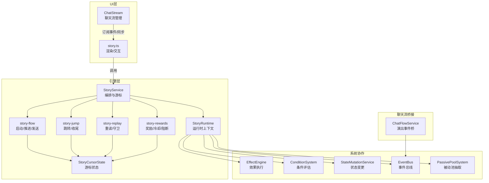
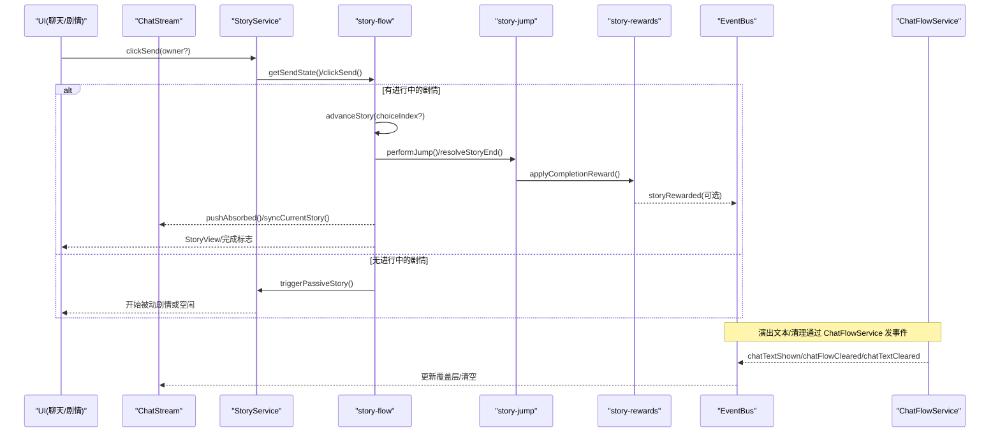
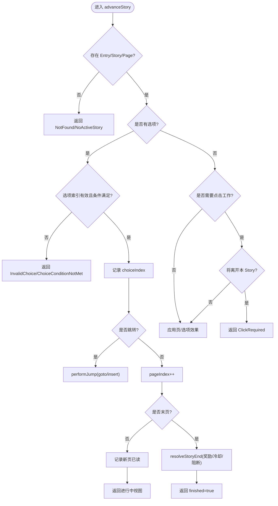
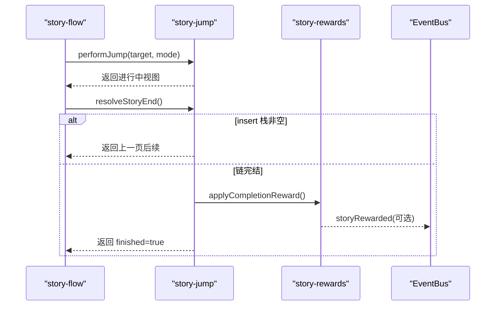
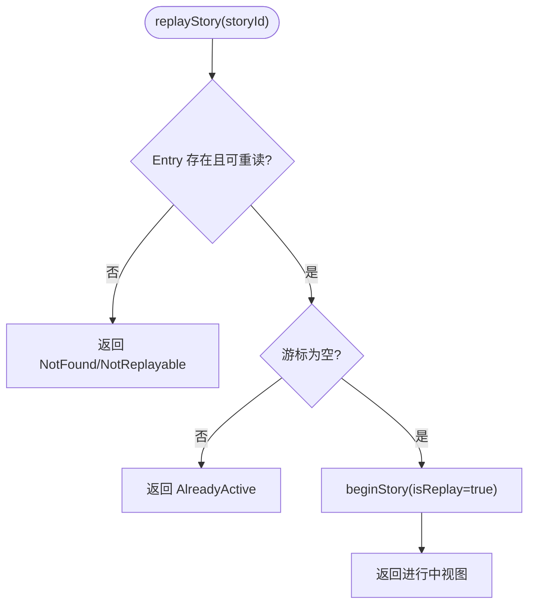
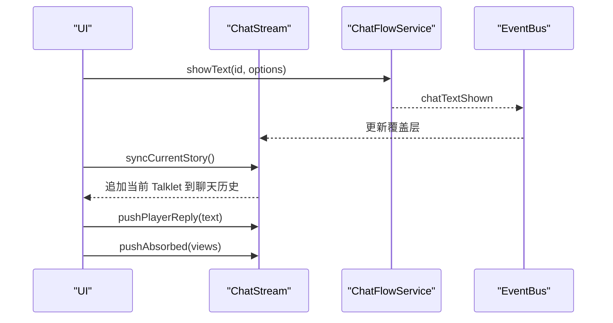
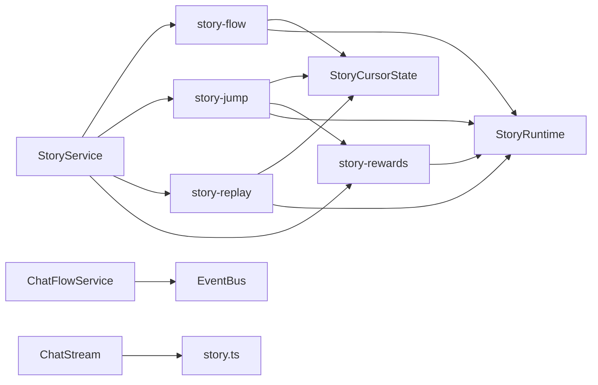

# 故事事件处理

<cite>
**本文引用的文件**
- [story-service.ts](file://src/engine/game/story-service.ts)
- [story-flow.ts](file://src/engine/game/story-flow.ts)
- [story-jump.ts](file://src/engine/game/story-jump.ts)
- [story-replay.ts](file://src/engine/game/story-replay.ts)
- [story-rewards.ts](file://src/engine/game/story-rewards.ts)
- [story-cursor-state.ts](file://src/engine/game/story-cursor-state.ts)
- [story-context.ts](file://src/engine/game/story-context.ts)
- [chat-flow-service.ts](file://src/engine/game/chat-flow-service.ts)
- [chat-stream.ts](file://src/ui/chat-stream.ts)
- [story.ts](file://src/ui/components/story.ts)
</cite>

## 目录
1. [简介](#简介)
2. [项目结构](#项目结构)
3. [核心组件](#核心组件)
4. [架构总览](#架构总览)
5. [详细组件分析](#详细组件分析)
6. [依赖关系分析](#依赖关系分析)
7. [性能考量](#性能考量)
8. [故障排查指南](#故障排查指南)
9. [结论](#结论)
10. [附录](#附录)

## 简介
本技术文档围绕 ACProgram 的“故事系统事件处理”展开，聚焦剧情演出过程中的事件流与状态管理。内容涵盖：
- 剧情启动、推进、选项选择、分支跳转、奖励结算等核心流程的事件驱动机制
- 故事系统与聊天流系统的深度集成（对话显示、选项呈现、动画/覆盖层文本）
- 多玩家/多沙盒场景下的游标隔离与数据一致性
- 重阅读、跳过、快进等交互的事件处理逻辑
- 剧情定制化的扩展点与自定义脚本实现建议
- 复杂剧情场景的调试与优化技巧

## 项目结构
故事系统由“编排服务 + 运行时上下文 + 子模块（流程/跳转/回放/奖励）+ 聊天流桥接 + UI 渲染”构成，职责清晰、耦合度低：
- 编排服务：StoryService 持有全局与聊天沙盒游标，对外暴露统一 API
- 运行时上下文：StoryRuntime 为各子模块提供只读访问能力，避免循环依赖
- 子模块：
  - story-flow：启动/推进/发送、点击工作、回显决策、当前视图
  - story-jump：goto/insert 跳转链与完结收尾
  - story-replay：重阅读入口与分歧点准入守卫
  - story-rewards：完结奖励、冷却、对话阻断
- 聊天流桥接：ChatFlowService 将演出效果转译为事件，UI 订阅后操作聊天流
- UI：聊天流管理与渲染、剧情页/选项/羁绊卡片的展示

图表来源
- [story-service.ts:52-84](file://src/engine/game/story-service.ts#L52-L84)
- [story-flow.ts:25-104](file://src/engine/game/story-flow.ts#L25-L104)
- [story-jump.ts:16-42](file://src/engine/game/story-jump.ts#L16-L42)
- [story-replay.ts:11-43](file://src/engine/game/story-replay.ts#L11-L43)
- [story-rewards.ts:14-61](file://src/engine/game/story-rewards.ts#L14-L61)
- [chat-flow-service.ts:14-37](file://src/engine/game/chat-flow-service.ts#L14-L37)
- [chat-stream.ts:15-145](file://src/ui/chat-stream.ts#L15-L145)
- [story.ts:159-191](file://src/ui/components/story.ts#L159-L191)

章节来源
- [story-service.ts:1-271](file://src/engine/game/story-service.ts#L1-L271)
- [story-flow.ts:1-410](file://src/engine/game/story-flow.ts#L1-L410)
- [story-jump.ts:1-109](file://src/engine/game/story-jump.ts#L1-L109)
- [story-replay.ts:1-44](file://src/engine/game/story-replay.ts#L1-L44)
- [story-rewards.ts:1-62](file://src/engine/game/story-rewards.ts#L1-L62)
- [story-cursor-state.ts:1-96](file://src/engine/game/story-cursor-state.ts#L1-L96)
- [story-context.ts:1-50](file://src/engine/game/story-context.ts#L1-L50)
- [chat-flow-service.ts:1-38](file://src/engine/game/chat-flow-service.ts#L1-L38)
- [chat-stream.ts:1-145](file://src/ui/chat-stream.ts#L1-L145)
- [story.ts:1-313](file://src/ui/components/story.ts#L1-L313)

## 核心组件
- StoryService：统一管理全局与聊天沙盒游标，封装对外 API（startActiveStory/startCardStory/startStory/triggerPassiveStory/replayStory/advanceStory/clickSend/getSendState/getCurrentStoryView），并维护本次剧情设置的 flag 集合与最近一次奖励结算记录
- StoryCursorState：单一剧情游标的纯数据结构，支持 save/restore，字段与存档结构一一对应；包含 insert 返回栈、visitedStoryIds、jumpDepth、isReplay、choiceTextConfirmed 等
- StoryRuntime：跨模块共享的只读运行时视图，注入 Registry、ConditionSystem、EffectEngine、StateMutationService、EventBus、PassivePoolSystem、travelToArea 等能力
- story-flow：负责剧情启动、推进、发送按钮交互、点击工作进度、回显决策、当前视图生成
- story-jump：goto/insert 跳转链与完结收尾，含最大跳转深度保护
- story-replay：重阅读入口与分歧点准入守卫（基于已读日志）
- story-rewards：完结奖励策略（conditional/simple）、冷却写入、对话空间阻断
- ChatFlowService：演出专用聊天流事件桥（clearAll/showText/clearId），通过 EventBus 通知 UI
- ChatStream：聊天流领域逻辑，负责条目路由、去重、上限控制、演出文本覆盖层管理
- story.ts（UI）：对话气泡、旁白、回复卡片、羁绊卡片、演出文本覆盖层的渲染与样式

章节来源
- [story-service.ts:52-271](file://src/engine/game/story-service.ts#L52-L271)
- [story-cursor-state.ts:11-96](file://src/engine/game/story-cursor-state.ts#L11-L96)
- [story-context.ts:24-50](file://src/engine/game/story-context.ts#L24-L50)
- [story-flow.ts:25-410](file://src/engine/game/story-flow.ts#L25-L410)
- [story-jump.ts:13-109](file://src/engine/game/story-jump.ts#L13-L109)
- [story-replay.ts:11-43](file://src/engine/game/story-replay.ts#L11-L43)
- [story-rewards.ts:9-61](file://src/engine/game/story-rewards.ts#L9-L61)
- [chat-flow-service.ts:14-37](file://src/engine/game/chat-flow-service.ts#L14-L37)
- [chat-stream.ts:15-145](file://src/ui/chat-stream.ts#L15-L145)
- [story.ts:22-313](file://src/ui/components/story.ts#L22-L313)

## 架构总览
故事系统采用“服务编排 + 运行时上下文 + 子模块拆分 + 事件驱动”的架构：
- 服务编排层（StoryService）仅做游标与外部 API 委托，不直接实现业务细节
- 子模块通过 StoryRuntime 访问协作系统，避免循环依赖
- 聊天流通过 ChatFlowService 以事件形式解耦，UI 通过 ChatStream 订阅并渲染
- 多沙盒并行：全局游标用于 active 主线/一般闲聊；每个学生的对话空间拥有独立游标，互不打断

图表来源
- [story-flow.ts:227-352](file://src/engine/game/story-flow.ts#L227-L352)
- [story-jump.ts:16-109](file://src/engine/game/story-jump.ts#L16-L109)
- [story-rewards.ts:14-61](file://src/engine/game/story-rewards.ts#L14-L61)
- [chat-flow-service.ts:14-37](file://src/engine/game/chat-flow-service.ts#L14-L37)
- [chat-stream.ts:53-104](file://src/ui/chat-stream.ts#L53-L104)

## 详细组件分析

### 剧情启动与推进（story-flow）
- beginStory：初始化游标（entry/def/pageIndex/choiceIndex/clickWork/visited/isReplay/jumpDepth），记录首条 Talklet 已读，发出 storyTriggered 事件
- startStory：校验类型/条件/重复性/可打断性，必要时清除已有被动闲聊，进入 beginStory
- triggerPassiveStory：按池权重与 reactor gate 抽取，过滤 owner/cooldown/blocks，成功后 startStory
- advanceStory：解析选项与跳转目标，防护 click/clickWork 需求，应用效果（setFlag/travelToArea），记录阅读日志，跳转或推进下一页
- getSendState：决定底部按钮模式（idle/choice/kizuna/advance），计算 clickWork 进度
- clickSend：根据模式分别处理 choice/kizuna/idle/advance，支持回显与自动吸收过渡页

图表来源
- [story-flow.ts:133-221](file://src/engine/game/story-flow.ts#L133-L221)
- [story-flow.ts:227-352](file://src/engine/game/story-flow.ts#L227-L352)

章节来源
- [story-flow.ts:25-410](file://src/engine/game/story-flow.ts#L25-L410)

### 跳转链与完结收尾（story-jump）
- performJump：限制最大跳转深度，记录 insert 返回点，重置游标至目标 Story 首页，记录首页已读
- resolveStoryEnd：若 insert 栈非空则返回原 Story 下一页；否则发放完结奖励、记录完成、写冷却帧、可能阻断对话空间、发出 storyRewarded 事件并清空 flags

图表来源
- [story-jump.ts:16-109](file://src/engine/game/story-jump.ts#L16-L109)
- [story-rewards.ts:14-61](file://src/engine/game/story-rewards.ts#L14-L61)

章节来源
- [story-jump.ts:13-109](file://src/engine/game/story-jump.ts#L13-L109)
- [story-rewards.ts:9-61](file://src/engine/game/story-rewards.ts#L9-L61)

### 重阅读与分歧点守卫（story-replay）
- replayStory：检查 entry.replayable、无进行中剧情、存在 Story，设置 isReplay=true 进入重阅读模式
- guardPrereqsMet：校验前置阅读（整条 Story 或指定 talkletIndex），在重阅读模式下阻止未满足的分歧跳转

图表来源
- [story-replay.ts:11-43](file://src/engine/game/story-replay.ts#L11-L43)
- [story-flow.ts:25-41](file://src/engine/game/story-flow.ts#L25-L41)

章节来源
- [story-replay.ts:11-43](file://src/engine/game/story-replay.ts#L11-L43)
- [story-flow.ts:25-41](file://src/engine/game/story-flow.ts#L25-L41)

### 奖励结算与冷却/阻断（story-rewards）
- applyCompletionReward：conditional 策略优先匹配首个满足的条件奖励；否则按 first/repeat 发放
- recordPassiveCooldown：写入 entry 自身及归属池的冷却帧
- maybeBlockConversation：若声明 block 且存在 owner，锁定该学生对话空间直到条件满足

章节来源
- [story-rewards.ts:9-61](file://src/engine/game/story-rewards.ts#L9-L61)

### 聊天流集成（ChatFlowService + ChatStream + UI）
- ChatFlowService：将 clearAll/showText/clearId 转为事件（chatFlowCleared/chatTextShown/chatTextCleared/chatTextClearedAll）
- ChatStream：
  - syncCurrentStory：将当前 Talklet 同步到聊天流（排除 click 页），使用指纹去重
  - pushPlayerReply：回显玩家回复
  - pushAbsorbed：将自动吸收的过渡页推入聊天流
  - 管理演出文本覆盖层（activeChatTexts/pushChatText/clearChatText/clearAllTexts）
- UI（story.ts）：渲染对话气泡、旁白、回复卡片、羁绊卡片、演出文本覆盖层（title/badge/note/kizuna）

图表来源
- [chat-flow-service.ts:14-37](file://src/engine/game/chat-flow-service.ts#L14-L37)
- [chat-stream.ts:53-145](file://src/ui/chat-stream.ts#L53-L145)
- [story.ts:159-211](file://src/ui/components/story.ts#L159-L211)

章节来源
- [chat-flow-service.ts:14-37](file://src/engine/game/chat-flow-service.ts#L14-L37)
- [chat-stream.ts:15-145](file://src/ui/chat-stream.ts#L15-L145)
- [story.ts:22-313](file://src/ui/components/story.ts#L22-L313)

### 多沙盒与状态一致性
- 全局游标：active 主线/一般闲聊
- 聊天沙盒：按 owner（VariantId）分区，每个角色对话空间独立游标，互不打断
- StoryService.cursorFor：惰性创建并缓存沙盒游标
- 移动规则：离开 Area 时中断可打断的 PassiveStory；isBlockingMovement 判断是否阻塞移动
- 存档/读档：saveCursor/saveChatCursors/restoreCursor/restoreChatCursors 透传游标快照

章节来源
- [story-service.ts:52-176](file://src/engine/game/story-service.ts#L52-L176)
- [story-cursor-state.ts:11-96](file://src/engine/game/story-cursor-state.ts#L11-L96)

### 剧情定制与扩展点
- 分支跳转：Talklet/选项级 jumpToStory + jumpMode（goto/insert），配合 visitedStoryIds 与 branchGuards 实现复杂叙事
- 条件与效果：Talklet/选项 effects（含 setFlag/travelToArea），由 EffectEngine 执行；条件由 ConditionSystem 评估
- 被动池抽取：PassivePoolSystem 支持树状结构与 reactor gates，结合 cooldowns/blocks/owner 过滤
- 演出文本覆盖层：showChatText 支持直接文本或嵌入标准 Talklet，具备定位/对齐/样式覆写能力
- 羁绊剧情：kizuna 卡片触发 ActiveStoryEntry，skipConditions 但尊重 AlreadyCompleted

章节来源
- [story-flow.ts:149-221](file://src/engine/game/story-flow.ts#L149-L221)
- [story-flow.ts:227-352](file://src/engine/game/story-flow.ts#L227-L352)
- [story-jump.ts:16-42](file://src/engine/game/story-jump.ts#L16-L42)
- [story-replay.ts:11-43](file://src/engine/game/story-replay.ts#L11-L43)
- [chat-flow-service.ts:14-37](file://src/engine/game/chat-flow-service.ts#L14-L37)
- [story.ts:183-313](file://src/ui/components/story.ts#L183-L313)

## 依赖关系分析
- StoryService 依赖：Registry、ConditionSystem、EffectEngine、StateMutationService、EventBus、PassivePoolSystem、travelToArea
- story-flow 依赖：StoryRuntime（含 registry/conditionSystem/effectEngine/mutations/eventBus/passivePools/travelToArea/getState/cursorFor/...）
- story-jump 依赖：StoryRuntime、StoryCursorState、story-rewards
- story-replay 依赖：StoryRuntime、story-flow
- story-rewards 依赖：StoryRuntime、StoryEntryDef/StoryDef
- ChatFlowService 依赖：EventBus
- ChatStream 依赖：GameInstance（获取 StoryView）、PanelState（活跃流/覆盖层）

图表来源
- [story-service.ts:52-84](file://src/engine/game/story-service.ts#L52-L84)
- [story-flow.ts:25-410](file://src/engine/game/story-flow.ts#L25-L410)
- [story-jump.ts:16-109](file://src/engine/game/story-jump.ts#L16-L109)
- [story-replay.ts:11-43](file://src/engine/game/story-replay.ts#L11-L43)
- [story-rewards.ts:14-61](file://src/engine/game/story-rewards.ts#L14-L61)
- [chat-flow-service.ts:14-37](file://src/engine/game/chat-flow-service.ts#L14-L37)
- [chat-stream.ts:15-145](file://src/ui/chat-stream.ts#L15-L145)
- [story.ts:159-313](file://src/ui/components/story.ts#L159-L313)

章节来源
- [story-service.ts:1-271](file://src/engine/game/story-service.ts#L1-L271)
- [story-flow.ts:1-410](file://src/engine/game/story-flow.ts#L1-L410)
- [story-jump.ts:1-109](file://src/engine/game/story-jump.ts#L1-L109)
- [story-replay.ts:1-44](file://src/engine/game/story-replay.ts#L1-L44)
- [story-rewards.ts:1-62](file://src/engine/game/story-rewards.ts#L1-L62)
- [chat-flow-service.ts:1-38](file://src/engine/game/chat-flow-service.ts#L1-L38)
- [chat-stream.ts:1-145](file://src/ui/chat-stream.ts#L1-L145)
- [story.ts:1-313](file://src/ui/components/story.ts#L1-L313)

## 性能考量
- 跳转深度限制：MAX_JUMP_DEPTH=32，防止误写导致的无限跳转或过深嵌套
- 点击工作随机化：rollClickWorkTotal(base, rand) 提供 base + 随机偏移，减少重复体验
- 聊天流上限：CHAT_MAX=200，避免历史过长影响渲染性能
- 去重同步：syncCurrentStory 使用 fingerprint（storyId:pageIndex）避免重复推送
- 效果批量应用：trackFlagsAndApply 过滤 travelToArea 单独处理，减少不必要移动
- 被动池剪枝：抽选时依据 cooldowns/blocks/availableInits/triggerCondition 提前过滤，降低无效尝试

[本节为通用性能讨论，不直接分析具体文件]

## 故障排查指南
常见错误码与含义（UI 侧映射）：
- AlreadyActive：已有剧情流程进行中
- AlreadyCompleted：该剧情已经完成
- BranchGuardDenied：分歧点准入条件未满足（重阅读模式）
- ChoiceConditionNotMet：当前选择条件未满足
- ChoiceRequired：请先选择一个回应
- ClickRequired：请先完成本页点击再继续
- ConditionNotMet：剧情条件未满足
- InvalidChoice：选择无效
- JumpLimitExceeded：跳转链过深，演出已终止
- NoActiveStory：当前没有进行中的剧情
- NoAvailableStory：当前没有可触发的被动剧情
- NotFound：找不到剧情数据
- NotReplayable：该剧情不可重阅读
- WrongStoryType：剧情类型不匹配

排查要点：
- 确认 Entry 类型与 expectedType 一致（active/passive）
- 检查 availableInits 与 triggerCondition 是否满足
- 对于被动闲聊，检查 owner/cooldowns/blocks 是否允许抽取
- 重阅读模式下，确认分支守卫的前置阅读是否全部满足
- 点击工作页需先完成点击再推进
- 跳转链深度是否超过 MAX_JUMP_DEPTH
- 演出文本覆盖层是否正确清理（clearId）

章节来源
- [story.ts:5-20](file://src/ui/components/story.ts#L5-L20)
- [story-flow.ts:133-221](file://src/engine/game/story-flow.ts#L133-L221)
- [story-jump.ts:16-42](file://src/engine/game/story-jump.ts#L16-L42)
- [story-replay.ts:11-43](file://src/engine/game/story-replay.ts#L11-L43)
- [chat-flow-service.ts:14-37](file://src/engine/game/chat-flow-service.ts#L14-L37)

## 结论
ACProgram 的故事系统通过清晰的职责划分与事件驱动机制，实现了剧情启动、推进、分支跳转、奖励结算、聊天流集成与多沙盒并行的一致性保障。StoryService 作为编排层，将复杂逻辑下沉至子模块并通过 StoryRuntime 共享运行时能力；聊天流通过 ChatFlowService 与 ChatStream 解耦 UI 与引擎。该设计便于扩展（如自定义分支守卫、演出文本覆盖层、羁绊剧情卡片），同时提供了完善的错误码与调试路径，适合复杂剧情场景的开发与维护。

[本节为总结性内容，不直接分析具体文件]

## 附录
- 关键流程图与序列图已在上述章节中给出，可直接对应到具体源码文件
- 如需进一步定位问题，建议从 StoryService 公开 API 入手，逐步下钻到 story-flow/story-jump/story-replay/story-rewards 的具体实现
- 对聊天流相关异常，优先检查 ChatFlowService 事件是否发出、ChatStream 是否正确路由与去重

[本节为补充说明，不直接分析具体文件]