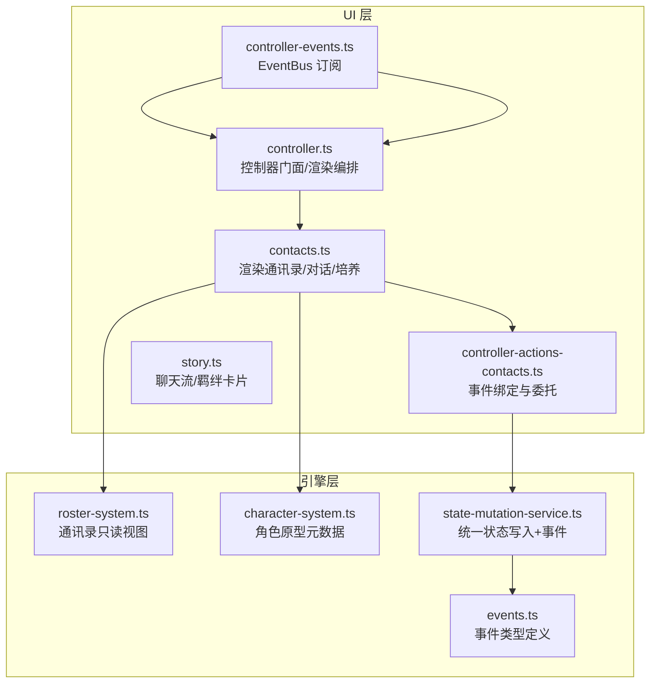
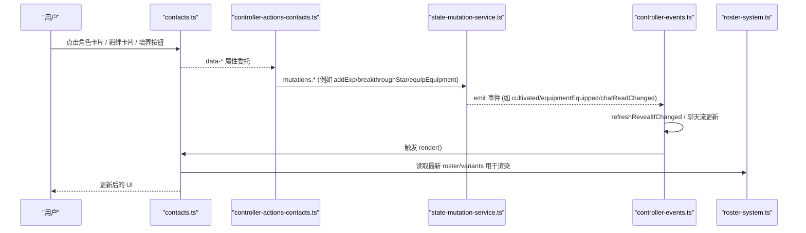
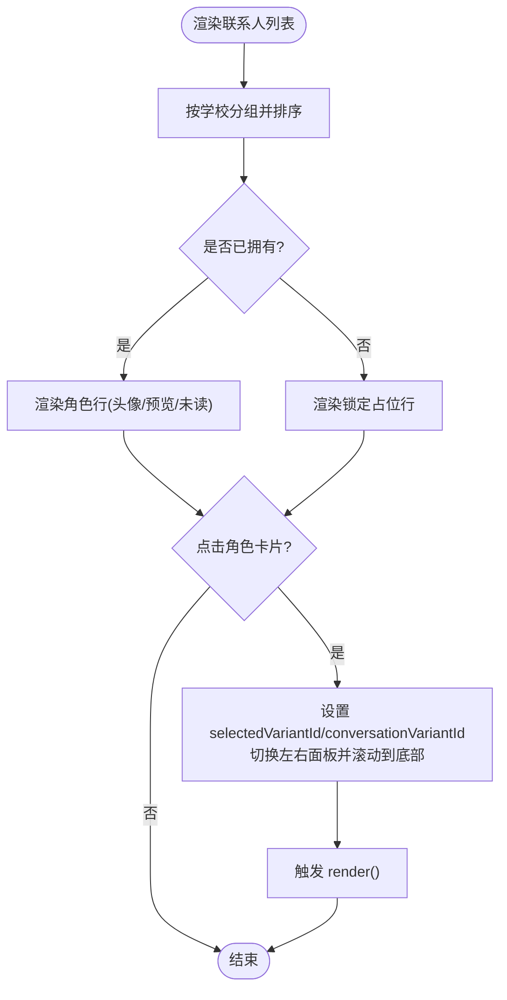
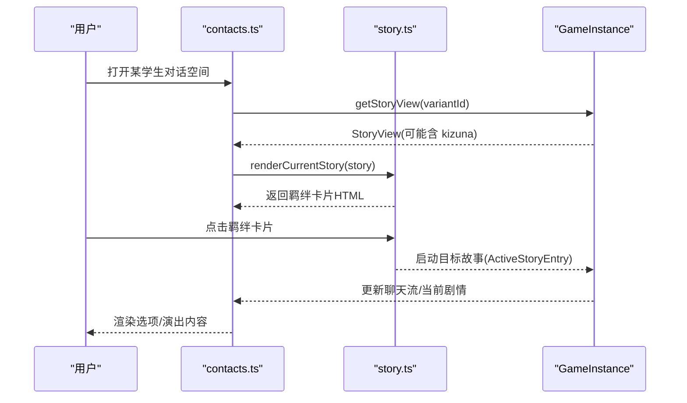
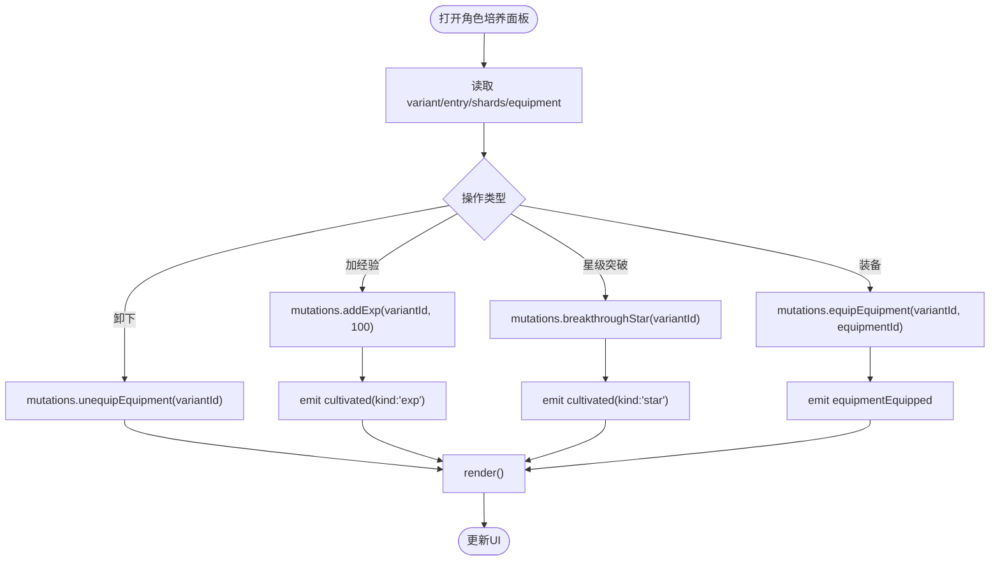
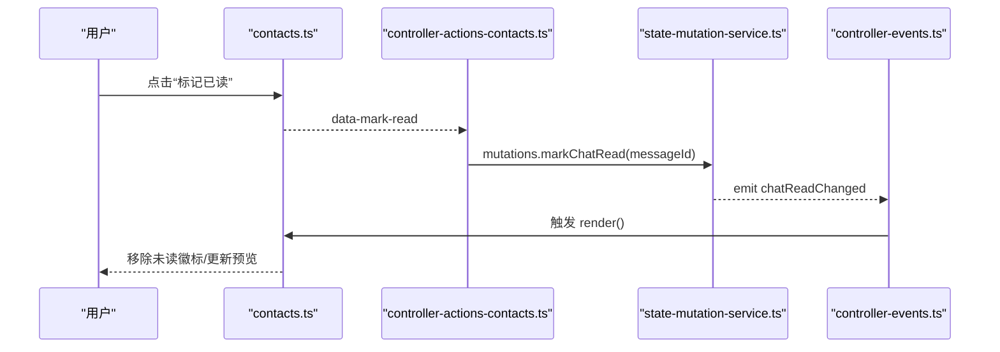
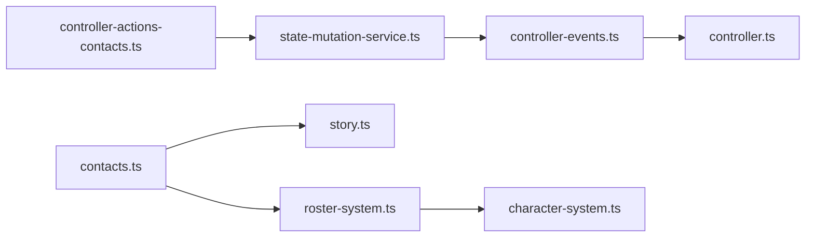

# 联系人事件处理

<cite>
**本文引用的文件**
- [contacts.ts](file://src/ui/components/contacts.ts)
- [controller-actions-contacts.ts](file://src/ui/controller-actions-contacts.ts)
- [controller-events.ts](file://src/ui/controller-events.ts)
- [controller.ts](file://src/ui/controller.ts)
- [story.ts](file://src/ui/components/story.ts)
- [roster-system.ts](file://src/engine/system/roster-system.ts)
- [character-system.ts](file://src/engine/system/character-system.ts)
- [state-mutation-service.ts](file://src/engine/system/state-mutation-service.ts)
- [events.ts](file://src/engine/types/events.ts)
</cite>

## 目录
1. [简介](#简介)
2. [项目结构](#项目结构)
3. [核心组件](#核心组件)
4. [架构总览](#架构总览)
5. [详细组件分析](#详细组件分析)
6. [依赖关系分析](#依赖关系分析)
7. [性能考量](#性能考量)
8. [故障排查指南](#故障排查指南)
9. [结论](#结论)
10. [附录](#附录)

## 简介
本文件为 ACProgram 联系人系统的事件处理与数据同步提供系统化文档。重点覆盖：
- 联系人界面交互：角色卡片点击、羁绊值查看、角色详情展示等
- 数据同步机制：联系人系统与角色系统、羁绊系统的状态一致性
- 列表渲染优化与事件委托：提升大量角色数据时的性能
- 解锁与羁绊提升对 UI 的响应逻辑
- 扩展接口与自定义事件处理方案

## 项目结构
联系人功能由 UI 层（渲染与事件绑定）与引擎层（只读查询与状态变更）协作完成：
- UI 层负责渲染通讯录、对话空间、角色培养面板，并通过 data-* 属性将用户操作委托给控制器
- 控制器将事件转发到 StateMutationService 进行状态写入，并订阅 EventBus 驱动 UI 刷新
- 引擎层通过 RosterSystem/CharacterSystem 提供只读视图，StateMutationService 提供统一写入口并广播事件

**图表来源**
- [contacts.ts:28-88](file://src/ui/components/contacts.ts#L28-L88)
- [controller-actions-contacts.ts:10-78](file://src/ui/controller-actions-contacts.ts#L10-L78)
- [controller-events.ts:12-88](file://src/ui/controller-events.ts#L12-L88)
- [controller.ts:139-200](file://src/ui/controller.ts#L139-L200)
- [story.ts:183-191](file://src/ui/components/story.ts#L183-L191)
- [roster-system.ts:74-103](file://src/engine/system/roster-system.ts#L74-L103)
- [character-system.ts:54-70](file://src/engine/system/character-system.ts#L54-L70)
- [state-mutation-service.ts:148-197](file://src/engine/system/state-mutation-service.ts#L148-L197)
- [events.ts:147-167](file://src/engine/types/events.ts#L147-L167)

**章节来源**
- [contacts.ts:28-88](file://src/ui/components/contacts.ts#L28-L88)
- [controller-actions-contacts.ts:10-78](file://src/ui/controller-actions-contacts.ts#L10-L78)
- [controller-events.ts:12-88](file://src/ui/controller-events.ts#L12-L88)
- [controller.ts:139-200](file://src/ui/controller.ts#L139-L200)
- [story.ts:183-191](file://src/ui/components/story.ts#L183-L191)
- [roster-system.ts:74-103](file://src/engine/system/roster-system.ts#L74-L103)
- [character-system.ts:54-70](file://src/engine/system/character-system.ts#L54-L70)
- [state-mutation-service.ts:148-197](file://src/engine/system/state-mutation-service.ts#L148-L197)
- [events.ts:147-167](file://src/engine/types/events.ts#L147-L167)

## 核心组件
- 联系人渲染器：按学校分组显示已拥有角色，未获得角色以图鉴占位；支持主题色彩组切换与头像优先级（装备 > 声明 > 图片 > 首字母）
- 对话空间渲染：复用通用聊天流与 StoryView，支持羁绊剧情卡片与阻断态提示
- 角色培养面板：等级/星级/碎片/累计获得次数、经验增加、星级突破、色彩装备与配色设计
- 事件委托：data-* 属性绑定点击事件，统一调用 mutations 写入状态并触发 render
- 事件总线：UI 订阅 Engine 事件，驱动轻量刷新或聊天流更新

**章节来源**
- [contacts.ts:28-147](file://src/ui/components/contacts.ts#L28-L147)
- [contacts.ts:168-229](file://src/ui/components/contacts.ts#L168-L229)
- [contacts.ts:254-302](file://src/ui/components/contacts.ts#L254-L302)
- [controller-actions-contacts.ts:10-78](file://src/ui/controller-actions-contacts.ts#L10-L78)
- [controller-events.ts:12-88](file://src/ui/controller-events.ts#L12-L88)

## 架构总览
联系人系统采用“渲染-委托-状态-事件”的分层架构：
- 渲染层：contacts.ts 生成通讯录、对话空间、培养面板 HTML
- 委托层：controller-actions-contacts.ts 监听 data-* 按钮，调用 mutations
- 状态层：state-mutation-service.ts 修改 PlayerState，并发出事件
- 事件层：controller-events.ts 订阅事件，驱动 UI 刷新或聊天流更新

**图表来源**
- [contacts.ts:104-147](file://src/ui/components/contacts.ts#L104-L147)
- [controller-actions-contacts.ts:10-78](file://src/ui/controller-actions-contacts.ts#L10-L78)
- [state-mutation-service.ts:321-366](file://src/engine/system/state-mutation-service.ts#L321-L366)
- [controller-events.ts:12-88](file://src/ui/controller-events.ts#L12-L88)
- [roster-system.ts:74-103](file://src/engine/system/roster-system.ts#L74-L103)

## 详细组件分析

### 联系人列表与角色卡片点击
- 列表分组：按学校聚合，组内稀有度降序；未获得角色进入“未获得”占位区
- 头像渲染：优先使用装备 ColorGroup，其次差分声明 colorGroupId，再回退图片 URL 或首字母
- 未读标记：预留 getUnread 接口，当前列表项支持 has-unread 样式
- 点击行为：选择变体后同时设置对话空间与右侧培养面板，滚动到底部并重新渲染

**图表来源**
- [contacts.ts:28-88](file://src/ui/components/contacts.ts#L28-L88)
- [contacts.ts:104-147](file://src/ui/components/contacts.ts#L104-L147)
- [controller-actions-contacts.ts:12-21](file://src/ui/controller-actions-contacts.ts#L12-L21)

**章节来源**
- [contacts.ts:28-88](file://src/ui/components/contacts.ts#L28-L88)
- [contacts.ts:104-147](file://src/ui/components/contacts.ts#L104-L147)
- [controller-actions-contacts.ts:12-21](file://src/ui/controller-actions-contacts.ts#L12-L21)

### 羁绊值查看与羁绊剧情卡片
- 羁绊剧情在聊天流中以卡片形式呈现，包含标题、心形图标与按钮文案
- 当 SendState.mode 为 'kizuna' 时，底部发送按钮禁用并提示“请点击羁绊卡片”
- 点击羁绊卡片会启动目标 ActiveStoryEntry，并在聊天流中渲染当前剧情页

**图表来源**
- [contacts.ts:168-229](file://src/ui/components/contacts.ts#L168-L229)
- [story.ts:183-191](file://src/ui/components/story.ts#L183-L191)
- [story.ts:285-312](file://src/ui/components/story.ts#L285-L312)

**章节来源**
- [contacts.ts:168-229](file://src/ui/components/contacts.ts#L168-L229)
- [story.ts:183-191](file://src/ui/components/story.ts#L183-L191)
- [story.ts:285-312](file://src/ui/components/story.ts#L285-L312)

### 角色详情展示与培养操作
- 详情面板显示等级、星级、碎片、累计获得次数、已装备色彩装备及可装备列表
- 经验增加：addExp 支持跨级升级，达到有效上限后溢出截断
- 星级突破：breakthroughStar 消耗该变体碎片，成功后发射 cultivated(kind:'star')
- 色彩装备：equip/unequip 校验拥有状态与重复装配，成功后发射 equipmentEquipped

**图表来源**
- [contacts.ts:254-302](file://src/ui/components/contacts.ts#L254-L302)
- [state-mutation-service.ts:321-366](file://src/engine/system/state-mutation-service.ts#L321-L366)
- [state-mutation-service.ts:251-270](file://src/engine/system/state-mutation-service.ts#L251-L270)

**章节来源**
- [contacts.ts:254-302](file://src/ui/components/contacts.ts#L254-L302)
- [state-mutation-service.ts:321-366](file://src/engine/system/state-mutation-service.ts#L321-L366)
- [state-mutation-service.ts:251-270](file://src/engine/system/state-mutation-service.ts#L251-L270)

### 聊天消息已读与阻断态
- 已读标记：markChatRead 幂等，已读不再发事件；UI 通过 chatReadChanged 刷新未读计数
- 阻断态：当某学生对话空间处于 block 条件未满足时，底部发送按钮禁用并显示解锁条件描述

**图表来源**
- [contacts.ts:168-229](file://src/ui/components/contacts.ts#L168-L229)
- [controller-actions-contacts.ts:30-35](file://src/ui/controller-actions-contacts.ts#L30-L35)
- [state-mutation-service.ts:199-206](file://src/engine/system/state-mutation-service.ts#L199-L206)
- [controller-events.ts:12-18](file://src/ui/controller-events.ts#L12-L18)

**章节来源**
- [contacts.ts:168-229](file://src/ui/components/contacts.ts#L168-L229)
- [controller-actions-contacts.ts:30-35](file://src/ui/controller-actions-contacts.ts#L30-L35)
- [state-mutation-service.ts:199-206](file://src/engine/system/state-mutation-service.ts#L199-L206)
- [controller-events.ts:12-18](file://src/ui/controller-events.ts#L12-L18)

### 角色解锁与羁绊提升对 UI 的影响
- 角色解锁：acquireCharacter 首次创建 entry，重复获得返还碎片与资源；触发 characterAcquired，UI 通过揭示刷新与通讯录重绘体现
- 羁绊提升：通过 cultivated(kind:'exp'|'star') 事件驱动 UI 刷新；星级突破改变有效上限，影响后续经验积累
- 主题与装备：groupUnlocked/equipmentCollected/equipmentEquipped/themeChanged 等事件驱动主题与头像变化

**章节来源**
- [state-mutation-service.ts:148-197](file://src/engine/system/state-mutation-service.ts#L148-L197)
- [state-mutation-service.ts:321-366](file://src/engine/system/state-mutation-service.ts#L321-L366)
- [events.ts:147-167](file://src/engine/types/events.ts#L147-L167)

## 依赖关系分析
- contacts.ts 依赖 roster-system 获取通讯录分组与持有状态，依赖 story.ts 渲染聊天流与羁绊卡片
- controller-actions-contacts.ts 依赖 state-mutation-service 进行状态写入，依赖 controller.ts 的 render 与 toast
- controller-events.ts 订阅 engine 事件，驱动 UI 刷新与聊天流更新
- roster-system.ts 提供 contactGroups/codex 等只读视图，按学校分组并按稀有度排序
- character-system.ts 提供角色原型元数据与解锁判定（基于 roster）

**图表来源**
- [contacts.ts:28-88](file://src/ui/components/contacts.ts#L28-L88)
- [controller-actions-contacts.ts:10-78](file://src/ui/controller-actions-contacts.ts#L10-L78)
- [controller-events.ts:12-88](file://src/ui/controller-events.ts#L12-L88)
- [roster-system.ts:74-103](file://src/engine/system/roster-system.ts#L74-L103)
- [character-system.ts:54-70](file://src/engine/system/character-system.ts#L54-L70)

**章节来源**
- [contacts.ts:28-88](file://src/ui/components/contacts.ts#L28-L88)
- [controller-actions-contacts.ts:10-78](file://src/ui/controller-actions-contacts.ts#L10-L78)
- [controller-events.ts:12-88](file://src/ui/controller-events.ts#L12-L88)
- [roster-system.ts:74-103](file://src/engine/system/roster-system.ts#L74-L103)
- [character-system.ts:54-70](file://src/engine/system/character-system.ts#L54-L70)

## 性能考量
- 列表渲染优化：
  - 按学校分组并仅遍历已拥有角色，减少无效计算
  - 头像渲染优先使用 SVG 抽象头像，避免大图加载
  - 未读计数通过可选 getUnread 接口延迟计算，避免每次渲染都扫描聊天历史
- 事件驱动刷新：
  - 使用 EventBus 事件驱动局部刷新，避免全量重建 DOM
  - 轻量刷新（refreshLight）每 Tick 更新数值节点，不参与揭示评估
- 聊天流与演出文本：
  - 演出专用文本以临时 id 管理，支持按需擦除，避免累积导致渲染开销
- 数据一致性：
  - 所有写操作经 StateMutationService，保证事件一致性与统计同步

[本节为通用指导，不直接分析具体文件]

## 故障排查指南
- 角色卡片无响应：
  - 检查 data-select-variant 是否正确绑定
  - 确认 selectedVariantId 与 conversationVariantId 设置正确
- 羁绊卡片无法点击：
  - 确认 SendState.mode 是否为 'kizuna'，底部按钮应禁用并提示点击卡片
- 已读标记无效：
  - markChatRead 幂等，重复调用不会再次触发事件；检查 messageId 是否存在
- 阻断态无法继续：
  - 检查 studentBlocks 与被动剧情 block 条件；条件满足后自动解除
- 装备失败：
  - 校验是否拥有该装备、是否重复装配；错误信息通过 toast 提示

**章节来源**
- [controller-actions-contacts.ts:12-78](file://src/ui/controller-actions-contacts.ts#L12-L78)
- [contacts.ts:168-229](file://src/ui/components/contacts.ts#L168-L229)
- [state-mutation-service.ts:199-206](file://src/engine/system/state-mutation-service.ts#L199-L206)
- [state-mutation-service.ts:251-270](file://src/engine/system/state-mutation-service.ts#L251-L270)

## 结论
联系人系统通过清晰的渲染-委托-状态-事件分层，实现了高内聚、低耦合的交互体验。联系人列表与对话空间复用通用聊天流与 StoryView，确保与角色系统、羁绊系统的数据一致性。通过事件驱动与轻量刷新策略，系统在大量角色数据下仍保持良好性能。未来可扩展更多自定义事件与 UI 钩子，以满足多样化需求。

[本节为总结性内容，不直接分析具体文件]

## 附录
- 扩展接口建议：
  - 在 contacts.ts 中新增 UnreadResolver 实现，接入未读系统
  - 在 controller-events.ts 中订阅新事件，驱动特定 UI 更新
  - 在 state-mutation-service.ts 中扩展 effect-ops，支持新的羁绊提升逻辑
- 自定义事件处理方案：
  - 定义新事件类型于 events.ts，明确 emit/subscribe 方
  - 在 controller-events.ts 中订阅并实现 UI 响应逻辑
  - 在 controller-actions-contacts.ts 中绑定 data-* 属性，调用 mutations 触发事件

[本节为概念性内容，不直接分析具体文件]