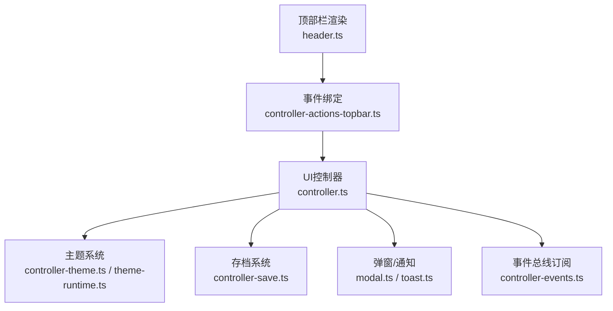
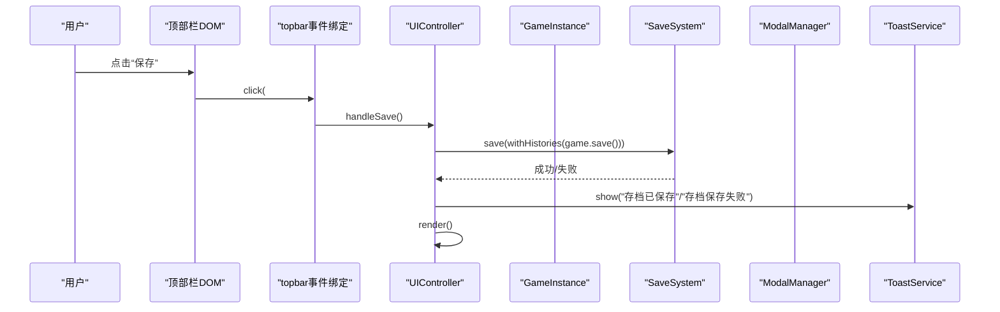
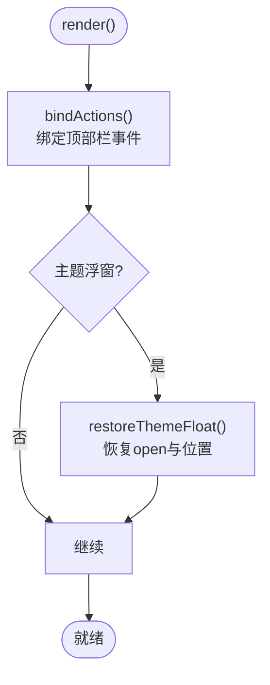
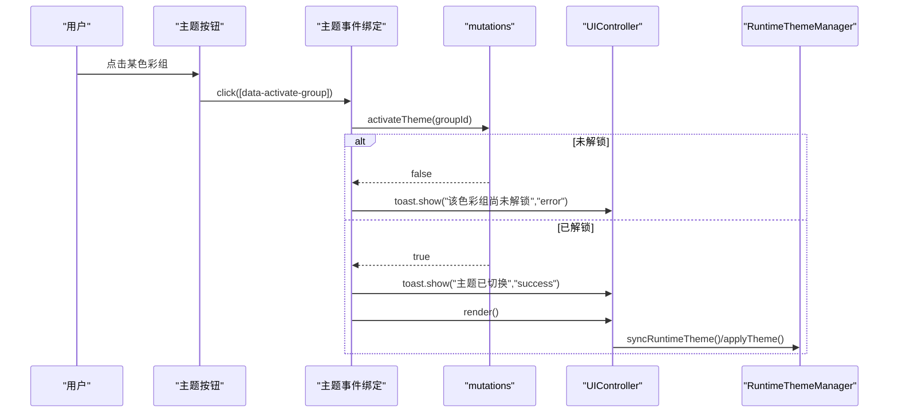
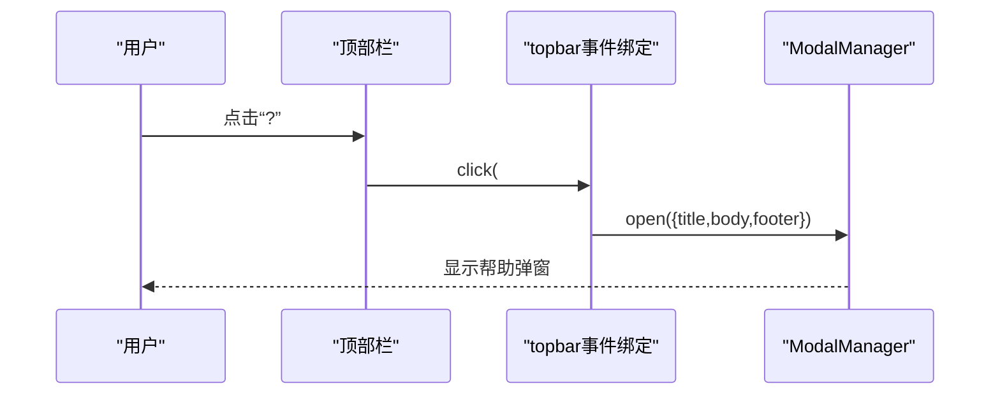
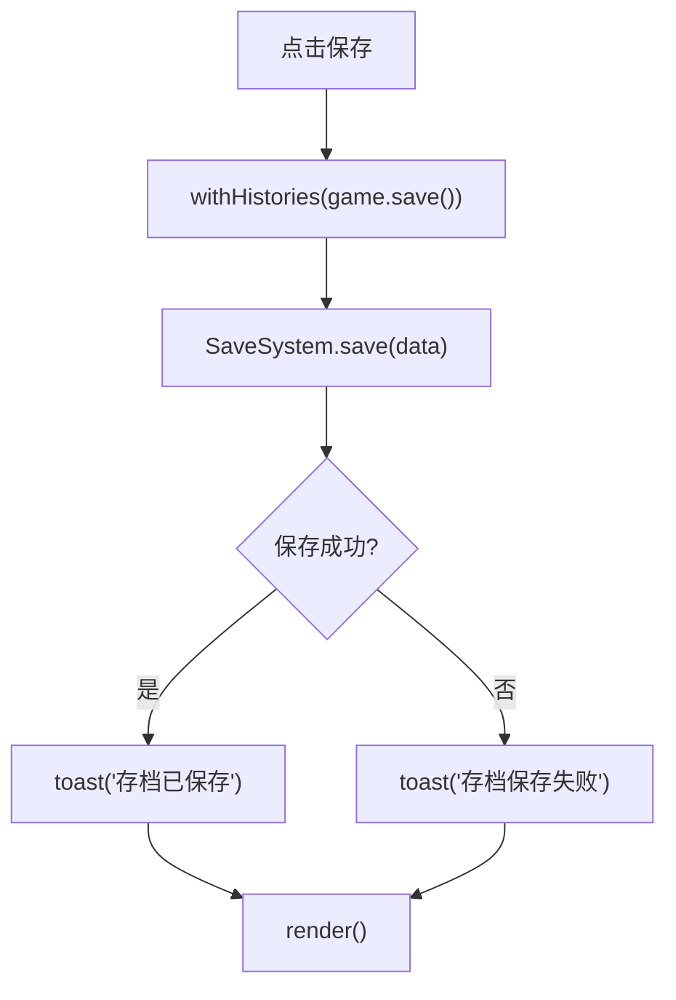
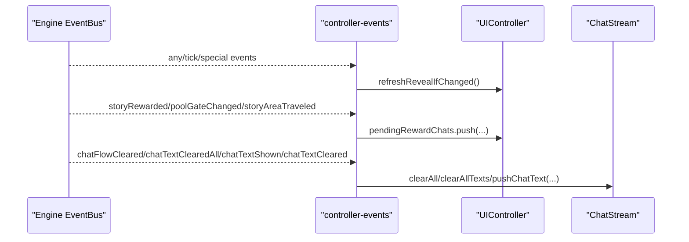
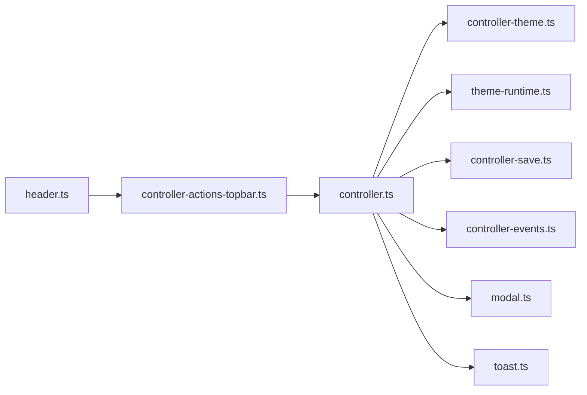

# 顶部栏事件处理

<cite>
**本文引用的文件**
- [src/ui/components/header.ts](file://src/ui/components/header.ts)
- [src/ui/controller-actions-topbar.ts](file://src/ui/controller-actions-topbar.ts)
- [src/ui/controller-theme.ts](file://src/ui/controller-theme.ts)
- [src/ui/controller-actions-theme.ts](file://src/ui/controller-actions-theme.ts)
- [src/ui/controller-save.ts](file://src/ui/controller-save.ts)
- [src/ui/controller-events.ts](file://src/ui/controller-events.ts)
- [src/ui/controller.ts](file://src/ui/controller.ts)
- [src/engine/core/theme-runtime.ts](file://src/engine/core/theme-runtime.ts)
- [src/ui/modal.ts](file://src/ui/modal.ts)
- [src/ui/components/toast.ts](file://src/ui/components/toast.ts)
</cite>

## 目录
1. [简介](#简介)
2. [项目结构](#项目结构)
3. [核心组件](#核心组件)
4. [架构总览](#架构总览)
5. [详细组件分析](#详细组件分析)
6. [依赖关系分析](#依赖关系分析)
7. [性能考量](#性能考量)
8. [故障排查指南](#故障排查指南)
9. [结论](#结论)
10. [附录：使用模式与示例路径](#附录使用模式与示例路径)

## 简介
本文件面向 ACProgram 的“顶部栏事件处理系统”，系统化说明顶部栏各交互元素（设置/主题、帮助、存档、新游戏、推进等）的事件绑定机制，以及从用户操作到游戏状态变更、UI 更新的完整流程。文档覆盖事件冒泡与委托、状态同步、主题系统、存档系统与聊天流系统的集成方式，并给出错误处理与异常恢复策略及具体代码片段路径。

## 项目结构
顶部栏由渲染层与事件绑定层分离：
- 渲染层负责生成顶部栏 HTML（主题面板、保存/读取/导入/图鉴/帮助按钮、资源条等）。
- 事件绑定层在每次 render 后为 DOM 节点注册事件处理器，将用户操作转发至 UIController 与引擎子系统。
- 主题系统通过运行时主题管理器维护多层叠加（玩家/场景/演出），并在渲染前后注入 CSS 变量。
- 存档系统提供本地持久化能力，供顶部栏“保存/读取”触发。
- 弹窗与通知用于帮助、主题浮窗、Toast 反馈。

图表来源
- [src/ui/components/header.ts:53-100](file://src/ui/components/header.ts#L53-L100)
- [src/ui/controller-actions-topbar.ts:12-121](file://src/ui/controller-actions-topbar.ts#L12-L121)
- [src/ui/controller.ts:139-225](file://src/ui/controller.ts#L139-L225)
- [src/ui/controller-theme.ts:37-127](file://src/ui/controller-theme.ts#L37-L127)
- [src/engine/core/theme-runtime.ts:56-199](file://src/engine/core/theme-runtime.ts#L56-L199)
- [src/ui/controller-save.ts:9-41](file://src/ui/controller-save.ts#L9-L41)
- [src/ui/modal.ts:56-100](file://src/ui/modal.ts#L56-L100)
- [src/ui/components/toast.ts:18-67](file://src/ui/components/toast.ts#L18-L67)
- [src/ui/controller-events.ts:12-88](file://src/ui/controller-events.ts#L12-L88)

章节来源
- [src/ui/components/header.ts:53-124](file://src/ui/components/header.ts#L53-L124)
- [src/ui/controller.ts:139-225](file://src/ui/controller.ts#L139-L225)

## 核心组件
- 顶部栏渲染：生成主题面板、保存/读取/导入/图鉴/帮助、资源条等。
- 顶部栏事件绑定：为顶栏按钮注册点击、拖拽、指针移动等事件，调用 UIController 方法或引擎 API。
- 主题系统：运行时主题管理（player/area/student/ephemeral 多层合并）、CSS 变量注入、层级优先级拖拽排序。
- 存档系统：本地保存/读取，带成功/失败提示与日志记录。
- 弹窗与通知：帮助弹窗、主题浮窗、Toast 统一反馈。
- 事件总线订阅：将引擎事件映射到 UI 行为（揭示刷新、奖励排队、聊天文本清理/显示等）。

章节来源
- [src/ui/components/header.ts:53-124](file://src/ui/components/header.ts#L53-L124)
- [src/ui/controller-actions-topbar.ts:12-121](file://src/ui/controller-actions-topbar.ts#L12-L121)
- [src/ui/controller-theme.ts:37-127](file://src/ui/controller-theme.ts#L37-L127)
- [src/ui/controller-actions-theme.ts:11-84](file://src/ui/controller-actions-theme.ts#L11-L84)
- [src/ui/controller-save.ts:9-41](file://src/ui/controller-save.ts#L9-L41)
- [src/ui/modal.ts:56-100](file://src/ui/modal.ts#L56-L100)
- [src/ui/components/toast.ts:18-67](file://src/ui/components/toast.ts#L18-L67)
- [src/ui/controller-events.ts:12-88](file://src/ui/controller-events.ts#L12-L88)

## 架构总览
顶部栏事件处理遵循“渲染 → 绑定 → 分发 → 状态变更 → 重新渲染/轻量更新”的闭环。关键路径如下：
- 用户点击顶部栏按钮 → 事件处理器调用 UIController 或引擎 API → 修改游戏状态或触发副作用 → 触发 render 或 refreshLight → 主题系统注入 CSS 变量 → UI 更新。
- 主题浮窗支持打开/关闭、拖拽标题栏移动；跨 render 重建保持开关键与位置。
- 存档操作通过 SaveSystem 读写本地存储，并提供 Toast 反馈。
- 引擎 EventBus 驱动非交互式 UI 更新（如揭示变化、奖励排队、聊天文本清理/显示）。

图表来源
- [src/ui/controller-actions-topbar.ts:12-22](file://src/ui/controller-actions-topbar.ts#L12-L22)
- [src/ui/controller-save.ts:9-18](file://src/ui/controller-save.ts#L9-L18)
- [src/ui/controller.ts:189-225](file://src/ui/controller.ts#L189-L225)
- [src/ui/modal.ts:56-100](file://src/ui/modal.ts#L56-L100)
- [src/ui/components/toast.ts:18-67](file://src/ui/components/toast.ts#L18-L67)

章节来源
- [src/ui/controller-actions-topbar.ts:12-121](file://src/ui/controller-actions-topbar.ts#L12-L121)
- [src/ui/controller.ts:189-225](file://src/ui/controller.ts#L189-L225)

## 详细组件分析

### 顶部栏渲染与事件绑定
- 顶部栏 HTML 包含主题面板、保存/读取/导入/图鉴/帮助、资源条等。
- 事件绑定在 render 后执行，按 ID 或 data-* 选择器绑定点击、拖拽、指针事件。
- 主题浮窗支持打开/关闭、拖拽标题栏移动，位置信息保存在控制器中以便跨 render 恢复。

图表来源
- [src/ui/controller.ts:189-225](file://src/ui/controller.ts#L189-L225)
- [src/ui/controller-theme.ts:16-29](file://src/ui/controller-theme.ts#L16-L29)
- [src/ui/controller-actions-topbar.ts:23-66](file://src/ui/controller-actions-topbar.ts#L23-L66)

章节来源
- [src/ui/components/header.ts:53-100](file://src/ui/components/header.ts#L53-L100)
- [src/ui/controller-actions-topbar.ts:12-121](file://src/ui/controller-actions-topbar.ts#L12-L121)

### 主题切换与层级优先级
- 主题切换：点击色彩组按钮 → 调用 mutations.activateTheme(groupId) → 若未解锁则 Toast 提示 → 否则成功提示并 render。
- 层级优先级：HTML5 拖拽行重排 → 计算展示序与引擎序反转 → 调用 mutations.setThemeLayerOrder([...]) → render。
- 运行时主题：在 render 前同步 player/area/student 层，再注入 CSS 变量；主题浮窗跨 render 存活。

图表来源
- [src/ui/controller-actions-theme.ts:11-23](file://src/ui/controller-actions-theme.ts#L11-L23)
- [src/ui/controller-theme.ts:37-127](file://src/ui/controller-theme.ts#L37-L127)
- [src/engine/core/theme-runtime.ts:56-199](file://src/engine/core/theme-runtime.ts#L56-L199)

章节来源
- [src/ui/controller-actions-theme.ts:11-84](file://src/ui/controller-actions-theme.ts#L11-L84)
- [src/ui/controller-theme.ts:37-127](file://src/ui/controller-theme.ts#L37-L127)
- [src/engine/core/theme-runtime.ts:56-199](file://src/engine/core/theme-runtime.ts#L56-L199)

### 帮助菜单与主题浮窗
- 帮助菜单：点击“?” → 打开 ModalManager 弹窗，展示使用说明与示例用法。
- 主题浮窗：点击“主题”按钮切换 open 类名；拖拽标题栏移动，位置保存到控制器；关闭按钮阻止事件冒泡并移除 open 类。

图表来源
- [src/ui/controller-actions-topbar.ts:67-76](file://src/ui/controller-actions-topbar.ts#L67-L76)
- [src/ui/modal.ts:56-100](file://src/ui/modal.ts#L56-L100)

章节来源
- [src/ui/controller-actions-topbar.ts:23-76](file://src/ui/controller-actions-topbar.ts#L23-L76)
- [src/ui/modal.ts:56-100](file://src/ui/modal.ts#L56-L100)

### 存档系统集成
- 保存：点击“保存” → 调用 SaveSystem.save(withHistories(game.save())) → 记录日志与 Toast → render。
- 读取：点击“读取” → LoadData → game.load → 解锁当前世界线 → resetSessionPanel → restoreHistories → Toast → render。
- 新游戏：彻底重置游戏状态、删除本地存档、回到世界线选择界面。

图表来源
- [src/ui/controller-save.ts:9-18](file://src/ui/controller-save.ts#L9-L18)
- [src/ui/controller-actions-topbar.ts:77-87](file://src/ui/controller-actions-topbar.ts#L77-L87)

章节来源
- [src/ui/controller-save.ts:9-41](file://src/ui/controller-save.ts#L9-L41)
- [src/ui/controller-actions-topbar.ts:77-87](file://src/ui/controller-actions-topbar.ts#L77-L87)

### 事件总线与聊天流集成
- 引擎事件驱动 UI 更新：揭示条件变化时刷新 UI；剧情奖励排队；池 gate 解锁提示；移动区域提示；聊天文本清理/显示。
- 这些事件在 mount 时一次性订阅，避免重复绑定。

图表来源
- [src/ui/controller-events.ts:12-88](file://src/ui/controller-events.ts#L12-L88)

章节来源
- [src/ui/controller-events.ts:12-88](file://src/ui/controller-events.ts#L12-L88)

## 依赖关系分析
- 顶部栏渲染依赖 UIContext 与颜色系统提供的主题选项与资源显示定义。
- 事件绑定依赖 UIController 暴露的方法（render、reset、startNewGame、resumeInit、io.importDatapack 等）。
- 主题系统依赖 RuntimeThemeManager 的多层合并与解析器（ColorSystem）。
- 存档系统依赖 SaveSystem 的本地存储接口。
- 弹窗与通知作为通用基础设施被多处复用。

图表来源
- [src/ui/components/header.ts:53-100](file://src/ui/components/header.ts#L53-L100)
- [src/ui/controller-actions-topbar.ts:12-121](file://src/ui/controller-actions-topbar.ts#L12-L121)
- [src/ui/controller.ts:139-225](file://src/ui/controller.ts#L139-L225)
- [src/ui/controller-theme.ts:37-127](file://src/ui/controller-theme.ts#L37-L127)
- [src/engine/core/theme-runtime.ts:56-199](file://src/engine/core/theme-runtime.ts#L56-L199)
- [src/ui/controller-save.ts:9-41](file://src/ui/controller-save.ts#L9-L41)
- [src/ui/modal.ts:56-100](file://src/ui/modal.ts#L56-L100)
- [src/ui/components/toast.ts:18-67](file://src/ui/components/toast.ts#L18-L67)
- [src/ui/controller-events.ts:12-88](file://src/ui/controller-events.ts#L12-L88)

章节来源
- [src/ui/controller.ts:139-225](file://src/ui/controller.ts#L139-L225)

## 性能考量
- 轻量刷新：每 Tick 仅更新资源数字节点，不重建 #app DOM，减少重排重绘。
- 主题注入时机：在 DOM 生成前同步运行时主题层，确保色胶囊等依赖层状态的 UI 正确显示。
- 事件订阅：EventBus 订阅在 mount 时一次性绑定，避免重复开销。
- 弹窗与通知：body 级挂载，独立于 #app 重建周期，降低重建成本。

[本节为通用性能建议，无需特定文件引用]

## 故障排查指南
- 主题切换失败：检查是否已解锁对应色彩组；若未解锁会收到错误 Toast。
- 主题浮窗丢失：确认 render 后调用 restoreThemeFloat；检查控制器中 themeFloatOpen 与 themeFloatPos 是否正确保存。
- 存档失败：查看日志与 Toast；确认 SaveSystem 可用性与磁盘权限。
- 帮助弹窗无法关闭：检查 modal 的 dismissable 配置与 Esc 键监听。
- 聊天文本异常：检查 EventBus 的 chatTextClearedAll/chatTextCleared 事件是否被正确处理。

章节来源
- [src/ui/controller-actions-theme.ts:11-23](file://src/ui/controller-actions-theme.ts#L11-L23)
- [src/ui/controller-theme.ts:16-29](file://src/ui/controller-theme.ts#L16-L29)
- [src/ui/controller-save.ts:9-41](file://src/ui/controller-save.ts#L9-L41)
- [src/ui/modal.ts:56-100](file://src/ui/modal.ts#L56-L100)
- [src/ui/controller-events.ts:49-88](file://src/ui/controller-events.ts#L49-L88)

## 结论
顶部栏事件处理以清晰的职责分层实现：渲染与事件绑定分离、主题系统多层叠加、存档系统可靠持久化、弹窗与通知统一反馈、事件总线驱动非交互式更新。通过严格的状态同步与渲染时序控制，保证用户操作到 UI 更新的一致性与性能。

[本节为总结性内容，无需特定文件引用]

## 附录：使用模式与示例路径
- 顶部栏渲染入口：[header.ts:53-100](file://src/ui/components/header.ts#L53-L100)
- 顶部栏事件绑定：[controller-actions-topbar.ts:12-121](file://src/ui/controller-actions-topbar.ts#L12-L121)
- 主题切换事件：[controller-actions-theme.ts:11-23](file://src/ui/controller-actions-theme.ts#L11-L23)
- 主题浮窗拖拽：[controller-actions-topbar.ts:36-66](file://src/ui/controller-actions-topbar.ts#L36-L66)
- 主题运行时注入：[controller-theme.ts:37-127](file://src/ui/controller-theme.ts#L37-L127)
- 主题层顺序管理：[theme-runtime.ts:74-84](file://src/engine/core/theme-runtime.ts#L74-L84)
- 存档保存/读取：[controller-save.ts:9-41](file://src/ui/controller-save.ts#L9-L41)
- 帮助弹窗：[controller-actions-topbar.ts:67-76](file://src/ui/controller-actions-topbar.ts#L67-L76), [modal.ts:56-100](file://src/ui/modal.ts#L56-L100)
- 事件总线订阅：[controller-events.ts:12-88](file://src/ui/controller-events.ts#L12-L88)
- Toast 通知：[toast.ts:18-67](file://src/ui/components/toast.ts#L18-L67)