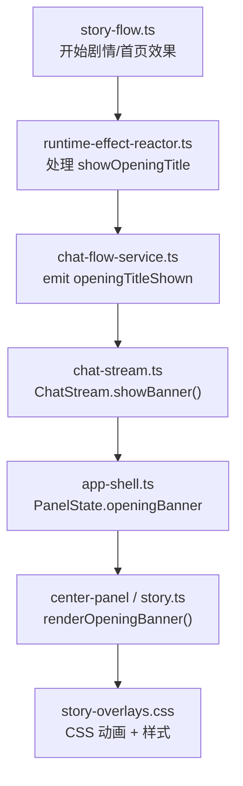
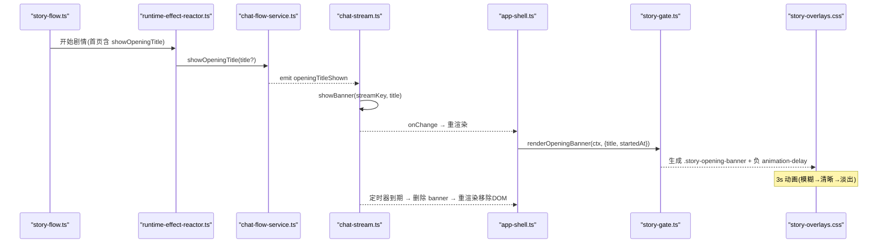
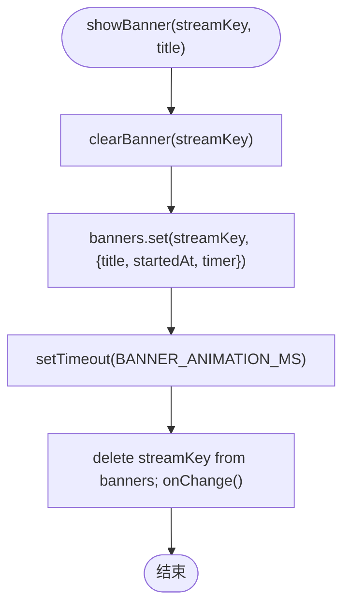
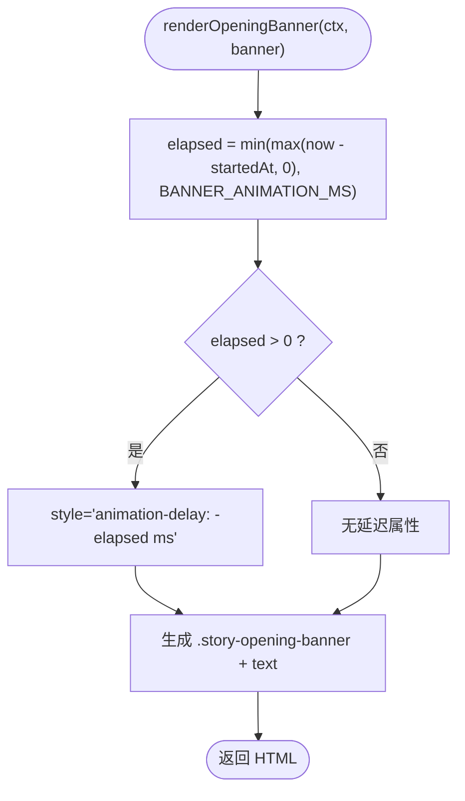
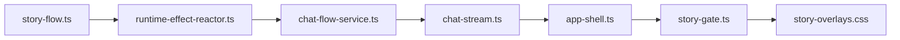

# 开场横幅系统

<cite>
**本文引用的文件**
- [src/ui/main.ts](file://src/ui/main.ts)
- [src/ui/components/app-shell.ts](file://src/ui/components/app-shell.ts)
- [src/ui/components/story-gate.ts](file://src/ui/components/story-gate.ts)
- [src/ui/chat-stream.ts](file://src/ui/chat-stream.ts)
- [src/ui/css/story-overlays.css](file://src/ui/css/story-overlays.css)
- [src/engine/game/chat-flow-service.ts](file://src/engine/game/chat-flow-service.ts)
- [src/engine/effect/runtime-effect-reactor.ts](file://src/engine/effect/runtime-effect-reactor.ts)
- [src/engine/game/story-flow.ts](file://src/engine/game/story-flow.ts)
- [tests/ui/story-gate.test.ts](file://tests/ui/story-gate.test.ts)
- [tests/ui/components/story-gate.test.ts](file://tests/ui/components/story-gate.test.ts)
</cite>

## 目录
1. [简介](#简介)
2. [项目结构](#项目结构)
3. [核心组件](#核心组件)
4. [架构总览](#架构总览)
5. [详细组件分析](#详细组件分析)
6. [依赖关系分析](#依赖关系分析)
7. [性能与可访问性](#性能与可访问性)
8. [故障排查指南](#故障排查指南)
9. [结论](#结论)

## 简介
本文件聚焦于“开场横幅系统”：当剧情或羁绊剧情开始时，在聊天流中央以横幅形式展示标题，并在固定时长后自动消失。该系统由引擎侧效果驱动、UI 侧状态管理与渲染协作完成，具备断点续播动画、多流隔离、以及演示期阻断交互等特性。

## 项目结构
开场横幅系统横跨 UI 层与引擎层：
- 引擎侧通过运行时效果将“呼出开幕标题”事件广播到 UI。
- UI 侧维护当前活跃流的横幅状态，计算并渲染横幅 DOM，配合 CSS 动画实现淡入/保持/淡出。
- 面板渲染时读取横幅快照，注入到聊天视图进行叠加显示。

图表来源
- [src/engine/game/story-flow.ts:41-44](file://src/engine/game/story-flow.ts#L41-L44)
- [src/engine/effect/runtime-effect-reactor.ts:54-55](file://src/engine/effect/runtime-effect-reactor.ts#L54-L55)
- [src/engine/game/chat-flow-service.ts:38-41](file://src/engine/game/chat-flow-service.ts#L38-L41)
- [src/ui/chat-stream.ts:75-87](file://src/ui/chat-stream.ts#L75-L87)
- [src/ui/components/app-shell.ts:57-74](file://src/ui/components/app-shell.ts#L57-L74)
- [src/ui/components/story-gate.ts:109-116](file://src/ui/components/story-gate.ts#L109-L116)
- [src/ui/css/story-overlays.css:205-245](file://src/ui/css/story-overlays.css#L205-L245)

章节来源
- [src/ui/main.ts:1-35](file://src/ui/main.ts#L1-L35)

## 核心组件
- ChatStream（聊天流）：管理各聊天流的节奏门控与开幕横幅状态；提供 showBanner/activeBanner/bannerBlocking 等方法。
- StoryGate 渲染：提供 renderOpeningBanner，根据 startedAt 计算负 animation-delay 实现断点续播。
- PanelState 与 App Shell：承载 openingBanner 快照，并在渲染中心面板时传入聊天视图。
- ChatFlowService：引擎到 UI 的桥接，将 showOpeningTitle 效果转为 openingTitleShown 事件。
- RuntimeEffectReactor：解析运行时效果，调用 chat-flow-service.showOpeningTitle。
- StoryFlow：在剧情开始时检查首页 Talklet 是否声明 showOpeningTitle，立即呼出横幅。
- CSS：story-overlays.css 定义横幅样式与动画，使用主题变量与自定义属性便于换肤。

章节来源
- [src/ui/chat-stream.ts:43-106](file://src/ui/chat-stream.ts#L43-L106)
- [src/ui/components/story-gate.ts:14-21](file://src/ui/components/story-gate.ts#L14-L21)
- [src/ui/components/story-gate.ts:104-116](file://src/ui/components/story-gate.ts#L104-L116)
- [src/ui/components/app-shell.ts:11-15](file://src/ui/components/app-shell.ts#L11-L15)
- [src/ui/components/app-shell.ts:57-74](file://src/ui/components/app-shell.ts#L57-L74)
- [src/engine/game/chat-flow-service.ts:38-41](file://src/engine/game/chat-flow-service.ts#L38-L41)
- [src/engine/effect/runtime-effect-reactor.ts:54-55](file://src/engine/effect/runtime-effect-reactor.ts#L54-L55)
- [src/engine/game/story-flow.ts:41-44](file://src/engine/game/story-flow.ts#L41-L44)
- [src/ui/css/story-overlays.css:205-245](file://src/ui/css/story-overlays.css#L205-L245)

## 架构总览
开场横幅的生命周期如下：
1) 剧情开始：story-flow 检测首页 Talklet 是否包含 showOpeningTitle 效果，若有则立即触发。
2) 效果执行：runtime-effect-reactor 识别该效果，调用 chat-flow-service.showOpeningTitle(title?)。
3) 事件广播：chat-flow-service 发出 openingTitleShown 事件（带 title 或空）。
4) UI 订阅：控制器/聊天流订阅该事件，调用 ChatStream.showBanner(streamKey, title)。
5) 状态更新：ChatStream 记录 banner 的 title 与 startedAt，并设置定时器在 BANNER_ANIMATION_MS 后清除。
6) 渲染：每次聊天流重渲染前，读取 activeBanner(panelState) 写入 PanelState.openopeningBanner，再由 center-panel/story 渲染横幅 DOM。
7) 动画与结束：CSS 动画控制淡入/保持/淡出；定时器到期后移除 DOM，恢复交互。

图表来源
- [src/engine/game/story-flow.ts:41-44](file://src/engine/game/story-flow.ts#L41-L44)
- [src/engine/effect/runtime-effect-reactor.ts:54-55](file://src/engine/effect/runtime-effect-reactor.ts#L54-L55)
- [src/engine/game/chat-flow-service.ts:38-41](file://src/engine/game/chat-flow-service.ts#L38-L41)
- [src/ui/chat-stream.ts:75-87](file://src/ui/chat-stream.ts#L75-L87)
- [src/ui/components/app-shell.ts:57-74](file://src/ui/components/app-shell.ts#L57-L74)
- [src/ui/components/story-gate.ts:109-116](file://src/ui/components/story-gate.ts#L109-L116)
- [src/ui/css/story-overlays.css:205-245](file://src/ui/css/story-overlays.css#L205-L245)

## 详细组件分析

### ChatStream：横幅状态机与生命周期
- 职责：维护 banners Map（streamKey → BannerState），提供 showBanner/activeBanner/bannerBlocking/clearBanner。
- 关键点：
  - showBanner：记录 startedAt，设置定时器在 BANNER_ANIMATION_MS 后删除并触发 onChange。
  - activeBanner：按 conversationVariantId 或全局流返回快照 {title, startedAt}。
  - bannerBlocking：用于演示期阻断推进类点击。
  - clearBanner：清理计时器与条目，避免重复呼出导致闪烁。

图表来源
- [src/ui/chat-stream.ts:75-87](file://src/ui/chat-stream.ts#L75-L87)
- [src/ui/chat-stream.ts:100-106](file://src/ui/chat-stream.ts#L100-L106)

章节来源
- [src/ui/chat-stream.ts:43-106](file://src/ui/chat-stream.ts#L43-L106)

### StoryGate 渲染：断点续播与标题解析
- renderOpeningBanner：根据 startedAt 计算 elapsed，输出负的 animation-delay 以断点续播，确保频繁重渲染不闪动。
- storyDisplayTitle：优先级为 entry.openingTitle > StoryDef.name > entryId，用于确认浮层与横幅回退标题。

图表来源
- [src/ui/components/story-gate.ts:104-116](file://src/ui/components/story-gate.ts#L104-L116)

章节来源
- [src/ui/components/story-gate.ts:14-21](file://src/ui/components/story-gate.ts#L14-L21)
- [src/ui/components/story-gate.ts:104-116](file://src/ui/components/story-gate.ts#L104-L116)

### App Shell 与中心面板：横幅注入
- PanelState.openingBanner：保存当前活跃流的横幅快照。
- renderAppShell：将 openingBanner 传递给中心面板渲染函数，最终由聊天视图渲染横幅覆盖层。

章节来源
- [src/ui/components/app-shell.ts:11-15](file://src/ui/components/app-shell.ts#L11-L15)
- [src/ui/components/app-shell.ts:57-74](file://src/ui/components/app-shell.ts#L57-L74)

### 引擎侧：效果到事件的转换
- runtime-effect-reactor：识别 showOpeningTitle 效果，调用 chat-flow-service.showOpeningTitle(value)。
- chat-flow-service：统一入口，发出 openingTitleShown 事件（可选 title）。
- story-flow：在开始剧情时检查首页 Talklet 是否包含 showOpeningTitle，若存在则立即呼出横幅；后续推进跳过该效果以避免重复。

章节来源
- [src/engine/effect/runtime-effect-reactor.ts:54-55](file://src/engine/effect/runtime-effect-reactor.ts#L54-L55)
- [src/engine/game/chat-flow-service.ts:38-41](file://src/engine/game/chat-flow-service.ts#L38-L41)
- [src/engine/game/story-flow.ts:41-44](file://src/engine/game/story-flow.ts#L41-L44)
- [src/engine/game/story-flow.ts:290-292](file://src/engine/game/story-flow.ts#L290-L292)

### 样式与动画：非阻塞、可定制
- story-overlays.css：定义 .story-opening-banner 及其文本样式，使用主题变量与自定义属性 --story-banner-* 支持换肤。
- 动画：story-banner-life 总时长与 JS 常量一致（3s），包含模糊出现、保持、淡出；支持 prefers-reduced-motion 降级为静态淡出。
- 非阻塞：pointer-events: none，允许用户继续操作聊天区。

章节来源
- [src/ui/css/story-overlays.css:205-245](file://src/ui/css/story-overlays.css#L205-L245)

## 依赖关系分析
- 常量共享：BANNER_ANIMATION_MS 在 story-gate.ts 中定义，被 chat-stream.ts 引用，保证 JS 定时器与 CSS 动画时长一致。
- 数据流：story-flow → runtime-effect-reactor → chat-flow-service → ChatStream → PanelState → 渲染。
- 交互阻断：bannerBlocking 在演示期阻止剧情推进类点击，结束后恢复。

图表来源
- [src/engine/game/story-flow.ts:41-44](file://src/engine/game/story-flow.ts#L41-L44)
- [src/engine/effect/runtime-effect-reactor.ts:54-55](file://src/engine/effect/runtime-effect-reactor.ts#L54-L55)
- [src/engine/game/chat-flow-service.ts:38-41](file://src/engine/game/chat-flow-service.ts#L38-L41)
- [src/ui/chat-stream.ts:75-87](file://src/ui/chat-stream.ts#L75-L87)
- [src/ui/components/app-shell.ts:57-74](file://src/ui/components/app-shell.ts#L57-L74)
- [src/ui/components/story-gate.ts:109-116](file://src/ui/components/story-gate.ts#L109-L116)
- [src/ui/css/story-overlays.css:205-245](file://src/ui/css/story-overlays.css#L205-L245)

章节来源
- [src/ui/components/story-gate.ts:14-21](file://src/ui/components/story-gate.ts#L14-L21)
- [src/ui/chat-stream.ts:75-98](file://src/ui/chat-stream.ts#L75-L98)

## 性能与可访问性
- 性能：
  - 使用单例 ChatStream 管理横幅状态，避免重复计时器与内存泄漏。
  - 断点续播通过负 animation-delay 减少重渲染导致的动画重置开销。
  - 演示期阻断避免无效交互引发的状态抖动。
- 可访问性：
  - 支持 prefers-reduced-motion 降级动画，提升无障碍体验。
  - 横幅为非阻塞（pointer-events: none），不影响键盘导航与屏幕阅读器。

[本节为通用指导，不直接分析具体文件]

## 故障排查指南
- 横幅未显示：
  - 检查剧情首页是否声明 showOpeningTitle 效果。
  - 确认 ChatFlowService 已发出 openingTitleShown 事件，且 ChatStream.showBanner 被调用。
  - 验证 BANNER_ANIMATION_MS 与 CSS 动画时长一致。
- 横幅闪烁或重复播放：
  - 确认同流重复呼出会先清旧计时器（clearBanner）。
  - 检查频繁重渲染场景下 renderOpeningBanner 是否正确计算 elapsed 并应用负延迟。
- 演示期无法推进：
  - 这是预期行为：bannerBlocking 在横幅展示/淡出期间阻断推进类点击。
  - 等待定时器到期或等待 CSS 动画结束，交互将自动恢复。
- 测试用例参考：
  - 连续播放与断点续播：见 tests/ui/story-gate.test.ts 与 tests/ui/components/story-gate.test.ts。

章节来源
- [tests/ui/story-gate.test.ts:115-163](file://tests/ui/story-gate.test.ts#L115-L163)
- [tests/ui/components/story-gate.test.ts:93-102](file://tests/ui/components/story-gate.test.ts#L93-L102)

## 结论
开场横幅系统通过引擎效果驱动与 UI 状态管理协同工作，实现了稳定、可中断、可定制的标题展示体验。其设计要点包括：
- 单一事实源（BANNER_ANIMATION_MS）保证 JS/CSS 同步。
- 断点续播机制确保频繁重渲染下的动画连续性。
- 演示期交互阻断保障演出节奏。
- 主题化与无障碍支持提升可定制性与可用性。

[本节为总结，不直接分析具体文件]