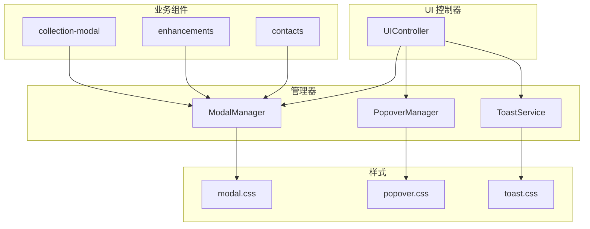
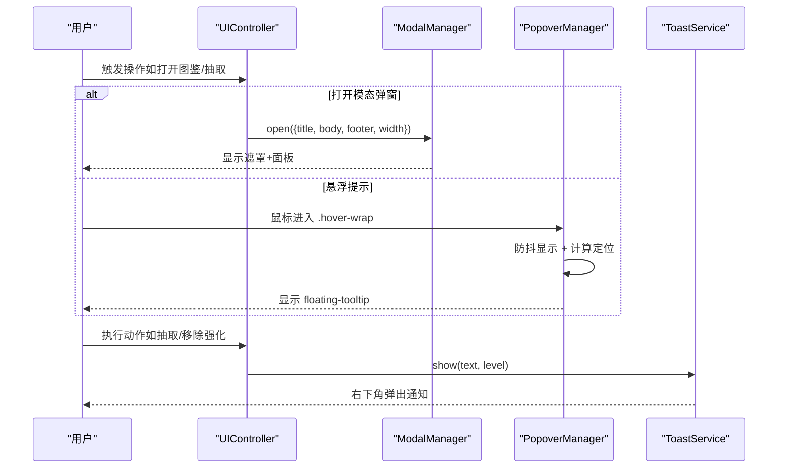
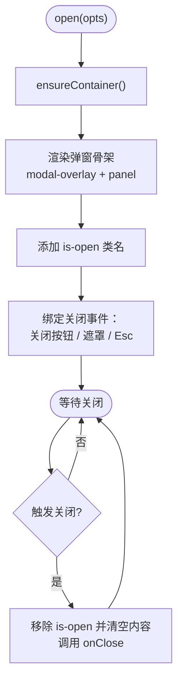
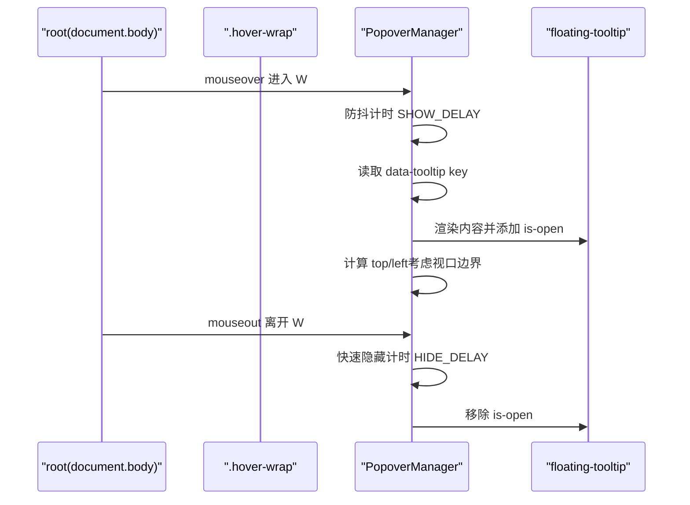
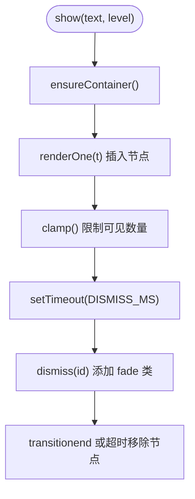
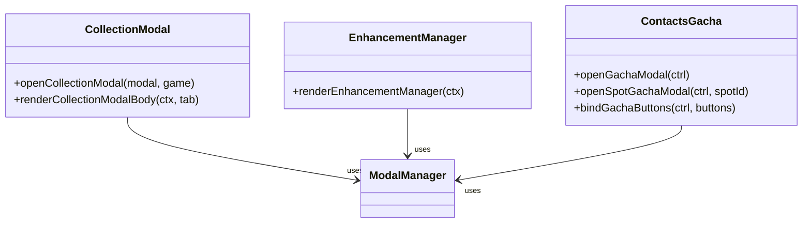
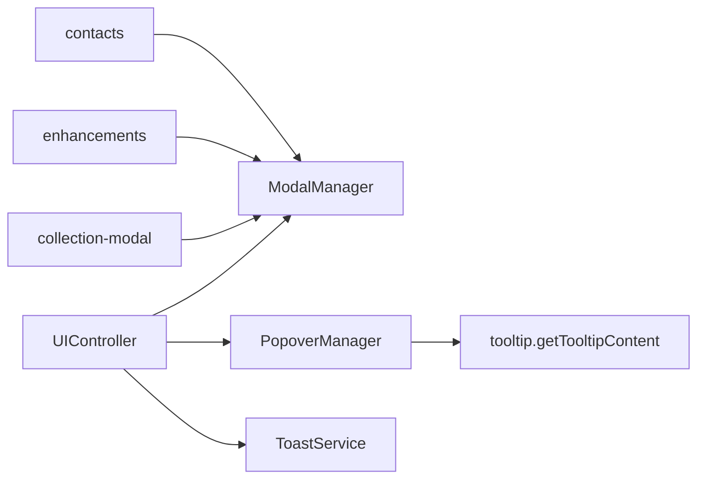

# 弹窗系统

<cite>
**本文引用的文件**
- [src/ui/modal.ts](file://src/ui/modal.ts)
- [src/ui/popovers.ts](file://src/ui/popovers.ts)
- [src/ui/controller-modals.ts](file://src/ui/controller-modals.ts)
- [src/ui/components/collection-modal.ts](file://src/ui/components/collection-modal.ts)
- [src/ui/components/toast.ts](file://src/ui/components/toast.ts)
- [src/ui/components/tooltip.ts](file://src/ui/components/tooltip.ts)
- [src/ui/components/enhancements.ts](file://src/ui/components/enhancements.ts)
- [src/ui/components/contacts.ts](file://src/ui/components/contacts.ts)
- [src/ui/controller.ts](file://src/ui/controller.ts)
- [src/ui/css/modal.css](file://src/ui/css/modal.css)
- [src/ui/css/popover.css](file://src/ui/css/popover.css)
- [src/ui/css/toast.css](file://src/ui/css/toast.css)
</cite>

## 目录
1. [简介](#简介)
2. [项目结构](#项目结构)
3. [核心组件](#核心组件)
4. [架构总览](#架构总览)
5. [详细组件分析](#详细组件分析)
6. [依赖关系分析](#依赖关系分析)
7. [性能考量](#性能考量)
8. [故障排查指南](#故障排查指南)
9. [结论](#结论)
10. [附录：开发规范与最佳实践](#附录：开发规范与最佳实践)

## 简介
本技术文档围绕 ACProgram 的弹窗系统展开，系统性梳理 ModalManager（模态弹窗管理器）、PopoverManager（悬浮提示管理器）以及 ToastService（全局通知服务）的设计与实现。文档覆盖弹窗生命周期、层级管理、焦点控制、定位算法、边界检测、交互处理、可访问性支持，并给出收藏弹窗、强化管理弹窗、招募补给弹窗等具体组件的实现说明与使用方式。最后提供弹窗开发规范与最佳实践，帮助开发者在保持 UI 一致性的同时提升可维护性与性能。

## 项目结构
弹窗系统由“容器层 + 管理器 + 业务组件 + 样式”构成：
- 容器层：UIController 作为门面，统一持有 ModalManager、ToastService、PopoverManager 实例，并在挂载时初始化 PopoverManager 的事件委托。
- 管理器层：ModalManager 负责模态弹窗的生命周期与键盘交互；PopoverManager 负责悬浮提示的定位与显示隐藏；ToastService 负责通知消息的入队、渲染与自动消隐。
- 业务组件层：collection-modal、enhancements、contacts 等组件通过控制器函数打开对应弹窗或触发行为。
- 样式层：modal.css、popover.css、toast.css 分别定义弹窗、悬浮提示与通知的视觉与动画。

图表来源
- [src/ui/controller.ts:61-137](file://src/ui/controller.ts#L61-L137)
- [src/ui/modal.ts:56-100](file://src/ui/modal.ts#L56-L100)
- [src/ui/popovers.ts:19-131](file://src/ui/popovers.ts#L19-L131)
- [src/ui/components/toast.ts:18-68](file://src/ui/components/toast.ts#L18-L68)
- [src/ui/components/collection-modal.ts:68-95](file://src/ui/components/collection-modal.ts#L68-L95)
- [src/ui/components/enhancements.ts:108-136](file://src/ui/components/enhancements.ts#L108-L136)
- [src/ui/components/contacts.ts:1-200](file://src/ui/components/contacts.ts#L1-L200)
- [src/ui/css/modal.css:7-102](file://src/ui/css/modal.css#L7-L102)
- [src/ui/css/popover.css:7-62](file://src/ui/css/popover.css#L7-L62)
- [src/ui/css/toast.css:7-70](file://src/ui/css/toast.css#L7-L70)

章节来源
- [src/ui/controller.ts:61-137](file://src/ui/controller.ts#L61-L137)

## 核心组件
- ModalManager：提供 open/close/isOpen 能力，挂载于 body 级 .app-modal，内部渲染 modal-overlay、modal-panel、modal-head/body/foot，支持 Esc 关闭与遮罩点击关闭（可配置 dismissable）。
- PopoverManager：基于事件委托监听 root（document.body），对 .hover-wrap[data-tooltip] 进行 hover 防抖显示，计算浮动提示位置并进行视口边界检测，避免溢出。
- ToastService：body 级 #toast-layer 容器，按 level 渲染 toast-message，支持最多可见条数限制与淡出消隐。
- Tooltip 内容路由：getTooltipContent 根据 key 前缀分发到不同详情渲染器，供 PopoverManager 注入 floating-tooltip。

章节来源
- [src/ui/modal.ts:14-100](file://src/ui/modal.ts#L14-L100)
- [src/ui/popovers.ts:19-131](file://src/ui/popovers.ts#L19-L131)
- [src/ui/components/toast.ts:18-68](file://src/ui/components/toast.ts#L18-L68)
- [src/ui/components/tooltip.ts:30-78](file://src/ui/components/tooltip.ts#L30-L78)

## 架构总览
弹窗系统采用“管理器 + 组件 + 样式”的分层设计，UIController 作为入口协调各管理器。弹窗与页面内容解耦：弹窗与浮层均挂载于 body，独立于 #app 的重建周期，确保跨 DOM 重建仍稳定可用。

图表来源
- [src/ui/controller.ts:110-137](file://src/ui/controller.ts#L110-L137)
- [src/ui/modal.ts:60-99](file://src/ui/modal.ts#L60-L99)
- [src/ui/popovers.ts:42-131](file://src/ui/popovers.ts#L42-L131)
- [src/ui/components/toast.ts:22-68](file://src/ui/components/toast.ts#L22-L68)

## 详细组件分析

### ModalManager（模态弹窗管理器）
- 生命周期
  - open：确保 body 容器存在，渲染弹窗骨架，添加 is-open 类名，保存 onClose 回调。
  - close：移除 is-open，清空 innerHTML，调用 onClose。
  - isOpen：查询当前是否处于打开状态。
- 层级管理
  - 容器 .app-modal 固定定位，z-index 较高，确保覆盖主界面。
  - 遮罩 .modal-overlay 与面板 .modal-panel 组合，面板最大宽度与高度受 CSS 约束。
- 焦点与交互
  - 支持右上角关闭按钮与遮罩点击关闭（当 dismissable 为 true）。
  - 全局 Escape 键关闭弹窗。
  - 标题区域使用 eyebrow 展示，面板头部包含关闭按钮 aria-label。
- 可访问性
  - 面板设置 role="dialog" 与 aria-modal="true"，便于屏幕阅读器识别。
- 样式要点
  - 遮罩半透明背景与模糊效果，面板圆角阴影，响应式适配移动端。

图表来源
- [src/ui/modal.ts:60-99](file://src/ui/modal.ts#L60-L99)
- [src/ui/css/modal.css:7-102](file://src/ui/css/modal.css#L7-L102)

章节来源
- [src/ui/modal.ts:14-100](file://src/ui/modal.ts#L14-L100)
- [src/ui/css/modal.css:7-102](file://src/ui/css/modal.css#L7-L102)

### PopoverManager（悬浮提示管理器）
- 事件委托
  - 在 root（document.body）上监听 mouseover/mouseout，查找最近的 .hover-wrap[data-tooltip]。
  - 进入 wrap 后延迟 SHOW_DELAY 再显示，移出 wrap 且未进入另一 wrap 则快速隐藏 HIDE_DELAY。
- 定位算法与边界检测
  - 获取锚点与浮层的 getBoundingClientRect，结合视口宽高 vw/vh 与 GAP 边距。
  - 优先将浮层置于锚点下方，若超出底部则翻转至上方；水平方向右对齐锚点右侧，必要时左移或右移至不溢出视口。
- 内容生成
  - 通过 createUIContext 与 getTooltipContent 解析 data-tooltip 的 key，返回 info-popover HTML 注入 floating-tooltip。
- 生命周期与重建兼容
  - retainIfAnchored：在全量重建 #app 前检查当前浮层锚点是否仍在文档中，若已移除则关闭浮层，避免陈旧残留。

图表来源
- [src/ui/popovers.ts:42-131](file://src/ui/popovers.ts#L42-L131)
- [src/ui/components/tooltip.ts:30-78](file://src/ui/components/tooltip.ts#L30-L78)
- [src/ui/css/popover.css:39-62](file://src/ui/css/popover.css#L39-L62)

章节来源
- [src/ui/popovers.ts:19-131](file://src/ui/popovers.ts#L19-L131)
- [src/ui/components/tooltip.ts:30-78](file://src/ui/components/tooltip.ts#L30-L78)
- [src/ui/css/popover.css:7-62](file://src/ui/css/popover.css#L7-L62)

### ToastService（全局通知服务）
- 功能特性
  - show(text, level)：创建 #toast-layer 容器，渲染 toast-message，支持 success/error/info 三种级别。
  - 自动消隐：DISMISS_MS 后添加 fade-out 类，过渡结束后移除节点；兜底定时器确保清理。
  - 可见上限：MAX_VISIBLE 限制同时可见数量，超过则移除最旧的 toast。
- 样式与动画
  - 右下角固定定位，flex 纵向排列，带入场动画与过渡效果。
  - 不同级别通过左侧边框色区分。

图表来源
- [src/ui/components/toast.ts:22-68](file://src/ui/components/toast.ts#L22-L68)
- [src/ui/css/toast.css:7-70](file://src/ui/css/toast.css#L7-L70)

章节来源
- [src/ui/components/toast.ts:18-68](file://src/ui/components/toast.ts#L18-L68)
- [src/ui/css/toast.css:7-70](file://src/ui/css/toast.css#L7-L70)

### 业务弹窗组件
- 收藏弹窗（collection-modal）
  - 顶部 Switch 切换收集类型（闲聊收集/色彩组收集/装备图鉴），正文按类型渲染。
  - 打开时调用 modal.open，并通过 data-collection-tab 绑定切换事件，原位替换内容而不重开弹窗。
- 强化管理弹窗（enhancements）
  - 列出已购买强化，支持移除操作；移除后重新渲染弹窗内容。
  - 通过 controller-modals 的 openEnhancementManager 打开，footer 提供关闭按钮。
- 招募补给弹窗（contacts）
  - 打开 Gacha/Spot Gacha 弹窗，绑定抽取按钮，执行 roll 逻辑，结果通过 chat/toast 反馈，完成后关闭弹窗并刷新视图。

图表来源
- [src/ui/components/collection-modal.ts:68-95](file://src/ui/components/collection-modal.ts#L68-L95)
- [src/ui/components/enhancements.ts:108-136](file://src/ui/components/enhancements.ts#L108-L136)
- [src/ui/controller-modals.ts:13-106](file://src/ui/controller-modals.ts#L13-L106)

章节来源
- [src/ui/components/collection-modal.ts:1-95](file://src/ui/components/collection-modal.ts#L1-L95)
- [src/ui/components/enhancements.ts:1-136](file://src/ui/components/enhancements.ts#L1-L136)
- [src/ui/controller-modals.ts:1-106](file://src/ui/controller-modals.ts#L1-L106)
- [src/ui/components/contacts.ts:1-200](file://src/ui/components/contacts.ts#L1-L200)

## 依赖关系分析
- UIController 持有 ModalManager、ToastService、PopoverManager，并在 mount 时初始化 PopoverManager 的事件委托。
- controller-modals 依赖 UIController 提供的 modal、game、toast、render 能力，用于打开弹窗、执行抽取、显示通知与刷新视图。
- collection-modal、enhancements、contacts 等业务组件通过控制器函数间接使用 ModalManager。
- tooltip 内容路由被 PopoverManager 调用，以数据驱动的方式生成悬浮提示内容。

图表来源
- [src/ui/controller.ts:61-137](file://src/ui/controller.ts#L61-L137)
- [src/ui/controller-modals.ts:1-106](file://src/ui/controller-modals.ts#L1-L106)
- [src/ui/components/collection-modal.ts:68-95](file://src/ui/components/collection-modal.ts#L68-L95)
- [src/ui/components/enhancements.ts:108-136](file://src/ui/components/enhancements.ts#L108-L136)
- [src/ui/components/contacts.ts:1-200](file://src/ui/components/contacts.ts#L1-L200)
- [src/ui/components/tooltip.ts:30-78](file://src/ui/components/tooltip.ts#L30-L78)

章节来源
- [src/ui/controller.ts:61-137](file://src/ui/controller.ts#L61-L137)
- [src/ui/controller-modals.ts:1-106](file://src/ui/controller-modals.ts#L1-L106)

## 性能考量
- 事件委托与防抖
  - PopoverManager 使用事件委托减少重复绑定；SHOW_DELAY/HIDE_DELAY 降低频繁显示/隐藏的开销。
- 最小化 DOM 操作
  - ModalManager 仅在 open/close 时更新 innerHTML，避免全量重建；ToastService 通过 clamp 限制节点数量。
- 视口计算优化
  - 定位仅在显示时计算一次，避免滚动过程中的重复计算。
- 重建兼容
  - retainIfAnchored 在 #app 重建前清理可能失效的浮层，防止多余节点与内存泄漏。

[本节为通用指导，不直接分析具体文件]

## 故障排查指南
- 弹窗无法关闭
  - 检查 dismissable 是否为 false；确认 ESC 事件未被其他监听器拦截；验证遮罩元素是否带有 data-modal-overlay。
- 悬浮提示不显示
  - 确认目标元素具有 .hover-wrap 与 data-tooltip；检查 root 是否正确绑定事件；查看 retainIfAnchored 是否在重建时被调用。
- Toast 不消失或堆积
  - 检查 MAX_VISIBLE 与 DISMISS_MS 配置；确认 transitionend 事件是否正常触发；查看是否有异常阻止节点移除。
- 抽取失败或无反馈
  - 检查 gachaService.roll 是否抛出异常；确认 toast.show 的 level 与文案；确认 modal.close 与 ctrl.render 是否执行。

章节来源
- [src/ui/modal.ts:87-99](file://src/ui/modal.ts#L87-L99)
- [src/ui/popovers.ts:34-40](file://src/ui/popovers.ts#L34-L40)
- [src/ui/components/toast.ts:47-68](file://src/ui/components/toast.ts#L47-L68)
- [src/ui/controller-modals.ts:48-80](file://src/ui/controller-modals.ts#L48-L80)

## 结论
ACProgram 的弹窗系统通过清晰的职责划分与稳定的生命周期管理，实现了模态弹窗、悬浮提示与全局通知的统一体验。ModalManager 提供可靠的遮罩与键盘交互；PopoverManager 具备健壮的定位与边界检测；ToastService 保证通知的及时性与可控性。配合业务组件与样式体系，系统在可访问性、性能与可维护性方面达到良好平衡。

[本节为总结性内容，不直接分析具体文件]

## 附录：开发规范与最佳实践
- 弹窗使用规范
  - 使用 ModalManager.open 打开弹窗，传入 title/body/footer/width/dismissable/onClose；避免直接操作 DOM。
  - 弹窗内按钮需通过 data-* 属性委托给控制器函数（如 bindGachaButtons），确保事件在 body 级弹窗中生效。
- 悬浮提示规范
  - 为目标元素添加 .hover-wrap 与 data-tooltip="kind:id"；确保 PopoverManager 已在 document.body 绑定事件。
  - 避免在高频滚动场景下触发复杂计算；利用 SHOW_DELAY/HIDE_DELAY 降低抖动。
- 通知规范
  - 使用 ctrl.toast.show(text, level) 统一反馈；错误信息使用 'error'，成功使用 'success'，一般信息使用 'info'。
  - 注意文本中的简单 HTML（如加粗）仅用于强调，避免注入不可信内容。
- 可访问性
  - 弹窗使用 role="dialog" 与 aria-modal="true"；关闭按钮提供 aria-label。
  - 键盘导航：Esc 关闭弹窗；确保焦点在弹窗内可合理移动（由上层组件负责）。
- 样式与主题
  - 遵循 modal.css/popover.css/toast.css 的命名与变量；移动端通过媒体查询适配布局。
  - 尊重 prefers-reduced-motion，避免过度动画影响用户体验。
- 性能与健壮性
  - 避免在弹窗内频繁重建 DOM；使用增量更新与事件委托。
  - 在全量重建 #app 前调用 retainIfAnchored，清理无效浮层。
  - 对异常进行捕获并通过 toast 反馈，确保用户感知与系统稳定性。

[本节为通用指导，不直接分析具体文件]