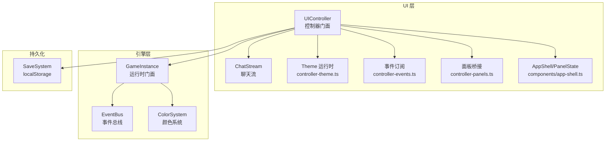
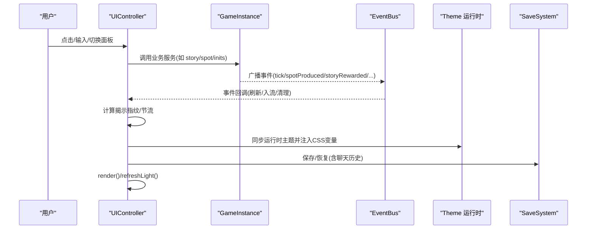
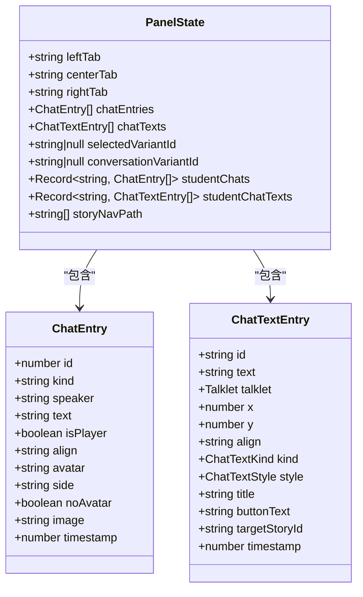
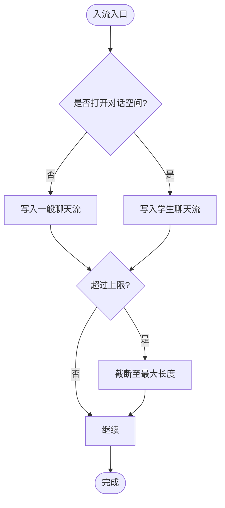
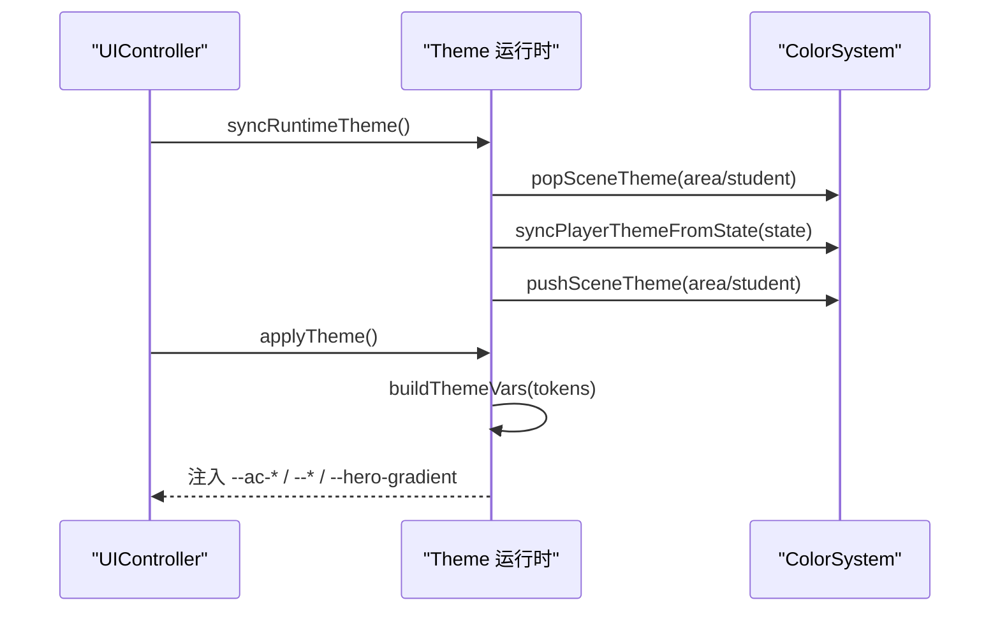
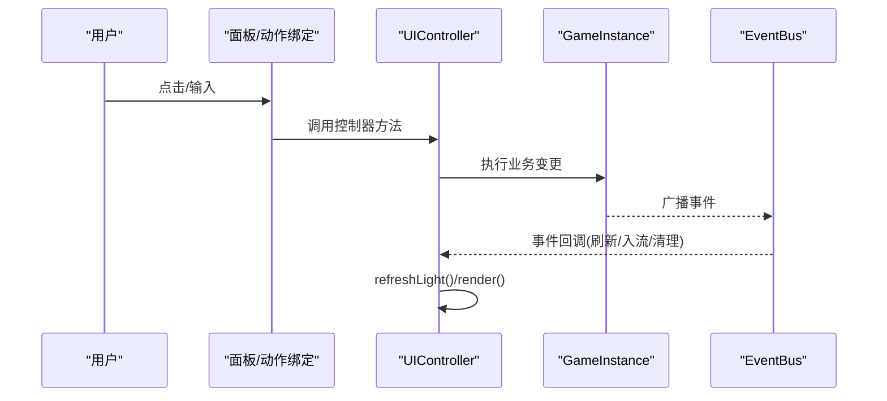
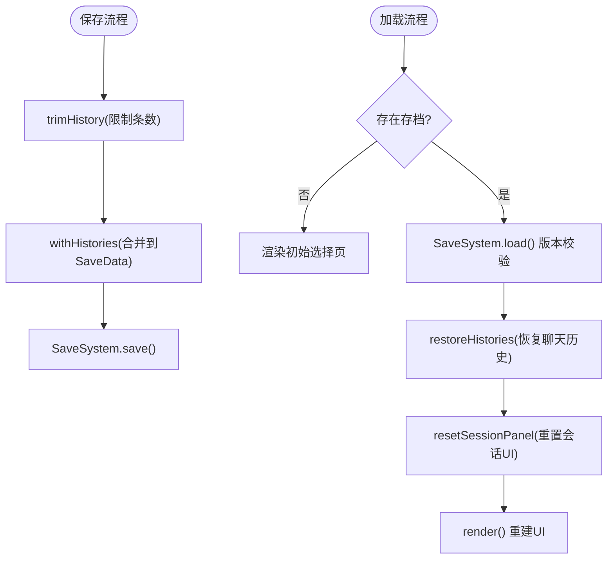
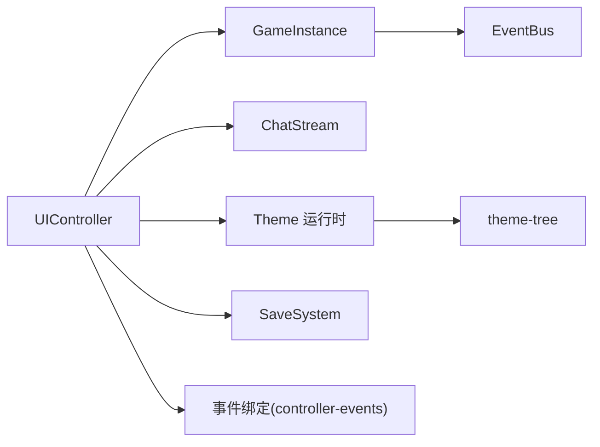

# 状态管理

<cite>
**本文引用的文件**
- [controller.ts](file://src/ui/controller.ts)
- [controller-core.ts](file://src/ui/controller-core.ts)
- [controller-events.ts](file://src/ui/controller-events.ts)
- [controller-panels.ts](file://src/ui/controller-panels.ts)
- [controller-theme.ts](file://src/ui/controller-theme.ts)
- [chat-stream.ts](file://src/ui/chat-stream.ts)
- [context.ts](file://src/ui/context.ts)
- [app-shell.ts](file://src/ui/components/app-shell.ts)
- [story.ts](file://src/ui/components/story.ts)
- [theme-tree.ts](file://src/ui/theme-tree.ts)
- [storage.ts](file://src/save/storage.ts)
- [game-instance.ts](file://src/engine/game-instance.ts)
</cite>

## 目录
1. [简介](#简介)
2. [项目结构](#项目结构)
3. [核心组件](#核心组件)
4. [架构总览](#架构总览)
5. [详细组件分析](#详细组件分析)
6. [依赖关系分析](#依赖关系分析)
7. [性能考虑](#性能考虑)
8. [故障排查指南](#故障排查指南)
9. [结论](#结论)
10. [附录](#附录)

## 简介
本技术文档聚焦 ACProgram 的 UI 状态管理系统，围绕 PanelState 面板状态、聊天流状态与主题状态的统一管理展开。文档解释：
- 状态的组织结构与数据流设计（单向数据流）
- 状态变更触发机制（用户交互、游戏事件、定时更新）
- 状态同步策略（单向数据流、持久化、版本兼容）
- 性能优化（状态差分、局部更新、内存泄漏防护）
- 调试工具与故障排查

## 项目结构
UI 层以 UIController 为门面，集中协调渲染、事件绑定、主题注入、聊天流与滚动等；引擎层通过 GameInstance 暴露只读视图与系统能力；存档层负责本地持久化与版本校验。

图表来源
- [controller.ts:61-137](file://src/ui/controller.ts#L61-L137)
- [controller-events.ts:12-88](file://src/ui/controller-events.ts#L12-L88)
- [controller-theme.ts:31-127](file://src/ui/controller-theme.ts#L31-L127)
- [controller-panels.ts:14-51](file://src/ui/controller-panels.ts#L14-L51)
- [app-shell.ts:8-30](file://src/ui/components/app-shell.ts#L8-L30)
- [game-instance.ts:74-164](file://src/engine/game-instance.ts#L74-L164)
- [storage.ts:10-74](file://src/save/storage.ts#L10-L74)

章节来源
- [controller.ts:61-137](file://src/ui/controller.ts#L61-L137)
- [game-instance.ts:74-164](file://src/engine/game-instance.ts#L74-L164)
- [storage.ts:10-74](file://src/save/storage.ts#L10-L74)

## 核心组件
- UIController：UI 状态持有者与编排者，维护 PanelState、聊天历史、主题浮窗状态、选择页与导入导出服务；提供 render、refreshLight、startNewGame、resumeInit、resetSessionPanel 等入口。
- ChatStream：聊天流领域逻辑，维护自增 ID、当前剧情指纹去重、活跃流路由（一般聊天/学生对话空间）、演出文本覆盖层。
- Theme 运行时：按场景栈合并玩家/区域/学生主题，注入 CSS 变量，并维持主题浮窗跨重建存活。
- 事件订阅：将引擎 EventBus 事件映射到 UI 行为（揭示刷新、奖励排队、聊天流清理/演出文本）。
- 面板桥接：选择页（Init/GlobalEnhancement）渲染与交互绑定，支持局部替换详情与轮盘滑动。
- AppShell/PanelState：三栏布局的状态模型与渲染入口，承载聊天条目、演出文本、对话空间与导航路径。
- SaveSystem：LocalStorage 存取、版本校验、导入导出。

章节来源
- [controller.ts:61-137](file://src/ui/controller.ts#L61-L137)
- [chat-stream.ts:15-145](file://src/ui/chat-stream.ts#L15-L145)
- [controller-theme.ts:31-127](file://src/ui/controller-theme.ts#L31-L127)
- [controller-events.ts:12-88](file://src/ui/controller-events.ts#L12-L88)
- [controller-panels.ts:14-51](file://src/ui/controller-panels.ts#L14-L51)
- [app-shell.ts:8-30](file://src/ui/components/app-shell.ts#L8-L30)
- [storage.ts:10-74](file://src/save/storage.ts#L10-L74)

## 架构总览
UI 采用“控制器驱动 + 事件驱动”的单向数据流：
- 用户交互 → UIController → 调用引擎服务 → 引擎事件 → UI 响应（刷新/入流/主题）
- 定时 Tick → refreshLight 轻量更新资源数字节点，不重建 DOM
- 揭示条件变化 → computeRevealFingerprint → 差异则全量 render

图表来源
- [controller.ts:139-225](file://src/ui/controller.ts#L139-L225)
- [controller-events.ts:12-88](file://src/ui/controller-events.ts#L12-L88)
- [controller-theme.ts:91-127](file://src/ui/controller-theme.ts#L91-L127)
- [storage.ts:10-74](file://src/save/storage.ts#L10-L74)

## 详细组件分析

### PanelState 面板状态
- 字段职责
  - leftTab/centerTab/rightTab：三栏当前激活标签
  - chatEntries/chatTexts：一般聊天流与演出文本覆盖层
  - conversationVariantId：打开某学生对话空间时非空，否则为一般聊天
  - studentChats/studentChatTexts：按学生维度隔离的聊天流与演出文本
  - selectedVariantId：通讯录选中差分，驱动右栏培养面板
  - storyNavPath：故事层级导航路径
- 渲染消费
  - AppShell 根据 conversationVariantId 决定中心面板是否渲染学生对话视图
  - 聊天流渲染区分 talk/narration/system/reward 类型，支持头像、图片、对齐、气泡侧向

图表来源
- [app-shell.ts:8-30](file://src/ui/components/app-shell.ts#L8-L30)
- [story.ts:22-68](file://src/ui/components/story.ts#L22-L68)

章节来源
- [app-shell.ts:8-30](file://src/ui/components/app-shell.ts#L8-L30)
- [story.ts:22-68](file://src/ui/components/story.ts#L22-L68)

### 聊天流状态与数据流
- 活跃流路由
  - 若 conversationVariantId 为空，使用 panelState.chatEntries
  - 否则使用 panelState.studentChats[conversationVariantId]
- 条目入流
  - push 自动分配唯一 id 与时间戳，超过上限截断
  - 剧情推进时 syncCurrentStory 以 storyId:pageIndex 指纹去重，避免重复入流
  - 玩家回复通过 pushPlayerReply 回显
  - 过渡页吸收 pushAbsorbed 进入聊天流（排除 click 页）
- 演出文本覆盖层
  - activeChatTexts 返回当前活跃流的覆盖层数组
  - pushChatText/clearChatText 支持按临时 id 覆盖/擦除
  - 事件驱动：chatFlowCleared/chatTextClearedAll/chatTextShown/chatTextCleared 统一处理

图表来源
- [chat-stream.ts:25-43](file://src/ui/chat-stream.ts#L25-L43)

章节来源
- [chat-stream.ts:15-145](file://src/ui/chat-stream.ts#L15-L145)
- [controller-events.ts:49-87](file://src/ui/controller-events.ts#L49-L87)

### 主题状态与运行时注入
- 运行时主题层
  - 清空 area/student 场景栈后，按当前 Area/对话学生重新推入主题层
  - 优先使用实体主题槽覆盖（设计/装备/自定义），否则使用声明默认或 ColorGroup
- CSS 变量注入
  - 清理旧注入属性，生成 --ac-* 引擎 token 与界面语义层变量
  - 背景明暗判定生成 --ink-on-* 与 --muted-on-*，确保可读性
- 主题浮窗跨重建存活
  - render 重建 #app 后依据 themeFloatOpen 与 themeFloatPos 恢复位置与开关

图表来源
- [controller-theme.ts:31-89](file://src/ui/controller-theme.ts#L31-L89)
- [controller-theme.ts:91-127](file://src/ui/controller-theme.ts#L91-L127)
- [theme-tree.ts:117-160](file://src/ui/theme-tree.ts#L117-L160)

章节来源
- [controller-theme.ts:31-127](file://src/ui/controller-theme.ts#L31-L127)
- [theme-tree.ts:117-160](file://src/ui/theme-tree.ts#L117-L160)

### 状态变更触发机制
- 用户交互
  - 面板切换、选择页操作、发送回复、购买/停用强化、读档/返回游戏等由 controller-panels 与 controller-actions-* 绑定
- 游戏事件
  - EventBus 事件驱动：tick/spotProduced 不参与揭示评估；其他事件触发 reveal 指纹重算
  - storyRewarded/poolGateChanged/storyAreaTraveled 排队奖励通知，render 时统一落账
  - chatFlowCleared/chatTextClearedAll/chatTextShown/chatTextCleared 控制演出文本
- 定时更新
  - setInterval 每秒调用 refreshLight 仅更新资源数字与产出显示，避免重建 DOM

图表来源
- [controller-events.ts:12-88](file://src/ui/controller-events.ts#L12-L88)
- [controller-core.ts:46-96](file://src/ui/controller-core.ts#L46-L96)
- [controller-panels.ts:58-171](file://src/ui/controller-panels.ts#L58-L171)

章节来源
- [controller-events.ts:12-88](file://src/ui/controller-events.ts#L12-L88)
- [controller-core.ts:46-96](file://src/ui/controller-core.ts#L46-L96)
- [controller-panels.ts:58-171](file://src/ui/controller-panels.ts#L58-L171)

### 状态同步策略
- 单向数据流
  - UI 仅消费 GameInstance 提供的只读视图（UIFacingGame/UIContext），写操作经控制器调用引擎服务
- 状态持久化
  - withHistories 在保存前裁剪聊天历史（MAX_CHAT_HISTORY）并入 SaveData
  - restoreHistories 在读档后恢复各沙盒聊天历史（variant:* 键）
  - SaveSystem 提供 save/load/delete/exists/export/import，带版本校验
- 版本兼容性
  - SaveSystem 通过 SAVE_VERSION 校验存档版本，不匹配则忽略并提示

图表来源
- [controller-core.ts:124-156](file://src/ui/controller-core.ts#L124-L156)
- [storage.ts:10-74](file://src/save/storage.ts#L10-L74)
- [controller.ts:139-154](file://src/ui/controller.ts#L139-L154)

章节来源
- [controller-core.ts:124-156](file://src/ui/controller-core.ts#L124-L156)
- [storage.ts:10-74](file://src/save/storage.ts#L10-L74)
- [controller.ts:139-154](file://src/ui/controller.ts#L139-L154)

### 性能优化技术
- 状态差分
  - 揭示指纹 computeRevealFingerprint 聚合 Spot/Enhancement/Init/Area/Story 可见性，仅在指纹变化时触发全量 render
  - 节流 lastRevealCheck 避免 tick 高频事件反复重算
- 局部更新
  - refreshLight 仅更新资源数字节点与 Spot 产出显示，不重建 #app DOM，保持聊天流滚动位置
  - 选择页 replaceCurrentDetail/replaceInitDetail/replaceEnhDetail 局部替换详情文案块，保留轮盘状态
- 内存泄漏防护
  - destroy 停止定时器，避免悬挂 interval
  - 聊天流与演出文本按上限截断与清理，避免无限增长
  - 主题浮窗跨重建存活但受控于开关与位置，避免多余 DOM 残留

章节来源
- [controller-core.ts:23-96](file://src/ui/controller-core.ts#L23-L96)
- [controller.ts:169-172](file://src/ui/controller.ts#L169-L172)
- [chat-stream.ts:32-43](file://src/ui/chat-stream.ts#L32-L43)
- [controller-panels.ts:53-56](file://src/ui/controller-panels.ts#L53-L56)

## 依赖关系分析
- UIController 依赖
  - GameInstance：读取视图、调用服务、订阅事件
  - ChatStream：聊天流路由与入流
  - Theme 运行时：主题层同步与 CSS 注入
  - SaveSystem：持久化
  - 各 controller-actions-*：事件绑定
- 事件驱动耦合
  - EventBus 事件与 UI 行为解耦，通过 bindEvents 集中订阅，便于扩展与维护
- 主题系统耦合
  - ColorSystem 提供运行时主题层，theme-tree 提供静态色彩树与变量构建

图表来源
- [controller.ts:61-137](file://src/ui/controller.ts#L61-L137)
- [controller-events.ts:12-88](file://src/ui/controller-events.ts#L12-L88)
- [controller-theme.ts:31-127](file://src/ui/controller-theme.ts#L31-L127)
- [theme-tree.ts:117-160](file://src/ui/theme-tree.ts#L117-L160)

章节来源
- [controller.ts:61-137](file://src/ui/controller.ts#L61-L137)
- [controller-events.ts:12-88](file://src/ui/controller-events.ts#L12-L88)
- [controller-theme.ts:31-127](file://src/ui/controller-theme.ts#L31-L127)
- [theme-tree.ts:117-160](file://src/ui/theme-tree.ts#L117-L160)

## 性能考虑
- 渲染频率控制
  - 每 Tick 仅轻量刷新资源数字，避免频繁重建 DOM
  - 揭示刷新节流，减少高频事件导致的重复渲染
- 聊天流容量控制
  - 单流上限 CHAT_MAX 防止内存膨胀
  - 持久化时裁剪至 MAX_CHAT_HISTORY，平衡体验与体积
- 主题注入开销
  - 仅在 render 时清理并注入 CSS 变量，避免每次状态变更都注入
- 事件过滤
  - tick/spotProduced 不参与揭示评估，降低无用计算

[本节为通用性能指导，不直接分析具体文件]

## 故障排查指南
- 常见问题定位
  - 聊天流未更新：检查 ChatStream.push 是否被调用、活跃流路由是否正确（conversationVariantId）
  - 主题色异常：确认 syncRuntimeTheme 在 render 之前调用，且 ColorSystem 场景栈正确推入
  - 存档无法加载：查看 SaveSystem 版本校验日志，确认版本一致
  - 揭示未刷新：检查 EventBus 事件是否触发、lastRevealCheck 节流是否过短
- 调试工具
  - 快捷键 Ctrl+Shift+D：输出 Enhancement 条件诊断日志，辅助定位条件不满足问题
  - DevLog：记录关键事件与错误，便于回溯
- 建议步骤
  - 使用浏览器控制台查看 localStorage 中的存档内容与版本
  - 在 render 前后打印 PanelState 关键字段，确认状态流转
  - 监听 EventBus 事件，确认事件链路与回调执行顺序

章节来源
- [controller.ts:159-166](file://src/ui/controller.ts#L159-L166)
- [storage.ts:24-40](file://src/save/storage.ts#L24-L40)
- [controller-core.ts:46-60](file://src/ui/controller-core.ts#L46-L60)

## 结论
ACProgram 的 UI 状态管理以 UIController 为核心，结合 ChatStream、Theme 运行时与事件驱动，实现了清晰的数据流与高效的渲染策略。通过揭示指纹差分、轻量刷新与聊天流容量控制，保证了交互流畅性与内存安全。持久化与版本兼容确保了存档可靠性。整体架构具备良好的可扩展性与可维护性。

[本节为总结性内容，不直接分析具体文件]

## 附录
- 关键接口与常量
  - PanelState：三栏布局与聊天流状态模型
  - ChatEntry/ChatTextEntry：聊天条目与演出文本覆盖层
  - MAX_CHAT_HISTORY：持久化聊天历史上限
  - CHAT_MAX：运行时聊天流上限
- 常用方法
  - UIController.render/refreshLight/startNewGame/resumeInit/resetSessionPanel
  - ChatStream.push/syncCurrentStory/pushPlayerReply/pushAbsorbed
  - SaveSystem.save/load/exists/export/import

[本节为参考信息，不直接分析具体文件]