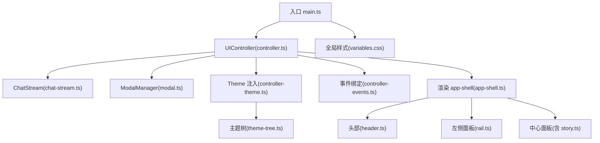
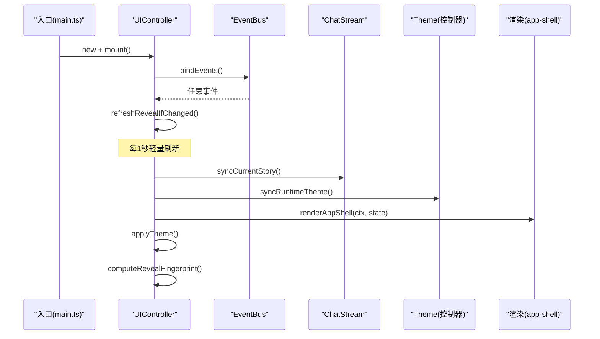
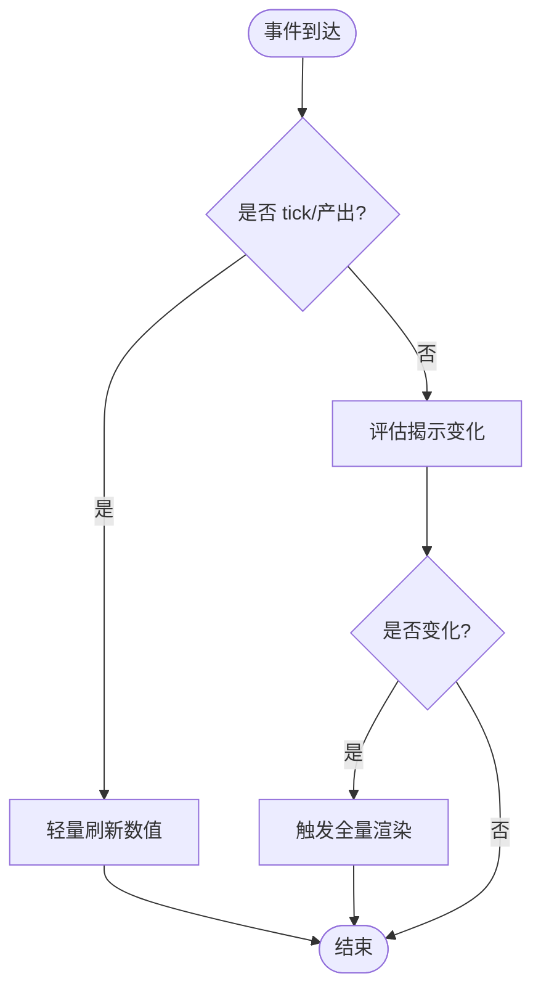
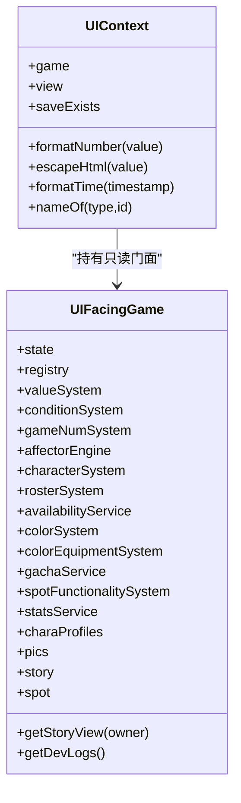
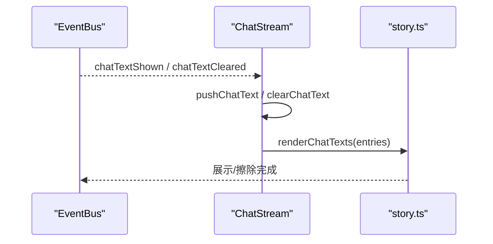
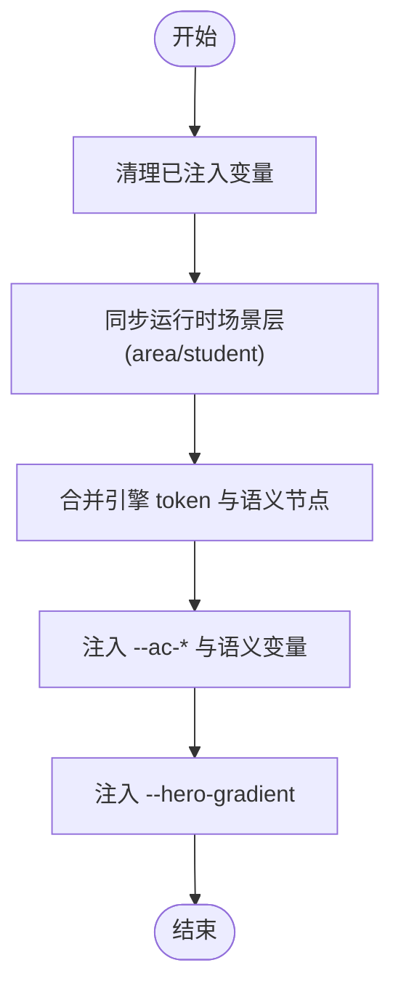
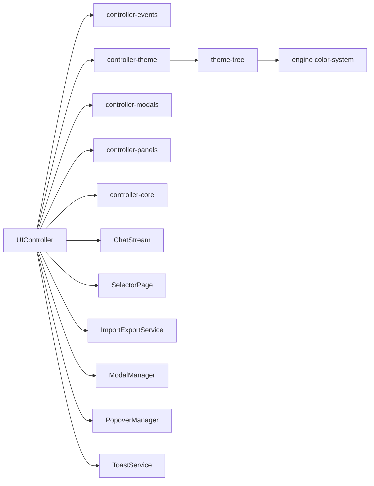

# 用户界面

<cite>
**本文引用的文件**
- [main.ts](file://src/ui/main.ts)
- [controller.ts](file://src/ui/controller.ts)
- [context.ts](file://src/ui/context.ts)
- [app-shell.ts](file://src/ui/components/app-shell.ts)
- [story.ts](file://src/ui/components/story.ts)
- [chat-stream.ts](file://src/ui/chat-stream.ts)
- [controller-events.ts](file://src/ui/controller-events.ts)
- [controller-theme.ts](file://src/ui/controller-theme.ts)
- [theme-tree.ts](file://src/ui/theme-tree.ts)
- [header.ts](file://src/ui/components/header.ts)
- [rail.ts](file://src/ui/components/rail.ts)
- [modal.ts](file://src/ui/modal.ts)
- [variables.css](file://src/ui/css/variables.css)
</cite>

## 目录
1. [简介](#简介)
2. [项目结构](#项目结构)
3. [核心组件](#核心组件)
4. [架构总览](#架构总览)
5. [详细组件分析](#详细组件分析)
6. [依赖关系分析](#依赖关系分析)
7. [性能考量](#性能考量)
8. [故障排查指南](#故障排查指南)
9. [结论](#结论)
10. [附录](#附录)

## 简介
本技术文档面向 ACProgram 的用户界面子系统，围绕 UI 架构、控制器模式、上下文管理、组件库组织、主题化与运行时配色、响应式与可访问性、跨浏览器兼容性等方面展开。目标是帮助读者在不深入源码细节的情况下理解整体设计，并在需要时快速定位到具体实现位置。

## 项目结构
UI 子系统采用“控制器 + 领域模块 + 渲染组件”的分层组织：
- 入口与装配：应用启动、样式加载、GameInstance 初始化、UIController 挂载。
- 控制器层：统一事件订阅、状态同步、渲染调度、弹窗/浮层/滚动等横切能力。
- 领域模块：聊天流、选择页、导入导出、保存/读取等职责单一的服务。
- 组件层：按功能拆分的纯渲染函数（头部、面板、故事对话、模态等）。
- 主题系统：运行时主题层合并、CSS 变量注入、语义色板与卡片强调色派生。
- 样式资源：按功能拆分 CSS，变量与布局分离，便于维护与扩展。

图表来源
- [main.ts:22-29](file://src/ui/main.ts#L22-L29)
- [controller.ts:61-137](file://src/ui/controller.ts#L61-L137)
- [controller-theme.ts:95-127](file://src/ui/controller-theme.ts#L95-L127)
- [theme-tree.ts:117-160](file://src/ui/theme-tree.ts#L117-L160)
- [app-shell.ts:32-50](file://src/ui/components/app-shell.ts#L32-L50)
- [variables.css:11-39](file://src/ui/css/variables.css#L11-L39)

章节来源
- [main.ts:22-29](file://src/ui/main.ts#L22-L29)
- [controller.ts:61-137](file://src/ui/controller.ts#L61-L137)

## 核心组件
- UIController：UI 门面与编排者，负责生命周期、事件订阅、渲染调度、状态同步、主题注入、弹窗/浮层/滚动/选择页等横切能力。
- ChatStream：聊天流领域逻辑，维护自增 ID、当前剧情指纹去重、活跃流路由、演出文本覆盖层管理。
- ModalManager：body 级弹窗母版，提供遮罩、面板、标题、内容体、底部操作区及关闭交互。
- 主题系统：controller-theme 负责运行时场景层合并与 CSS 变量注入；theme-tree 负责语义节点展开、背景明暗判定、英雄渐变生成。
- 渲染组件：app-shell 组合 header、left/center/right 面板；story 负责聊天历史、旁白、回复选择、演出覆盖层；header/rail 提供导航与主题浮窗。

章节来源
- [controller.ts:61-137](file://src/ui/controller.ts#L61-L137)
- [chat-stream.ts:15-145](file://src/ui/chat-stream.ts#L15-L145)
- [modal.ts:56-100](file://src/ui/modal.ts#L56-L100)
- [controller-theme.ts:31-127](file://src/ui/controller-theme.ts#L31-L127)
- [theme-tree.ts:117-185](file://src/ui/theme-tree.ts#L117-L185)
- [app-shell.ts:32-50](file://src/ui/components/app-shell.ts#L32-L50)
- [story.ts:159-313](file://src/ui/components/story.ts#L159-L313)
- [header.ts:53-124](file://src/ui/components/header.ts#L53-L124)
- [rail.ts:22-97](file://src/ui/components/rail.ts#L22-L97)

## 架构总览
UI 采用“控制器驱动 + 事件总线 + 只读上下文”的架构：
- 控制器在 mount 时订阅引擎 EventBus，将高频 tick/产出事件交由轻量刷新处理，其他事件触发揭示条件评估并反射到 UI。
- 渲染流程：render 前同步当前剧情视图至聊天流 → 捕获滚动 → 生成 UIContext → 同步运行时主题 → 重建 #app DOM → 恢复滚动与主题浮窗 → 计算揭示指纹。
- 上下文 UIContext 仅暴露只读查询与格式化能力，写操作一律通过 controller 调用 GameInstance，保证数据流向单向可控。

图表来源
- [main.ts:22-29](file://src/ui/main.ts#L22-L29)
- [controller-events.ts:12-88](file://src/ui/controller-events.ts#L12-L88)
- [controller.ts:139-225](file://src/ui/controller.ts#L139-L225)
- [chat-stream.ts:53-76](file://src/ui/chat-stream.ts#L53-L76)
- [controller-theme.ts:95-127](file://src/ui/controller-theme.ts#L95-L127)
- [app-shell.ts:32-50](file://src/ui/components/app-shell.ts#L32-L50)

## 详细组件分析

### 控制器模式与事件处理
- 事件订阅：mount 中一次性绑定 EventBus，区分高频 tick/产出事件走轻量刷新，其余事件触发揭示条件评估。
- 状态同步：render 前将当前剧情视图同步进聊天流，确保多沙盒（一般聊天/学生对话空间）互不干扰。
- 用户交互管理：顶部栏、通讯录、主题、故事、背包、存档等动作由 controller-actions-* 模块集中绑定，render 后统一挂接。

图表来源
- [controller-events.ts:12-18](file://src/ui/controller-events.ts#L12-L18)
- [controller.ts:155-167](file://src/ui/controller.ts#L155-L167)
- [controller.ts:174-187](file://src/ui/controller.ts#L174-L187)

章节来源
- [controller-events.ts:12-88](file://src/ui/controller-events.ts#L12-L88)
- [controller.ts:139-225](file://src/ui/controller.ts#L139-L225)

### 上下文管理机制
- UIFacingGame：对引擎的只读门面，包含状态、注册表、值系统、条件系统、角色/阵容/颜色/卡池/设施/图鉴等服务，以及剧情与设施的只读查询。
- UIContext：封装 view、saveExists、数字/时间格式化、显示名解析等，供组件层消费。
- 创建时机：每次 render 前 createUIContext，确保读取最新视图与状态。

图表来源
- [context.ts:25-88](file://src/ui/context.ts#L25-L88)

章节来源
- [context.ts:25-88](file://src/ui/context.ts#L25-L88)

### 聊天流与演出文本
- 聊天流：维护自增 ID、最大条目数限制、活跃流路由（一般聊天/学生对话空间）、剧情视图同步（按 storyId:pageIndex 指纹去重）、玩家回复回显、过渡页吸收。
- 演出文本：以百分比坐标叠加在聊天窗格上，支持 Talklet 复用、样式覆写、按临时 id 更新/删除。

图表来源
- [controller-events.ts:49-87](file://src/ui/controller-events.ts#L49-L87)
- [chat-stream.ts:106-143](file://src/ui/chat-stream.ts#L106-L143)
- [story.ts:193-283](file://src/ui/components/story.ts#L193-L283)

章节来源
- [chat-stream.ts:15-145](file://src/ui/chat-stream.ts#L15-L145)
- [story.ts:159-313](file://src/ui/components/story.ts#L159-L313)

### 主题系统与运行时配色
- 运行时场景层：清理 area/student 场景栈，按当前 Area/对话学生重新推入主题层；剧情未播放时清除临时演出层。
- CSS 变量注入：先清理引擎/语义层注入，再合并运行时层，输出 --ac-* 与语义变量；同时注入 hero 渐变。
- 语义色板：主题树定义 ink/panel/canvas/player-bubble/npc-bubble 等节点，支持 acRef 强制层、常量、自动衍生与背景明暗判定；卡片强调色从 accent 派生整组 token。

图表来源
- [controller-theme.ts:95-127](file://src/ui/controller-theme.ts#L95-L127)
- [theme-tree.ts:117-185](file://src/ui/theme-tree.ts#L117-L185)
- [color-scheme.ts:64-103](file://src/ui/color-scheme.ts#L64-L103)

章节来源
- [controller-theme.ts:31-127](file://src/ui/controller-theme.ts#L31-L127)
- [theme-tree.ts:117-185](file://src/ui/theme-tree.ts#L117-L185)
- [color-scheme.ts:26-103](file://src/ui/color-scheme.ts#L26-L103)

### 组件库组织与渲染优化
- 基础组件：app-shell 组合 header/left/center/right；modal 提供通用弹窗骨架；toast 提供通知。
- 业务组件：rail（区域/通讯录/故事导航）、contacts（通讯录详情）、enhancements（强化管理）、selector-page（轮盘选择）。
- 交互组件：story（聊天历史、旁白、回复选择、演出覆盖层）、tooltip/popover（悬浮详情）。
- 渲染优化：
  - 轻量刷新：每秒仅更新资源数字节点，避免全量重建。
  - 滚动保持：重建前捕获面板/聊天滚动位置，重建后恢复。
  - 揭示指纹：仅在揭示条件变化时重建，减少不必要开销。
  - 主题优先：在生成依赖运行时层的 UI 之前同步主题层，避免视觉闪烁。

章节来源
- [app-shell.ts:32-50](file://src/ui/components/app-shell.ts#L32-L50)
- [modal.ts:56-100](file://src/ui/modal.ts#L56-L100)
- [rail.ts:22-97](file://src/ui/components/rail.ts#L22-L97)
- [story.ts:159-313](file://src/ui/components/story.ts#L159-L313)
- [controller.ts:155-225](file://src/ui/controller.ts#L155-L225)

### 响应式设计、可访问性与跨浏览器兼容
- 响应式：根容器最小宽度约束与流体背景；面板/聊天/弹窗使用相对单位与弹性布局；资源条与按钮在小屏下仍可点击。
- 可访问性：弹窗使用 role="dialog" 与 aria-modal；锁定导航使用 aria-disabled；主题浮窗提供键盘 Esc 关闭与焦点管理。
- 跨浏览器：背景感知文本色通过 JS 计算并落静态色值，避免依赖尚未广泛支持的 color-contrast()；字体通过远程字体加载并提供本地回退；图片 lazy 加载与错误回退。

章节来源
- [variables.css:11-58](file://src/ui/css/variables.css#L11-L58)
- [modal.ts:40-99](file://src/ui/modal.ts#L40-L99)
- [rail.ts:64-76](file://src/ui/components/rail.ts#L64-L76)
- [story.ts:74-128](file://src/ui/components/story.ts#L74-L128)
- [theme-tree.ts:144-157](file://src/ui/theme-tree.ts#L144-L157)

## 依赖关系分析
- 控制器依赖：GameInstance、SaveSystem、UIContext、各 controller-actions-*、controller-modals、controller-panels、controller-core、ChatStream、ScrollManager、SelectorPage、ImportExportService、ModalManager、PopoverManager、ToastService。
- 组件依赖：UIContext、引擎服务（如 avatar-renderer、color-system、display-name）、主题树与颜色方案。
- 主题依赖：controller-theme 依赖 theme-tree 与 engine color-system；color-scheme 独立派生强调色板。

图表来源
- [controller.ts:10-59](file://src/ui/controller.ts#L10-L59)
- [controller-theme.ts:8-10](file://src/ui/controller-theme.ts#L8-L10)
- [theme-tree.ts:1-11](file://src/ui/theme-tree.ts#L1-11)

章节来源
- [controller.ts:10-59](file://src/ui/controller.ts#L10-L59)
- [controller-theme.ts:8-10](file://src/ui/controller-theme.ts#L8-L10)
- [theme-tree.ts:1-11](file://src/ui/theme-tree.ts#L1-L11)

## 性能考量
- 轻量刷新：每秒一次仅更新资源数字节点，避免全量 DOM 重建。
- 揭示节流：tick/产出事件不参与揭示评估，降低高频事件压力。
- 滚动保持：重建前捕获滚动位置，重建后恢复，避免列表跳动。
- 主题优先：在生成依赖运行时层的 UI 之前同步主题层，避免二次渲染。
- 聊天上限：聊天流限制最大条目数，防止内存增长。
- 图片懒加载：聊天图片 lazy 加载，失败回退首字母占位。

章节来源
- [controller.ts:155-167](file://src/ui/controller.ts#L155-L167)
- [controller-events.ts:12-18](file://src/ui/controller-events.ts#L12-L18)
- [controller.ts:201-225](file://src/ui/controller.ts#L201-L225)
- [chat-stream.ts:32-43](file://src/ui/chat-stream.ts#L32-L43)
- [story.ts:74-128](file://src/ui/components/story.ts#L74-L128)

## 故障排查指南
- 主题不生效或闪烁：检查是否在生成依赖运行时层的 UI 之前调用同步主题；确认 --ac-* 与语义变量已注入且未被后续覆盖。
- 聊天流顺序错乱：确认 storyRewarded 奖励通知在 render 内统一落账；检查当前剧情视图同步是否按指纹去重。
- 弹窗无法关闭：确认 body 级容器存在且事件监听已绑定；检查 dismissable 配置与 Esc 键处理。
- 滚动位置丢失：确认重建前捕获了面板与聊天滚动位置，并在重建后恢复。
- 图片不显示：检查图片引用解析是否成功；确认 lazy 加载与 onerror 回退逻辑。

章节来源
- [controller-theme.ts:95-127](file://src/ui/controller-theme.ts#L95-L127)
- [controller-events.ts:19-48](file://src/ui/controller-events.ts#L19-L48)
- [modal.ts:81-99](file://src/ui/modal.ts#L81-L99)
- [controller.ts:201-225](file://src/ui/controller.ts#L201-L225)
- [story.ts:74-128](file://src/ui/components/story.ts#L74-L128)

## 结论
ACProgram 的 UI 子系统通过清晰的控制器模式、只读上下文、领域化的聊天流与主题系统，实现了高内聚、低耦合的可维护架构。渲染优化策略保障了流畅体验，主题系统提供了灵活的运行时配色能力。遵循本文档的架构原则与实践建议，可高效扩展新功能、定制主题与提升可访问性。

## 附录
- 定制主题：通过主题浮窗调整层级优先级与区域配色；使用语义变量与强调色板统一视觉风格。
- 组件扩展：新增面板或交互时，优先复用 app-shell 布局与 tooltip/popover 机制；事件绑定集中在 controller-actions-*。
- 测试建议：针对聊天流、主题注入、弹窗交互编写单元测试，覆盖边界条件与异常路径。