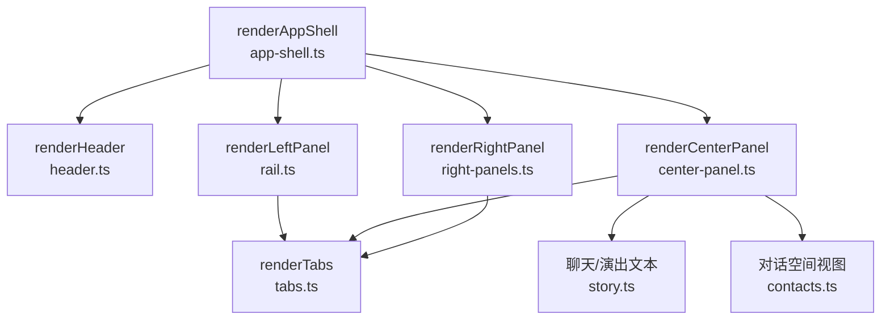
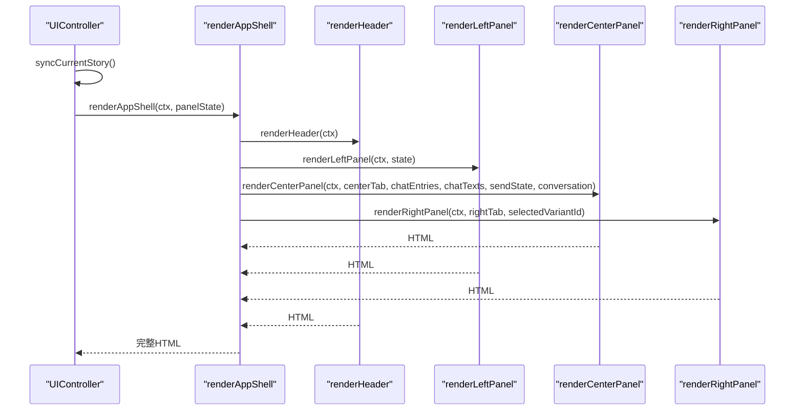
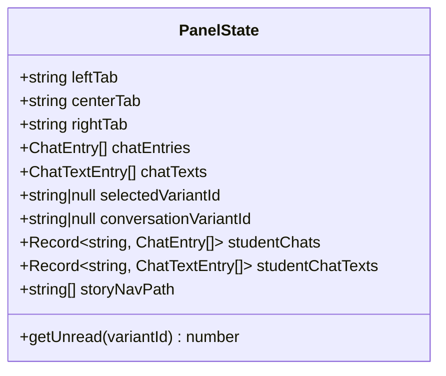
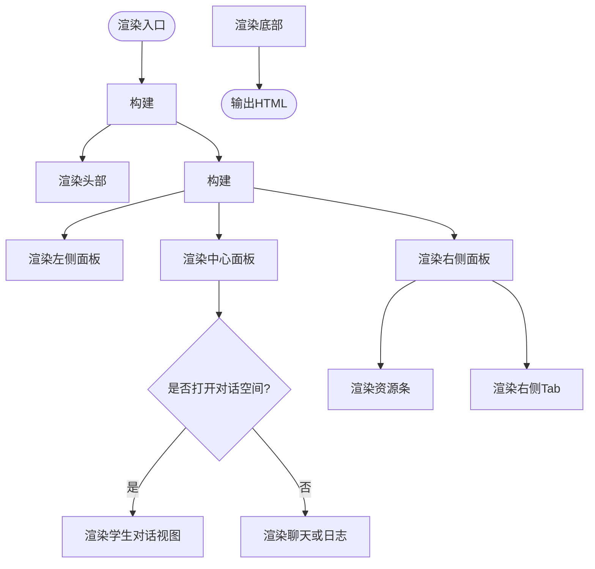
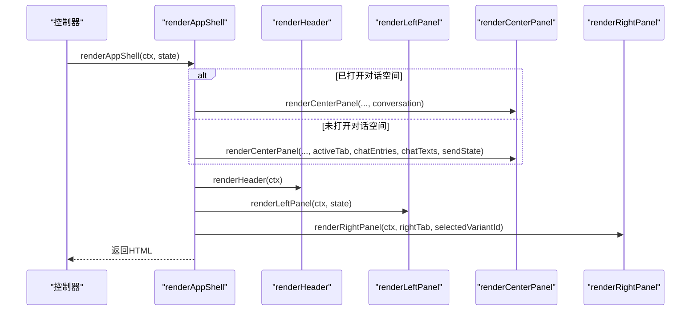
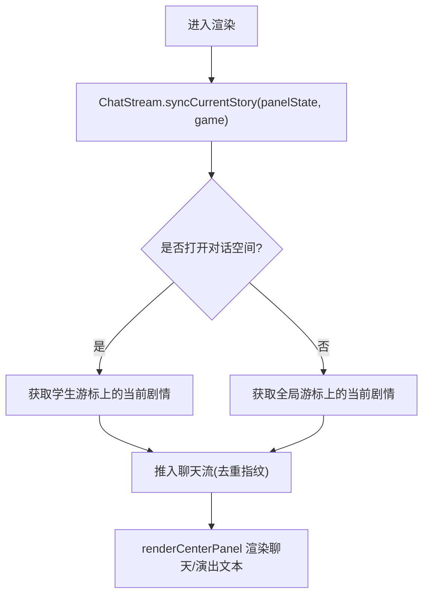
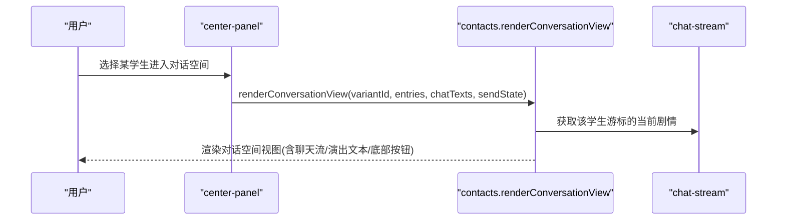
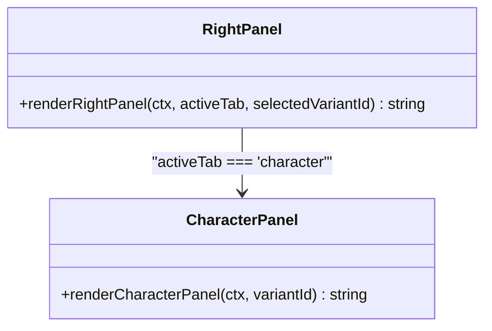
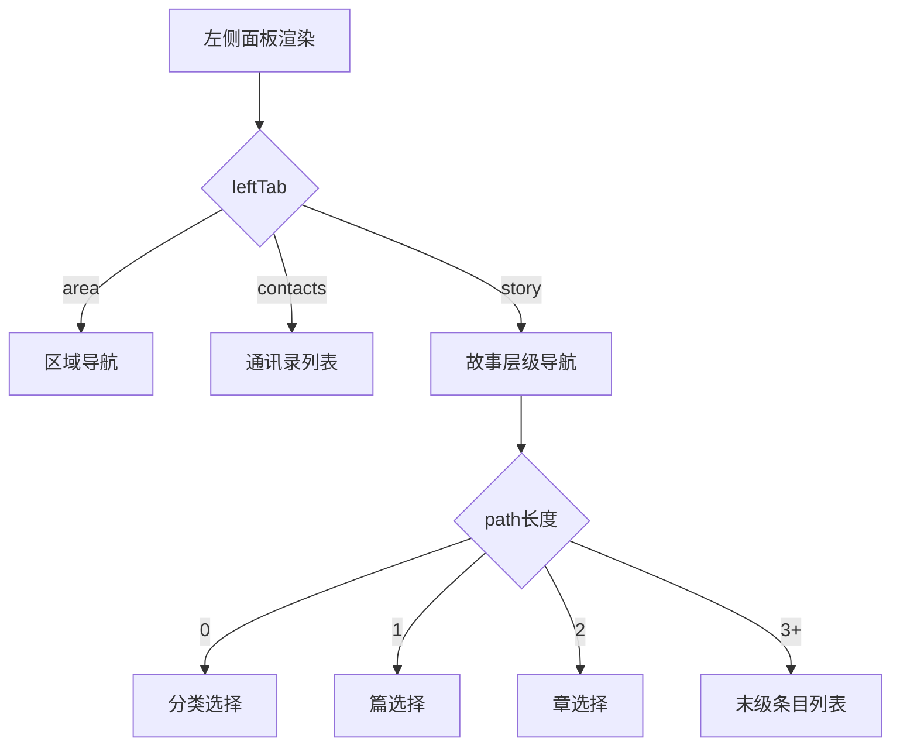
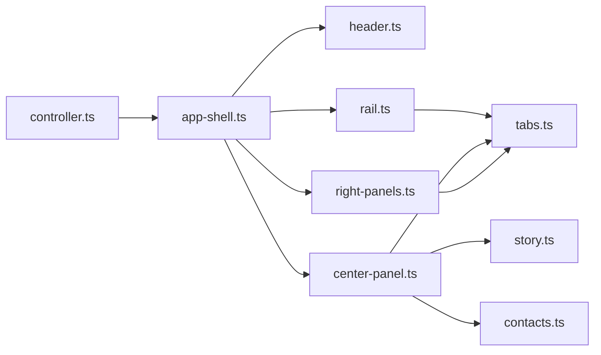

# AppShell主壳组件

<cite>
**本文引用的文件**
- [app-shell.ts](file://src/ui/components/app-shell.ts)
- [center-panel.ts](file://src/ui/components/center-panel.ts)
- [right-panels.ts](file://src/ui/components/right-panels.ts)
- [header.ts](file://src/ui/components/header.ts)
- [rail.ts](file://src/ui/components/rail.ts)
- [story.ts](file://src/ui/components/story.ts)
- [contacts.ts](file://src/ui/components/contacts.ts)
- [tabs.ts](file://src/ui/components/tabs.ts)
- [context.ts](file://src/ui/context.ts)
- [controller.ts](file://src/ui/controller.ts)
- [chat-stream.ts](file://src/ui/chat-stream.ts)
</cite>

## 目录
1. [简介](#简介)
2. [项目结构](#项目结构)
3. [核心组件](#核心组件)
4. [架构总览](#架构总览)
5. [详细组件分析](#详细组件分析)
6. [依赖关系分析](#依赖关系分析)
7. [性能考量](#性能考量)
8. [故障排查指南](#故障排查指南)
9. [结论](#结论)
10. [附录](#附录)

## 简介
AppShell 是应用的主容器，负责将头部、左侧导航栏、中心面板与右侧面板组合渲染为三栏布局。它通过 PanelState 管理标签页状态、聊天条目、对话空间切换以及演出专用文本覆盖层等关键 UI 状态，并协调各子组件完成渲染。该文档聚焦于：
- 三栏布局（左中右）的实现原理与响应式适配机制
- PanelState 状态管理接口设计（leftTab、centerTab、rightTab、chatEntries、conversationVariantId、studentChats 等）
- renderAppShell 的渲染流程（头部、左侧、中心、右侧的组合）
- 会话系统集成（学生聊天流管理与演出专用文本覆盖层）
- 组件配置选项与扩展点

## 项目结构
AppShell 位于 UI 组件层，围绕“渲染函数 + 状态对象”的模式组织。其核心由 app-shell.ts 提供入口，其他面板组件按职责拆分：
- 头部：header.ts
- 左侧：rail.ts（区域、通讯录、故事）
- 中心：center-panel.ts（聊天、日志、对话空间视图）
- 右侧：right-panels.ts（设施、学生、强化、其他）
- 通用 Tab：tabs.ts
- 聊天与演出文本：story.ts
- 通讯录与对话空间：contacts.ts
- UI 上下文：context.ts
- 控制器与聊天流：controller.ts、chat-stream.ts

**图表来源**
- [app-shell.ts:32-50](file://src/ui/components/app-shell.ts#L32-L50)
- [header.ts:53-100](file://src/ui/components/header.ts#L53-L100)
- [rail.ts:22-36](file://src/ui/components/rail.ts#L22-L36)
- [center-panel.ts:19-64](file://src/ui/components/center-panel.ts#L19-L64)
- [right-panels.ts:17-34](file://src/ui/components/right-panels.ts#L17-L34)
- [tabs.ts:10-23](file://src/ui/components/tabs.ts#L10-L23)

**章节来源**
- [app-shell.ts:1-51](file://src/ui/components/app-shell.ts#L1-L51)
- [center-panel.ts:1-64](file://src/ui/components/center-panel.ts#L1-L64)
- [right-panels.ts:1-34](file://src/ui/components/right-panels.ts#L1-L34)
- [header.ts:53-100](file://src/ui/components/header.ts#L53-L100)
- [rail.ts:22-36](file://src/ui/components/rail.ts#L22-L36)
- [tabs.ts:10-23](file://src/ui/components/tabs.ts#L10-L23)

## 核心组件
- PanelState：定义三栏标签页、聊天历史、演出文本、对话空间、未读计数接口、故事导航路径等。
- renderAppShell：组装头部、左侧、中心、右侧，并在存在对话空间时构造 ConversationView 传入中心面板。
- 中心面板：根据 conversation 参数决定渲染“学生对话空间视图”，否则渲染聊天或日志；底部发送按钮根据 SendState 呈现不同交互态。
- 右侧面板：资源条 + Tab（设施/学生/强化/其他），其中“学生”使用 selectedVariantId 驱动培养面板。
- 左侧面板：区域/通讯录/故事三个 Tab，故事 Tab 支持层级导航与条件解锁展示。
- 聊天与演出文本：ChatEntry 与 ChatTextEntry 分别表示聊天流条目与演出覆盖层文本，支持头像、图片、对齐、样式覆写等。
- UIContext：只读门面，提供游戏状态、查询方法与格式化能力，确保组件仅读取不写入。

**章节来源**
- [app-shell.ts:8-30](file://src/ui/components/app-shell.ts#L8-L30)
- [center-panel.ts:12-64](file://src/ui/components/center-panel.ts#L12-L64)
- [right-panels.ts:10-34](file://src/ui/components/right-panels.ts#L10-L34)
- [rail.ts:16-36](file://src/ui/components/rail.ts#L16-L36)
- [story.ts:22-68](file://src/ui/components/story.ts#L22-L68)
- [context.ts:25-66](file://src/ui/context.ts#L25-L66)

## 架构总览
AppShell 作为顶层渲染器，接收 UIContext 与 PanelState，调用各子组件渲染函数生成 HTML。控制器在每次渲染前同步当前剧情到聊天流，并维护滚动位置与主题状态。

**图表来源**
- [controller.ts:189-225](file://src/ui/controller.ts#L189-L225)
- [app-shell.ts:32-50](file://src/ui/components/app-shell.ts#L32-L50)
- [center-panel.ts:19-64](file://src/ui/components/center-panel.ts#L19-L64)
- [header.ts:53-100](file://src/ui/components/header.ts#L53-L100)
- [rail.ts:22-36](file://src/ui/components/rail.ts#L22-L36)
- [right-panels.ts:17-34](file://src/ui/components/right-panels.ts#L17-L34)

## 详细组件分析

### PanelState 状态管理接口
- leftTab / centerTab / rightTab：控制三栏当前激活的 Tab。
- chatEntries / chatTexts：一般聊天流的条目与演出文本覆盖层。
- selectedVariantId：通讯录当前选中的学生差分 ID，驱动右侧“学生”面板。
- conversationVariantId：对话空间开关；非空时中栏整体替换为该学生的对话视图。
- studentChats / studentChatTexts：每个学生独立的聊天流与演出文本覆盖层，实现多沙盒并行。
- getUnread：预留未读消息计数接口。
- storyNavPath：故事层级导航路径，用于左侧“故事”Tab 的多级浏览。

**图表来源**
- [app-shell.ts:8-30](file://src/ui/components/app-shell.ts#L8-L30)

**章节来源**
- [app-shell.ts:8-30](file://src/ui/components/app-shell.ts#L8-L30)

### 三栏布局与响应式适配
- 布局结构：顶部 header，主体 workspace 包含 left、center、right 三个面板，底部 footer。
- 响应式适配：通过 CSS 类名与面板容器（panel、center-panel、right-panel、left-panel）配合媒体查询实现；具体样式文件位于 ui/css/layout.css 等（本仓库未直接引用内容）。
- 面板职责：
  - 左侧：区域导航、通讯录、故事层级导航。
  - 中心：聊天/日志/对话空间视图。
  - 右侧：资源条、设施、学生培养、强化、其他（背包与效果追踪）。

**图表来源**
- [app-shell.ts:32-50](file://src/ui/components/app-shell.ts#L32-L50)
- [center-panel.ts:19-64](file://src/ui/components/center-panel.ts#L19-L64)
- [right-panels.ts:17-34](file://src/ui/components/right-panels.ts#L17-L34)

**章节来源**
- [app-shell.ts:32-50](file://src/ui/components/app-shell.ts#L32-L50)
- [center-panel.ts:19-64](file://src/ui/components/center-panel.ts#L19-L64)
- [right-panels.ts:17-34](file://src/ui/components/right-panels.ts#L17-L34)

### 渲染流程：renderAppShell
- 当存在 conversationVariantId 时，构造 ConversationView（variantId、entries、chatTexts）并传入 center-panel。
- 头部：品牌、世界线信息、主题浮窗、导入/新游戏/保存/读取等操作按钮。
- 左侧：根据 leftTab 渲染区域/通讯录/故事。
- 中心：根据 centerTab 与 conversation 参数渲染聊天/日志/对话空间视图。
- 右侧：根据 rightTab 渲染设施/学生/强化/其他。

**图表来源**
- [app-shell.ts:32-50](file://src/ui/components/app-shell.ts#L32-L50)
- [center-panel.ts:19-64](file://src/ui/components/center-panel.ts#L19-L64)
- [header.ts:53-100](file://src/ui/components/header.ts#L53-L100)
- [rail.ts:22-36](file://src/ui/components/rail.ts#L22-L36)
- [right-panels.ts:17-34](file://src/ui/components/right-panels.ts#L17-L34)

**章节来源**
- [app-shell.ts:32-50](file://src/ui/components/app-shell.ts#L32-L50)

### 聊天系统与演出文本覆盖层
- 聊天流：ChatEntry 表示聊天历史条目，支持 talk/narration/system/reward 类型，头像、图片、对齐、侧边等属性。
- 演出文本：ChatTextEntry 以百分比坐标定位，支持 Talklet 嵌入、样式覆写、标题/按钮/目标剧情等。
- 多沙盒：studentChats/studentChatTexts 按学生维度隔离聊天流与演出文本；conversationVariantId 控制当前活跃流。
- 同步机制：ChatStream 在渲染前将当前剧情同步进聊天流，去重指纹避免重复插入。

**图表来源**
- [chat-stream.ts:15-59](file://src/ui/chat-stream.ts#L15-L59)
- [center-panel.ts:19-64](file://src/ui/components/center-panel.ts#L19-L64)
- [story.ts:159-211](file://src/ui/components/story.ts#L159-L211)

**章节来源**
- [story.ts:22-68](file://src/ui/components/story.ts#L22-L68)
- [story.ts:159-211](file://src/ui/components/story.ts#L159-L211)
- [chat-stream.ts:15-59](file://src/ui/chat-stream.ts#L15-L59)

### 对话空间与学生聊天流
- 对话空间：当 conversationVariantId 非空时，中栏整体替换为学生对话视图（含返回键、标题、聊天流、演出文本、底部发送按钮）。
- 学生聊天流：每个学生在 studentChats 中有独立数组，支持各自的历史与语境恢复。
- 阻断态：某些 PassiveStoryEntry 播完后要求满足条件才能继续闲聊，此时底部按钮变灰并显示解锁条件。

**图表来源**
- [center-panel.ts:19-64](file://src/ui/components/center-panel.ts#L19-L64)
- [contacts.ts:168-229](file://src/ui/components/contacts.ts#L168-L229)
- [chat-stream.ts:25-59](file://src/ui/chat-stream.ts#L25-L59)

**章节来源**
- [contacts.ts:168-229](file://src/ui/components/contacts.ts#L168-L229)
- [center-panel.ts:19-64](file://src/ui/components/center-panel.ts#L19-L64)

### 右侧面板与角色培养
- 资源条：由数据包声明的 resourceDisplays 驱动，动态显示资源数量与每秒增益。
- 学生面板：selectedVariantId 驱动，展示等级、星级、碎片、累计获得、装备与配色设计。
- 其他：背包列表与效果追踪（Affector 生效情况）。

**图表来源**
- [right-panels.ts:17-34](file://src/ui/components/right-panels.ts#L17-L34)
- [contacts.ts:253-302](file://src/ui/components/contacts.ts#L253-L302)

**章节来源**
- [right-panels.ts:17-34](file://src/ui/components/right-panels.ts#L17-L34)
- [contacts.ts:253-302](file://src/ui/components/contacts.ts#L253-L302)

### 左侧面板与故事导航
- 区域 Tab：展示当前位置与可达区域，受演出锁定与可见性影响。
- 通讯录 Tab：分组展示学生，支持未读标记与预览。
- 故事 Tab：多级导航（分类→篇→章→项），依据 availableInits 与条件揭示进行过滤与状态展示。

**图表来源**
- [rail.ts:22-36](file://src/ui/components/rail.ts#L22-L36)
- [rail.ts:99-105](file://src/ui/components/rail.ts#L99-L105)
- [rail.ts:133-190](file://src/ui/components/rail.ts#L133-L190)

**章节来源**
- [rail.ts:22-36](file://src/ui/components/rail.ts#L22-L36)
- [rail.ts:99-105](file://src/ui/components/rail.ts#L99-L105)
- [rail.ts:133-190](file://src/ui/components/rail.ts#L133-L190)

### 组件配置选项与扩展点
- 面板 Tab 配置：CENTER_TABS、RIGHT_TABS、LEFT_TABS 可增删改以扩展功能入口。
- 资源条配置：resourceDisplays 由数据包驱动，支持自定义显示字段、排序与显示策略。
- 主题与层级：header 内主题浮窗支持层级优先级段与区域配色，便于运行时调整。
- 聊天与演出：ChatEntry/ChatTextEntry 扩展字段（如 image、style、align）提供丰富的表现力。
- 未读系统：PanelState.getUnread 预留接口，后续接入未读计数。

**章节来源**
- [center-panel.ts:7-10](file://src/ui/components/center-panel.ts#L7-L10)
- [right-panels.ts:10-15](file://src/ui/components/right-panels.ts#L10-L15)
- [header.ts:103-123](file://src/ui/components/header.ts#L103-L123)
- [story.ts:22-68](file://src/ui/components/story.ts#L22-L68)
- [app-shell.ts:26-27](file://src/ui/components/app-shell.ts#L26-L27)

## 依赖关系分析
- AppShell 依赖各面板渲染函数与 UIContext。
- 中心面板依赖聊天与演出文本渲染、对话空间视图与发送按钮。
- 右侧面板依赖资源条、Tab 与子面板（生产节点、强化、学生、其他）。
- 左侧面板依赖 Tab、Tooltip、故事层级数据与通讯录。
- 控制器负责生命周期、事件绑定、渲染调度与聊天流同步。

**图表来源**
- [controller.ts:189-225](file://src/ui/controller.ts#L189-L225)
- [app-shell.ts:1-51](file://src/ui/components/app-shell.ts#L1-L51)
- [center-panel.ts:1-64](file://src/ui/components/center-panel.ts#L1-L64)
- [right-panels.ts:1-34](file://src/ui/components/right-panels.ts#L1-L34)
- [rail.ts:1-36](file://src/ui/components/rail.ts#L1-L36)
- [story.ts:1-68](file://src/ui/components/story.ts#L1-L68)
- [contacts.ts:1-34](file://src/ui/components/contacts.ts#L1-L34)
- [tabs.ts:1-24](file://src/ui/components/tabs.ts#L1-L24)

**章节来源**
- [controller.ts:189-225](file://src/ui/controller.ts#L189-L225)
- [app-shell.ts:1-51](file://src/ui/components/app-shell.ts#L1-L51)

## 性能考量
- 轻量刷新：控制器每 Tick 执行轻量刷新，仅更新资源数字节点，避免全量 DOM 重建。
- 聊天历史上限：聊天流维持最大条目数（CHAT_MAX），防止内存膨胀。
- 去重同步：当前剧情同步至聊天流时使用指纹去重，避免重复插入。
- 滚动状态保留：渲染前后捕获与恢复滚动位置，提升用户体验。
- 主题同步：在 DOM 生成前同步运行时主题层，减少二次渲染。

**章节来源**
- [controller.ts:155-167](file://src/ui/controller.ts#L155-L167)
- [controller.ts:184-225](file://src/ui/controller.ts#L184-L225)
- [chat-stream.ts:13-43](file://src/ui/chat-stream.ts#L13-L43)

## 故障排查指南
- 对话空间无法进入：检查 conversationVariantId 是否为有效学生 ID，且该学生已加入通讯录。
- 聊天流不更新：确认 ChatStream.syncCurrentStory 是否被调用，以及当前剧情是否存在。
- 演出文本不显示：检查 ChatTextEntry 的坐标与样式是否正确，并确保其在当前对话空间的覆盖层数组中。
- 右侧学生面板为空：确认 selectedVariantId 是否指向已拥有的学生。
- 故事导航无可用项：检查 availableInits 与条件揭示，确保当前 Init 下存在可用条目。

**章节来源**
- [contacts.ts:168-229](file://src/ui/components/contacts.ts#L168-L229)
- [chat-stream.ts:25-59](file://src/ui/chat-stream.ts#L25-L59)
- [story.ts:193-211](file://src/ui/components/story.ts#L193-L211)
- [contacts.ts:253-302](file://src/ui/components/contacts.ts#L253-L302)
- [rail.ts:133-190](file://src/ui/components/rail.ts#L133-L190)

## 结论
AppShell 作为应用主容器，通过清晰的三栏布局与 PanelState 状态管理，实现了灵活的界面组合与强大的会话系统支持。其设计遵循只读上下文与控制器驱动的架构纪律，确保了渲染与逻辑解耦、可扩展性与可维护性。通过对话空间与演出文本覆盖层，系统在聊天体验与演出表现上提供了高度定制化的能力。

## 附录
- 相关类型与接口：
  - ChatEntry：聊天流条目（talk/narration/system/reward）。
  - ChatTextEntry：演出专用文本覆盖层（坐标、样式、Talklet 嵌入）。
  - ConversationView：对话空间视图参数（variantId、entries、chatTexts）。
  - PanelState：面板状态（标签页、聊天历史、对话空间、未读接口、故事导航路径）。
- 扩展建议：
  - 新增 Tab：在对应面板的 Tab 定义中添加新项，并在渲染函数中分支处理。
  - 增强聊天表现：扩展 ChatEntry/ChatTextEntry 字段，增加新的视觉模板。
  - 接入未读系统：实现 PanelState.getUnread，并在通讯录列表中展示未读标记。