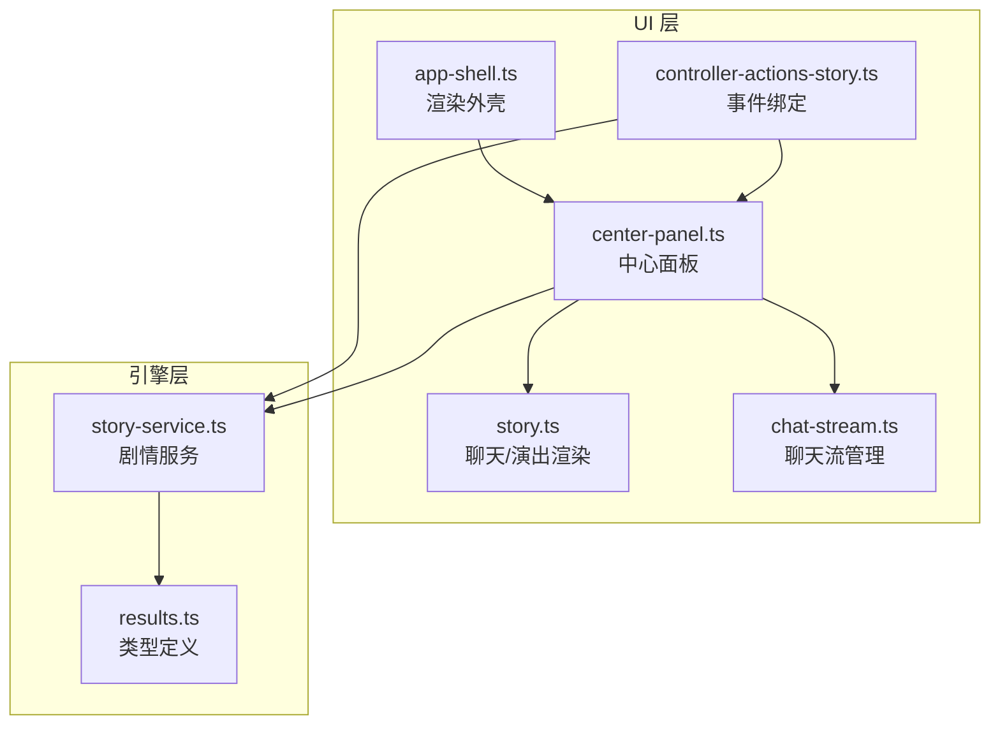
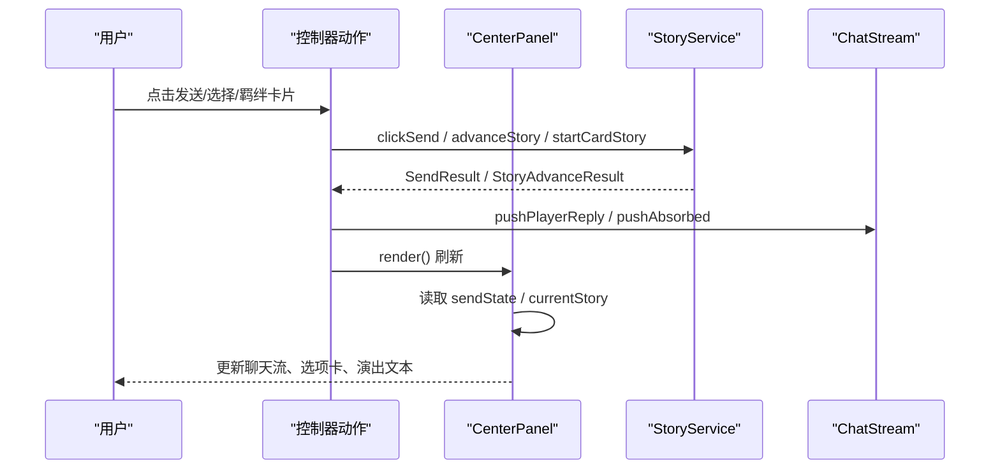
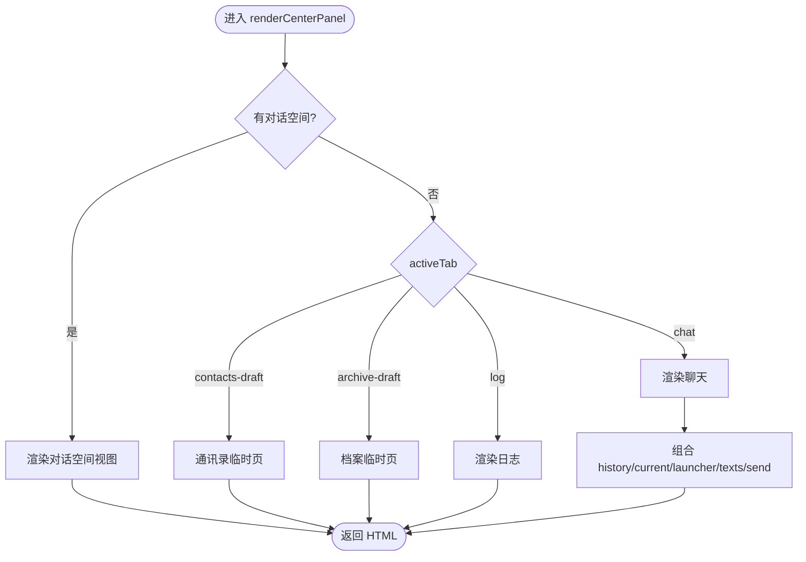
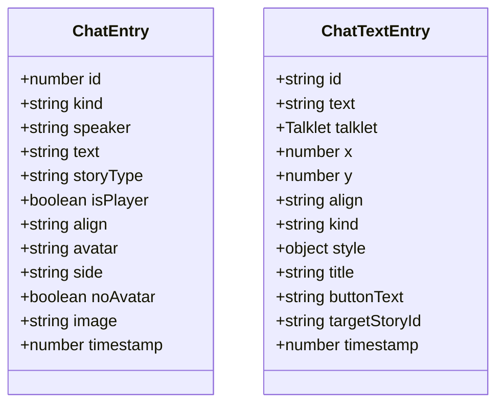
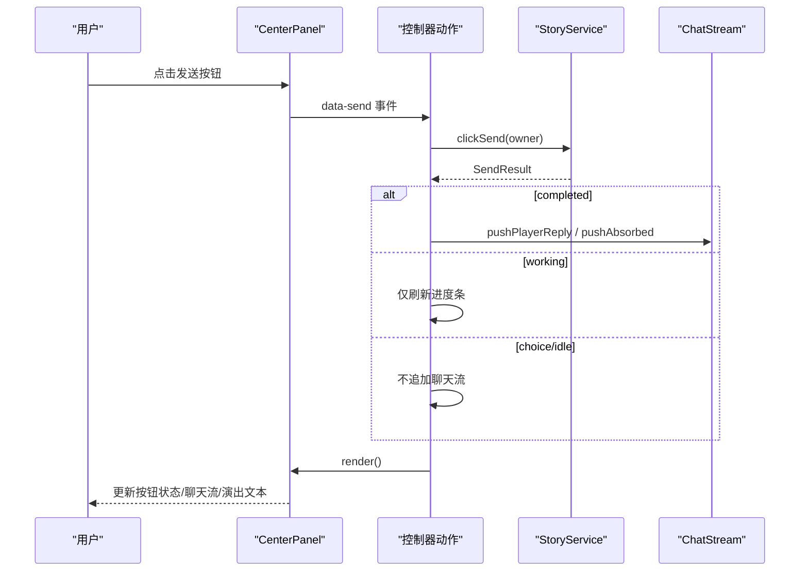
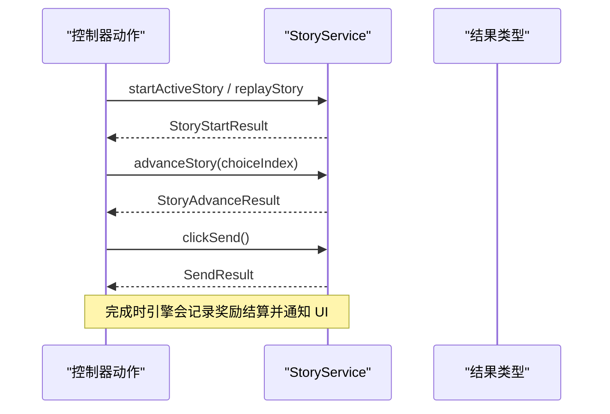
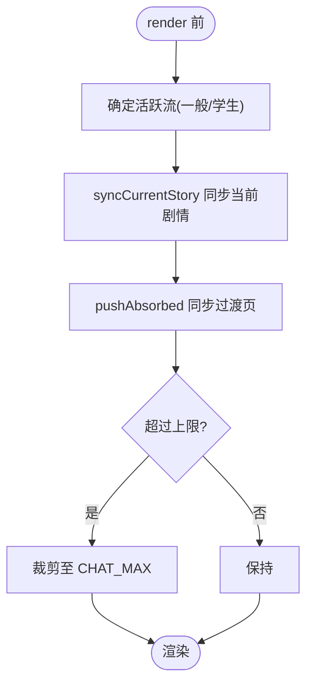
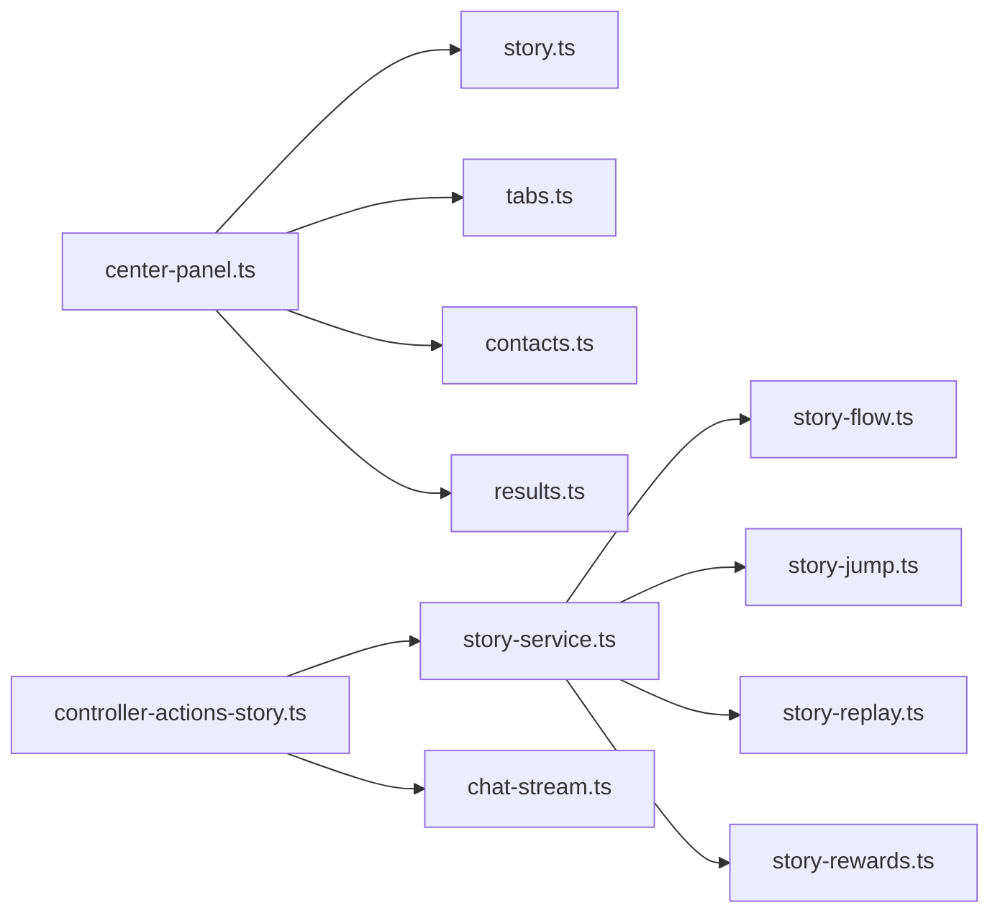

# CenterPanel中心面板

<cite>
**本文引用的文件**
- [center-panel.ts](file://src/ui/components/center-panel.ts)
- [story.ts](file://src/ui/components/story.ts)
- [app-shell.ts](file://src/ui/components/app-shell.ts)
- [controller-actions-story.ts](file://src/ui/controller-actions-story.ts)
- [chat-stream.ts](file://src/ui/chat-stream.ts)
- [story-service.ts](file://src/engine/game/story-service.ts)
- [results.ts](file://src/engine/types/results.ts)
</cite>

## 目录
1. [简介](#简介)
2. [项目结构](#项目结构)
3. [核心组件](#核心组件)
4. [架构总览](#架构总览)
5. [详细组件分析](#详细组件分析)
6. [依赖关系分析](#依赖关系分析)
7. [性能考量](#性能考量)
8. [故障排查指南](#故障排查指南)
9. [结论](#结论)

## 简介
CenterPanel 是应用的主工作区域，承载聊天、日志等视图，并作为剧情演出与聊天系统的展示中枢。它负责：
- 根据面板状态切换不同视图（聊天、日志、对话空间、临时页）
- 渲染聊天历史、当前剧情页、演出专用文本覆盖层
- 管理底部“回复按钮”的多种交互态（推进、选项确认、羁绊卡片、多击任务）
- 与 StoryService 协作完成剧情推进、选择影响、奖励获取等流程的 UI 呈现

## 项目结构
CenterPanel 位于 UI 组件层，通过 app-shell 组装到主界面；其内容渲染依赖 story 组件（聊天条目、演出文本）、控制器动作（事件绑定与业务调用）、聊天流模块（数据累积与同步），以及引擎层的 StoryService（剧情编排）。

图表来源
- [app-shell.ts:32-49](file://src/ui/components/app-shell.ts#L32-L49)
- [center-panel.ts:19-64](file://src/ui/components/center-panel.ts#L19-L64)
- [story.ts:159-211](file://src/ui/components/story.ts#L159-L211)
- [chat-stream.ts:16-145](file://src/ui/chat-stream.ts#L16-L145)
- [controller-actions-story.ts:22-132](file://src/ui/controller-actions-story.ts#L22-L132)
- [story-service.ts:52-270](file://src/engine/game/story-service.ts#L52-L270)
- [results.ts:58-182](file://src/engine/types/results.ts#L58-L182)

章节来源
- [app-shell.ts:32-49](file://src/ui/components/app-shell.ts#L32-L49)
- [center-panel.ts:19-64](file://src/ui/components/center-panel.ts#L19-L64)

## 核心组件
- 中心面板渲染器：根据 conversation、activeTab 决定渲染对话空间或聊天/日志 Tab，并组合聊天历史、当前剧情、演出文本和发送按钮。
- 聊天与演出渲染：ChatEntry 表示聊天流条目（talk/narration/system/reward），ChatTextEntry 表示演出专用文本覆盖层（按百分比坐标定位）。
- 聊天流管理：维护自增 ID、活跃流路由（一般聊天 vs 学生对话空间）、最大条目数限制、当前剧情同步与吸收过渡页。
- 剧情服务：提供启动/推进/重读/触发被动闲聊/获取当前视图与发送状态等能力，内部维护全局与沙盒游标。
- 控制器动作：将 DOM 事件映射到游戏操作（start/replay/advance/clickSend/kizuna），并根据结果更新 UI。

章节来源
- [center-panel.ts:19-209](file://src/ui/components/center-panel.ts#L19-L209)
- [story.ts:22-68](file://src/ui/components/story.ts#L22-L68)
- [chat-stream.ts:16-145](file://src/ui/chat-stream.ts#L16-L145)
- [story-service.ts:52-270](file://src/engine/game/story-service.ts#L52-L270)
- [controller-actions-story.ts:22-132](file://src/ui/controller-actions-story.ts#L22-L132)

## 架构总览
CenterPanel 处于 UI 渲染与业务逻辑之间的桥梁位置：
- 输入：UIContext、面板状态、聊天数据、发送状态、可选对话空间参数
- 处理：选择渲染分支（对话空间/聊天/日志/临时页），组合子组件
- 输出：HTML 字符串，驱动页面更新
- 交互：通过控制器动作监听点击，调用 StoryService 进行剧情推进，再回写聊天流并重新渲染

图表来源
- [controller-actions-story.ts:91-131](file://src/ui/controller-actions-story.ts#L91-L131)
- [story-service.ts:180-228](file://src/engine/game/story-service.ts#L180-L228)
- [chat-stream.ts:78-104](file://src/ui/chat-stream.ts#L78-L104)
- [center-panel.ts:66-101](file://src/ui/components/center-panel.ts#L66-L101)

## 详细组件分析

### 中心面板渲染与视图切换
- 对话空间优先：当存在 conversationVariantId 时，整体替换为学生对话视图，使用独立的聊天流与演出文本数组。
- Tab 切换：默认包含“聊天”“日志”，日志显示最近开发日志条目。
- 临时页占位：通讯录与档案临时页用于后续扩展。
- 聊天 Tab：组合聊天历史、当前剧情页、聊天发射提示、演出文本覆盖层、发送按钮。

图表来源
- [center-panel.ts:19-64](file://src/ui/components/center-panel.ts#L19-L64)
- [center-panel.ts:66-101](file://src/ui/components/center-panel.ts#L66-L101)
- [center-panel.ts:195-208](file://src/ui/components/center-panel.ts#L195-L208)

章节来源
- [center-panel.ts:19-101](file://src/ui/components/center-panel.ts#L19-L101)
- [center-panel.ts:195-208](file://src/ui/components/center-panel.ts#L195-L208)

### 聊天系统集成：ChatEntry 与 ChatTextEntry
- ChatEntry：聊天流中的消息条目，支持 talk/narration/system/reward 四种类型，可携带头像、图片、对齐方式、说话人等。
- ChatTextEntry：演出专用文本覆盖层，以百分比坐标定位，支持 Talklet 复用或直接文本，具备样式覆写与标题/按钮等字段。
- 渲染管线：
  - 聊天历史：renderChatHistory 按条目类型分别渲染为气泡、旁白、系统提示、奖励条。
  - 演出文本：renderChatTexts 生成覆盖层节点，按 kind 选择模板（title/badge/note/kizuna），或通过 Talklet 复用 talk/narration/kizuna。
  - 头像策略：优先级为 talklet 图片 > 角色 ColorGroup 抽象头像 > 首字母占位，加载失败自动降级。

图表来源
- [story.ts:22-68](file://src/ui/components/story.ts#L22-L68)
- [story.ts:74-128](file://src/ui/components/story.ts#L74-L128)
- [story.ts:159-211](file://src/ui/components/story.ts#L159-L211)
- [story.ts:240-283](file://src/ui/components/story.ts#L240-L283)

章节来源
- [story.ts:22-68](file://src/ui/components/story.ts#L22-L68)
- [story.ts:74-128](file://src/ui/components/story.ts#L74-L128)
- [story.ts:159-211](file://src/ui/components/story.ts#L159-L211)
- [story.ts:240-283](file://src/ui/components/story.ts#L240-L283)

### 发送状态管理与底部按钮
- SendState 模式：
  - advance：推进模式，可能带预设文案或多击任务进度
  - idle：空闲模式，无进行中剧情时可触发被动闲聊
  - choice：选项模式，未确认时显示“继续”，确认后显示选项卡片
  - kizuna：羁绊模式，按钮禁用，引导点击流内卡片
- 按钮渲染：
  - 多击任务：显示进度条与计数，填满后需额外一次点击结束该页
  - 选项阻塞：未确认时按钮显示“继续”，确认后变灰不可点
  - 羁绊：按钮禁用并提示点击卡片
- 控制器动作：
  - 点击发送：调用 clickSend，根据结果决定是否推送玩家回复与吸收过渡页
  - 选择：调用 advanceStory，传入选项索引
  - 羁绊卡片：调用 startCardStory，跳过条件但尊重单次完成态

图表来源
- [center-panel.ts:123-193](file://src/ui/components/center-panel.ts#L123-L193)
- [controller-actions-story.ts:91-112](file://src/ui/controller-actions-story.ts#L91-L112)
- [story-service.ts:220-223](file://src/engine/game/story-service.ts#L220-L223)
- [chat-stream.ts:78-104](file://src/ui/chat-stream.ts#L78-L104)

章节来源
- [center-panel.ts:123-193](file://src/ui/components/center-panel.ts#L123-L193)
- [controller-actions-story.ts:91-112](file://src/ui/controller-actions-story.ts#L91-L112)
- [results.ts:107-182](file://src/engine/types/results.ts#L107-L182)

### 与 StoryService 的交互：剧情推进、选择影响、奖励获取
- 启动与重读：
  - startActiveStory：启动主线/主动剧情，切换到对应聊天空间并滚动到底部
  - replayStory：对已完成且可重读的剧情进行重读
- 推进与选择：
  - advanceStory：根据选项索引推进，返回 StoryAdvanceResult（含 finished/completed）
  - clickSend：统一入口，处理推进、多击任务、被动闲聊触发
- 羁绊与卡片：
  - startCardStory：从卡片入口启动，清空当前游标并跳过条件检查，尊重单次完成态
- 视图与状态：
  - getCurrentStoryView：获取当前剧情页视图（用于聊天流同步与当前剧情渲染）
  - getSendState：获取底部按钮状态（用于渲染 send-button）
- 奖励与完成：
  - 完成时由引擎发出 storyRewarded 事件（在 StoryService 内部记录 lastRewarded），UI 可通过事件或后续渲染更新资源/成就

图表来源
- [controller-actions-story.ts:26-57](file://src/ui/controller-actions-story.ts#L26-L57)
- [controller-actions-story.ts:113-131](file://src/ui/controller-actions-story.ts#L113-L131)
- [story-service.ts:180-228](file://src/engine/game/story-service.ts#L180-L228)
- [results.ts:58-102](file://src/engine/types/results.ts#L58-L102)

章节来源
- [controller-actions-story.ts:26-57](file://src/ui/controller-actions-story.ts#L26-L57)
- [controller-actions-story.ts:113-131](file://src/ui/controller-actions-story.ts#L113-L131)
- [story-service.ts:180-228](file://src/engine/game/story-service.ts#L180-L228)
- [results.ts:58-102](file://src/engine/types/results.ts#L58-L102)

### 面板状态管理与数据流
- PanelState：集中管理左右中栏 Tab、聊天流、演出文本、对话空间、故事导航路径等
- 活跃流路由：
  - 一般聊天：panelState.chatEntries / chatTexts
  - 对话空间：studentChats[variantId] / studentChatTexts[variantId]
- 同步机制：
  - syncCurrentStory：每次渲染前将当前 Talklet 内容同步进聊天流（去重指纹 storyId:pageIndex）
  - pushAbsorbed：将向后吸收的过渡页同步进聊天流
- 清理与重置：
  - clearAll：清空当前活跃流的聊天与演出文本
  - clearAllTexts：仅清空演出文本覆盖层
  - reset：会话重置时清除剧情指纹

图表来源
- [chat-stream.ts:16-145](file://src/ui/chat-stream.ts#L16-L145)
- [app-shell.ts:8-30](file://src/ui/components/app-shell.ts#L8-L30)

章节来源
- [chat-stream.ts:16-145](file://src/ui/chat-stream.ts#L16-L145)
- [app-shell.ts:8-30](file://src/ui/components/app-shell.ts#L8-L30)

## 依赖关系分析
- CenterPanel 依赖：
  - story 组件：聊天与演出渲染
  - tabs 组件：Tab 渲染
  - contacts 组件：对话空间视图
  - engine types：SendState 等类型
- 控制器动作依赖：
  - StoryService：剧情推进与状态查询
  - ChatStream：聊天流写入
- StoryService 依赖：
  - 引擎子系统：条件系统、效果引擎、状态变更、被动池、事件总线
  - 子模块：story-flow/jump/replay/rewards（通过 StoryRuntime 共享运行时视图）

图表来源
- [center-panel.ts:1-6](file://src/ui/components/center-panel.ts#L1-L6)
- [controller-actions-story.ts:1-10](file://src/ui/controller-actions-story.ts#L1-L10)
- [story-service.ts:1-27](file://src/engine/game/story-service.ts#L1-L27)

章节来源
- [center-panel.ts:1-6](file://src/ui/components/center-panel.ts#L1-L6)
- [controller-actions-story.ts:1-10](file://src/ui/controller-actions-story.ts#L1-L10)
- [story-service.ts:1-27](file://src/engine/game/story-service.ts#L1-L27)

## 性能考量
- 聊天流长度限制：CHAT_MAX=200，避免过长列表导致渲染与内存压力
- 去重同步：基于 storyId:pageIndex 指纹避免重复同步当前剧情
- 演出文本覆盖层：按 id 覆盖更新，减少 DOM 重建
- 头像降级：图片加载失败自动回退首字母占位，提升鲁棒性
- 多沙盒隔离：对话空间与一般聊天独立流，互不干扰，降低冲突与重绘范围

[本节为通用性能建议，无需特定文件引用]

## 故障排查指南
- 剧情操作失败：控制器会将错误记录到 devLog，便于定位问题（如 AlreadyActive、ConditionNotMet、BranchGuardDenied 等）
- 选项未生效：检查是否处于 choice 模式且 confirmed=false，需先点击“继续”确认文本后再选择
- 多击任务未完成：进度条未满时需多次点击，填满后还需额外一次点击结束该页
- 羁绊卡片无效：确认目标 storyId 是否存在，且未被单次完成态拒绝
- 聊天流异常：检查 activeStream 路由是否正确（conversationVariantId 是否为空），以及 CHAT_MAX 裁剪是否误删历史

章节来源
- [controller-actions-story.ts:11-19](file://src/ui/controller-actions-story.ts#L11-L19)
- [center-panel.ts:123-193](file://src/ui/components/center-panel.ts#L123-L193)
- [chat-stream.ts:25-43](file://src/ui/chat-stream.ts#L25-L43)

## 结论
CenterPanel 作为主要工作区域，通过清晰的视图切换、完善的聊天与演出渲染、以及与 StoryService 的深度协作，实现了剧情推进、选择影响、奖励获取等核心玩法的 UI 支撑。其模块化设计（聊天流、控制器动作、故事服务）保证了高内聚低耦合，便于扩展与维护。未来可在此基础上进一步完善资源管理、角色详情等视图，并持续优化性能与用户体验。