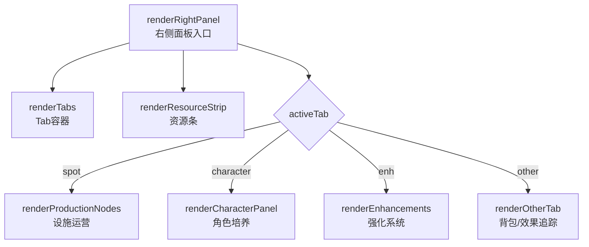
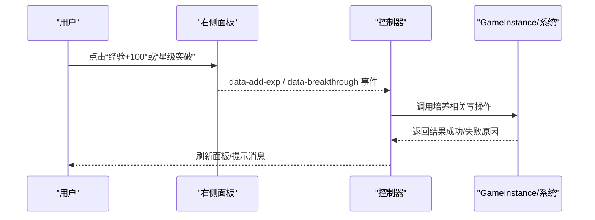
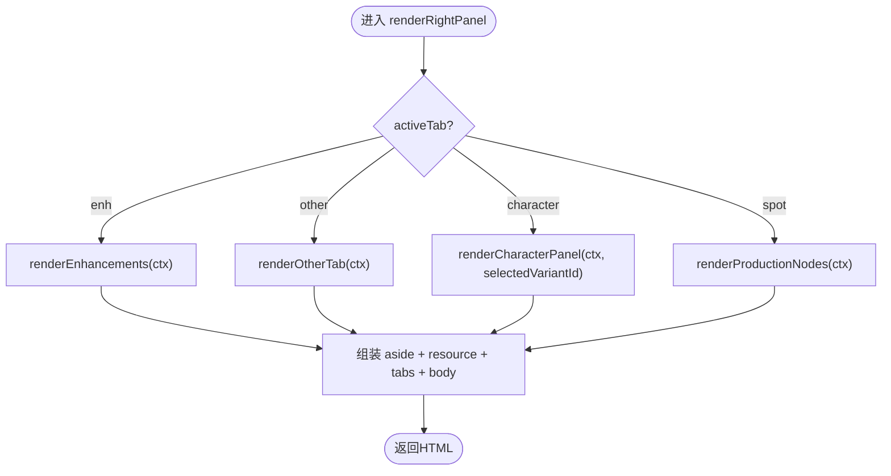
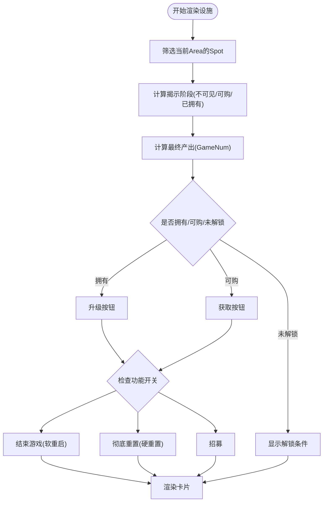
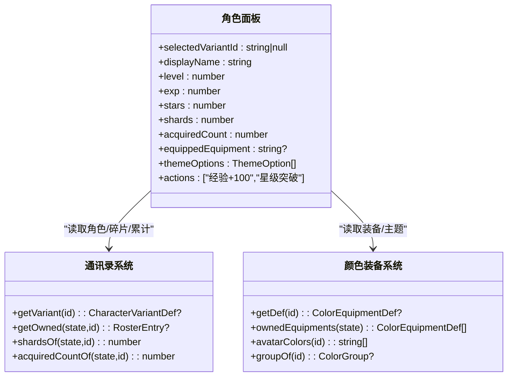
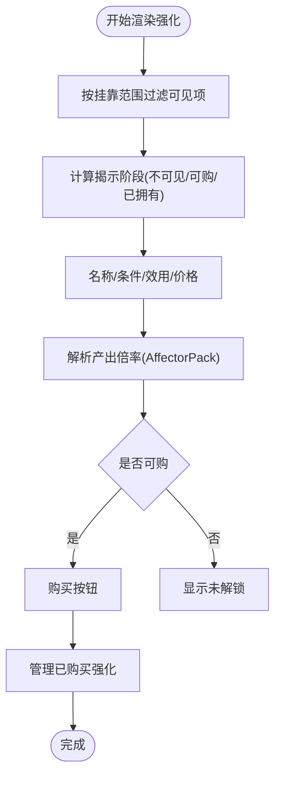
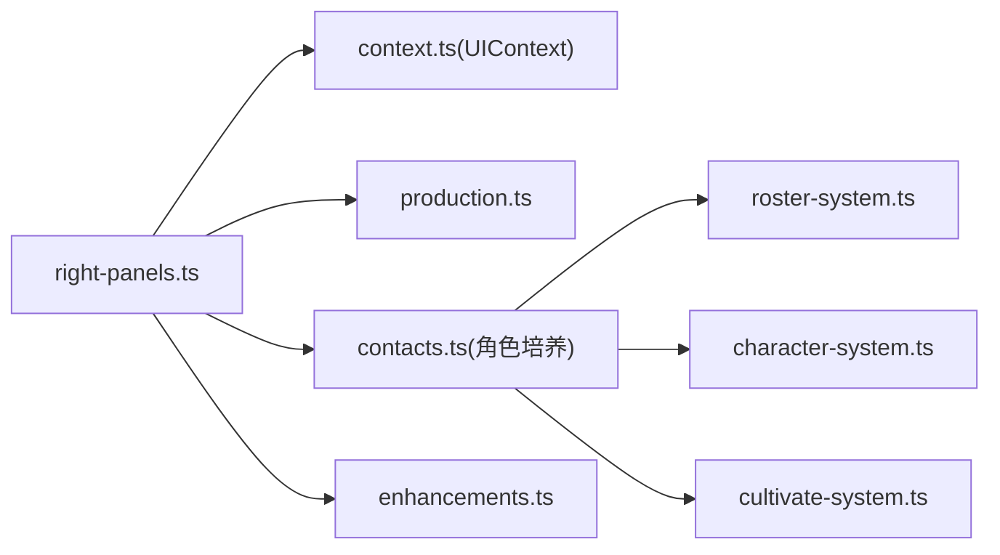

# RightPanels右侧面板

<cite>
**本文引用的文件**
- [src/ui/components/right-panels.ts](file://src/ui/components/right-panels.ts)
- [src/ui/components/contacts.ts](file://src/ui/components/contacts.ts)
- [src/ui/components/enhancements.ts](file://src/ui/components/enhancements.ts)
- [src/ui/components/production.ts](file://src/ui/components/production.ts)
- [src/ui/context.ts](file://src/ui/context.ts)
- [src/engine/system/roster-system.ts](file://src/engine/system/roster-system.ts)
- [src/engine/system/cultivate-system.ts](file://src/engine/system/cultivate-system.ts)
- [src/engine/system/character-system.ts](file://src/engine/system/character-system.ts)
</cite>

## 目录
1. [简介](#简介)
2. [项目结构](#项目结构)
3. [核心组件](#核心组件)
4. [架构总览](#架构总览)
5. [详细组件分析](#详细组件分析)
6. [依赖关系分析](#依赖关系分析)
7. [性能考量](#性能考量)
8. [故障排查指南](#故障排查指南)
9. [结论](#结论)
10. [附录：定制与扩展指南](#附录定制与扩展指南)

## 简介
RightPanels右侧面板是游戏的辅助信息展示区域，承担“设施运营、角色培养、强化系统、其他（背包与效果追踪）”等多功能切换。其设计目标是：以统一的Tab容器承载不同业务视图；通过selectedVariantId差分ID精准定位当前角色，驱动角色培养进度、属性计算与交互操作；与游戏系统解耦集成，只读渲染由UIContext提供，写操作经控制器委托到引擎服务，保证状态一致性与可测试性。

## 项目结构
右侧面板由一个入口渲染函数负责Tab路由，并调用各子模块渲染器：
- 设施（生产节点）：按当前Area过滤Spot卡片，显示产出、升级、招募等功能按钮
- 学生（通讯录/角色培养）：左侧通讯录列表 + 右侧角色详情（等级、星级、碎片、装备、配色等）
- 强化：按挂靠范围过滤可见的Enhancement卡片，支持购买与管理
- 其他：背包清单与生效中的Affector追踪

图表来源
- [src/ui/components/right-panels.ts:10-34](file://src/ui/components/right-panels.ts#L10-L34)

章节来源
- [src/ui/components/right-panels.ts:10-34](file://src/ui/components/right-panels.ts#L10-L34)

## 核心组件
- 右侧面板入口：根据activeTab选择对应渲染逻辑，统一包裹资源条与Tab容器
- 设施面板：基于当前Area过滤Spot，计算最终产出，提供升级/重启/重置/招募等操作入口
- 角色面板：基于selectedVariantId读取RosterEntry与CharacterVariantDef，展示等级、星级、碎片、累计获得次数、色彩装备与主题选项
- 强化面板：按挂靠范围（全局/世界线/区域）过滤可见项，展示解锁条件、价格、效用文案，支持购买与管理
- 其他面板：列出背包物品与生效中的Affector实例，便于调试与追踪

章节来源
- [src/ui/components/right-panels.ts:17-34](file://src/ui/components/right-panels.ts#L17-L34)
- [src/ui/components/production.ts:31-125](file://src/ui/components/production.ts#L31-L125)
- [src/ui/components/contacts.ts:253-302](file://src/ui/components/contacts.ts#L253-L302)
- [src/ui/components/enhancements.ts:42-106](file://src/ui/components/enhancements.ts#L42-L106)
- [src/ui/components/right-panels.ts:36-70](file://src/ui/components/right-panels.ts#L36-L70)

## 架构总览
右侧面板遵循“只读渲染 + 事件委托”的架构原则：
- UIContext提供只读门面（state、registry、各查询系统），组件仅消费数据
- 写操作通过data-*属性委托给控制器，再由控制器调用引擎服务（如StateMutationService）执行
- selectedVariantId作为关键差分ID，贯穿角色选择、培养进度展示与属性计算

图表来源
- [src/ui/components/contacts.ts:253-302](file://src/ui/components/contacts.ts#L253-L302)
- [src/ui/context.ts:25-66](file://src/ui/context.ts#L25-L66)

章节来源
- [src/ui/context.ts:25-66](file://src/ui/context.ts#L25-L66)

## 详细组件分析

### 右侧面板入口与Tab路由
- Tab定义：设施、学生、强化、其他
- 路由逻辑：根据activeTab选择对应渲染器；当activeTab为character时传入selectedVariantId
- 资源条与Tab容器：统一包装在aside.panel.right-panel中

图表来源
- [src/ui/components/right-panels.ts:10-34](file://src/ui/components/right-panels.ts#L10-L34)

章节来源
- [src/ui/components/right-panels.ts:10-34](file://src/ui/components/right-panels.ts#L10-L34)

### 设施面板（生产节点）
- 过滤规则：仅展示当前Area下的Spot
- 揭示机制：根据getSpotReveal决定名称、描述、产出是否可见
- 产出计算：game.gameNumSystem.evaluateSpotYield实时求值，考虑基础产出、倍率与挂载功能
- 交互能力：升级、结束游戏（软重启）、彻底重置（硬重置）、招募（若具备gacha功能）
- 主题样式：Spot自有theme/colorGroupId会生成ThemeTree并作用域化到卡片

图表来源
- [src/ui/components/production.ts:31-125](file://src/ui/components/production.ts#L31-L125)

章节来源
- [src/ui/components/production.ts:31-125](file://src/ui/components/production.ts#L31-L125)

### 角色面板（角色培养）
- 输入：selectedVariantId必须指向已拥有的差分
- 数据源：
  - CharacterVariantDef：名称、学校、稀有度、主题等
  - RosterEntry：等级、经验、星级、累计获得次数、装备等
  - 碎片余额：shardsOf(variantId)
- 展示内容：
  - 基本信息：等级、经验、星级、碎片、累计获得次数
  - 色彩装备：已装备卡片（头像SVG预览、名称、效用简述、卸下按钮）与可装备列表
  - 配色设计：实体主题选项（受equippedEquipment影响）
- 交互：
  - 经验+100：触发addExp流程（由控制器处理）
  - 星级突破：触发breakthroughStar流程（由控制器处理）

图表来源
- [src/ui/components/contacts.ts:253-302](file://src/ui/components/contacts.ts#L253-L302)
- [src/engine/system/roster-system.ts:41-67](file://src/engine/system/roster-system.ts#L41-L67)

章节来源
- [src/ui/components/contacts.ts:253-302](file://src/ui/components/contacts.ts#L253-L302)
- [src/engine/system/roster-system.ts:41-67](file://src/engine/system/roster-system.ts#L41-L67)

### 强化面板（增强系统）
- 可见性：
  - global挂靠强化不在右侧面板出现（在全局强化选择页管理）
  - init挂靠强化仅在对应activeInit下可见
  - area挂靠强化仅在对应area下可见
- 揭示阶梯：名称、条件、效用、价格逐步解锁
- 产出倍率文案：从Enhancement挂载的AffectorPack解析zoneModifiers，输出“+X%（全局/标签）”
- 交互：
  - 购买：校验条件与资源后购买，成功后局部刷新卡片与详情
  - 管理：查看已购买强化并可移除

图表来源
- [src/ui/components/enhancements.ts:42-106](file://src/ui/components/enhancements.ts#L42-L106)

章节来源
- [src/ui/components/enhancements.ts:42-106](file://src/ui/components/enhancements.ts#L42-L106)

### 其他面板（背包与效果追踪）
- 背包：遍历view.inventory，逐项显示名称、数量与使用按钮（消耗品）
- 效果追踪：遍历activeAffectors，显示packId短名与详情（或激活条目数）

章节来源
- [src/ui/components/right-panels.ts:36-70](file://src/ui/components/right-panels.ts#L36-L70)

## 依赖关系分析
- UIContext提供只读门面，包含state、registry与各查询系统（valueSystem、conditionSystem、gameNumSystem、affectorEngine、characterSystem、rosterSystem、availabilityService、colorSystem、colorEquipmentSystem、gachaService、spotFunctionalitySystem、statsService、charaProfiles、pics、story、spot）
- 右侧面板通过UIContext消费数据，不直接持有写入口
- 角色培养涉及cultivate-system进行纯计算（经验推演、突破校验），写操作由控制器委托至引擎服务

图表来源
- [src/ui/context.ts:25-66](file://src/ui/context.ts#L25-L66)
- [src/ui/components/right-panels.ts:10-34](file://src/ui/components/right-panels.ts#L10-L34)
- [src/engine/system/roster-system.ts:38-105](file://src/engine/system/roster-system.ts#L38-L105)
- [src/engine/system/character-system.ts:18-87](file://src/engine/system/character-system.ts#L18-L87)
- [src/engine/system/cultivate-system.ts:15-107](file://src/engine/system/cultivate-system.ts#L15-L107)

章节来源
- [src/ui/context.ts:25-66](file://src/ui/context.ts#L25-L66)
- [src/ui/components/right-panels.ts:10-34](file://src/ui/components/right-panels.ts#L10-L34)
- [src/engine/system/roster-system.ts:38-105](file://src/engine/system/roster-system.ts#L38-L105)
- [src/engine/system/character-system.ts:18-87](file://src/engine/system/character-system.ts#L18-L87)
- [src/engine/system/cultivate-system.ts:15-107](file://src/engine/system/cultivate-system.ts#L15-L107)

## 性能考量
- 设施产出采用懒求值（GameNum），避免重复计算，随状态变化实时更新
- 强化面板对可见性进行过滤，减少DOM节点数量
- 角色面板的头像SVG与主题树按需构建，避免不必要的重绘
- 建议：
  - 对大量列表项（如Spot、Enhancement）使用虚拟滚动或分页
  - 将耗时计算（如GameNum求值）延迟到可视区域
  - 缓存常用查询结果（如contactGroups、codex）并在状态变更时失效

[本节为通用指导，无需特定文件引用]

## 故障排查指南
- 角色面板为空或未选择：检查selectedVariantId是否为null或未拥有该差分
- 强化面板无可见项：确认挂靠范围与当前Area/Init匹配；检查揭示条件是否满足
- 设施产出为0或???：确认utilityKnown与reveal阶段；检查GameNum表达式与挂载功能
- 背包为空：检查view.inventory是否有数据；确认物品类型与使用按钮逻辑
- 效果追踪为空：检查activeAffectors是否为空；确认AffectorPack是否存在

章节来源
- [src/ui/components/contacts.ts:253-257](file://src/ui/components/contacts.ts#L253-L257)
- [src/ui/components/enhancements.ts:47-57](file://src/ui/components/enhancements.ts#L47-L57)
- [src/ui/components/production.ts:40-52](file://src/ui/components/production.ts#L40-L52)
- [src/ui/components/right-panels.ts:36-70](file://src/ui/components/right-panels.ts#L36-L70)

## 结论
RightPanels右侧面板以Tab为统一入口，将设施运营、角色培养、强化系统与辅助信息整合在同一界面。通过UIContext实现只读渲染与写操作分离，确保架构清晰与可维护性。selectedVariantId作为关键差分ID，贯穿角色选择、培养进度与属性计算。配合揭示机制与GameNum懒求值，面板既能高效展示信息，又能响应状态变化。

[本节为总结，无需特定文件引用]

## 附录：定制与扩展指南
- 新增Tab：
  - 在RIGHT_TABS中添加新Tab定义
  - 在renderRightPanel中增加分支，调用新的渲染器
- 扩展角色面板：
  - 在contacts.ts的renderCharacterPanel中增加新的展示字段或交互按钮
  - 通过UIContext访问colorSystem、colorEquipmentSystem等系统进行数据读取
- 扩展强化面板：
  - 在enhancements.ts中调整可见性过滤逻辑与揭示文案
  - 通过AffectorPack解析产出倍率文案
- 扩展设施面板：
  - 在production.ts中增加新功能开关（如新的spot functionality）
  - 调整GameNum求值与产出展示
- 事件委托：
  - 所有写操作通过data-*属性绑定，控制器层统一处理并调用引擎服务
  - 建议在控制器中集中处理错误提示与局部刷新

章节来源
- [src/ui/components/right-panels.ts:10-34](file://src/ui/components/right-panels.ts#L10-L34)
- [src/ui/components/contacts.ts:253-302](file://src/ui/components/contacts.ts#L253-L302)
- [src/ui/components/enhancements.ts:42-106](file://src/ui/components/enhancements.ts#L42-L106)
- [src/ui/components/production.ts:31-125](file://src/ui/components/production.ts#L31-L125)
- [src/ui/context.ts:25-66](file://src/ui/context.ts#L25-L66)