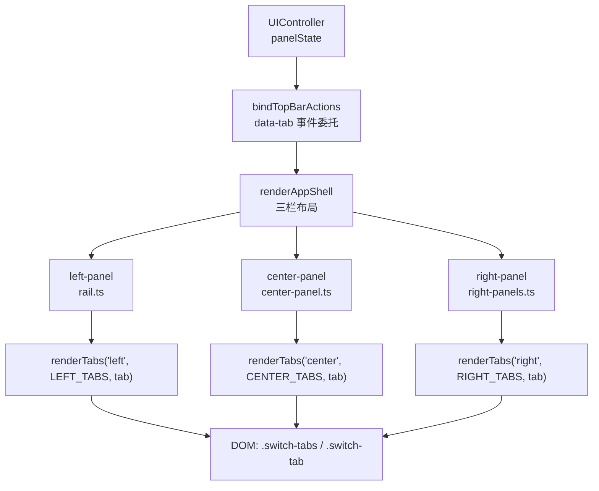
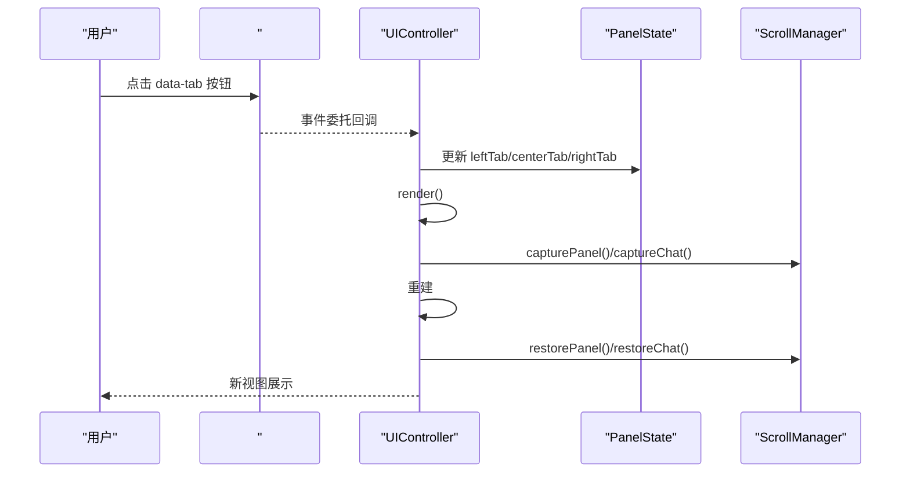
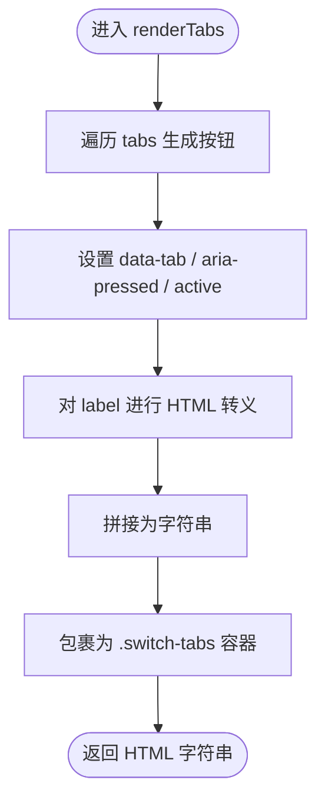
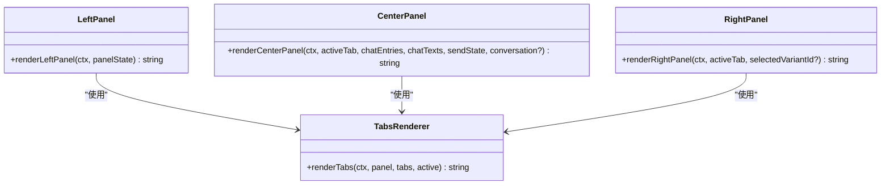
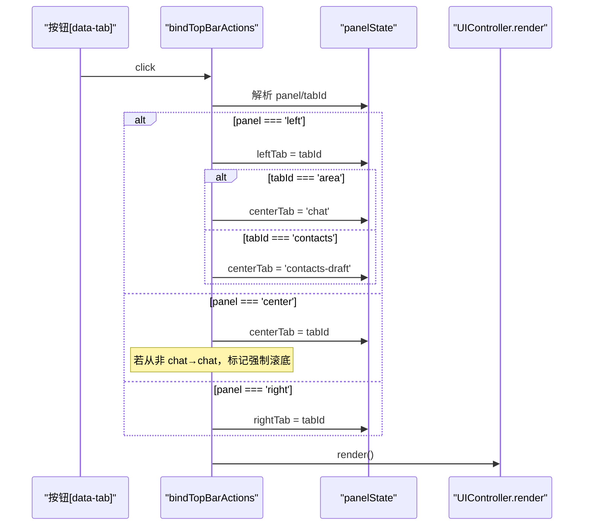
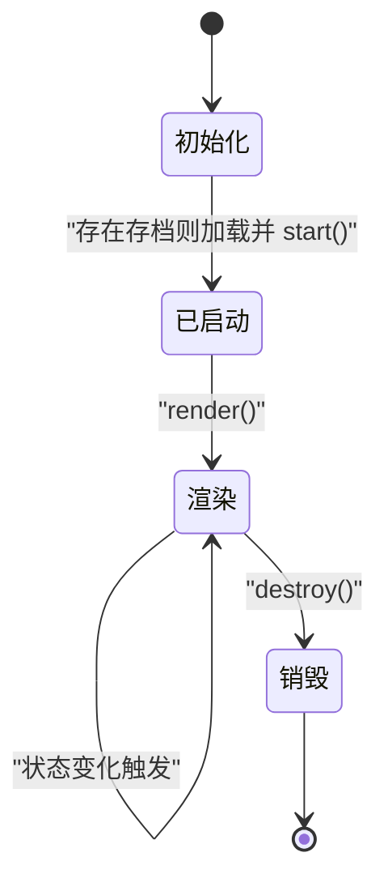
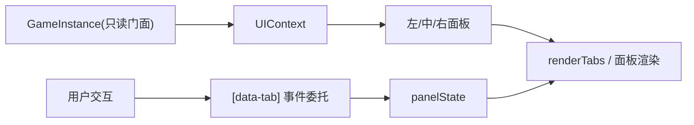
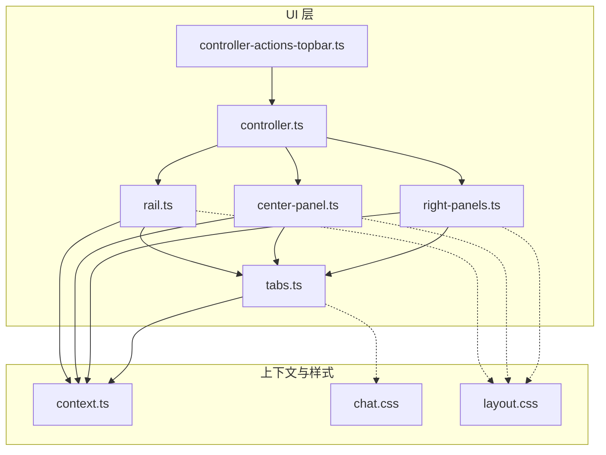

# Tabs标签页系统

<cite>
**本文引用的文件**
- [tabs.ts](file://src/ui/components/tabs.ts)
- [controller-actions-topbar.ts](file://src/ui/controller-actions-topbar.ts)
- [center-panel.ts](file://src/ui/components/center-panel.ts)
- [rail.ts](file://src/ui/components/rail.ts)
- [right-panels.ts](file://src/ui/components/right-panels.ts)
- [context.ts](file://src/ui/context.ts)
- [controller.ts](file://src/ui/controller.ts)
- [chat.css](file://src/ui/css/chat.css)
- [layout.css](file://src/ui/css/layout.css)
</cite>

## 目录
1. [简介](#简介)
2. [项目结构](#项目结构)
3. [核心组件](#核心组件)
4. [架构总览](#架构总览)
5. [详细组件分析](#详细组件分析)
6. [依赖关系分析](#依赖关系分析)
7. [性能考量](#性能考量)
8. [故障排查指南](#故障排查指南)
9. [结论](#结论)
10. [附录](#附录)

## 简介
本技术文档围绕 UI 层的“Tabs 标签页系统”展开，系统性说明其设计模式、实现原理与使用方式。内容覆盖：
- 标签切换机制与状态保持
- 多标签页管理（注册、激活、联动）
- 生命周期与缓存策略（渲染重建与滚动恢复）
- 与父组件的数据绑定（状态同步、事件传递、双向数据流）
- 自定义标签页开发规范与最佳实践

该系统的目标是提供一套可复用、可扩展、低耦合的标签页能力，支撑左侧面板（区域/通讯录/故事）、中间面板（聊天/日志）、右侧面板（设施/学生/强化/其他）等多处场景的统一交互体验。

## 项目结构
Tabs 标签页由“渲染函数 + 面板组合 + 控制器事件绑定”三部分构成：
- 渲染层：renderTabs 负责生成一组 Tab 按钮与容器，注入 data-tab 标识与 active 样式
- 组合层：各面板（左/中/右）通过 renderTabs 渲染自身 Tab 栏，并决定当前激活项
- 控制层：统一的事件委托在 #app 根节点上监听 data-tab 点击，更新 panelState 并触发全量渲染

图表来源
- [controller.ts:61-80](file://src/ui/controller.ts#L61-L80)
- [controller-actions-topbar.ts:101-120](file://src/ui/controller-actions-topbar.ts#L101-L120)
- [rail.ts:16-35](file://src/ui/components/rail.ts#L16-L35)
- [center-panel.ts:7-63](file://src/ui/components/center-panel.ts#L7-L63)
- [right-panels.ts:10-33](file://src/ui/components/right-panels.ts#L10-L33)
- [tabs.ts:9-23](file://src/ui/components/tabs.ts#L9-L23)

章节来源
- [controller.ts:61-80](file://src/ui/controller.ts#L61-L80)
- [controller-actions-topbar.ts:101-120](file://src/ui/controller-actions-topbar.ts#L101-L120)
- [center-panel.ts:7-63](file://src/ui/components/center-panel.ts#L7-L63)
- [rail.ts:16-35](file://src/ui/components/rail.ts#L16-L35)
- [right-panels.ts:10-33](file://src/ui/components/right-panels.ts#L10-L33)
- [tabs.ts:9-23](file://src/ui/components/tabs.ts#L9-L23)

## 核心组件
- 标签定义与渲染
  - TabDef：描述每个标签的 id、label、可选 hint
  - renderTabs：根据传入的 panel、tabs、active 生成带 role="tablist" 的容器与若干 button，设置 data-tab="panel:id"、aria-pressed 与 active 类名
- 面板组合
  - 左侧面板：LEFT_TABS = { area, contacts, story }
  - 中间面板：CENTER_TABS = { chat, log }
  - 右侧面板：RIGHT_TABS = { spot, character, enh, other }
- 事件绑定与状态管理
  - bindTopBarActions：在 #app 内对所有 [data-tab] 按钮进行事件委托，解析 panel 与 tabId，更新 panelState.leftTab/centerTab/rightTab，并在必要时联动 centerTab（如 left=area → center=chat；left=contacts → center=contacts-draft）
  - UIController.render：全量重建 DOM，包含主题同步、滚动捕获/恢复、揭示指纹等

章节来源
- [tabs.ts:3-23](file://src/ui/components/tabs.ts#L3-L23)
- [center-panel.ts:7-63](file://src/ui/components/center-panel.ts#L7-L63)
- [rail.ts:16-35](file://src/ui/components/rail.ts#L16-L35)
- [right-panels.ts:10-33](file://src/ui/components/right-panels.ts#L10-L33)
- [controller-actions-topbar.ts:101-120](file://src/ui/controller-actions-topbar.ts#L101-L120)
- [controller.ts:189-225](file://src/ui/controller.ts#L189-L225)

## 架构总览
Tabs 系统采用“声明式配置 + 事件委托 + 集中状态”的模式：
- 声明式配置：各面板以 TabDef[] 声明可用标签
- 事件委托：统一在 #app 根节点监听 data-tab 点击，避免重复绑定
- 集中状态：panelState 作为单一事实源，驱动三栏渲染
- 渲染重建：每次状态变更调用 render() 重建 #app，并通过 ScrollManager 保留滚动位置

图表来源
- [controller-actions-topbar.ts:101-120](file://src/ui/controller-actions-topbar.ts#L101-L120)
- [controller.ts:189-225](file://src/ui/controller.ts#L189-L225)

## 详细组件分析

### 标签渲染器：renderTabs
- 输入：UIContext、panel 分组名、TabDef[]、active 标签 id
- 输出：带有 role="tablist" 的容器与若干 <button class="switch-tab">
- 关键点：
  - data-tab="panel:id" 用于事件委托定位
  - aria-pressed 与 active 类名表达当前激活态
  - 文本通过 ctx.escapeHtml 转义，防止 XSS

图表来源
- [tabs.ts:9-23](file://src/ui/components/tabs.ts#L9-L23)

章节来源
- [tabs.ts:3-23](file://src/ui/components/tabs.ts#L3-L23)
- [context.ts:57-88](file://src/ui/context.ts#L57-L88)

### 面板组合：左/中/右三栏
- 左侧面板（rail.ts）
  - 标签：area、contacts、story
  - 行为：选择 area 时联动 center 到 chat；选择 contacts 时联动到临时页
- 中间面板（center-panel.ts）
  - 标签：chat、log
  - 行为：从非 chat 切回 chat 时强制滚到底
- 右侧面板（right-panels.ts）
  - 标签：spot、character、enh、other
  - 行为：无特殊联动

图表来源
- [rail.ts:16-35](file://src/ui/components/rail.ts#L16-L35)
- [center-panel.ts:7-63](file://src/ui/components/center-panel.ts#L7-L63)
- [right-panels.ts:10-33](file://src/ui/components/right-panels.ts#L10-L33)
- [tabs.ts:9-23](file://src/ui/components/tabs.ts#L9-L23)

章节来源
- [rail.ts:16-35](file://src/ui/components/rail.ts#L16-L35)
- [center-panel.ts:7-63](file://src/ui/components/center-panel.ts#L7-L63)
- [right-panels.ts:10-33](file://src/ui/components/right-panels.ts#L10-L33)

### 事件绑定与状态流转：bindTopBarActions
- 事件委托：遍历所有 [data-tab] 按钮，解析 panel 与 tabId
- 状态更新：
  - leftTab：area → centerTab=chat；contacts → centerTab=contacts-draft
  - centerTab：若从非 chat 切换到 chat，则强制滚动到底
  - rightTab：直接赋值
- 渲染刷新：更新后调用 render()

图表来源
- [controller-actions-topbar.ts:101-120](file://src/ui/controller-actions-topbar.ts#L101-L120)
- [controller.ts:189-225](file://src/ui/controller.ts#L189-L225)

章节来源
- [controller-actions-topbar.ts:101-120](file://src/ui/controller-actions-topbar.ts#L101-L120)
- [controller.ts:189-225](file://src/ui/controller.ts#L189-L225)

### 生命周期与缓存策略
- 创建：首次 mount 时初始化 UIController，bindEvents，根据是否有存档决定是否渲染初始选择或加载游戏
- 渲染：render() 会先捕获滚动位置，再重建 #app，最后恢复滚动位置与主题浮窗
- 销毁：destroy() 清理定时器
- 缓存策略：
  - 滚动位置：通过 ScrollManager.capture/restore 在重建前后保存/恢复
  - 主题浮窗：跨 render 重建存活（开关与位置）
  - 揭示指纹：computeRevealFingerprint 用于条件变化时才重建 UI

图表来源
- [controller.ts:139-172](file://src/ui/controller.ts#L139-L172)
- [controller.ts:189-225](file://src/ui/controller.ts#L189-L225)

章节来源
- [controller.ts:139-172](file://src/ui/controller.ts#L139-L172)
- [controller.ts:189-225](file://src/ui/controller.ts#L189-L225)

### 与父组件的数据绑定机制
- 单向数据流：UIContext 暴露只读门面，组件仅读取状态，不直接修改
- 状态中心：UIController.panelState 是标签页状态的唯一来源
- 事件传递：通过 data-* 属性与事件委托将用户操作映射到 panelState 更新
- 双向效果：面板渲染依赖 panelState；panelState 变化触发 render() 重新渲染

图表来源
- [context.ts:25-66](file://src/ui/context.ts#L25-L66)
- [controller.ts:61-80](file://src/ui/controller.ts#L61-L80)
- [controller-actions-topbar.ts:101-120](file://src/ui/controller-actions-topbar.ts#L101-L120)

章节来源
- [context.ts:25-66](file://src/ui/context.ts#L25-L66)
- [controller.ts:61-80](file://src/ui/controller.ts#L61-L80)
- [controller-actions-topbar.ts:101-120](file://src/ui/controller-actions-topbar.ts#L101-L120)

### 自定义标签页开发规范与最佳实践
- 新增标签步骤
  1) 在对应面板文件中定义 TabDef[]（如 LEFT_TABS/CENTER_TABS/RIGHT_TABS）
  2) 在面板渲染函数中根据 activeTab 分支渲染具体 body
  3) 如需联动其他面板，在 bindTopBarActions 中补充逻辑
  4) 确保按钮具备 data-tab="panel:id"、aria-pressed 与 active 类名
- 命名与可访问性
  - id 使用稳定、可读的标识符
  - 使用 role="tablist" 与 aria-pressed 提升无障碍支持
- 性能建议
  - 避免在 render 中进行昂贵计算，尽量基于 UIContext 的只读查询
  - 利用 ScrollManager 减少重绘抖动
  - 仅在必要时触发 render()，合并多次状态更新
- 安全建议
  - 所有用户可见文本通过 ctx.escapeHtml 转义
- 测试建议
  - 针对面板渲染函数与事件委托路径编写单元测试
  - 验证不同 panel 下的联动行为与滚动恢复

章节来源
- [center-panel.ts:7-63](file://src/ui/components/center-panel.ts#L7-L63)
- [rail.ts:16-35](file://src/ui/components/rail.ts#L16-L35)
- [right-panels.ts:10-33](file://src/ui/components/right-panels.ts#L10-L33)
- [controller-actions-topbar.ts:101-120](file://src/ui/controller-actions-topbar.ts#L101-L120)
- [tabs.ts:9-23](file://src/ui/components/tabs.ts#L9-L23)

## 依赖关系分析
- 组件间耦合
  - 面板组件仅依赖 renderTabs 与 UIContext，耦合度低
  - 控制器通过 panelState 统一管理状态，降低面板间直接耦合
- 外部依赖
  - UIContext 提供只读游戏状态与工具方法
  - ScrollManager 负责滚动位置捕获与恢复
  - CSS 样式通过 .switch-tabs/.switch-tab/.active 控制外观

图表来源
- [tabs.ts:9-23](file://src/ui/components/tabs.ts#L9-L23)
- [rail.ts:16-35](file://src/ui/components/rail.ts#L16-L35)
- [center-panel.ts:7-63](file://src/ui/components/center-panel.ts#L7-L63)
- [right-panels.ts:10-33](file://src/ui/components/right-panels.ts#L10-L33)
- [controller-actions-topbar.ts:101-120](file://src/ui/controller-actions-topbar.ts#L101-L120)
- [controller.ts:189-225](file://src/ui/controller.ts#L189-L225)
- [context.ts:57-88](file://src/ui/context.ts#L57-L88)
- [chat.css:7-38](file://src/ui/css/chat.css#L7-L38)
- [layout.css:201-245](file://src/ui/css/layout.css#L201-L245)

章节来源
- [tabs.ts:9-23](file://src/ui/components/tabs.ts#L9-L23)
- [controller-actions-topbar.ts:101-120](file://src/ui/controller-actions-topbar.ts#L101-L120)
- [controller.ts:189-225](file://src/ui/controller.ts#L189-L225)
- [context.ts:57-88](file://src/ui/context.ts#L57-L88)
- [chat.css:7-38](file://src/ui/css/chat.css#L7-L38)
- [layout.css:201-245](file://src/ui/css/layout.css#L201-L245)

## 性能考量
- 最小化重排重绘
  - 使用事件委托减少监听器数量
  - 通过 ScrollManager 捕获/恢复滚动位置，避免列表跳动
- 渲染优化
  - 仅在状态变化时调用 render()
  - 利用 UIContext 的只读查询，避免在渲染中执行副作用
- 内存占用
  - 标签页本身轻量，主要开销来自面板内容（聊天流、故事列表等）
  - 注意聊天历史长度限制与懒加载策略（由聊天流模块负责）
- 可维护性
  - 通过 TabDef 集中声明标签，便于扩展与维护
  - 事件委托统一处理，降低分散绑定的风险

## 故障排查指南
- 标签未高亮
  - 检查 active 是否正确传入 renderTabs
  - 确认 panelState 中的对应 tab 是否被正确更新
- 点击无效
  - 确认按钮具有 data-tab="panel:id"
  - 确认 bindTopBarActions 已在 render 后调用
- 滚动位置异常
  - 检查 ScrollManager.capture/restore 是否在 render 前后正确调用
- 联动失效
  - 检查 bindTopBarActions 中对 leftTab=centerTab 的联动逻辑是否符合预期
- 样式不生效
  - 确认 .switch-tabs/.switch-tab/.active 样式已引入
  - 检查是否存在 CSS 优先级冲突

章节来源
- [controller-actions-topbar.ts:101-120](file://src/ui/controller-actions-topbar.ts#L101-L120)
- [controller.ts:189-225](file://src/ui/controller.ts#L189-L225)
- [chat.css:7-38](file://src/ui/css/chat.css#L7-L38)
- [layout.css:201-245](file://src/ui/css/layout.css#L201-L245)

## 结论
Tabs 标签页系统通过“声明式配置 + 事件委托 + 集中状态”的架构，实现了简洁、可维护且高性能的多标签页管理能力。配合 UIContext 的只读门面与 ScrollManager 的滚动恢复，系统在频繁渲染下仍能保持流畅的用户体验。遵循本文的开发规范与最佳实践，可快速扩展新的标签页与面板，同时保证一致性与可访问性。

## 附录
- 关键数据结构
  - TabDef：{ id, label, hint? }
  - PanelState：包含 leftTab、centerTab、rightTab 等面板状态字段
- 常用 API
  - renderTabs(ctx, panel, tabs, active)
  - bindTopBarActions(ctrl)
  - UIController.render()
- 相关样式
  - .switch-tabs：标签容器
  - .switch-tab：标签按钮
  - .switch-tab.active：激活态样式

章节来源
- [tabs.ts:3-23](file://src/ui/components/tabs.ts#L3-L23)
- [controller.ts:61-80](file://src/ui/controller.ts#L61-L80)
- [controller-actions-topbar.ts:101-120](file://src/ui/controller-actions-topbar.ts#L101-L120)
- [chat.css:7-38](file://src/ui/css/chat.css#L7-L38)
- [layout.css:201-245](file://src/ui/css/layout.css#L201-L245)