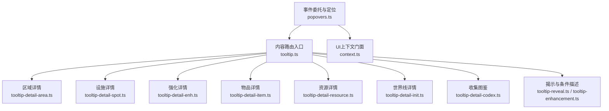
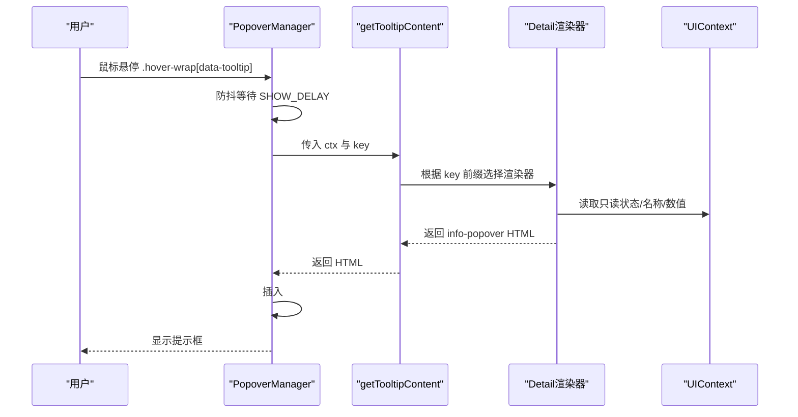
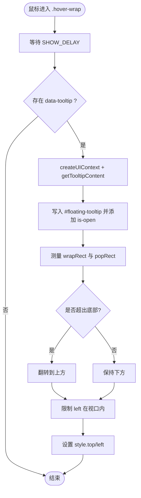
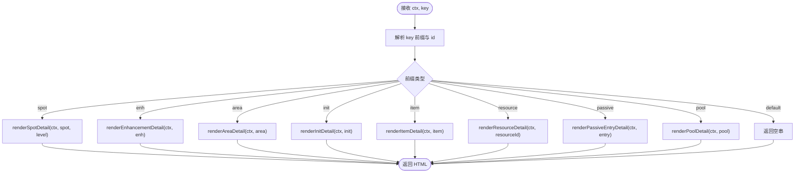
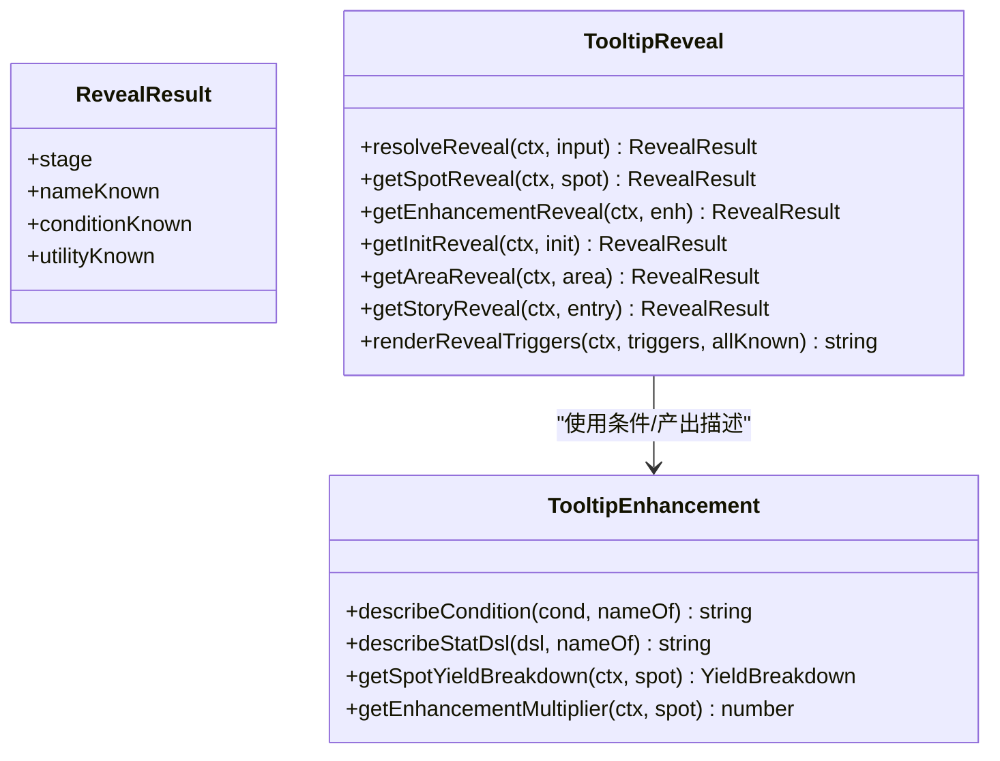
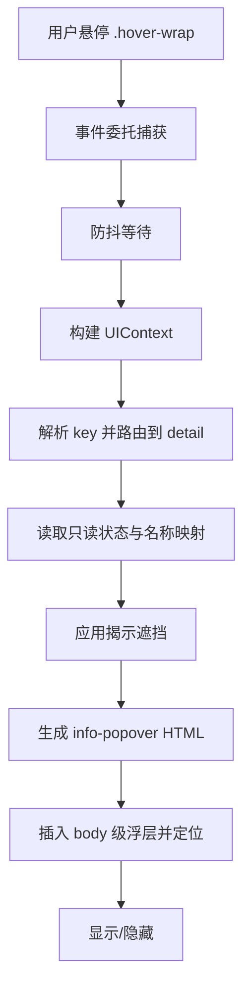
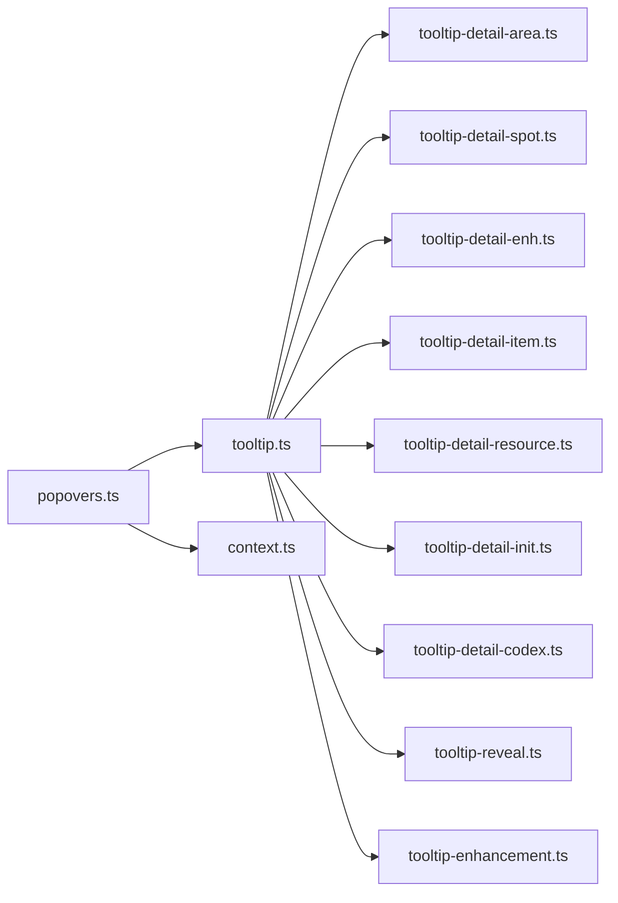

# 工具提示系统

<cite>
**本文引用的文件**
- [tooltip.ts](file://src/ui/components/tooltip.ts)
- [tooltip-detail-area.ts](file://src/ui/components/tooltip-detail-area.ts)
- [tooltip-detail-item.ts](file://src/ui/components/tooltip-detail-item.ts)
- [tooltip-detail-enh.ts](file://src/ui/components/tooltip-detail-enh.ts)
- [tooltip-detail-spot.ts](file://src/ui/components/tooltip-detail-spot.ts)
- [tooltip-detail-init.ts](file://src/ui/components/tooltip-detail-init.ts)
- [tooltip-detail-resource.ts](file://src/ui/components/tooltip-detail-resource.ts)
- [tooltip-detail-codex.ts](file://src/ui/components/tooltip-detail-codex.ts)
- [tooltip-enhancement.ts](file://src/ui/components/tooltip-enhancement.ts)
- [tooltip-reveal.ts](file://src/ui/components/tooltip-reveal.ts)
- [popovers.ts](file://src/ui/popovers.ts)
- [context.ts](file://src/ui/context.ts)
</cite>

## 目录
1. [简介](#简介)
2. [项目结构](#项目结构)
3. [核心组件](#核心组件)
4. [架构总览](#架构总览)
5. [详细组件分析](#详细组件分析)
6. [依赖关系分析](#依赖关系分析)
7. [性能考量](#性能考量)
8. [故障排查指南](#故障排查指南)
9. [结论](#结论)
10. [附录](#附录)

## 简介
本技术文档围绕“工具提示系统”展开，聚焦 Tooltip 组件的设计理念与实现原理，涵盖悬浮提示、位置计算、内容渲染等核心能力；深入解释不同类型提示框的实现（区域详情、设施详情、强化信息、物品信息、资源信息、世界线信息、收集图鉴等）；系统化说明提示框的定位算法（视口适配、边界检测、智能定位）；并文档化与游戏数据的集成方式（动态内容加载、格式化显示、链接跳转）。最后提供定制化和性能优化建议，帮助读者在现有架构上扩展新的提示类型或优化交互体验。

## 项目结构
工具提示系统由“事件与定位层”、“内容路由与渲染层”、“数据与揭示层”三部分组成：
- 事件与定位层：负责监听鼠标事件、防抖显示/隐藏、将浮层挂载到 body 级容器并进行视口内定位。
- 内容路由与渲染层：根据 key 类型分发到对应 detail 渲染函数，生成带统一样式的 HTML 片段。
- 数据与揭示层：基于 UIContext 读取只读游戏状态，按“可见性→可知性”的阶梯控制信息遮挡与展示。

图表来源
- [popovers.ts:1-131](file://src/ui/popovers.ts#L1-L131)
- [tooltip.ts:1-78](file://src/ui/components/tooltip.ts#L1-L78)
- [tooltip-detail-area.ts:1-67](file://src/ui/components/tooltip-detail-area.ts#L1-L67)
- [tooltip-detail-spot.ts:1-114](file://src/ui/components/tooltip-detail-spot.ts#L1-L114)
- [tooltip-detail-enh.ts:1-84](file://src/ui/components/tooltip-detail-enh.ts#L1-L84)
- [tooltip-detail-item.ts:1-54](file://src/ui/components/tooltip-detail-item.ts#L1-L54)
- [tooltip-detail-resource.ts:1-34](file://src/ui/components/tooltip-detail-resource.ts#L1-L34)
- [tooltip-detail-init.ts:1-74](file://src/ui/components/tooltip-detail-init.ts#L1-L74)
- [tooltip-detail-codex.ts:1-80](file://src/ui/components/tooltip-detail-codex.ts#L1-L80)
- [tooltip-reveal.ts:1-190](file://src/ui/components/tooltip-reveal.ts#L1-L190)
- [tooltip-enhancement.ts:1-133](file://src/ui/components/tooltip-enhancement.ts#L1-L133)
- [context.ts:1-89](file://src/ui/context.ts#L1-L89)

章节来源
- [popovers.ts:1-131](file://src/ui/popovers.ts#L1-L131)
- [tooltip.ts:1-78](file://src/ui/components/tooltip.ts#L1-L78)
- [context.ts:1-89](file://src/ui/context.ts#L1-L89)

## 核心组件
- 悬浮弹层管理器 PopoverManager：绑定全局事件委托，管理 show/hide 防抖，创建/更新 body 级浮层，执行视口内定位。
- 内容路由 getTooltipContent：解析 key（如 spot:<id>、enh:<id>、area:<id>、init:<id>、item:<id>、resource:<id>、passive:<id>、pool:<id>），调用对应 detail 渲染器返回 HTML。
- 各 Detail 渲染器：按实体类型输出结构化信息面板，包含名称、描述、状态、数值、条件、标签等。
- 揭示系统 tooltip-reveal：计算“可见性→可知性”阶梯，决定名称/条件/效用是否已知，以及是否可达（可购买/进入/触发）。
- 条件与产出诊断 tooltip-enhancement：将条件 DSL/统计 DSL 转为可读文本，计算 Spot 产出倍率与分解。
- UI 上下文 context：为渲染提供只读游戏面、格式化数字/时间、HTML 转义、实体名映射等能力。

章节来源
- [popovers.ts:1-131](file://src/ui/popovers.ts#L1-L131)
- [tooltip.ts:1-78](file://src/ui/components/tooltip.ts#L1-L78)
- [tooltip-reveal.ts:1-190](file://src/ui/components/tooltip-reveal.ts#L1-L190)
- [tooltip-enhancement.ts:1-133](file://src/ui/components/tooltip-enhancement.ts#L1-L133)
- [context.ts:1-89](file://src/ui/context.ts#L1-L89)

## 架构总览
Tooltip 系统采用“事件委托 + 防抖 + 路由渲染 + 揭示控制”的分层设计：
- 事件层：通过 root 元素的事件委托捕获 hover-wrap[data-tooltip] 的 mouseover/mouseout，避免重复绑定。
- 渲染层：getTooltipContent 作为统一入口，按 key 前缀分派至具体 detail 渲染器，保证可扩展性与单一职责。
- 数据层：所有 detail 渲染器通过 UIContext 读取只读状态，不直接耦合 GameInstance，降低副作用风险。
- 揭示层：以 revealTriggers 为核心，统一处理 existence/name/condition/utility 的揭示阶段，确保信息遮挡一致。

图表来源
- [popovers.ts:42-131](file://src/ui/popovers.ts#L42-L131)
- [tooltip.ts:30-78](file://src/ui/components/tooltip.ts#L30-L78)
- [context.ts:57-89](file://src/ui/context.ts#L57-L89)

## 详细组件分析

### 悬浮弹层管理器（PopoverManager）
- 功能要点
  - 事件委托：在根节点监听 mouseover/mouseout，匹配 .hover-wrap[data-tooltip]。
  - 防抖策略：进入时延迟 SHOW_DELAY 再渲染，移出时快速 HIDE_DELAY 隐藏，提升交互流畅度。
  - 生命周期兼容：DOM 重建后调用 retainIfAnchored，若锚点已移除则关闭浮层，避免陈旧残留。
  - 定位算法：默认将浮层置于锚点下方，若超出视口底部则翻转至上侧；水平方向优先右对齐，必要时贴边或居中。
- 关键流程
  - 获取 wrapRect 与 popRect，计算 top/left，考虑 GAP 与 vw/vh 边界。
  - 使用 document.getElementById('floating-tooltip') 注入 HTML 并切换 is-open 类。
- 扩展点
  - 可通过调整 GAP、SHOW_DELAY、HIDE_DELAY 改变交互节奏。
  - 可在定位逻辑中增加更多策略（如左右翻转、跟随滚动等）。

图表来源
- [popovers.ts:42-131](file://src/ui/popovers.ts#L42-L131)

章节来源
- [popovers.ts:1-131](file://src/ui/popovers.ts#L1-L131)

### 内容路由与渲染（getTooltipContent）
- 功能要点
  - 解析 key 前缀（spot/enh/area/init/item/resource/passive/pool），从 registry 获取对应实体。
  - 调用相应 detail 渲染器，返回带有 .info-popover 的 HTML。
  - 对缺失实体或未知类型返回空字符串，避免无效浮层。
- 扩展点
  - 新增实体类型只需在前端注册分支并实现对应 detail 渲染器。
  - 可在此处加入缓存或预取逻辑以提升性能。

图表来源
- [tooltip.ts:30-78](file://src/ui/components/tooltip.ts#L30-L78)

章节来源
- [tooltip.ts:1-78](file://src/ui/components/tooltip.ts#L1-L78)

### 揭示系统与条件描述（tooltip-reveal / tooltip-enhancement）
- 揭示阶段
  - hidden → obfuscated → revealed 三级可知性，结合 existence 门槛与 name/condition/utility 目标达成情况。
  - resolveReveal 统一计算 stage、nameKnown、conditionKnown、utilityKnown，并支持 isAccessible 判定（可购买/进入/触发）。
- 条件与产出诊断
  - describeCondition 将原子条件与条件组转换为自然语言文本。
  - describeStatDsl 将统计 DSL 转换为可读文案。
  - getSpotYieldBreakdown 与 getEnhancementMultiplier 计算 Spot 产出倍率与分解，供 hover 展示。
- 作用范围
  - 被各 detail 渲染器用于遮挡未揭示信息（名称/条件/效用），并在末尾附加 revealTriggers 列表。

图表来源
- [tooltip-reveal.ts:1-190](file://src/ui/components/tooltip-reveal.ts#L1-L190)
- [tooltip-enhancement.ts:1-133](file://src/ui/components/tooltip-enhancement.ts#L1-L133)

章节来源
- [tooltip-reveal.ts:1-190](file://src/ui/components/tooltip-reveal.ts#L1-L190)
- [tooltip-enhancement.ts:1-133](file://src/ui/components/tooltip-enhancement.ts#L1-L133)

### 各类型提示框实现

#### 区域详情（Area）
- 展示项：名称、描述、当前/锁定状态、所属世界线、运营设施数量与明细、相邻区域、揭示 Trigger。
- 信息遮挡：依据 getAreaReveal 的 utilityKnown 控制描述与设施明细可见性。
- 数据来源：registry.areas、spotsOfArea、inits、visibility、spotLevels。

章节来源
- [tooltip-detail-area.ts:1-67](file://src/ui/components/tooltip-detail-area.ts#L1-L67)
- [tooltip-reveal.ts:124-133](file://src/ui/components/tooltip-reveal.ts#L124-L133)

#### 设施详情（Spot）
- 展示项：名称、描述、获取条件、等级、基础产出、Manager 加成、强化倍率、实际入账、功能列表、容量上限、升级费用与上限、标签、揭示 Trigger。
- 信息遮挡：依据 getSpotReveal 的 known/utilityKnown 控制运行数值与功能细节。
- 数据来源：registry.spots、spotFunctionalitySystem、valueSystem、gameNumSystem、spotLevels、spotManagers。

章节来源
- [tooltip-detail-spot.ts:1-114](file://src/ui/components/tooltip-detail-spot.ts#L1-L114)
- [tooltip-enhancement.ts:106-133](file://src/ui/components/tooltip-enhancement.ts#L106-L133)
- [tooltip-reveal.ts:97-105](file://src/ui/components/tooltip-reveal.ts#L97-L105)

#### 强化详情（Enhancement）
- 展示项：名称、描述、状态（已激活/可购买/未解锁）、解锁条件、购买花费、产出倍率与作用范围、最大叠加、附带效果、揭示 Trigger。
- 信息遮挡：依据 getEnhancementReveal 的 nameKnown/conditionKnown/utilityKnown 控制字段可见性。
- 数据来源：registry.enhancements、affectorEngine、revealTriggers。

章节来源
- [tooltip-detail-enh.ts:1-84](file://src/ui/components/tooltip-detail-enh.ts#L1-L84)
- [tooltip-reveal.ts:87-95](file://src/ui/components/tooltip-reveal.ts#L87-L95)

#### 物品详情（Item）
- 展示项：名称、稀有度、类型、持有数、最大堆叠、售价、使用效果、操作提示、揭示 Trigger。
- 数据来源：registry.items、view.inventory。

章节来源
- [tooltip-detail-item.ts:1-54](file://src/ui/components/tooltip-detail-item.ts#L1-L54)

#### 资源详情（Resource）
- 展示项：名称、当前持有、每 Tick 获取、累计产出/消耗、本次游玩产出、指定世界线产出。
- 数据来源：view.resources、statsService、gameNumSystem。

章节来源
- [tooltip-detail-resource.ts:1-34](file://src/ui/components/tooltip-detail-resource.ts#L1-L34)

#### 世界线详情（Init）
- 展示项：名称、描述、状态（当前世界线/已解锁/可购买/未解锁）、规模（AREA/SPOT 数量）、默认区域、解锁花费、进度提示、揭示 Trigger。
- 数据来源：registry.inits、areasOfInit、spotLevels、purchaseCost。

章节来源
- [tooltip-detail-init.ts:1-74](file://src/ui/components/tooltip-detail-init.ts#L1-L74)
- [tooltip-reveal.ts:107-122](file://src/ui/components/tooltip-reveal.ts#L107-L122)

#### 收集图鉴（被动池/条目）
- 展示项：池 gate 条件、权重合计、标签、子条目/子池、完成次数、奖励摘要、可用世界线、标签。
- 数据来源：registry.passivePools、passiveStories、state.storyLog。

章节来源
- [tooltip-detail-codex.ts:1-80](file://src/ui/components/tooltip-detail-codex.ts#L1-L80)

### 概念总览
以下流程图展示了 Tooltip 系统的通用工作流，适用于所有实体类型：

[此图为概念流程，无需源码引用]

## 依赖关系分析
- 模块耦合
  - popovers.ts 依赖 tooltip.ts 的内容路由与 context.ts 的 UI 上下文。
  - 各 detail 渲染器依赖 tooltip-reveal.ts 与 tooltip-enhancement.ts 进行揭示与条件描述。
  - 所有渲染器通过 UIContext 访问只读游戏面，避免直接耦合 GameInstance。
- 外部依赖
  - 引擎类型与系统：types、registry、valueSystem、conditionSystem、gameNumSystem、affectorEngine、statsService、spotFunctionalitySystem 等。
- 潜在循环
  - 当前结构清晰分层，未见循环依赖；detail 仅单向依赖 reveal/enhancement 与 context。

图表来源
- [popovers.ts:1-131](file://src/ui/popovers.ts#L1-L131)
- [tooltip.ts:1-78](file://src/ui/components/tooltip.ts#L1-L78)
- [tooltip-reveal.ts:1-190](file://src/ui/components/tooltip-reveal.ts#L1-L190)
- [tooltip-enhancement.ts:1-133](file://src/ui/components/tooltip-enhancement.ts#L1-L133)
- [context.ts:1-89](file://src/ui/context.ts#L1-L89)

章节来源
- [popovers.ts:1-131](file://src/ui/popovers.ts#L1-L131)
- [tooltip.ts:1-78](file://src/ui/components/tooltip.ts#L1-L78)
- [tooltip-reveal.ts:1-190](file://src/ui/components/tooltip-reveal.ts#L1-L190)
- [tooltip-enhancement.ts:1-133](file://src/ui/components/tooltip-enhancement.ts#L1-L133)
- [context.ts:1-89](file://src/ui/context.ts#L1-L89)

## 性能考量
- 防抖与懒渲染
  - 通过 SHOW_DELAY/HIDE_DELAY 减少频繁渲染与 DOM 操作，避免误触抖动。
- 最小化计算
  - 仅在需要时构建 UIContext 与渲染 HTML；detail 渲染器尽量复用只读查询结果。
- 避免重排重绘
  - 一次性写入 innerHTML，随后测量一次尺寸并设置样式，减少多次布局。
- 可扩展缓存
  - 可在 getTooltipContent 或 detail 渲染器中加入轻量缓存（如按 key 缓存 HTML 片段），注意失效策略（状态变化需清空）。
- 条件与产出计算
  - getSpotYieldBreakdown 与 getEnhancementMultiplier 涉及表达式求值，建议在高频场景下考虑结果缓存或增量更新。

[本节为通用指导，无需源码引用]

## 故障排查指南
- 浮层不显示
  - 检查元素是否具备 .hover-wrap[data-tooltip] 且 data-tooltip 格式正确（如 spot:<id>）。
  - 确认 PopoverManager 已 bind 且 root 节点正确。
- 浮层位置异常
  - 检查视口尺寸与 GAP 配置；必要时调整定位逻辑或增加翻转策略。
- 内容空白或错误
  - 核对 key 前缀与实体 ID 是否存在于 registry；查看 detail 渲染器是否返回空串。
- 信息遮挡不符合预期
  - 检查 revealTriggers 配置与 conditionMet 判定；确认 nameKnown/conditionKnown/utilityKnown 是否符合设计。
- 条件文本显示异常
  - 检查 describeCondition/describeStatDsl 是否能解析 DSL；未知函数或缺参会原样返回。

章节来源
- [popovers.ts:42-131](file://src/ui/popovers.ts#L42-L131)
- [tooltip.ts:30-78](file://src/ui/components/tooltip.ts#L30-L78)
- [tooltip-reveal.ts:29-85](file://src/ui/components/tooltip-reveal.ts#L29-L85)
- [tooltip-enhancement.ts:53-104](file://src/ui/components/tooltip-enhancement.ts#L53-L104)

## 结论
工具提示系统通过清晰的分层与模块化设计，实现了高内聚、低耦合的可扩展悬浮提示能力。事件委托与防抖保障了交互体验，内容路由与 detail 渲染器保证了多类型实体的统一呈现，揭示系统确保了信息遮挡的一致性。在此基础上，可按需扩展新实体类型、优化定位策略与性能表现，以满足更丰富的游戏内容与交互需求。

## 附录
- 定制建议
  - 新增实体类型：在 getTooltipContent 中添加分支，并实现对应 detail 渲染器；如需揭示控制，遵循 revealTriggers 约定。
  - 自定义定位：在 popovers.ts 的定位逻辑中增加翻转、居中、跟随滚动等策略。
  - 主题与样式：统一使用 .info-popover 及其子元素类名，便于主题覆盖。
- 最佳实践
  - 始终通过 UIContext 读取只读状态，避免在渲染器中引入副作用。
  - 合理使用揭示系统，确保未满足条件的信息以 ??? 遮挡。
  - 对复杂表达式求值（如产出倍率）进行必要缓存，避免重复计算。

[本节为通用指导，无需源码引用]