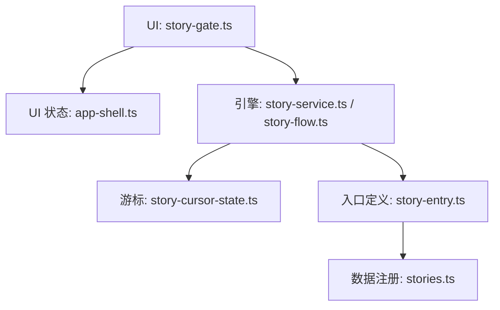
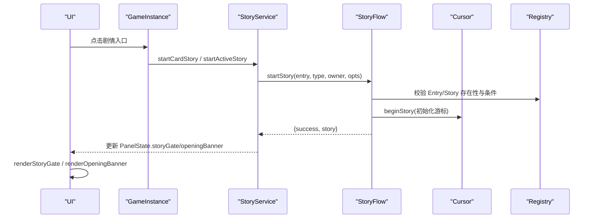
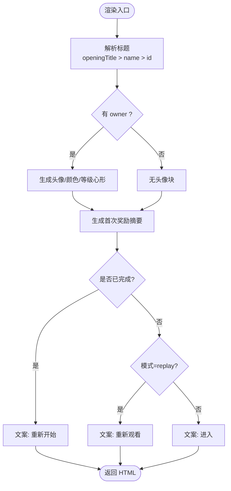
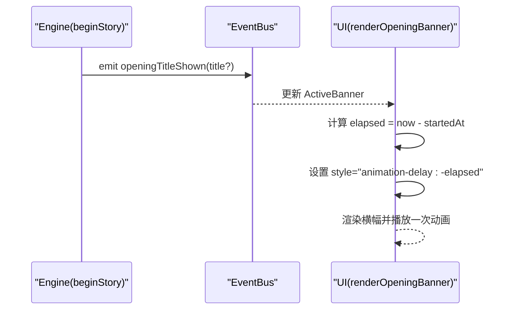
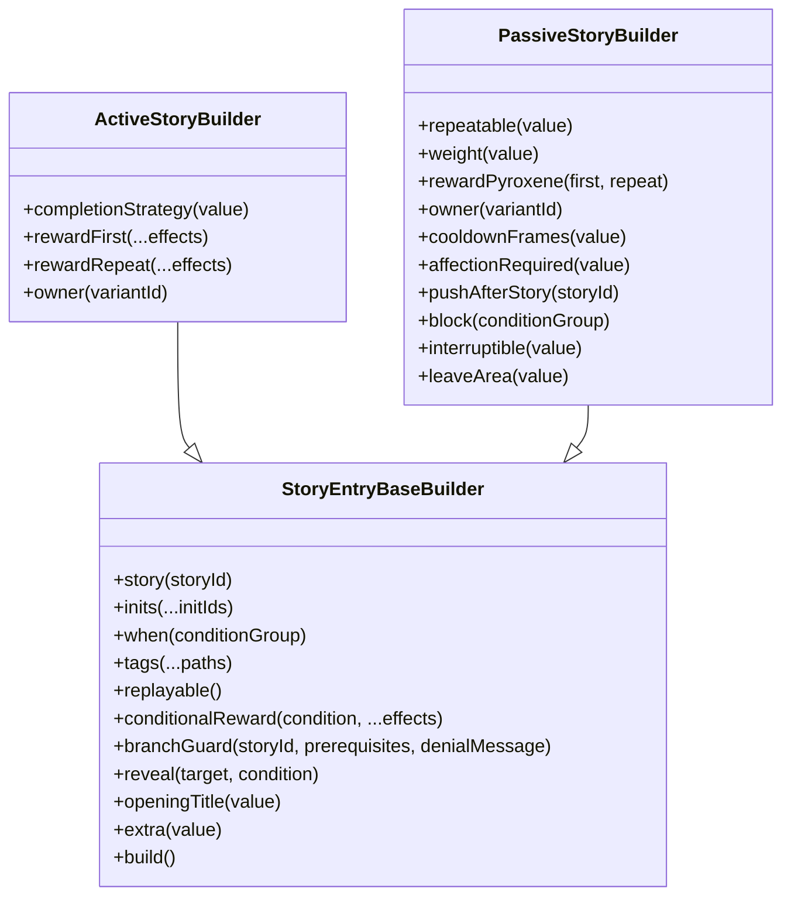
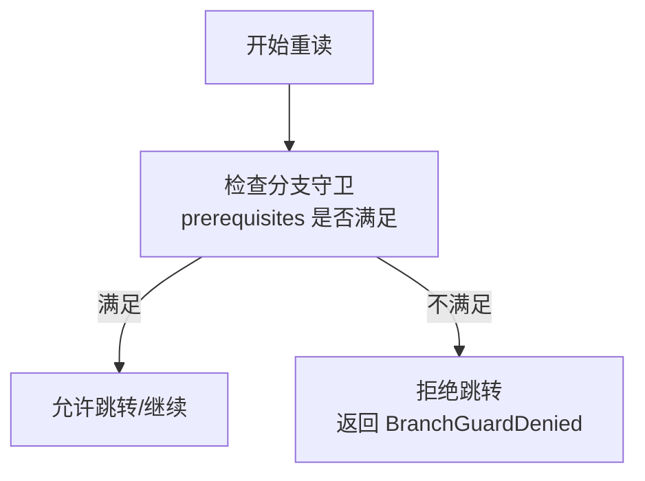
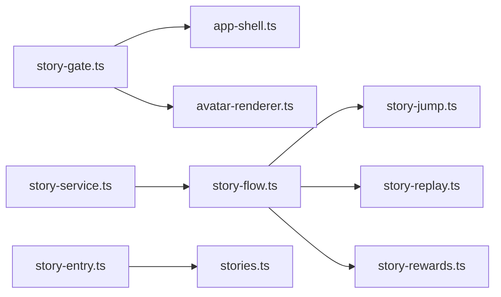

# 故事门组件

<cite>
**本文引用的文件**
- [src/ui/components/story-gate.ts](file://src/ui/components/story-gate.ts)
- [src/ui/components/app-shell.ts](file://src/ui/components/app-shell.ts)
- [src/engine/game/story-flow.ts](file://src/engine/game/story-flow.ts)
- [src/engine/game/story-service.ts](file://src/engine/game/story-service.ts)
- [src/engine/def-factory/story-entry.ts](file://src/engine/def-factory/story-entry.ts)
- [src/data/base/stories.ts](file://src/data/base/stories.ts)
- [src/engine/game/story-cursor-state.ts](file://src/engine/game/story-cursor-state.ts)
- [tests/ui/components/story-gate.test.ts](file://tests/ui/components/story-gate.test.ts)
</cite>

## 目录
1. [简介](#简介)
2. [项目结构](#项目结构)
3. [核心组件](#核心组件)
4. [架构总览](#架构总览)
5. [详细组件分析](#详细组件分析)
6. [依赖关系分析](#依赖关系分析)
7. [性能考量](#性能考量)
8. [故障排查指南](#故障排查指南)
9. [结论](#结论)
10. [附录](#附录)

## 简介
本文件聚焦“故事门组件”，即剧情入口确认浮层与开幕标题横幅的 UI 呈现与交互契约。该组件位于聊天窗格之上，负责：
- 在玩家点击剧情入口后弹出确认浮层，展示标题、角色头像、首次奖励摘要与进入按钮；
- 在剧情开始时根据 Talklet 效果显示开幕标题横幅（模糊出现→清晰→淡出）；
- 与引擎侧的剧情启动、推进、重读、跳转等流程紧密协作，保证 UI 状态与引擎游标一致。

## 项目结构
围绕“故事门”的关键代码分布在 UI 渲染层与引擎服务层：
- UI 层：story-gate.ts 提供渲染函数与常量；app-shell.ts 定义 StoryGateState 与 ActiveBanner 数据结构；
- 引擎层：story-service.ts 编排剧情服务；story-flow.ts 实现启动/推进/发送主流程；story-entry.ts 提供 Entry 构建器；stories.ts 注册基础入口与池；
- 游标：story-cursor-state.ts 维护当前剧情游标，支撑重读、跳转与分支守卫；
- 测试：story-gate.test.ts 覆盖渲染与断点续播行为。

图表来源
- [src/ui/components/story-gate.ts:1-117](file://src/ui/components/story-gate.ts#L1-L117)
- [src/ui/components/app-shell.ts:11-25](file://src/ui/components/app-shell.ts#L11-L25)
- [src/engine/game/story-service.ts:1-65](file://src/engine/game/story-service.ts#L1-L65)
- [src/engine/game/story-flow.ts:25-113](file://src/engine/game/story-flow.ts#L25-L113)
- [src/engine/def-factory/story-entry.ts:23-85](file://src/engine/def-factory/story-entry.ts#L23-L85)
- [src/data/base/stories.ts:38-127](file://src/data/base/stories.ts#L38-L127)
- [src/engine/game/story-cursor-state.ts:11-46](file://src/engine/game/story-cursor-state.ts#L11-L46)

章节来源
- [src/ui/components/story-gate.ts:1-117](file://src/ui/components/story-gate.ts#L1-L117)
- [src/ui/components/app-shell.ts:11-25](file://src/ui/components/app-shell.ts#L11-L25)
- [src/engine/game/story-service.ts:1-65](file://src/engine/game/story-service.ts#L1-L65)
- [src/engine/game/story-flow.ts:25-113](file://src/engine/game/story-flow.ts#L25-L113)
- [src/engine/def-factory/story-entry.ts:23-85](file://src/engine/def-factory/story-entry.ts#L23-L85)
- [src/data/base/stories.ts:38-127](file://src/data/base/stories.ts#L38-L127)
- [src/engine/game/story-cursor-state.ts:11-46](file://src/engine/game/story-cursor-state.ts#L11-L46)

## 核心组件
- 确认浮层渲染：renderStoryGate(ctx, gate)
  - 依据 StoryGateState 渲染标题、角色头像、好感等级心形角标、首次奖励摘要、进入/取消按钮；
  - 文案三态：replay=重新观看；已完结=重新开始；未完结=进入；
  - 标题优先级：entry.openingTitle > StoryDef.name > entry.id。
- 开幕横幅渲染：renderOpeningBanner(ctx, banner)
  - 纯 CSS 动画，按 startedAt 计算负 animation-delay 实现断点续播；
  - 常量 BANNER_ANIMATION_MS 为单一事实源，统一动画时长。
- 状态契约：
  - StoryGateState：storyId、owner、mode(active/replay/card)；
  - ActiveBanner：title、startedAt。

章节来源
- [src/ui/components/story-gate.ts:17-101](file://src/ui/components/story-gate.ts#L17-L101)
- [src/ui/components/story-gate.ts:104-117](file://src/ui/components/story-gate.ts#L104-L117)
- [src/ui/components/app-shell.ts:11-25](file://src/ui/components/app-shell.ts#L11-L25)

## 架构总览
故事门组件处于 UI 与引擎之间的桥梁位置：
- UI 通过 PanelState.storyGate 与 openingBanner 驱动渲染；
- 引擎通过事件与游标管理剧情生命周期；
- Entry 与 Story 分离：Entry 管触发与揭示，Story 管演出内容；
- 对话空间（owner）隔离：每个 VariantId 拥有独立聊天游标，互不打断。

图表来源
- [src/engine/game/story-service.ts:183-201](file://src/engine/game/story-service.ts#L183-L201)
- [src/engine/game/story-flow.ts:63-113](file://src/engine/game/story-flow.ts#L63-L113)
- [src/engine/game/story-flow.ts:25-50](file://src/engine/game/story-flow.ts#L25-L50)
- [src/ui/components/story-gate.ts:17-117](file://src/ui/components/story-gate.ts#L17-L117)

## 详细组件分析

### 确认浮层（Story Gate）
- 功能要点
  - 标题解析：优先使用 entry.openingTitle，回退到 StoryDef.name 或 entry.id；
  - 角色信息：若 owner 非空，尝试从角色差分获取头像与颜色组，否则回退首字母占位；
  - 奖励摘要：仅 active 类型且声明 first 奖励时显示资源/物品/好感/学生获得摘要；
  - 文案逻辑：replay 模式显示“重新观看”；已完成的 active 卡片入口显示“重新开始”；未完结显示“进入”。
- 交互钩子
  - data-story-gate-confirm：确认进入；
  - data-story-gate-cancel：关闭浮层（遮罩空白、×、取消均可）。

图表来源
- [src/ui/components/story-gate.ts:17-101](file://src/ui/components/story-gate.ts#L17-L101)

章节来源
- [src/ui/components/story-gate.ts:17-101](file://src/ui/components/story-gate.ts#L17-L101)
- [tests/ui/components/story-gate.test.ts:23-83](file://tests/ui/components/story-gate.test.ts#L23-L83)

### 开幕标题横幅（Opening Banner）
- 功能要点
  - 由 Talklet 的 showOpeningTitle 效果触发，beginStory 时立即呼出；
  - 使用 CSS 动画，通过 startedAt 计算负 animation-delay 实现断点续播；
  - 超出动画时长则钳制到终值，避免重复闪烁。
- 与引擎联动
  - beginStory 中检测首页 effects 包含 showOpeningTitle 时发出 openingTitleShown 事件；
  - 后续推进离开首页时跳过该 op 防止重复。

图表来源
- [src/engine/game/story-flow.ts:25-50](file://src/engine/game/story-flow.ts#L25-L50)
- [src/ui/components/story-gate.ts:104-117](file://src/ui/components/story-gate.ts#L104-L117)
- [tests/ui/components/story-gate.test.ts:85-101](file://tests/ui/components/story-gate.test.ts#L85-L101)

章节来源
- [src/engine/game/story-flow.ts:25-50](file://src/engine/game/story-flow.ts#L25-L50)
- [src/ui/components/story-gate.ts:104-117](file://src/ui/components/story-gate.ts#L104-L117)
- [tests/ui/components/story-gate.test.ts:85-101](file://tests/ui/components/story-gate.test.ts#L85-L101)

### 入口定义与数据模型（Entry 与 Story）
- Entry 构建器支持：
  - 可重复性 replayable；
  - 条件分支奖励 conditionalRewards；
  - 分歧点准入守卫 branchGuards（重阅读生效）；
  - 开幕标题 openingTitle；
  - 羁绊归属 owner（active 类型）。
- 数据注册：
  - baseActiveStories/basePassiveStories 集中声明入口；
  - basePassivePools 组织闲聊池树，配合条件解锁。

图表来源
- [src/engine/def-factory/story-entry.ts:23-189](file://src/engine/def-factory/story-entry.ts#L23-L189)

章节来源
- [src/engine/def-factory/story-entry.ts:23-189](file://src/engine/def-factory/story-entry.ts#L23-L189)
- [src/data/base/stories.ts:38-127](file://src/data/base/stories.ts#L38-L127)
- [src/data/base/stories.ts:256-289](file://src/data/base/stories.ts#L256-L289)

### 游标与重读/跳转
- 游标字段：
  - currentStoryEntryId/currentStoryDefId/pageIndex/choiceIndex；
  - talkletClickWork（点击工作进度）；
  - insertStack（insert 返回栈）、visitedStoryIds（链访问去重）、jumpDepth、isReplay、choiceTextConfirmed。
- 重读模式：
  - isReplay=true 时，分支跳转需满足 branchGuards 前置条件；
  - 首页 showOpeningTitle 在 beginStory 时呼出，推进离开首页时跳过防重复。

图表来源
- [src/engine/game/story-flow.ts:281-287](file://src/engine/game/story-flow.ts#L281-L287)
- [src/engine/game/story-cursor-state.ts:11-46](file://src/engine/game/story-cursor-state.ts#L11-L46)

章节来源
- [src/engine/game/story-flow.ts:281-287](file://src/engine/game/story-flow.ts#L281-L287)
- [src/engine/game/story-cursor-state.ts:11-46](file://src/engine/game/story-cursor-state.ts#L11-L46)

## 依赖关系分析
- UI 依赖
  - story-gate.ts 依赖 UIContext、avatar-renderer、app-shell 的类型定义；
  - 样式钩子集中在 CSS 变量 story-gate-* / story-banner-*，便于主题覆写。
- 引擎依赖
  - story-service.ts 组合 registry、conditionSystem、effectEngine、mutations、passivePools、travelToArea；
  - story-flow.ts 实现启动/推进/发送，调用 story-jump、story-replay、story-rewards。
- 数据依赖
  - stories.ts 注册 baseActiveStories/basePassiveStories/basePassivePools；
  - Entry 构建器产出标准 Entry 数据，供 Registry 消费。

图表来源
- [src/ui/components/story-gate.ts:10-13](file://src/ui/components/story-gate.ts#L10-L13)
- [src/engine/game/story-service.ts:15-51](file://src/engine/game/story-service.ts#L15-L51)
- [src/engine/game/story-flow.ts:1-13](file://src/engine/game/story-flow.ts#L1-L13)
- [src/engine/def-factory/story-entry.ts:1-6](file://src/engine/def-factory/story-entry.ts#L1-L6)
- [src/data/base/stories.ts:1-23](file://src/data/base/stories.ts#L1-L23)

章节来源
- [src/ui/components/story-gate.ts:10-13](file://src/ui/components/story-gate.ts#L10-L13)
- [src/engine/game/story-service.ts:15-51](file://src/engine/game/story-service.ts#L15-L51)
- [src/engine/game/story-flow.ts:1-13](file://src/engine/game/story-flow.ts#L1-L13)
- [src/engine/def-factory/story-entry.ts:1-6](file://src/engine/def-factory/story-entry.ts#L1-L6)
- [src/data/base/stories.ts:1-23](file://src/data/base/stories.ts#L1-L23)

## 性能考量
- 横幅动画
  - 使用 CSS 动画与 animation-delay 断点续播，避免 JS 定时器开销；
  - 常量 BANNER_ANIMATION_MS 作为唯一事实源，减少多处硬编码导致的抖动。
- 渲染优化
  - 头像 SVG 与图片懒加载（loading="lazy"），降低首屏压力；
  - 文本输出前进行 HTML 转义，避免 XSS 同时减少额外处理。
- 状态同步
  - 游标最小化变更，仅在必要时机推进 pageIndex/choiceIndex/clickWork；
  - 就绪队列与池抽取在引擎侧完成，UI 只消费结果。

[本节为通用指导，无需特定文件引用]

## 故障排查指南
- 浮层文案异常
  - 检查 entry.openingTitle 是否存在；若无，回退到 StoryDef.name；
  - 确认 mode 是否为 replay/card/active，影响文案选择。
- 横幅未播放或闪烁
  - 确认 beganAt 时间戳是否正确；
  - 检查 animation-delay 是否被覆盖；确保 BANNER_ANIMATION_MS 与 CSS 一致。
- 分支守卫拒绝重读
  - 检查 branchGuards 的 prerequisites 是否满足（如 hasReadStoryInRun）；
  - 确认 isReplay 标志与 visitedStoryIds 是否正确记录。
- 聊天空间冲突
  - 同一 owner 下已有进行中剧情会拒绝新被动闲聊；
  - 移动 Area 可能打断可中断的 passive 剧情（interruptible=false 除外）。

章节来源
- [src/ui/components/story-gate.ts:17-101](file://src/ui/components/story-gate.ts#L17-L101)
- [src/ui/components/story-gate.ts:104-117](file://src/ui/components/story-gate.ts#L104-L117)
- [src/engine/game/story-flow.ts:281-287](file://src/engine/game/story-flow.ts#L281-L287)
- [src/engine/game/story-service.ts:159-175](file://src/engine/game/story-service.ts#L159-L175)

## 结论
故事门组件以简洁的 UI 契约（StoryGateState、ActiveBanner）与稳定的渲染函数（renderStoryGate、renderOpeningBanner）串联起引擎的剧情生命周期。通过 Entry/Story 分离、游标管理与分支守卫，系统在保证体验流畅的同时，提供了强大的叙事控制能力。建议在设计新剧情时：
- 明确 Entry 的触发条件与揭示策略；
- 合理配置分支守卫与奖励；
- 使用 openingTitle 统一标题来源；
- 利用就绪队列与池系统编排被动剧情节奏。

[本节为总结，无需特定文件引用]

## 附录
- 关键常量
  - BANNER_ANIMATION_MS：横幅动画总时长（毫秒），CSS 与 JS 共用。
- 相关测试
  - 浮层文案、头像与心形角标、横幅转义与断点续播等行为均有单测覆盖。

章节来源
- [src/ui/components/story-gate.ts:14-16](file://src/ui/components/story-gate.ts#L14-L16)
- [tests/ui/components/story-gate.test.ts:1-103](file://tests/ui/components/story-gate.test.ts#L1-L103)