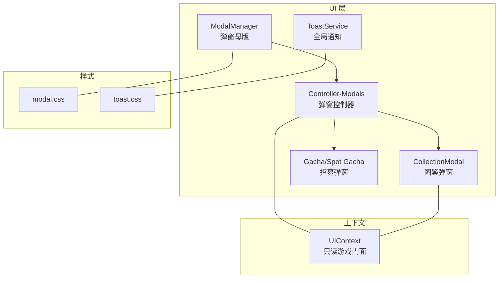
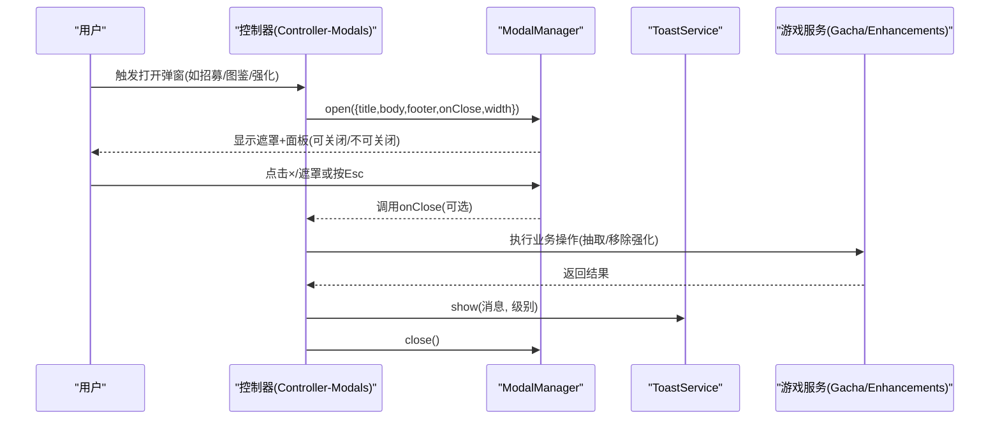
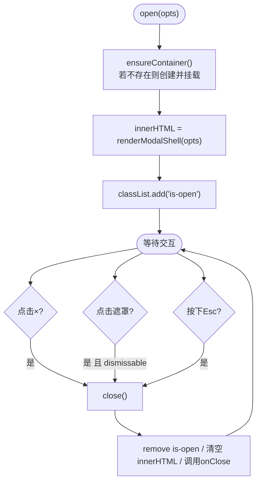
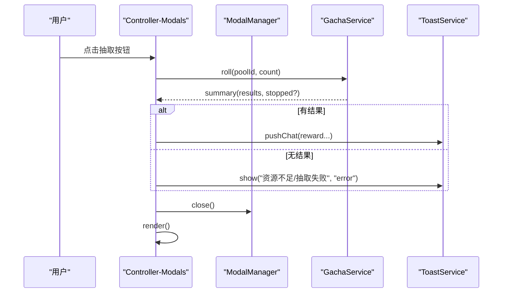
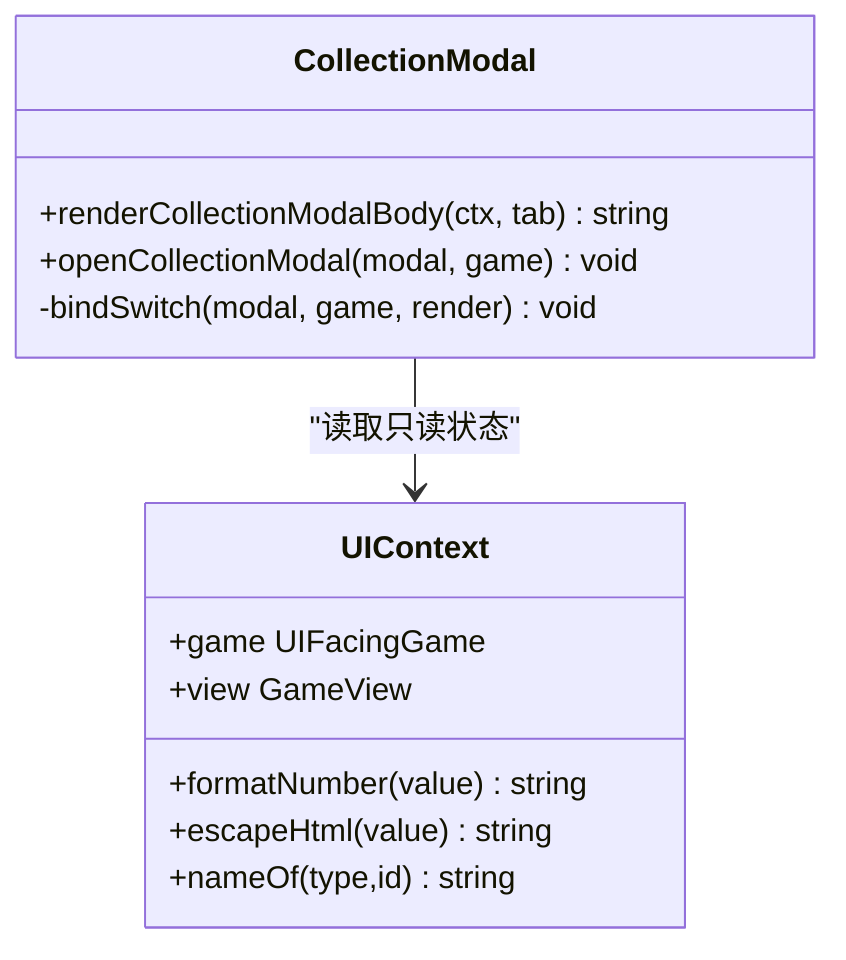
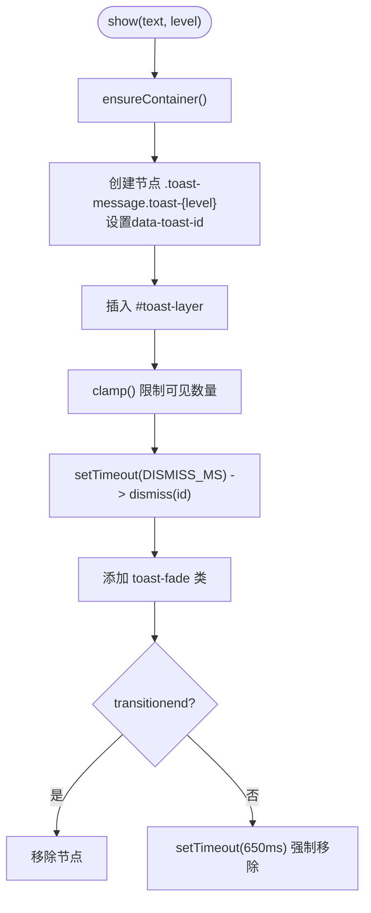
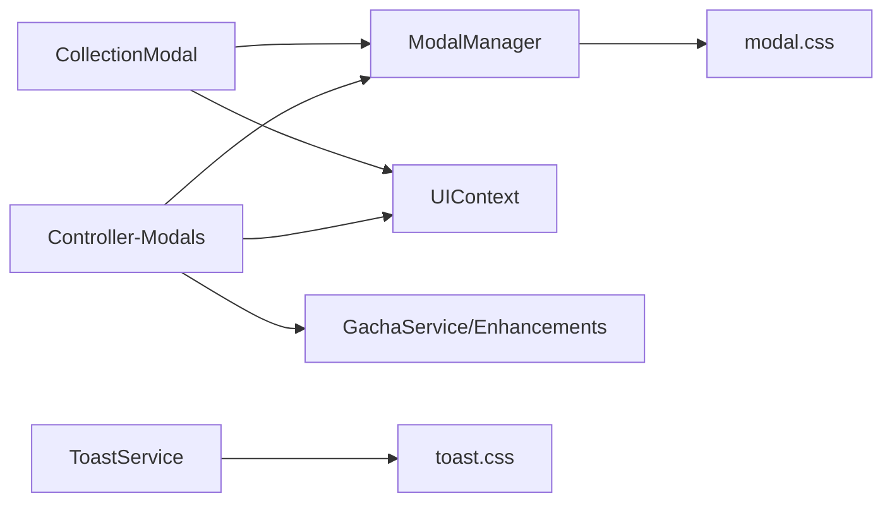

# 模态框系统

<cite>
**本文引用的文件**
- [modal.ts](file://src/ui/modal.ts)
- [controller-modals.ts](file://src/ui/controller-modals.ts)
- [collection-modal.ts](file://src/ui/components/collection-modal.ts)
- [toast.ts](file://src/ui/components/toast.ts)
- [modal.css](file://src/ui/css/modal.css)
- [toast.css](file://src/ui/css/toast.css)
- [context.ts](file://src/ui/context.ts)
- [modal.test.ts](file://tests/ui/modal.test.ts)
</cite>

## 目录
1. [简介](#简介)
2. [项目结构](#项目结构)
3. [核心组件](#核心组件)
4. [架构总览](#架构总览)
5. [详细组件分析](#详细组件分析)
6. [依赖关系分析](#依赖关系分析)
7. [性能考量](#性能考量)
8. [故障排查指南](#故障排查指南)
9. [结论](#结论)
10. [附录：定制与扩展指南](#附录定制与扩展指南)

## 简介
本技术文档围绕 UI 层的模态框系统展开，覆盖弹窗管理、层级控制、遮罩效果、生命周期（打开/关闭/销毁）、状态管理与事件处理机制。同时文档化具体应用场景：CollectionModal（图鉴收藏弹窗）与 Toast 通知提示，并提供样式定制、动画效果与交互行为的扩展指南。

## 项目结构
模态框系统位于 src/ui 下，核心由“基础弹窗容器 + 业务弹窗控制器 + 具体弹窗组件 + 通知服务”构成，样式独立拆分到 CSS 文件，测试用例覆盖骨架渲染。

图表来源
- [modal.ts:1-101](file://src/ui/modal.ts#L1-L101)
- [controller-modals.ts:1-106](file://src/ui/controller-modals.ts#L1-L106)
- [collection-modal.ts:1-95](file://src/ui/components/collection-modal.ts#L1-L95)
- [toast.ts:1-68](file://src/ui/components/toast.ts#L1-L68)
- [modal.css:1-234](file://src/ui/css/modal.css#L1-L234)
- [toast.css:1-70](file://src/ui/css/toast.css#L1-L70)
- [context.ts:1-89](file://src/ui/context.ts#L1-L89)

章节来源
- [modal.ts:1-101](file://src/ui/modal.ts#L1-L101)
- [controller-modals.ts:1-106](file://src/ui/controller-modals.ts#L1-L106)
- [collection-modal.ts:1-95](file://src/ui/components/collection-modal.ts#L1-L95)
- [toast.ts:1-68](file://src/ui/components/toast.ts#L1-L68)
- [modal.css:1-234](file://src/ui/css/modal.css#L1-L234)
- [toast.css:1-70](file://src/ui/css/toast.css#L1-L70)
- [context.ts:1-89](file://src/ui/context.ts#L1-L89)

## 核心组件
- ModalManager：全站复用的弹窗母版，负责挂载容器、渲染骨架、统一关闭逻辑（右上角 ×、点击遮罩、Esc），以及 onClose 回调。
- Controller-Modals：封装业务弹窗的打开流程，如招募补给弹窗、Spot 专属招募弹窗、强化管理弹窗；在弹窗内绑定抽取按钮、移除强化等交互。
- CollectionModal：图鉴弹窗，顶部 Switch 切换“闲聊收集/色彩组收集/装备图鉴”，正文按当前 Tab 原位替换。
- ToastService：全局通知服务，支持 success/error/info 三种级别，自动入队、限制可见数量、淡出销毁。

章节来源
- [modal.ts:14-101](file://src/ui/modal.ts#L14-L101)
- [controller-modals.ts:12-106](file://src/ui/controller-modals.ts#L12-L106)
- [collection-modal.ts:15-95](file://src/ui/components/collection-modal.ts#L15-L95)
- [toast.ts:7-68](file://src/ui/components/toast.ts#L7-L68)

## 架构总览
模态框系统采用“单一弹窗容器 + 多场景内容注入”的模式。ModalManager 提供稳定的 DOM 容器和关闭行为；各业务控制器按需渲染 body/footer 并绑定事件；Toast 作为独立的通知层，避免与主应用渲染周期耦合。

图表来源
- [controller-modals.ts:13-106](file://src/ui/controller-modals.ts#L13-L106)
- [modal.ts:60-99](file://src/ui/modal.ts#L60-L99)
- [toast.ts:22-68](file://src/ui/components/toast.ts#L22-L68)

## 详细组件分析

### ModalManager（弹窗母版）
- 职责
  - 在 document.body 上创建唯一容器 .app-modal，避免随 #app 重建丢失。
  - 渲染通用骨架：遮罩、面板、标题、内容体、底部操作区。
  - 统一关闭入口：右上角 ×、点击遮罩（受 dismissable 控制）、Esc。
  - 暴露 isOpen 查询当前是否处于打开状态。
- 生命周期
  - 首次 open：ensureContainer 创建并挂载容器，注册 click/keydown 监听。
  - 重复 open：直接替换 innerHTML 并添加 is-open 类，实现内容更新。
  - close：移除 is-open、清空 innerHTML、调用 onClose 回调并释放引用。
- 安全与可访问性
  - 标题使用 escapeHtml 转义，防止 XSS。
  - 面板设置 role="dialog" 与 aria-modal="true"，提升无障碍体验。
- 复杂度
  - 时间复杂度：open/close 为 O(1)（DOM 操作）。
  - 空间复杂度：O(1)（仅维护一个容器与闭包处理器）。

图表来源
- [modal.ts:60-99](file://src/ui/modal.ts#L60-L99)

章节来源
- [modal.ts:14-101](file://src/ui/modal.ts#L14-L101)
- [modal.test.ts:7-34](file://tests/ui/modal.test.ts#L7-L34)

### Controller-Modals（弹窗控制器）
- 职责
  - 打开招募补给弹窗：渲染卡池列表与抽取按钮，并在弹窗内绑定抽取事件。
  - 打开 Spot 专属招募弹窗：根据 spotId 渲染对应内容，绑定 Switch 与抽取按钮。
  - 打开强化管理弹窗：展示已购 Enhancement 并可移除，移除后刷新弹窗内容。
- 交互流程
  - 抽取按钮点击：调用 gachaService.roll，将结果通过 chat/toast 反馈，最后关闭弹窗并触发全局渲染。
  - 移除强化：调用 enhancements.removeEnhancement，成功后 toast 提示并重新渲染弹窗。
- 错误处理
  - 抽取失败或资源不足时，通过 toast 以 error 级别提示。
  - 捕获异常并转换为 toast 错误信息。

图表来源
- [controller-modals.ts:47-80](file://src/ui/controller-modals.ts#L47-L80)
- [controller-modals.ts:82-106](file://src/ui/controller-modals.ts#L82-L106)

章节来源
- [controller-modals.ts:12-106](file://src/ui/controller-modals.ts#L12-L106)

### CollectionModal（图鉴收藏弹窗）
- 职责
  - 提供顶部 Switch 切换三类收集：闲聊收集、色彩组收集、装备图鉴。
  - 根据当前 Tab 渲染对应正文区域，保持弹窗不重开，仅替换内容。
- 数据流
  - 通过 createUIContext(game) 获取只读游戏视图，渲染各子面板。
  - 绑定 data-collection-tab 按钮，点击后以目标类型重新渲染。
- 可访问性与布局
  - 使用 codex-section 与 codex-section-title 组织内容层次。
  - 宽度固定为 640px，适配不同屏幕尺寸。

图表来源
- [collection-modal.ts:15-95](file://src/ui/components/collection-modal.ts#L15-L95)
- [context.ts:25-89](file://src/ui/context.ts#L25-L89)

章节来源
- [collection-modal.ts:15-95](file://src/ui/components/collection-modal.ts#L15-L95)
- [context.ts:25-89](file://src/ui/context.ts#L25-L89)

### ToastService（全局通知）
- 职责
  - 统一管理通知消息的显示、去重（通过 id）、可见上限、自动消失。
  - 支持 success/error/info 三种级别，通过 CSS 类名区分样式。
- 生命周期
  - show：确保容器存在，创建节点并插入，记录 id，设定定时器自动 dismiss。
  - dismiss：添加 fade 类，监听 transitionend 后移除节点；兜底超时强制移除。
  - clamp：超过最大可见数时移除最旧的 toast。
- 性能特性
  - 容器懒加载，仅在首次 show 时创建。
  - 使用一次性事件监听减少内存占用。

图表来源
- [toast.ts:22-68](file://src/ui/components/toast.ts#L22-L68)

章节来源
- [toast.ts:7-68](file://src/ui/components/toast.ts#L7-L68)

## 依赖关系分析
- ModalManager 依赖 CSS 类名进行样式控制，并通过 ensureContainer 在 body 挂载容器。
- Controller-Modals 依赖 UIContext 获取只读游戏状态，并调用游戏服务（gachaService、enhancements）完成业务逻辑。
- CollectionModal 依赖 UIContext 渲染不同收集面板，并通过 ModalManager 打开/更新弹窗。
- ToastService 独立于主应用渲染周期，挂载在 body 上，避免与 #app 重建冲突。

图表来源
- [modal.ts:1-101](file://src/ui/modal.ts#L1-L101)
- [controller-modals.ts:1-106](file://src/ui/controller-modals.ts#L1-L106)
- [collection-modal.ts:1-95](file://src/ui/components/collection-modal.ts#L1-L95)
- [toast.ts:1-68](file://src/ui/components/toast.ts#L1-L68)
- [modal.css:1-234](file://src/ui/css/modal.css#L1-L234)
- [toast.css:1-70](file://src/ui/css/toast.css#L1-L70)
- [context.ts:1-89](file://src/ui/context.ts#L1-L89)

章节来源
- [modal.ts:1-101](file://src/ui/modal.ts#L1-L101)
- [controller-modals.ts:1-106](file://src/ui/controller-modals.ts#L1-L106)
- [collection-modal.ts:1-95](file://src/ui/components/collection-modal.ts#L1-L95)
- [toast.ts:1-68](file://src/ui/components/toast.ts#L1-L68)
- [modal.css:1-234](file://src/ui/css/modal.css#L1-L234)
- [toast.css:1-70](file://src/ui/css/toast.css#L1-L70)
- [context.ts:1-89](file://src/ui/context.ts#L1-L89)

## 性能考量
- 弹窗容器复用：ModalManager 仅维护一个 .app-modal 容器，避免频繁创建销毁带来的开销。
- 事件委托：ModalManager 对遮罩与关闭按钮的事件处理集中在容器上，降低事件监听数量。
- Toast 可见上限：clamp 保证最多显示 N 条通知，避免 DOM 节点过多导致滚动卡顿。
- 过渡动画：Toast 使用 CSS 过渡与 transitionend 清理，配合 setTimeout 兜底，兼顾性能与可靠性。
- 响应式布局：modal.css 包含媒体查询，在小屏设备上优化弹窗高度与间距。

[本节为通用性能建议，无需特定文件引用]

## 故障排查指南
- 弹窗无法关闭
  - 检查 dismissable 配置是否为 false，false 时将禁用遮罩与 Esc 关闭。
  - 确认 onClose 回调中未阻止默认行为或抛出异常。
- 抽取失败提示
  - 查看 controller-modals 中的 catch 分支，确认 toast 是否正确显示错误信息。
  - 检查 gachaService.roll 返回值与 stopped 字段，判断是否为资源不足。
- 强化移除无效
  - 确认 data-remove-enh 按钮绑定的增强 ID 正确。
  - 移除成功后需重新渲染弹窗内容，确保 UI 同步。
- Toast 不消失
  - 检查浏览器是否支持 transitionend，必要时依赖 setTimeout 兜底。
  - 确认 #toast-layer 未被其他样式覆盖或隐藏。

章节来源
- [modal.ts:60-99](file://src/ui/modal.ts#L60-L99)
- [controller-modals.ts:47-106](file://src/ui/controller-modals.ts#L47-L106)
- [toast.ts:47-68](file://src/ui/components/toast.ts#L47-L68)

## 结论
模态框系统以 ModalManager 为核心，提供稳定、可复用的弹窗能力；Controller-Modals 将业务逻辑与 UI 解耦；CollectionModal 与 ToastService 分别满足复杂内容与轻量通知场景。整体设计遵循低耦合、高内聚原则，具备良好的可扩展性与可维护性。

[本节为总结性内容，无需特定文件引用]

## 附录：定制与扩展指南
- 样式定制
  - 修改 modal.css 中的 .modal-panel、.modal-overlay、.modal-head/body/foot 等类名，调整尺寸、阴影、圆角与配色。
  - 通过 CSS 变量（如 --panel、--line、--ink-on-panel）实现主题化。
  - Toast 样式可通过 toast.css 中的 .toast-message、.toast-success/error/info、.toast-fade 进行调整。
- 动画效果
  - 弹窗打开/关闭可通过 CSS 过渡或 JS 动画扩展，注意与 is-open 类联动。
  - Toast 动画基于 CSS keyframes 与 transitionend，可自定义入场/退场效果。
- 交互行为
  - 扩展 ModalOptions：可增加 zIndex、position、键盘导航等选项。
  - 在 Controller-Modals 中为新增按钮绑定事件，遵循“弹窗内单独绑定”的原则（因弹窗位于 body 级）。
  - 对于 CollectionModal，可在 TABS 数组中添加新 Tab，并在 bodyHtml 中实现对应渲染逻辑。
- 状态管理与事件处理
  - 使用 UIContext 读取只读游戏状态，避免在组件层直接写入。
  - 所有写操作应通过控制器层调用 GameInstance，保证架构纪律。
  - 事件处理优先使用事件委托，减少监听器数量，提高性能。

[本节为通用指导，无需特定文件引用]