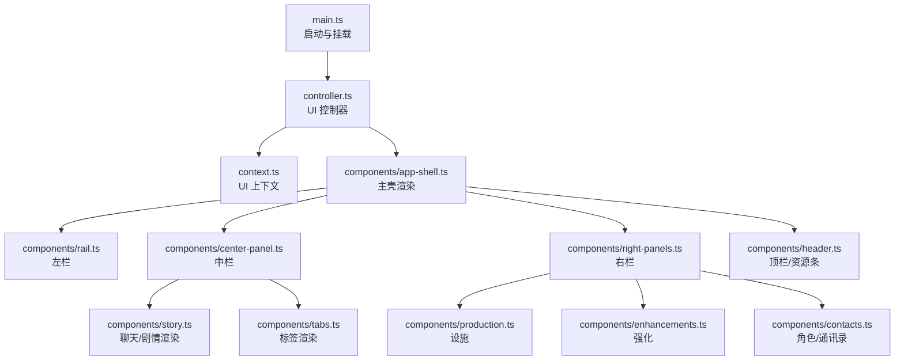
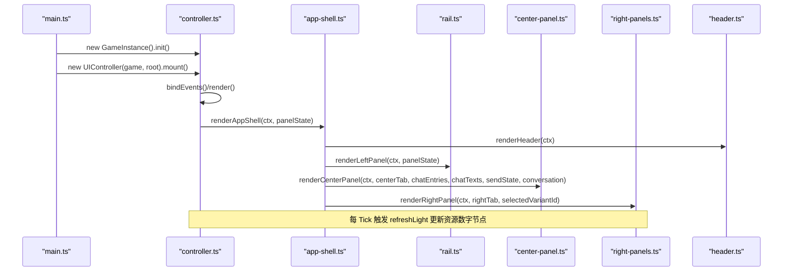
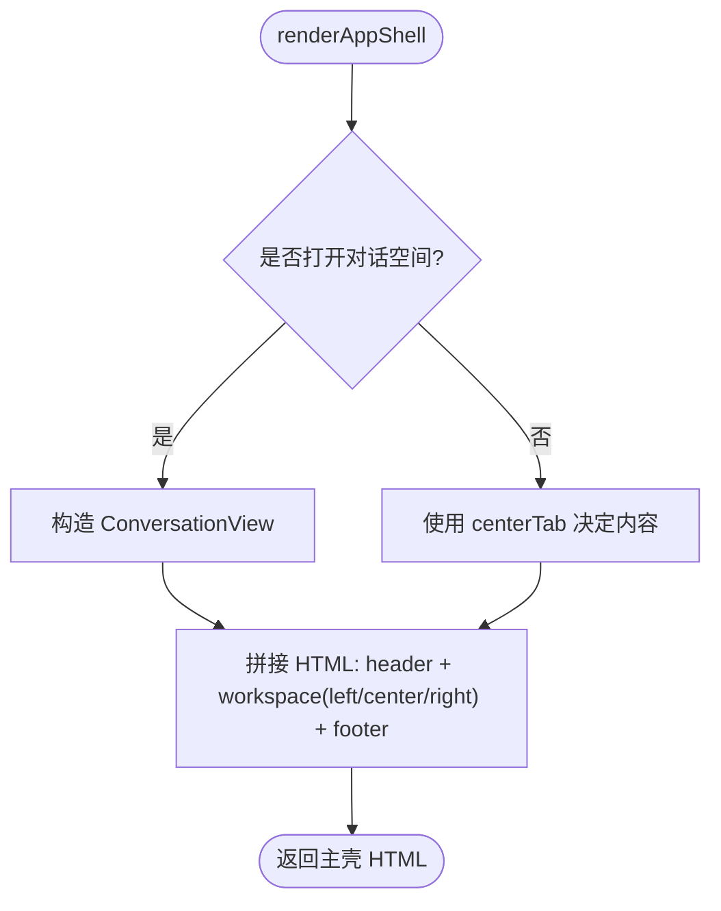
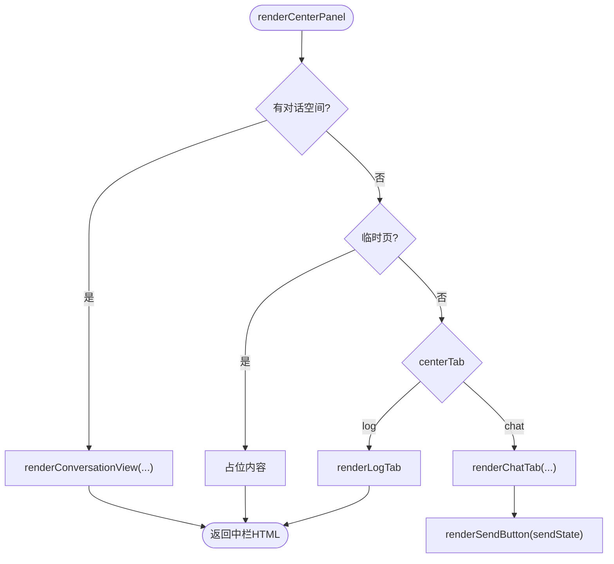
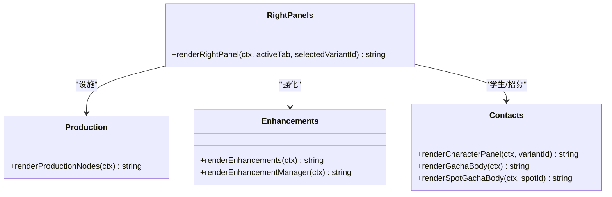
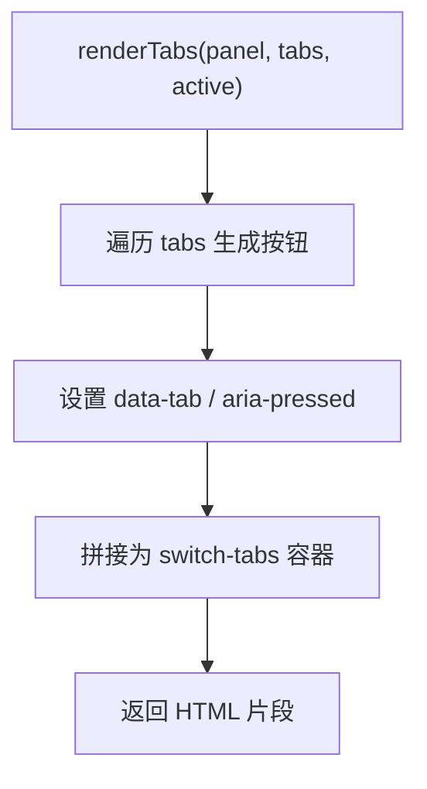
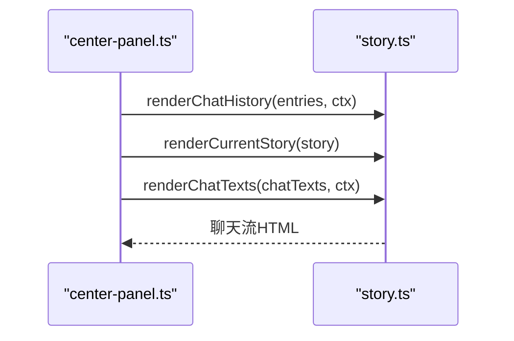
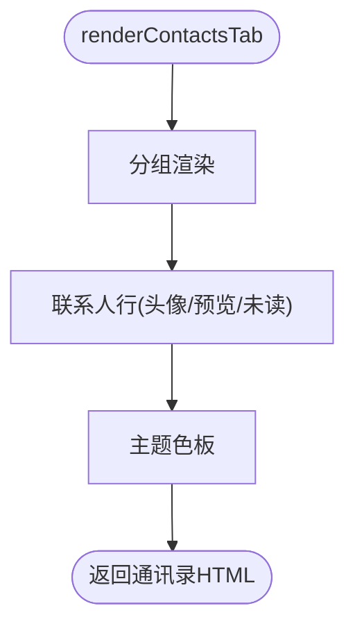
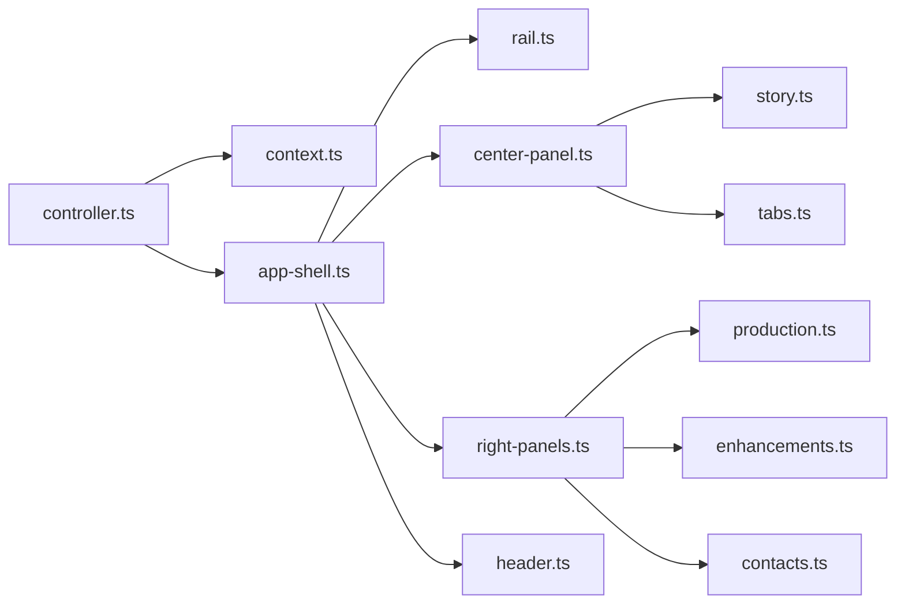

# 组件系统

<cite>
**本文引用的文件**
- [app-shell.ts](file://src/ui/components/app-shell.ts)
- [center-panel.ts](file://src/ui/components/center-panel.ts)
- [right-panels.ts](file://src/ui/components/right-panels.ts)
- [tabs.ts](file://src/ui/components/tabs.ts)
- [rail.ts](file://src/ui/components/rail.ts)
- [contacts.ts](file://src/ui/components/contacts.ts)
- [story.ts](file://src/ui/components/story.ts)
- [header.ts](file://src/ui/components/header.ts)
- [production.ts](file://src/ui/components/production.ts)
- [enhancements.ts](file://src/ui/components/enhancements.ts)
- [context.ts](file://src/ui/context.ts)
- [controller.ts](file://src/ui/controller.ts)
- [main.ts](file://src/ui/main.ts)
</cite>

## 目录
1. [简介](#简介)
2. [项目结构](#项目结构)
3. [核心组件](#核心组件)
4. [架构总览](#架构总览)
5. [详细组件分析](#详细组件分析)
6. [依赖关系分析](#依赖关系分析)
7. [性能考量](#性能考量)
8. [故障排查指南](#故障排查指南)
9. [结论](#结论)
10. [附录：组件复用与自定义规范](#附录组件复用与自定义规范)

## 简介
本技术文档面向 ACProgram 的 UI 组件系统，聚焦以下目标：
- 组件库的设计原则与组织结构（基础、业务、交互三类）
- AppShell 主壳的三栏布局与面板切换机制
- CenterPanel 中心面板与 RightPanels 右侧面板的功能模块（区域探索、角色管理、资源展示等）
- Tabs 标签页系统的实现（切换、状态保持、性能优化）
- 组件复用指南与自定义组件开发规范

## 项目结构
UI 层采用“控制器 + 渲染函数”的分层组织方式：
- 入口与生命周期：main.ts 初始化游戏实例并挂载 UIController
- 控制器：controller.ts 负责事件绑定、渲染调度、状态同步与持久化
- 上下文：context.ts 提供只读的游戏门面与工具方法，供组件渲染使用
- 组件：components/* 按职责拆分，每个组件导出 renderXxx(ctx, state?) 字符串模板函数
- 样式：css/* 按功能域拆分，由 main.ts 统一引入

图表来源
- [main.ts:22-29](file://src/ui/main.ts#L22-L29)
- [controller.ts:139-225](file://src/ui/controller.ts#L139-L225)
- [app-shell.ts:32-50](file://src/ui/components/app-shell.ts#L32-L50)

章节来源
- [main.ts:1-35](file://src/ui/main.ts#L1-L35)
- [controller.ts:1-138](file://src/ui/controller.ts#L1-L138)

## 核心组件
- AppShell（主壳）：组合 Header、Left、Center、Right 四部分，维护 PanelState（左右中 Tab、聊天流、对话空间等）
- CenterPanel（中心面板）：聊天/日志双 Tab；支持“对话空间”覆盖模式（学生专属聊天）
- RightPanels（右侧面板）：设施/学生/强化/其他四大 Tab，承载资源条、生产节点、强化列表、背包与效果追踪
- Tabs（标签系统）：通用 Tab 按钮组渲染，data-tab 标识归属面板与目标 Tab
- Rail（左侧面板）：区域导航、故事导航（分类/篇/章/条目）、通讯录预览
- Story（聊天/剧情）：聊天历史、当前剧情选项、演出专用文本覆盖层、羁绊卡片
- Header（顶栏）：主题浮窗、资源条、存档/导入/帮助等全局操作
- Production（设施）：当前区域 Spot 卡片网格，显示产出、条件、升级/招募等操作
- Enhancements（强化）：可购买/已拥有强化列表，支持移除与全局强化入口
- Contacts（通讯录/角色）：联系人分组、未读消息、角色培养面板、招募补给弹窗

章节来源
- [app-shell.ts:8-50](file://src/ui/components/app-shell.ts#L8-L50)
- [center-panel.ts:7-64](file://src/ui/components/center-panel.ts#L7-L64)
- [right-panels.ts:10-34](file://src/ui/components/right-panels.ts#L10-L34)
- [tabs.ts:3-23](file://src/ui/components/tabs.ts#L3-L23)
- [rail.ts:16-36](file://src/ui/components/rail.ts#L16-L36)
- [story.ts:22-68](file://src/ui/components/story.ts#L22-L68)
- [header.ts:53-124](file://src/ui/components/header.ts#L53-L124)
- [production.ts:31-126](file://src/ui/components/production.ts#L31-L126)
- [enhancements.ts:42-106](file://src/ui/components/enhancements.ts#L42-L106)
- [contacts.ts:28-88](file://src/ui/components/contacts.ts#L28-L88)

## 架构总览
UI 渲染流程遵循“控制器驱动 + 纯渲染函数”的模式：
- controller.ts 在 mount 时绑定事件、定时轻量刷新、全量重建 #app DOM
- render() 先同步运行时主题、捕获滚动位置、生成 UIContext，再调用 renderAppShell 输出 HTML
- 各组件仅消费 UIContext 中的只读数据，不直接修改游戏状态（写操作经控制器委托）

图表来源
- [main.ts:22-29](file://src/ui/main.ts#L22-L29)
- [controller.ts:139-225](file://src/ui/controller.ts#L139-L225)
- [app-shell.ts:32-50](file://src/ui/components/app-shell.ts#L32-L50)

章节来源
- [controller.ts:139-225](file://src/ui/controller.ts#L139-L225)
- [app-shell.ts:32-50](file://src/ui/components/app-shell.ts#L32-L50)

## 详细组件分析

### AppShell 主壳与三栏布局
- 职责：组装 Header、Left、Center、Right 四个区域，维护 PanelState（leftTab/centerTab/rightTab、聊天流、对话空间、故事导航路径等）
- 布局：顶部 header，主体 section.workspace 包含 left/center/right 三个面板，底部 footer
- 对话空间：当存在 conversationVariantId 时，CenterPanel 整体替换为学生对话视图，复用聊天流机制并按学生隔离语境

图表来源
- [app-shell.ts:32-50](file://src/ui/components/app-shell.ts#L32-L50)

章节来源
- [app-shell.ts:8-50](file://src/ui/components/app-shell.ts#L8-L50)

### CenterPanel 中心面板
- 标签：聊天、日志
- 对话空间覆盖：当传入 conversation 参数时，直接渲染学生对话视图（含返回键、标题、聊天流、底部发送按钮）
- 聊天 Tab：
  - 渲染聊天历史、当前剧情选项或羁绊卡片、聊天发射器提示、底部发送按钮
  - 发送按钮根据 SendState 模式（advance/idle/choice/kizuna）动态变化，支持多击任务进度条
- 日志 Tab：读取 dev logs，限制最近 60 条，支持导出/清空等操作

图表来源
- [center-panel.ts:19-64](file://src/ui/components/center-panel.ts#L19-L64)
- [center-panel.ts:66-101](file://src/ui/components/center-panel.ts#L66-L101)
- [center-panel.ts:123-193](file://src/ui/components/center-panel.ts#L123-L193)

章节来源
- [center-panel.ts:7-209](file://src/ui/components/center-panel.ts#L7-L209)

### RightPanels 右侧面板
- 标签：设施、学生、强化、其他
- 设施：渲染当前区域的 Spot 卡片网格，显示名称、等级/可获取、产出、条件、升级/招募/重启等操作
- 学生：角色培养面板（等级、星级、碎片、累计获得、经验/突破按钮、色彩装备、配色设计）
- 强化：可购买强化列表、已拥有强化管理、全局强化入口
- 其他：背包列表（消耗品使用）、效果追踪（Affector 包详情）

图表来源
- [right-panels.ts:10-34](file://src/ui/components/right-panels.ts#L10-L34)
- [production.ts:31-126](file://src/ui/components/production.ts#L31-L126)
- [enhancements.ts:42-106](file://src/ui/components/enhancements.ts#L42-L106)
- [contacts.ts:254-302](file://src/ui/components/contacts.ts#L254-L302)
- [contacts.ts:352-409](file://src/ui/components/contacts.ts#L352-L409)

章节来源
- [right-panels.ts:1-71](file://src/ui/components/right-panels.ts#L1-L71)
- [production.ts:1-126](file://src/ui/components/production.ts#L1-L126)
- [enhancements.ts:1-136](file://src/ui/components/enhancements.ts#L1-L136)
- [contacts.ts:254-409](file://src/ui/components/contacts.ts#L254-L409)

### Tabs 标签页系统
- 数据结构：TabDef{id, label, hint?}
- 渲染：renderTabs(panel, tabs, active) 生成一组 button，data-tab="panel:id"，aria-pressed 标记激活态
- 状态保持：由上层控制器维护 panelState.leftTab/centerTab/rightTab，并在每次 render 时传入 activeTab
- 性能优化：通过 data-tab 属性进行事件委托，避免重复绑定；仅渲染当前激活项的内容

图表来源
- [tabs.ts:3-23](file://src/ui/components/tabs.ts#L3-L23)

章节来源
- [tabs.ts:1-24](file://src/ui/components/tabs.ts#L1-L24)

### 聊天与剧情渲染（Story）
- ChatEntry：聊天条目（talk/narration/system/reward），支持头像、图片、对齐、玩家侧等
- ChatTextEntry：演出专用文本覆盖层，支持 Talklet 嵌入、坐标定位、样式覆写
- 渲染管线：
  - renderChatHistory：历史气泡、旁白、系统消息、奖励通知
  - renderCurrentStory：当前剧情选项卡片或羁绊卡片
  - renderChatTexts：以百分比坐标叠加到聊天窗格上
  - renderKizunaCard：羁绊剧情卡片（yuzu-kizuna 风格）

图表来源
- [center-panel.ts:66-101](file://src/ui/components/center-panel.ts#L66-L101)
- [story.ts:159-191](file://src/ui/components/story.ts#L159-L191)
- [story.ts:193-211](file://src/ui/components/story.ts#L193-L211)

章节来源
- [story.ts:22-313](file://src/ui/components/story.ts#L22-L313)

### 通讯录与角色面板（Contacts）
- 通讯录 Tab：按学校分组，显示头像、等级/稀有度、最后预览消息、未读角标
- 对话空间：学生专属聊天视图，支持返回一般聊天、阻断态（条件满足前锁定）
- 角色培养面板：等级/星级/碎片/累计获得、经验/突破按钮、色彩装备选择、配色设计
- 招募补给：通用卡池与 Spot 专有卡池切换，显示成员、pity、抽取按钮

图表来源
- [contacts.ts:28-88](file://src/ui/components/contacts.ts#L28-L88)
- [contacts.ts:168-229](file://src/ui/components/contacts.ts#L168-L229)
- [contacts.ts:254-302](file://src/ui/components/contacts.ts#L254-L302)
- [contacts.ts:352-409](file://src/ui/components/contacts.ts#L352-L409)

章节来源
- [contacts.ts:1-409](file://src/ui/components/contacts.ts#L1-L409)

### 顶栏与资源条（Header）
- 主题浮窗：层级优先级拖拽排序、区域配色选择、主题色板切换
- 资源条：基于 resourceDisplays 配置动态渲染资源数量与每秒增益，支持推进 tick
- 全局操作：图鉴、导入 Mod、新游戏、保存/读取、帮助

章节来源
- [header.ts:53-124](file://src/ui/components/header.ts#L53-L124)

## 依赖关系分析
- 控制器依赖：GameInstance、SaveSystem、UIContext、各控制器子模块（事件/主题/存档/动作）
- 组件依赖：UIContext（只读门面）、引擎子系统（如 registry、affectorEngine、colorSystem 等）
- 组件间耦合：
  - AppShell 组合 Left/Center/Right/Header，低耦合高内聚
  - CenterPanel 依赖 story.ts 与 contacts.ts（对话空间）
  - RightPanels 聚合 production/enhancements/contacts
  - Tabs 被多处复用，作为通用 UI 原语

图表来源
- [controller.ts:1-138](file://src/ui/controller.ts#L1-L138)
- [app-shell.ts:32-50](file://src/ui/components/app-shell.ts#L32-L50)

章节来源
- [controller.ts:1-394](file://src/ui/controller.ts#L1-L394)
- [context.ts:25-89](file://src/ui/context.ts#L25-L89)

## 性能考量
- 轻量刷新：controller.ts 每 1 秒调用 refreshLight 仅更新资源数字节点，避免全量重建 DOM
- 滚动状态保持：render 前后捕获/恢复面板与聊天流滚动位置，提升体验
- 揭示指纹去重：computeRevealFingerprint 仅在揭示条件变化时重建 UI，减少不必要的重绘
- 聊天历史上限：MAX_CHAT_HISTORY 控制历史长度，防止内存增长
- 事件委托：Tabs 与各类 data-* 按钮通过事件委托绑定，降低监听器数量
- 图片懒加载：聊天图片使用 loading="lazy"，减少首屏压力

章节来源
- [controller.ts:155-167](file://src/ui/controller.ts#L155-L167)
- [controller.ts:201-225](file://src/ui/controller.ts#L201-L225)
- [story.ts:123-128](file://src/ui/components/story.ts#L123-L128)

## 故障排查指南
- 无法开始世界线：startNewGame 失败时记录错误日志并 Toast 提示
- 无法恢复世界线：resumeInit 失败时记录错误日志并 Toast 提示
- 无可用闲聊：sendState.mode=idle 且 reason=noAvailable 时按钮附带提示
- 对话空间锁定：当 PassiveStoryEntry 要求条件满足才能继续闲聊时，底部按钮禁用并显示解锁条件
- 增强条件诊断：快捷键 Ctrl+Shift+D 输出 Enhancement 条件诊断到日志

章节来源
- [controller.ts:319-352](file://src/ui/controller.ts#L319-L352)
- [center-panel.ts:156-162](file://src/ui/components/center-panel.ts#L156-L162)
- [contacts.ts:189-205](file://src/ui/components/contacts.ts#L189-L205)
- [controller.ts:159-166](file://src/ui/controller.ts#L159-L166)

## 结论
ACProgram 的 UI 组件系统以“控制器驱动 + 纯渲染函数”为核心，实现了清晰的三栏布局与模块化面板。通过 UIContext 暴露只读门面，组件之间解耦且易于扩展。Tabs 系统提供统一的标签交互，聊天与剧情渲染管线支持丰富的演出能力。结合轻量刷新、滚动保持与揭示指纹去重等优化策略，系统在交互流畅性与性能之间取得良好平衡。

## 附录：组件复用与自定义规范
- 组件职责划分
  - 基础组件：Tabs、Toast、Modal、Popover 等通用 UI 原语
  - 业务组件：Production、Enhancements、Contacts、Story 等业务领域渲染
  - 交互组件：Header、Rail、CenterPanel、RightPanels 等页面级组合
- 复用指南
  - 所有组件接收 UIContext，禁止直接访问 GameInstance 写入接口
  - 使用 renderXxx(ctx, state?) 签名，便于测试与替换
  - 通过 data-* 属性暴露交互点，由控制器统一绑定事件
- 自定义组件开发规范
  - 新增组件置于 components/*，命名遵循 kebab-case 文件名与 PascalCase 导出名
  - 若涉及状态变更，仅通过 data-* 委托给控制器，组件本身保持无副作用
  - 样式独立于组件逻辑，放在 css/* 对应模块下
  - 对复杂交互（如聊天流、滚动）优先复用已有模块（chat-stream、scroll）
  - 单元测试：为关键渲染函数编写断言，确保输入输出稳定