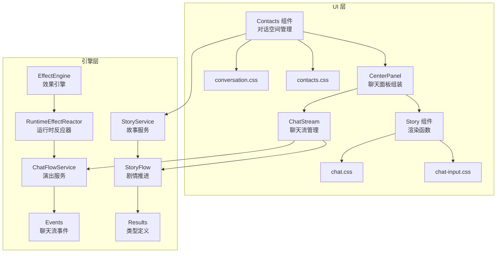
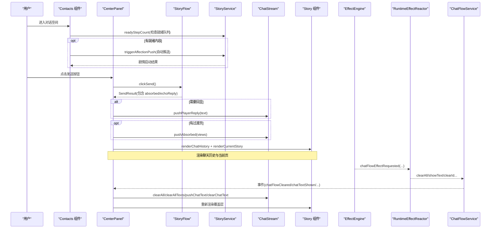
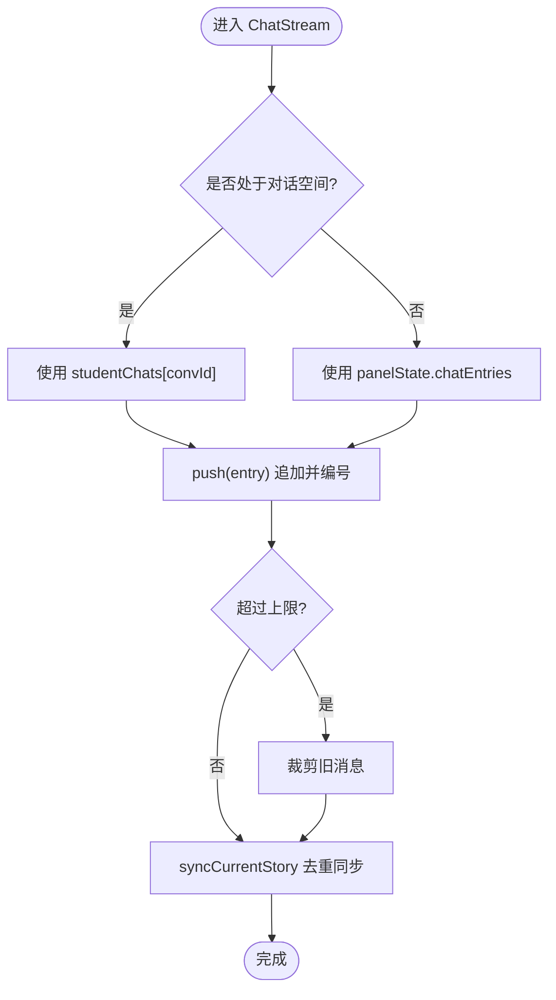
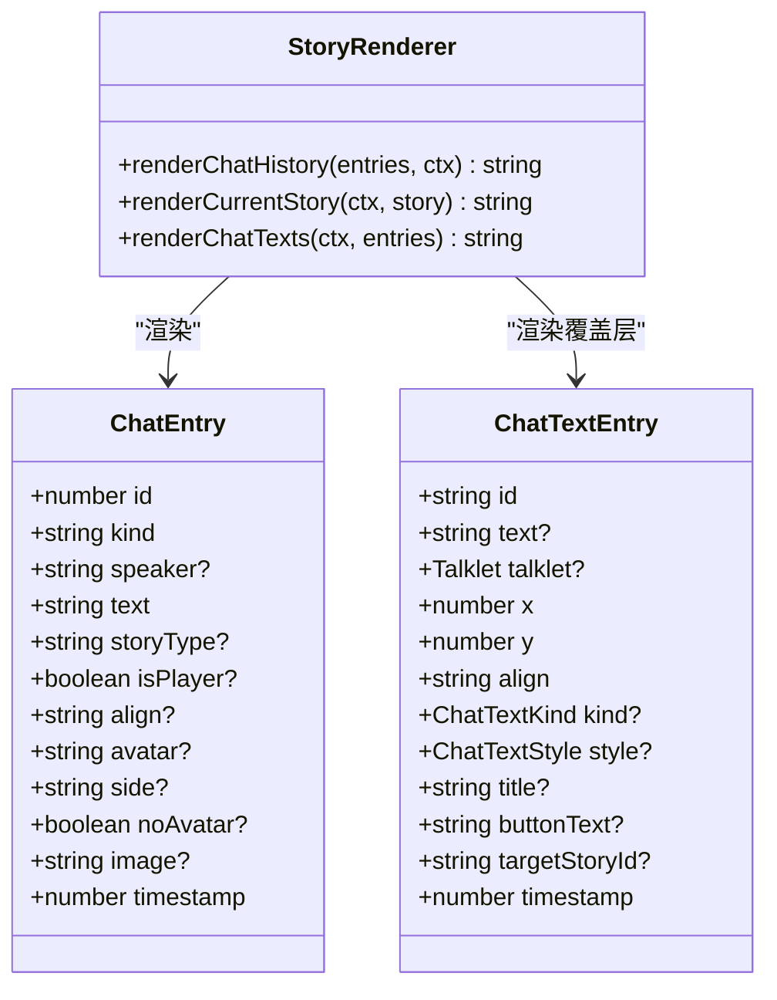
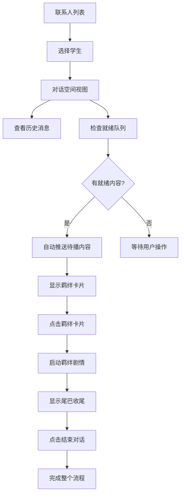
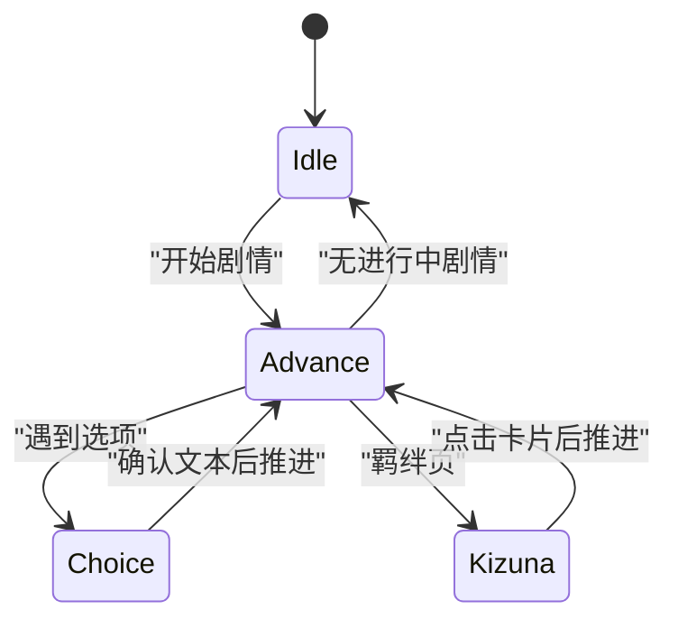
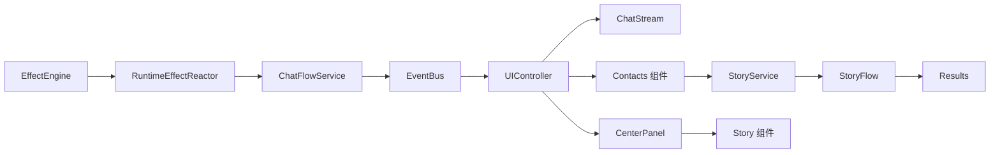

# 聊天界面

<cite>
**本文引用的文件**
- [chat-stream.ts](file://src/ui/chat-stream.ts)
- [chat-flow-service.ts](file://src/engine/game/chat-flow-service.ts)
- [story.ts](file://src/ui/components/story.ts)
- [center-panel.ts](file://src/ui/components/center-panel.ts)
- [contacts.ts](file://src/ui/components/contacts.ts)
- [controller-actions-contacts.ts](file://src/ui/controller-actions-contacts.ts)
- [story-flow.ts](file://src/engine/game/story-flow.ts)
- [story-service.ts](file://src/engine/game/story-service.ts)
- [results.ts](file://src/engine/types/results.ts)
- [events.ts](file://src/engine/types/events.ts)
- [effect-engine.ts](file://src/engine/effect/effect-engine.ts)
- [runtime-effect-reactor.ts](file://src/engine/effect/runtime-effect-reactor.ts)
- [conversation.css](file://src/ui/css/conversation.css)
- [contacts.css](file://src/ui/css/contacts.css)
- [chat.css](file://src/ui/css/chat.css)
- [chat-input.css](file://src/ui/css/chat-input.css)
</cite>

## 更新摘要
**所做更改**
- **移除 ChatMessageDef 系统**：完全删除了静态消息轴 A、消息创建、解锁条件、可重复消息等所有相关功能
- **转向被动剧情系统**：UI 现在专注于被动故事条目和就绪队列系统，而非交互式聊天气泡
- **增强对话空间功能**：学生专属聊天空间、未读消息管理、羁绊剧情触发机制
- **优化消息流处理**：简化了消息队列逻辑，专注于剧情推进而非消息交互

## 目录
1. [简介](#简介)
2. [项目结构](#项目结构)
3. [核心组件](#核心组件)
4. [架构总览](#架构总览)
5. [详细组件分析](#详细组件分析)
6. [依赖关系分析](#依赖关系分析)
7. [性能与滚动优化](#性能与滚动优化)
8. [故障排查指南](#故障排查指南)
9. [结论](#结论)
10. [附录：扩展与自定义开发指南](#附录：扩展与自定义开发指南)

## 简介
本技术文档围绕 ACProgram 的聊天界面，系统性说明以下能力：
- ChatStream 聊天流管理器：消息队列、历史管理、剧情同步与去重、多沙盒（一般聊天/学生对话空间）路由。
- Story 剧情对话组件：对话渲染、选择分支、旁白与奖励通知、演出专用文本覆盖层。
- **对话空间系统**：学生专属聊天空间、未读消息管理、羁绊剧情触发机制。
- ChatInput 输入组件：发送按钮状态机、点击工作进度、动画与可访问性。
- **被动剧情系统**：就绪队列、好感台阶、尾巴推送和壁垒重启机制。
- 样式设计：气泡样式、响应式布局、视觉动效与无障碍支持。
- 扩展接口：Talklet 效果驱动的聊天流控制、UI 事件订阅与二次开发建议。

**重要变更**：ChatMessageDef 静态消息系统已完全移除，当前实现专注于被动剧情和就绪队列系统。

## 项目结构
聊天相关代码分布在 UI 层与引擎层：
- UI 层负责状态渲染、DOM 结构与交互：
  - chat-stream.ts：聊天流领域逻辑（ID 计数、活跃流路由、剧情同步）。
  - components/story.ts：聊天条目与演出文本的渲染函数。
  - components/center-panel.ts：聊天面板组装（历史、当前页、发送按钮、演出文本层）。
  - components/contacts.ts：通讯录、对话空间和角色培养面板的完整实现。
  - css/chat.css、css/chat-input.css：聊天气泡、旁白、回复卡片、发送按钮样式。
  - css/conversation.css：对话空间顶栏、羁绊剧情卡片样式。
  - css/contacts.css：通讯录列表项、未读徽标、主题色块样式。
- 引擎层提供运行时服务与类型定义：
  - engine/game/chat-flow-service.ts：聊天流演出服务（将 effect 转译为事件）。
  - engine/game/story-flow.ts：剧情启动/推进/发送主流程（含回显策略、clickWork）。
  - engine/game/story-service.ts：故事服务编排层，支持对话空间游标管理。
  - engine/types/results.ts：SendState/SendResult/StoryView 等类型。
  - engine/types/events.ts：聊天流演出事件定义。
  - engine/effect/effect-engine.ts：效果到事件的桥接。
  - engine/effect/runtime-effect-reactor.ts：运行时反应器，分发聊天流效果请求。

**图表来源**
- [contacts.ts:170-256](file://src/ui/components/contacts.ts#L170-L256)
- [controller-actions-contacts.ts:11-92](file://src/ui/controller-actions-contacts.ts#L11-L92)
- [story-service.ts:53-92](file://src/engine/game/story-service.ts#L53-L92)

## 核心组件
- ChatStream：维护聊天历史与演出文本覆盖层，按"活跃流"路由到不同沙盒；在每次渲染前同步当前剧情页，避免重复；限制历史长度并清理覆盖层。
- Story 组件：渲染聊天历史、旁白、系统/奖励消息、玩家/NPC 气泡、回复选择卡片、羁绊卡片以及演出专用文本覆盖层。
- CenterPanel：组合聊天历史、当前剧情页、聊天启动器与发送按钮；将演出文本作为独立层渲染，不随滚动位移。
- Contacts 组件：实现通讯录列表、学生对话空间、角色培养面板和招募补给功能的完整 UI。
- ChatFlowService：将 Talklet 的聊天流效果（清空、显示/擦除演出文本）转换为事件，供 UI 订阅处理。
- StoryFlow：驱动剧情推进、选项校验、回显策略、clickWork 进度与吸收过渡页。
- StoryService：管理全局和对话空间游标，支持羁绊剧情的特殊处理流程。
- EffectEngine/RuntimeEffectReactor：把效果请求转发为事件，再由 ChatFlowService 消费。

**章节来源**
- [chat-stream.ts:15-144](file://src/ui/chat-stream.ts#L15-L144)
- [story.ts:22-313](file://src/ui/components/story.ts#L22-L313)
- [center-panel.ts:72-102](file://src/ui/components/center-panel.ts#L72-L102)
- [contacts.ts:28-88](file://src/ui/components/contacts.ts#L28-L88)
- [contacts.ts:170-256](file://src/ui/components/contacts.ts#L170-L256)
- [story-service.ts:53-92](file://src/engine/game/story-service.ts#L53-L92)

## 架构总览
聊天界面的数据流与控制流如下：
- 用户点击发送按钮 → StoryFlow 推进剧情 → 可能产生 absorbed 过渡页 → ChatStream 同步历史与覆盖层 → CenterPanel 重组 DOM → 渲染更新。
- Talklet 中的聊天流效果通过 EffectEngine 发出事件 → RuntimeEffectReactor 分派至 ChatFlowService → 触发 UI 侧对聊天流的增删改。
- **对话空间交互**：用户进入对话空间 → 检查就绪队列 → 自动推送待播内容 → 管理羁绊剧情和壁垒重启。

**图表来源**
- [contacts.ts:258-288](file://src/ui/components/contacts.ts#L258-L288)
- [controller-actions-contacts.ts:28-57](file://src/ui/controller-actions-contacts.ts#L28-L57)
- [story-service.ts:226-235](file://src/engine/game/story-service.ts#L226-L235)
- [story-flow.ts:20-23](file://src/engine/game/story-flow.ts#L20-L23)

## 详细组件分析

### ChatStream 聊天流管理器
职责与特性：
- 活跃流路由：根据 panelState.conversationVariantId 决定使用"一般聊天流"或"学生对话空间流"。
- 历史管理：push 时分配自增 id 与时间戳；超过上限自动裁剪旧消息。
- 剧情同步：以 storyId:pageIndex 指纹去重，将当前 Talklet 内容同步进聊天流；跳过 click 页。
- 演出文本覆盖层：独立维护 ChatTextEntry 列表，支持按临时 id 覆盖/擦除。
- 清理能力：清空全部聊天与覆盖层，或仅清空覆盖层保留历史。

**图表来源**
- [chat-stream.ts:25-43](file://src/ui/chat-stream.ts#L25-L43)
- [chat-stream.ts:53-76](file://src/ui/chat-stream.ts#L53-L76)

**章节来源**
- [chat-stream.ts:15-144](file://src/ui/chat-stream.ts#L15-L144)

### Story 剧情对话组件
功能要点：
- 聊天历史渲染：区分 talk/narration/system/reward，生成对应 HTML。
- 头像渲染：优先图片 URL，其次角色 ColorGroup 抽象头像，最后首字母占位。
- 气泡样式：NPC 左对齐、玩家右对齐；支持 side/noAvatar/image 等字段。
- 回复选择卡片：展示可用选项，LOCKED 态保留但禁用。
- 羁绊卡片：yuzu-kizuna 风格，点击启动目标 ActiveStoryEntry。
- 演出文本覆盖层：以百分比坐标定位，支持直接文本或嵌入 Talklet，带样式覆写。

**图表来源**
- [story.ts:22-68](file://src/ui/components/story.ts#L22-L68)
- [story.ts:159-211](file://src/ui/components/story.ts#L159-L211)
- [story.ts:240-283](file://src/ui/components/story.ts#L240-L283)

**章节来源**
- [story.ts:22-313](file://src/ui/components/story.ts#L22-L313)

### 对话空间与联系人组件
**对话空间系统**：完整的对话空间管理系统，包括联系人列表、消息预览、未读指示器和羁绊剧情触发。

主要特性：
- **联系人列表**：IM 风格的联系人列表，显示头像、名称、等级、稀有度和最近消息预览。
- **未读消息指示器**：动态显示就绪队列条数，支持超过 99 条时显示 "99+"。
- **对话空间视图**：学生专属聊天空间，支持历史消息、当前剧情、可用消息和羁绊卡片。
- **羁绊事件系统**：电影式剧情卡片，点击后触发关联的羁绊剧情，支持尾巴收尾处理。
- **壁垒重启机制**：某些剧情完成后要求满足特定条件才能继续闲聊。

**图表来源**
- [contacts.ts:28-88](file://src/ui/components/contacts.ts#L28-L88)
- [contacts.ts:170-256](file://src/ui/components/contacts.ts#L170-L256)
- [contacts.ts:258-288](file://src/ui/components/contacts.ts#L258-L288)

**章节来源**
- [contacts.ts:28-88](file://src/ui/components/contacts.ts#L28-L88)
- [contacts.ts:170-256](file://src/ui/components/contacts.ts#L170-L256)
- [contacts.ts:258-288](file://src/ui/components/contacts.ts#L258-L288)

### ChatInput 输入组件（发送按钮）
行为与状态：
- 模式：advance（推进）、idle（无进行中剧情）、choice（选项阻塞）、kizuna（羁绊卡片）。
- 预设文案：若 Talklet.sendText 存在则显示该文案，否则显示"点击"。
- 点击工作（clickWork）：进度条填充，完成后需再点一次结束该页。
- 动画与可访问性：加载指示点、完成脉冲、减少动效适配。

**图表来源**
- [center-panel.ts:117-193](file://src/ui/components/center-panel.ts#L117-L193)
- [results.ts:107-182](file://src/engine/types/results.ts#L107-L182)

**章节来源**
- [center-panel.ts:117-193](file://src/ui/components/center-panel.ts#L117-L193)
- [results.ts:107-182](file://src/engine/types/results.ts#L107-L182)

### 聊天界面样式设计
- 气泡样式：NPC 与玩家气泡颜色、箭头、圆角、内边距与字体；图片在气泡内顶部显示。
- 旁白与系统/奖励：旁白横跨全宽并支持对齐；系统消息居中虚线框；奖励简洁小条。
- 回复选择卡片：标题栏竖条装饰、选项悬停高亮、锁定态提示。
- 发送按钮：玩家气泡风格、进度条、加载点、完成脉冲；响应式头像尺寸。
- **对话空间样式**：顶栏返回键、学生名、未读计数；羁绊卡片电影式风格；消息气泡悬停效果。
- **联系人样式**：IM 风格列表项、未读徽标、主题色块、空态引导。
- 无障碍：focus-visible 轮廓、减少动效媒体查询。

**章节来源**
- [chat.css:104-238](file://src/ui/css/chat.css#L104-L238)
- [chat.css:262-388](file://src/ui/css/chat.css#L262-L388)
- [chat-input.css:6-187](file://src/ui/css/chat-input.css#L6-L187)
- [conversation.css:6-189](file://src/ui/css/conversation.css#L6-L189)
- [contacts.css:9-230](file://src/ui/css/contacts.css#L9-L230)

## 依赖关系分析
- UI 控制器持有 ChatStream 与 ScrollManager，并在每次渲染前同步当前剧情。
- StoryFlow 决定回显策略（shouldEchoReply），影响 ChatStream.pushPlayerReply 调用。
- EffectEngine 将聊天流效果转为事件，RuntimeEffectReactor 分发到 ChatFlowService。
- ChatFlowService 通过 EventBus 广播事件，UI 订阅后操作 ChatStream。
- **对话空间控制器**：处理联系人选择、消息交互、羁绊剧情触发和尾巴收尾。
- **故事服务**：管理全局和对话空间游标，支持羁绊剧情的特殊处理流程。

**图表来源**
- [controller.ts:100-108](file://src/ui/controller.ts#L100-L108)
- [controller-actions-contacts.ts:11-92](file://src/ui/controller-actions-contacts.ts#L11-L92)
- [story-service.ts:53-92](file://src/engine/game/story-service.ts#L53-L92)
- [story-flow.ts:20-23](file://src/engine/game/story-flow.ts#L20-L23)

**章节来源**
- [controller.ts:100-108](file://src/ui/controller.ts#L100-L108)
- [controller-actions-contacts.ts:11-92](file://src/ui/controller-actions-contacts.ts#L11-L92)
- [story-service.ts:53-92](file://src/engine/game/story-service.ts#L53-L92)
- [story-flow.ts:20-23](file://src/engine/game/story-flow.ts#L20-L23)

## 性能与滚动优化
- 历史上限：ChatStream 限制单流最大条目数，超出时裁剪旧消息，避免内存增长。
- 去重同步：以 storyId:pageIndex 指纹去重，避免重复入流。
- 分离滚动区：聊天历史与发送按钮分离，演出文本覆盖层独立于滚动区域，保证定位稳定。
- 图片懒加载：头像与气泡内图片使用 lazy loading，降低初始负载。
- 减少动效：prefers-reduced-motion 下关闭过渡与动画，提升可访问性与低端设备性能。
- **对话空间优化**：每个学生的对话空间独立管理，互不干扰；就绪队列高效计算。

**章节来源**
- [chat-stream.ts:13-43](file://src/ui/chat-stream.ts#L13-L43)
- [chat-stream.ts:53-76](file://src/ui/chat-stream.ts#L53-L76)
- [center-panel.ts:88-100](file://src/ui/components/center-panel.ts#L88-L100)
- [story.ts:74-128](file://src/ui/components/story.ts#L74-L128)
- [chat.css:376-388](file://src/ui/css/chat.css#L376-L388)
- [chat-input.css:177-187](file://src/ui/css/chat-input.css#L177-L187)

## 故障排查指南
常见问题与定位：
- 无法推进（ClickRequired）：当页面存在 clickWork 且未完成时，必须先完成点击任务才能推进。
- 选项不可选（ChoiceConditionNotMet）：选项条件未满足，检查条件表达式与当前状态。
- 重复入流：确保 syncCurrentStory 指纹正确；若出现重复，检查 storyId/pageIndex 变化。
- 演出文本未清除：确认 clearIdChatFlow 的 id 与 showChatText 一致；必要时使用 clearAllChatText。
- 回显异常：click 页或 muteReply=true 时不应回显 sentText；检查 shouldEchoReply 逻辑。
- **对话空间问题**：检查学生是否已加入通讯录；验证羁绊剧情 ID 是否正确；确认尾巴收尾流程是否正常。
- **就绪队列问题**：检查就绪队列计算逻辑；确认壁垒重启条件是否满足；验证冷却时间设置。

**章节来源**
- [story-flow.ts:177-184](file://src/engine/game/story-flow.ts#L177-L184)
- [story-flow.ts:20-23](file://src/engine/game/story-flow.ts#L20-L23)
- [chat-flow-service.ts:18-36](file://src/engine/game/chat-flow-service.ts#L18-L36)
- [chat-stream.ts:121-143](file://src/ui/chat-stream.ts#L121-L143)
- [controller-actions-contacts.ts:28-84](file://src/ui/controller-actions-contacts.ts#L28-L84)

## 结论
ACProgram 的聊天界面通过 ChatStream 统一管理消息与覆盖层，结合 Story 组件的丰富渲染能力与 CenterPanel 的结构化布局，实现了流畅的剧情推进与良好的用户体验。**对话空间系统**为学生提供了专属的聊天环境，支持就绪队列管理、羁绊剧情触发和电影式剧情体验。引擎层的 EffectEngine/RuntimeEffectReactor/ChatFlowService 提供了可扩展的演出接口，便于在 Talklet 中灵活操控聊天流。样式层面兼顾美观与可访问性，并通过多项优化保障性能。

**重要变更**：ChatMessageDef 静态消息系统的移除使系统更加专注于剧情驱动的体验，简化了消息处理逻辑，提升了整体性能。

## 附录：扩展与自定义开发指南
- 在 Talklet 中使用聊天流效果：
  - 清空聊天流：clearAllChatFlow → 事件 chatFlowCleared → UI 清空当前流。
  - 显示演出文本：showChatText → 事件 chatTextShown → UI 插入覆盖层（支持 talklet/text 与样式覆写）。
  - 擦除演出文本：clearIdChatFlow → 事件 chatTextCleared → UI 按 id 移除覆盖层。
  - 清空所有覆盖层：clearAllChatText → 事件 chatTextClearedAll → UI 清空覆盖层保留历史。
- **对话空间扩展**：
  - 自定义消息类型：扩展 ChatEntry.kind 或新增渲染分支。
  - 羁绊剧情配置：在 PassiveStoryEntry 中配置 pushAfterStory 和 affectionRequired。
  - 就绪队列系统：实现就绪队列逻辑，支持尾巴推送和好感台阶。
- 自定义渲染：
  - 扩展 ChatEntry.kind 或新增渲染分支，参考 story.ts 中 narration/system/reward/talk 的处理方式。
  - 调整气泡与旁白样式，参考 chat.css 的类名与变量。
  - 自定义羁绊卡片样式，参考 conversation.css 的 yuzu-kizuna 样式。
- 自定义输入行为：
  - 修改 SendState 与 SendResult 的语义，参考 results.ts；在 center-panel.ts 中适配按钮状态与文案。
- 主题与可访问性：
  - 使用 CSS 变量统一配色；遵循 prefers-reduced-motion 与 focus-visible 规范。

**章节来源**
- [effect-engine.ts:24-55](file://src/engine/effect/effect-engine.ts#L24-L55)
- [events.ts:81-94](file://src/engine/types/events.ts#L81-L94)
- [chat-flow-service.ts:14-37](file://src/engine/game/chat-flow-service.ts#L14-L37)
- [story.ts:159-211](file://src/ui/components/story.ts#L159-L211)
- [chat.css:104-238](file://src/ui/css/chat.css#L104-L238)
- [results.ts:107-182](file://src/engine/types/results.ts#L107-L182)
- [center-panel.ts:117-193](file://src/ui/components/center-panel.ts#L117-L193)
- [contacts.ts:28-88](file://src/ui/components/contacts.ts#L28-L88)
- [conversation.css:75-189](file://src/ui/css/conversation.css#L75-L189)