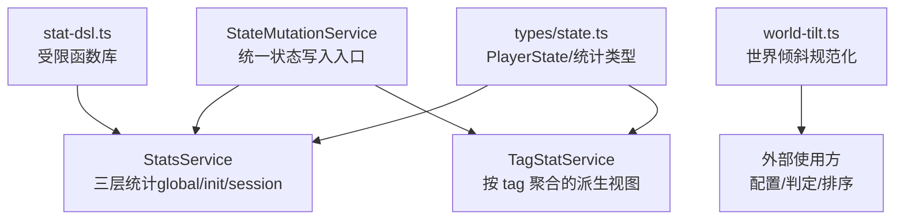
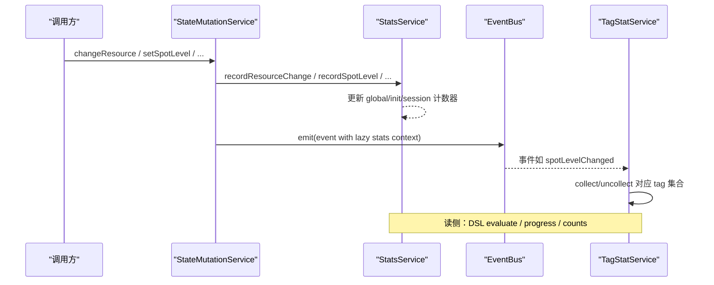
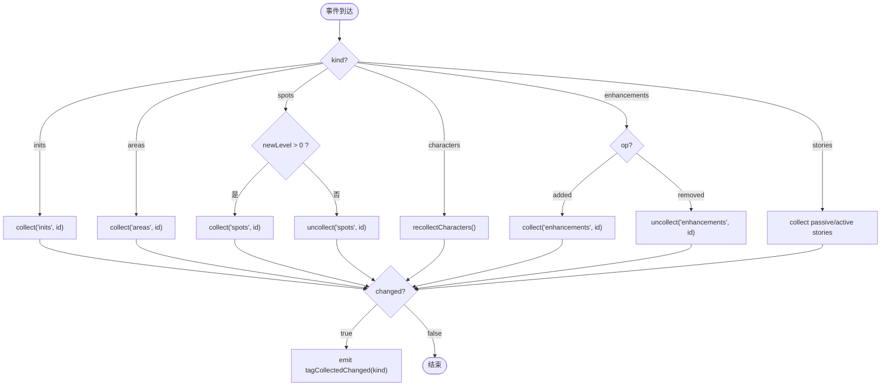
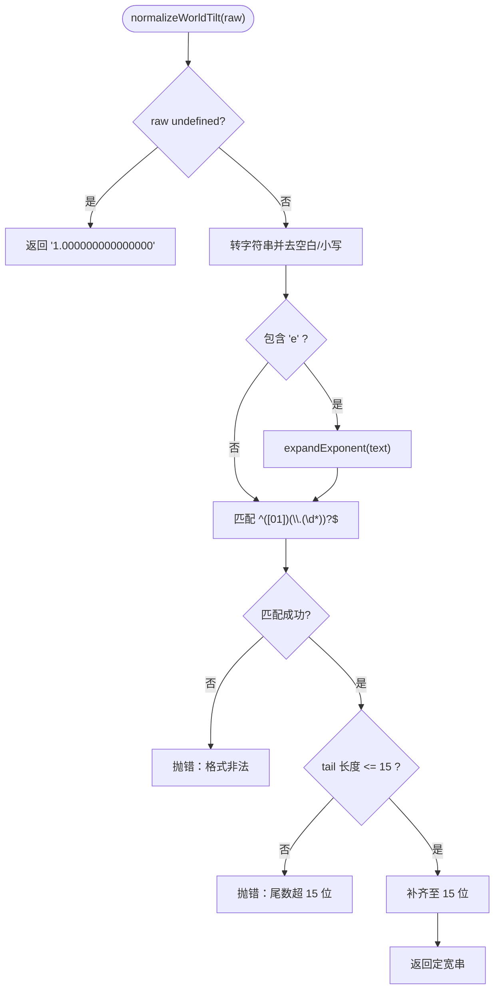
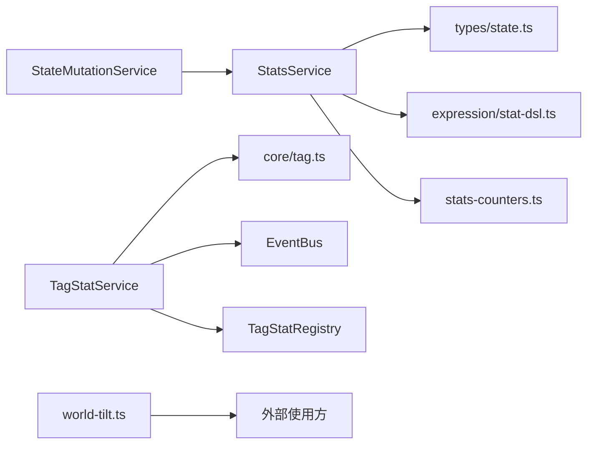

# 统计系统

<cite>
**本文引用的文件**
- [stats.ts](file://src/engine/stats/stats.ts)
- [tag-stats.ts](file://src/engine/stats/tag-stats.ts)
- [world-tilt.ts](file://src/engine/stats/world-tilt.ts)
- [stats-counters.ts](file://src/engine/stats/stats-counters.ts)
- [stat-dsl.ts](file://src/engine/expression/stat-dsl.ts)
- [state-mutation-service.ts](file://src/engine/system/state-mutation-service.ts)
- [state.ts](file://src/engine/types/state.ts)
- [stats.test.ts](file://tests/engine/stats.test.ts)
- [tag-stats.test.ts](file://tests/engine/tag-stats.test.ts)
- [world-tilt.test.ts](file://tests/engine/world-tilt.test.ts)
- [stats-views.md](file://docs-828/03-data-structures/stats-views.md)
- [stats-module.md](file://docs-828/02-modules/stats.md)
</cite>

## 更新摘要
**所做更改**
- 更新了StatsService三层统计架构的详细实现说明
- 增强了TagStatService标签统计系统的完整描述
- 完善了WorldTilt世界倾斜计算逻辑的技术细节
- 添加了统计数据收集与分析机制的深入分析
- 扩展了统计配置与自定义指标扩展方法
- 新增了性能影响、数据隐私与可视化展示考虑事项

## 目录
1. [简介](#简介)
2. [项目结构](#项目结构)
3. [核心组件](#核心组件)
4. [架构总览](#架构总览)
5. [详细组件分析](#详细组件分析)
6. [依赖关系分析](#依赖关系分析)
7. [性能考虑](#性能考虑)
8. [故障排查指南](#故障排查指南)
9. [结论](#结论)
10. [附录](#附录)

## 简介
本技术文档围绕 ACProgram 的统计子系统展开，重点覆盖以下方面：
- StatsService 统计服务：计数器管理、指标收集与聚合计算、持久化与事件上下文。
- TagStats 标签统计：按实体类型（世界线/区域/据点/角色/强化/剧情）进行标签分类、维度分析与查询接口。
- WorldTilt 世界倾斜：数值规范化、比较与精度控制。
- 统计数据收集与分析机制：实时统计、历史数据与趋势分析。
- 统计配置与自定义指标扩展方法。
- 性能影响、数据隐私与可视化展示建议。

## 项目结构
统计相关代码集中在 engine/stats 目录，并与表达式层（stat-dsl）、状态变更层（state-mutation-service）以及类型定义（types/state.ts）紧密协作。测试用例位于 tests/engine 下，覆盖三大模块的行为与边界条件。



**图表来源**
- [stats.ts:1-118](file://src/engine/stats/stats.ts#L1-L118)
- [tag-stats.ts:1-120](file://src/engine/stats/tag-stats.ts#L1-L120)
- [stat-dsl.ts:1-91](file://src/engine/expression/stat-dsl.ts#L1-L91)
- [world-tilt.ts:1-39](file://src/engine/stats/world-tilt.ts#L1-L39)
- [state-mutation-service.ts:38-102](file://src/engine/system/state-mutation-service.ts#L38-L102)
- [state.ts:190-200](file://src/engine/types/state.ts#L190-L200)

**章节来源**
- [stats.ts:1-118](file://src/engine/stats/stats.ts#L1-L118)
- [tag-stats.ts:1-120](file://src/engine/stats/tag-stats.ts#L1-L120)
- [stat-dsl.ts:1-91](file://src/engine/expression/stat-dsl.ts#L1-L91)
- [world-tilt.ts:1-39](file://src/engine/stats/world-tilt.ts#L1-L39)
- [state-mutation-service.ts:38-102](file://src/engine/system/state-mutation-service.ts#L38-L102)
- [state.ts:190-200](file://src/engine/types/state.ts#L190-L200)

## 核心组件
- StatsService：维护 global/init/session 三层统计，提供记录资源/物品/据点/强化/剧情解锁等钩子，支持快照、恢复与 DSL 求值。
- TagStatService：基于注册表与事件总线，对七类实体按 tag 进行声明倒排与收集集合维护，提供进度与查询 API。
- world-tilt：将世界倾斜值规范化为固定宽度字符串，保证字典序比较等价于数值比较，并限制精度。
- stats-counters：无状态的计数器构造、复制与增长工具，供 StatsService 复用。
- stat-dsl：受限函数库，定义可被编辑器/条件系统使用的统计查询语法。

**章节来源**
- [stats.ts:47-263](file://src/engine/stats/stats.ts#L47-L263)
- [tag-stats.ts:50-249](file://src/engine/stats/tag-stats.ts#L50-L249)
- [world-tilt.ts:1-39](file://src/engine/stats/world-tilt.ts#L1-L39)
- [stats-counters.ts:1-66](file://src/engine/stats/stats-counters.ts#L1-L66)
- [stat-dsl.ts:1-91](file://src/engine/expression/stat-dsl.ts#L1-L91)

## 架构总览
统计系统采用"写路径集中、读路径派生"的设计：
- 写路径：所有状态变更通过 StateMutationService 统一入口，内部同步调用 StatsService 的 recordXxx 钩子更新三层统计，并在事件负载中惰性注入 StatsContext。
- 读路径：TagStatService 订阅事件，增量维护各类型的 tag 收集集；DSL 解析后由 StatsService.evaluate 选择作用域并取值。
- 世界倾斜：独立工具模块，负责输入校验与标准化，便于跨模块一致比较。



**图表来源**
- [state-mutation-service.ts:87-102](file://src/engine/system/state-mutation-service.ts#L87-L102)
- [stats.ts:153-234](file://src/engine/stats/stats.ts#L153-L234)
- [tag-stats.ts:63-81](file://src/engine/stats/tag-stats.ts#L63-L81)

## 详细组件分析

### StatsService 统计服务
- 三层数据结构
  - global：贯穿 Init 的全局累计（产出/消耗/物品/据点/强化/剧情/帧）。
  - init[id]：每个 Init 的累计（额外包含 framesInInit）。
  - session：当前游玩的实时统计（含 startFrame、currentInit、currentArea、resources、completedStoryIdsThisRun）。
- 关键能力
  - beginSession/reset：初始化或重置会话。
  - getSnapshot/getContext：导出快照与事件上下文（浅拷贝避免持有内部引用）。
  - evaluate(dsl)：解析 DSL 并返回指定作用域的指标值。
  - 记录钩子：recordResourceChange、recordItemChange、recordSpotLevel、recordEnhancementUnlocked、recordStoryCompleted、recordInitUnlocked、recordInitEntered、recordAreaEntered、recordTick。
  - 持久化：getPersistable/restore 支持存档保存与恢复。
- 复杂度与优化
  - 计数器增长为 O(1)。
  - 事件上下文惰性构建，避免每 Tick 频繁深拷贝。
  - 选择器 selectCounters 根据作用域快速定位目标计数器。

```mermaid
classDiagram
class StatsService {
-state : PlayerState
-stats : StatsSnapshot
+setState(state)
+reset()
+beginSession()
+getSnapshot() StatsSnapshot
+getContext() StatsContext
+evaluate(dsl) number|null
+getPersistable() PersistedStats
+restore(persisted)
+recordResourceChange(resource, delta)
+recordItemChange(itemId, count)
+recordSpotLevel(oldLevel, newLevel)
+recordEnhancementUnlocked()
+recordStoryCompleted(storyId)
+hasCompletedStoryThisRun(storyId) bool
+recordInitUnlocked()
+recordInitEntered(initId)
+recordAreaEntered(areaId)
+recordTick()
-selectCounters(query) StatCounters|null
-currentInitStats() InitStatCounters|null
-counters() {global,init,run}
}
```

**图表来源**
- [stats.ts:47-263](file://src/engine/stats/stats.ts#L47-L263)

**章节来源**
- [stats.ts:47-263](file://src/engine/stats/stats.ts#L47-L263)
- [stats-counters.ts:1-66](file://src/engine/stats/stats-counters.ts#L1-L66)
- [stat-dsl.ts:1-91](file://src/engine/expression/stat-dsl.ts#L1-L91)
- [state-mutation-service.ts:87-102](file://src/engine/system/state-mutation-service.ts#L87-L102)

### TagStats 标签统计
- 实体类型与索引
  - 七类实体：inits/areas/spots/characters/enhancements/passiveStories/activeStories。
  - 三类索引：declared（声明倒排）、collected（收集集合）、byEntity（实体到登记 key 映射）。
- 生命周期
  - 构造时 buildDeclared 扫描注册表建立倒排。
  - setState 全量重建 collected（读档/新游戏/切换世界线），期间抑制事件发射。
  - 事件驱动增量维护：initUnlocked、areaEntered、spotLevelChanged、characterAcquired、enhancementAdded/Removed、storyCompleted。
- 查询接口
  - declaredCount/collectionCount/collectedIds/progress。
- 角色收集语义（F-04）
  - roster 为唯一真相来源，差分实例获得即收集其原型。
- 事件与条件系统
  - 仅实际增删才发出 tagCollectedChanged，并按 kind 精确命中依赖项。
  - 可通过 ConditionSystem.tagCount 接入条件判断。



**图表来源**
- [tag-stats.ts:63-81](file://src/engine/stats/tag-stats.ts#L63-L81)
- [tag-stats.ts:183-213](file://src/engine/stats/tag-stats.ts#L183-L213)
- [tag-stats.ts:215-249](file://src/engine/stats/tag-stats.ts#L215-L249)

**章节来源**
- [tag-stats.ts:1-275](file://src/engine/stats/tag-stats.ts#L1-L275)
- [tag-stats.test.ts:86-299](file://tests/engine/tag-stats.test.ts#L86-L299)

### WorldTilt 世界倾斜
- 规范化规则
  - 输入可为字符串或数字，自动处理科学计数法。
  - 首位必须为 0 或 1，尾数最多 15 位，不足补 0。
  - 缺省值为官方世界 1.0。
- 比较策略
  - compareWorldTilt 对定宽串进行字典序比较，等价于数值升序差。
- 错误处理
  - 格式非法、指数非法、尾数超长均抛出异常。



**图表来源**
- [world-tilt.ts:1-39](file://src/engine/stats/world-tilt.ts#L1-L39)

**章节来源**
- [world-tilt.ts:1-39](file://src/engine/stats/world-tilt.ts#L1-L39)
- [world-tilt.test.ts:1-55](file://tests/engine/world-tilt.test.ts#L1-L55)

### 统计数据的收集与分析机制
- 实时统计
  - 通过 StateMutationService 在每次状态变更时同步更新 StatsService 的三层计数器。
  - 事件负载惰性携带 StatsContext，降低高频事件开销。
- 历史数据
  - StatsService.getPersistable/restore 支持全局、各 Init 与当前会话的持久化与恢复。
- 趋势分析
  - 通过 Session 的 counters 与 resources 字段，结合时间戳（startFrame）可进行区间对比。
  - TagStatService 的 collected 集合可用于进度追踪与覆盖率分析。
- 条件与触发
  - 条件系统可通过 stat-dsl 与 tagCount 读取统计结果，驱动效果引擎。

**章节来源**
- [stats.ts:119-151](file://src/engine/stats/stats.ts#L119-L151)
- [state-mutation-service.ts:87-102](file://src/engine/system/state-mutation-service.ts#L87-L102)
- [stat-dsl.ts:1-91](file://src/engine/expression/stat-dsl.ts#L1-L91)
- [tag-stats.ts:95-118](file://src/engine/stats/tag-stats.ts#L95-L118)

## 依赖关系分析
- StatsService 依赖
  - types/state.ts：PlayerState、统计类型。
  - expression/stat-dsl.ts：DSL 解析。
  - stats-counters.ts：计数器工具。
  - system/state-mutation-service.ts：作为写路径集成点。
- TagStatService 依赖
  - core/tag.ts：标签解析与显示。
  - EventBus：事件订阅与发布。
  - Registry 抽象（TagStatRegistry）：只读实体元数据。
- WorldTilt
  - 无外部运行时依赖，纯函数工具。



**图表来源**
- [stats.ts:20-33](file://src/engine/stats/stats.ts#L20-L33)
- [tag-stats.ts:13-15](file://src/engine/stats/tag-stats.ts#L13-L15)
- [state-mutation-service.ts:44-47](file://src/engine/system/state-mutation-service.ts#L44-L47)

**章节来源**
- [stats.ts:20-33](file://src/engine/stats/stats.ts#L20-L33)
- [tag-stats.ts:13-15](file://src/engine/stats/tag-stats.ts#L13-L15)
- [state-mutation-service.ts:44-47](file://src/engine/system/state-mutation-service.ts#L44-L47)

## 性能考虑
- 写路径
  - 计数器增长为 O(1)，map 操作常数级。
  - 事件上下文惰性构建，仅在消费方访问 event.stats 时深拷贝，避免每 Tick 重复构建。
- 读路径
  - TagStatService 的 declared/collected 倒排与集合操作均为 O(1)/O(k)（k 为实体声明 tag 数量）。
  - 全量重建（setState/rebuildDeclared）在状态切换时执行，应避免频繁调用。
- 世界倾斜
  - 规范化与比较为 O(n)（n 为字符串长度），且长度固定，开销极低。
- 建议
  - 批量更新时合并事件，减少重建次数。
  - 对高频率 tick 场景，优先使用轻量查询（如 progress/count），避免不必要的深拷贝。

## 故障排查指南
- 统计未更新
  - 确认状态变更是否通过 StateMutationService 统一入口，确保 recordXxx 钩子被调用。
  - 检查事件是否被正确发出（如 spotLevelChanged、characterAcquired）。
- 标签统计异常
  - 验证实体是否在注册表中声明了相应 tags。
  - 检查 byEntity 映射是否正确建立（buildDeclared）。
  - 确认角色收集逻辑遵循 roster 单一真相来源。
- DSL 求值失败
  - 检查函数名与作用域是否匹配，参数是否齐全。
  - 对于 init 作用域，需传入正确的 initId。
- 世界倾斜报错
  - 检查输入格式是否符合首位 0/1、尾数不超过 15 位的约束。
  - 科学计数法的指数需为整数。

**章节来源**
- [stats.ts:107-117](file://src/engine/stats/stats.ts#L107-L117)
- [tag-stats.ts:133-150](file://src/engine/stats/tag-stats.ts#L133-L150)
- [world-tilt.ts:6-19](file://src/engine/stats/world-tilt.ts#L6-L19)
- [stats.test.ts:138-147](file://tests/engine/stats.test.ts#L138-L147)
- [tag-stats.test.ts:216-257](file://tests/engine/tag-stats.test.ts#L216-L257)
- [world-tilt.test.ts:29-41](file://tests/engine/world-tilt.test.ts#L29-L41)

## 结论
ACProgram 的统计系统以清晰的三层结构与事件驱动模型实现高效、可扩展的统计能力。StatsService 提供稳定的计数器管理与持久化，TagStatService 以标签维度支撑丰富的收集进度与条件判定，WorldTilt 保证世界倾斜值的规范比较。整体设计兼顾性能与可维护性，适合复杂游戏的长期演进。

## 附录

### 统计配置示例与自定义指标扩展
- 统计 DSL 扩展
  - 在 stat-dsl.ts 中新增函数定义（scope/metric/keyed），即可在编辑器/条件系统中使用新的统计查询。
- 自定义指标
  - 若需新增业务指标，可在 StatsService 中添加 recordXxx 钩子，并在 stats-counters.ts 中扩展计数器结构。
  - 同时更新持久化与恢复逻辑，确保存档兼容。
- 标签维度
  - 在 TagStatService 中扩展实体类型或标签前缀匹配规则，注意保持各类型统计相互独立。

**章节来源**
- [stat-dsl.ts:17-63](file://src/engine/expression/stat-dsl.ts#L17-L63)
- [stats-counters.ts:14-31](file://src/engine/stats/stats-counters.ts#L14-L31)
- [stats.ts:153-234](file://src/engine/stats/stats.ts#L153-L234)

### 数据隐私与可视化展示建议
- 数据隐私
  - 统计上下文仅在必要时惰性构建，避免泄露过多内部状态。
  - 持久化数据应脱敏后再用于非本地分析。
- 可视化
  - 使用 getSnapshot 导出完整统计，结合 Session 的时间信息绘制趋势图。
  - TagStatService 的 progress 可用于进度条与收集图鉴展示。
  - WorldTilt 的规范化串可直接用于排序与分组展示。

### 三层统计架构详解
根据最新的 stats-views 文档，统计系统采用严格的三层架构：

| 层 | 键 | 生命周期 | 累加范围 |
| --- | --- | --- | --- |
| **Global** | `globalStats` | 跨世界线永久 | 全部运行 |
| **per-Init** | `initStats` | 世界线生命周期 | 该世界线全部运行 |
| **当前运行** | `currentRunStats` | 本次游玩 | 当前 runId |

每个 `StatsBucket` 是统一计数累加器（`resourceProduced/consumed`、`itemsCollected/used`、`storiesCompleted`、`framesActive` 等）；每帧一次 `statsService.tick()` 累计帧数；每次 `StateMutationService` 写资源/物品/剧情同步记统计。

### UI 只读视图架构
- `getView()` → `GameView`：资源快照 + spotLevels + unlockedInits + storyLog + visibility 等；
- `createUIContext(game)` → `UIContext`：GameView + nameOf/formatNumber/escapeHtml 等 UI 辅助；
- 组件层只持 `UIFacingGame`（18 个只读成员，T2）；每帧 `refreshLight` 更新数字，揭示指纹变化 → `refreshRevealIfChanged` → 重建 DOM。

### 可见性系统
- `visibility` 快照：`{ spots, areas, inits }` 布尔掩码；
- 计算依据：`revealTriggers` 的 `existence` 目标；
- 读档 / 运行时标签变化 → `refresh()` 重建快照。注意 `RevealStage`（7 级）与 `AccessStage`（5 阶段）是两套概念。

**章节来源**
- [stats-views.md:5-37](file://docs-828/03-data-structures/stats-views.md#L5-L37)
- [stats-module.md:19-23](file://docs-828/02-modules/stats.md#L19-L23)