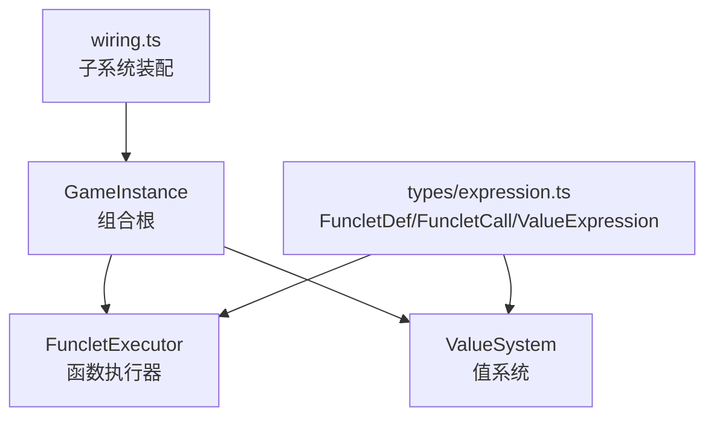
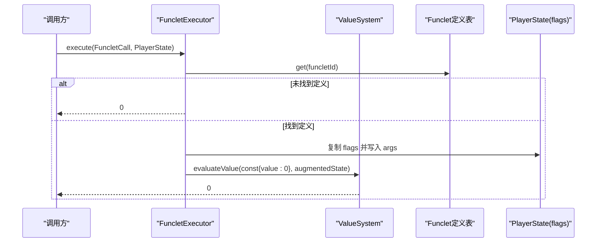
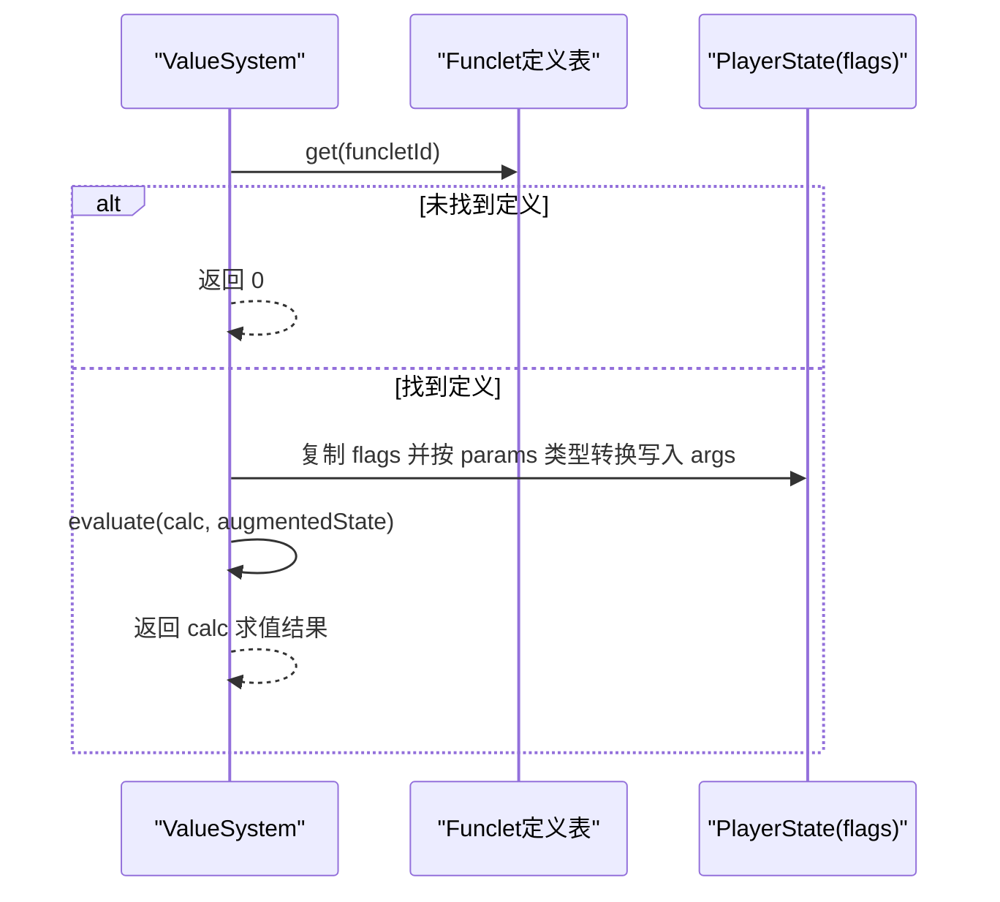
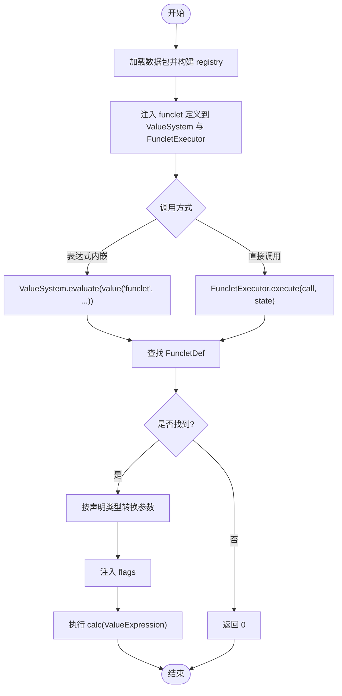
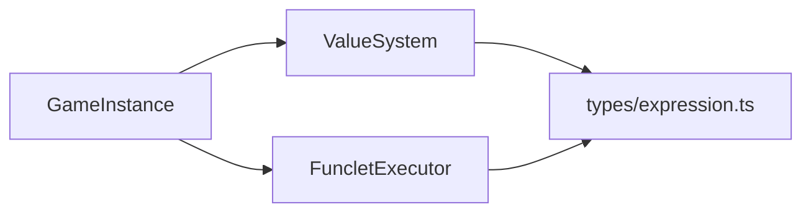

# 函数执行器

<cite>
**本文引用的文件**
- [funclet-executor.ts](file://src/engine/expression/funclet-executor.ts)
- [value-system.ts](file://src/engine/expression/value-system.ts)
- [expression.ts](file://src/engine/types/expression.ts)
- [game-instance.ts](file://src/engine/game-instance.ts)
- [wiring.ts](file://src/engine/game/wiring.ts)
- [03f-declarative-dsl.md](file://docs-824/03f-declarative-dsl.md)
- [value-system.test.ts](file://tests/engine/value-system.test.ts)
</cite>

## 目录
1. [简介](#简介)
2. [项目结构](#项目结构)
3. [核心组件](#核心组件)
4. [架构总览](#架构总览)
5. [详细组件分析](#详细组件分析)
6. [依赖关系分析](#依赖关系分析)
7. [性能考量](#性能考量)
8. [故障排除指南](#故障排除指南)
9. [结论](#结论)
10. [附录](#附录)

## 简介
本技术文档聚焦于 ACProgram 引擎中的“函数执行器”（FuncletExecutor）与“值系统”（ValueSystem），系统性阐述 Funclet 的注册机制、参数传递、执行上下文管理、函数定义格式、参数类型检查、返回值处理，以及从解析到执行的完整生命周期。同时提供自定义函数的开发规范、错误处理与性能优化建议，并说明如何扩展内置函数系统与调试方法。

## 项目结构
围绕函数执行器的关键代码位于 engine/expression 与 engine/types：
- 表达式与函数定义类型集中在 types/expression.ts
- 值系统实现 value-system.ts，负责 ValueExpression 求值与 funclet 调用桥接
- 函数执行器实现 funclet-executor.ts，封装一次函数调用的入口
- GameInstance 在初始化时装配并注入 FuncletExecutor 与 ValueSystem



图表来源
- [game-instance.ts:70-100](file://src/engine/game-instance.ts#L70-L100)
- [wiring.ts:60-75](file://src/engine/game/wiring.ts#L60-L75)
- [expression.ts:248-262](file://src/engine/types/expression.ts#L248-L262)

章节来源
- [game-instance.ts:70-100](file://src/engine/game-instance.ts#L70-L100)
- [wiring.ts:60-75](file://src/engine/game/wiring.ts#L60-L75)
- [expression.ts:248-262](file://src/engine/types/expression.ts#L248-L262)

## 核心组件
- FuncletExecutor：对外暴露 execute(call, state)，完成函数查找、参数注入、上下文构造与结果返回。
- ValueSystem：维护 funclet 定义表与 Extra 读取器；提供 evaluate(expr, state) 对 ValueExpression 树递归求值；提供 evaluateValue(val, state) 按 source 分派具体取值逻辑；内置 funclet 求值器将参数注入 flags 后继续求值 calc。
- 类型定义：FuncletDef（id/description/params/calc/extra）、FuncletCall（funcletId/args）、ValueExpression（const/value/算术/取整/区间等）。

章节来源
- [funclet-executor.ts:8-44](file://src/engine/expression/funclet-executor.ts#L8-L44)
- [value-system.ts:13-149](file://src/engine/expression/value-system.ts#L13-L149)
- [expression.ts:21-39](file://src/engine/types/expression.ts#L21-L39)
- [expression.ts:248-262](file://src/engine/types/expression.ts#L248-L262)

## 架构总览
Funclet 的执行由两条路径协同：
- 直接调用路径：外部通过 FuncletExecutor.execute 发起一次函数调用。
- 表达式内嵌路径：在 ValueExpression 中通过 value(source='funclet') 节点调用 Funclet，内部由 ValueSystem.funclet 求值器完成参数提取、flags 注入与 calc 求值。



图表来源
- [funclet-executor.ts:25-43](file://src/engine/expression/funclet-executor.ts#L25-L43)
- [value-system.ts:144-149](file://src/engine/expression/value-system.ts#L144-L149)



图表来源
- [value-system.ts:67-85](file://src/engine/expression/value-system.ts#L67-L85)

章节来源
- [funclet-executor.ts:25-43](file://src/engine/expression/funclet-executor.ts#L25-L43)
- [value-system.ts:67-85](file://src/engine/expression/value-system.ts#L67-L85)

## 详细组件分析

### 函数定义与调用模型
- FuncletDef
  - id：函数唯一标识
  - description：描述信息
  - params：参数列表，每个参数包含 name 与 type（'number'|'string'）
  - calc：ValueExpression，表示函数体计算逻辑
  - extra：可选的附加元数据
- FuncletCall
  - funcletId：要调用的函数 id
  - args：键值对形式的参数集合，值为 number|string

类型来源
- [expression.ts:248-262](file://src/engine/types/expression.ts#L248-L262)

章节来源
- [expression.ts:248-262](file://src/engine/types/expression.ts#L248-L262)

### 函数注册机制
- 运行时装配：GameInstance 在 init 阶段从 registry 加载数据包后，统一将 funclet 定义注入 ValueSystem 与 FuncletExecutor。
- 注入点：
  - valueSystem.setFuncletDefs(...)
  - funcletExecutor.setDefs(...)

章节来源
- [game-instance.ts:177-189](file://src/engine/game-instance.ts#L177-L189)
- [wiring.ts:60-75](file://src/engine/game/wiring.ts#L60-L75)

### 参数传递系统与上下文管理
- 直接调用路径（FuncletExecutor.execute）
  - 查找定义，若不存在返回 0
  - 复制 PlayerState.flags 并将 call.args 以字符串形式写入新 flags
  - 使用一个占位的 const 值触发 ValueSystem.evaluateValue，但并未实际执行 calc
- 表达式内嵌路径（ValueSystem.funclet 求值器）
  - 根据 FuncletDef.params 的类型进行参数转换（number/string）
  - 将参数以字符串形式注入 flags
  - 调用 this.evaluate(def.calc, state) 真正执行 calc 并返回结果

对比要点
- 直接调用路径当前未执行 calc，仅返回 0（已知缺陷）
- 表达式内嵌路径正确执行 calc，是推荐用法

章节来源
- [funclet-executor.ts:25-43](file://src/engine/expression/funclet-executor.ts#L25-L43)
- [value-system.ts:67-85](file://src/engine/expression/value-system.ts#L67-L85)

### 参数类型检查与返回值处理
- 参数类型检查：在 ValueSystem.funclet 求值器中，依据 FuncletDef.params[].type 将原始参数转换为 number 或 string，再注入 flags
- 返回值处理：
  - 表达式内嵌路径：返回 calc 求值结果（数值）
  - 直接调用路径：当前返回 0（需修复）

章节来源
- [value-system.ts:67-85](file://src/engine/expression/value-system.ts#L67-L85)
- [funclet-executor.ts:25-43](file://src/engine/expression/funclet-executor.ts#L25-L43)

### 函数调用的生命周期（解析到执行）


图表来源
- [game-instance.ts:177-189](file://src/engine/game-instance.ts#L177-L189)
- [value-system.ts:67-85](file://src/engine/expression/value-system.ts#L67-L85)
- [funclet-executor.ts:25-43](file://src/engine/expression/funclet-executor.ts#L25-L43)

章节来源
- [game-instance.ts:177-189](file://src/engine/game-instance.ts#L177-L189)
- [value-system.ts:67-85](file://src/engine/expression/value-system.ts#L67-L85)
- [funclet-executor.ts:25-43](file://src/engine/expression/funclet-executor.ts#L25-L43)

### 类与关系图（代码级）
```mermaid
classDiagram
class FuncletExecutor {
-defs : Map<string, FuncletDef>
-valueSystem : ValueSystem
+constructor(defs)
+setDefs(defs) void
+execute(call, state) number
}
class ValueSystem {
+funcletDefs : Map<string, FuncletDef>
+extraReader(path) ExtraValue|undefined
+setFuncletDefs(defs) void
+evaluate(expr, state) number
+evaluateValue(val, state) number
}
class FuncletDef {
+id : string
+description : string
+params : {name : string; type : 'number'|'string'}[]
+calc : ValueExpression
+extra : ExtraCompound
}
class FuncletCall {
+funcletId : string
+args : Record<string, number|string>
}
FuncletExecutor --> ValueSystem : "委托求值"
FuncletExecutor --> FuncletDef : "查找定义"
ValueSystem --> FuncletDef : "读取定义"
```

图表来源
- [funclet-executor.ts:8-44](file://src/engine/expression/funclet-executor.ts#L8-L44)
- [value-system.ts:88-149](file://src/engine/expression/value-system.ts#L88-L149)
- [expression.ts:248-262](file://src/engine/types/expression.ts#L248-L262)

章节来源
- [funclet-executor.ts:8-44](file://src/engine/expression/funclet-executor.ts#L8-L44)
- [value-system.ts:88-149](file://src/engine/expression/value-system.ts#L88-L149)
- [expression.ts:248-262](file://src/engine/types/expression.ts#L248-L262)

## 依赖关系分析
- GameInstance 在初始化时集中装配子系统，确保 ValueSystem 与 FuncletExecutor 共享同一份 funclet 定义表
- ValueSystem 依赖 Extra 读取器以支持 data 源；FuncletExecutor 依赖 ValueSystem 完成求值
- 类型层 expression.ts 为所有组件提供统一的函数与表达式契约



图表来源
- [game-instance.ts:177-189](file://src/engine/game-instance.ts#L177-L189)
- [wiring.ts:60-75](file://src/engine/game/wiring.ts#L60-L75)
- [expression.ts:248-262](file://src/engine/types/expression.ts#L248-L262)

章节来源
- [game-instance.ts:177-189](file://src/engine/game-instance.ts#L177-L189)
- [wiring.ts:60-75](file://src/engine/game/wiring.ts#L60-L75)
- [expression.ts:248-262](file://src/engine/types/expression.ts#L248-L262)

## 性能考量
- 避免重复创建 ValueSystem：建议在 GameInstance 中复用单一实例，减少对象分配与闭包开销
- 表达式缓存：ValueExpression 本身无缓存，但上层 GameNum 系统具备缓存机制；尽量通过 expr 节点下沉到 ValueExpression，利用上层缓存
- 参数转换成本：在 ValueSystem.funclet 中对参数进行类型转换，应尽量减少不必要的复杂转换
- 已知缺陷影响：FuncletExecutor.execute 当前不执行 calc，导致该路径无计算开销但语义不正确；修复后可按需评估性能

[本节为通用指导，不直接分析具体文件]

## 故障排除指南
- 症状：调用 funclet 始终返回 0
  - 可能原因：通过 FuncletExecutor.execute 直接调用时，当前实现未执行 calc，仅返回 0（已知缺陷）
  - 解决建议：优先通过 ValueExpression.value(source='funclet') 在表达式中调用，或使用 ValueSystem.evaluate 直接求值 calc
- 症状：funclet 参数未按预期生效
  - 可能原因：参数名与 FuncletDef.params 不一致，或类型转换不符合预期
  - 排查步骤：确认参数名与类型声明一致；检查 flags 注入过程
- 症状：data 源读取不到值
  - 可能原因：未注入 extraReader
  - 解决建议：通过 ValueSystem.setExtraReader 注入读取器

章节来源
- [03f-declarative-dsl.md:20-37](file://docs-824/03f-declarative-dsl.md#L20-L37)
- [value-system.test.ts:52-83](file://tests/engine/value-system.test.ts#L52-L83)
- [value-system.ts:67-85](file://src/engine/expression/value-system.ts#L67-L85)
- [funclet-executor.ts:25-43](file://src/engine/expression/funclet-executor.ts#L25-L43)

## 结论
FuncletExecutor 与 ValueSystem 共同构成了 ACProgram 的可复用数值片段系统。通过统一的类型契约与表达式树，Funclet 可在任意表达式中被调用，并在运行时基于 PlayerState 与 Extra 视图进行求值。当前直接调用路径存在已知缺陷，建议优先采用表达式内嵌调用方式。后续修复可直接调用路径以完善一致性体验。

[本节为总结性内容，不直接分析具体文件]

## 附录

### 自定义函数开发指南
- 接口规范
  - 在数据包中声明 FuncletDef，明确 id、description、params（name/type）、calc（ValueExpression）与可选 extra
  - 在运行时通过 registry 加载后，自动注入到 ValueSystem 与 FuncletExecutor
- 参数类型检查
  - 使用 ValueSystem.funclet 求值器进行参数类型转换（number/string），确保与声明一致
- 返回值处理
  - 通过 ValueExpression 表达计算逻辑，最终返回数值
- 错误处理
  - 未找到定义时返回 0；缺失资源/等级等也默认返回 0，保持鲁棒性
- 性能优化建议
  - 尽量复用 ValueSystem 实例
  - 将复杂计算组织为可复用的 ValueExpression，借助上层缓存
  - 避免在高频路径中进行昂贵的字符串操作

章节来源
- [expression.ts:248-262](file://src/engine/types/expression.ts#L248-L262)
- [value-system.ts:67-85](file://src/engine/expression/value-system.ts#L67-L85)
- [game-instance.ts:177-189](file://src/engine/game-instance.ts#L177-L189)

### 内置函数与扩展函数系统
- 内置值源
  - const、res、spotLevel、areaSpotCount、managerCount、data、funclet
- 扩展方式
  - 新增 ValueSource 成员并在 SOURCE_EVALUATORS 中实现对应求值器
  - 在 ValueSystem 中注册新的 source，即可在 ValueExpression 中使用

章节来源
- [value-system.ts:13-86](file://src/engine/expression/value-system.ts#L13-L86)
- [expression.ts:11-19](file://src/engine/types/expression.ts#L11-L19)

### 调试工具与性能分析
- 单元测试参考
  - value-system.test.ts 展示了常量、资源、等级、data 源等用例，可作为自定义函数测试模板
- 调试建议
  - 通过 DevLog 记录关键状态变化
  - 使用 evaluateWithBreakdown（上层 GameNum 系统）分析贡献明细
  - 针对 funclet 调用，优先在表达式中插入断点观察 flags 注入与 calc 求值

章节来源
- [value-system.test.ts:25-83](file://tests/engine/value-system.test.ts#L25-L83)
- [game-num-eval.ts:171-180](file://src/engine/expression/game-num-eval.ts#L171-L180)