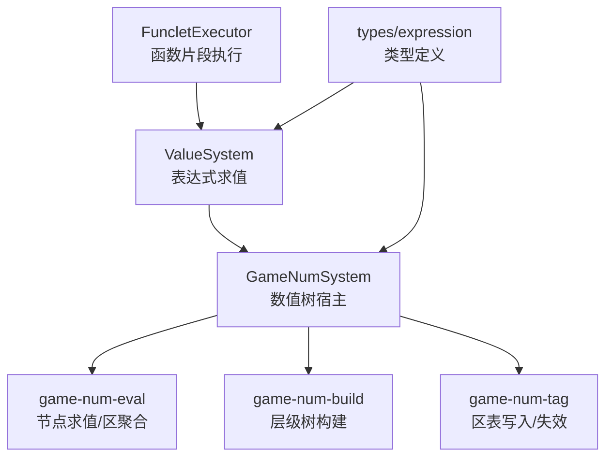
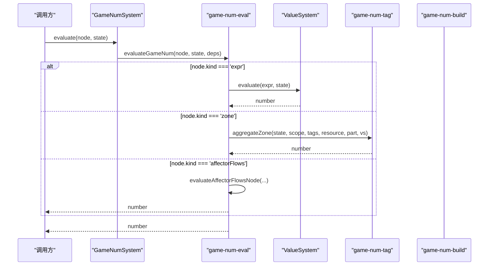
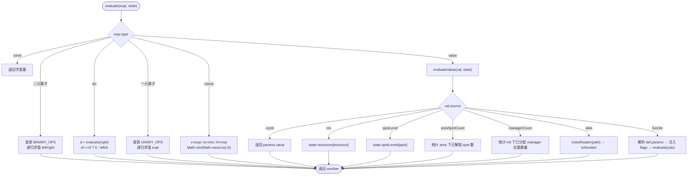
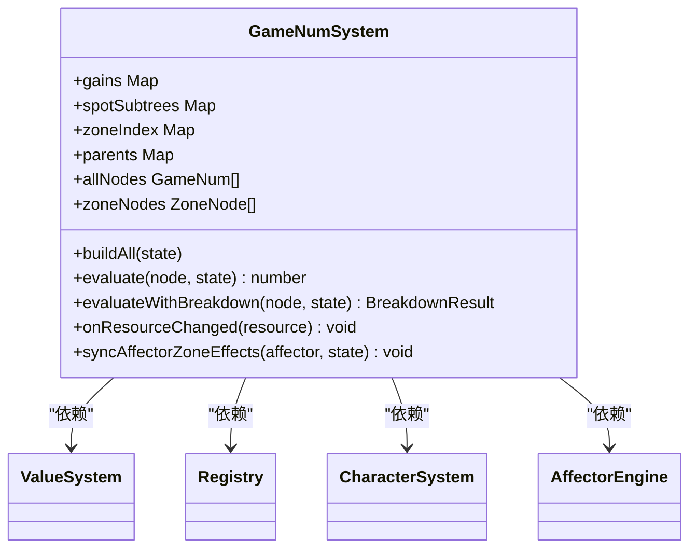
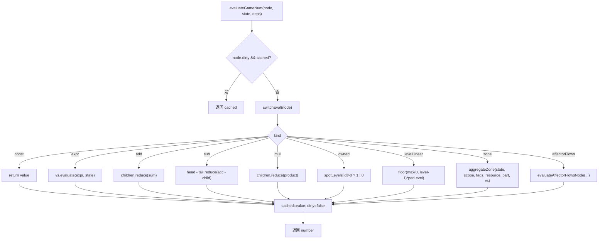
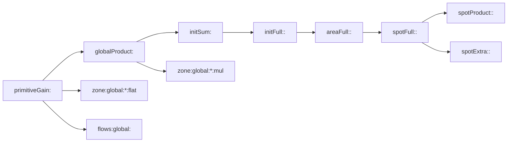
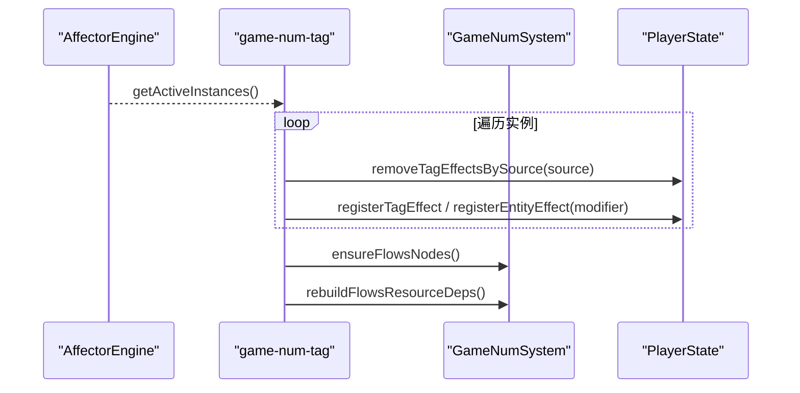
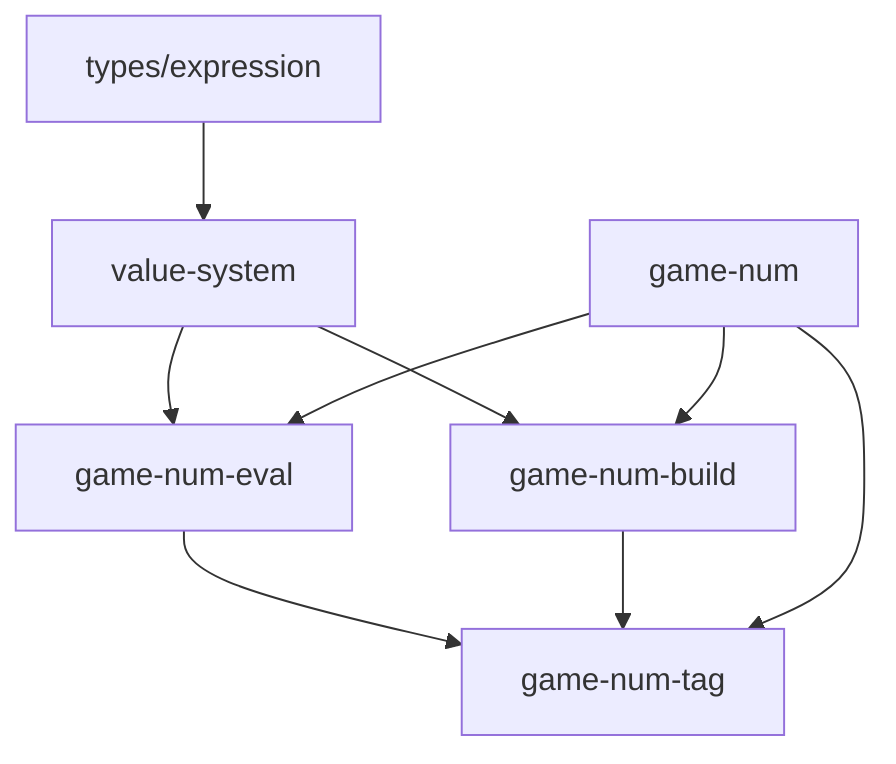

# 数值表达式引擎

<cite>
**本文引用的文件**
- [value-system.ts](file://src/engine/expression/value-system.ts)
- [game-num.ts](file://src/engine/expression/game-num.ts)
- [game-num-eval.ts](file://src/engine/expression/game-num-eval.ts)
- [game-num-build.ts](file://src/engine/expression/game-num-build.ts)
- [game-num-tag.ts](file://src/engine/expression/game-num-tag.ts)
- [funclet-executor.ts](file://src/engine/expression/funclet-executor.ts)
- [expression.ts](file://src/engine/types/expression.ts)
- [value-system.test.ts](file://tests/engine/value-system.test.ts)
- [game-num.test.ts](file://tests/engine/game-num.test.ts)
</cite>

## 目录
1. [简介](#简介)
2. [项目结构](#项目结构)
3. [核心组件](#核心组件)
4. [架构总览](#架构总览)
5. [详细组件分析](#详细组件分析)
6. [依赖关系分析](#依赖关系分析)
7. [性能考虑](#性能考虑)
8. [故障排查指南](#故障排查指南)
9. [结论](#结论)
10. [附录：使用示例与最佳实践](#附录使用示例与最佳实践)

## 简介
本技术文档面向 ACProgram 的“数值表达式引擎”，聚焦 ValueSystem 类的设计与实现，系统阐述表达式求值算法、算子表驱动机制以及 source 求值器注册表。文档同时覆盖支持的数值类型（const、res、spotLevel、areaSpotCount、managerCount、data、funclet），二元算子（add、sub、mul、min、max、pow）和一元算子（floor、ceil、round、clamp）的具体行为。此外，提供构建与使用复杂数值表达式的示例、性能优化策略、错误处理机制与调试技巧，帮助读者快速掌握并高效扩展该引擎。

## 项目结构
数值表达式引擎位于 src/engine/expression 目录下，围绕 ValueSystem 与 GameNumSystem 两大子系统展开：
- value-system.ts：ValueExpression 求值系统，包含算子表与 source 求值器注册表。
- game-num.ts：GameNumSystem 门面层，负责树构建、事件订阅、脏位管理与求值入口。
- game-num-eval.ts：GameNum 节点纯求值逻辑，含区聚合 aggregateZone、贡献明细 evaluateWithBreakdown。
- game-num-build.ts：显式层级树构建（Phase 6），按资源生成 primitiveGain 根节点及 spot/area/init 四级层级。
- game-num-tag.ts：区表写入与 Affector 桥接，维护 tagEffects/entityEffects 与 zoneIndex 反向索引。
- funclet-executor.ts：Funclet 执行器，将调用参数注入 flags 后交由 ValueSystem 求值。
- types/expression.ts：Value、ValueExpression、Condition、Effect、FuncletDef 等类型定义。

图表来源
- [value-system.ts:1-150](file://src/engine/expression/value-system.ts#L1-L150)
- [game-num.ts:1-262](file://src/engine/expression/game-num.ts#L1-L262)
- [game-num-eval.ts:1-292](file://src/engine/expression/game-num-eval.ts#L1-L292)
- [game-num-build.ts:1-446](file://src/engine/expression/game-num-build.ts#L1-L446)
- [game-num-tag.ts:1-220](file://src/engine/expression/game-num-tag.ts#L1-L220)
- [funclet-executor.ts:1-45](file://src/engine/expression/funclet-executor.ts#L1-L45)
- [expression.ts:1-263](file://src/engine/types/expression.ts#L1-L263)

章节来源
- [value-system.ts:1-150](file://src/engine/expression/value-system.ts#L1-L150)
- [game-num.ts:1-262](file://src/engine/expression/game-num.ts#L1-L262)

## 核心组件
- ValueSystem：表达式求值核心，基于算子表与 source 求值器注册表，支持 const/res/spotLevel/areaSpotCount/managerCount/data/funclet 等数据源，以及 add/sub/mul/min/max/pow/floor/ceil/round/clamp 等算子。
- GameNumSystem：数值树宿主，负责每资源的 primitiveGain 根节点构建、zone 节点管理、事件驱动的脏位失效、资源定向失效、flows 节点动态创建与挂载。
- game-num-eval：节点级求值器，统一通过 state.tagEffects/entityEffects 进行区聚合，支持贡献明细输出。
- game-num-build：构建 Phase 6 显式层级树（global → init → area → spot），并为 flows 提供层级分发。
- game-num-tag：区表写入、撤销、同步 Affector 修改器、标记脏位与重建 flows 资源依赖。
- FuncletExecutor：封装 Funclet 调用，将参数注入 flags 后委托 ValueSystem 求值。

章节来源
- [value-system.ts:10-150](file://src/engine/expression/value-system.ts#L10-L150)
- [game-num.ts:43-262](file://src/engine/expression/game-num.ts#L43-L262)
- [game-num-eval.ts:17-292](file://src/engine/expression/game-num-eval.ts#L17-L292)
- [game-num-build.ts:27-446](file://src/engine/expression/game-num-build.ts#L27-L446)
- [game-num-tag.ts:24-220](file://src/engine/expression/game-num-tag.ts#L24-L220)
- [funclet-executor.ts:8-45](file://src/engine/expression/funclet-executor.ts#L8-L45)

## 架构总览
ValueSystem 作为表达式求值内核，被 GameNumSystem 在 expr 叶子节点中调用；GameNumSystem 通过 game-num-build 构建每资源的层级树，并通过 game-num-tag 维护区表与失效传播；game-num-eval 提供统一的节点求值与区聚合逻辑；FuncletExecutor 将 Funclet 调用转换为 ValueSystem 可处理的表达式求值。

图表来源
- [game-num.ts:229-238](file://src/engine/expression/game-num.ts#L229-L238)
- [game-num-eval.ts:172-211](file://src/engine/expression/game-num-eval.ts#L172-L211)
- [game-num-eval.ts:117-169](file://src/engine/expression/game-num-eval.ts#L117-L169)
- [game-num-eval.ts:270-291](file://src/engine/expression/game-num-eval.ts#L270-L291)

## 详细组件分析

### ValueSystem：表达式求值与算子表驱动
- 算子表驱动：BINARY_OPS 与 UNARY_OPS 集中声明二元与一元算子，evaluate 根据表达式类型查表调用，新增算子只需扩展表与 switch 分支。
- source 求值器注册表：SOURCE_EVALUATORS 以 ValueSource 为键映射到求值器，新增 source 需扩展联合类型与注册表项。
- 表达式求值流程：
  - const：直接返回字面量。
  - value：查找对应 source 求值器，读取状态或注入依赖。
  - 二元算子：递归求值左右子树后应用算子（div 有除零保护）。
  - 一元算子：递归求值子表达式后应用取整。
  - clamp：对 expr 结果在 min..max 区间内夹取。
- data 求值：通过 extraReader 读取 Extra 三层合并视图，并使用 toNumber 语义转换（bool→1/0，string→0，float→float，缺失→0）。
- funclet 求值：从 funcletDefs 获取定义，提取参数并注入 flags，再递归 evaluate calc 表达式。

图表来源
- [value-system.ts:13-86](file://src/engine/expression/value-system.ts#L13-L86)
- [value-system.ts:111-148](file://src/engine/expression/value-system.ts#L111-L148)

章节来源
- [value-system.ts:13-148](file://src/engine/expression/value-system.ts#L13-L148)
- [expression.ts:11-39](file://src/engine/types/expression.ts#L11-L39)

### GameNumSystem：数值树宿主与生命周期
- 职责：构造时注入 ValueSystem、Registry、CharacterSystem、AffectorEngine，订阅事件触发失效；维护 gains、spotSubtrees、zoneIndex、parents、allNodes、zoneNodes 等索引；提供 evaluate、evaluateWithBreakdown、getGainNode、evaluateResourceGain、evaluateSpotYield 等入口。
- 事件驱动：enhancementAdded/Removed、spotTagChanged、spotLevelChanged、managerChanged、extraChanged、resourceChanged、affectorMounted/Unmounted/StateChanged/EntriesChanged 均触发相应失效或重建。
- 定向失效：onResourceChanged 仅重算受该资源影响的子树（静态依赖该资源的 primitiveGain、登记过读该资源的 zone key、flows 节点）。
- 区表同步：syncAffectorZoneEffects 将活跃 Affector 实例的 zoneModifiers 写入 state.tagEffects/entityEffects，并重建 flows 资源依赖。

图表来源
- [game-num.ts:43-262](file://src/engine/expression/game-num.ts#L43-L262)

章节来源
- [game-num.ts:43-262](file://src/engine/expression/game-num.ts#L43-L262)

### game-num-eval：节点求值与区聚合
- 节点类型：const、expr、add/sub/mul、owned、levelLinear、zone、affectorFlows。
- 懒求值与缓存：节点 dirty/cached 字段由宿主维护，evaluateGameNum 在 useCache=true 时跳过重算。
- 区聚合 aggregateZone：自下而上前缀展开实体 tags，结合 entityKey 与通配符匹配，分桶计算 flat/mul/custom/bound，空集默认 flat→0、mul→1。
- 贡献明细 evaluateGameNumBreakdown：递归展开每个子节点的贡献，供 tooltip 展示。

图表来源
- [game-num-eval.ts:172-211](file://src/engine/expression/game-num-eval.ts#L172-L211)
- [game-num-eval.ts:117-169](file://src/engine/expression/game-num-eval.ts#L117-L169)
- [game-num-eval.ts:270-291](file://src/engine/expression/game-num-eval.ts#L270-L291)

章节来源
- [game-num-eval.ts:17-292](file://src/engine/expression/game-num-eval.ts#L17-L292)

### game-num-build：Phase 6 显式层级树构建
- 每资源一棵 primitiveGain 根节点，结构为 globalProduct × globalFlat + globalFlows。
- 四级层级：initFull → areaFull → spotFull，乘区只乘下一级 base 链，flat/flows 经 Extra 直加到上级。
- flows 节点动态创建与挂载：根据 mountEntityId 解析到 spot/area/init 则挂入对应层级，否则归入 global 兜底。
- zone 节点去重与索引：buildZoneNode 复用同一表，rebuildZoneIndex 重建反路由。

图表来源
- [game-num-build.ts:27-95](file://src/engine/expression/game-num-build.ts#L27-L95)
- [game-num-build.ts:97-169](file://src/engine/expression/game-num-build.ts#L97-L169)
- [game-num-build.ts:176-241](file://src/engine/expression/game-num-build.ts#L176-L241)
- [game-num-build.ts:245-294](file://src/engine/expression/game-num-build.ts#L245-L294)

章节来源
- [game-num-build.ts:27-446](file://src/engine/expression/game-num-build.ts#L27-L446)

### game-num-tag：区表写入与失效传播
- registerTagEffect/registerEntityEffect：写入 state.tagEffects/entityEffects，累积资源依赖，标记 zone 脏位。
- removeTagEffect/removeTagEffectsBySource：按 id/source 撤销效果，清理受影响 keys。
- markZoneDirty：按 tagKey/entityKey 反查 zone 节点并沿 parents 传播脏位。
- syncAffectorZoneEffects：同步活跃 Affector 实例的 zoneModifiers，重建 flows 资源依赖。

图表来源
- [game-num-tag.ts:106-148](file://src/engine/expression/game-num-tag.ts#L106-L148)
- [game-num-tag.ts:42-92](file://src/engine/expression/game-num-tag.ts#L42-L92)
- [game-num-tag.ts:187-219](file://src/engine/expression/game-num-tag.ts#L187-L219)

章节来源
- [game-num-tag.ts:24-220](file://src/engine/expression/game-num-tag.ts#L24-L220)

### FuncletExecutor：函数片段执行
- 将 FuncletCall 的参数注入 flags，委托 ValueSystem.evaluateValue 求值，便于复用 ValueExpression 能力。

章节来源
- [funclet-executor.ts:8-45](file://src/engine/expression/funclet-executor.ts#L8-L45)

## 依赖关系分析
- ValueSystem 依赖 types/expression 中的 Value、ValueExpression、FuncletDef 等类型。
- GameNumSystem 依赖 ValueSystem、Registry、CharacterSystem、AffectorEngine，并通过 eventBus 订阅事件。
- game-num-eval 依赖 ValueSystem、CharacterSystem、AffectorEngine、Registry，用于节点求值与区聚合。
- game-num-build 依赖 game-num-tag 的 markDirty/markAllDirty 与 exprResourceDepsOf，用于构建与依赖扫描。
- game-num-tag 依赖 game-num-build 的 exprResourceDepsOf、ensureFlowsNodes，用于区表写入与 flows 依赖重建。

图表来源
- [value-system.ts:10-150](file://src/engine/expression/value-system.ts#L10-L150)
- [game-num.ts:18-262](file://src/engine/expression/game-num.ts#L18-L262)
- [game-num-eval.ts:17-292](file://src/engine/expression/game-num-eval.ts#L17-L292)
- [game-num-build.ts:18-446](file://src/engine/expression/game-num-build.ts#L18-L446)
- [game-num-tag.ts:16-220](file://src/engine/expression/game-num-tag.ts#L16-L220)
- [expression.ts:1-263](file://src/engine/types/expression.ts#L1-L263)

章节来源
- [value-system.ts:10-150](file://src/engine/expression/value-system.ts#L10-L150)
- [game-num.ts:18-262](file://src/engine/expression/game-num.ts#L18-L262)

## 性能考虑
- 懒求值与缓存：GameNum 节点 dirty/cached 避免重复计算；evaluateGameNum 在 useCache=false 时跳过缓存（用于贡献明细）。
- 定向失效：onResourceChanged 仅重算受资源影响的子树，减少全树重算开销。
- 区表聚合：aggregateZone 通过 state.tagEffects/entityEffects 唯一真相，避免冗余投影。
- flows 节点按需创建：ensureFlowsNodes 幂等创建并挂载，避免无效节点。
- 资源依赖静态扫描：gainResourceDeps 与 flowsResourceDeps 为定向失效提供数据基础。

[本节为通用性能讨论，不直接分析具体文件]

## 故障排查指南
- 表达式求值为 0 的原因：
  - 未知 source：SOURCE_EVALUATORS 未命中时回落 0。
  - 缺失资源/等级：res/spotLevel 不存在时返回 0。
  - 除零保护：div 右操作数为 0 时返回 0。
- 区表未生效：
  - 检查 syncAffectorZoneEffects 是否调用，确认 activeEntryIds 与 target 匹配。
  - 检查 zoneIndex 是否正确重建（spotTagChanged 后需 rebuildZoneIndex）。
- 产出未更新：
  - 确认 resourceChanged 事件已触发，且 gainResourceDeps/flowsResourceDeps 包含相关资源。
  - 检查 markDirty/markAllDirty 是否沿 parents 传播。
- 贡献明细异常：
  - evaluateWithBreakdown 不走缓存，确保传入相同 state。
  - zone 贡献标签应包含 scope/part/resource 信息。

章节来源
- [value-system.ts:111-148](file://src/engine/expression/value-system.ts#L111-L148)
- [game-num-tag.ts:96-102](file://src/engine/expression/game-num-tag.ts#L96-L102)
- [game-num-tag.ts:187-219](file://src/engine/expression/game-num-tag.ts#L187-L219)
- [game-num-eval.ts:218-256](file://src/engine/expression/game-num-eval.ts#L218-L256)

## 结论
ValueSystem 通过算子表驱动与 source 求值器注册表实现了可扩展的表达式求值能力；GameNumSystem 结合 game-num-build/tag/eval 提供了高性能、可追溯的数值树体系。借助事件驱动的脏位失效与定向失效策略，系统在大规模数据与频繁状态变更下仍保持良好性能。开发者可通过扩展 ValueSource、ValueExpression 算子与区记录类别，灵活增强数值表达式引擎的能力。

[本节为总结性内容，不直接分析具体文件]

## 附录：使用示例与最佳实践
- 构建简单表达式：
  - 常量：Expr.const(42)
  - 资源读取：Expr.val(value('res', { resource: 'credit' }))
  - Spot 等级：Expr.val(value('spotLevel', { spot: 'spot_a' }))
  - Area Spot 计数：Expr.val(value('areaSpotCount', { area: 'area_x' }))
  - Manager 计数：Expr.val(value('managerCount', { init: 'init_y' }))
  - Extra 数据：Expr.val(value('data', { path: 'meta/softCap' }))
  - Funclet 调用：通过 FuncletExecutor.execute(call, state)
- 组合表达式：
  - 加法：Expr.add(a, b)
  - 减法：Expr.sub(a, b)
  - 乘法：Expr.mul(a, b)
  - 最小/最大：Expr.min(a, b)、Expr.max(a, b)
  - 幂：Expr.pow(a, b)
  - 除法：Expr.div(a, b)（注意除零保护）
  - 取整：Expr.floor(a)、Expr.ceil(a)、Expr.round(a)
  - 区间夹取：Expr.clamp(expr, min, max)
- 复杂表达式示例路径：
  - 资源依赖与表达式嵌套：参见 tests/engine/game-num.test.ts 中对 resourceChanged 与表达式求值的验证。
  - 区表与 Affector 桥接：参见 tests/engine/game-num.test.ts 中对 tagEffects 与 syncAffectorZoneEffects 的测试。
- 最佳实践：
  - 优先使用 ValueExpression 组合而非硬编码数值，便于追踪与维护。
  - 合理使用 clamp 限制数值范围，避免溢出或极端值。
  - 利用 evaluateWithBreakdown 进行 UI 展示与问题定位。
  - 在状态变更后及时触发对应事件，确保定向失效生效。

章节来源
- [value-system.test.ts:25-84](file://tests/engine/value-system.test.ts#L25-L84)
- [game-num.test.ts:34-210](file://tests/engine/game-num.test.ts#L34-L210)
- [game-num.test.ts:212-347](file://tests/engine/game-num.test.ts#L212-L347)