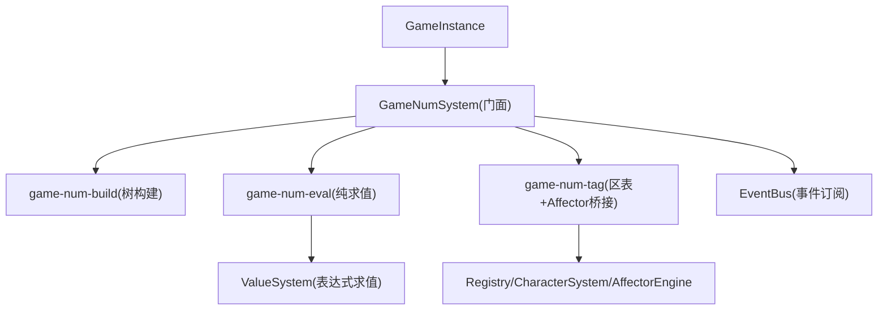
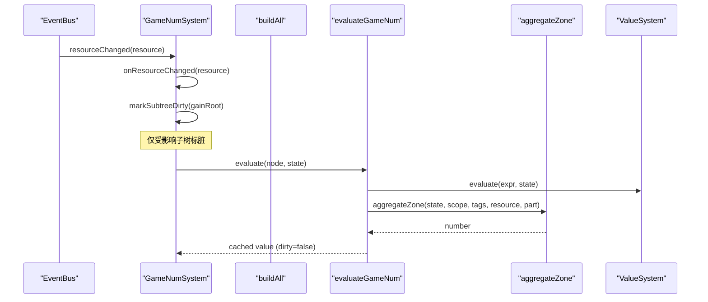
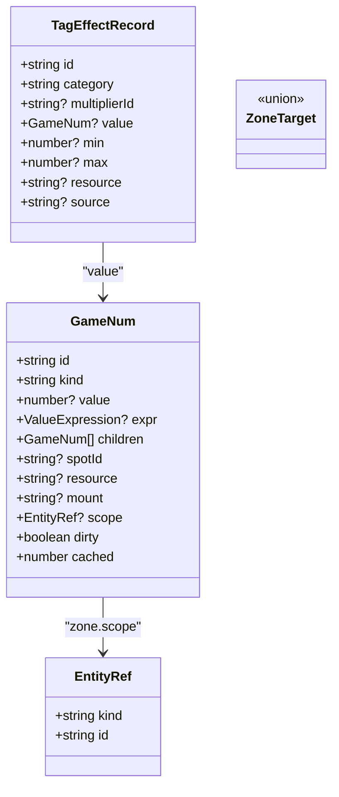
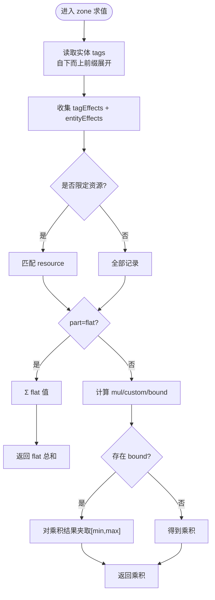
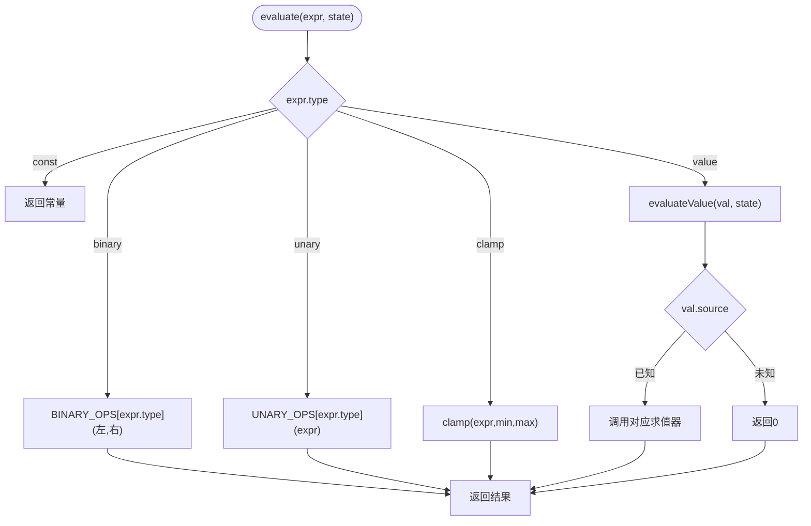
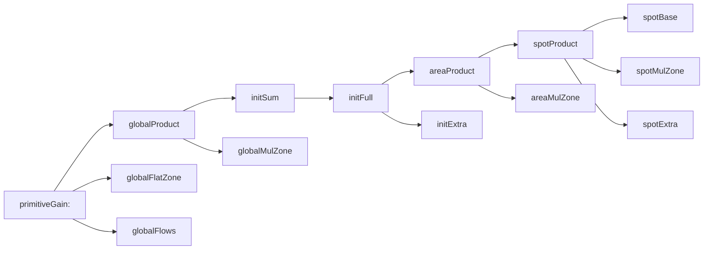
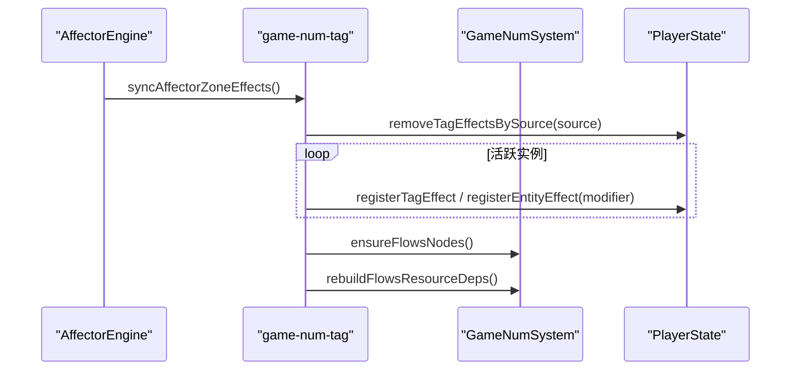
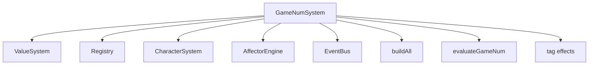

# 数值计算系统

<cite>
**本文引用的文件**
- [game-num.ts](file://src/engine/expression/game-num.ts)
- [game-num-eval.ts](file://src/engine/expression/game-num-eval.ts)
- [game-num-build.ts](file://src/engine/expression/game-num-build.ts)
- [game-num-tag.ts](file://src/engine/expression/game-num-tag.ts)
- [tag-effect.ts](file://src/engine/expression/tag-effect.ts)
- [value-system.ts](file://src/engine/expression/value-system.ts)
- [stat-dsl.ts](file://src/engine/expression/stat-dsl.ts)
- [game-instance.ts](file://src/engine/game-instance.ts)
- [game-num.test.ts](file://tests/engine/game-num.test.ts)
</cite>

## 目录
1. [简介](#简介)
2. [项目结构](#项目结构)
3. [核心组件](#核心组件)
4. [架构总览](#架构总览)
5. [详细组件分析](#详细组件分析)
6. [依赖关系分析](#依赖关系分析)
7. [性能与精度](#性能与精度)
8. [故障排查指南](#故障排查指南)
9. [结论](#结论)
10. [附录：游戏内应用示例](#附录游戏内应用示例)

## 简介
本技术文档面向 ACProgram 的 GameNumSystem 数值计算子系统，系统性阐述其设计目标、数据模型、运算规则、标签区表机制、表达式求值流程、缓存失效策略与性能优化点。同时覆盖数值标签系统的分类与管理方式，以及在游戏场景（属性计算、伤害公式、资源产出）中的实际应用，并提供精度控制、错误处理与调试工具的使用建议。

## 项目结构
GameNumSystem 位于 engine/expression 下，围绕“树构建 + 纯求值 + 标签区表 + 事件驱动失效”的职责进行拆分：
- game-num.ts：门面层，负责构造注入、事件订阅、状态维护、对外 API（构建/求值/资源清单等）。
- game-num-build.ts：显式层级树构建（Phase 6），按资源生成 primitiveGain 根节点，并建立 spot/area/init/global 四级层级关系与 flows 挂载。
- game-num-eval.ts：无副作用的纯求值器，实现 GameNum 节点语义（const/expr/add/sub/mul/owned/levelLinear/zone/affectorFlows），以及贡献分解 API。
- game-num-tag.ts：区表写入与 Affector 桥接，维护 state.tagEffects/entityEffects，提供定向失效与 flows 同步。
- tag-effect.ts：类型定义（TagEffectRecord、EntityRef、ZoneTarget、ZoneModifierDecl）与 tag 前缀展开工具。
- value-system.ts：ValueExpression 求值引擎，算子表驱动，source 注册表读取运行时数据。
- stat-dsl.ts：统计查询 DSL（用于 UI/诊断展示，非核心数值链路）。
- game-instance.ts：运行时装配入口，初始化时调用 gameNumSystem.buildAll，统一接入事件总线。

图表来源
- [game-instance.ts:176-196](file://src/engine/game-instance.ts#L176-L196)
- [game-num.ts:105-140](file://src/engine/expression/game-num.ts#L105-L140)
- [game-num-build.ts:27-56](file://src/engine/expression/game-num-build.ts#L27-L56)
- [game-num-eval.ts:172-211](file://src/engine/expression/game-num-eval.ts#L172-L211)
- [game-num-tag.ts:106-127](file://src/engine/expression/game-num-tag.ts#L106-L127)
- [value-system.ts:112-142](file://src/engine/expression/value-system.ts#L112-L142)

章节来源
- [game-instance.ts:176-196](file://src/engine/game-instance.ts#L176-L196)
- [game-num.ts:105-140](file://src/engine/expression/game-num.ts#L105-L140)

## 核心组件
- GameNumSystem（门面）：持有 gains、spotSubtrees、zoneIndex、parents、allNodes、zoneNodes、flowsNodeById、affectorFlowsNodes 等索引；监听 enhancement/spotTag/Level/manager/extra/resource/affector 生命周期事件，触发定向或全局失效；暴露 evaluate/evaluateWithBreakdown/getResources/evaluateResourceGain/evaluateSpotYield 等 API。
- 树构建（buildAll/buildResourceGain/buildSpotNode/buildInitNode/buildAreaNode）：为每个资源构建 primitiveGain 根节点，形成 globalProduct → initSum → areaBase → spotBase 的 base 链，并在每层插入对应 zone 乘区与 flat 区，以及 flows 节点挂载到 Extra 或根。
- 纯求值（evaluateGameNum/aggregateZone/evaluateAffectorFlowsNode）：递归求值 GameNum 节点；zone 节点统一通过 aggregateZone 聚合 state 表；affectorFlows 节点按 mount 过滤活跃实例并累加 flows 值。
- 区表与标签（registerTagEffect/registerEntityEffect/syncAffectorZoneEffects）：将 Affector 声明的 ZoneModifier 转为 TagEffectRecord 写入 state.tagEffects/entityEffects；支持按 tag 路径自下而上命中与实体精确键命中；支持 bound 上下限夹取。
- 表达式求值（ValueSystem.evaluate）：基于算子表与 source 注册表对 ValueExpression 求值，支持 const/value/add/sub/mul/min/max/pow/div/floor/ceil/round/clamp 等。

章节来源
- [game-num.ts:52-103](file://src/engine/expression/game-num.ts#L52-L103)
- [game-num-build.ts:27-56](file://src/engine/expression/game-num-build.ts#L27-L56)
- [game-num-eval.ts:117-169](file://src/engine/expression/game-num-eval.ts#L117-L169)
- [game-num-tag.ts:42-92](file://src/engine/expression/game-num-tag.ts#L42-L92)
- [value-system.ts:112-142](file://src/engine/expression/value-system.ts#L112-L142)

## 架构总览
GameNumSystem 采用“显式层级树 + 懒求值 + 事件驱动失效”的架构：
- 构建期：为每个资源生成一棵以 primitiveGain 为根的无环图（DAG），共享 spotProduct 节点作为上级 areaBase 的子节点，确保 base 链逐级连乘。
- 运行期：所有动态加成通过区表（state.tagEffects/entityEffects）表达，zone 节点求值走 aggregateZone 唯一路径；flows 由 Affector 动态挂载到层级 Extra 或 global 兜底。
- 失效策略：resourceChanged 触发定向失效（仅重算受该资源影响的子树）；enhancement/spotTag/Level/manager/extra/affector 变更触发全局或局部 markDirty；zone 节点通过 zoneIndex 反查标记。

图表来源
- [game-num.ts:149-161](file://src/engine/expression/game-num.ts#L149-L161)
- [game-num-eval.ts:172-211](file://src/engine/expression/game-num-eval.ts#L172-L211)
- [game-num-eval.ts:117-169](file://src/engine/expression/game-num-eval.ts#L117-L169)
- [value-system.ts:112-142](file://src/engine/expression/value-system.ts#L112-L142)

## 详细组件分析

### 数值类型系统与节点模型
- GameNum 节点类型：
  - 叶子：const、expr、owned、levelLinear、affectorFlows、zone
  - 组合：add、sub、mul（多叉，从左到右折叠）
- 节点级运行时字段：
  - dirty：是否需要重算
  - cached：上次求值结果（dirty=false 有效）
- 区表记录 TagEffectRecord：
  - category：flat/mul/custom/bound
  - multiplierId：自定义乘区分组标识
  - value：数字或 GameNum（expr/const）
  - resource：限定作用资源（缺省作用于所有资源）
  - min/max：bound 类上下限
  - source：撤销用来源标识

图表来源
- [game-num-eval.ts:45-52](file://src/engine/expression/game-num-eval.ts#L45-L52)
- [tag-effect.ts:13-28](file://src/engine/expression/tag-effect.ts#L13-L28)
- [tag-effect.ts:30-44](file://src/engine/expression/tag-effect.ts#L30-L44)

章节来源
- [game-num-eval.ts:45-52](file://src/engine/expression/game-num-eval.ts#L45-L52)
- [tag-effect.ts:13-28](file://src/engine/expression/tag-effect.ts#L13-L28)

### 运算规则与区表聚合
- flat：直接求和 Σv
- mul（默认乘区）：1 + Σ(f-1)，即百分比叠加
- custom：按 multiplierId 分组，组内连乘 Πv，组间连乘
- bound：对最终乘积结果进行上下限夹取
- zone 节点求值唯一路径：aggregateZone，从 state.tagEffects/entityEffects 聚合，保证“唯一真相”。

图表来源
- [game-num-eval.ts:117-169](file://src/engine/expression/game-num-eval.ts#L117-L169)

章节来源
- [game-num-eval.ts:117-169](file://src/engine/expression/game-num-eval.ts#L117-L169)

### 表达式求值与算子扩展
- ValueSystem.evaluate 支持：
  - 二元算子：add/sub/mul/min/max/pow/div（除零保护）
  - 一元算子：floor/ceil/round
  - 范围限制：clamp
  - 数据源：const/value（res/spotLevel/areaSpotCount/managerCount/data/funclet）
- 未知 source 安全回落 0，保持向后兼容。

图表来源
- [value-system.ts:112-142](file://src/engine/expression/value-system.ts#L112-L142)
- [value-system.ts:33-86](file://src/engine/expression/value-system.ts#L33-L86)

章节来源
- [value-system.ts:112-142](file://src/engine/expression/value-system.ts#L112-L142)

### 树构建与层级视图（Phase 6）
- 每资源一棵 primitiveGain 根，包含：
  - globalProduct = (Σ initFull) × globalMulZone
  - globalFlatZone
  - globalFlows
- initFull = (Σ areaProduct) × initMulZone + initExtra
- areaFull = (Σ spotProduct) × areaMulZone + areaExtra
- spotFull = spotBase × spotMulZone + spotExtra
- spotBase = owned × (base + levelLinear)
- flows 节点按 mount 分发：spot/area/init → 对应 Extra；否则 → global 兜底
- 共享 spotProduct 节点作为上级 areaBase 的子节点，避免重复计算

图表来源
- [game-num-build.ts:62-95](file://src/engine/expression/game-num-build.ts#L62-L95)
- [game-num-build.ts:97-169](file://src/engine/expression/game-num-build.ts#L97-L169)
- [game-num-build.ts:176-241](file://src/engine/expression/game-num-build.ts#L176-L241)

章节来源
- [game-num-build.ts:62-95](file://src/engine/expression/game-num-build.ts#L62-L95)
- [game-num-build.ts:97-169](file://src/engine/expression/game-num-build.ts#L97-L169)
- [game-num-build.ts:176-241](file://src/engine/expression/game-num-build.ts#L176-L241)

### 标签系统与区表管理
- 标签路径自下而上前缀展开，父统辖子，确保更具体的 tag 优先命中。
- 支持按 tagKey 与 entityKey 两种路由登记效果；entityKey 支持通配符 '*' 批量命中。
- Affector 桥接：
  - 同步活跃实例的 zoneModifiers 到 state.tagEffects/entityEffects
  - 移除不再活跃的 source 记录
  - 重建 flows 节点与 flows 资源依赖表

图表来源
- [game-num-tag.ts:106-127](file://src/engine/expression/game-num-tag.ts#L106-L127)
- [game-num-tag.ts:150-176](file://src/engine/expression/game-num-tag.ts#L150-L176)

章节来源
- [game-num-tag.ts:106-127](file://src/engine/expression/game-num-tag.ts#L106-L127)
- [game-num-tag.ts:150-176](file://src/engine/expression/game-num-tag.ts#L150-L176)

### 依赖解析、缓存与性能优化
- 依赖解析：
  - 静态扫描 ValueExpression 中 source='res' 的资源依赖，生成 gainResourceDeps
  - 区记录 value 的 expr 依赖累积到 zoneKeyResourceDeps
  - flows 节点的 expr 依赖在 syncAffectorZoneEffects 时重建 flowsResourceDeps
- 缓存策略：
  - 节点级 dirty/cached 字段，lazy 求值
  - resourceChanged 定向失效：仅对受该资源影响子树 markSubtreeDirty
  - zone 变更通过 zoneIndex 反查并沿 parents 传播 markDirty
- 性能要点：
  - 共享 spotProduct 节点减少重复计算
  - flows 节点按需创建与挂载，避免空树膨胀
  - 除零保护与 clamp 防止异常值扩散

章节来源
- [game-num-build.ts:377-445](file://src/engine/expression/game-num-build.ts#L377-L445)
- [game-num-tag.ts:26-40](file://src/engine/expression/game-num-tag.ts#L26-L40)
- [game-num-tag.ts:129-148](file://src/engine/expression/game-num-tag.ts#L129-L148)
- [game-num-eval.ts:172-180](file://src/engine/expression/game-num-eval.ts#L172-L180)

## 依赖关系分析
- GameNumSystem 依赖：
  - ValueSystem：表达式求值
  - Registry：实体定义与 effectiveSpotTags
  - CharacterSystem：角色标签加成（如 managerBonus）
  - AffectorEngine：活跃实例与 pack 信息
  - EventBus：事件订阅（增强、区域标签、等级、管理器、额外项、资源、Affector 生命周期）
- 模块耦合：
  - build 与 eval 解耦：eval 不感知构建细节，只消费 GameNum 节点
  - tag 与 eval 解耦：tag 只写 state 表，eval 读 state 表
  - 事件驱动失效：降低全局重算成本

图表来源
- [game-num.ts:17-28](file://src/engine/expression/game-num.ts#L17-L28)
- [game-instance.ts:176-196](file://src/engine/game-instance.ts#L176-L196)

章节来源
- [game-num.ts:17-28](file://src/engine/expression/game-num.ts#L17-L28)
- [game-instance.ts:176-196](file://src/engine/game-instance.ts#L176-L196)

## 性能与精度
- 性能
  - 懒求值与节点缓存：仅在 dirty=true 时重算，避免每帧全量计算
  - 定向失效：resourceChanged 仅影响相关子树，提升高频资源更新时的吞吐
  - 共享节点：spotProduct 被多级复用，减少重复计算
  - flows 按需挂载：只在有活跃实例时创建 flows 节点
- 精度
  - 表达式层提供 floor/ceil/round 控制取整行为
  - clamp 可限制中间结果范围，避免溢出或极端值
  - 除零保护：div 操作分母为 0 时返回 0，避免 NaN/Inf 污染
  - 区表 bound：对乘区结果进行上下限夹取，保证数值稳定

章节来源
- [value-system.ts:112-142](file://src/engine/expression/value-system.ts#L112-L142)
- [game-num-eval.ts:117-169](file://src/engine/expression/game-num-eval.ts#L117-L169)

## 故障排查指南
- 常见问题定位
  - 资源变更后未生效：检查 resourceChanged 事件是否触发，确认 gainResourceDeps 是否包含该资源
  - 强化解锁/移除后产出不变：确认 enhancementAdded/Removed 事件已触发，zoneIndex 与 flows 节点已重建
  - spot 标签变化导致区表命中异常：确认 effectiveSpotTags 已更新，rebuildZoneIndex 已调用
- 调试工具
  - evaluateWithBreakdown：获取贡献明细，便于 tooltip 展示 base×强化=结果
  - devLog：通过 GameInstance.getDevLogs 查看引擎日志
  - 单元测试：参考 tests/engine/game-num.test.ts 验证各分支行为

章节来源
- [game-num.ts:233-238](file://src/engine/expression/game-num.ts#L233-L238)
- [game-instance.ts:147-148](file://src/engine/game-instance.ts#L147-L148)
- [game-num.test.ts:212-235](file://tests/engine/game-num.test.ts#L212-L235)

## 结论
GameNumSystem 通过显式层级树、区表聚合与事件驱动失效，实现了高性能、可扩展且可调试的数值计算框架。其设计将“构建期结构”与“运行期求值”清晰分离，借助标签系统与 Affector 桥接实现动态加成，并通过依赖扫描与定向失效保障性能。配合表达式求值器的丰富算子与精度控制手段，能够灵活支撑游戏中的属性计算、伤害公式与资源产出等复杂场景。

## 附录：游戏内应用示例
- 资源产出：通过 evaluateResourceGain 计算每秒产出，tick-system 遍历 resources 并累加
- 属性计算：利用 zone 乘区与 flat 区组合，叠加基础属性与临时增益
- 伤害公式：使用 ValueExpression 的 clamp/min/max 控制伤害区间，结合 bound 区表限制上限
- 统计展示：使用 stat-dsl 查询 produced/consumed/unlocked 等指标，辅助 UI 反馈

章节来源
- [game-num.ts:244-259](file://src/engine/expression/game-num.ts#L244-L259)
- [stat-dsl.ts:25-63](file://src/engine/expression/stat-dsl.ts#L25-L63)
- [game-num.test.ts:84-133](file://tests/engine/game-num.test.ts#L84-L133)