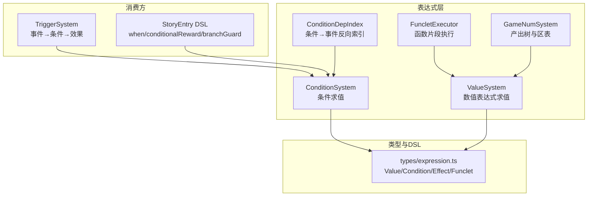
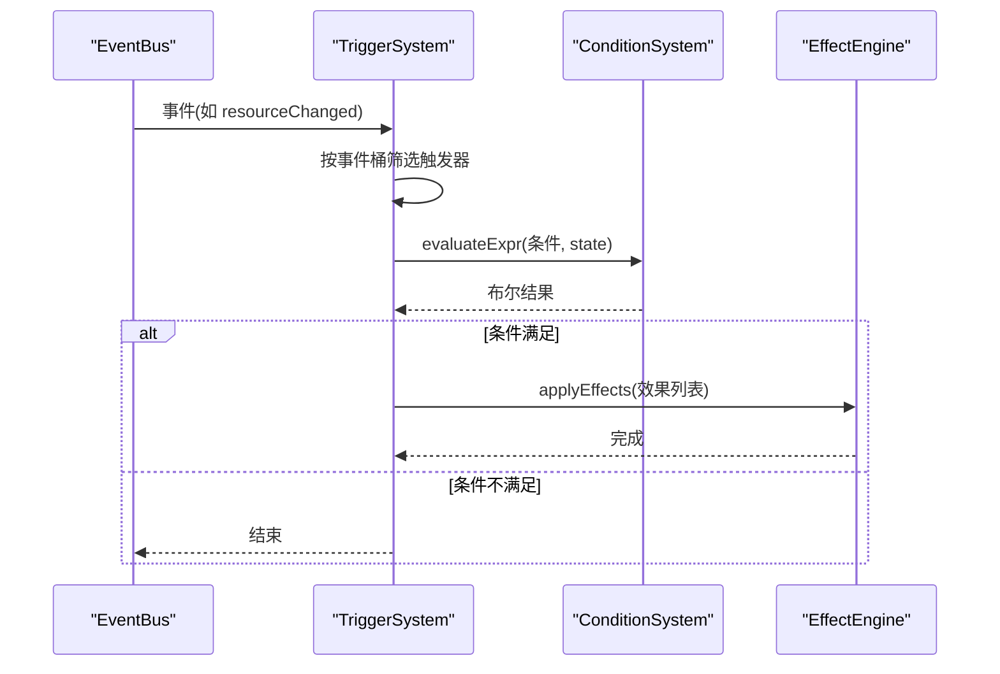
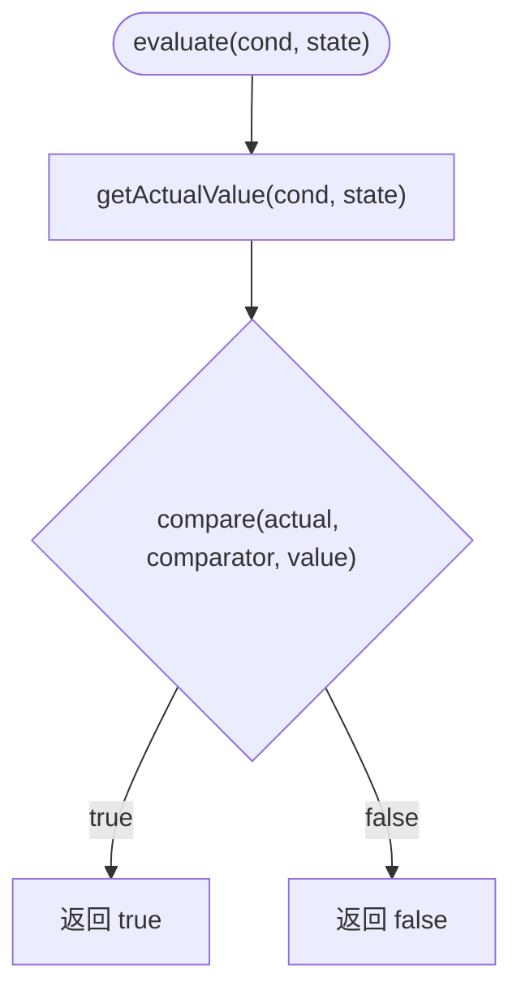
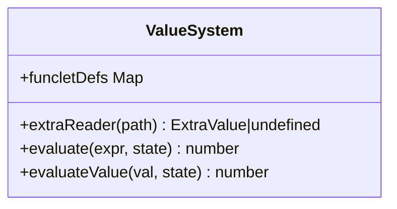
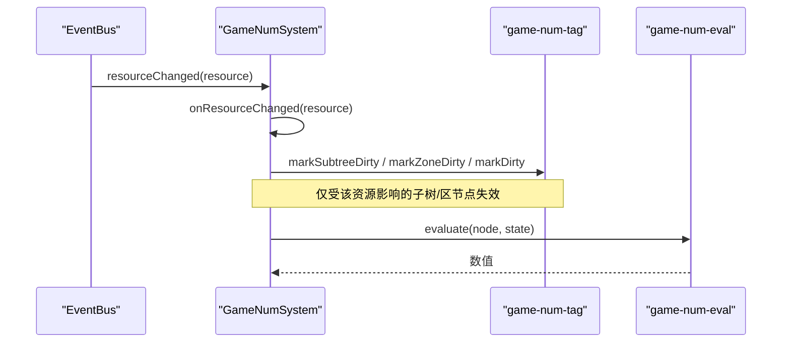
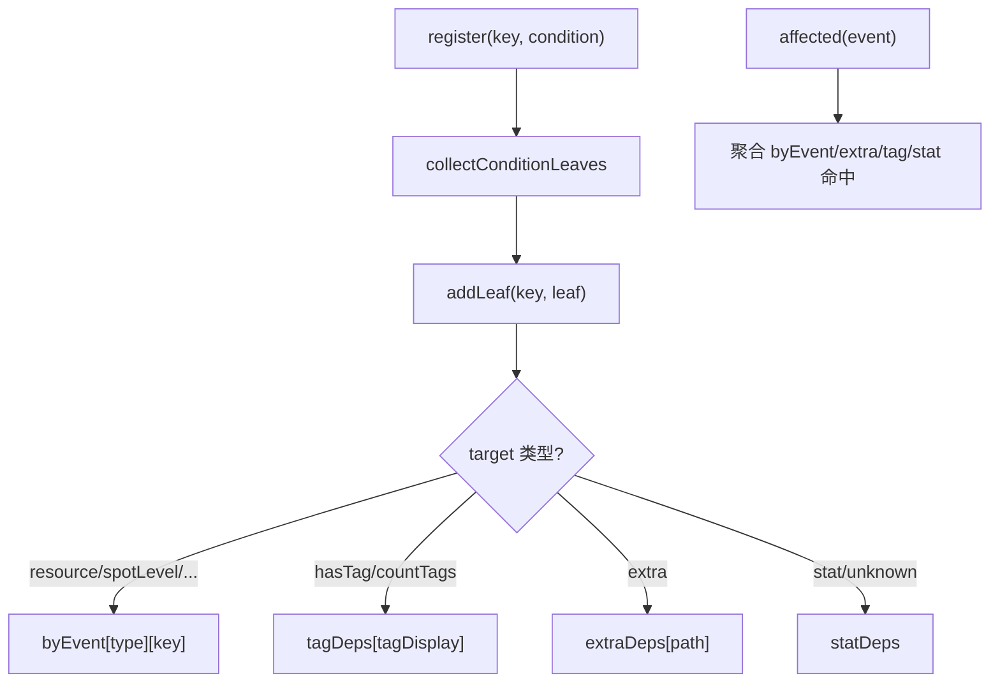
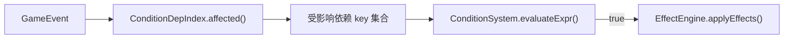

# 条件判断系统

<cite>
**本文引用的文件**
- [condition-system.ts](file://src/engine/expression/condition-system.ts)
- [condition-deps.ts](file://src/engine/expression/condition-deps.ts)
- [game-num.ts](file://src/engine/expression/game-num.ts)
- [value-system.ts](file://src/engine/expression/value-system.ts)
- [funclet-executor.ts](file://src/engine/expression/funclet-executor.ts)
- [expression.ts](file://src/engine/types/expression.ts)
- [trigger-system.ts](file://src/engine/effect/trigger-system.ts)
- [story-entry.ts](file://src/engine/def-factory/story-entry.ts)
- [stories.ts](file://src/data/base/stories.ts)
- [condition-system.test.ts](file://tests/engine/condition-system.test.ts)
</cite>

## 目录
1. [简介](#简介)
2. [项目结构](#项目结构)
3. [核心组件](#核心组件)
4. [架构总览](#架构总览)
5. [详细组件分析](#详细组件分析)
6. [依赖关系与事件化失效](#依赖关系与事件化失效)
7. [性能考量](#性能考量)
8. [调试与排错指南](#调试与排错指南)
9. [结论](#结论)
10. [附录：编写指南与最佳实践](#附录编写指南与最佳实践)

## 简介
本技术文档面向 ACProgram 的条件判断系统，系统性阐述 ConditionSystem 的实现架构、条件表达式解析、依赖关系分析与缓存机制；解释条件表达式的语法结构（布尔运算、比较操作、函数调用）；文档化条件依赖追踪系统，说明如何分析条件中的资源依赖并进行优化；提供条件表达式的编写指南与最佳实践；包含性能考虑、调试方法与常见问题解决方案；并展示如何在游戏逻辑中使用条件系统进行分支控制。

## 项目结构
条件系统位于 engine/expression 子模块，围绕“条件求值”和“数值表达式求值”两大主题展开，并与触发器系统、故事入口等上层逻辑紧密协作。

图表来源
- [condition-system.ts:1-137](file://src/engine/expression/condition-system.ts#L1-L137)
- [value-system.ts:1-150](file://src/engine/expression/value-system.ts#L1-L150)
- [funclet-executor.ts:1-45](file://src/engine/expression/funclet-executor.ts#L1-L45)
- [game-num.ts:1-262](file://src/engine/expression/game-num.ts#L1-L262)
- [condition-deps.ts:1-220](file://src/engine/expression/condition-deps.ts#L1-L220)
- [expression.ts:1-263](file://src/engine/types/expression.ts#L1-L263)
- [trigger-system.ts:1-203](file://src/engine/effect/trigger-system.ts#L1-L203)
- [story-entry.ts:36-63](file://src/engine/def-factory/story-entry.ts#L36-L63)

章节来源
- [condition-system.ts:1-137](file://src/engine/expression/condition-system.ts#L1-L137)
- [value-system.ts:1-150](file://src/engine/expression/value-system.ts#L1-L150)
- [expression.ts:1-263](file://src/engine/types/expression.ts#L1-L263)

## 核心组件
- ConditionSystem：负责单条原子条件与条件组的求值，支持多种 target（资源、区域等级、管理器、标记、增强、标签、统计、剧情阅读状态、Extra、原型统计、当前区域等），并通过注入的读取器访问外部数据。
- ValueSystem：对 ValueExpression 进行递归求值，支持常量、资源、区域等级、区域计数、管理器计数、函数片段调用、Extra 读取，以及二元/一元算子和区间夹取。
- FuncletExecutor：执行 Funclet 调用，将参数注入 flags 后交由 ValueSystem 计算。
- GameNumSystem：维护产出树与区表，订阅事件实现定向失效与增量重建，为条件中 stat/tagCount 等目标提供数据支撑。
- ConditionDepIndex：构建“条件叶子 → 事件”的反向依赖索引，用于在事件发生时精准定位受影响的条件依赖集合，避免全量重估。

章节来源
- [condition-system.ts:1-137](file://src/engine/expression/condition-system.ts#L1-L137)
- [value-system.ts:1-150](file://src/engine/expression/value-system.ts#L1-L150)
- [funclet-executor.ts:1-45](file://src/engine/expression/funclet-executor.ts#L1-L45)
- [game-num.ts:1-262](file://src/engine/expression/game-num.ts#L1-L262)
- [condition-deps.ts:1-220](file://src/engine/expression/condition-deps.ts#L1-L220)

## 架构总览
条件系统采用“声明式条件 + 事件驱动 + 依赖索引”的架构：
- 声明式：条件以 Condition/ConditionGroup 表示，由 ConditionSystem 统一求值。
- 事件驱动：TriggerSystem 监听特定事件，命中后通过 ConditionSystem 评估条件，再交给 EffectEngine 执行效果。
- 依赖索引：ConditionDepIndex 将条件叶子映射到事件键，事件发生时仅对受影响依赖进行失效与重算。

图表来源
- [trigger-system.ts:125-143](file://src/engine/effect/trigger-system.ts#L125-L143)
- [condition-system.ts:96-120](file://src/engine/expression/condition-system.ts#L96-L120)

章节来源
- [trigger-system.ts:1-203](file://src/engine/effect/trigger-system.ts#L1-L203)
- [condition-system.ts:96-120](file://src/engine/expression/condition-system.ts#L96-L120)

## 详细组件分析

### ConditionSystem：条件求值引擎
- 目标求值器注册表：每个 ConditionTarget 对应一个 TargetEvaluator，从 PlayerState 或注入依赖读取 actual 数值。
- 比较器：支持 ==、!=、>=、<=、>、<，未知比较器返回 false。
- 条件组：AND/OR 递归求值，短路语义由 every/some 保证。
- 注入依赖：tagIndex、statReader、storyRunChecker、storyChainChecker、extraReader、tagCountReader 等，供外部子系统注入。

图表来源
- [condition-system.ts:96-135](file://src/engine/expression/condition-system.ts#L96-L135)

章节来源
- [condition-system.ts:1-137](file://src/engine/expression/condition-system.ts#L1-L137)

### ValueSystem：数值表达式求值
- 算子表驱动：BINARY_OPS（add/sub/mul/div/min/max/pow）、UNARY_OPS（floor/ceil/round）。
- 源求值器：const、res、spotLevel、areaSpotCount、managerCount、data（Extra 视图）、funclet（函数片段）。
- 安全除法：除零时返回 0。
- 区间夹取：clamp(expr, min, max)。

图表来源
- [value-system.ts:1-150](file://src/engine/expression/value-system.ts#L1-L150)

章节来源
- [value-system.ts:1-150](file://src/engine/expression/value-system.ts#L1-L150)

### FuncletExecutor：函数片段执行
- 将调用参数注入 flags，复用 ValueSystem 的 data/res/spotLevel 等能力组合复杂计算。
- 适合封装可复用的数值公式，便于配置与测试。

章节来源
- [funclet-executor.ts:1-45](file://src/engine/expression/funclet-executor.ts#L1-L45)

### GameNumSystem：产出树与区表
- 维护 gains、spotSubtrees、zoneIndex、parents/allNodes/zoneNodes 等索引。
- 事件订阅：enhancementAdded/Removed、spotTagChanged、spotLevelChanged、managerChanged、extraChanged、resourceChanged、affector 生命周期事件。
- 定向失效：onResourceChanged 根据静态依赖与 flows 依赖精确标记脏节点，避免整表重建。
- 对外接口：buildAll、evaluate、evaluateWithBreakdown、evaluateResourceGain、evaluateSpotYield 等。

图表来源
- [game-num.ts:105-173](file://src/engine/expression/game-num.ts#L105-L173)
- [game-num.ts:149-161](file://src/engine/expression/game-num.ts#L149-L161)

章节来源
- [game-num.ts:1-262](file://src/engine/expression/game-num.ts#L1-L262)

### 条件依赖追踪：ConditionDepIndex
- 收集条件叶子：collectConditionLeaves 将 AND/OR 树展平为原子条件。
- 事件实体键：eventEntityKeyOf 提取事件携带的实体 key（如 resource、spotId、flag 等）。
- 反向索引：byEvent、extraDeps、tagDeps、statDeps，支持精确命中与宽依赖降级。
- affected(event)：返回需失效的全部依赖方 key 集合，含 extra 路径前缀双向匹配、tag 变化、stat 宽依赖。

图表来源
- [condition-deps.ts:38-148](file://src/engine/expression/condition-deps.ts#L38-L148)
- [condition-deps.ts:150-219](file://src/engine/expression/condition-deps.ts#L150-L219)

章节来源
- [condition-deps.ts:1-220](file://src/engine/expression/condition-deps.ts#L1-L220)

## 依赖关系与事件化失效
- 事件类型全集：CONDITION_DEP_EVENT_TYPES 汇总所有可能影响条件的 GameEvent 类型，构造期分桶订阅。
- 宽依赖策略：stat 及未知 target 归入 statDeps，在非每帧事件中触发失效，避免高频轮询。
- 精确命中：resourceChanged、spotLevelChanged、flagChanged、extraChanged、spotTagChanged、tagCollectedChanged 等事件均可精确命中相关依赖。
- 与 TriggerSystem 集成：触发器在事件命中后调用 ConditionSystem.evaluateExpr 进行条件评估，满足则执行效果。

图表来源
- [condition-deps.ts:26-36](file://src/engine/expression/condition-deps.ts#L26-L36)
- [condition-deps.ts:108-148](file://src/engine/expression/condition-deps.ts#L108-L148)
- [trigger-system.ts:125-143](file://src/engine/effect/trigger-system.ts#L125-L143)

章节来源
- [condition-deps.ts:1-220](file://src/engine/expression/condition-deps.ts#L1-L220)
- [trigger-system.ts:1-203](file://src/engine/effect/trigger-system.ts#L1-L203)

## 性能考量
- 条件求值 O(1) 查找：TARGET_EVALUATORS 与 COMPARATORS 使用 Record 直接索引，常数时间。
- 条件组短路：AND/OR 使用 every/some，提前终止。
- 依赖索引减少重算：ConditionDepIndex 将条件叶子映射到事件，事件发生时仅对受影响依赖进行失效与重算。
- 产出树定向失效：GameNumSystem.onResourceChanged 基于 gainResourceDeps、zoneKeyResourceDeps、affectorFlowsNodes 精确标记脏节点，避免整表重建。
- 事件分桶：TriggerSystem 按事件类型分桶，避免 O(事件×触发器) 全扫描。

[本节为通用性能讨论，无需具体文件引用]

## 调试与排错指南
- 常见错误与处理
  - 未知 comparator：compare 未命中时返回 false，不会抛异常。可通过单元测试验证行为。
  - 未知 target：TARGET_EVALUATORS 缺失时 getActualValue 返回 0，保持默认语义。
  - 除零保护：ValueSystem 的 div 在除数为 0 时返回 0，避免运行时异常。
- 调试建议
  - 使用 evaluateExpr 同时支持原子条件与条件组，便于逐步验证复杂表达式。
  - 借助 ConditionDepIndex 的 affected 方法，定位某事件影响哪些条件依赖。
  - 结合 GameNumSystem 的 evaluateWithBreakdown 查看贡献分解，辅助定位产出异常。
- 测试参考
  - 覆盖资源、区域等级、管理器、标记、增强、标签、Extra、统计、剧情阅读状态等场景。
  - 验证 AND/OR 嵌套、未知比较器、Extra 缺失与布尔转数值等边界情况。

章节来源
- [condition-system.ts:122-135](file://src/engine/expression/condition-system.ts#L122-L135)
- [value-system.ts:127-130](file://src/engine/expression/value-system.ts#L127-L130)
- [condition-system.test.ts:116-163](file://tests/engine/condition-system.test.ts#L116-L163)

## 结论
ACProgram 的条件判断系统以 ConditionSystem 为核心，配合 ValueSystem、FuncletExecutor、GameNumSystem 与 ConditionDepIndex，实现了声明式条件、事件驱动与依赖索引的高效求值。通过精确的事件命中与定向失效，系统在大规模条件下仍保持良好性能；同时提供丰富的 target 与表达式能力，满足复杂的游戏逻辑需求。

[本节为总结性内容，无需具体文件引用]

## 附录：编写指南与最佳实践
- 条件表达式语法
  - 布尔运算：使用 ConditionGroup 的 AND/OR 组合多个原子条件。
  - 比较操作：==、!=、>=、<=、>、<，注意数值语义与 Extra 的 toNumber 规则。
  - 函数调用：通过 funclet 定义可复用公式，参数以 flags 注入，便于组合 res/spotLevel/areaSpotCount/managerCount/data 等源。
- 依赖与优化
  - 优先使用精确 target（resource、spotLevel、flag、extra 等），避免落入 stat 宽依赖导致非每帧失效。
  - 合理使用 tagCount/hasTag，利用 registry 的层级标签索引提升效率。
  - 对于 stat 类条件，理解其宽依赖特性，必要时拆分条件以减少不必要重算。
- 在游戏逻辑中使用
  - 触发器：在 TriggerDef 中声明 on 事件与 condition，满足后执行 effects。
  - 故事分支：使用 StoryEntry DSL 的 when/conditionalReward/branchGuard 进行剧情分支控制与奖励发放。
  - 示例参考：
    - 使用 visitedStoryInChain 判定是否走过某分支，给予差异化奖励。
    - 使用 hasReadStory 实现跨 Run 的渐进解锁。
    - 使用 conditionalReward 与 and/or 组合多条件奖励。

章节来源
- [trigger-system.ts:1-203](file://src/engine/effect/trigger-system.ts#L1-L203)
- [story-entry.ts:36-63](file://src/engine/def-factory/story-entry.ts#L36-L63)
- [stories.ts:60-85](file://src/data/base/stories.ts#L60-L85)
- [expression.ts:41-86](file://src/engine/types/expression.ts#L41-L86)
- [value-system.ts:10-86](file://src/engine/expression/value-system.ts#L10-L86)