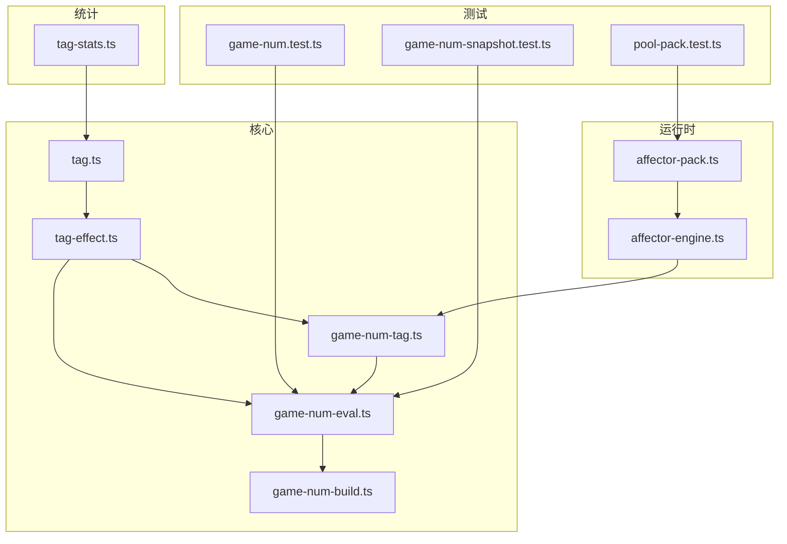
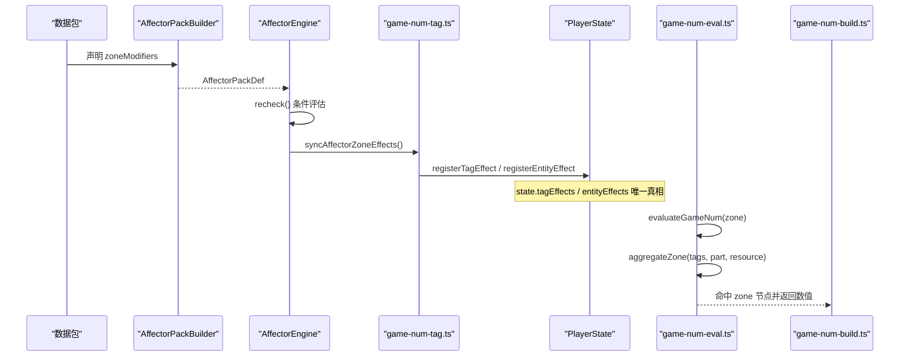
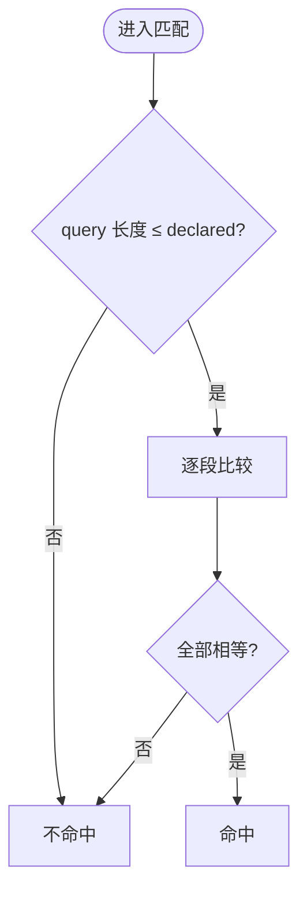
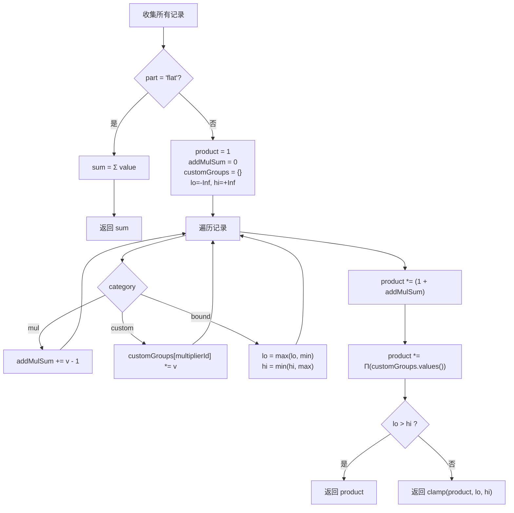
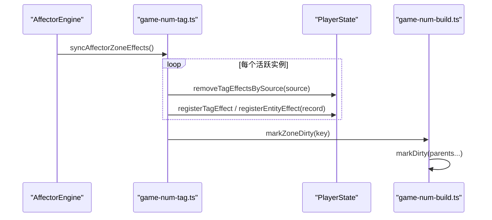
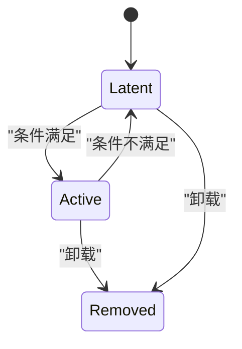
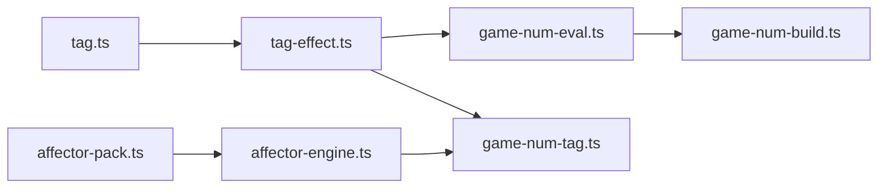

# 标签效果系统

<cite>
**本文引用的文件**
- [src/engine/core/tag.ts](file://src/engine/core/tag.ts)
- [src/engine/expression/tag-effect.ts](file://src/engine/expression/tag-effect.ts)
- [src/engine/expression/game-num-tag.ts](file://src/engine/expression/game-num-tag.ts)
- [src/engine/expression/game-num-eval.ts](file://src/engine/expression/game-num-eval.ts)
- [src/engine/expression/game-num-build.ts](file://src/engine/expression/game-num-build.ts)
- [src/engine/effect/affector-engine.ts](file://src/engine/effect/affector-engine.ts)
- [src/engine/def-factory/affector-pack.ts](file://src/engine/def-factory/affector-pack.ts)
- [src/engine/stats/tag-stats.ts](file://src/engine/stats/tag-stats.ts)
- [tests/engine/game-num.test.ts](file://tests/engine/game-num.test.ts)
- [tests/engine/game-num-snapshot.test.ts](file://tests/engine/game-num-snapshot.test.ts)
- [tests/engine/def-factory/pool-pack.test.ts](file://tests/engine/def-factory/pool-pack.test.ts)
</cite>

## 目录
1. [简介](#简介)
2. [项目结构](#项目结构)
3. [核心组件](#核心组件)
4. [架构总览](#架构总览)
5. [详细组件分析](#详细组件分析)
6. [依赖关系分析](#依赖关系分析)
7. [性能考量](#性能考量)
8. [故障排查指南](#故障排查指南)
9. [结论](#结论)
10. [附录：配置与使用示例](#附录：配置与使用示例)

## 简介
本技术文档围绕 ACProgram 的“标签效果系统”展开，系统化说明如何通过“标签（Tag）”为数值添加动态效果与属性。该系统以“区（Zone）”为核心抽象，将增益、减益、状态限制等效果统一建模为 TagEffectRecord，并通过 Affector 系统在运行时挂载、撤销与同步到 GameNum 求值树中，最终影响资源产出与数值计算。

重点覆盖：
- 标签与层级匹配机制
- 标签效果的类型系统与合并语义（flat/mul/custom/bound）
- 注册机制、优先级与冲突解决策略
- 生命周期管理（激活沿、每 tick、flows、zoneModifiers）
- 与数值计算、条件判断、事件系统的集成
- 配置方法、使用示例、调试技巧与性能优化建议

## 项目结构
标签效果系统横跨多个子系统：
- 核心标签工具：tag.ts
- 效果模型与聚合：tag-effect.ts、game-num-eval.ts
- 写入与桥接：game-num-tag.ts
- 构建与索引：game-num-build.ts
- 运行时挂载与事件驱动：affector-engine.ts
- 数据定义构造器：affector-pack.ts
- 统计视图：tag-stats.ts
- 测试用例：game-num*.test.ts、pool-pack.test.ts

图表来源
- [src/engine/core/tag.ts:1-41](file://src/engine/core/tag.ts#L1-L41)
- [src/engine/expression/tag-effect.ts:1-75](file://src/engine/expression/tag-effect.ts#L1-L75)
- [src/engine/expression/game-num-eval.ts:1-292](file://src/engine/expression/game-num-eval.ts#L1-L292)
- [src/engine/expression/game-num-build.ts:1-446](file://src/engine/expression/game-num-build.ts#L1-L446)
- [src/engine/expression/game-num-tag.ts:1-220](file://src/engine/expression/game-num-tag.ts#L1-L220)
- [src/engine/effect/affector-engine.ts:1-444](file://src/engine/effect/affector-engine.ts#L1-L444)
- [src/engine/def-factory/affector-pack.ts:1-96](file://src/engine/def-factory/affector-pack.ts#L1-L96)
- [src/engine/stats/tag-stats.ts:1-275](file://src/engine/stats/tag-stats.ts#L1-L275)
- [tests/engine/game-num.test.ts:270-316](file://tests/engine/game-num.test.ts#L270-L316)
- [tests/engine/game-num-snapshot.test.ts:123-284](file://tests/engine/game-num-snapshot.test.ts#L123-L284)
- [tests/engine/def-factory/pool-pack.test.ts:74-97](file://tests/engine/def-factory/pool-pack.test.ts#L74-L97)

章节来源
- [src/engine/core/tag.ts:1-41](file://src/engine/core/tag.ts#L1-L41)
- [src/engine/expression/tag-effect.ts:1-75](file://src/engine/expression/tag-effect.ts#L1-L75)
- [src/engine/expression/game-num-eval.ts:1-292](file://src/engine/expression/game-num-eval.ts#L1-L292)
- [src/engine/expression/game-num-build.ts:1-446](file://src/engine/expression/game-num-build.ts#L1-L446)
- [src/engine/expression/game-num-tag.ts:1-220](file://src/engine/expression/game-num-tag.ts#L1-L220)
- [src/engine/effect/affector-engine.ts:1-444](file://src/engine/effect/affector-engine.ts#L1-L444)
- [src/engine/def-factory/affector-pack.ts:1-96](file://src/engine/def-factory/affector-pack.ts#L1-L96)
- [src/engine/stats/tag-stats.ts:1-275](file://src/engine/stats/tag-stats.ts#L1-L275)
- [tests/engine/game-num.test.ts:270-316](file://tests/engine/game-num.test.ts#L270-L316)
- [tests/engine/game-num-snapshot.test.ts:123-284](file://tests/engine/game-num-snapshot.test.ts#L123-L284)
- [tests/engine/def-factory/pool-pack.test.ts:74-97](file://tests/engine/def-factory/pool-pack.test.ts#L74-L97)

## 核心组件
- 标签与路径：提供 tagId、parseTagId、matchesTag、tagDisplay 等工具，支持层级前缀匹配与展示。
- 效果记录与目标：TagEffectRecord 描述一条效果；EntityRef/ZoneTarget 指定作用范围（按 tag 或实体）。
- 区聚合与求值：aggregateZone 实现 flat/mul/custom/bound 四类合并；GameNum 节点 lazy 求值与缓存。
- 写入与失效：registerTagEffect/registerEntityEffect/remove* 维护 state.tagEffects/entityEffects，并标记脏位。
- 运行时桥接：AffectorEngine 管理实例生命周期，将 zoneModifiers 同步到 GameNum 区表。
- 构建与索引：buildAll 构建层级资源树，buildZoneNode 生成 zone 节点，rebuildZoneIndex 建立 tag→zone 的反向索引。
- 统计视图：TagStatService 维护 declared/collected 倒排索引，响应事件增量更新。

章节来源
- [src/engine/core/tag.ts:1-41](file://src/engine/core/tag.ts#L1-L41)
- [src/engine/expression/tag-effect.ts:1-75](file://src/engine/expression/tag-effect.ts#L1-L75)
- [src/engine/expression/game-num-eval.ts:104-169](file://src/engine/expression/game-num-eval.ts#L104-L169)
- [src/engine/expression/game-num-tag.ts:42-92](file://src/engine/expression/game-num-tag.ts#L42-L92)
- [src/engine/expression/game-num-build.ts:27-95](file://src/engine/expression/game-num-build.ts#L27-L95)
- [src/engine/effect/affector-engine.ts:128-230](file://src/engine/effect/affector-engine.ts#L128-L230)
- [src/engine/stats/tag-stats.ts:50-118](file://src/engine/stats/tag-stats.ts#L50-L118)

## 架构总览
标签效果系统由“声明—挂载—求值—失效”四阶段组成：
- 声明：数据包通过 AffectorPackBuilder 声明 zoneModifiers（modTag/modEntity），形成 ZoneModifierDecl。
- 挂载：AffectorEngine 根据条件评估实例状态，Active 时调用 syncAffectorZoneEffects 将修饰器写入 state.tagEffects/entityEffects。
- 求值：GameNum 节点在 evaluateGameNum 中遇到 zone 节点时调用 aggregateZone，自下而上展开实体 tags，读取 state 表聚合结果。
- 失效：写入后通过 markZoneDirty/markSubtreeDirty 标记相关节点 dirty，下次求值时重算。

图表来源
- [src/engine/def-factory/affector-pack.ts:21-74](file://src/engine/def-factory/affector-pack.ts#L21-L74)
- [src/engine/effect/affector-engine.ts:188-230](file://src/engine/effect/affector-engine.ts#L188-L230)
- [src/engine/expression/game-num-tag.ts:106-127](file://src/engine/expression/game-num-tag.ts#L106-L127)
- [src/engine/expression/game-num-eval.ts:171-180](file://src/engine/expression/game-num-eval.ts#L171-L180)
- [src/engine/expression/game-num-build.ts:311-346](file://src/engine/expression/game-num-build.ts#L311-L346)

## 详细组件分析

### 标签与层级匹配
- 完整标签 ID 形如 base:tag:parent/child，存储用路径数组，解析/匹配支持父级前缀命中。
- matchesTag 用于判定 query 是否为 declared 的前缀，实现“子从属父”的继承语义。

图表来源
- [src/engine/core/tag.ts:27-37](file://src/engine/core/tag.ts#L27-L37)

章节来源
- [src/engine/core/tag.ts:1-41](file://src/engine/core/tag.ts#L1-L41)

### 标签效果类型系统与合并语义
- 分类：flat（直接加成）、mul（通用乘区，加百分比）、custom（自定义乘区，按 multiplierId 分组连乘）、bound（上下限夹取）。
- 聚合规则：
  - flat：求和 Σ
  - mul：1 + Σ(f-1)，多条 mul 相加而非连乘
  - custom：同 multiplierId 组内连乘 Πv，组间连乘
  - bound：min 取最大，max 取最小，非法区间回落不夹取
- 资源限定：resource 字段可限定仅对某资源生效。

图表来源
- [src/engine/expression/game-num-eval.ts:117-163](file://src/engine/expression/game-num-eval.ts#L117-L163)

章节来源
- [src/engine/expression/tag-effect.ts:6-28](file://src/engine/expression/tag-effect.ts#L6-L28)
- [src/engine/expression/game-num-eval.ts:104-163](file://src/engine/expression/game-num-eval.ts#L104-L163)
- [tests/engine/game-num-snapshot.test.ts:123-147](file://tests/engine/game-num-snapshot.test.ts#L123-L147)

### 注册机制与写入路径
- 写入入口：registerTagEffect、registerEntityEffect 将 TagEffectRecord 写入 state.tagEffects/entityEffects，并登记资源依赖、标记脏位。
- 撤销：removeTagEffect、removeTagEffectsBySource 按 id/source 移除，并触发定向失效。
- 桥接：syncAffectorZoneEffects 将活跃 Affector 实例的 zoneModifiers 转为 TagEffectRecord 并写入 state。

图表来源
- [src/engine/expression/game-num-tag.ts:106-127](file://src/engine/expression/game-num-tag.ts#L106-L127)
- [src/engine/expression/game-num-tag.ts:60-92](file://src/engine/expression/game-num-tag.ts#L60-L92)
- [src/engine/expression/game-num-tag.ts:187-202](file://src/engine/expression/game-num-tag.ts#L187-L202)
- [src/engine/expression/game-num-build.ts:335-346](file://src/engine/expression/game-num-build.ts#L335-L346)

章节来源
- [src/engine/expression/game-num-tag.ts:42-92](file://src/engine/expression/game-num-tag.ts#L42-L92)
- [src/engine/expression/game-num-tag.ts:106-127](file://src/engine/expression/game-num-tag.ts#L106-L127)
- [src/engine/expression/game-num-tag.ts:187-202](file://src/engine/expression/game-num-tag.ts#L187-L202)

### 优先级管理与冲突解决
- 同一 tag 的多条效果按 category 分桶合并：
  - flat：求和，无优先级，顺序无关
  - mul：1 + Σ(f-1)，多条叠加为加法，非连乘
  - custom：按 multiplierId 分组，组内连乘，组间连乘
  - bound：跨 source 合并，min 取最大，max 取最小
- 资源限定：resource 过滤后参与合并，避免跨资源污染
- 通配实体键：entityKey(scope) 与 `${scope.kind}:*` 同时命中，保证类级别修饰生效

章节来源
- [src/engine/expression/game-num-eval.ts:117-163](file://src/engine/expression/game-num-eval.ts#L117-L163)
- [tests/engine/game-num-snapshot.test.ts:123-147](file://tests/engine/game-num-snapshot.test.ts#L123-L147)

### 生命周期管理
- 激活沿（Latent→Active）：一次性执行 effects（不含声明类 op），用于发放一次性资源/物品等
- 每 tick：仅执行 perTickEffects（幂等/维持类）
- flows：持续产出，懒求值，挂入层级 Extra 节点
- zoneModifiers：随实例 Active 集变化而重同步到区表，并失效 flows 与 zone 节点

图表来源
- [src/engine/effect/affector-engine.ts:188-230](file://src/engine/effect/affector-engine.ts#L188-L230)
- [src/engine/effect/affector-engine.ts:377-394](file://src/engine/effect/affector-engine.ts#L377-L394)

章节来源
- [src/engine/effect/affector-engine.ts:188-230](file://src/engine/effect/affector-engine.ts#L188-L230)
- [src/engine/effect/affector-engine.ts:377-394](file://src/engine/effect/affector-engine.ts#L377-L394)

### 与数值计算、条件判断、事件系统的集成
- 数值计算：zone 节点求值走 aggregateZone，结合实体 tags 自下而上前缀展开，读取 state 表聚合
- 条件判断：AffectorEngine 基于 ConditionSystem 评估 entry 条件，命中则 recheck
- 事件系统：订阅 itemCollected、spotLevelChanged、enhancementAdded/Removed、storyCompleted 等事件，触发 mount/unmount/recheck 与 TagStatService 增量更新

章节来源
- [src/engine/expression/game-num-eval.ts:76-94](file://src/engine/expression/game-num-eval.ts#L76-L94)
- [src/engine/effect/affector-engine.ts:56-79](file://src/engine/effect/affector-engine.ts#L56-L79)
- [src/engine/stats/tag-stats.ts:63-81](file://src/engine/stats/tag-stats.ts#L63-L81)

### 配置方法与使用示例
- 使用 AffectorPackBuilder 声明 zoneModifiers：
  - modTag：按 tag 路径作用，支持多 tag
  - modEntity：作用于某类实体全部（id='*'）或精确实体
- 示例参考：
  - 多 tag 乘区：field/combat/tactical 同时乘以系数
  - 全局 spot 乘区：spot '*' 乘以系数
  - 资源限定：仅对特定资源生效

章节来源
- [src/engine/def-factory/affector-pack.ts:53-74](file://src/engine/def-factory/affector-pack.ts#L53-L74)
- [tests/engine/def-factory/pool-pack.test.ts:74-97](file://tests/engine/def-factory/pool-pack.test.ts#L74-L97)

## 依赖关系分析
- 低耦合：tag-effect 仅定义类型与工具函数；game-num-eval 专注求值；game-num-tag 负责写入与失效；affector-engine 管理生命周期与事件
- 反向索引：buildZoneNode 将 zone 节点登记到 zoneIndex，使 tag/entityKey 变更能定向失效对应节点
- 资源依赖：recordValueResourceDeps/gainResourceDeps 扫描 expr/value 依赖，配合 resourceChanged 定向失效

图表来源
- [src/engine/core/tag.ts:1-41](file://src/engine/core/tag.ts#L1-L41)
- [src/engine/expression/tag-effect.ts:1-75](file://src/engine/expression/tag-effect.ts#L1-L75)
- [src/engine/expression/game-num-eval.ts:1-292](file://src/engine/expression/game-num-eval.ts#L1-L292)
- [src/engine/expression/game-num-tag.ts:1-220](file://src/engine/expression/game-num-tag.ts#L1-L220)
- [src/engine/expression/game-num-build.ts:1-446](file://src/engine/expression/game-num-build.ts#L1-L446)
- [src/engine/effect/affector-engine.ts:1-444](file://src/engine/effect/affector-engine.ts#L1-L444)
- [src/engine/def-factory/affector-pack.ts:1-96](file://src/engine/def-factory/affector-pack.ts#L1-L96)

章节来源
- [src/engine/expression/game-num-build.ts:335-346](file://src/engine/expression/game-num-build.ts#L335-L346)
- [src/engine/expression/game-num-tag.ts:27-40](file://src/engine/expression/game-num-tag.ts#L27-L40)
- [src/engine/expression/game-num-build.ts:377-446](file://src/engine/expression/game-num-build.ts#L377-L446)

## 性能考量
- 惰性求值与缓存：evaluateGameNum 仅在 dirty=false 且 cached 存在时返回缓存，减少重复计算
- 定向失效：markZoneDirty/markSubtreeDirty 仅标记受影响节点及其父链，避免全量重算
- 资源依赖扫描：exprResourceDepsOf/gainResourceDeps 精准定位 resourceChanged 影响的 primitiveGain 子树
- 批量重建：buildAll 清空并重建所有节点与索引，适合整体替换数据包场景
- 事件驱动：AffectorEngine 通过事件定向 recheck，降低轮询成本

[本节为通用指导，无需具体文件引用]

## 故障排查指南
- 效果未生效：
  - 检查 tag 路径是否正确，是否被父级前缀命中
  - 确认 Affector 实例处于 Active 状态，zoneModifiers 已同步
  - 查看 state.tagEffects/entityEffects 是否包含预期记录
- 数值异常：
  - 核对 category 与 multiplierId 分组是否符合预期
  - 检查 bound 的 min/max 是否合法（lo > hi 时不夹取）
  - 验证 resource 限定是否导致过滤
- 性能问题：
  - 关注频繁 mount/unmount 导致的区表重建
  - 检查 flows 节点是否过多，必要时拆分资源
  - 利用 evaluateGameNumBreakdown 进行贡献分解定位瓶颈

章节来源
- [tests/engine/game-num.test.ts:270-316](file://tests/engine/game-num.test.ts#L270-L316)
- [tests/engine/game-num-snapshot.test.ts:123-284](file://tests/engine/game-num-snapshot.test.ts#L123-L284)
- [src/engine/expression/game-num-tag.ts:187-202](file://src/engine/expression/game-num-tag.ts#L187-L202)

## 结论
标签效果系统以“区”为核心，将增益、减益、状态限制等效果统一建模为 TagEffectRecord，并通过 Affector 系统在运行时挂载与撤销，最终影响 GameNum 求值树的输出。其设计强调：
- 清晰的类型系统与合并语义（flat/mul/custom/bound）
- 高效的惰性求值与定向失效
- 事件驱动的运行时挂载与同步
- 可扩展的配置方式（modTag/modEntity）

该体系为游戏对象提供了灵活、可控、高性能的数值增强能力，便于数据作者以声明式方式表达复杂效果组合。

[本节为总结性内容，无需具体文件引用]

## 附录：配置与使用示例
- 基础用法：为 office 标签添加 flat 加成与 mul 乘区
- 多 tag 乘区：同时对 field/combat/tactical 应用乘区
- 全局 spot 乘区：对 spot '*' 应用乘区
- 资源限定：仅对 base:resource:credit 生效
- 撤销与清理：按 source 移除效果，确保内存与性能

章节来源
- [tests/engine/game-num.test.ts:270-316](file://tests/engine/game-num.test.ts#L270-L316)
- [tests/engine/def-factory/pool-pack.test.ts:74-97](file://tests/engine/def-factory/pool-pack.test.ts#L74-L97)