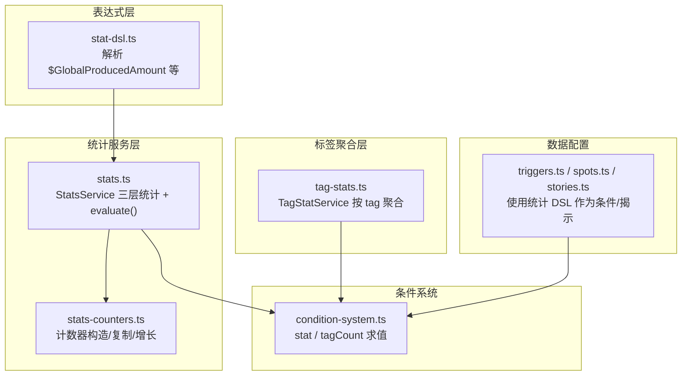
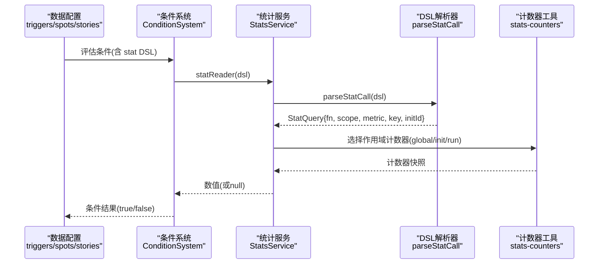
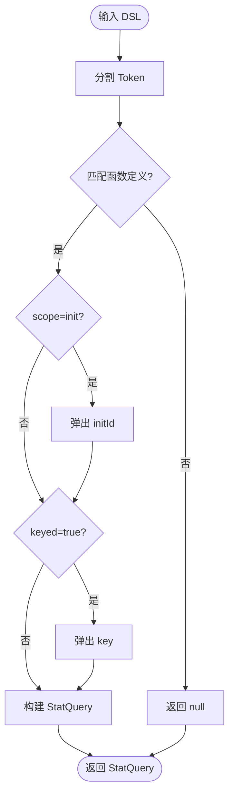
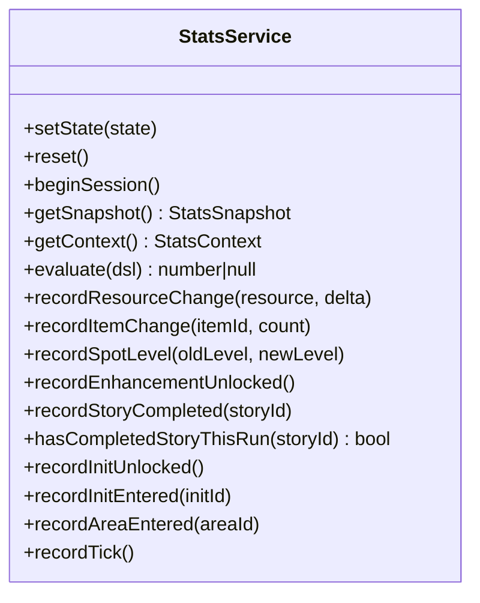
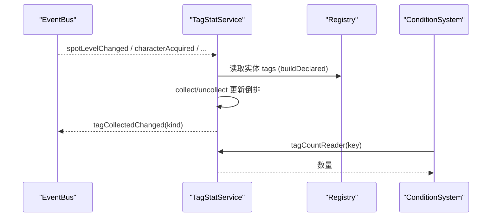
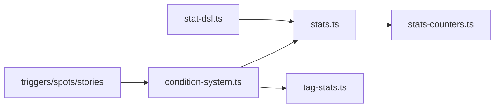

# 统计DSL

<cite>
**本文引用的文件**
- [stat-dsl.ts](file://src/engine/expression/stat-dsl.ts)
- [stats.ts](file://src/engine/stats/stats.ts)
- [stats-counters.ts](file://src/engine/stats/stats-counters.ts)
- [tag-stats.ts](file://src/engine/stats/tag-stats.ts)
- [condition-system.ts](file://src/engine/expression/condition-system.ts)
- [triggers.ts](file://src/data/base/triggers.ts)
- [spots.ts](file://src/data/base/spots.ts)
- [stories.ts](file://src/data/base/stories.ts)
- [reveal.ts](file://src/engine/def-factory/reveal.ts)
- [stats.test.ts](file://tests/engine/stats.test.ts)
- [tag-stats.test.ts](file://tests/engine/tag-stats.test.ts)
</cite>

## 目录
1. [简介](#简介)
2. [项目结构](#项目结构)
3. [核心组件](#核心组件)
4. [架构总览](#架构总览)
5. [详细组件分析](#详细组件分析)
6. [依赖关系分析](#依赖关系分析)
7. [性能与最佳实践](#性能与最佳实践)
8. [故障排查指南](#故障排查指南)
9. [结论](#结论)
10. [附录](#附录)

## 简介
本技术文档面向 ACProgram 引擎中的“统计领域特定语言（统计DSL）”，围绕统计数据收集、聚合与分析，系统阐述其设计目标、语法结构、数据模型、查询接口与集成方式。该 DSL 允许在触发器、揭示条件等配置中，以受限函数形式表达跨世界线、当前游玩、以及各 Init 的统计查询，从而支撑玩家行为分析、游戏平衡性调整与个性化推荐等场景。同时提供按 tag 聚合的收集统计服务，用于可视化展示与导出。

## 项目结构
统计相关代码主要分布在以下模块：
- 表达式层：统计 DSL 解析与受限函数库定义
- 统计服务层：三层统计（global/init/session）采集、持久化、快照与求值
- 标签聚合层：按 tag 的实体收集统计（派生视图）
- 条件系统：将统计 DSL 接入条件求值，支持触发器与揭示逻辑
- 数据配置：在 triggers、spots、stories 等数据包中使用统计 DSL 作为条件或揭示依据

图表来源
- [stat-dsl.ts:1-92](file://src/engine/expression/stat-dsl.ts#L1-L92)
- [stats.ts:1-263](file://src/engine/stats/stats.ts#L1-L263)
- [stats-counters.ts:1-66](file://src/engine/stats/stats-counters.ts#L1-L66)
- [tag-stats.ts:1-275](file://src/engine/stats/tag-stats.ts#L1-L275)
- [condition-system.ts:1-137](file://src/engine/expression/condition-system.ts#L1-L137)
- [triggers.ts](file://src/data/base/triggers.ts)
- [spots.ts](file://src/data/base/spots.ts)
- [stories.ts](file://src/data/base/stories.ts)

章节来源
- [stat-dsl.ts:1-92](file://src/engine/expression/stat-dsl.ts#L1-L92)
- [stats.ts:1-263](file://src/engine/stats/stats.ts#L1-L263)
- [stats-counters.ts:1-66](file://src/engine/stats/stats-counters.ts#L1-L66)
- [tag-stats.ts:1-275](file://src/engine/stats/tag-stats.ts#L1-L275)
- [condition-system.ts:1-137](file://src/engine/expression/condition-system.ts#L1-L137)
- [triggers.ts](file://src/data/base/triggers.ts)
- [spots.ts](file://src/data/base/spots.ts)
- [stories.ts](file://src/data/base/stories.ts)

## 核心组件
- 统计 DSL 解析器：将形如 `$GlobalProducedAmount base:resource:credit` 的字符串解析为查询对象，包含函数名、作用域、指标与键（资源/物品 ID）、Init 标识。
- StatsService：维护 global、init[id]、session 三层统计，提供记录变更、tick、快照、持久化、evaluate 等能力。
- 计数器工具：提供空计数器构造、深拷贝、bump 累加等无状态操作。
- TagStatService：基于注册表与事件总线，维护七类实体的 declared/collected 倒排索引，提供进度与列表查询。
- ConditionSystem：通过注入 statReader 与 tagCountReader，使统计 DSL 与 tag 聚合统计可参与条件求值。

章节来源
- [stat-dsl.ts:15-92](file://src/engine/expression/stat-dsl.ts#L15-L92)
- [stats.ts:47-263](file://src/engine/stats/stats.ts#L47-L263)
- [stats-counters.ts:8-66](file://src/engine/stats/stats-counters.ts#L8-L66)
- [tag-stats.ts:50-275](file://src/engine/stats/tag-stats.ts#L50-L275)
- [condition-system.ts:56-137](file://src/engine/expression/condition-system.ts#L56-L137)

## 架构总览
统计 DSL 的求值路径：
- 配置层（triggers/spots/stories）声明条件或揭示，引用统计 DSL。
- 条件系统在求值时调用注入的 statReader，后者委托 StatsService.evaluate。
- StatsService 解析 DSL 并选择对应作用域的计数器，返回数值供比较。
- TagStatService 提供 tag 聚合计数，ConditionSystem 通过 tagCountReader 接入。

图表来源
- [condition-system.ts:33-40](file://src/engine/expression/condition-system.ts#L33-L40)
- [stats.ts:107-117](file://src/engine/stats/stats.ts#L107-L117)
- [stat-dsl.ts:72-92](file://src/engine/expression/stat-dsl.ts#L72-L92)
- [stats-counters.ts:8-31](file://src/engine/stats/stats-counters.ts#L8-L31)

## 详细组件分析

### 统计 DSL 解析与受限函数库
- 语法：`$FunctionName 参数...`，参数空格分隔；作用域编码在函数名前缀（Global/CurrentRun/Init）。
- 函数集：覆盖 produced/consumed、itemsCollected/itemsUsed、解锁/升级计数、帧数等指标；部分指标需要维度键（资源/物品 ID），init 作用域需指定 initId。
- 解析流程：分割 token → 匹配函数定义 → 根据 scope/keyed 抽取 initId/key → 返回查询对象。

图表来源
- [stat-dsl.ts:72-92](file://src/engine/expression/stat-dsl.ts#L72-L92)

章节来源
- [stat-dsl.ts:15-92](file://src/engine/expression/stat-dsl.ts#L15-L92)

### StatsService：三层统计与 DSL 求值
- 三层统计：
  - global：贯穿所有 Init 的累计统计
  - init[id]：每个 Init 内的累计统计（含 framesInInit）
  - session：当前一次游玩的累计统计（需存档持久化）
- 数据采集：
  - 资源变化：正数为 produced，负数为 consumed，同时更新 session.resources
  - 物品变化：收集计入 itemsCollected，使用计入 itemsUsed
  - Spot 解锁/升级：区分首次解锁与后续升级
  - 故事完成：记录 completedStoryIdsThisRun
  - tick：framesActive 与 framesInInit 递增
- DSL 求值：evaluate(dsl) 解析后选择作用域计数器，读取指标与键值。

图表来源
- [stats.ts:47-263](file://src/engine/stats/stats.ts#L47-L263)

章节来源
- [stats.ts:1-263](file://src/engine/stats/stats.ts#L1-L263)

### 计数器工具：纯函数与不可变快照
- bump：安全地对 map 累加，undefined 忽略
- emptyCounters/emptyInitCounters：构造初始计数器
- copyCounters/copyInitMap：深拷贝嵌套 map，避免外部修改影响内部状态
- freshSnapshot：全新空快照，用于新游戏/重置起点

章节来源
- [stats-counters.ts:8-66](file://src/engine/stats/stats-counters.ts#L8-L66)

### TagStatService：按 tag 聚合的收集统计
- 实体类型：inits/areas/spots/characters/enhancements/passiveStories/activeStories
- 声明侧：扫描实体 tags 建立倒排索引（含祖先前缀登记）
- 收集侧：事件驱动增量维护 collected 集合，读档/切换状态时全量重建
- 查询 API：declaredCount、collectedCount、collectedIds、progress
- 事件：仅在 collected 实际变化时发出 tagCollectedChanged，精确命中 kind

图表来源
- [tag-stats.ts:50-275](file://src/engine/stats/tag-stats.ts#L50-L275)
- [condition-system.ts:39-40](file://src/engine/expression/condition-system.ts#L39-L40)

章节来源
- [tag-stats.ts:1-275](file://src/engine/stats/tag-stats.ts#L1-L275)
- [condition-system.ts:1-137](file://src/engine/expression/condition-system.ts#L1-L137)

### 条件系统集成：stat 与 tagCount
- stat：通过 ConditionSystem.statReader 调用 StatsService.evaluate，支持任意统计 DSL
- tagCount：通过 tagCountReader 获取按 tag 聚合的收集数，key 格式为 `<kind>:<tagDisplay>`
- 组合条件：and/or 条件组可组合多个 stat/tagCount 条件

章节来源
- [condition-system.ts:17-45](file://src/engine/expression/condition-system.ts#L17-L45)
- [condition-system.ts:56-94](file://src/engine/expression/condition-system.ts#L56-L94)
- [stats.test.ts:149-183](file://tests/engine/stats.test.ts#L149-L183)

### 数据配置中的使用示例
- 触发器：使用统计 DSL 作为 when 条件，例如按全局或某 Init 的资源产出阈值触发效果
- 区域/地点：根据统计条件控制可用性或解锁
- 故事揭示：根据统计条件揭示剧情内容

章节来源
- [triggers.ts](file://src/data/base/triggers.ts)
- [spots.ts](file://src/data/base/spots.ts)
- [stories.ts](file://src/data/base/stories.ts)
- [reveal.ts:10-10](file://src/engine/def-factory/reveal.ts#L10-L10)

## 依赖关系分析
- 表达式层依赖统计服务：stat-dsl.ts 被 stats.ts 使用进行解析
- 统计服务依赖计数器工具：stats.ts 使用 stats-counters.ts 进行构造与拷贝
- 条件系统依赖统计服务与标签聚合：condition-system.ts 通过注入 reader 访问 StatsService 与 TagStatService
- 数据配置依赖条件系统：triggers/spots/stories 通过条件系统间接使用统计 DSL

图表来源
- [stat-dsl.ts:1-92](file://src/engine/expression/stat-dsl.ts#L1-L92)
- [stats.ts:1-263](file://src/engine/stats/stats.ts#L1-L263)
- [stats-counters.ts:1-66](file://src/engine/stats/stats-counters.ts#L1-L66)
- [condition-system.ts:1-137](file://src/engine/expression/condition-system.ts#L1-L137)
- [tag-stats.ts:1-275](file://src/engine/stats/tag-stats.ts#L1-L275)
- [triggers.ts](file://src/data/base/triggers.ts)
- [spots.ts](file://src/data/base/spots.ts)
- [stories.ts](file://src/data/base/stories.ts)

章节来源
- [stat-dsl.ts:1-92](file://src/engine/expression/stat-dsl.ts#L1-L92)
- [stats.ts:1-263](file://src/engine/stats/stats.ts#L1-L263)
- [condition-system.ts:1-137](file://src/engine/expression/condition-system.ts#L1-L137)
- [tag-stats.ts:1-275](file://src/engine/stats/tag-stats.ts#L1-L275)

## 性能与最佳实践
- 查询效率
  - 优先使用最小作用域：仅当需要限定范围时使用 init 作用域，减少键查找成本
  - 避免频繁解析：在热点路径缓存已解析的 StatQuery（若业务允许）
  - 合理使用 keyed 指标：对高频资源/物品，确保键稳定且唯一
- 数据精度
  - 资源变化通过 recordResourceChange 统一入口，保证 produced/consumed 一致性与 session.resources 同步
  - 物品收集与使用分别计数，避免混淆
  - Spot 首次解锁与升级分开计数，防止重复统计
- 查询效率优化建议
  - 将复杂条件拆分为多个简单条件，利用 and/or 组合，便于条件依赖索引与增量重算
  - 使用 tagCount 替代多次 hasTag/countTags 组合，减少重复计算
- 持久化与恢复
  - 使用 getPersistable/restore 保存/恢复三层统计，确保跨会话一致性
  - 读档后通过 setState 重建 TagStatService 的 collected 视图，保证可见性正确

[本节为通用指导，不直接分析具体文件]

## 故障排查指南
- DSL 解析失败
  - 现象：evaluate 返回 null
  - 排查：检查函数名是否在 STAT_FNS 中；init 作用域是否缺少 initId；keyed 指标是否缺少 key
  - 参考：解析逻辑与错误返回路径
- 统计未更新
  - 现象：资源/物品/Spot/故事完成后统计不变
  - 排查：确认通过 mutations 写入（changeResource/giveItem/useItem/setSpotLevel/storyCompleted）；tick 是否调用；beginSession 是否正确
- 条件不生效
  - 现象：触发器/揭示未按预期触发
  - 排查：确认 ConditionSystem 已注入 statReader 与 tagCountReader；检查 tagCount key 格式；验证事件总线是否发出相应事件
- 读档后统计异常
  - 现象：读档后 collected 视图不正确
  - 排查：确认 TagStatService.setState 全量重建 collected；检查 roster/spotLevels/unlockedEnhancements/storyLog 等状态字段

章节来源
- [stat-dsl.ts:72-92](file://src/engine/expression/stat-dsl.ts#L72-L92)
- [stats.ts:107-117](file://src/engine/stats/stats.ts#L107-L117)
- [stats.ts:155-234](file://src/engine/stats/stats.ts#L155-L234)
- [tag-stats.ts:83-93](file://src/engine/stats/tag-stats.ts#L83-L93)
- [tag-stats.ts:215-232](file://src/engine/stats/tag-stats.ts#L215-L232)
- [condition-system.ts:56-94](file://src/engine/expression/condition-system.ts#L56-L94)

## 结论
统计 DSL 以受限函数形式提供了简洁、可扩展的统计查询能力，结合三层统计与 tag 聚合统计，能够灵活支撑游戏中的条件判断、揭示逻辑与数据分析需求。通过统一的采集入口与事件驱动机制，保证了数据一致性与性能。建议在配置中优先使用最小作用域与合适的指标，并结合条件依赖索引实现高效的条件求值。

[本节为总结性内容，不直接分析具体文件]

## 附录

### 统计 DSL 语法速查
- 基本形式：`$FunctionName 参数...`
- 作用域：Global/CurrentRun/Init（函数名前缀决定）
- 指标：produced/consumed、itemsCollected/itemsUsed、spotsUnlocked/Upgraded、enhancementsUnlocked、storiesCompleted、initsUnlocked、framesActive、framesInInit
- 键：资源/物品 ID（如 base:resource:credit、base:item:energy_drink）
- Init 作用域：需提供 initId（如 base:init:schale_office）

章节来源
- [stat-dsl.ts:25-63](file://src/engine/expression/stat-dsl.ts#L25-L63)
- [stats.test.ts:15-37](file://tests/engine/stats.test.ts#L15-L37)

### 使用示例（来自数据配置）
- 触发器：当全局信用产出达到阈值时触发效果
- 地点：当全局信用产出达到更高阈值时解锁
- 故事：当全局信用产出达到特定值时揭示名称

章节来源
- [triggers.ts](file://src/data/base/triggers.ts)
- [spots.ts](file://src/data/base/spots.ts)
- [stories.ts](file://src/data/base/stories.ts)
- [reveal.ts:10-10](file://src/engine/def-factory/reveal.ts#L10-L10)

### 测试用例要点
- DSL 解析：支持带键/不带键/init 作用域；拒绝未知函数或缺少参数
- 三层统计：资源变化、物品收集/使用、Spot 解锁/升级、tick 帧数、事件上下文携带统计
- 条件系统：stat 条件求值、and 组合、tagCount 条件与事件联动

章节来源
- [stats.test.ts:15-183](file://tests/engine/stats.test.ts#L15-L183)
- [tag-stats.test.ts:86-299](file://tests/engine/tag-stats.test.ts#L86-L299)