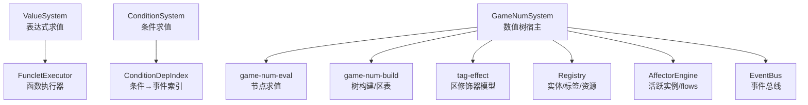
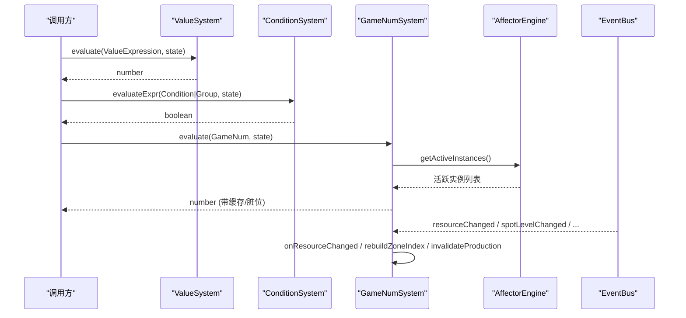
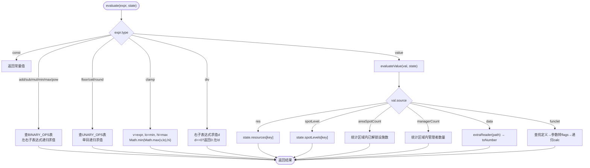
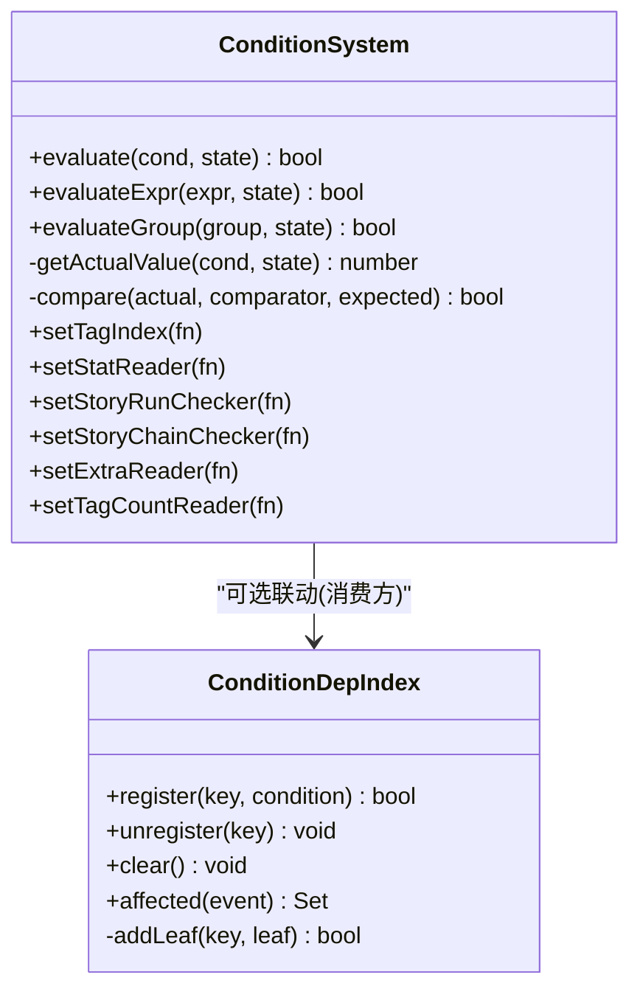
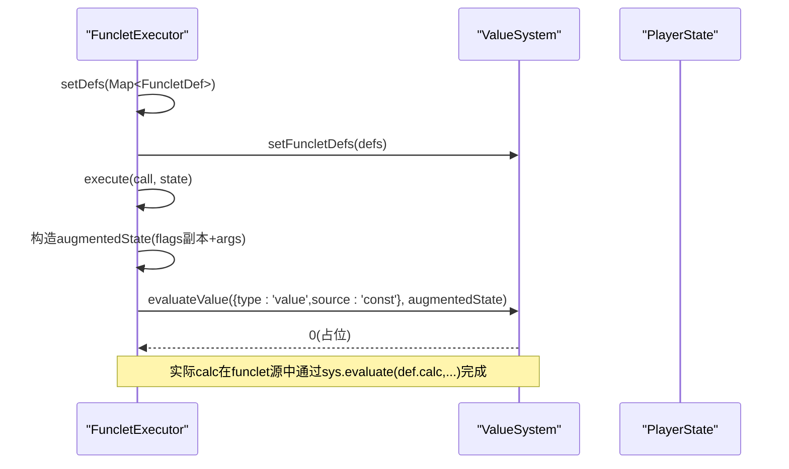
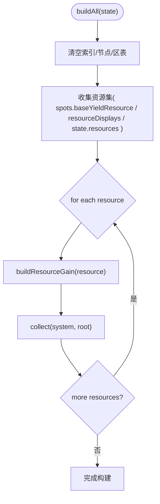
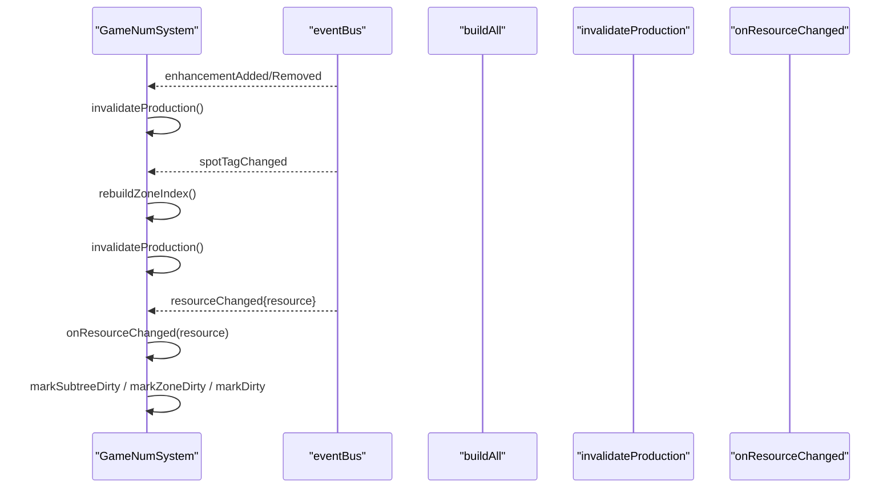
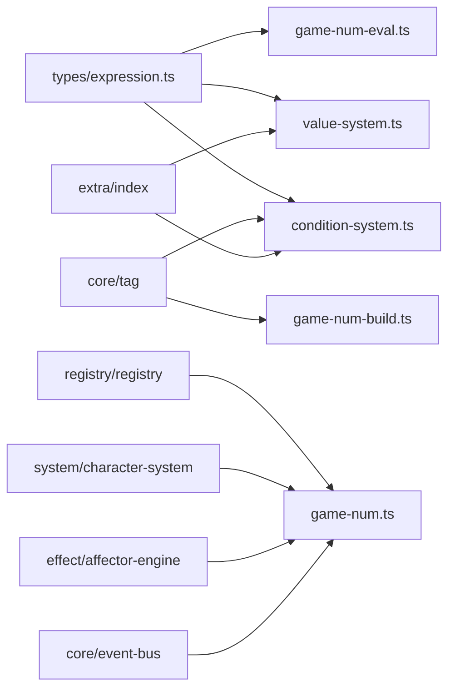

# 表达式系统

<cite>
**本文引用的文件**
- [value-system.ts](file://src/engine/expression/value-system.ts)
- [condition-system.ts](file://src/engine/expression/condition-system.ts)
- [funclet-executor.ts](file://src/engine/expression/funclet-executor.ts)
- [game-num.ts](file://src/engine/expression/game-num.ts)
- [game-num-build.ts](file://src/engine/expression/game-num-build.ts)
- [game-num-eval.ts](file://src/engine/expression/game-num-eval.ts)
- [tag-effect.ts](file://src/engine/expression/tag-effect.ts)
- [expression.ts](file://src/engine/types/expression.ts)
- [condition-deps.ts](file://src/engine/expression/condition-deps.ts)
- [declarative-dsl.md](file://docs-828/03-data-structures/declarative-dsl.md)
- [trigger-effect.md](file://docs-828/04-algorithms/trigger-effect.md)
- [game-num.md](file://docs-828/02-modules/game-num.md)
- [value-system.test.ts](file://tests/engine/value-system.test.ts)
- [condition-system.test.ts](file://tests/engine/condition-system.test.ts)
- [game-num.test.ts](file://tests/engine/game-num.test.ts)
</cite>

## 更新摘要
**所做更改**
- 更新了 ValueSystem 数值表达式引擎，新增 areaSpotCount 和 managerCount 源类型
- 扩展了 ConditionSystem 条件判断系统，支持15种条件目标，包括 protoStat 和 area
- 增强了 FuncletExecutor 函数执行器的参数传递机制
- 添加了完整的声明式DSL文档引用，提供枚举式设计的全面说明
- 更新了游戏数值计算系统的区表聚合机制

## 目录
1. [简介](#简介)
2. [项目结构](#项目结构)
3. [核心组件](#核心组件)
4. [架构总览](#架构总览)
5. [详细组件分析](#详细组件分析)
6. [依赖关系分析](#依赖关系分析)
7. [性能考量](#性能考量)
8. [故障排查指南](#故障排查指南)
9. [结论](#结论)
10. [附录：使用示例与最佳实践](#附录使用示例与最佳实践)

## 简介
本技术文档面向 ACProgram 的表达式系统，覆盖四大子系统：
- ValueSystem 数值表达式引擎：表达式语法、求值算法与缓存机制。
- ConditionSystem 条件判断系统：条件解析、依赖分析与事件化失效。
- FuncletExecutor 函数执行器：函数注册、参数传递与执行上下文管理。
- GameNumSystem 数值计算系统：数值类型、运算规则、区表聚合与精度控制。

文档提供架构图、数据流图、关键流程时序图与代码级引用路径，帮助读者快速理解并正确使用表达式系统进行游戏逻辑配置。

## 项目结构
表达式系统位于 src/engine/expression 目录下，按职责拆分：
- value-system.ts：ValueExpression 求值器（算子表驱动 + source 求值器注册表）。
- condition-system.ts：Condition/ConditionGroup 求值器（target 求值器注册表 + 比较器表）。
- funclet-executor.ts：Funclet 调用执行器（参数注入 flags 供 ValueSystem 使用）。
- game-num*.ts：GameNumSystem 及其构建、求值、区表与标签效果桥接。
- tag-effect.ts：区修饰器声明与实体引用模型。
- types/expression.ts：表达式、条件、效果、Funclet 的类型定义。
- condition-deps.ts：条件叶子到事件的共享反向依赖索引，用于精准失效。

**图表来源**
- [value-system.ts:1-150](file://src/engine/expression/value-system.ts#L1-L150)
- [condition-system.ts:1-137](file://src/engine/expression/condition-system.ts#L1-L137)
- [funclet-executor.ts:1-45](file://src/engine/expression/funclet-executor.ts#L1-L45)
- [game-num.ts:1-262](file://src/engine/expression/game-num.ts#L1-L262)
- [game-num-build.ts:1-446](file://src/engine/expression/game-num-build.ts#L1-L446)
- [game-num-eval.ts:1-292](file://src/engine/expression/game-num-eval.ts#L1-L292)
- [tag-effect.ts:1-75](file://src/engine/expression/tag-effect.ts#L1-L75)

**章节来源**
- [value-system.ts:1-150](file://src/engine/expression/value-system.ts#L1-L150)
- [condition-system.ts:1-137](file://src/engine/expression/condition-system.ts#L1-L137)
- [funclet-executor.ts:1-45](file://src/engine/expression/funclet-executor.ts#L1-L45)
- [game-num.ts:1-262](file://src/engine/expression/game-num.ts#L1-L262)
- [game-num-build.ts:1-446](file://src/engine/expression/game-num-build.ts#L1-L446)
- [game-num-eval.ts:1-292](file://src/engine/expression/game-num-eval.ts#L1-L292)
- [tag-effect.ts:1-75](file://src/engine/expression/tag-effect.ts#L1-L75)

## 核心组件
- **ValueSystem**：以算子表（二元/一元）和 source 求值器表驱动，递归求值 ValueExpression；支持 const/value/add/sub/mul/div/min/max/pow/floor/ceil/round/clamp；新增 areaSpotCount（区域设施计数）和 managerCount（管理者数量）；缺失资源或未知 source 回退为 0。
- **ConditionSystem**：以 target 求值器表和比较器表驱动，支持 AND/OR 条件组；现支持15种条件目标；可注入 tagIndex/statReader/storyRunChecker/storyChainChecker/extraReader/tagCountReader 等外部依赖。
- **FuncletExecutor**：将调用参数注入 flags，委托 ValueSystem 求值；支持动态参数类型转换（number/string）；改进了参数传递机制。
- **GameNumSystem**：维护每资源的显式层级树（global/init/area/spot），懒求值与脏位缓存；通过区表聚合 flat/mul/custom/bound；监听事件实现定向失效。

**章节来源**
- [value-system.ts:10-150](file://src/engine/expression/value-system.ts#L10-L150)
- [condition-system.ts:10-137](file://src/engine/expression/condition-system.ts#L10-L137)
- [funclet-executor.ts:5-45](file://src/engine/expression/funclet-executor.ts#L5-L45)
- [game-num.ts:18-262](file://src/engine/expression/game-num.ts#L18-L262)

## 架构总览
表达式系统围绕"表达式—条件—数值树"三要素协同工作：
- 表达式（ValueExpression）由 ValueSystem 求值为数字，可被条件、区修饰器、flows 等消费。
- 条件（Condition/ConditionGroup）由 ConditionSystem 求值为布尔，结合 ConditionDepIndex 进行事件化精准失效。
- 数值树（GameNum）由 GameNumSystem 构建与求值，整合 base/levelLinear/zone/affectorFlows 等贡献，输出资源产出与 spot 产出。

**图表来源**
- [value-system.ts:111-148](file://src/engine/expression/value-system.ts#L111-L148)
- [condition-system.ts:96-135](file://src/engine/expression/condition-system.ts#L96-L135)
- [game-num.ts:105-173](file://src/engine/expression/game-num.ts#L105-L173)
- [game-num-eval.ts:171-210](file://src/engine/expression/game-num-eval.ts#L171-L210)

## 详细组件分析

### ValueSystem 数值表达式引擎
- **表达式语法**：const/value/add/sub/mul/div/min/max/pow/floor/ceil/round/clamp。
- **求值算法**：递归遍历表达式树；二元/一元操作通过表驱动；div 含除零保护；clamp 对上下界求值后夹取。
- **Source 求值器**：const/res/spotLevel/**areaSpotCount**/managerCount/data/funclet；新增 areaSpotCount（计算某 Area 下已解锁的 Spot 数量）和 managerCount（计算某 Init 下所有 Spot 中已被分配的 Manager 数量）；未知 source 返回 0。
- **缓存机制**：ValueSystem 本身不缓存节点结果，但可通过上层（如 GameNum expr 节点）缓存；缺失 Extra 读取器时 data 源返回 0。
- **与 Funclet 集成**：funclet 源通过 sys.funcletDefs 查找定义，将参数转为 flags 后递归求值 calc。

**图表来源**
- [value-system.ts:13-86](file://src/engine/expression/value-system.ts#L13-L86)
- [value-system.ts:111-148](file://src/engine/expression/value-system.ts#L111-L148)

**章节来源**
- [value-system.ts:10-150](file://src/engine/expression/value-system.ts#L10-L150)
- [value-system.test.ts:25-84](file://tests/engine/value-system.test.ts#L25-L84)

### ConditionSystem 条件判断系统
- **条件目标**：resource/spotLevel/manager/flag/hasEnh/hasTag/countTags/tagCount/stat/hasReadStory/hasReadStoryInRun/visitedStoryInChain/extra/protoStat/**area**（共15种）。
- **比较器**：==/!=/>=/<=/>/<。
- **条件组**：AND/OR 递归求值。
- **依赖分析**：ConditionDepIndex 将条件叶子映射到事件类型与键，支持 extra 路径前缀匹配、tag 宽依赖、stat 宽依赖；affected(event) 返回需失效的依赖集合。
- **外部依赖注入**：tagIndex/statReader/storyRunChecker/storyChainChecker/extraReader/tagCountReader。

**图表来源**
- [condition-system.ts:14-135](file://src/engine/expression/condition-system.ts#L14-L135)
- [condition-deps.ts:77-219](file://src/engine/expression/condition-deps.ts#L77-L219)

**章节来源**
- [condition-system.ts:10-137](file://src/engine/expression/condition-system.ts#L10-L137)
- [condition-deps.ts:1-220](file://src/engine/expression/condition-deps.ts#L1-L220)
- [condition-system.test.ts:25-165](file://tests/engine/condition-system.test.ts#L25-L165)

### FuncletExecutor 函数执行器
- **函数注册**：通过 Map<string, FuncletDef> 注入；ValueSystem 内部也持有该表以支持 funclet 源。
- **参数传递**：将 call.args 写入 augmentedState.flags（字符串化），供 ValueSystem 的 funclet 源读取；改进了参数传递机制。
- **执行上下文**：复制 state.flags 避免污染原状态；委托 ValueSystem.evaluateValue 求值。

**图表来源**
- [funclet-executor.ts:8-43](file://src/engine/expression/funclet-executor.ts#L8-L43)
- [value-system.ts:67-85](file://src/engine/expression/value-system.ts#L67-L85)

**章节来源**
- [funclet-executor.ts:1-45](file://src/engine/expression/funclet-executor.ts#L1-L45)
- [value-system.ts:67-85](file://src/engine/expression/value-system.ts#L67-L85)

### GameNumSystem 数值计算系统
- **数值类型**：GameNum 节点包括 const/expr/add/sub/mul/owned/levelLinear/zone/affectorFlows。
- **运算规则**：
  - add/sub/mul 多叉折叠。
  - owned 门控未拥有 spot 产出为 0。
  - levelLinear 线性增长 floor(max(0, level-1)*perLevel)。
  - zone 统一走 aggregateZone：flat 求和；mul 默认乘区 1+Σ(f-1)；custom 按 multiplierId 分组连乘；bound 夹取下上界。
  - affectorFlows 累计活跃实例 flows 值。
- **精度控制**：数值均为 JS 双精度浮点；levelLinear 使用 Math.floor；区间夹取使用 Math.min/Math.max。
- **构建与缓存**：
  - buildAll 构建每资源一棵显式层级树（global/init/area/spot），维护 parents/allNodes/zoneNodes/zoneIndex 等索引。
  - 节点级 dirty/cached 懒求值；resourceChanged 定向失效（基于 gainResourceDeps/zoneKeyResourceDeps/affectorFlows 资源依赖）。
  - ensureFlowsNode 根据 Affector 活跃实例补齐 flows 节点。
- **区表与标签效果**：
  - tagPrefixesBottomUp 自下而上展开 tag 路径。
  - entityKey/tagEffectRecord 描述作用目标与分类。
  - register/remove/sync 接口桥接 AffectorEngine。

**图表来源**
- [game-num-build.ts:27-56](file://src/engine/expression/game-num-build.ts#L27-L56)
- [game-num-build.ts:62-95](file://src/engine/expression/game-num-build.ts#L62-L95)

**图表来源**
- [game-num.ts:105-173](file://src/engine/expression/game-num.ts#L105-L173)
- [game-num-build.ts:330-346](file://src/engine/expression/game-num-build.ts#L330-L346)

**章节来源**
- [game-num.ts:18-262](file://src/engine/expression/game-num.ts#L18-L262)
- [game-num-build.ts:1-446](file://src/engine/expression/game-num-build.ts#L1-L446)
- [game-num-eval.ts:1-292](file://src/engine/expression/game-num-eval.ts#L1-L292)
- [tag-effect.ts:1-75](file://src/engine/expression/tag-effect.ts#L1-L75)
- [game-num.test.ts:21-200](file://tests/engine/game-num.test.ts#L21-L200)

## 依赖关系分析
- **ValueSystem 依赖**：types/expression（ValueExpression/ValueSource）、extra.toNumber、funclet 定义表、extraReader。
- **ConditionSystem 依赖**：types/expression（Condition/Comparator）、core.tag（parseTagId）、extra.toNumber、外部注入（tagIndex/statReader/story*Checker/extraReader/tagCountReader）。
- **GameNumSystem 依赖**：ValueSystem、Registry、CharacterSystem、AffectorEngine、EventBus；内部委托 game-num-build/game-num-eval/tag-effect。
- **条件依赖索引**：ConditionDepIndex 将条件叶子映射到事件类型与键，支持精确命中与宽依赖降级。

**图表来源**
- [expression.ts:1-263](file://src/engine/types/expression.ts#L1-L263)
- [value-system.ts:10-150](file://src/engine/expression/value-system.ts#L10-L150)
- [condition-system.ts:10-137](file://src/engine/expression/condition-system.ts#L10-L137)
- [game-num.ts:18-262](file://src/engine/expression/game-num.ts#L18-L262)

**章节来源**
- [expression.ts:1-263](file://src/engine/types/expression.ts#L1-L263)
- [condition-deps.ts:1-220](file://src/engine/expression/condition-deps.ts#L1-L220)

## 性能考量
- **表达式求值**：ValueSystem 无节点缓存，适合轻量表达式；复杂表达式建议在上层（GameNum expr 节点）缓存。
- **条件评估**：ConditionSystem 纯函数式求值；配合 ConditionDepIndex 实现事件化精准失效，避免全量重估。
- **数值树**：
  - 懒求值与脏位：节点级 cached/dirty 减少重复计算。
  - 定向失效：resourceChanged 仅标记受影响的 primitiveGain 子树、zone 节点与 flows 节点。
  - 区表聚合：aggregateZone 一次性汇总 flat/mul/custom/bound，避免多次扫描。
  - flows 节点按需创建：ensureFlowsNode 仅在 Affector 活跃时挂载，降低无关开销。
- **精度**：levelLinear 使用 Math.floor；区间夹取保证边界安全；所有数值为 JS 浮点数，注意大数精度。

## 故障排查指南
- **表达式结果为 0**：
  - 检查 ValueSource 是否已注册；未知 source 会回退 0。
  - 检查 Extra 读取器是否注入；未注入时 data 源返回 0。
  - 检查 res 资源是否存在于 state.resources。
- **条件始终为假**：
  - 检查 Comparator 是否合法；未知比较器返回 false。
  - 检查 hasTag/countTags 的 tagIndex 是否正确注入。
  - 检查 stat/target 是否落入宽依赖导致轮询失效。
- **数值产出异常**：
  - 检查 GameNum 节点是否 dirty；必要时调用 invalidateProduction。
  - 检查 resourceChanged 事件是否触发；确认 gainResourceDeps 包含相关资源。
  - 检查 Affector 实例是否激活；flows 节点是否已挂载。
- **调试技巧**：
  - 使用 evaluateWithBreakdown 获取贡献明细，定位贡献来源。
  - 借助测试用例中的 defaultState 构造最小复现环境。

**章节来源**
- [value-system.ts:111-148](file://src/engine/expression/value-system.ts#L111-L148)
- [condition-system.ts:96-135](file://src/engine/expression/condition-system.ts#L96-L135)
- [game-num.ts:142-173](file://src/engine/expression/game-num.ts#L142-L173)
- [game-num-eval.ts:218-255](file://src/engine/expression/game-num-eval.ts#L218-L255)

## 结论
ACProgram 表达式系统以"表驱动 + 事件化失效 + 懒求值"为核心设计，实现了高内聚、低耦合的数值与条件计算框架：
- **ValueSystem** 提供简洁强大的表达式求值能力，支持丰富的数值源类型。
- **ConditionSystem** 支持灵活的条件组合与高效的事件化失效，现支持15种条件目标。
- **FuncletExecutor** 将函数式扩展无缝接入表达式体系，改进了参数传递机制。
- **GameNumSystem** 以显式层级树与区表聚合实现高性能、可溯源的资源产出计算。

通过上述机制，游戏逻辑配置既具备表达力，又保持运行期性能与可维护性。

## 附录：使用示例与最佳实践
- **表达式示例**（参考测试）：
  - 读取资源：value('res', { resource: 'credit' })
  - 读取 Spot 等级：value('spotLevel', { spot: 'spot_a' })
  - 读取区域设施数：value('areaSpotCount', { area: 'office' })
  - 读取管理者数量：value('managerCount', { init: 'init_1' })
  - 读取 Extra 数据：value('data', { path: 'meta/softCap' })
  - 组合运算：add(value(...), const(10))
- **条件示例**（参考测试）：
  - 资源比较：cond('resource', 'credit', '>=', 100)
  - 标签存在：cond('hasTag', 'office', '==', 1)
  - 原型统计：cond('protoStat', 'chara_id', '>=', 1)
  - 区域检查：cond('area', 'office', '==', 1)
  - 条件组：and(cond(...), or(cond(...), cond(...)))
- **数值树示例**（参考测试）：
  - 构建后查询资源根节点：getGainNode(resource)
  - 求 spot 产出：evaluateSpotYield(spotId, state)
  - 观察 flows 加成：添加 Enhancement 后验证 evaluateResourceGain 变化
- **最佳实践**：
  - 尽量使用 Zone 区修饰器集中管理加成，便于追踪与调优。
  - 利用 evaluateWithBreakdown 进行可视化溯源。
  - 谨慎使用宽依赖（stat/未知 target），优先精确事件命中。
  - 合理拆分表达式，避免过深嵌套影响可读性与性能。
  - 充分利用新增的条件目标（protoStat、area）实现更复杂的业务逻辑。

**章节来源**
- [value-system.test.ts:25-84](file://tests/engine/value-system.test.ts#L25-L84)
- [condition-system.test.ts:25-165](file://tests/engine/condition-system.test.ts#L25-L165)
- [game-num.test.ts:21-200](file://tests/engine/game-num.test.ts#L21-L200)
- [declarative-dsl.md:6-76](file://docs-828/03-data-structures/declarative-dsl.md#L6-L76)
- [trigger-effect.md:52-113](file://docs-828/04-algorithms/trigger-effect.md#L52-L113)
- [game-num.md:1-35](file://docs-828/02-modules/game-num.md#L1-L35)