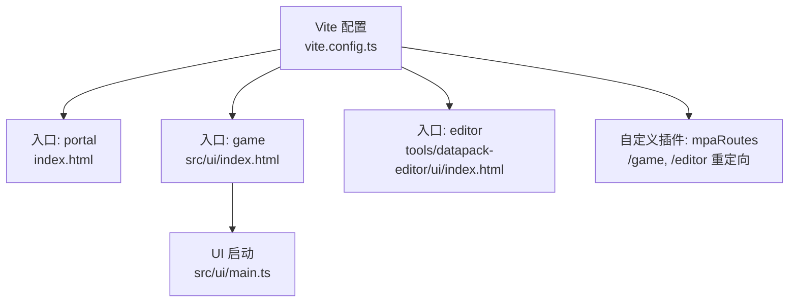
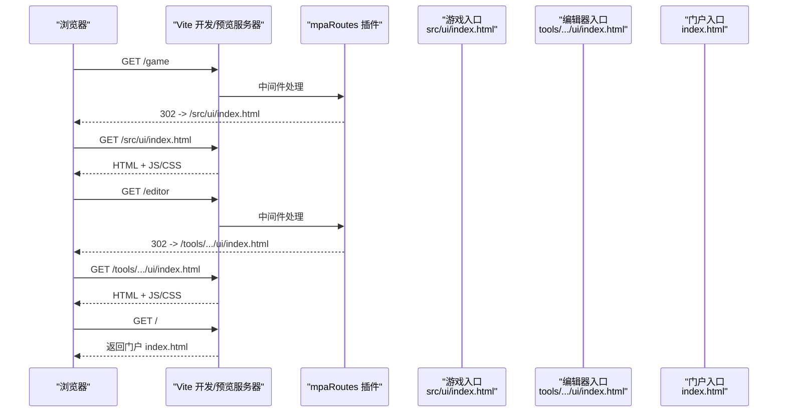
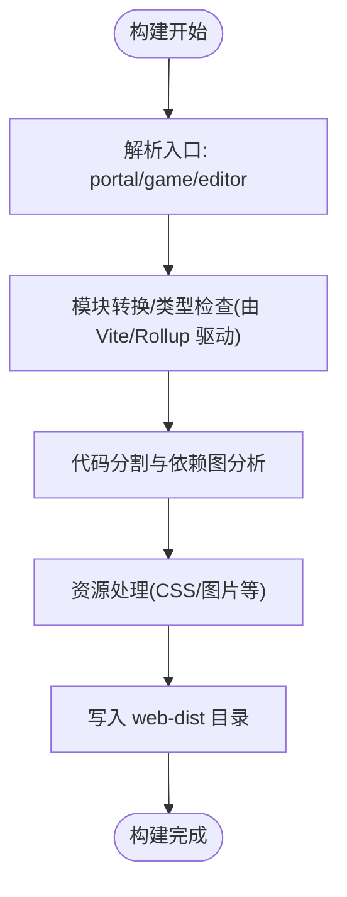
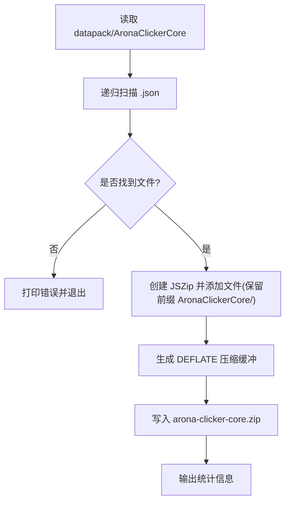
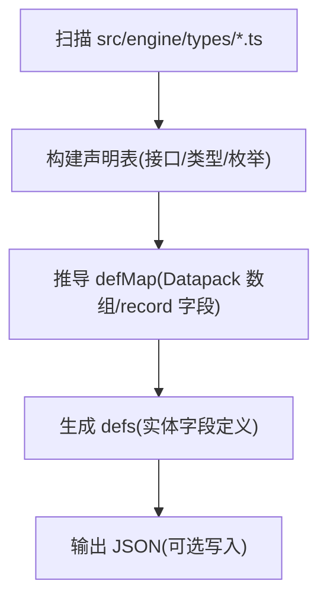
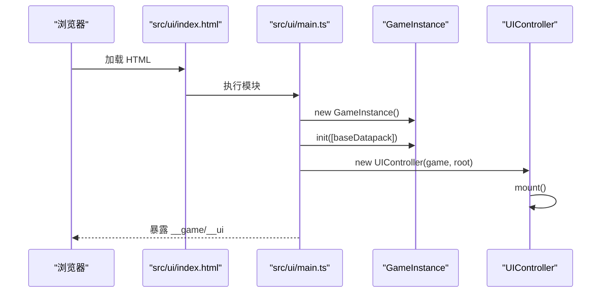
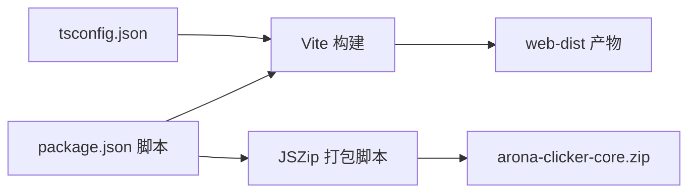

# 部署构建

<cite>
**本文引用的文件**
- [vite.config.ts](file://vite.config.ts)
- [package.json](file://package.json)
- [index.html](file://index.html)
- [src/ui/index.html](file://src/ui/index.html)
- [src/ui/main.ts](file://src/ui/main.ts)
- [scripts/pack-arona-clicker-core.mjs](file://scripts/pack-arona-clicker-core.mjs)
- [scripts/gen-engine-schema.mjs](file://scripts/gen-engine-schema.mjs)
- [vitest.config.ts](file://vitest.config.ts)
- [tsconfig.json](file://tsconfig.json)
</cite>

## 目录
1. [简介](#简介)
2. [项目结构](#项目结构)
3. [核心组件](#核心组件)
4. [架构总览](#架构总览)
5. [详细组件分析](#详细组件分析)
6. [依赖分析](#依赖分析)
7. [性能考虑](#性能考虑)
8. [故障排查指南](#故障排查指南)
9. [结论](#结论)
10. [附录](#附录)

## 简介
本文件面向 ACProgram 项目的部署与构建，聚焦 Vite 多入口构建、开发/预览服务、数据打包脚本以及不同目标的发布策略。文档覆盖：
- 开发环境与生产环境的构建配置差异与优化点
- 插件与路由映射（MPA）
- 构建产物结构与输出目录
- 数据包打包与版本管理
- 静态资源发布、CDN 与缓存策略建议
- Web、移动端、桌面端适配要点
- 性能优化最佳实践（代码分割、预加载、懒加载）
- CI/CD 流水线与自动化部署参考

## 项目结构
本项目采用多页面应用（MPA）组织方式，通过 Vite 的 Rollup input 同时构建三个入口：
- portal：根级 index.html，作为本地工具台门户
- game：src/ui/index.html，游戏主程序
- editor：tools/datapack-editor/ui/index.html，数据编辑器

图表来源
- [vite.config.ts:12-34](file://vite.config.ts#L12-L34)
- [vite.config.ts:45-57](file://vite.config.ts#L45-L57)
- [index.html:116-135](file://index.html#L116-L135)
- [src/ui/index.html:1-13](file://src/ui/index.html#L1-L13)
- [src/ui/main.ts:1-35](file://src/ui/main.ts#L1-L35)

章节来源
- [vite.config.ts:1-59](file://vite.config.ts#L1-L59)
- [package.json:6-14](file://package.json#L6-L14)
- [index.html:1-139](file://index.html#L1-L139)
- [src/ui/index.html:1-13](file://src/ui/index.html#L1-L13)
- [src/ui/main.ts:1-35](file://src/ui/main.ts#L1-L35)

## 核心组件
- Vite 构建配置
  - 多入口定义：portal、game、editor
  - 输出目录：web-dist（与 tsc outDir 隔离）
  - 开发/预览端口：5173/4173
  - 自定义插件：mpaRoutes，提供 /game、/editor 的 302 跳转
- 包脚本
  - dev/dev:game/dev:editor/build：基于 vite 的开发与构建命令
  - pack-arona-clicker-core.mjs：将 datapack/AronaClickerCore 下所有 JSON 打包为 arona-clicker-core.zip
  - gen-engine-schema.mjs：从 src/engine/types 生成 Schema 描述供编辑器使用
- 测试配置
  - vitest.config.ts：包含 tests 与 tools 下的测试，Node 环境运行

章节来源
- [vite.config.ts:36-57](file://vite.config.ts#L36-L57)
- [package.json:6-14](file://package.json#L6-L14)
- [scripts/pack-arona-clicker-core.mjs:1-53](file://scripts/pack-arona-clicker-core.mjs#L1-L53)
- [scripts/gen-engine-schema.mjs:1-285](file://scripts/gen-engine-schema.mjs#L1-L285)
- [vitest.config.ts:1-9](file://vitest.config.ts#L1-L9)

## 架构总览
下图展示了从浏览器访问到各入口页面的请求流程，以及 MPA 路由插件的作用。

图表来源
- [vite.config.ts:12-34](file://vite.config.ts#L12-L34)
- [vite.config.ts:36-44](file://vite.config.ts#L36-L44)
- [index.html:116-135](file://index.html#L116-L135)

## 详细组件分析

### Vite 构建与多入口
- 多入口：通过 RollupOptions.input 定义 portal、game、editor 三个 HTML 入口，分别对应根门户、游戏 UI 和数据编辑器 UI。
- 输出目录：构建产物统一输出至 web-dist，便于与 TypeScript 编译产物分离。
- 开发/预览：开发服务器默认打开根路径；预览服务器独立端口，便于验证构建产物。
- 自定义插件：mpaRoutes 在开发与预览阶段对 /game、/editor 进行 302 重定向，简化 URL 并复用同一套映射。

图表来源
- [vite.config.ts:45-57](file://vite.config.ts#L45-L57)

章节来源
- [vite.config.ts:1-59](file://vite.config.ts#L1-L59)

### 数据包打包脚本
- 功能：递归收集 datapack/AronaClickerCore 下的所有 .json 文件，按相对路径保留目录结构，压缩为 arona-clicker-core.zip。
- 用途：将分散的数据分片打包为单一压缩包，便于分发或嵌入运行时加载。
- 行为：未找到 JSON 时退出并报错；成功时输出文件大小统计。

图表来源
- [scripts/pack-arona-clicker-core.mjs:17-53](file://scripts/pack-arona-clicker-core.mjs#L17-L53)

章节来源
- [scripts/pack-arona-clicker-core.mjs:1-53](file://scripts/pack-arona-clicker-core.mjs#L1-L53)

### 引擎 Schema 生成脚本
- 功能：从 src/engine/types 中解析接口/类型/枚举，生成编辑器所需的 schema 描述（defMap/defs），用于 Datapack Editor 的表格化编辑体验。
- 用法：支持 --write 写入到 tools/datapack-editor/schema/engine-defs.gen.json；否则仅打印摘要。
- 价值：保持编辑器与引擎类型同步，减少手工维护成本。

图表来源
- [scripts/gen-engine-schema.mjs:208-285](file://scripts/gen-engine-schema.mjs#L208-L285)

章节来源
- [scripts/gen-engine-schema.mjs:1-285](file://scripts/gen-engine-schema.mjs#L1-L285)

### 游戏 UI 入口与初始化
- 入口 HTML：src/ui/index.html 挂载 #app 容器并引入 main.ts。
- 启动逻辑：main.ts 初始化 GameInstance，注入基础数据包 baseDatapack，创建并挂载 UIController，同时将实例暴露到 window 以便调试。

图表来源
- [src/ui/index.html:1-13](file://src/ui/index.html#L1-L13)
- [src/ui/main.ts:1-35](file://src/ui/main.ts#L1-L35)

章节来源
- [src/ui/index.html:1-13](file://src/ui/index.html#L1-L13)
- [src/ui/main.ts:1-35](file://src/ui/main.ts#L1-L35)

### 测试配置
- Vitest 配置：包含 tests 与 tools 下的测试文件，使用 Node 环境运行，便于快速验证引擎与工具链逻辑。

章节来源
- [vitest.config.ts:1-9](file://vitest.config.ts#L1-L9)

## 依赖分析
- 构建期依赖
  - Vite：前端构建与开发服务器
  - TypeScript：类型系统与模块解析（bundler 模式）
  - Vitest：单元测试
- 运行期依赖
  - jszip：用于数据包打包与解压（脚本侧）
- 构建产物
  - web-dist：包含 portal、game、editor 三套静态资源

图表来源
- [package.json:6-14](file://package.json#L6-L14)
- [package.json:21-23](file://package.json#L21-L23)
- [vite.config.ts:45-57](file://vite.config.ts#L45-L57)
- [tsconfig.json:1-19](file://tsconfig.json#L1-L19)

章节来源
- [package.json:1-25](file://package.json#L1-L25)
- [tsconfig.json:1-19](file://tsconfig.json#L1-L19)
- [vite.config.ts:45-57](file://vite.config.ts#L45-L57)

## 性能考虑
以下为通用优化建议，结合当前多入口与静态资源结构给出落地思路：
- 代码分割
  - 利用 Vite/Rollup 自动按入口与动态 import 进行分割；确保公共库被提取到共享 chunk，减少重复加载。
  - 对大型第三方库（如可视化/富文本）采用按需引入或异步加载。
- 资源优化
  - 图片/媒体资源使用现代格式（WebP/AVIF），按需尺寸裁剪；启用浏览器缓存与 CDN 长缓存。
  - CSS 与 JS 开启压缩与内容哈希（Vite 默认已处理）。
- 预加载与懒加载
  - 首屏关键资源使用 <link rel="modulepreload"> 或 Vite 内置提示；非关键模块使用动态 import() 懒加载。
  - 编辑器与游戏可拆分加载，避免一次性拉取全部资源。
- 缓存策略
  - 静态资源文件名带内容哈希，服务端设置长期缓存；HTML 不缓存或短缓存以保证更新及时。
  - 对数据包 zip 也建议 CDN 长缓存，配合版本号切换。
- 移动端适配
  - 视口与触摸事件优化；按需禁用桌面端特性；控制首屏体积与网络请求数。
- 桌面端适配
  - 若通过 Electron/Tauri 等封装，注意 Node API 可用性与安全策略；合理划分渲染进程与主进程职责。

[本节为通用指导，不直接分析具体文件]

## 故障排查指南
- 构建失败
  - 检查入口 HTML 是否存在且路径正确；确认 vite.config.ts 中的 input 映射无误。
  - 清理 web-dist 后重试，避免旧产物干扰。
- 开发/预览端口冲突
  - 修改 server.port 或 preview.port，或关闭占用该端口的进程。
- 数据包打包异常
  - 确认 datapack/AronaClickerCore 存在且包含 .json 文件；脚本会在无文件时报错退出。
- Schema 生成问题
  - 若 types 目录变更，重新运行脚本以同步编辑器 schema；必要时查看控制台输出的 defMap 摘要定位缺失项。
- 测试无法运行
  - 确认 vitest 配置 include 路径与实际测试文件位置一致；Node 环境下缺少 DOM 相关 API 需调整测试环境或 mock。

章节来源
- [vite.config.ts:36-57](file://vite.config.ts#L36-L57)
- [scripts/pack-arona-clicker-core.mjs:38-53](file://scripts/pack-arona-clicker-core.mjs#L38-L53)
- [scripts/gen-engine-schema.mjs:269-285](file://scripts/gen-engine-schema.mjs#L269-L285)
- [vitest.config.ts:1-9](file://vitest.config.ts#L1-L9)

## 结论
ACProgram 通过 Vite 的多入口能力，将门户、游戏与编辑器统一纳入同一构建管线，并以自定义插件简化开发/预览阶段的 URL 映射。配合数据包打包与 Schema 生成脚本，实现了数据与工具的协同迭代。生产部署时，建议结合 CDN 与缓存策略，持续优化首屏与交互性能，并根据目标平台（Web/移动/桌面）做针对性适配。

[本节为总结性内容，不直接分析具体文件]

## 附录

### 构建与运行命令速查
- 开发
  - npm run dev：启动门户与 MPA 路由
  - npm run dev:game：仅启动游戏入口
  - npm run dev:editor：仅启动编辑器入口
- 构建
  - npm run build：构建 portal/game/editor 三套产物至 web-dist
- 数据与工具
  - node scripts/pack-arona-clicker-core.mjs：打包数据包为 zip
  - npm run gen:schema：生成引擎 schema（写入 tools/datapack-editor/schema）

章节来源
- [package.json:6-14](file://package.json#L6-L14)
- [scripts/pack-arona-clicker-core.mjs:1-53](file://scripts/pack-arona-clicker-core.mjs#L1-L53)
- [scripts/gen-engine-schema.mjs:269-285](file://scripts/gen-engine-schema.mjs#L269-L285)

### 部署流程建议
- 静态资源发布
  - 将 web-dist 整体发布至静态托管（如 Nginx、对象存储+CDN）。
  - 确保 /game、/editor 路由在服务端可正常访问（开发阶段由 Vite 插件处理，生产需由服务器或反向代理保证）。
- CDN 与缓存
  - 对静态资源启用强缓存（带内容哈希），HTML 短缓存或不缓存。
  - 数据包 zip 同样走 CDN，并通过版本号或查询参数触发刷新。
- 环境变量与多目标
  - 如需区分环境（dev/prod），可在构建时传入变量并在源码中通过 Vite 注入的方式消费。
  - 移动端/桌面端可通过条件编译或运行时检测差异化加载资源。

[本节为通用指导，不直接分析具体文件]

### CI/CD 流水线参考
- 步骤建议
  - 安装依赖：npm ci
  - 类型检查与测试：npm test
  - 构建产物：npm run build
  - 打包数据包：node scripts/pack-arona-clicker-core.mjs
  - 生成 Schema：npm run gen:schema
  - 上传产物：将 web-dist 与 zip 上传至发布目标（CDN/对象存储）
- 缓存与并行
  - 缓存 node_modules 与构建缓存目录，提升二次构建速度。
  - 测试与构建可并行执行以提升流水线吞吐。

[本节为通用指导，不直接分析具体文件]