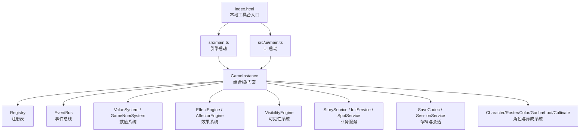
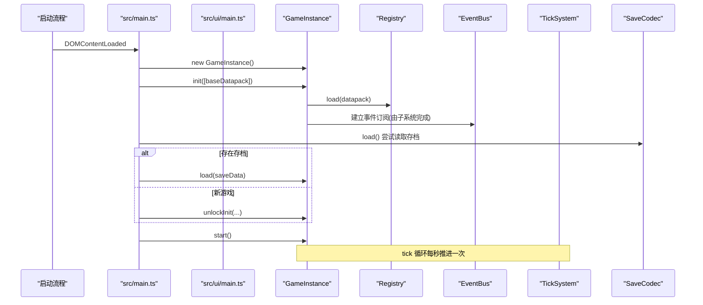
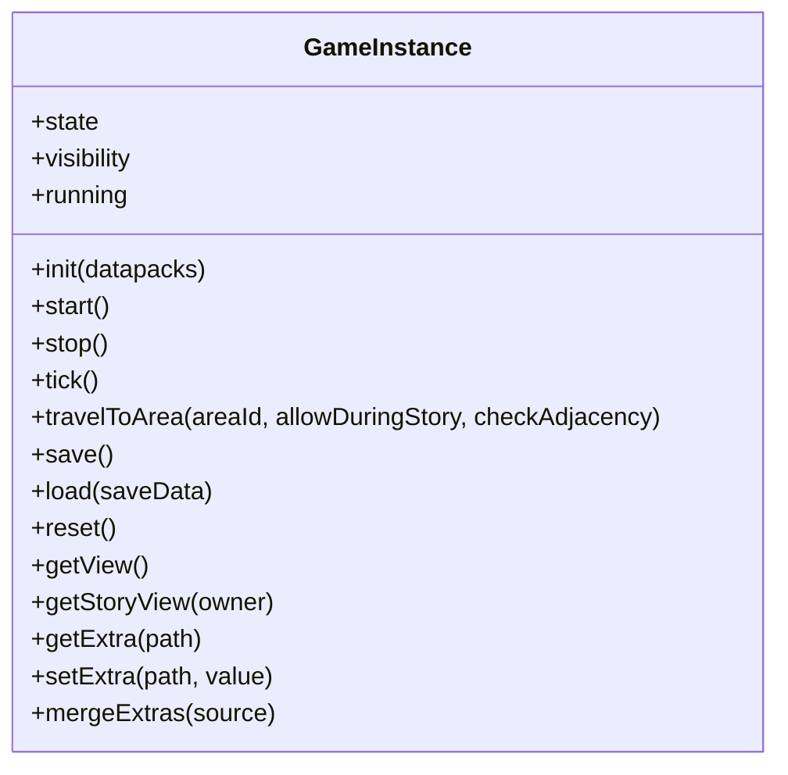
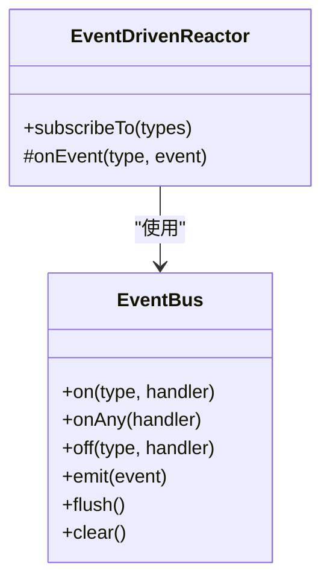
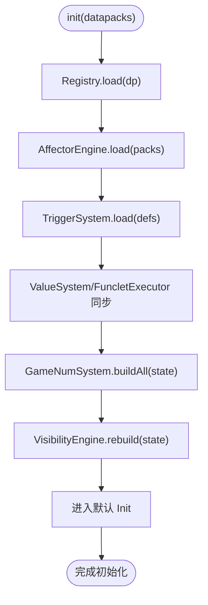
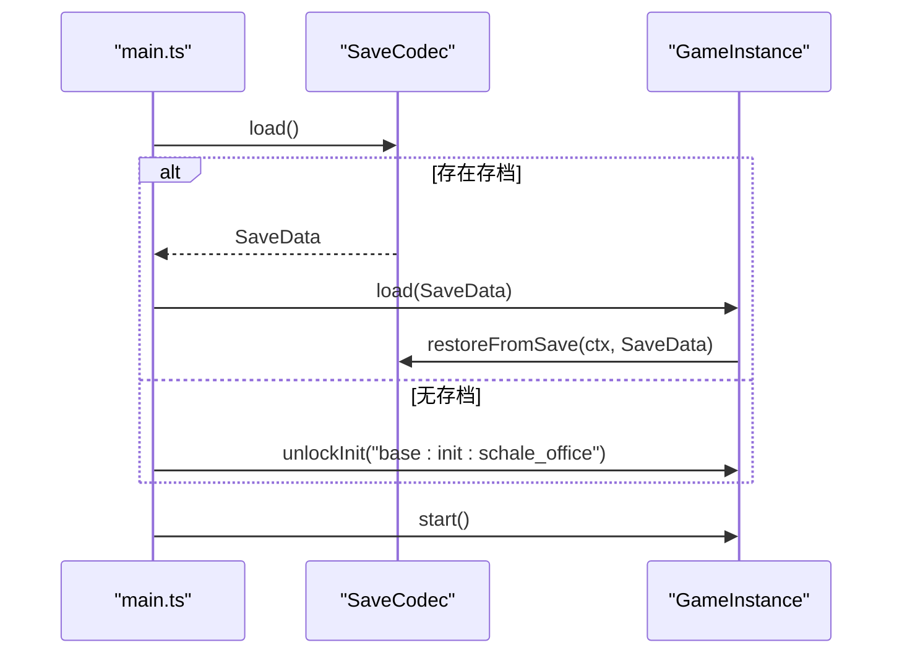
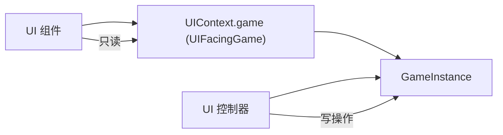
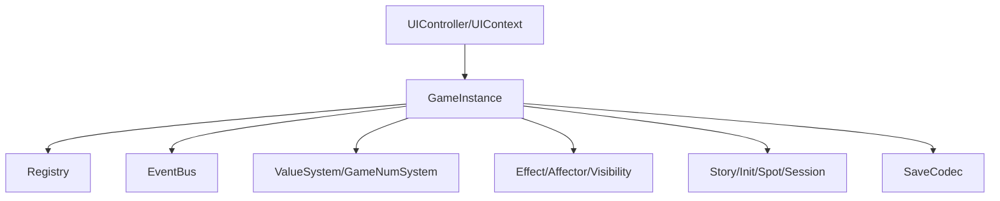

# 项目概述

<cite>
**本文引用的文件**
- [package.json](file://package.json)
- [index.html](file://index.html)
- [src/main.ts](file://src/main.ts)
- [src/ui/main.ts](file://src/ui/main.ts)
- [src/engine/game-instance.ts](file://src/engine/game-instance.ts)
- [src/engine/core/event-bus.ts](file://src/engine/core/event-bus.ts)
- [src/engine/effect/event-driven-reactor.ts](file://src/engine/effect/event-driven-reactor.ts)
- [src/data/index.ts](file://src/data/index.ts)
- [src/engine/game/save-codec.ts](file://src/engine/game/save-codec.ts)
- [src/ui/context.ts](file://src/ui/context.ts)
- [docs-824/05-architecture-review.md](file://docs-824/05-architecture-review.md)
</cite>

## 目录
1. [简介](#简介)
2. [项目结构](#项目结构)
3. [核心组件](#核心组件)
4. [架构总览](#架构总览)
5. [详细组件分析](#详细组件分析)
6. [依赖关系分析](#依赖关系分析)
7. [性能考量](#性能考量)
8. [故障排查指南](#故障排查指南)
9. [结论](#结论)
10. [附录：快速开始](#附录快速开始)

## 简介
ACProgram（AronaClicker）是一款以《蔚蓝档案》为主题的放置/点击类游戏引擎。其核心目标是为“数据驱动 + 事件驱动 + 模块化”的放置类玩法提供可复用、可扩展、可测试的运行时与工具链，同时配套数据包编辑器和本地开发服务，便于内容创作与调试。

技术栈概览
- 前端工程化：Vite、TypeScript、Vitest
- 运行环境：浏览器（ES Module）
- 关键依赖：JSZip（用于数据包加载与资源处理）
- 构建脚本：自定义脚本生成 Schema、打包核心数据包等

设计理念
- 数据驱动：游戏内容以数据包（Datapack）形式声明，引擎在初始化时加载并构建索引、数值树与触发器索引，运行时仅消费只读视图。
- 事件驱动：子系统通过 EventBus 订阅特定事件类型，基于声明式依赖进行定向重算与命中动作，避免全量扫描。
- 模块化：引擎按职责拆分为注册表、数值系统、效果系统、可见性系统、角色/图鉴/颜色/抽卡/掉落/培养/设施/剧情等服务；UI 层通过只读门面访问引擎能力，写操作集中在控制器层。

**章节来源**
- [package.json:1-25](file://package.json#L1-L25)
- [docs-824/05-architecture-review.md:1-35](file://docs-824/05-architecture-review.md#L1-L35)

## 项目结构
仓库采用分层组织：
- src/engine：引擎核心与子系统（数值、效果、可见性、角色、图鉴、颜色、抽卡、掉落、培养、设施、剧情、会话、存档等）
- src/ui：用户界面（组件、样式、控制器、上下文、主题、导入导出等）
- src/data：基础数据包入口（baseDatapack）
- datapack：实际数据包 JSON（区域、设施、故事、物品、掉落表、触发器等）
- tools/datapack-editor：Schema 驱动的表格化数据包编辑器
- scripts：构建与生成脚本
- tests：单元测试覆盖引擎与 UI

**图表来源**
- [src/main.ts:1-59](file://src/main.ts#L1-L59)
- [src/ui/main.ts:1-35](file://src/ui/main.ts#L1-L35)
- [src/engine/game-instance.ts:70-124](file://src/engine/game-instance.ts#L70-L124)

**章节来源**
- [index.html:1-139](file://index.html#L1-L139)
- [src/main.ts:1-59](file://src/main.ts#L1-L59)
- [src/ui/main.ts:1-35](file://src/ui/main.ts#L1-L35)

## 核心组件
- GameInstance：引擎组合根与门面，装配所有子系统，暴露统一 API（init/tick/travelToArea/save/load/reset 等），并提供只读视图 getView()。
- Registry：数据包的装载、校验与索引构建（inits/areas/spots/items/stories/funcletDefs/characters 等）。
- EventBus：类型安全的事件总线，支持按事件类型订阅、通配订阅、批量 flush。
- EventDrivenReactor：事件驱动反应器基类，强制按事件类型分桶订阅，子类实现 onEvent 进行命中判定与动作。
- SaveCodec：存档序列化/反序列化，恢复状态并重同步各子系统。
- UI Context：为 UI 组件提供只读门面 UIFacingGame，限制组件直接写入 state，确保渲染走快照。

这些组件共同构成“数据加载 → 索引构建 → 数值求值 → 事件驱动更新 → 视图渲染”的闭环。

**章节来源**
- [src/engine/game-instance.ts:70-124](file://src/engine/game-instance.ts#L70-L124)
- [src/engine/core/event-bus.ts:1-84](file://src/engine/core/event-bus.ts#L1-L84)
- [src/engine/effect/event-driven-reactor.ts:1-34](file://src/engine/effect/event-driven-reactor.ts#L1-L34)
- [src/engine/game/save-codec.ts:1-171](file://src/engine/game/save-codec.ts#L1-L171)
- [src/ui/context.ts:25-88](file://src/ui/context.ts#L25-L88)

## 架构总览
整体架构遵循“门面 + 子系统 + 事件总线”的分层模式：
- 门面层：GameInstance 对外暴露稳定接口，隐藏内部复杂装配细节。
- 子系统层：数值、效果、可见性、角色、图鉴、颜色、抽卡、掉落、培养、设施、剧情、会话、存档等模块各司其职。
- 事件层：EventBus 作为跨子系统通信中枢，EventDrivenReactor 提供声明式依赖与定向重算骨架。
- 数据层：Registry 负责数据包装载与索引；SaveCodec 负责持久化；DataPack 提供内容定义。

**图表来源**
- [src/main.ts:20-51](file://src/main.ts#L20-L51)
- [src/ui/main.ts:22-29](file://src/ui/main.ts#L22-L29)
- [src/engine/game-instance.ts:176-229](file://src/engine/game-instance.ts#L176-L229)
- [src/engine/game/save-codec.ts:125-171](file://src/engine/game/save-codec.ts#L125-L171)

**章节来源**
- [src/main.ts:1-59](file://src/main.ts#L1-L59)
- [src/ui/main.ts:1-35](file://src/ui/main.ts#L1-L35)
- [src/engine/game-instance.ts:176-229](file://src/engine/game-instance.ts#L176-L229)

## 详细组件分析

### 引擎核心：GameInstance
- 职责：组合根与门面，装配全部子系统；管理生命周期（init/start/stop/reload/reset）；编排 tick；提供视图与存档 API；暴露业务服务（story/spot/inits/items/enhancements 等）。
- 设计要点：
  - 构造期通过 wiring 注入依赖，保持构造器简洁。
  - init 阶段加载数据包、构建数值树、重建可见性、进入默认 Init。
  - tick 阶段执行产出求值、应用活跃效果、检查对话空间阻断条件、记录统计与日志。
  - save/load 将状态与可见性、剧情游标、统计等序列化为 SaveData 并恢复。

**图表来源**
- [src/engine/game-instance.ts:70-124](file://src/engine/game-instance.ts#L70-L124)
- [src/engine/game-instance.ts:176-229](file://src/engine/game-instance.ts#L176-L229)
- [src/engine/game-instance.ts:247-262](file://src/engine/game-instance.ts#L247-L262)
- [src/engine/game-instance.ts:336-368](file://src/engine/game-instance.ts#L336-L368)

**章节来源**
- [src/engine/game-instance.ts:70-124](file://src/engine/game-instance.ts#L70-L124)
- [src/engine/game-instance.ts:176-229](file://src/engine/game-instance.ts#L176-L229)
- [src/engine/game-instance.ts:247-262](file://src/engine/game-instance.ts#L247-L262)
- [src/engine/game-instance.ts:336-368](file://src/engine/game-instance.ts#L336-L368)

### 事件驱动与反应器
- EventBus：类型安全的事件分发，支持按类型订阅、通配订阅、批量 flush，避免重复派发。
- EventDrivenReactor：抽象基类，强制按事件类型分桶订阅，子类实现 onEvent 进行命中判定与动作（如 TriggerSystem、VisibilityEngine、AffectorEngine 的条件依赖重估）。

**图表来源**
- [src/engine/core/event-bus.ts:1-84](file://src/engine/core/event-bus.ts#L1-L84)
- [src/engine/effect/event-driven-reactor.ts:1-34](file://src/engine/effect/event-driven-reactor.ts#L1-L34)

**章节来源**
- [src/engine/core/event-bus.ts:1-84](file://src/engine/core/event-bus.ts#L1-L84)
- [src/engine/effect/event-driven-reactor.ts:1-34](file://src/engine/effect/event-driven-reactor.ts#L1-L34)

### 数据驱动与数据包
- baseDatapack：基础数据包入口，集中导出初始内容（区域、设施、故事、物品、掉落表、触发器、角色等）。
- 加载流程：GameInstance.init 中遍历数据包，调用 Registry.load 构建索引，加载 affector packs 与 trigger defs，随后同步各子系统（数值、可见性、角色系统等）。

**图表来源**
- [src/data/index.ts:1-6](file://src/data/index.ts#L1-L6)
- [src/engine/game-instance.ts:176-229](file://src/engine/game-instance.ts#L176-L229)

**章节来源**
- [src/data/index.ts:1-6](file://src/data/index.ts#L1-L6)
- [src/engine/game-instance.ts:176-229](file://src/engine/game-instance.ts#L176-L229)

### 存档与持久化
- SaveCodec：定义 SaveData 结构（版本、时间戳、玩家状态、可见性快照、剧情游标、聊天游标、统计等），提供 restoreFromSave 恢复逻辑，重同步各子系统。
- 启动流程：main.ts 尝试加载存档，若存在则恢复，否则解锁默认 Init。

**图表来源**
- [src/main.ts:20-51](file://src/main.ts#L20-L51)
- [src/engine/game/save-codec.ts:125-171](file://src/engine/game/save-codec.ts#L125-L171)

**章节来源**
- [src/main.ts:20-51](file://src/main.ts#L20-L51)
- [src/engine/game/save-codec.ts:125-171](file://src/engine/game/save-codec.ts#L125-L171)

### UI 层与只读纪律
- UIContext：为组件提供只读门面 UIFacingGame，包含 state、registry、查询系统与显示名工具等，禁止组件直接写入 state。
- 控制器层：持有完整 GameInstance，负责命令编排与写操作；组件仅消费 view 快照与只读查询。

**图表来源**
- [src/ui/context.ts:25-88](file://src/ui/context.ts#L25-L88)
- [src/ui/main.ts:22-29](file://src/ui/main.ts#L22-L29)

**章节来源**
- [src/ui/context.ts:25-88](file://src/ui/context.ts#L25-L88)
- [src/ui/main.ts:22-29](file://src/ui/main.ts#L22-L29)

## 依赖关系分析
- 强耦合点：GameInstance 依赖全部子系统，是组合根；types/entities 是全项目类型事实源，影响拆分顺序。
- 解耦策略：
  - 通过 EventBus 与 EventDrivenReactor 降低子系统间直接耦合。
  - 通过只读门面（UIFacingGame）隔离 UI 对引擎状态的访问。
  - 通过 SaveCodec 将持久化逻辑从 GameInstance 中剥离。

**图表来源**
- [src/engine/game-instance.ts:70-124](file://src/engine/game-instance.ts#L70-L124)
- [docs-824/05-architecture-review.md:220-235](file://docs-824/05-architecture-review.md#L220-L235)

**章节来源**
- [docs-824/05-architecture-review.md:220-255](file://docs-824/05-architecture-review.md#L220-L255)

## 性能考量
- 事件驱动精确失效：通过事件类型分桶订阅与条件依赖索引，仅在相关依赖变化时定向重算，避免全量扫描。
- 数值系统缓存：GameNumSystem 维护 gain 树与缓存，未受影响的子树跨帧保持缓存，减少重复计算。
- 可见性增量更新：VisibilityEngine 基于事件驱动增量更新，不在每帧全量重算。
- 会话与统计：SessionService 与 StatsService 记录 tick 与统计，辅助性能分析与优化定位。

[本节为通用性能讨论，不直接分析具体文件]

## 故障排查指南
- 启动失败或无内容：确认 baseDatapack 已正确加载，Registry 是否成功构建索引（inits/areas/spots 等）。
- 事件未触发：检查 EventDrivenReactor 是否正确 subscribeTo 所需事件类型，确认 EventBus.emit 调用路径。
- 存档恢复异常：核对 SaveData 版本与字段完整性，确认 restoreFromSave 后各子系统 setState 与 reconcileMounts 是否执行。
- UI 不刷新：确认组件通过 UIContext 获取 view 快照，避免直接读取 game.state；检查控制器是否正确挂载与事件绑定。

**章节来源**
- [src/engine/core/event-bus.ts:1-84](file://src/engine/core/event-bus.ts#L1-L84)
- [src/engine/effect/event-driven-reactor.ts:1-34](file://src/engine/effect/event-driven-reactor.ts#L1-L34)
- [src/engine/game/save-codec.ts:125-171](file://src/engine/game/save-codec.ts#L125-L171)
- [src/ui/context.ts:25-88](file://src/ui/context.ts#L25-L88)

## 结论
ACProgram 以数据驱动为核心，结合事件驱动与模块化设计，提供了高内聚、低耦合的游戏引擎。GameInstance 作为组合根统一管理生命周期与子系统协作；EventBus 与 EventDrivenReactor 保障高效的事件响应与精确失效；UI 层通过只读门面确保渲染稳定性与可维护性。配合数据包编辑器与本地开发服务，形成完整的开发与内容创作闭环。

[本节为总结性内容，不直接分析具体文件]

## 附录：快速开始
- 安装与运行
  - 使用包管理器安装依赖（参考 package.json 中的 devDependencies 与 dependencies）。
  - 启动开发服务器：npm run dev（本地工具台）、npm run dev:game（游戏）、npm run dev:editor（数据包编辑器）。
- 启动流程
  - 浏览器打开 index.html，选择“游戏”或“编辑器”。
  - 游戏入口会创建 GameInstance，加载 baseDatapack，尝试加载存档，若无存档则解锁默认 Init，最后启动 tick 循环。
- 基本使用
  - 通过 UI 控制器与组件交互，所有写操作经控制器调用 GameInstance 的写方法。
  - 查看只读视图：通过 UIContext.game.view 获取当前渲染快照。
  - 调试：可通过 window.__game 与 window.__ui 访问实例与控制器。

**章节来源**
- [package.json:6-13](file://package.json#L6-L13)
- [index.html:116-136](file://index.html#L116-L136)
- [src/main.ts:20-51](file://src/main.ts#L20-L51)
- [src/ui/main.ts:22-35](file://src/ui/main.ts#L22-L35)