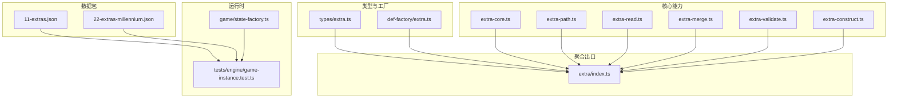
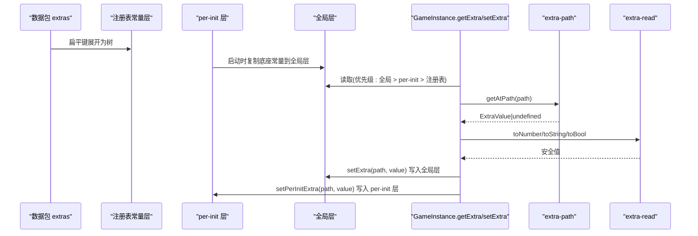
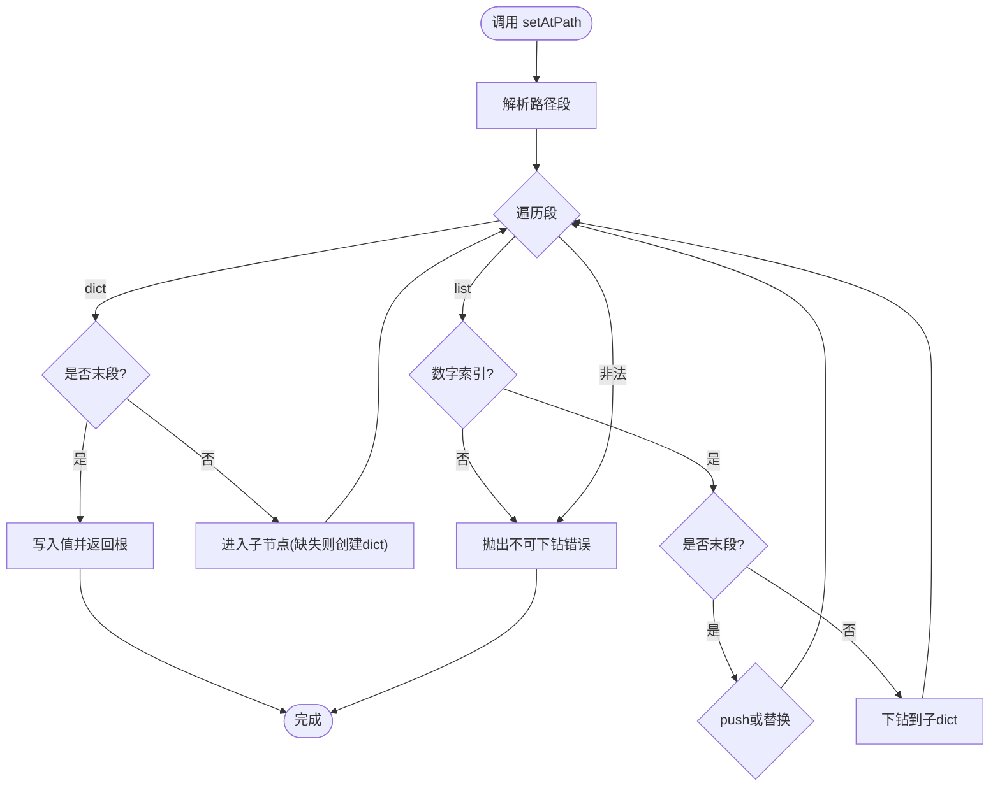
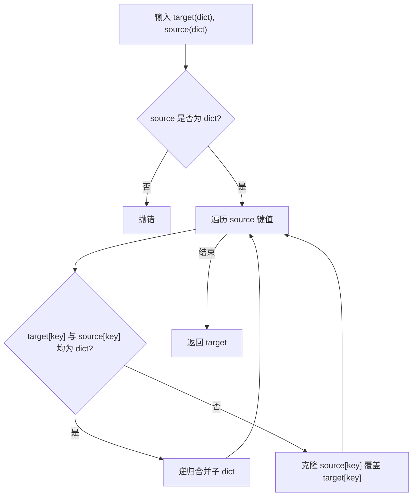
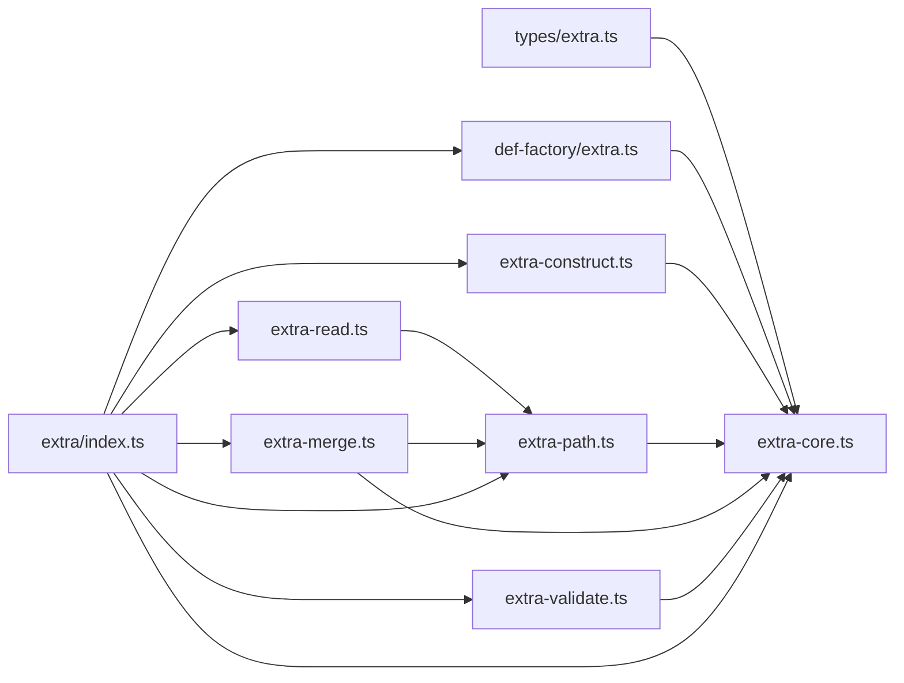

# 额外数据系统

<cite>
**本文引用的文件**
- [src/engine/types/extra.ts](file://src/engine/types/extra.ts)
- [src/engine/def-factory/extra.ts](file://src/engine/def-factory/extra.ts)
- [src/engine/extra/index.ts](file://src/engine/extra/index.ts)
- [src/engine/extra/extra-core.ts](file://src/engine/extra/extra-core.ts)
- [src/engine/extra/extra-construct.ts](file://src/engine/extra/extra-construct.ts)
- [src/engine/extra/extra-path.ts](file://src/engine/extra/extra-path.ts)
- [src/engine/extra/extra-read.ts](file://src/engine/extra/extra-read.ts)
- [src/engine/extra/extra-merge.ts](file://src/engine/extra/extra-merge.ts)
- [src/engine/extra/extra-validate.ts](file://src/engine/extra/extra-validate.ts)
- [datapack/AronaClickerCore/11-extras.json](file://datapack/AronaClickerCore/11-extras.json)
- [datapack/AronaClickerCore/22-extras-millennium.json](file://datapack/AronaClickerCore/22-extras-millennium.json)
- [tests/engine/extra.test.ts](file://tests/engine/extra.test.ts)
- [src/engine/game/state-factory.ts](file://src/engine/game/state-factory.ts)
- [tests/engine/game-instance.test.ts](file://tests/engine/game-instance.test.ts)
</cite>

## 更新摘要
**所做更改**
- 更新了数据结构与作用域管理章节，详细说明了 ExtraValue 类型的六种变体及其语义
- 增强了数据树结构的说明，包括路径约定和命名空间划分
- 完善了读写操作的实现细节，包括严格的路径解析和类型守卫
- 补充了数据合并机制的优先级规则和冲突解决策略
- 增加了与游戏其他模块集成的详细说明，包括配置覆盖和运行时修改
- 提供了更详细的配置示例和使用模式
- 强化了数据验证、错误处理和性能优化的最佳实践

## 目录
1. [简介](#简介)
2. [项目结构](#项目结构)
3. [核心组件](#核心组件)
4. [架构总览](#架构总览)
5. [详细组件分析](#详细组件分析)
6. [依赖关系分析](#依赖关系分析)
7. [性能考量](#性能考量)
8. [故障排查指南](#故障排查指南)
9. [结论](#结论)
10. [附录](#附录)

## 简介
本技术文档围绕 ACProgram 的"额外数据系统（Extra）"展开，系统性说明其数据结构、作用域与命名空间约定、读写与变更通知、合并机制、与游戏其他模块的集成方式，以及配置示例、使用模式、验证与错误处理、性能优化最佳实践。Extra 采用类 NBT 的树形结构，通过路径寻址实现跨层级访问，并以"全局层 > per-init 层 > 注册表常量层"的优先级读取，支持运行时覆盖与增量更新。

## 项目结构
Extra 子系统按关注点拆分：类型定义、工厂构造、路径解析、读写、合并、校验与聚合导出；数据包以扁平键形式提供常量 Extra；运行时状态在 GameInstance 中维护多层 Extra 并对外暴露统一访问接口。

**图表来源**
- [src/engine/extra/index.ts:1-17](file://src/engine/extra/index.ts#L1-L17)
- [src/engine/types/extra.ts:1-29](file://src/engine/types/extra.ts#L1-L29)
- [src/engine/def-factory/extra.ts:1-17](file://src/engine/def-factory/extra.ts#L1-L17)
- [src/engine/extra/extra-core.ts:1-37](file://src/engine/extra/extra-core.ts#L1-L37)
- [src/engine/extra/extra-path.ts:1-126](file://src/engine/extra/extra-path.ts#L1-L126)
- [src/engine/extra/extra-read.ts:1-43](file://src/engine/extra/extra-read.ts#L1-L43)
- [src/engine/extra/extra-merge.ts:1-64](file://src/engine/extra/extra-merge.ts#L1-L64)
- [src/engine/extra/extra-validate.ts:1-61](file://src/engine/extra/extra-validate.ts#L1-L61)
- [src/engine/extra/extra-construct.ts:1-57](file://src/engine/extra/extra-construct.ts#L1-L57)
- [datapack/AronaClickerCore/11-extras.json:1-9](file://datapack/AronaClickerCore/11-extras.json#L1-L9)
- [datapack/AronaClickerCore/22-extras-millennium.json:1-10](file://datapack/AronaClickerCore/22-extras-millennium.json#L1-L10)
- [src/engine/game/state-factory.ts:1-31](file://src/engine/game/state-factory.ts#L1-L31)
- [tests/engine/game-instance.test.ts:1178-1236](file://tests/engine/game-instance.test.ts#L1178-L1236)

**章节来源**
- [src/engine/extra/index.ts:1-17](file://src/engine/extra/index.ts#L1-L17)
- [src/engine/types/extra.ts:1-29](file://src/engine/types/extra.ts#L1-L29)

## 核心组件
- **数据类型与路径约定**：ExtraValue 为带判别字段的联合类型，包含 int/float/str/bool/list/dict；ExtraPath 为 / 分隔的路径字符串，dict key 禁止含 /。
- **工厂构造**：extra.* 便捷构造器用于零负担构建 ExtraValue。
- **核心底座**：EXTRA_MAX_DEPTH 深度上限、ExtraError 异常类型、is* 守卫函数、validateDictKey 键合法性校验。
- **构造与克隆**：extraFromJson 将 JSON 转换为 ExtraValue 并校验深度与键；cloneExtra 深拷贝。
- **路径解析与寻址**：parseExtraPath/getAtPath/setAtPath/deleteAtPath 提供严格且安全的读写删除。
- **宽松读取**：toNumber/toString/toBool/readNumber/readString/readBool 提供缺失即默认的安全读取。
- **合并与展开**：mergeExtra 深合并 dict，list/标量整体替换；expandFlatKeys 将扁平键展开为树并检测冲突。
- **校验**：validateExtraValue 收集错误；assertValidExtra 首个错误抛错。

**章节来源**
- [src/engine/types/extra.ts:1-29](file://src/engine/types/extra.ts#L1-L29)
- [src/engine/def-factory/extra.ts:1-17](file://src/engine/def-factory/extra.ts#L1-L17)
- [src/engine/extra/extra-core.ts:1-37](file://src/engine/extra/extra-core.ts#L1-L37)
- [src/engine/extra/extra-construct.ts:1-57](file://src/engine/extra/extra-construct.ts#L1-L57)
- [src/engine/extra/extra-path.ts:1-126](file://src/engine/extra/extra-path.ts#L1-L126)
- [src/engine/extra/extra-read.ts:1-43](file://src/engine/extra/extra-read.ts#L1-L43)
- [src/engine/extra/extra-merge.ts:1-64](file://src/engine/extra/extra-merge.ts#L1-L64)
- [src/engine/extra/extra-validate.ts:1-61](file://src/engine/extra/extra-validate.ts#L1-L61)

## 架构总览
Extra 系统在数据加载与运行时读写的整体流程如下：

**图表来源**
- [src/engine/extra/extra-merge.ts:1-64](file://src/engine/extra/extra-merge.ts#L1-L64)
- [src/engine/extra/extra-path.ts:1-126](file://src/engine/extra/extra-path.ts#L1-L126)
- [src/engine/extra/extra-read.ts:1-43](file://src/engine/extra/extra-read.ts#L1-L43)
- [tests/engine/game-instance.test.ts:1178-1236](file://tests/engine/game-instance.test.ts#L1178-L1236)

## 详细组件分析

### 数据结构与作用域管理
- **数据结构**：ExtraValue 是强类型的树节点，int/float 区分精度语义，list 允许异构元素，dict 作为复合容器。
  - `t: 'int'`：整数类型，用于精确计数和索引
  - `t: 'float'`：浮点数类型，用于精确数值计算
  - `t: 'str'`：字符串类型，用于文本数据和标识符
  - `t: 'bool'`：布尔类型，用于开关和标志位
  - `t: 'list'`：列表类型，允许异构元素集合
  - `t: 'dict'`：字典类型，作为复合容器和组织单元
- **命名空间与层级**：通过路径段划分命名空间（如 meta/balance/millennium），dict key 不得含 /，list 索引使用数字段。
- **作用域**：
  - 注册表常量层：来自数据包 extras 的扁平键展开后的树，作为只读基准。
  - per-init 层：每个 Init 的独立 Extra 集合，隔离不同初始化上下文。
  - 全局层：运行时可写的主 Extra 树，承载玩家状态与动态覆盖。
- **优先级**：getExtra 读取顺序为 全局层 > per-init 层 > 注册表常量层。

**章节来源**
- [src/engine/types/extra.ts:1-29](file://src/engine/types/extra.ts#L1-L29)
- [src/engine/extra/extra-merge.ts:1-64](file://src/engine/extra/extra-merge.ts#L1-L64)
- [tests/engine/game-instance.test.ts:1178-1236](file://tests/engine/game-instance.test.ts#L1178-L1236)

### 读写操作与变更通知
- **读取**：
  - 精确读取：getAtPath 返回 ExtraValue|undefined，缺失不抛错。
  - 宽松读取：readNumber/readString/readBool 提供默认值策略（数值型缺省 0，字符串缺省 ''，布尔缺省 false）。
- **写入**：
  - setAtPath 沿路径写入，自动创建中间 dict，支持 list push/替换，越界或类型不匹配抛错。
  - deleteAtPath 删除指定键或列表项，不存在返回 undefined。
- **变更通知**：
  - 当前 Extra 子系统本身不直接广播事件；变更通常由上层 StateMutationService 或业务系统订阅后触发后续逻辑（例如条件系统、表达式系统消费 Extra 值）。

**图表来源**
- [src/engine/extra/extra-path.ts:42-88](file://src/engine/extra/extra-path.ts#L42-L88)

**章节来源**
- [src/engine/extra/extra-path.ts:1-126](file://src/engine/extra/extra-path.ts#L1-L126)
- [src/engine/extra/extra-read.ts:1-43](file://src/engine/extra/extra-read.ts#L1-L43)

### 数据合并机制
- **深合并规则**：
  - dict 递归合并，同名 key 被 source 覆盖。
  - list 与标量整体替换，不尝试逐元素合并。
  - 源必须为 dict，否则抛错。
  - 合并过程对 source 进行深拷贝，避免别名污染。
- **扁平键展开**：
  - expandFlatKeys 将 'a/b' 形式的键展开为嵌套 dict。
  - 若存在冲突（如同时出现 'a' 与 'a/b'），抛错以保证一致性。
- **增量更新**：
  - 通过 mergeExtra 将补丁树合并到目标树，实现增量覆盖。
  - 结合 setAtPath 可对单点进行细粒度更新。

**图表来源**
- [src/engine/extra/extra-merge.ts:11-31](file://src/engine/extra/extra-merge.ts#L11-L31)

**章节来源**
- [src/engine/extra/extra-merge.ts:1-64](file://src/engine/extra/extra-merge.ts#L1-L64)

### 与游戏其他模块的集成
- **配置覆盖**：
  - 数据包 extras 提供常量基线，启动时复制到全局层，随后可通过 setExtra/mergeExtras 覆盖。
  - per-init 层提供每局初始化的独立 Extra 集合，不影响全局层。
- **运行时修改**：
  - 通过 GameInstance 的 getExtra/setExtra/setPerInitExtra/mergeExtras 等接口进行运行时读写。
  - 测试覆盖了三层优先级与软重启行为。
- **动态加载**：
  - 通过 extraFromJson 可将外部 JSON 动态转为 ExtraValue，便于热更或编辑器导入。
- **表达式与条件系统**：
  - 表达式系统与条件系统通过 toNumber 等宽松读取接口消费 Extra 值，保证容错。

**章节来源**
- [tests/engine/game-instance.test.ts:1178-1236](file://tests/engine/game-instance.test.ts#L1178-L1236)
- [src/engine/extra/extra-construct.ts:1-57](file://src/engine/extra/extra-construct.ts#L1-L57)
- [src/engine/extra/extra-read.ts:1-43](file://src/engine/extra/extra-read.ts#L1-L43)

### 配置示例与使用模式
- **数据包 extras 示例**：
  - 基础包：meta/author、balance/start-credit 等。
  - Millennium 包：millennium/featured、balance/max-pyroxene 等。
- **使用模式**：
  - 常量基线：通过数据包 extras 声明全局可用配置。
  - 初始化注入：startNewGame 时将常量层复制到全局层，确保每局有独立可写副本。
  - 运行时覆盖：setExtra 修改具体路径；mergeExtras 批量合并补丁。
  - 宽松读取：readNumber/readString/readBool 在 UI/表达式中安全取值。

**章节来源**
- [datapack/AronaClickerCore/11-extras.json:1-9](file://datapack/AronaClickerCore/11-extras.json#L1-L9)
- [datapack/AronaClickerCore/22-extras-millennium.json:1-10](file://datapack/AronaClickerCore/22-extras-millennium.json#L1-L10)
- [tests/engine/game-instance.test.ts:1178-1236](file://tests/engine/game-instance.test.ts#L1178-L1236)

### 数据验证、错误处理与健壮性
- **深度限制**：EXTRA_MAX_DEPTH 防止畸形数据导致栈溢出。
- **键合法性**：dict key 非空且不含 /，违反时抛错或记录错误。
- **类型守卫**：isInt/isFloat/isStr/isBool/isList/isDict 用于分支收窄。
- **校验策略**：
  - validateExtraValue 收集所有错误，适合批量校验。
  - assertValidExtra 首个错误即抛，适合静态校验入口。
- **路径安全**：
  - parseExtraPath 拒绝空串、首尾 /、连续 / 等非法路径。
  - setAtPath 对越界索引、类型不匹配进行严格报错，避免静默丢数据。

**章节来源**
- [src/engine/extra/extra-core.ts:1-37](file://src/engine/extra/extra-core.ts#L1-L37)
- [src/engine/extra/extra-validate.ts:1-61](file://src/engine/extra/extra-validate.ts#L1-L61)
- [src/engine/extra/extra-path.ts:1-126](file://src/engine/extra/extra-path.ts#L1-L126)

## 依赖关系分析
Extra 子系统内部依赖清晰，遵循"核心底座 -> 功能模块 -> 聚合导出"的分层：

**图表来源**
- [src/engine/extra/index.ts:1-17](file://src/engine/extra/index.ts#L1-L17)
- [src/engine/extra/extra-core.ts:1-37](file://src/engine/extra/extra-core.ts#L1-L37)
- [src/engine/extra/extra-construct.ts:1-57](file://src/engine/extra/extra-construct.ts#L1-L57)
- [src/engine/extra/extra-path.ts:1-126](file://src/engine/extra/extra-path.ts#L1-L126)
- [src/engine/extra/extra-read.ts:1-43](file://src/engine/extra/extra-read.ts#L1-L43)
- [src/engine/extra/extra-merge.ts:1-64](file://src/engine/extra/extra-merge.ts#L1-L64)
- [src/engine/extra/extra-validate.ts:1-61](file://src/engine/extra/extra-validate.ts#L1-L61)
- [src/engine/def-factory/extra.ts:1-17](file://src/engine/def-factory/extra.ts#L1-L17)
- [src/engine/types/extra.ts:1-29](file://src/engine/types/extra.ts#L1-L29)

**章节来源**
- [src/engine/extra/index.ts:1-17](file://src/engine/extra/index.ts#L1-L17)

## 性能考量
- **深度限制**：EXTRA_MAX_DEPTH=32，避免极端嵌套导致的栈溢出与性能退化。
- **深拷贝成本**：mergeExtra 与 cloneExtra 会复制源树，建议批量合并而非频繁单点覆盖。
- **路径解析**：parseExtraPath 每次读取都会分割路径，高频读取可缓存热点路径结果。
- **宽松读取**：toNumber/toString/toBool 在缺失时快速返回默认值，减少分支判断开销。
- **列表操作**：setAtPath 对 list 的 push/替换为 O(1)，但删除 splice 为 O(n)，应避免大规模删除。
- **内存占用**：Extra 树为纯数据对象，注意控制层级与节点数量，必要时使用压缩或分片存储。

## 故障排查指南
- **常见错误与定位**：
  - 路径非法：检查是否包含空段、首尾 /、连续 /。
  - 键非法：dict key 不能为空或含 /。
  - 列表越界：setAtPath 对超出范围的索引会抛错。
  - 类型不匹配：无法从标量下钻到子节点时会抛错。
  - 深度超限：超过 EXTRA_MAX_DEPTH 会抛错。
- **调试建议**：
  - 使用 validateExtraValue 收集全部错误信息，集中修复。
  - 使用 getAtPath 逐步缩小问题范围，确认路径可达性。
  - 在合并前打印 source/target 的关键键，确认冲突来源。
- **典型场景**：
  - 数据包冲突：expandFlatKeys 检测到 'a' 与 'a/b' 并存时报错，需调整键名。
  - 运行时覆盖未生效：确认写入的是全局层还是 per-init 层，以及读取优先级。

**章节来源**
- [src/engine/extra/extra-path.ts:1-126](file://src/engine/extra/extra-path.ts#L1-L126)
- [src/engine/extra/extra-validate.ts:1-61](file://src/engine/extra/extra-validate.ts#L1-L61)
- [src/engine/extra/extra-merge.ts:1-64](file://src/engine/extra/extra-merge.ts#L1-L64)

## 结论
Extra 系统以强类型树结构为基础，通过严格的路径协议与分层作用域，提供了稳定、可扩展的额外数据存储与访问能力。其设计兼顾了数据包的常量管理与运行时的灵活覆盖，配合宽松的读取接口与完善的校验体系，能够在复杂的游戏逻辑中可靠工作。建议在工程实践中遵循路径与键规范、合理使用合并与克隆、并在关键路径上进行性能与健壮性评估。

## 附录
- **数据结构参考**：
  - ExtraValue：int/float/str/bool/list/dict 六种变体。
  - ExtraCompound：dict 便捷别名。
  - ExtraPath：/ 分隔的路径字符串。
- **常用接口速查**：
  - 构造：extra.int/float/str/bool/list/dict
  - 转换：extraFromJson、cloneExtra
  - 路径：parseExtraPath、getAtPath、setAtPath、deleteAtPath
  - 读取：toNumber、toString、toBool、readNumber、readString、readBool
  - 合并：mergeExtra、expandFlatKeys
  - 校验：validateExtraValue、assertValidExtra
- **配置示例路径**：
  - datapack/AronaClickerCore/11-extras.json
  - datapack/AronaClickerCore/22-extras-millennium.json

**章节来源**
- [src/engine/types/extra.ts:1-29](file://src/engine/types/extra.ts#L1-L29)
- [src/engine/def-factory/extra.ts:1-17](file://src/engine/def-factory/extra.ts#L1-L17)
- [src/engine/extra/extra-construct.ts:1-57](file://src/engine/extra/extra-construct.ts#L1-L57)
- [src/engine/extra/extra-path.ts:1-126](file://src/engine/extra/extra-path.ts#L1-L126)
- [src/engine/extra/extra-read.ts:1-43](file://src/engine/extra/extra-read.ts#L1-L43)
- [src/engine/extra/extra-merge.ts:1-64](file://src/engine/extra/extra-merge.ts#L1-L64)
- [src/engine/extra/extra-validate.ts:1-61](file://src/engine/extra/extra-validate.ts#L1-L61)
- [datapack/AronaClickerCore/11-extras.json:1-9](file://datapack/AronaClickerCore/11-extras.json#L1-L9)
- [datapack/AronaClickerCore/22-extras-millennium.json:1-10](file://datapack/AronaClickerCore/22-extras-millennium.json#L1-L10)