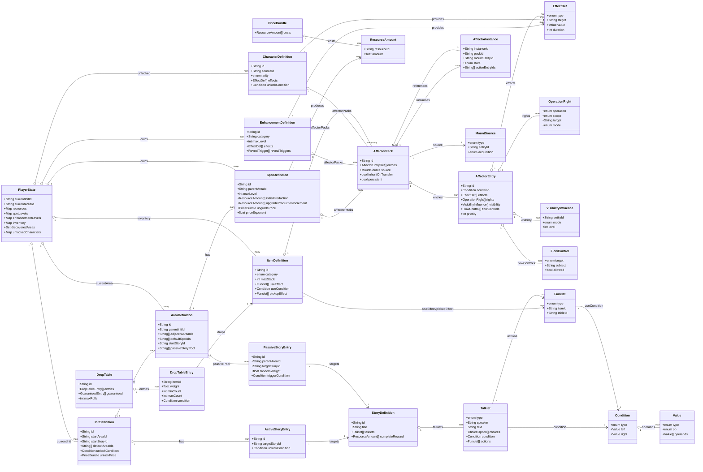

# 数据结构设计

> 本文档定义游戏中所有实体的数据结构。字段使用伪类型标注。文档中所有实体 ID 均采用 `modId:type:id` 格式的三段式标识。

## 实体关系总览



### 关系文本速览

```
Init ──has──→ Area[] ──has──→ Spot[]
 │                              │
 │                              ├── produces ──→ ResourceAmount
 │                              │
 │              ┌───────────────┘
 │              ▼
 │        Enhancement[] ──modifies──→ (公式中的乘区/加区)
 │              │
 │        Character[] ──provides──→ Modifier[]
 │              │
 │        Item[] ──held in──→ PlayerState.inventory
 │              │
 │        DropTable[] ──rolled by──→ LootSystem
 │              │
 │        ActiveStoryEntry[] ──targets──→ Story
 │        PassiveStoryEntry[] ──targets──→ Story
 │
 │        Story ──has──→ Talklet[]
 │
 │        Tag ──collects──→ Entity[] (任意类型)
 │
 └─── PlayerState (运行时)
      └── inventory: Map<itemId, int>
```

## 实体定义

### 资源定义 (ResourceDefinition)

| 字段 | 类型 | 说明 |
|------|------|------|
| id | String | 唯一标识，如 `arona:resource:gold` |
| name | String | 显示名称 |
| icon | String | 图标标识 |
| description | String | 描述文字 |
| baseValue | float | 初始值（对货币类资源有效） |
| persistent | bool | 是否在 Init 切换时继承保留 |

### Init 定义 (InitDefinition)

世界线的起点定义。

| 字段                    | 类型           | 说明                                  |
| --------------------- | ------------ | ----------------------------------- |
| id                    | String       | 唯一标识                                |
| name                  | String       | Init 名称                             |
| description           | String       | 初始描述                                |
| startAreaId           | String       | 初始所在的 Area ID                       |
| worldlineValue        | float        | 世界线数值（0.0-1.0，神圣之塔倾斜率），剧情风味参考       |
| startStoryId          | String?      | 进入时自动触发的主线剧情 ID                     |
| defaultAreaIds        | String[]     | 初始已解锁的 Area ID 列表（至少包含 startAreaId） |
| defaultEnhancementIds | String[]     | 默认可购买的 Enhancement 列表               |
| unlockCondition       | Condition?   | 解锁此 Init 所需的条件                      |
| unlockPrice           | PriceBundle? | 解锁此 Init 所需消耗的资源                    |
| tags                  | String[]     | 标签                                  |

### Area 定义 (AreaDefinition)

地理区域，玩家的可移动单位。

| 字段 | 类型 | 说明 |
|------|------|------|
| id | String | 唯一标识 |
| name | String | 区域名称 |
| description | String | 区域描述 |
| parentInitId | String | 所属 Init |
| adjacentAreaIds | String[] | 相邻可移动区域的 ID 列表（有向连通） |
| defaultSpotIds | String[] | 初始赠送的 Spot ID 列表 |
| defaultEnhancementIds | String[] | 此 Area 关联的 Enhancement 列表 |
| unlockCondition | Condition? | 解锁条件 |
| unlockPrice | PriceBundle? | 解锁价格 |
| startStoryId | String? | 首次进入时触发的主线剧情 ID |
| passiveStoryPool | String[] | 此 Area 的 PassiveStoryEntry ID 池 |
| tags | String[] | 标签 |

### Spot 定义 (SpotDefinition)

放置经营的核心——生产设施。

| 字段 | 类型 | 说明 |
|------|------|------|
| id | String | 唯一标识 |
| name | String | 名称 |
| description | String | 描述文字 |
| parentAreaId | String | 所属 Area |
| maxLevel | int | 最大等级（0 表示无上限） |
| initialProduction | ResourceAmount[] | 首次购买时的基础产出 |
| upgradeProductionIncrement | ResourceAmount[] | 每升一级的固定产出增量 |
| upgradePrice | PriceBundle | 升级价格（从 1→2 级的基础值） |
| priceExponent | float | 价格指数增长系数（公式: `basePrice × exponent^level`） |
| revealTriggers | RevealTrigger[]? | 揭示 Trigger 列表；`unlock` 目标 = 自动解锁条件（条件满足即自动授予） |
| purchasePrice | PriceBundle? | 非空时需要消耗资源购买；为空时直接赠送 |
| affectorPacks | AffectorPackRef[]? | 挂载的效果包装（替代原 effects 字段） |
| tags | String[] | 标签 |

### Enhancement 定义 (EnhancementDefinition)

跨设施的效果加成。

| 字段 | 类型 | 说明 |
|------|------|------|
| id | String | 唯一标识 |
| name | String | 名称 |
| description | String | 描述 |
| category | String | 分类标识（如 `spot_boost`、`resource_boost`） |
| level | int | 当前等级（运行时写入，定义中为初始值 0） |
| maxLevel | int | 最大等级 |
| upgradePrice | PriceBundle? | 升级价格（null 表示一次性购买） |
| priceExponent | float | 价格指数系数 |
| effects | EffectDef[] | 提供的效果列表 |
| affectorPacks | AffectorPackRef[]? | 挂载的效果包装（替代原 effects 字段） |
| revealTriggers | RevealTrigger[]? | 揭示 Trigger 列表；`unlock` 目标 = 实际解锁条件（满足才可购买 / 获得） |
| tags | String[] | 标签 |

### 角色定义 (CharacterDefinition)

可收集的角色，提供全局加成。

| 字段              | 类型                                | 说明                   |
| --------------- | --------------------------------- | -------------------- |
| id              | String                            | 唯一标识                 |
| name            | String                            | 角色名称                 |
| displayName     | String                            | 显示用名称（可包含昵称/称号）      |
| sourceId        | String                            | 本源 ID（同名换皮角色共享本源 ID） |
| description     | String                            | 角色简介                 |
| rarity          | enum { Common, Rare, Super Rare } | 稀有度                  |
| effects         | EffectDef[]                       | 持有后激活的效果列表           |
| affectorPacks   | AffectorPackRef[]?               | 挂载的效果包装（替代原 effects 字段） |
| unlockCondition | Condition                         | 解锁条件                 |
| tags            | String[]                          | 标签                   |

### ActiveStoryEntry 定义

主动进入的主线剧情入口。

| 字段 | 类型 | 说明 |
|------|------|------|
| id | String | 唯一标识 |
| name | String | 入口名称 |
| displayGroup | String | 剧情列表中的分组（如"主线·第一章"） |
| targetStoryId | String | 指向的 Story ID |
| unlockCondition | Condition | 入口出现条件 |
| tags | String[] | 标签 |

### PassiveStoryEntry 定义

聊天触发的随机剧情入口。

| 字段 | 类型 | 说明 |
|------|------|------|
| id | String | 唯一标识 |
| parentAreaId | String | 所属 Area |
| targetStoryId | String | 指向的 Story ID |
| randomWeight | float | 随机抽取权重（权重越高越容易被抽到） |
| triggerCondition | Condition | 抽取条件（不满足时不会出现在抽选池中） |
| tags | String[] | 标签 |

### Story 定义

由 Talklet 序列组成的完整剧情。

| 字段 | 类型 | 说明 |
|------|------|------|
| id | String | 唯一标识 |
| title | String | 剧情标题 |
| talklets | Talklet[] | 按顺序演出的 Talklet 列表 |
| completeReward | ResourceAmount[]? | 完成后奖励 |
| completeActions | Funclet[]? | 完成后执行的附加操作 |

### Talklet（演出单元）

剧情的最小单位。

| 字段 | 类型 | 说明 |
|------|------|------|
| type | enum { Dialogue, Narration, Choice, Branch, Action } | 演出类型 |
| speaker | String? | 发言人（Dialogue 类型必填） |
| text | String | 台词或旁白文本 |
| choices | ChoiceOption[]? | 选项列表（Choice 类型必填） |
| condition | Condition? | 此 Talklet 出现的条件（Branch 类型会按条件选择不同分支） |
| actions | Funclet[]? | 此 Talklet 演出完后执行的操作 |

#### ChoiceOption

| 字段 | 类型 | 说明 |
|------|------|------|
| text | String | 选项文本 |
| targetIndex | int | 跳转到某个 Talklet 索引（-1 表示按顺序继续） |
| condition | Condition? | 此选项可见的条件 |

### Tag 定义

用于跨实体类型聚合统计与条件判断的标签。

| 字段 | 类型 | 说明 |
|------|------|------|
| id | String | 唯一标识 |
| name | String | 标签名称 |
| description | String | 描述 |

### 物品定义 (ItemDefinition)

背包中的可持有物品，支持分类、堆叠、使用效果。

| 字段 | 类型 | 说明 |
|------|------|------|
| id | String | 唯一标识，如 `arona:item:mysterious_gift` |
| name | String | 物品名称 |
| description | String | 描述文本 |
| icon | String | 图标标识 |
| category | enum { consumable, key_item, material, gift } | 物品分类 |
| maxStack | int | 最大堆叠数（1=不可堆叠唯一物品） |
| rarity | enum { common, rare, epic, legendary } | 稀有度 |
| useEffect | Funclet[]? | 使用时执行的效果列表（consumable 必填） |
| useCondition | Condition? | 使用条件 |
| pickupEffect | Funclet[]? | 获得时自动触发的效果（key_item 常用） |
| affectorPacks | AffectorPackRef[]? | 挂载的效果包装（如持有期 buff） |
| sellPrice | ResourceAmount[]? | 出售价格（可选，不填则不可出售） |
| tags | String[] | 标签 |

#### 物品分类行为

| 分类 | 可堆叠 | 可使用 | 自动触发 | 出售 |
|------|--------|--------|----------|------|
| consumable | 是 | 是（useEffect） | 否 | 可 |
| key_item | 否（maxStack=1） | 否 | 是（pickupEffect） | 不可 |
| material | 是 | 否 | 否 | 可 |
| gift | 是 | 是（useEffect） | 否 | 可 |

### 掉落表定义 (DropTable)

用于剧情奖励、条件掉落的随机奖励池。

| 字段 | 类型 | 说明 |
|------|------|------|
| id | String | 唯一标识 |
| entries | DropTableEntry[] | 按权重抽选的条目列表 |
| guaranteed | GuaranteedEntry[]? | 必定获得的条目 |
| maxRolls | int | 抽选次数 |
| rollCondition | Condition? | 整个掉落表的出现条件 |

#### DropTableEntry

| 字段 | 类型 | 说明 |
|------|------|------|
| itemId | String | 物品 ID |
| weight | float | 抽选权重 |
| minCount | int | 最小数量 |
| maxCount | int | 最大数量（在 `[minCount, maxCount]` 间均匀随机） |
| condition | Condition? | 该条目出现条件 |

#### GuaranteedEntry

| 字段 | 类型 | 说明 |
|------|------|------|
| itemId | String | 物品 ID |
| count | int | 数量 |

### 效果定义 (EffectDef)

附着在其他实体上，表达"持有/激活后产生什么影响"。这是**底层数值原语**，只做数值修改，不感知来源实体的生命周期（生命周期由 [[09-affector-system]] 的 Affector 管理）。

| 字段 | 类型 | 说明 |
|------|------|------|
| id | String | 效果标识 |
| type | enum { Multiply, Add, Set, Unlock } | 效果类型 |
| target | String | 目标标识（如 `spot:arona:central:production`） |
| operation | String? | 运算方式（`multiply`, `add`, `percent`） |
| value | Value | 效果数值 |
| duration | int? | 持续时间（tick 数，null 表示永久） |

### 效果条目定义 (AffectorEntry)

自包含的效果单元：一段生效内容，声明自己在满足什么条件时对哪些目标施加哪些影响。**一条目可同时含四类影响，也可只含任意子集。**

| 字段 | 类型 | 说明 |
|------|------|------|
| id | String | 唯一标识 |
| name | String | 显示名（供 UI 展示/日志） |
| condition | Condition? | 生效条件（为空 = 常驻生效） |
| effects | EffectDef[] | 数值影响（复用 EffectDef） |
| rights | OperationRight[] | 操作权声明 |
| visibility | VisibilityInfluence[] | 可见度影响 |
| flowControls | FlowControl[] | 流程控制 |
| priority | int | 优先级（同目标冲突裁决，大者优先） |
| tags | String[] | 标签 |

### 效果包装定义 (AffectorPack)

被挂载的条目集合。包装是"挂到实体上的东西"，一个包装可包含多条条目并声明生命周期语义。

| 字段 | 类型 | 说明 |
|------|------|------|
| id | String | 唯一标识 |
| name | String | 包装名 |
| entries | AffectorEntryRef[] | 条目引用列表（可引用共享条目库） |
| source | MountSource | 挂载来源定义 |
| inheritOnTransfer | bool | 实体转换（如 Init 切换）时是否跟随继承 |
| persistent | bool | 是否需要持久化实例状态（如永久剧情 buff） |
| priority | int | 包装级优先级（整体仲裁） |

#### AffectorEntryRef

| 字段 | 类型 | 说明 |
|------|------|------|
| entryId | String | 引用的条目 ID |
| override | Map<String, Value>? | 对条目字段的可选覆盖（如不同实体引用同一条目但数值不同） |

#### AffectorPackRef

| 字段 | 类型 | 说明 |
|------|------|------|
| packId | String | 引用的包装 ID |
| mountOverride | MountSource? | 覆盖包装的挂载来源（实体可自定义何时挂载） |

#### MountSource（挂载来源）

声明"谁携带这个包装、以什么方式携带"。

| 字段 | 类型 | 说明 |
|------|------|------|
| type | enum { init, area, spot, enhancement, character, item, story, tag, player } | 携带实体类型 |
| entityId | String? | 指定具体实体 ID（null = 匹配 type 下所有） |
| acquisition | enum { on_acquire, on_first_enter, on_complete, on_trigger, manual } | 何时挂载 |

### 效果实例 (AffectorInstance)

运行时挂载在具体实体上的实例，携带三态状态机（Latent/Active/Removed）。

| 字段 | 类型 | 说明 |
|------|------|------|
| instanceId | String | 实例唯一 ID |
| packId | String | 引用的包装定义 ID |
| mountEntityId | String | 挂载的实体 ID |
| mountEntityType | enum { init, area, spot, enhancement, character, item, story, tag, player } | 挂载实体类型 |
| state | enum { Latent, Active, Removed } | 当前状态 |
| activeEntryIds | String[] | 当前处于生效的条目 ID 子集 |
| activatedAtTick | int? | 进入 Active 的时间戳（tick 数） |
| removedAtTick | int? | 进入 Removed 的时间戳 |
| reason | String? | 状态转换原因 |

### 操作权声明 (OperationRight)

控制"玩家能否对某实体执行某操作"。挂载在 AffectorEntry 上。

| 字段 | 类型 | 说明 |
|------|------|------|
| operation | enum { purchase, upgrade, sell, use, travel, start_story, chat } | 被控制的操作 |
| scope | enum { entity, tag, category, all } | 作用范围 |
| target | String? | 具体目标 ID（scope=entity 必填） |
| mode | enum { allow, deny } | allow=放行（绕过常规限制）；deny=拦截（剧情锁） |
| reason | String? | 给玩家的原因文案（被禁止时显示） |

### 可见度影响 (VisibilityInfluence)

强制/提升/压制某实体的可见度级别（与 [[04-systems-modules#VisibilityEngine]] 的 0-5 级联动）。

| 字段 | 类型 | 说明 |
|------|------|------|
| entityId | String | 目标实体 |
| mode | enum { force, atLeast, suppress } | force=设为指定值；atLeast=至少达到；suppress=压到低于 |
| level | int | 可见度级别 |

### 流程控制 (FlowControl)

控制叙事/移动流程的开关（区别于实体操作权，作用于流程节点）。

| 字段 | 类型 | 说明 |
|------|------|------|
| target | enum { active_story, passive_story, chat, travel, init } | 流程类型 |
| subject | String? | 目标实体 ID（null = 全局该流程） |
| allowed | bool | 是否允许 |
| reason | String? | 原因文案 |

### 数值系统 (Value)

所有动态数值的表达式系统。

| 字段 | 类型 | 说明 |
|------|------|------|
| type | enum { Const, Resource, Flag, ResourceTotal, SpotLevel, EnhancementLevel, ItemCount, Tick, Stat, TagStat, Op } | 值来源类型 |
| resourceId | String? | (Resource 类型) 资源 ID |
| flagId | String? | (Flag 类型) 玩家标记 ID |
| spotId | String? | (SpotLevel 类型) Spot ID |
| enhancementId | String? | (EnhancementLevel 类型) Enhancement ID |
| itemId | String? | (ItemCount 类型) 物品 ID |
| tagId | String? | (TagStat 类型) Tag ID |
| statType | enum { Count, SumLevel }? | (TagStat 类型) 统计方式 |
| op | enum { Add, Sub, Mul, Div, Min, Max }? | (Op 类型) 运算操作 |
| operands | Value[]? | (Op 类型) 操作数 |

### 条件系统 (Condition)

| 字段 | 类型 | 说明 |
|------|------|------|
| type | enum { Always, Never, And, Or, Not, Cmp, HasEnhancement, HasSpot, HasTag, HasFlag, AreaExplored, HasItem } | 条件类型 |
| operands | Condition[]? | (And/Or/Not 类型) 子条件 |
| cmpType | enum { Eq, Ne, Gt, Gte, Lt, Lte }? | (Cmp 类型) 比较操作 |
| left | Value? | (Cmp 类型) 左值 |
| right | Value? | (Cmp 类型) 右值 |
| targetId | String? | (HasXxx/HasItem 类型) 目标 ID |
| minCount | Value? | (HasItem 类型) 最低持有数量（默认 1） |

### 函数操作 (Funclet)

对游戏状态的原子修改操作。

| 字段 | 类型 | 说明 |
|------|------|------|
| type | enum { AddResource, SetFlag, GiveSpot, GiveEnhancement, UnlockCharacter, TravelToArea, PlayStory, GiveItem, RemoveItem, RollDropTable, MountAffector, UnmountAffector, Custom } | 操作类型 |
| resourceId | String? | (AddResource) 资源 ID |
| amount | Value? | (AddResource) 数值 |
| flagId | String? | (SetFlag) 标记 ID |
| flagValue | bool? | (SetFlag) 标记值 |
| targetId | String? | (GiveSpot/Enhancement/Travel) 目标 ID |
| storyId | String? | (PlayStory) 剧情 ID |
| itemId | String? | (GiveItem/RemoveItem) 物品 ID |
| count | Value? | (GiveItem/RemoveItem) 数量（默认 1） |
| tableId | String? | (RollDropTable) 掉落表 ID |
| packId | String? | (MountAffector) 要挂载的包装 ID |
| mountEntityId | String? | (MountAffector) 挂载的实体 ID |
| instanceId | String? | (UnmountAffector) 要卸载的实例 ID |
| customAction | String? | (Custom) 自定义操作标识 |

### 价格包 (PriceBundle)

一组资源消耗的集合。

| 字段 | 类型 | 说明 |
|------|------|------|
| costs | ResourceAmount[] | 消耗的资源列表 |
| condition | Condition? | 可支付的额外条件 |

### ResourceAmount

| 字段 | 类型 | 说明 |
|------|------|------|
| resourceId | String | 资源 ID |
| amount | float | 数量（可正可负，正数为获得/消耗，负数为失去/获得返还） |

## 运行时 / 玩家状态

### 玩家状态 (PlayerState)

当前会话的游戏状态（内存中）。

| 字段 | 类型 | 说明 |
|------|------|------|
| currentInitId | String | 当前所在 Init |
| currentAreaId | String | 当前所在 Area |
| resources | Map<String, float> | 持有资源量，键为资源 ID |
| resourceTotals | Map<String, float> | 各资源历史累计获得量（用于条件判断） |
| spotLevels | Map<String, int> | 持有的 Spot 及等级，键为 Spot ID |
| enhancementLevels | Map<String, int> | 持有的 Enhancement 及等级 |
| discoveredAreas | Set<String> | 已解锁的 Area ID |
| unlockedCharacters | Map<String, bool> | 已解锁角色 |
| flags | Map<String, bool> | 玩家标记（用于条件判断） |
| completedStories | Set<String> | 已完成的 Story ID |
| tagCounts | Map<String, TagStat> | Tag 聚合统计（互动次数、激活次数等） |
| chatHistory | int[] | 聊天点击次数记录 |
| inventory | Map<String, int> | 物品背包，键为 itemId，值为持有数量（不超过 maxStack） |
| activeEffects | EffectInstance[] | 当前生效的限时效果（兼容期保留，逐步由 Affector 取代） |
| tickCount | int | 总 tick 数 |

### TagStat

| 字段 | 类型 | 说明 |
|------|------|------|
| interactionCount | int | 与标记模板交互的总次数 |
| activeCount | int | 激活次数 |

### EffectInstance（运行时效果实例）

| 字段 | 类型 | 说明 |
|------|------|------|
| effectDefId | String | 来源 EffectDef ID |
| sourceId | String | 来源实体 ID（如 Spot/Enhancement/Character） |
| remainingTicks | int? | 剩余 tick 数（null 表示永久） |
| value | float | 当前生效的数值 |

## 存档数据 (SaveData)

| 字段 | 类型 | 说明 |
|------|------|------|
| schema | String | 存档格式标识，`arona_save_v1` |
| version | int | 存档版本号 |
| savedAt | int | 存档时间戳 |
| initKey | String | 当前 Init ID |
| areaKey | String | 当前 Area ID |
| tickCount | int | 总 tick 数 |
| player | PlayerState | 完整玩家状态 |
| meta | SaveMeta | 元数据 |

### SaveMeta

| 字段 | 类型 | 说明 |
|------|------|------|
| playTimeSeconds | int | 累计游玩秒数 |
| totalTickCount | int | 累计 tick 数 |
| slotName | String | 存档位名称 |

## 数据包容器结构 (Datapack)

数据包是内容定义的分发单元。引擎在初始化时加载所有数据包，合并到注册表中。

```
Datapack
├── metadata
│   ├── id: String          // modId
│   ├── version: String     // 语义版本号
│   ├── displayName: String
│   └── dependencies: String[]  // 依赖的其他 modId
│
├── resources:    ResourceDefinition[]
├── inits:        InitDefinition[]
├── areas:        AreaDefinition[]
├── spots:        SpotDefinition[]
├── enhancements: EnhancementDefinition[]
├── characters:   CharacterDefinition[]
├── activeStories:   ActiveStoryEntry[]
├── passiveStories:  PassiveStoryEntry[]
├── stories:      StoryDefinition[]
├── items:        ItemDefinition[]
├── dropTables:   DropTable[]
├── affectorPacks: AffectorPack[]   // 效果包装定义
├── affectorEntries: AffectorEntry[] // 共享条目库
├── tags:         Tag[]
└── effects:      EffectDef[]
```

## 关键约束

- **资源持有量**: 引擎以 `float` 存储，不设硬上限。效果引擎可通过 Cap 效果设置软上限。
- **Spot 等级上限**: 由 `maxLevel` 定义，0 表示无上限。引擎不做溢出保护，由设计保证合理性。
- **Init 切换继承**: 仅继承标记为 `persistent: true` 的资源、所有角色、背包物品、以及已完成的 ActiveStory 完成标记。
- **物品持有上限**: 每个物品不超过其 `maxStack`。库存不设总格子数上限。
- **Affector 状态**: AffectorInstance 的派生缓存（Latent/Active 判定）不入存档，加载后由 `recheckAll()` 重建；仅 `persistent: true` 的包装实例存档其 state 与 activatedAtTick。
- **操作权仲裁**: 多个 OperationRight 冲突时以 priority 高者为准；同 priority 时 `deny` 优先（安全默认）。
- **存档大小**: 预估单个存档 < 200KB（含背包后），纯 JSON 文本。
- **实体标识唯一性**: 全局注册表要求 `modId:type:id` 三元组唯一。冲突时以 `priority` 高的数据包为准。
