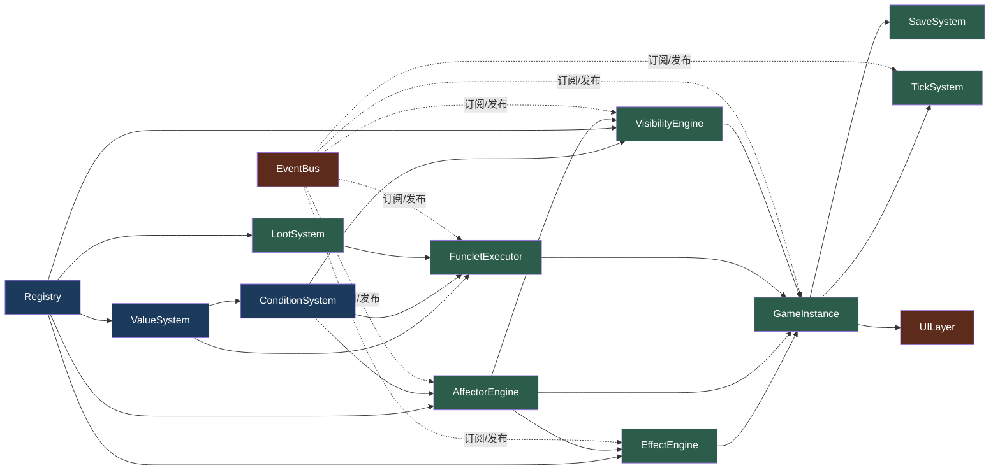

# 系统模块划分

## 模块总览

| 模块名称             | 职责               | 依赖                        |
| ---------------- | ---------------- | ------------------------- |
| Registry         | 存储所有数据包定义，提供查询接口 | 无                         |
| EventBus         | 游戏数据/数值变更反射服务（供派生系统重算） | 无                         |
| ValueSystem      | 动态数值求值           | Registry                  |
| ConditionSystem  | 条件表达式求值          | ValueSystem               |
| FuncletExecutor  | 执行状态修改操作         | PlayerState, Registry     |
| GameInstance     | 核心运行时，协调所有模块     | 所有下层模块                    |
| EffectEngine     | 效果激活/聚合/缓存管理     | Registry, EventBus        |
| VisibilityEngine | 条件驱动的可见性控制       | Registry, ConditionSystem |
| TickSystem       | 挂机产出循环           | GameInstance              |
| SaveSystem       | 序列化/反序列化         | PlayerState               |
| LootSystem       | 掉落表抽选与物品分配     | Registry                 |
| AffectorEngine   | 效果体生命周期与派生管理  | Registry, EventBus        |
| UILayer          | 前端渲染与交互          | GameInstance (via API)    |

## 模块详细定义

### Registry（注册表）

- **职责**: 存储所有数据包中的实体定义，按类型/ID 建索引，提供查询 API
- **输入数据**: `Datapack[]`（游戏初始化时传入）
- **输出数据**: 编译后的实体定义索引
- **对外接口**: 
  - `getDef(type, id)` — 按类型和 ID 获取定义
  - `queryByType(type)` — 返回该类型所有定义
  - `queryByMod(modId)` — 返回指定包的所有定义
  - `queryByCategory(type, category)` — 按分类过滤（对 Item、Enhancement 等有 category 字段的类型有效）
  - `queryByTags(type, tags, matchMode?)` — 按标签查询（`matchMode: 'all' | 'any'`，默认 `'any'`）
  - `getDependents(entityId)` — 查询引用该实体的所有其他实体（用于连锁可见性和关联影响）
  - `querySpotsByArea(areaId)` — 返回属于指定 Area 的 Spot
  - `queryAreasByInit(initId)` — 返回属于指定 Init 的 Area
  - `queryPassiveStoriesByArea(areaId)` — 返回指定 Area 的 PassiveStory 入口
- **依赖模块**: 无
- **实现要点**: 
  - 数据包按 `priority` 排序后合并，同名冲突时高优先级覆盖低优先级
  - 所有 ID 三段式 `modId:type:id`，支持简写（当前 mod 内可省略 modId）
  - **不做**重量级依赖图解析、补丁合并、版本兼容检查

### EventBus（数据反射总线）

- **职责**: 数值系统与游戏数据的**反射服务**——数据变更时广播事件，供派生系统（AffectorEngine / EffectEngine / VisibilityEngine）重算自身缓存状态。**不承担 UI 通知职责**。
- **输入数据**: 数据变更事件类型 + 载荷
- **输出数据**: 触发订阅回调（仅派生系统）
- **对外接口**: `publish(eventType, payload)`, `subscribe(eventType, handler)`, `unsubscribe(token)`
- **依赖模块**: 无
- **事件类型列表**（数据反射域，仅派生系统消费）:
  - `ResourceChanged(resourceId, oldValue, newValue, delta)`
  - `TickPassed(tickCount)`
  - `SpotPurchased(spotId, areaId)`
  - `SpotUpgraded(spotId, newLevel)`
  - `EnhancementPurchased(enhancementId, level)`
  - `EnhancementUpgraded(enhancementId, newLevel)`
  - `CharacterUnlocked(characterId)`
  - `ItemGiven(itemId, count, newTotal)`
  - `ItemRemoved(itemId, count, newTotal)`
  - `ItemUsed(itemId)`
  - `AreaEntered(areaId, initId)`
  - `AreaExplored(areaId)`
  - `StoryCompleted(storyId)`
  - `InitChanged(oldInitId, newInitId)`
  - `SaveLoaded(saveData)`
  - `AffectorMounted(instanceId, packId, mountEntityId)`
  - `AffectorStateChanged(instanceId, oldState, newState, reason)`
  - `AffectorUnmounted(instanceId, reason)`
- **非职责（明确不做）**:
  - 不发布 UI 展示类事件（`StoryStarted` / `StoryTalkletPlayed` / `PassiveStoryTriggered` / `SpotProduced` / `DropTableRolled`）——这些内容由对应 API 的**返回值**直接驱动 UI
  - 不承担跨系统"简单运算"的触发（走直接方法调用，见 [[#模块间通信]]）
- **实现要点**: 简单 pub/sub，无优先级队列，错误隔离（单个 handler 异常不影响其他 handler）

### ValueSystem（数值系统）

- **职责**: 对 Value 表达式树求值，返回最终数值
- **输入数据**: `Value` 表达式 + `PlayerState`（用于查询资源/标记/等级等）
- **输出数据**: `float` 数值
- **对外接口**: `evaluate(value, state, runtimeCache) → number`
- **依赖模块**: Registry（查询实体定义）
- **Value 类型处理**:
  - `Const`: 返回固定值
  - `Resource`: 返回当前持有量
  - `ResourceTotal`: 返回历史累计获得量
  - `Flag`: 返回 0 或 1
  - `SpotLevel`: 返回 Spot 等级
  - `EnhancementLevel`: 返回 Enhancement 等级
  - `Tick`: 返回总 tick 数
  - `Stat` / `TagStat`: 返回聚合统计值
  - `Op`: 递归求值子操作数，执行运算

### ConditionSystem（条件系统）

- **职责**: 对 Condition 表达式树求值，返回 bool
- **输入数据**: `Condition` 表达式 + `PlayerState`
- **输出数据**: `bool`
- **对外接口**: `evaluate(condition, state, registry) → bool`
- **依赖模块**: ValueSystem（Cmp 类型需要比较数值）
- **Condition 类型处理**:
  - `Always` / `Never`: 常量
  - `And` / `Or` / `Not`: 递归求值子条件（And 短路、Or 短路）
  - `Cmp`: 求值 left/right Value，比较
  - `HasEnhancement` / `HasSpot`: 检查持有
  - `HasTag`: 检查 Tag 聚合计数 > 0
  - `HasFlag`: 检查玩家标记
  - `AreaExplored`: 检查区域是否已解锁

### FuncletExecutor（函数执行器）

- **职责**: 对 Funclet 列表按顺序执行，修改游戏状态
- **输入数据**: `Funclet[]` + `PlayerState` + 运行时上下文
- **输出数据**: 修改后的 `PlayerState`；数据变更时发布 EventBus 数据反射事件
- **对外接口**: `execute(funclet, state, context)`, `executeAll(funclets, state, context)`
- **依赖模块**: Registry, EventBus, PlayerState
- **Funclet 类型处理**:
  - `AddResource`: 增加/减少资源持有量及历史累计量，发布 `ResourceChanged` [反射]
  - `SetFlag`: 设置标记值
  - `GiveSpot`: 添加 Spot（等级 1），发布 `SpotPurchased` [反射]
  - `GiveEnhancement`: 添加 Enhancement（等级 1）
  - `UnlockCharacter`: 解锁角色，发布 `CharacterUnlocked` [反射]
  - `TravelToArea`: 移动 Area
  - `PlayStory`: 返回 storyId 给调用者（不发布 UI 事件）
  - `GiveItem` / `RemoveItem`: 背包物品增减，发布 `ItemGiven` / `ItemRemoved` [反射]
  - `RollDropTable`: 调用 LootSystem 抽选后逐个 GiveItem
  - `MountAffector` / `UnmountAffector`: 挂载/卸载效果包装，发布 Affector 事件 [反射]
  - `Custom`: 调用注册的自定义操作

### GameInstance（游戏实例）

- **职责**: 核心运行时，协调所有下层模块，提供高层游戏 API
- **输入数据**: 初始化（Registry + PlayerState），玩家操作指令
- **输出数据**: 更新后的状态 + 事件
- **对外接口**:
  - `init()`: 初始化引擎，进入默认 Init
  - `tick()`: 推进一个 tick，计算所有 Spot 产出
  - `enterInit(initId)`: 进入指定 Init
  - `travelToArea(areaId)`: 移动到相邻区域
  - `purchaseSpot(spotId)`: 购买 Spot
  - `upgradeSpot(spotId)`: 升级 Spot
  - `purchaseEnhancement(enhancementId)`: 购买/升级 Enhancement
  - `triggerPassiveStory(areaId)`: 触发聊天剧情
  - `startActiveStory(entryId)`: 开始主线剧情
  - `advanceStory(action?)`: 推进当前剧情
  - `checkCondition(condition)`: 外部条件查询
  - `save()`: 序列化当前状态
  - `loadFromSave(save)`: 从存档恢复
- **依赖模块**: Registry, EventBus, ValueSystem, ConditionSystem, FuncletExecutor, EffectEngine, VisibilityEngine
- **实现要点**:
  - `tick()` 调用链：EffectEngine → 计算产出 → 应用上限 → 发布 TickPassed
  - `travelToArea()` 自动处理解锁检查、价格扣除、故事触发
  - `enterInit()` 重置非 persistent 状态

### EffectEngine（效果引擎）

- **职责**: 管理所有激活的效果实例，将效果编译为运行时修饰符缓存
- **输入数据**: 效果定义（来自 Registry）+ 激活状态（来自 PlayerState）
- **输出数据**: 编译后的修饰符缓存（Map<target, modifier>）
- **对外接口**: `syncCache(state, registry)`, `getModifiers(target)`, `getModifiedValue(target, baseValue)`
- **依赖模块**: Registry, EventBus
- **效果分类**:
  - `Multiply`: 对目标值乘以系数（同类 Multiply 累乘）
  - `Add`: 对目标值加上数值（同类 Add 累加）
  - `Set`: 覆盖目标值为指定值（取所有 Set 的最大值）
  - `Unlock`: 解锁目标实体的可见性/可购买性
- **实现要点**: 
  - 每次 Spot 购买/升级、Enhancement 变化、角色解锁时重新编译缓存
  - 不实现实时脏标记传播，以简化实现

### VisibilityEngine（可见性引擎）

- **职责**: 根据条件决定实体对玩家的可见性级别
- **输入数据**: 所有注册的实体定义 + 当前 PlayerState
- **输出数据**: 实体可见性级别（0-5 枚举）
- **对外接口**: `getVisibility(entityId)`, `isVisible(entityId, minLevel?)`
- **依赖模块**: Registry, ConditionSystem
- **可见性级别**:
  - `0 Hidden`: 完全不可见
  - `1 Hinted`: 玩家知道"存在某个东西"但不显示具体信息
  - `2 Revealed`: 显示名称和基本描述
  - `3 Discoverable`: 显示解锁条件/价格
  - `4 Available`: 可购买/可进入
  - `5 Completed`: 已获取/已完成
- **实现要点**: 每次资源变化时触发 re-check，不实现实时订阅（简化为固定检查点）

### TickSystem（挂机循环）

- **职责**: 驱动游戏时间推进，计算挂机产出
- **输入数据**: PlayerState（Spot 等级、效果缓存）
- **输出数据**: 资源变化
- **对外接口**: `processTick(state, registry, effectCache) → TickResult`
- **依赖模块**: GameInstance
- **TickResult**:
  - `productions: {spotId, resourceId, amount}[]`
- **实现要点**:
  - 对每个持有的 Spot，计算产出: `initialProduction + (level - 1) × upgradeIncrement` 再乘以效果修正
  - 不做复杂的时间缩放（离线收益 = tick 数 × 折半倍率）
  - Tick 间隔由前端 requestAnimationFrame 或 setInterval 控制

### LootSystem（掉落系统）

- **职责**: 根据 DropTable 定义执行随机抽选并返回结果物品列表
- **输入数据**: 掉落表 ID + PlayerState（用于条件检查）
- **输出数据**: 掉落的物品列表 `{ itemId, count }[]`
- **对外接口**: `roll(tableId, state, registry) → LootResult`
  - LootResult: `{ items: { itemId, count }[], tableId: string }`
- **依赖模块**: Registry（查询 DropTable 定义）
- **实现要点**:
  - 对 `guaranteed` 条目直接添加
  - 对 `entries` 进行 `maxRolls` 次加权随机抽选（权重累加 → `random() × totalWeight` → 命中）
  - 被抽中的条目在 `[minCount, maxCount]` 间均匀随机决定数量
  - 条目的 `condition` 不满足时跳过该条目
  - 同一个条目可能被多次抽中（权重不变，允许重复掉落）

### SaveSystem（存档系统）

- **职责**: 序列化/反序列化游戏状态
- **输入数据**: PlayerState + SaveMeta
- **输出数据**: 序列化的 JSON 字符串
- **对外接口**: `serialize(state, meta) → JSON`, `deserialize(json) → SaveData`, `saveToSlot(slotName)`, `loadFromSlot(slotName)`
- **依赖模块**: PlayerState
- **存储后端**: localStorage（Web 环境），预留 StorageBackend 接口以便扩展

### AffectorEngine（效果体引擎）

- **职责**: 统一管理生效效果（Affector）的生命周期与派生：挂载/卸载实例、监听实体生命周期事件、驱动状态转换、将生效条目派发到各消费系统。
- **输入数据**: AffectorPack/AffectorEntry 定义（来自 Registry）+ 实体生命周期事件（来自 EventBus）+ 当前 PlayerState
- **输出数据**: 四类派生结果——数值效果（→ EffectEngine）、操作权（→ OperationGate/GameInstance）、可见度（→ VisibilityEngine）、流程控制（→ FlowControlGate/GameInstance）
- **对外接口**:
  - `mount(packId, entityId, entityType)` — 创建 AffectorInstance
  - `unmount(instanceId, reason)` — 移入 Removed，撤销影响
  - `recheck(instanceId)` — 重求值条件，更新 Latent/Active
  - `recheckAll()` — 全局重检（加载存档/Init 切换后）
  - `getActiveInstances()` — 查询所有 Active 实例
  - `getActiveEffects()` — 汇总生效条目 → EffectSystem
  - `getRights(entityId, operation)` — 汇总操作权判定
  - `getVisibility(entityId)` — 汇总可见度影响
  - `getFlowState(target)` — 汇总流程开关
- **依赖模块**: Registry, EventBus, ConditionSystem, EffectEngine, VisibilityEngine
- **实现要点**:
  - 监听实体生命周期事件（获得/升级/出售/剧情完成/Init 切换）驱动状态机
  - 升级/变化不直接改变状态，但重检 condition（值表达式引用等级自动跟随）
  - 实例注册表运行时维护，不随 PlayerState 持久化

### UILayer（UI 层）

- **职责**: 前端渲染与玩家交互
- **输入数据**: GameInstance 提供的只读视图快照（`getView()`）
- **输出数据**: 玩家操作指令（调用 GameInstance API）
- **对外接口**: 不直接对外暴露（前端的组件树）
- **依赖模块**: GameInstance
- **UI 结构**（三栏布局）:
  - 左栏: 区域列表、Spot 列表、Expansion 列表
  - 中栏: 地区描述、剧情演出区域、点击聊天按钮
  - 右栏: 资源面板、角色面板、当前效果
- **实现要点**: 
  - UI 层不包含游戏逻辑，所有状态变更通过 GameInstance API
  - **拉取式刷新（不订阅 EventBus）**：每次玩家操作后调用 `getView()` 取回不可变快照重渲染；挂机数值用定时器（≈500ms）轮询 `getView()` 更新数字
  - 剧情/聊天/掉落内容由 API 返回值直接驱动，不经事件总线

## Deep Dive 模块

### EventBus - Deep Dive

> 职责范围（重定义）：仅服务**游戏数据反射**——数值/实体数据变更 → 派生系统重算。订阅者仅限 AffectorEngine / EffectEngine / VisibilityEngine。UILayer 及任何 UI 展示类逻辑不订阅。

#### Interface Specification

- `publish(eventType: EventType, payload: Payload) → void`
  - 同步投递，逐个调用订阅者
  - `eventType` 必须已注册的枚举值，否则静默丢弃
  - `payload` 在投递期间不可修改——订阅者应将其视为只读
- `subscribe(eventType: EventType, handler: Handler) → SubscriptionToken`
  - 返回 `Symbol` 作为 token，用于取消订阅
  - 同一 handler 重复订阅同一事件 → 添加两次，触发两次
- `unsubscribe(token: SubscriptionToken) → bool`
  - 返回是否成功移除

#### Error Model

- handler 抛异常 → 被 `try/catch` 捕获，`console.error` 输出，**不影响其他 handler 执行**（错误隔离）
- `publish` 时事件类型无订阅者 → 立即返回，无日志
- 注册 `null/undefined` 作为 handler → `throw TypeError`
- `unsubscribe` 已失效的 token → 返回 `false`

#### Concurrency / Timing

- 单线程模型，无并发问题
- `publish` 同步阻塞——调用者等待所有 handler 执行完毕才返回
- 同一 tick 内的事件按 handler 注册顺序依次投递
- handler 在回调中 `unsubscribe` 自身 → 立即从当前轮次的订阅列表中移除，当前轮次不再触发该 handler，但对其他 handler 无影响
- handler 在回调中 `subscribe` → 在下一轮 `publish` 生效

#### Edge Cases

- 空订阅列表 → `publish` 立即返回，零开销
- 递归 publish（handler 内再次调用 `publish`） → 使用 FIFO 队列，新的发布事件排在当前批次的末尾
- handler 在回调中抛出异常后，剩余 handler 仍正常执行
- 订阅数量为 0 时内存中不保留空数组（惰性删除）

#### Memory / Performance

- 订阅表使用 `Map<EventType, Handler[]>`，无上限约束
- 取消订阅时标记清除 + 数组 splice，不自动缩容
- 单次 `publish` 开销 O(n)，n 为订阅者数量
- 事件数量级预期：≤ 20 种数据反射事件类型，订阅者 ≤ 5（仅派生系统）

---

### Registry - Deep Dive

#### Interface Specification

- `build(datapacks: Datapack[]): void`
  - 构建索引，必须在所有查询前调用一次
  - 调用多次 → 重置所有索引，重新构建
- `getDef(type: EntityType, id: string): Definition | undefined`
  - `type` 可选值：`resource`, `init`, `area`, `spot`, `enhancement`, `character`, `story`, `active_story_entry`, `passive_story_entry`, `tag`, `effect`
  - `id` 接受完整格式 `modId:type:id` 和简写 `id`（简写时使用当前默认 modId）
- `queryByType(type: EntityType): Definition[]`
  - 返回该类型的所有已注册定义，顺序为数据包 priority 降序
- `queryByMod(modId: string): Map<EntityType, Definition[]>`
  - 返回指定包的所有定义
- `querySpotsByArea(areaId: string): SpotDefinition[]`
  - 返回属于指定 Area 的 Spot 列表
- `queryAreasByInit(initId: string): AreaDefinition[]`
  - 返回属于指定 Init 的 Area 列表
- `queryPassiveStoriesByArea(areaId: string): PassiveStoryEntry[]`
  - 返回指定 Area 的 PassiveStory 入口列表

#### Build Pipeline

```
Datapack[]
  → 1. 按 priority 升序排序（priority 越小优先级越高）
  → 2. 逐包处理，按类型分组存入临时 Map
     → 3. 冲突检测：
          - 同一 (modId, type, id) 已存在 → 保留先注册的（高 priority）
          - 打印 warning 日志
  → 4. 构建反向索引：
          - byMod: Map<modId, types>
          - areasByInit: Map<initId, areaId[]>
          - spotsByArea: Map<areaId, spotId[]>
          - passiveStoriesByArea: Map<areaId, entryId[]>
  → 5. 冻结就绪
```

#### Error Model

- `getDef` 未找到 → 返回 `undefined`，不抛异常
- `build` 时传入空数组 → 构建空索引，后续查询全部返回空
- 数据包内的 ID 格式不合法（缺少 `:` 分隔） → 跳过该条目，记录 warning
- 同包内 ID 重复 → 后出现的覆盖前面，记录 warning
- 依赖的数据包未加载 → 不验证，不做依赖图解析（克制原则）

#### Edge Cases

- 同一数据包内 `priority` 相同 → 按数组顺序优先
- 两次调用 `build` → 完全重建，旧索引丢弃
- 在 `build` 完成前调用查询 API → 返回 `undefined` 或空数组（由 `ready` 标志保护）
- 数据包中某个类型的数组为空 → 跳过，不建索引

#### Memory / Performance

- 索引全量常驻内存，不延迟加载
- 预期规模：≤ 5 个数据包、≤ 500 个实体定义
- 内存占用预期 < 1MB
- 查询 API 全部为 O(1) Map 查找或 O(1) 数组返回（索引已预先计算）

---

### GameInstance - Deep Dive

#### Interface Specification

- `init(): void`
  - 初始化引擎：`enterInit(defaultInitId)`
  - 如果存档存在则加载存档，否则从新游戏开始
- `tick(): TickResult`
  - 推进一个游戏 tick
  - TickResult: `{ productions: Production[], events: EventBusEvent[] }`
- `enterInit(initId: string): void`
  - 离开当前 Init → 序列化当前状态（自动保存）→ 重置非 persistent 状态 → 加载新 Init → 发布 `InitChanged`
- `travelToArea(areaId: string): TravelResult`
  - 检查 `areaId` 是否在 `currentArea.adjacentAreaIds` 中
  - 如果 Area 未解锁 → 检查 `unlockCondition` + `unlockPrice`
  - 移动 → 发布 `AreaEntered` → 检查首次进入 → 发布 `AreaExplored` → 检查 `startStoryId`
  - TravelResult: `{ success: bool, areaId: string, triggeredStoryId?: string }`
- `purchaseSpot(spotId: string): PurchaseResult`
  - PurchaseResult: `{ success: bool, spotId: string, error?: InsufficientResource | AlreadyOwned | ConditionNotMet }`
- `upgradeSpot(spotId: string): UpgradeResult`
  - 检查 maxLevel → 已达上限返回 `MaxLevelReached`
  - 计算价格（指数公式）→ 调用 FuncletExecutor 扣资源
  - UpgradeResult: `{ success: bool, newLevel: int, error?: ... }`
- `purchaseEnhancement(enhancementId: string): PurchaseResult`
  - 已持有且未满级 → 升级；未持有 → 购买
- `triggerPassiveStory(areaId: string): PassiveStoryResult`
  - 从当前 Area 的 PassiveStory 池中按权重随机抽取
  - 抽取算法: 权重累加 → `random() × totalWeight` → 命中目标
  - PassiveStoryResult: `{ storyId: string, talklets: Talklet[] }`（UI 直接渲染返回值）
- `startActiveStory(entryId: string): StoryResult`
  - 检查入口的 `unlockCondition`
  - 标记为"正在演出"，加载 Story 定义
  - StoryResult: `{ storyId: string, talklets: Talklet[], totalCount: int }`
- `advanceStory(choice?: { choiceIndex?: int }): AdvanceResult`
  - 返回下一个 Talklet
  - Choice 类型 → 根据 choiceIndex 跳转到 `choice.targetIndex`
  - Branch 类型 → 按 Condition 选择分支
  - Action 类型 Talklet → 执行 `talklet.actions`（Funclet 列表）
  - 到达最后一个 Talklet → 执行 `completeReward` + `completeActions`，发布 `StoryCompleted`，标记 Story 为已完成
  - AdvanceResult: `{ finished: bool, nextTalklet?: Talklet, reward?: ResourceAmount[] }`
- `useItem(itemId: string): UseItemResult`
  - 检查 `itemId` 的 ItemDefinition → `useCondition` → 执行 `useEffect`（Funclet 列表）
  - 消耗一个物品（`RemoveItem`）→ 发布 `ItemUsed`
  - 如 `useEffect` 中包含 `RollDropTable`，由 FuncletExecutor 级联执行
  - UseItemResult: `{ success: bool, itemId: string, error?: NotOwned | ConditionNotMet | NotUsable }`
- `rollDropTable(tableId: string): LootResult`
  - 委托 LootSystem 执行掉落抽选，结果自动加入背包
  - LootResult: `{ items: { itemId, count }[] }`
- `getView(): GameView`
  - 计算并返回**不可变视图快照**（资源、当前 Area、Spot/Enhancement/Character 列表、可见性、背包、操作权判定等）
  - 供 UILayer 拉取式刷新使用；UI 不订阅任何事件
- `save(): SaveData`
- `loadFromSave(save: SaveData): void`

#### Key Flow Sequences

**purchaseSpot 完整流程:**
```
1. getDef('spot', spotId) → 未找到返回 { success: false, error: 'NotFound' }
2. spotId 已存在于 playerState.spotLevels → 返回 AlreadyOwned（使用 upgradeSpot）
3. 检查 revealTriggers 的 unlock 目标（unlockMet）→ 不满足返回 ConditionNotMet
4. 计算 purchasePrice 的各资源量（evaluate Value）
5. 检查资源是否充足 → 不足返回 InsufficientResource
6. 扣除资源（FuncletExecutor: AddResource 负数）
7. playerState.spotLevels[spotId] = 1
8. EffectEngine.syncCache()
9. publish(SpotPurchased)
10. 检查 spot 的 startStoryId → 如有则自动触发
11. 返回 { success: true }
```

**tick 完整流程:**
```
1. EffectEngine.syncCache()（增量更新）
2. 遍历 playerState.spotLevels 的所有 entry:
   a. 查找 SpotDefinition
   b. 基础产出 = initialProduction + (level - 1) × upgradeProductionIncrement
   c. 查询 EffectEngine.getModifiers(`spot:${spotId}:production`)
   d. 最终产出 = 基础产出 × (1 + Σ Multiply) + Σ Add
   e. 累加到 playerState.resources
   f. 检查 resource cap（EffectEngine 的 Set 类型）
3. playerState.tickCount += 1
4. 发布 TickPassed
```

#### Error Model

- 所有公共 API 返回结构化的 `Result` 类型（`{ success, ...data, error? }`），不抛异常
- 内部错误（如 Registry 未初始化）→ `throw Error('GameInstance not initialized')`
- 资源不足时操作不执行部分扣除——全有或全无
- Spot 数量为 0 时 tick 返回空 productions

#### Edge Cases

- `travelToArea` 到当前所在 Area → 返回 `{ success: true, areaId: current }`，不触发事件
- `enterInit` 切换到当前已在的 Init → 无操作
- 连续两次 `advanceStory`（无新的 `startActiveStory` 调用）→ 正常推进
- 在一个 Story 的演出中再次调用 `startActiveStory` → 覆盖当前上下文
- tick 时 Spot 已被数据包删除 → 跳过该 Spot，记录 warning
- 价格计算中 Value 求值结果为负数 → clamp 为 0

#### State Invariants

- `currentAreaId` 始终是 `currentInitId` 下已解锁的 Area
- `spotLevels` 中所有 key 对应的 Spot 必须在当前 Init 所属的 Area 下（跨 Init 不保留）
- 存档时 `playerState.spotLevels` 中不含等级为 0 的条目

---

### EffectEngine - Deep Dive

#### Interface Specification

- `syncCache(state: PlayerState, registry: Registry): void`
  - 完全重建效果缓存
  - 扫描所有激活源: Spot（逐级效果）、Enhancement（逐级效果）、Character（持有效果）
  - 按 target 归并同类效果
- `getModifiers(target: string): ModifierBundle | undefined`
  - ModifierBundle: `{ multiply: float[], add: float[], set: float[] }`
- `getModifiedValue(target: string, baseValue: float): ModifiedResult`
  - ModifiedResult: `{ finalValue: float, breakdown: { base, multiplyTotal, addTotal, setValue } }`

#### Compilation Logic

```
syncCache():
  cache = Map<target, ModifierBundle>()

  for each (spotId, level) in state.spotLevels:
    def = registry.getDef('spot', spotId)
    for each effect in def.effects:
      compileEffect(effect, cache)

  for each (enhId, level) in state.enhancementLevels:
    def = registry.getDef('enhancement', enhId)
    for each effect in def.effects:
      compileEffect(effect, cache)

  for each charId in state.unlockedCharacters:
    def = registry.getDef('character', charId)
    for each effect in def.effects:
      compileEffect(effect, cache)

compileEffect(effect, cache):
  target = effect.target  // 如 "spot:central:production" 或 "resource:gold:gain"
  bundle = cache.get(target) ?? { multiply: [], add: [], set: [] }
  switch effect.operation:
    'multiply' → bundle.multiply.push(effect.value)
    'add'      → bundle.add.push(effect.value)
    'set'      → bundle.set.push(effect.value)
  cache.set(target, bundle)
```

#### Aggregation Formula

```
multiplyTotal = Π(1 + m_i) - 1    // 组内乘算
addTotal = Σ a_i                    // 组内加算
setValue = max(s_i)                 // 取最大值（Set 覆盖模式）
finalValue = (baseValue × (1 + multiplyTotal) + addTotal)
if setValue exists → finalValue = min(finalValue, setValue)  // 软上限
```

#### Error Model

- 效果引用了不存在的 target → 静默忽略该效果，正常编译其余效果
- `effect.value` 是 Value 表达式 → 编译时不求值，运行时 `getModifiedValue` 时求值
- 同一 target 同时有 Multiply 和 Add 和 Set → 按公式混合计算
- cache 为空 → `getModifiers` 返回 `undefined`，`getModifiedValue` 返回 baseValue

#### Edge Cases

- 同一个 Spot/Enhancement/Character 的多个效果指向同一 target → 各自独立贡献，不做去重
- 交替调用 `syncCache` → 上一次的缓存完全被替换
- Character 解锁后效果立即生效（syncCache 在 CharacterUnlocked 事件后被调用）
- 限时效果（duration 非空）在 `remainingTicks` 归零时自动从 cache 移除（tick 时检查）

#### Memory / Performance

- cache 作为 `Map<String, ModifierBundle>` 全量常驻
- `syncCache` 完全重建：O(n)，n 为所有激活效果总数
- 预期规模：≤ 200 个激活效果 → 单次 syncCache < 1ms
- `getModifiedValue` 在每次产出计算时调用，O(m)，m 为该 target 下的修饰符数量

---

### SaveSystem - Deep Dive

#### Interface Specification

- `serialize(state: PlayerState, meta: SaveMeta): string`
  - 返回 JSON.stringify 后的字符串
  - 包含 schema 版本号 `arona_save_v1` 作为顶层字段
- `deserialize(json: string): SaveData`
  - JSON.parse → 校验 schema 版本 → 返回 SaveData
  - 版本不匹配 → 尝试运行迁移函数，无迁移函数则抛 Error
- `saveToSlot(slotName: string, state: PlayerState, meta?: SaveMeta): boolean`
  - 自动生成 meta（timestamp, tickCount）
  - `localStorage.setItem('arona_save_' + slotName, json)`
  - 存储成功返回 true
- `loadFromSlot(slotName: string): SaveData | null`
  - `localStorage.getItem('arona_save_' + slotName)` → JSON.parse → 返回
  - 存档不存在返回 null
- `deleteSlot(slotName: string): boolean`
  - `localStorage.removeItem('arona_save_' + slotName)`
- `listSlots(): string[]`
  - 遍历 localStorage key 前缀 `arona_save_`，返回 slotName 列表

#### Persistence Schema

```typescript
type SaveData = {
  schema: "arona_save_v1";
  version: 1;
  savedAt: number;          // Date.now()
  initKey: string;          // 当前 Init ID
  areaKey: string;          // 当前 Area ID
  tickCount: number;        // 总 tick 数
  player: {
    resources: Record<string, number>;
    resourceTotals: Record<string, number>;
    spotLevels: Record<string, number>;
    enhancementLevels: Record<string, number>;
    discoveredAreas: string[];
    unlockedCharacters: Record<string, boolean>;
    flags: Record<string, boolean>;
    completedStories: string[];
    inventory: Record<string, number>;  // itemId → count
    tagCounts: Record<string, { interactionCount: number; activeCount: number }>;
    chatHistory: number[];
    activeEffects: Array<{
      effectDefId: string;
      sourceId: string;
      remainingTicks: number | null;
      value: number;
    }>;
  };
  meta: {
    playTimeSeconds: number;
    totalTickCount: number;
    slotName: string;
  };
};
```

#### Serialization Rules

- `Map<K,V>` → 序列化为 `Record<K,V>`（JSON 兼容）
- `Set<T>` → 序列化为 `T[]`（反序列化时重建 Set）
- `float` → `Number`（JSON number），保留精度至 6 位小数
- `int` → `Number`（JSON number），超过 2^53 时丢失精度（本游戏数值规模不会达到）
- 不序列化运行时缓存（EffectEngine cache、UI 状态、注册表索引）

#### Version Migration

```typescript
const migrations: Record<number, (data: any) => SaveData> = {
  1: (raw) => {
    // v0 → v1: 新增 resourceTotals 字段
    if (!raw.player.resourceTotals) {
      raw.player.resourceTotals = {};
      for (const [id, amount] of Object.entries(raw.player.resources)) {
        raw.player.resourceTotals[id] = amount as number;
      }
    }
    raw.schema = "arona_save_v1";
    raw.version = 1;
    return raw as SaveData;
  },
};
```

- 加载时检查 `version` → 从当前版本依次运行迁移函数直到匹配目标版本
- 不支持降级

#### Error Model

- `localStorage` 不可用（隐私模式/存储满） → `saveToSlot` 返回 false
- JSON 格式损坏 → `deserialize` 抛 SyntaxError
- 版本号不匹配且无迁移路径 → 抛 `Error('Save version X is not compatible and no migration path found')`
- `loadFromSlot` 时 key 不存在 → 返回 null，不抛异常
- `serialize`/`deserialize` 不校验数据完整性（checksum），开发者自行保证

#### Edge Cases

- 同一 slot 两次连续保存 → 覆盖原文件，无备份
- 保存时正在剧情演出中 → 正常保存，但 UI 上下文不保存
- 加载存档后之前的效果实例全部丢失 → 在 `loadFromSave` 尾部调用 `EffectEngine.syncCache()` 重建
- 跨版本迁移后未保存 → 下次保存写入新版本格式

#### Storage Backend Interface

```typescript
interface StorageBackend {
  getItem(key: string): string | null;
  setItem(key: string, value: string): boolean;
  removeItem(key: string): void;
  keys(prefix: string): string[];
}
```

默认实现为 `LocalStorageBackend`，预留接口以便未来替换为 IndexedDB 或远程存储。

---

### ValueSystem - Deep Dive

#### Interface Specification

- `evaluate(value: Value, state: PlayerState, registry: Registry, context?: EvalContext): number`
  - EvalContext: `{ currentSpotId?: string }`，用于某些 Context 相关的求值
  - 递归下降求值，返回 number
- `evaluateAll(values: Value[], ...): number[]`
  - 批量求值，顺序无关

#### Value Type Evaluation Rules

| type | 求值逻辑 | 返回 |
|------|----------|------|
| `Const` | 直接返回 `value` 字段 | 固定值 |
| `Resource` | `state.resources.get(resourceId)`，不存在返回 0 | 当前持有量 |
| `ResourceTotal` | `state.resourceTotals.get(resourceId)`，不存在返回 0 | 历史累计获得 |
| `Flag` | `state.flags.get(flagId)` → true 返回 1，false/不存在返回 0 | 0 或 1 |
| `SpotLevel` | `state.spotLevels.get(spotId)`，不存在返回 0 | 等级 |
| `EnhancementLevel` | `state.enhancementLevels.get(enhId)`，不存在返回 0 | 等级 |
| `ItemCount` | `state.inventory.get(itemId)`，不存在返回 0 | 物品持有数量 |
| `Tick` | `state.tickCount` | 总 tick 数 |
| `Stat` | 查询 `state` 的聚合字段 | 视 statType 而定 |
| `TagStat` | `state.tagCounts.get(tagId)`，取 `statType` 对应字段 | 计数值 |
| `Op` | 递归求值所有 `operands`，按 `op` 类型运算 | 运算结果 |

#### Op Composition Rules

```
op = Add  → Σ operands
op = Sub  → operands[0] - Σ operands[1:]
op = Mul  → Π operands
op = Div  → operands[0] / Σ operands[1:]（除数为 0 时返回 0）
op = Min  → Math.min(...operands)
op = Max  → Math.max(...operands)
```

#### Recursion Guard

- Value 表达式树最大深度限制为 32，超过抛 Error（防止循环引用导致栈溢出）
- 由调用者保证不出现在求值过程中修改 PlayerState 的副作用

#### Error Model

- 引用的 resourceId/flagId/spotId/itemId 在 state 中不存在 → 返回 0（视为未定义值）
- `Op.Div` 除数为 0 → 返回 0，不抛异常
- 非法 Value type → 返回 0，记录 warning
- `operands` 为空数组的 Op → 返回 0

#### Edge Cases

- 嵌套 Op 深度过深（>32） → 抛 `Error('Value recursion limit exceeded')`
- 浮点运算精度问题 → 对资源量做 `Math.floor` 截断（资源不可分割）
- Value 树中包含 `SpotLevel` 引用不存在的 Spot → 返回 0
- `Op.Sub` 结果为负数 → 返回负数不下 clamp（由调用者决定是否 clamp）

#### Memory / Performance

- 无缓存，每次 `evaluate` 全量递归求值
- 单次求值复杂度 O(d)，d 为表达式树深度
- 预期表达式树 ≤ 10 层，单次求值 < 0.01ms
- 频繁调用的场景（如 tick 产出计算中的价格检查）通过调用者层面缓存结果

---

### ConditionSystem - Deep Dive

#### Interface Specification

- `evaluate(condition: Condition, state: PlayerState, registry: Registry, context?: EvalContext): boolean`
  - 返回条件是否满足

#### Condition Type Evaluation Rules

| type | 求值逻辑 | 短路优化 |
|------|----------|----------|
| `Always` | 直接返回 `true` | — |
| `Never` | 直接返回 `false` | — |
| `And` | 依次求值 `operands`，任一为 false → 返回 false | 是（遇 false 停止） |
| `Or` | 依次求值 `operands`，任一为 true → 返回 true | 是（遇 true 停止） |
| `Not` | 求值 `operands[0]`，返回取反 | — |
| `Cmp` | 求值 `left` 和 `right`（Value），按 `cmpType` 比较 | — |
| `HasEnhancement` | `state.enhancementLevels.has(targetId)` | — |
| `HasSpot` | `state.spotLevels.has(targetId)` | — |
| `HasTag` | `state.tagCounts.get(tagId)?.interactionCount > 0` | — |
| `HasFlag` | `state.flags.get(targetId) === true` | — |
| `AreaExplored` | `state.discoveredAreas.includes(targetId)` | — |
| `HasItem` | `(state.inventory.get(targetId) ?? 0) >= evaluate(minCount ?? 1)` | — |

#### Cmp Comparison Rules

```
cmpType = Eq  → left === right
cmpType = Ne  → left !== right
cmpType = Gt  → left > right
cmpType = Gte → left >= right
cmpType = Lt  → left < right
cmpType = Lte → left <= right
```

- 浮点数比较使用 `Number` 原生精度，不做 epsilon 容差
- 需要"约等于"场景由设计层做 `floor` 后比较

#### Recursion Guard

- 条件树最大深度限制为 32（与 ValueSystem 一致）

#### Error Model

- `operands` 为空数组的 `And` → 返回 `true`（空 And 为真）
- `operands` 为空数组的 `Or` → 返回 `false`（空 Or 为假）
- 非法 Condition type → 返回 `false`，记录 warning
- 子条件求值异常 → 捕获后返回 `false`，继续求值其余子条件

#### Edge Cases

- `Cmp` 中 left 或 right 求值为 `NaN` → 比较结果为 `false`
- 一个 `Not` 的 operands 长度 > 1 → 只取 `operands[0]`，其余忽略
- Condition 树深度超过限制 → 抛 `Error('Condition recursion limit exceeded')`
- 条件中引用的实体 ID 在 Registry 中不存在 → 不检查存在性，仅按 state 数据判断

#### Memory / Performance

- 无缓存，每次全量递归求值
- 单次求值复杂度 O(d)，d 为条件树深度
- 预期条件树 ≤ 10 层
- 频繁检查的条件（如每 tick 检查）由调用者在合适时机缓存结果

---

### FuncletExecutor - Deep Dive

#### Interface Specification

- `execute(funclet: Funclet, state: PlayerState, registry: Registry, eventBus: EventBus): boolean`
  - 执行单个 Funclet，返回是否成功
- `executeAll(funclets: Funclet[], ...): { success: boolean, failedIndex: number[] }`
  - 批量执行，出错时继续执行剩余项（容错模式）
  - 返回失败项的索引列表

#### Funclet Execution Rules

| type | 执行逻辑 | 发布事件 | 失败条件 |
|------|----------|----------|----------|
| `AddResource` | `state.resources[id] += amount`；增加 `state.resourceTotals[id] += amount`（仅正数部分） | `ResourceChanged` | amount 求值为负数且资源不足时 → 返回 false |
| `SetFlag` | `state.flags[flagId] = flagValue` | 无 | — |
| `GiveSpot` | `state.spotLevels[spotId] = 1`（已拥有时不覆盖） | `SpotPurchased` | spotId 在 registry 中不存在 |
| `GiveEnhancement` | `state.enhancementLevels[enhId] = max(current, 1)` | `EnhancementPurchased` | enhId 不存在 |
| `UnlockCharacter` | `state.unlockedCharacters[charId] = true` | `CharacterUnlocked` | charId 不存在 |
| `TravelToArea` | `state.currentAreaId = targetId` | `AreaEntered` | targetId 不在 adjacentAreaIds 中（由 GameInstance 校验） |
| `PlayStory` | 返回 storyId 到调用者（不直接执行演出；不发布 UI 事件，UI 由返回值驱动） | — | — |
| `GiveItem` | `state.inventory[itemId] = min(current + count, maxStack)`，从 ItemDefinition 读取 maxStack | `ItemGiven` | itemId 在 registry 中不存在 |
| `RemoveItem` | `state.inventory[itemId] -= count`，结果 < 0 时 clamp 为 0 | `ItemRemoved` | 当前持有 < count → 返回 false |
| `RollDropTable` | 调用 `LootSystem.roll(tableId, state)`，结果物品通过 GiveItem 逐个添加（触发 ItemGiven 反射） | — | tableId 不存在 |
| `MountAffector` | 调用 `AffectorEngine.mount(packId, mountEntityId, type)` | `AffectorMounted` | packId 不存在 |
| `UnmountAffector` | 调用 `AffectorEngine.unmount(instanceId, reason)` | `AffectorUnmounted` | instanceId 不存在 |
| `Custom` | 在 customHandlerMap 中查找并调用 | 自定义 | handler 不存在或执行异常 |

#### Error Model

- Funclet 执行失败 → 返回 `false`，不抛异常
- 批量执行中单个 Funclet 失败 → 记录 failedIndex，继续执行剩余项
- 不实现事务回滚——如果 `executeAll` 中有部分成功部分失败，成功部分的修改已生效
- `executeAll` 的调用者（GameInstance）负责在业务层面保证原子性

#### Edge Cases

- `AddResource` 的 amount 为正数但资源达到上限 → 数量被 clamp，仍视为成功
- `GiveSpot` 时 spot 已存在 → 不升级，不覆盖，返回 true（静默成功）
- `GiveEnhancement` 时 enh 已存在且满级 → 返回 true，不操作
- `PlayStory` 时 storyId 不存在 → 返回 false
- `AddResource` 的 amount 求值为 0 → 正常执行（无变化但视为成功）
- 连续两次 `SetFlag` 相同值 → 等效一次
- `GiveItem` 时已达 maxStack → count 不增加，返回 true（静默上限）
- `RemoveItem` 时 count 为 0 → 无变化，返回 true
- `RollDropTable` 的掉落结果为空的表 → 返回 true，不发布 ItemGiven 事件

#### Memory / Performance

- `Custom` handler 使用 `Map<String, CustomHandler>` 存储，注册后不可卸载
- 无状态缓存，每次 `execute` 直接修改 PlayerState
- Funclet 列表长度预期 ≤ 20（一次剧情结束的奖励数量）

---

### VisibilityEngine - Deep Dive

#### Interface Specification

- `recheck(state: PlayerState, registry: Registry): void`
  - 全量重新计算所有实体的可见性级别
  - 遍历注册表中所有实体的 `visibility` 配置（或继承默认配置）
  - 更新内部可见性索引
- `getVisibility(entityId: string): VisibilityLevel`
  - VisibilityLevel: `0 | 1 | 2 | 3 | 4 | 5`
- `isVisible(entityId: string, minLevel?: VisibilityLevel): boolean`
  - 默认 minLevel = 3（Discoverable）

#### Visibility Level Computation

```
recheck():
  for each definition in registry (all types):
    baseLevel = def.visibility?.default ?? 0
    if def.visibility?.condition:
      if evaluate(def.visibility.condition, state, registry):
        level = max(baseLevel, def.visibility.unlockLevel ?? 3)
      else:
        level = baseLevel
    else:
      level = baseLevel

    // 状态覆盖：已持有的实体自动升到 Level 5
    if isOwned(def, state):
      level = max(level, 5)

    // 状态覆盖：已解锁的 Area 且实体属于该 Area → 至少 Level 4
    if def.parentAreaId && state.discoveredAreas.includes(def.parentAreaId):
      level = max(level, 4)

    visibilityCache[entityId] = level
```

#### Visibility Level Reference

| Level | 名称 | UI 表现 | 典型用途 |
|-------|------|---------|----------|
| 0 | Hidden | 完全不存在于 UI 中 | 未满足前置条件的隐藏内容 |
| 1 | Hinted | 显示"???"占位或模糊提示 | 世界线入口的暗示 |
| 2 | Revealed | 显示名称 + 图标（灰态） | 已发现但不可用的内容 |
| 3 | Discoverable | 显示名称 + 描述 + 解锁条件 | 玩家知道如何获取 |
| 4 | Available | 可交互（可购买/可进入/可触发） | 满足条件的可用内容 |
| 5 | Completed | 标记为已完成 | 已购买/已解锁/已完成 |

#### Trigger Conditions

- 全量 recheck 在以下时机触发:
  - `ResourceChanged` → 重新检查依赖资源量的条件
  - `AreaExplored` → 新区域解锁可能暴露区域内的实体
  - `SpotPurchased` / `EnhancementPurchased` → 新购买可能连锁解锁其他内容
  - `CharacterUnlocked` → 角色可能提供新的可见性
  - `StoryCompleted` → 剧情完成可能开放后续入口
  - `SaveLoaded` → 加载后重建可见性

#### Error Model

- 实体的 `visibility` 配置中引用了不存在的 condition → 降级为 Level 0
- 实体没有 `visibility` 配置 → 默认不可见（Level 0），由 UILayer 控制默认显示
- `isVisible` 查询不存在的 entityId → 返回 `false`

#### Edge Cases

- 同时满足多个可见性条件 → 取最高 Level
- 实体从 Level 5（Completed）降级 → 不可能发生，状态覆盖保证 Level 5 不可逆
- 实体在加载时暂时不可见，条件满足后变为可见 → VisibilityEngine 更新可见度缓存，UI 下次拉取 `getView()` 时体现
- Entity 被数据包删除后，缓存中的旧条目 → 在 recheck 中被清理

#### Memory / Performance

- `visibilityCache: Map<String, VisibilityLevel>` 全量常驻
- 全量 recheck 复杂度 O(n)，n 为注册表实体总数
- 预期规模 ≤ 500 个实体 → 全量 recheck < 5ms
- 不做增量更新——全量 recheck 已足够轻量

---

### TickSystem - Deep Dive

#### Interface Specification

- `processTick(state: PlayerState, registry: Registry, effectCache: EffectCache): TickResult`
  - TickResult: `{ tickCount: number, productions: Production[], events: BusEvent[] }`
  - `processTicks(state, registry, effectCache, count: number): TickResult[]`
    - 批量推进多个 tick，用于离线收益计算

#### Production Computation

```
processTick():
  totalProductions = []

  for each (spotId, level) in state.spotLevels:
    def = registry.getDef('spot', spotId)
    if !def → continue  // Spot 定义已删除，跳过

    // 基础产出
    for each prod in def.initialProduction:
      baseAmount = evaluate(prod.amount, state)  // 首次购买的产出值
      // 产出增量
      if level > 1:
        increment = 0
        for each inc in def.upgradeProductionIncrement:
          if inc.resourceId === prod.resourceId:
            increment = evaluate(inc.amount, state) * (level - 1)

      rawAmount = baseAmount + increment

      // 应用效果修饰
      targetKey = `spot:${spotId}:resource:${prod.resourceId}:production`
      modifiers = effectCache.get(targetKey)
      if modifiers:
        multiply = Σ modifiers.multiply  // 累加后用于 (1 + sum) 公式
        add = Σ modifiers.add
        finalAmount = rawAmount * (1 + multiply) + add
      else:
        finalAmount = rawAmount

      // 截断
      finalAmount = floor(finalAmount * 100) / 100  // 保留 2 位小数

      // 应用资源上限
      capKey = `resource:${prod.resourceId}:cap`
      capModifiers = effectCache.get(capKey)
      if capModifiers && capModifiers.set.length > 0:
        maxCap = Math.max(...capModifiers.set)
        current = state.resources.get(prod.resourceId) ?? 0
        canAdd = Math.max(0, maxCap - current)
        finalAmount = Math.min(finalAmount, canAdd)

      state.resources[prod.resourceId] = (state.resources[prod.resourceId] ?? 0) + finalAmount
      state.resourceTotals[prod.resourceId] = (state.resourceTotals[prod.resourceId] ?? 0) + finalAmount

      totalProductions.push({ spotId, resourceId: prod.resourceId, amount: finalAmount })

  state.tickCount += 1

  // 减少限时效果的 remainingTicks
  for each effect in state.activeEffects:
    if effect.remainingTicks !== null:
      effect.remainingTicks -= 1

  return { tickCount: state.tickCount, productions: totalProductions }
```

#### Offline Tick Calculation

```
processTicks(state, registry, effectCache, count):
  results = []
  for i = 0 to count:
    result = processTick(state, registry, effectCache)
    results.push(result)
  return results

// 离线收益调用方式:
// 玩家登录时，计算离线 tick 数（capped at 28800 = 8h）
// offlineTicks = Math.min(elapsedSeconds, 28800)
// accumulatedResult = processTicks(state, registry, effectCache, offlineTicks)
// 汇总所有 productions 显示给玩家
```

#### Error Model

- Spot 定义不存在 → 跳过该 Spot，记录 warning
- 资源上限计算中 `capModifiers.set` 为空 → 不设上限
- 批量 tick 中某个 tick 出错 → 停止批量计算，返回已有结果
- 限时效果的 `remainingTicks` 已为 0 → 从 `state.activeEffects` 中移除

#### Edge Cases

- Spot 等级为 0 → 不应出现在 `spotLevels` 中，但如果出现则跳过
- 多个效果同时设置同一资源的上限 → 取最大值
- 离线时长超过 8 小时 → 截断为 28800 ticks
- tick 过程中资源变为负数 → 允许（由业务层保证不出现，但系统不 clamp）
- 同一个 Spot 产出多种资源 → 每种资源独立计算、独立应用上限

#### Memory / Performance

- 单次 tick 复杂度 O(s × r)，s = Spot 数量，r = 平均 Spot 产出资源种类数
- 预期 s ≤ 100，r ≤ 3 → 单次 tick < 0.5ms
- 批量 28800 ticks → 预期 < 15s（可接受，因为仅在登录离线的首次计算时执行）
- 产出计算中 `effectCache.get` 为 O(1) Map 查询

---

### LootSystem - Deep Dive

#### Interface Specification

- `roll(tableId: string, state: PlayerState, registry: Registry, eventBus: EventBus): LootResult`
  - LootResult: `{ items: { itemId: string; count: number }[], tableId: string }`
  - 不直接修改 PlayerState，返回结果由调用者（FuncletExecutor.GiveItem）逐条添加

#### Roll Algorithm

```
roll(tableId, state, registry):
  def = registry.getDef('dropTable', tableId)
  if !def → return { items: [], tableId }

  results = Map<itemId, totalCount>()

  // 1. 必定获得
  for each entry in def.guaranteed:
    if !entry.condition || evaluate(entry.condition, state):
      results[entry.itemId] += entry.count

  // 2. 加权随机抽选
  available = def.entries.filter(e => !e.condition || evaluate(e.condition, state))
  totalWeight = Σ available.weight

  for i = 0 to def.maxRolls:
    if available.length === 0 → break
    roll = Math.random() * totalWeight
    cumulative = 0
    for each entry in available:
      cumulative += entry.weight
      if roll <= cumulative:
        count = entry.minCount + floor(Math.random() * (entry.maxCount - entry.minCount + 1))
        results[entry.itemId] += count
        break  // 每个 roll 只命中一个条目

  return {
    items: results.entries().map(([itemId, count]) => ({ itemId, count })),
    tableId
  }
```

#### Weight Math

- 所有权重为正值，0 或负数 → 该条目永远不会被抽中（但仍参与 totalWeight 计算）
- 若 `totalWeight` 为 0（所有条目权重为 0 或无条件 + 所有条件不满足）→ 返回空列表
- 无条目但有 guaranteed → 仅返回 guaranteed 结果

#### Error Model

- `tableId` 不存在 → 返回空 `{ items: [], tableId }`
- 条目中的 `itemId` 在 registry 中不存在 → 静默跳过该条目（仍消耗权重，但不产出）
- `maxRolls` 为 0 → 仅返回 guaranteed 条目
- `guaranteed` 数组为空 → 跳过步骤 1

#### Edge Cases

- 同一个条目被多次抽中 → 多次累加 count
- `minCount > maxCount` → 交换两者
- 条目的 `maxCount` 为 0 → 该条目不产出物品，但仍参与权重计算（用于影响其他条目的概率）
- 所有条目的 `condition` 都不满足 → 仅返回 guaranteed

#### Memory / Performance

- 无缓存，每次 `roll` 重新计算
- 单次 `roll` 复杂度 O(e × r)，e = 条件满足的条目数，r = maxRolls
- 预期 e ≤ 20，r ≤ 5 → 单次 roll < 0.01ms
- 掉落结果不做去重合并（同一物品可能分多条返回，由调用者合并）

---

### UILayer - Deep Dive

> UILayer 是前端渲染层，不属于引擎核心。本文仅定义其与引擎的交互契约，不约束前端实现框架（React/Vue/原生 DOM）。

#### Engine-to-UI Contract

引擎通过以下方式向 UI 层暴露数据（不直接传递 PlayerState 引用）：

```typescript
// 只读查询接口——UI 层只能查询，不能修改
interface GameView {
  resources: Record<string, { current: number; total: number; max?: number }>;
  currentArea: { id: string; name: string; description: string; adjacentAreas: AreaSummary[] };
  spots: SpotView[];
  enhancements: EnhancementView[];
  characters: CharacterView[];
  activeStories: ActiveStoryEntryView[];
  tickCount: number;
  currentInitName: string;
  log: LogEntry[];
}

// 视图模型（引擎计算好，UI 直接渲染）
type SpotView = {
  id: string;
  name: string;
  level: number;
  maxLevel: number;
  production: { resourceId: string; amountPerTick: number }[];
  upgradeCost: ResourceAmount[];
  canPurchase: boolean;
  canUpgrade: boolean;
  visibility: VisibilityLevel;
};
```

#### UI-to-Engine Contract

UI 层通过调用 `GameInstance` 公共 API 发起操作，不应直接修改 PlayerState：

```
// 允许的操作调用
game.purchaseSpot(id)        → PurchaseResult
game.upgradeSpot(id)         → UpgradeResult
game.travelToArea(id)        → TravelResult
game.purchaseEnhancement(id) → PurchaseResult
game.triggerPassiveStory()   → PassiveStoryResult
game.startActiveStory(id)    → StoryResult
game.advanceStory(choice)    → AdvanceResult
game.useItem(id)             → UseItemResult
game.getView()               → GameView   // 拉取式刷新快照
game.save()                  → void
game.loadFromSave(data)      → void
```

#### UI State Synchronization（拉取式）

- UI **不订阅 EventBus**，采用拉取式刷新：
  1. **操作后显式刷新**：每次调用 GameInstance API 后，调用 `getView()` 取回不可变快照，全量或局部重渲染对应面板
  2. **挂机数值轮询**：定时器（≈500ms）轮询 `getView()`，仅更新资源数字/产出预览等高频变化区域（对快照做浅比较，值变化才触发 DOM 更新）
- 剧情/聊天/掉落内容由 API 返回值直接驱动（`advanceStory` 返回 nextTalklet、`triggerPassiveStory` 返回 StoryResult 等），UI 无需等待事件
- 视图快照由 GameInstance 计算生成，为纯数据对象，UI 只读消费

#### Default Rendering Strategy

- **三栏布局**（CSS Grid / Flexbox，响应式）
  - 左栏 25%: 导航（Area 列表、Spot 列表、Enhancement 列表、Init 信息）
  - 中栏 50%: 主要内容区（Area 描述、剧情演出、聊天按钮、日志）
  - 右栏 25%: 资源面板、角色列表、当前效果摘要
- **移动端适配**: 左栏/右栏折叠为汉堡菜单，中栏占全宽
- **无动画引擎**: 纯 CSS transition + opacity 切换，不做帧动画或精灵动画

#### Error Model

- UI 层不处理引擎返回的错误——直接展示 `Result.error` 中的错误信息文本
- UI 层不 catch 引擎异常——异常应在上层 GameInstance API 中被结构化为 Result
- UI 组件不对引擎的查询结果做二次 fallback——引擎保证返回的数据合法

#### Edge Cases

- 引擎尚未初始化完毕 → UI 显示加载中（spinner 或占位文本）
- 存档加载失败 → UI 显示错误页面，提供"重新开始"按钮
- 剧情演出期间玩家切换页面 → 不中断，返回页面后继续
- 轮询间隔内多次 tick → 快照浅比较合并渲染（只更新变化值）

#### Memory / Performance

- UI 不缓存引擎数据——每次 render 重新查询 GameView
- render 频率: 操作后立即 + 轮询间隔（≈500ms），不做固定帧率 poll
- 轮询期间仅对快照做浅比较，值未变化不触发 DOM 更新
- 剧情演出中的 Talklet 渲染为纯文本 DOM 节点，无图片/视频开销
- 预期 DOM 节点数 < 1000（单页应用，非虚拟滚动）

---

## 模块依赖图



> **EventBus 参与方说明**：虚线表示"订阅/发布"关系。EventBus 是**游戏数据反射总线**——仅连接数据源（GameInstance / TickSystem / FuncletExecutor，负责 `publish` 数据变更）与派生系统（AffectorEngine / EffectEngine / VisibilityEngine，`subscribe` 后重算缓存）。**UILayer 不订阅 EventBus**（拉取式刷新）。
>
> **不参与 EventBus 的模块**：
> - `Registry` — 纯静态参考数据，`build()` 后冻结，只被查询
> - `ValueSystem` / `ConditionSystem` — 无状态纯求值器，被直接调用
> - `LootSystem` / `SaveSystem` — 纯服务方，被 GameInstance 直接调用，不订阅/发布事件
> - `UILayer` — 通过 `getView()` 拉取快照，通过 API 返回值驱动渲染
>
> AffectorEngine 是实体生命周期与生效效果的核心协调者：订阅 Spot/Enhancement/Character/Item/Story/Area 生命周期事件，将生效条目派发到 EffectEngine（数值）与 VisibilityEngine（可见度），并向 GameInstance 提供操作权/流程判定。

## 模块间通信

模块间通信采用**三种通道**，职责严格分离：

1. **直接方法调用**（沿依赖边，相对静态）— 查询与操作：GameInstance 直接调用 Registry 查询定义、调用 ConditionSystem 判断条件、调用 FuncletExecutor 执行修改；ValueSystem 被 ConditionSystem/EffectEngine 调用求值。静态模块（Registry、ValueSystem、ConditionSystem）只以这种方式被使用。**"简单的运算内容"一律走此通道**，不引入事件。
2. **EventBus 数据反射**（解耦）— 仅服务**游戏数据/数值变更的反射**：有状态模块在数据变更时 `publish`，派生模块（AffectorEngine/EffectEngine/VisibilityEngine）`subscribe` 后重算自身缓存（如 EffectEngine 收 `SpotPurchased` 重编译、AffectorEngine 收 `EnhancementUpgraded` 重检条件）。**不包含任何 UI 展示类事件。**
3. **UI 拉取**（不订阅事件）— UILayer 每次操作后调 `getView()` 取快照重渲染，挂机数值定时轮询；剧情/聊天/掉落内容由 API 返回值直接驱动。

三条通道的职责分工：**直接调用**解决"我需要用你的能力"（静态依赖），**EventBus** 解决"数据变了谁需要重算"（反射服务），**UI 拉取**解决"界面上该显示什么"（渲染消费）。

典型通信模式:

```
玩家点击"购买 Spot"
→ UILayer 调用 GameInstance.purchaseSpot(id)          [直接调用]
→ GameInstance 查询定义（Registry）                     [直接调用]
→ GameInstance 检查条件（ConditionSystem）              [直接调用]
→ 扣除资源、添加 Spot（FuncletExecutor）                [直接调用]
→ EventBus 发布 SpotPurchased                          [数据反射]
→ AffectorEngine 收到事件，挂载 Spot 的包装并重检          [订阅响应]
→ EffectEngine 收到事件，重新编译缓存                     [订阅响应]
→ VisibilityEngine 收到事件，检查可见性变化               [订阅响应]
→ UILayer 调 getView() 取快照刷新 UI                    [UI 拉取]
```
