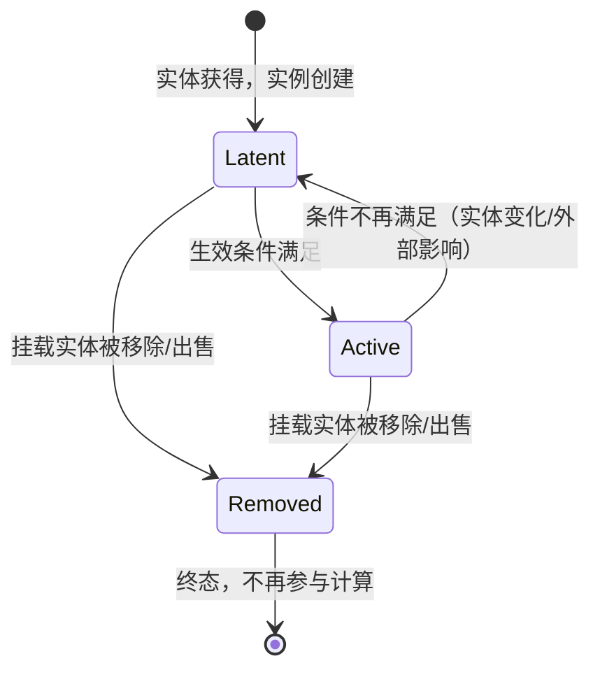

# Affector 效果体系统

> **状态说明**：本文件为 Affector 系统的**原始策划源文档**。核心定义已合并入 [[03-data-structures]]（实体定义）与 [[04-systems-modules]]（AffectorEngine 模块）。本文件保留策划推导过程、场景示例与克制边界，作为设计依据。

> 本文档定义统一的效果管理概念 **Affector（效果体）**。
> 它是决定"游戏运行时玩家的资源获取、操作权、可见度、流程控制"的统一抽象，
> 伴随游戏实体的 **获得 → 变化 → 出售/移除** 生命周期决定大多数实体的运行状态。
>
> 设计原则：Effect（数值原语）停留在底层只做数值修改；Affector 在上层管理"何时生效、挂载在哪、随生命周期如何转换"。

## 为什么需要 Affector

现有系统的割裂点：

| 现状问题 | 表现 |
|----------|------|
| 效果来源分散 | 角色持有效果、Enhancement 效果、物品拾取效果、剧情持续特效各自为政，无统一概念 |
| 生命周期缺失 | EffectEngine 只负责编译缓存，不感知"实体被出售/移除后效果该怎样" |
| 影响面单一 | 现有 EffectDef 只能改数值，无法表达"禁止出售某物品""剧情锁""强制可见"等非数值影响 |
| 无统一状态 | 效果实例没有明确的 Latent/Active/Removed 状态机，无法表达"挂起但未移除" |

Affector 统一解决：**条目（Entry）→ 包装（Pack）→ 挂载（Mount）→ 实例（Instance）→ 引擎（Engine）→ 派生到各系统**。

## 抽象层级总览

```
┌─────────────────────────────────────────────────────┐
│  派生层：数值 / 操作权 / 可见度 / 流程控制（消费方）      │
│  EffectEngine   OperationGate   VisibilityEngine    │
│              FlowControlGate                         │
└───────────────────────┬─────────────────────────────┘
                        │ 派生输出（编译/广播）
┌───────────────────────▼─────────────────────────────┐
│  引擎层：AffectorEngine                              │
│  - 挂载/卸载效果体实例                                │
│  - 监听实体生命周期事件，驱动状态转换                    │
│  - 重算条件满足情况，决定 Latent/Active                │
└───────────────────────┬─────────────────────────────┘
                        │ 实例注册
┌───────────────────────▼─────────────────────────────┐
│  运行时层：AffectorInstance（状态机三态）               │
│  Latent --> Active --> Removed                       │
│  （挂载实体获得/变化/出售 触发转换）                     │
└───────────────────────┬─────────────────────────────┘
                        │ 引用
┌───────────────────────▼─────────────────────────────┐
│  定义层：AffectorPack（效果包装）-> AffectorEntry[]     │
│  AffectorEntry：EffectDef[] + OperationRight[]       │
│               + VisibilityInfluence[] + FlowControl[]│
└───────────────────────┬─────────────────────────────┘
                        │ 使用
┌───────────────────────▼─────────────────────────────┐
│  原语层：EffectDef / EffectEngine（现有系统，保留）     │
│  只管数值修改，不感知生命周期                           │
└─────────────────────────────────────────────────────┘
```

## 层级 0：Effect（数值原语，保留现有系统）

- `EffectDef`：定义一次数值修改（Multiply/Add/Set/Unlock + target + value + duration）
- `EffectEngine`：编译修饰符缓存，提供 `getModifiedValue(target, base)`
- **职责边界**：只做数值聚合，不感知来源实体的生命周期，不感知非数值影响

> Affector 不重命名、不替换 Effect。Effect 是 Affector 底层的内容载体之一。

## 层级 1：AffectorEntry（效果条目）

一个**自包含的效果单元**：一段生效内容，声明自己在满足什么条件时，对哪些目标施加哪些影响。

| 字段 | 类型 | 说明 |
|------|------|------|
| id | String | 唯一标识 |
| name | String | 显示名（供 UI 展示/日志） |
| condition | Condition? | 生效条件（为空 = 常驻生效） |
| effects | EffectDef[] | 数值影响（复用现有 EffectDef） |
| rights | OperationRight[] | 操作权声明 |
| visibility | VisibilityInfluence[] | 可见度影响 |
| flowControls | FlowControl[] | 流程控制 |
| priority | int | 优先级（同目标冲突时的裁决，大者优先） |
| tags | String[] | 标签 |

**规则**：
- 一条目可同时含四类影响，也可只含其中任意子集（如纯操作权条目、纯可见度条目）
- `condition` 仅作用于该条目的生效与否，不影响同包装其他条目
- `priority` 只在同类影响作用于同一目标时参与裁决

## 层级 2：AffectorPack（效果包装）

**一个被挂载的条目集合**。包装是"挂到实体上的东西"，一个包装可以包含多条条目，并声明自己的生命周期语义。

| 字段 | 类型 | 说明 |
|------|------|------|
| id | String | 唯一标识 |
| name | String | 包装名 |
| entries | AffectorEntryRef[] | 条目引用列表（可引用共享条目库） |
| source | MountSource | 挂载来源定义 |
| inheritOnTransfer | bool | 实体转换（如 Init 切换）时是否跟随继承 |
| priority | int | 包装级优先级（整体高于/低于其他包装时裁决） |

### MountSource（挂载来源）

声明"谁携带这个包装、以什么方式携带"。

| 字段 | 类型 | 说明 |
|------|------|------|
| type | enum { init, area, spot, enhancement, character, item, story, tag, player } | 携带实体类型 |
| entityId | String? | 指定具体实体 ID（null = 匹配 type 下所有） |
| acquisition | enum { on_acquire, on_first_enter, on_complete, on_trigger, manual } | 何时挂载 |

## 层级 3：AffectorInstance（效果体实例）

运行时挂载在具体实体上的实例，携带状态机。

| 字段 | 类型 | 说明 |
|------|------|------|
| instanceId | String | 实例唯一 ID |
| packId | String | 引用的包装定义 ID |
| mountEntityId | String | 挂载的实体 ID |
| mountEntityType | enum { init, area, spot, enhancement, character, item, story, tag, player } | 挂载实体类型 |
| state | enum { Latent, Active, Removed } | 当前状态 |
| activeEntryIds | String[] | 当前处于生效的条目 ID 子集 |
| activatedAtTick | int? | 进入 Active 的时间戳（tick 数） |
| removedAtTick | int? | 进入 Removed 的时间戳 |
| reason | String? | 状态转换原因（供日志/调试） |

### 状态机（三态）



转换规则：
- **Latent**：包装已挂载但条目条件未满足。实例存在、不产生任何影响
- **Active**：条件满足。四类影响全部派生到消费方
- **Removed**：挂载实体生命周期终结（出售/移除/剧情完结）。终态不可逆
- 实体**升级/变化**不直接改变状态，但会重新求值 condition（值引用实体等级，自动跟随变化）

## 层级 4：AffectorEngine（效果体引擎）

**职责**：挂载/卸载实例、监听实体生命周期事件、驱动状态转换、将生效条目派发到各消费系统。

| 方法 | 说明 |
|------|------|
| `mount(packId, entityId, entityType)` | 创建 AffectorInstance，加入注册表 |
| `unmount(instanceId, reason)` | 移入 Removed，撤销其所有影响 |
| `recheck(instanceId)` | 重求值该实例全部条目的 condition，更新 Latent/Active |
| `recheckAll()` | 全局重检（加载存档/Init 切换后） |
| `getActiveInstances()` | 查询所有 Active 实例 |
| `getActiveEffects()` | 汇总当前全部生效条目 → 交 EffectEngine 编译 |
| `getRights(entityId, operation)` | 汇总操作权 → 交 OperationGate 判定 |
| `getVisibility(entityId)` | 汇总可见度影响 → 交 VisibilityEngine 应用 |
| `getFlowState(target)` | 汇总流程控制 → 交 FlowControlGate 判定 |

### 生命周期监听

AffectorEngine 作为数据反射总线的订阅方，订阅以下 EventBus 事件，驱动转换（这些事件全部属于**游戏数据反射域**，不承载 UI 展示类内容）：

| 事件 | 触发动作 |
|------|----------|
| `SpotPurchased` / `EnhancementPurchased` / `CharacterUnlocked` / `ItemGiven` | 挂载 on_acquire 类型的包装；recheck 受影响实例 |
| `SpotUpgraded` / `EnhancementUpgraded` | recheck 挂载于该实体的实例（值引用等级自动更新） |
| `ItemUsed` / `ItemRemoved` / 出售事件 | 卸载挂载于该物品的实例（Removed） |
| `AreaEntered` / `AreaExplored` | 挂载 on_first_enter 类型包装 |
| `StoryCompleted` | 挂载/卸载 on_complete 类型包装 |
| `InitChanged` | 处理 inheritOnTransfer；recheckAll |
| `SaveLoaded` | recheckAll（重建实例注册表） |

## 影响面定义

### 1. OperationRight（操作权声明）

控制"玩家能否对某实体执行某操作"。

| 字段 | 类型 | 说明 |
|------|------|------|
| operation | enum { purchase, upgrade, sell, use, travel, start_story, chat } | 被控制的操作 |
| scope | enum { entity, tag, category, all } | 作用范围 |
| target | String? | 具体目标 ID（scope=entity 必填） |
| mode | enum { allow, deny } | 允许（绕过常规限制）或禁止 |
| reason | String? | 给玩家的原因文案（被禁止时显示） |

语义：
- `allow`：即使常规条件不满足，也放行该操作（解锁/例外权）
- `deny`：即使常规条件满足，也拦截该操作（封锁/剧情锁）
- 多个声明冲突 → 以 priority 高者为准；同 priority → `deny` 优先（安全默认）

### 2. VisibilityInfluence（可见度影响）

强制/提升/压制某实体的可见度级别（与 [[04-systems-modules#VisibilityEngine]] 的 0-5 级联动）。

| 字段 | 类型 | 说明 |
|------|------|------|
| entityId | String | 目标实体 |
| mode | enum { force, atLeast, suppress } | force=设为指定值；atLeast=至少达到；suppress=压到低于 |
| level | int | 可见度级别 |

### 3. FlowControl（流程控制）

控制叙事/移动流程的开关（区别于实体操作权，作用于流程节点）。

| 字段 | 类型 | 说明 |
|------|------|------|
| target | enum { active_story, passive_story, chat, travel, init } | 流程类型 |
| subject | String? | 目标实体 ID（null = 全局该流程） |
| allowed | bool | 是否允许 |
| reason | String? | 原因文案 |

典型场景：剧情持续特效"当前世界线聊天暂不可用"、"某些 ActiveStory 在持有某物品后才解锁入口"。

## 派生输出与消费方

```
AffectorEngine（Active 条目汇总）
  |
  |-- effects 汇总 --> EffectEngine --> 数值聚合 -> 资源/产出/上限
  |-- rights 汇总 --> OperationGate --> GameInstance 操作前校验
  |-- visibility 汇总 --> VisibilityEngine --> UI 可见性
  |-- flowControls --> FlowControlGate --> 剧情/聊天/移动流程判定
```

### OperationGate 与 FlowControlGate

新增两个轻量校验门（或并入 GameInstance，实现阶段二选一）：

| 门 | 职责 | 判定顺序 |
|----|------|----------|
| OperationGate | 操作执行前的权限判定 | Affector deny → 拦截；Affector allow → 放行；否则走常规条件/价格校验 |
| FlowControlGate | 流程节点的开关判定 | Affector 声明 allowed=false → 封锁；否则走常规可见/解锁逻辑 |

## 与现有系统的边界

| 系统 | 关系 |
|------|------|
| EffectDef / EffectEngine | 保留为底层数值原语。Affector 的 effects 数组直接复用 EffectDef |
| VisibilityEngine | 保留。Affector 的 visibility 影响作为**额外输入源**合并进可见度计算 |
| ConditionSystem | 复用。AffectorEntry.condition 与 OperationRight/FlowControl 的判定条件均走 ConditionSystem |
| FuncletExecutor | 复用。Affector 的 effects 中如含 Funclet 类操作（如剧情奖励）仍由 FuncletExecutor 执行 |
| 实体定义 | Spot/Enhancement/Character/Item 等实体的 `effects: EffectDef[]` 字段逐步**迁移为 `affectorPacks: AffectorPackRef[]`**，保留字段在迁移期兼容 |
| PlayerState | 不直接持有 Affector 数据；实例注册表由 AffectorEngine 运行时维护，随实体生命周期变化 |

## 存档考虑

- **不存档** AffectorInstance 的派生缓存（Active/Latent 判定结果）——加载后由 `recheckAll()` 重建
- **存档** 挂载事实：实体持有/解锁状态本身即决定了哪些包装被挂载（从实体状态反推）
- 个别需要持久状态的效果（如"某剧情导致的永久 buff"）需在包装定义上标记 `persistent: true`，存档该实例的 state 与 activatedAtTick

## 场景示例

### 示例 1：物品"阿罗娜的护身符"

```
ItemDefinition: arona:item:charm
  affectorPacks: [charm_buff_pack]

AffectorPack: charm_buff_pack
  source: { type: item, acquisition: on_acquire }
  inheritOnTransfer: true
  entries:
    - { id: charm_res_gain, effects: [Multiply target=resource:gold:gain value=+0.1] }
    - { id: charm_vis, visibility: [ { entityId: arona:area:hidden, mode: atLeast, level: 2 } ] }
```

生命周期：
1. 玩家获得护身符 → `ItemGiven` → AffectorEngine.mount → instance Active → 金资源获得 +10%
2. 玩家使用/出售护身符 → `ItemUsed`/`ItemRemoved` → unmount → Removed → 效果撤销

### 示例 2：剧情持续特效"当前世界线的教学封锁"

```
AffectorPack: tutorial_lock_pack
  source: { type: story, entityId: arona:story:prologue, acquisition: on_first_enter }
  entries:
    - { id: lock_chat, flowControls: [ { target: chat, allowed: false, reason: "世界线尚未稳定…" } ] }
    - { id: lock_travel, rights: [ { operation: travel, scope: all, mode: deny } ] }
```

生命周期：
1. 首次进入剧情区域 → `AreaEntered` → mount → Active → 聊天禁用、移动封锁
2. 剧情完成 → `StoryCompleted` → unmount → Removed → 恢复正常

### 示例 3：Enhancement 随等级变化的包装

```
AffectorPack: enh_abydos_income_pack
  source: { type: enhancement, entityId: arona:enh:abydos_income }
  entries:
    - id: lv_scaled
      condition: { type: Cmp, left: { type: EnhancementLevel, enhancementId: arona:enh:abydos_income }, cmp: Gte, right: { type: Const, value: 3 } }
      effects: [ Multiply target=spot:abydos:rehab:production value=+0.5 ]
```

生命周期：
1. 购买该 Enhancement（等级 1）→ mount，但 condition 不满足 → **Latent**
2. 升级到 3 级 → `EnhancementUpgraded` → recheck → condition 满足 → **Active**，产出 +50%

## 克制边界（明确不做）

- 不做 Affector 间的复杂依赖图/传播计算——所有影响在 Active 时一次性派生
- 不做效果实例的可视化调试面板（早期阶段）
- 不引入"效果优先级覆盖链"之外的更复杂仲裁机制
- OperationGate/FlowControlGate 不独立成模块，先并入 GameInstance 的判定逻辑

## 术语表

| 术语 | 定义 |
|------|------|
| Affector | 效果体，统一管理"生效效果"的概念 |
| AffectorEntry | 效果条目，自包含的影响单元 |
| AffectorPack | 效果包装，被挂载的条目集合 |
| AffectorInstance | 效果实例，运行时状态载体 |
| MountSource | 挂载来源，声明谁携带包装、何时挂载 |
| OperationRight | 操作权声明，控制实体操作的允许/禁止 |
| VisibilityInfluence | 可见度影响，强制/提升/压制实体可见级别 |
| FlowControl | 流程控制，叙事/移动流程的开关 |
| OperationGate | 操作权限校验门 |
| FlowControlGate | 流程开关校验门 |

