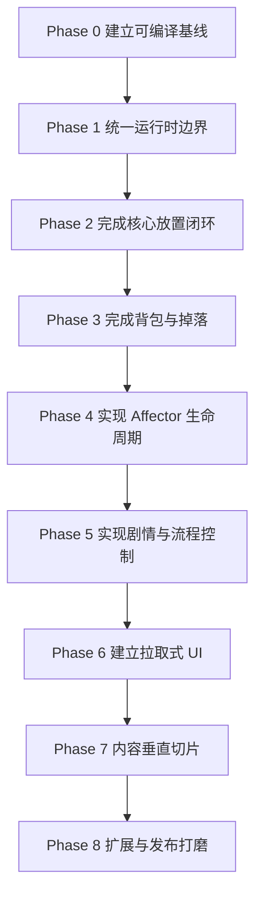

# AronaClicker 实现路线图

> 本文档以当前 `src/` 旧原型为真实起点，描述如何逐步迁移到现行策划目标。
> `01-09` 主要回答“最终要设计什么”；本文回答“按什么顺序把它做出来”。

## 当前基线

## 实施进度

### Phase 0：已完成

- TypeScript 类型检查通过
- 旧原型的跨模块 import 边界已修复
- `npm test` 通过

### Phase 1：已完成

- 新增 `StateMutationService`
- 资源、Spot、Manager、Init、背包基础写入统一经过该服务
- `GameInstance.getView()` 已提供脱离状态引用的只读快照
- 新增状态写入与视图快照测试

### Phase 2：已完成

- Init 进入时根据 Area 默认配置初始化 Spot
- `GameInstance.tick()` 返回 `TickResult`
- Tick 产出通过统一状态写入服务进入资源状态
- 产出结果与容量截断已有测试覆盖

### Phase 3：已完成

- ItemDef 支持使用条件、使用效果、拾取效果和出售价格字段
- DropTableDef 已注册到 Registry
- `giveItem()`、`useItem()`、`rollDropTable()` 已接入 GameInstance
- `maxStack` 已生效
- 基础物品、基础掉落表和集成测试已加入

### Phase 4：基础闭环已完成

- 新增 AffectorEntry / AffectorPack / AffectorInstance 运行时类型
- 新增 `AffectorEngine`
- 支持 Latent / Active / Removed 三态
- 物品获得时按 ItemDef 自动挂载 AffectorPack
- 物品移除或使用时卸载实例
- Spot 等级变化时重检挂载实例
- EventBus 已支持 Affector 状态反射事件

### 当前验证结果

```text
npx tsc --noEmit  通过
npm test          通过：11 个测试文件，93 个测试
npm run build     通过：Vite 生产构建
```

当前下一阶段为 Phase 5：剧情流程。

### 已存在的原型能力

- TypeScript + Vitest 工程结构
- 基础数据包与 Registry
- `PlayerState` 基础状态
- Resource / Spot / Manager / Character 数据
- Spot 定时产出与容量限制
- 基础 ValueExpression 求值
- 基础 Condition / ConditionGroup 求值
- 基础 EventBus
- 基础 Effect 状态修改器
- 基础 Item 类型与 LootSystem 骨架
- 基础 VisibilitySnapshot
- LocalStorage 单存档
- 84 个测试通过

### 当前阻塞

`npm test` 当前通过，但 `npx tsc --noEmit` 失败。主要问题是旧原型的模块边界不一致：

- 多个模块从 `types.ts` 导入实际定义在其他文件中的类
- `SpotTimer` 定义在 `tick-system.ts`，但由 `game-instance.ts` 从 `types.ts` 导入
- `ConditionSystem` 的 `manager` 比较存在错误类型比较
- `FuncletExecutor` 尚未真正执行状态修改，只完成了表达式求值
- `EffectEngine` 实际承担状态修改职责，与目标中的底层数值修饰职责不一致
- `LootSystem` 返回掉落结果，但不负责完整地写入背包和执行获得效果
- 没有 `AffectorEngine`
- 没有正式 `src/ui` 入口，`package.json` 的 `dev` 脚本暂时没有可用页面

## 总体策略

不直接在旧原型上继续叠加完整策划系统，采用以下迁移原则：

1. 先修复类型与依赖边界，让原型可以稳定构建。
2. 先统一状态修改入口，再实现新的效果生命周期。
3. 先完成一个可玩的垂直切片，再扩展内容和数据包能力。
4. EventBus 只保留游戏数据反射，不让 UI 依赖它。
5. 每个阶段都必须有可执行测试和明确的验收结果。
6. 不为未来可能需要的功能提前实现复杂兼容层。

## 阶段总览



## Phase 0：建立可编译基线

### 目标

让当前旧原型在类型检查、测试和启动入口三个层面都可验证。

### 工作内容

- 修正所有跨模块 import，禁止从 `types.ts` 反向导入运行时类
- 将共享纯类型留在 `types.ts`
- 将 `SpotTimer` 等运行时类型放入明确的 `runtime-types.ts` 或所属模块导出
- 修复 `ConditionSystem` 的 Manager 条件类型
- 为 Node 测试环境与浏览器运行环境区分存储后端
- 保留现有测试，补充一个最小 `tsc --noEmit` 验证脚本
- 清理无效的 `EffectEngine` / `FuncletExecutor` 重复职责

### 验收标准

- `npm test` 通过
- `npx tsc --noEmit` 通过
- `npm run dev` 能加载一个最小页面或明确的开发占位页
- 不改变当前已通过测试覆盖的行为

### 不做

- 不实现 Affector
- 不重写所有数据结构
- 不开始 UI 美化

## Phase 1：统一运行时边界

### 目标

建立稳定的状态读写边界，为后续背包和 Affector 提供唯一入口。

### 核心调整

#### PlayerState

保留当前状态，但明确以下约束：

- 只有 `GameInstance` 和指定的状态服务可以修改 `PlayerState`
- UI 只能读取 `GameView`
- 数据包定义不能直接修改运行时状态
- 所有重要状态变化必须经过统一服务

#### 状态修改服务

把当前分散在 `GameInstance`、`EffectEngine`、`LootSystem` 中的直接修改收拢为有限操作：

- `changeResource`
- `changeSpotLevel`
- `changeManager`
- `addEnhancement`
- `addItem`
- `removeItem`
- `setFlag`
- `unlockInit`
- `completeStory`

这些操作负责：

- 校验输入
- 修改状态
- 发布数据反射事件
- 返回结构化结果

### EventBus 目标边界

保留 EventBus，但只允许以下用途：

- 数据源发布状态变化
- AffectorEngine / EffectEngine / VisibilityEngine 订阅并重算派生状态
- 不提供 UI 订阅接口语义
- 不发布剧情展示、掉落动画、产出日志等 UI 事件

### 验收标准

- 任意资源和背包变更都能追踪来源
- GameInstance 不再直接调用多个模块修改同一字段
- 事件类型集中在数据反射域
- 原有测试迁移后继续通过

## Phase 2：完成核心放置闭环

### 目标

让玩家可以完成“进入 Init → 解锁 Spot → 自动产出 → 升级 Spot → 分配角色”的完整循环。

### 工作内容

- 明确新游戏初始资源和默认 Spot 规则
- 修复 Spot 解锁、升级、生产之间的语义差异
- 将产出公式固定为：

```text
最终产出 = 基础产出 + 等级增量 + Manager 加成
```

- 将容量限制、生产间隔、离线收益集中到 TickSystem
- 让 `tick()` 返回 `TickResult`，而不是依靠 UI 监听生产事件
- 让 CharacterSystem 只负责角色查询与 Manager 关系
- 暂时不接入复杂 Effect/Enhancement

### 验收标准

- 一个新玩家无需调试代码即可完成至少一次 Spot 升级
- 运行 60 秒能获得可预测资源
- 离线 10 分钟后重新加载可以获得离线产出
- Spot、Manager、资源的测试覆盖正常和边界情况

## Phase 3：完成背包与掉落

### 目标

让 Item 成为真正可获得、可堆叠、可消费、可持久化的游戏实体。

### 数据收敛

当前 `ItemDef` 需要补齐：

- `type`
- `maxStack`
- `rarity`
- `useCondition`
- `useEffects`
- `pickupEffects`
- `sellPrice`

DropTable 需要从单纯的 `DropTableEntry[]` 升级为独立定义：

- `id`
- `entries`
- `guaranteed`
- `maxRolls`
- 表级条件

### 工作内容

- 实现 `addItem` 的 `maxStack` 限制
- 实现 `removeItem` 的数量校验
- 实现 `useItem`
- 实现 `sellItem`
- LootSystem 只负责抽选，不直接修改 PlayerState
- 由统一状态修改服务接收 LootSystem 返回结果并写入背包
- 物品获得后执行 `pickupEffects`
- 物品使用前执行 `useCondition`
- 将 inventory 纳入 SaveData

### 验收标准

- 物品可以从掉落表进入背包
- 相同物品按 `maxStack` 堆叠
- 数量不足时不能使用或出售
- 使用物品的消耗与效果是原子的
- 刷新页面后背包内容不丢失
- 掉落表随机测试可通过固定随机源验证

## Phase 4：实现 Affector 生命周期

### 目标

实现 [[09-affector-system]] 设计中的核心最小版本，让生效效果不再散落在各实体逻辑中。

### 第一版范围

只实现三态：

```text
Latent → Active → Removed
```

允许：

- Spot / Enhancement / Character / Item / Story 挂载 AffectorPack
- 条件决定 Entry 是否 Active
- 实体升级后重新求值
- 实体被移除、出售或消耗后进入 Removed
- Active 的数值条目进入 EffectEngine
- Active 的可见度条目进入 VisibilityEngine
- Active 的操作权由 GameInstance 查询

### 实现顺序

1. `AffectorEntry` 与 `AffectorPack` 类型
2. Registry 注册与引用校验
3. `AffectorInstance` 运行时状态
4. `AffectorEngine.mount/unmount/recheck`
5. 接入 `SpotPurchased` / `SpotUpgraded` / `ItemGiven` / `ItemRemoved`
6. 接入数值派生
7. 接入操作权查询
8. 接入可见度影响

### 暂不实现

- 复杂效果依赖图
- 效果编辑器
- 多层 priority 仲裁
- 网络同步
- 完整 FlowControlGate 独立模块

### 验收标准

- 获得物品后可激活持有型 Affector
- 物品消耗/出售后 Affector 进入 Removed
- Enhancement 升级可以使 Latent 条目变为 Active
- Affector 的数值影响可以改变 Spot 产出
- Affector 的可见度影响可以改变实体可见状态
- 加载存档后可以从实体状态重建非持久实例

## Phase 5：实现剧情与流程控制

### 目标

完成一条可从头玩到尾的短剧情，而不是先铺设大量空数据。

### 工作内容

- `StoryDef` 支持页面推进
- ActiveStory 与 PassiveStory 分开处理
- `startStory()` 返回初始页面
- `advanceStory()` 返回下一页面或完成结果
- Story 完成后通过数据反射事件通知 AffectorEngine
- 选择项条件使用 ConditionSystem
- 选择结果写入 storyLog 或 flags
- 剧情奖励统一走状态修改服务
- 将故事入口可见性接入 VisibilityEngine

### 第一条垂直剧情建议

只制作：

- 1 个 Init
- 1 个 Area
- 1 条 ActiveStory
- 3 条 PassiveStory
- 2 个物品奖励
- 1 个持续型 Affector

### 验收标准

- 新玩家可以触发起始剧情
- 可以推进至少一个选择分支
- 故事完成后获得物品或资源
- 故事完成会影响至少一个实体的可见度或操作权
- 刷新页面后故事完成记录保留

## Phase 6：建立拉取式 UI

### 目标

提供一个最小但完整的 Web 游戏界面，不让 UI 依赖 EventBus。

### UI 结构

- 顶部：资源与离线收益
- 左侧：Init / Area 导航
- 中部：当前 Area、Spot、剧情内容
- 右侧：背包、角色、当前生效 Affector 摘要

### 引擎接口

实现：

```ts
getView(): GameView
```

`GameView` 只读包含：

- resources
- activeInit
- currentArea
- spots
- managers
- inventory
- characters
- stories
- visibility
- activeAffectors
- operation availability

### 刷新策略

- 用户操作结束后主动调用 `getView()`
- Tick 数值使用低频定时轮询
- 剧情页面使用 API 返回值立即刷新
- 不订阅 EventBus

### 验收标准

- `npm run dev` 能启动页面
- 可以完成一轮 Spot 购买/升级
- 可以打开背包并使用物品
- 可以推进一条剧情
- 页面刷新后存档恢复正常
- UI 不直接访问 PlayerState 可写引用

## Phase 7：内容垂直切片

### 目标

使用少量真实内容验证整体体验，而不是继续扩充引擎抽象。

### 内容规模

- 1-2 个 Init
- 3-5 个 Area
- 8-12 个 Spot
- 5 个 Enhancement
- 8-12 个角色
- 10 个左右 Item
- 1 个完整 ActiveStory
- 10-15 个 PassiveStory

### 验收标准

- 首次游玩 10 分钟内能理解循环
- 第一次升级在前 2 分钟内发生
- 第一个物品在前 5 分钟内获得
- 第一条主线在 15-30 分钟内完成
- 不需要开发者控制台才能继续推进

## Phase 8：扩展与发布打磨

只有 Phase 7 稳定后才进行：

- 多 Init 内容
- 更完整的 Datapack 查询
- 外部 JSON 数据包
- 多存档位
- 迁移脚本
- 移动端适配
- UI 主题与素材
- 性能优化
- 数据包内容校验工具

## 任务优先级

### P0：不完成就不能继续

- TypeScript 编译通过
- 统一状态修改入口
- 基础 Tick 闭环
- Save/Load 可用
- `getView()` 可用

### P1：形成可玩的原型

- 背包完整闭环
- 一条剧情
- Affector 最小闭环
- 最小 Web UI

### P2：丰富内容

- Enhancement
- 更多角色
- 更多物品
- PassiveStory
- 多 Init

### P3：工具与扩展

- 外部数据包
- 编辑器
- 多存档
- 内容验证器

## 不建议的开发顺序

- 不要先实现完整 Affector 仲裁和复杂优先级
- 不要先实现外部 Datapack 热加载
- 不要先添加大量角色枚举
- 不要在没有 UI 垂直切片前制作几十条剧情
- 不要同时保留多个互相修改 PlayerState 的执行器
- 不要用 EventBus 代替所有直接方法调用

## 当前下一步

当前最合理的第一批任务是：

1. 修复 `npx tsc --noEmit` 的所有错误。
2. 将 `EffectEngine` 与 `FuncletExecutor` 的职责拆开。
3. 让 `LootSystem` 通过统一状态修改入口完成物品发放。
4. 增加 `GameInstance.getView()`。
5. 创建最小 `src/ui` 页面。
6. 用一个物品和一个 Spot Affector 验证后，再实现完整 AffectorEngine。

## 进度记录格式

每个阶段完成时记录：

```markdown
### Phase X 状态
- 状态：未开始 / 进行中 / 已完成
- 完成日期：YYYY-MM-DD
- 通过测试：...
- 新增能力：...
- 未解决问题：...
- 是否允许进入下一阶段：是 / 否
```
